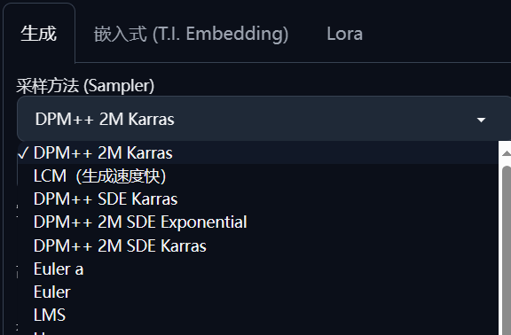
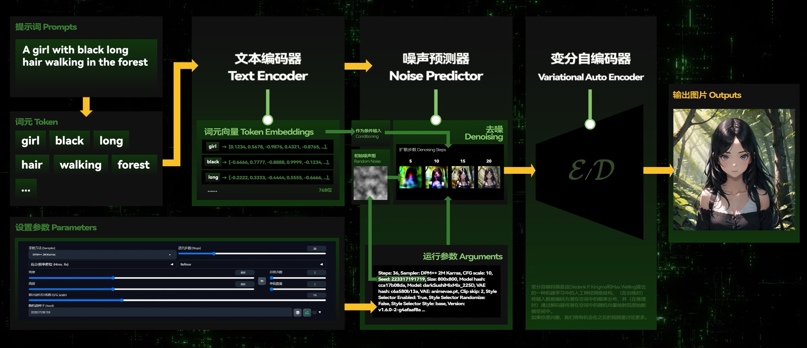
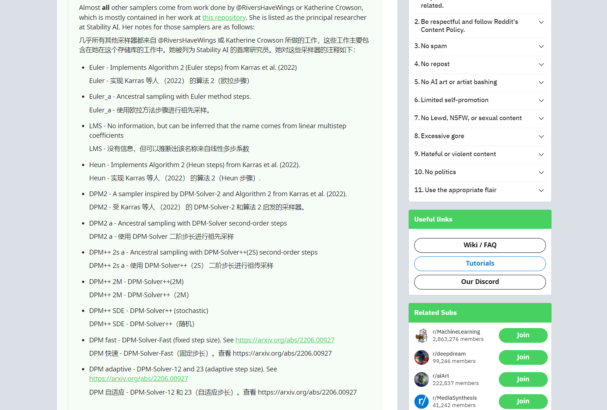
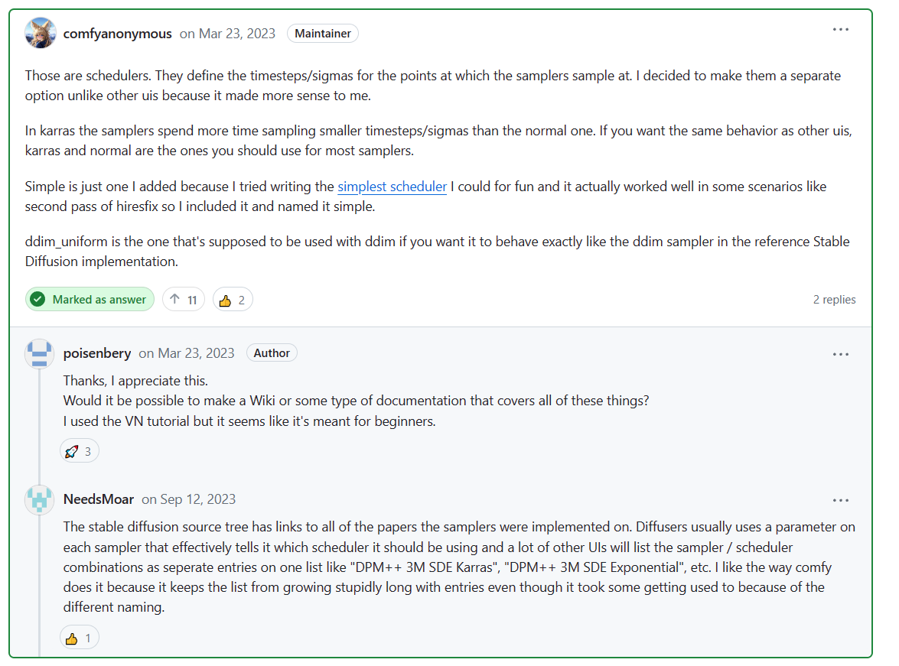

在WebUI里，所看到的“采样方法”是一个单一的参数选项，但在Comfy UI 的核心采样器 KSampler 里，它会被“拆分”成两个单独的选项：**Sampler Name（采样器名称）** 与 **Scheduler （调度器）**

SD WebUI 中的采样方法

ComfyUI KSampler 中的相关选项

回溯Stable Diffusion生成一张图片的“去噪过程”（参考Nenly同学的[模型训练入门课里的相关内容](https://www.bilibili.com/video/BV1TK411v7Jw?t=285.4)）：SD会经由随机种子生成一张随机噪声图，然后利用训练好的”噪声预测器“（U-Net），结合输入的提示词等“条件”（Conditioning），进行“条件去噪”，在这张噪声图上不断添加一些形象，使之成为一张生成的新图片。

而广义的**采样方法（Sampler）**，即代表在控制这个“去噪”过程的一种算法。简单地去理解，不同的算法会给你带来不同的采样结果，而不同算法对于采样步数的要求也可能会有些许差异。

如果想更深入地挖掘这里面的技术原理，可以在[Reddit上的这一篇回答里](https://www.reddit.com/r/StableDiffusion/comments/zgu6wd/comment/izkhkxc/?utm_source=share&utm_medium=web2x&context=3)，找到由 **@ManBearScientist** 撰写的这一篇回答，非常专业地列举了所有采样方法的来源与含义，以及它们是如何一步步积累取得今天的研究成果的。

那**调度器（Scheduler）** 呢？你可以把它看做是采样方法的一部分，主要用于控制采样过程中的时间步长。

大部分UI都会习惯将采样方法本身与调度器选项“合并”起来作为一种采样方法呈现给用户，但根据ComfyUI作者 **@ComfyAnonymous** 在[这一个Issue中的答复](https://github.com/comfyanonymous/ComfyUI/discussions/227)：我决定把它作为一个单独的选项，因为它对我来说更有意义。

> 这些是调度程序。它们定义采样器采样点的时间步长/西格玛。我决定将它们作为一个单独的选项，与其他 uis 不同，因为它对我来说更有意义。
>
> 在卡拉斯中，采样器花费的时间比正常时间更小的时间步长/西格玛。如果您想要与其他 uis 相同的行为，karras 和 normal 是您应该用于大多数采样器的行为。
>
> Simple 只是我添加的一个，因为我尝试编写[最简单的调度程序](https://github.com/comfyanonymous/ComfyUI/blob/master/comfy/samplers.py#L233)，以便好玩，它实际上在某些情况下运行良好，例如 hiresfix 的第二遍，所以我包含它并将其命名为 simple。
>
> ddim_uniform 是应该与 ddim 一起使用的那个，如果您希望它的行为与参考 Stable Diffusion 实现中的 ddim 采样器完全相同。

根据他的建议，如果希望各种采样器能与其他UI中保持大致一样的行为，只需要使用**Karras**或**Normal**即可。