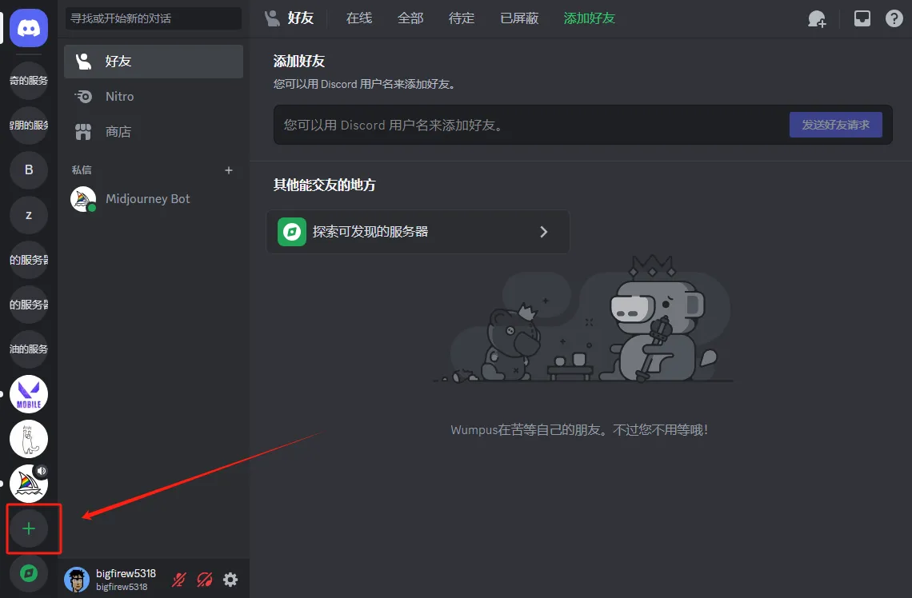
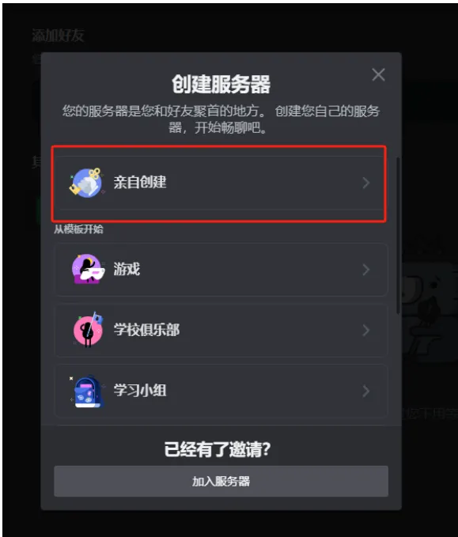
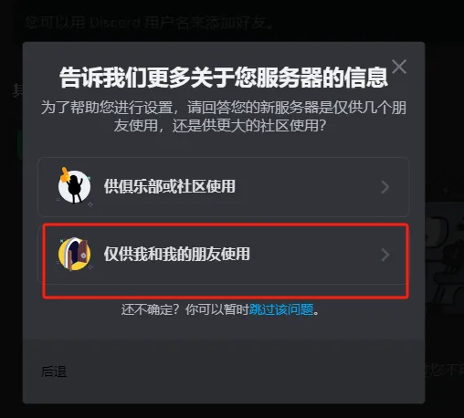
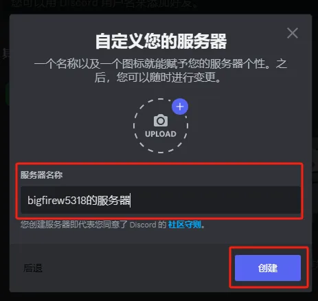
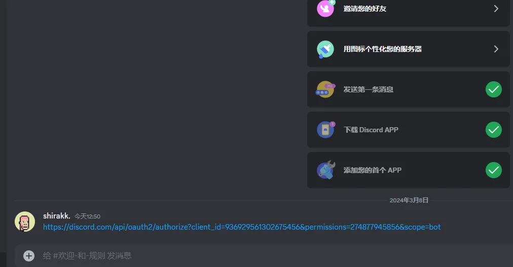
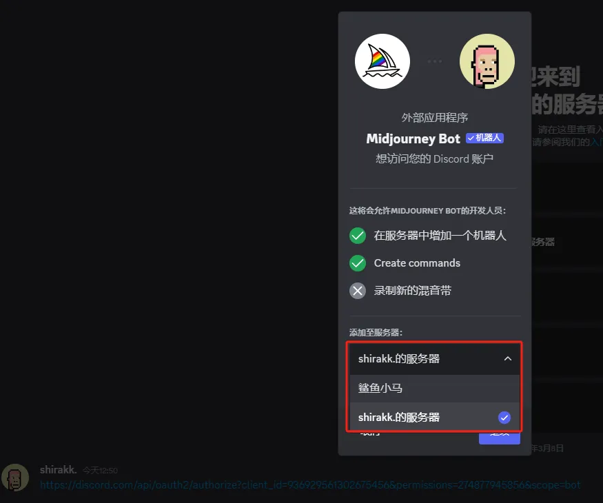
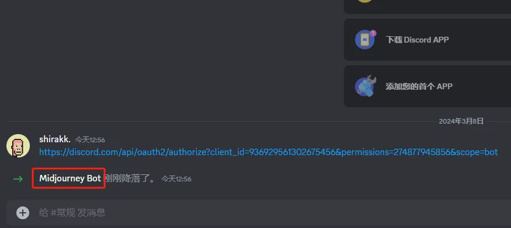

## 一、使用流程

使用Midjourney绘制你的第一张AI图只需三步：

1. 新建专属服务器

2. 添加Midjourney机器人

3. 开始绘画

## 二、基础创建步骤

### 第一步建立服务器🎨

添加一个自己的服务器（防止刷屏看不到自己的图），从左侧服务器向最下面找到加号。

创建自己的服务器（服务器名称用自己的） 

### 第二步添加机器人🎨

1、复制邀请链接>粘贴到对话框>回车发送>然后点开链接👇👇👇

https://discord.com/api/oauth2/authorize?client_id=936929561302675456&permissions=274877945856&scope=bot

2、点击一下链接，确认邀请加入>点击授权即可邀请成功

**3、已经邀请成功可以开始出图。**

### 第三步出图方法🎨

可以让AI帮你画图啦（搜索/imagine）在后面添加关键词

## 资料

Discord网址：https://discord.com/

文档资料：https://www.yuque.com/u32937722/qb6y63/kmhvqbx97gtn7wy5#V7bxK

