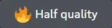

## 一、Midjourney命令列表🎨

可以通过输入命令与Discord上的Midjourney Bot (MJ机器人)进行交互。命令用于创建图像、更改默认设置、监视用户信息以及执行其他有用的任务。

Midjourney命令可以在任何机器人频道中使用，在允许Midjourney Bot运行的个人Discord服务器上使用，或者在与Midjourney Bot的直接消息中使用。

### 常用的命令：

| Midjourney命令 | 解释                                                         |
| ------------------------------ | ------------------------------------------------------------ |
| /imagine prompt                | 只能在这个命令prompt里面输入描述语才能生成图像               |
| /setting                       | 打开偏好设置，里面可以预设一些命令                           |
| /blend                         | 轻松地将多个图像混合在一起                                   |
| /show                          | 输入/show在jobid框里输入您的图库中所生成图像的作业ID后，你可以再次召唤和恢复自己的任何生成图像 |
| /fast                          | 切换快速模式，在快速模式下，您的生成图像将按增量计费。这模式生成图像较快 (订阅会员才能使用的模式) |
| /relax                         | 切换放松模式，在快速模式下，您生成图像可以无限使用，但这模式生成图像较慢。(30天和企业会员可无限使用这个模式) |
| /prefer suffix                 | 重置你的偏好设置（有时生成图片时会出现一些自己明明未添加的指令，却提示错误，可以执行一下这个命令） |
| /remix                         | 切换混音模式 (可以让你在重生成或者变化图片时修改描述语)      |
| /stealth                       | 对于专业计划(60美元/月)的用户切换到隐身模式                  |
| /public                        | 切换公共模式，在公共模式下，你生成的图像在画廊中对任何人都是可见的 |
| /subscribe                     | 创建一个指引您当前Discord账户会员订阅页面链接 (无需登录会员) |
| /prefer option                 | 创建或管理自定义选项。                                       |
| /prefer option list            | 查看当前自定义选项                                           |
| /help                          | 显示有关Midjourney机器人相关的信息和提示                     |

### 不常用的命令：

| Midjourney命令 | 解释                                                 |
| ------------------------------ | ---------------------------------------------------- |
| /ask                           | 在question框里输入你的问题，你会得到一个问题的答案。 |
| /daily_theme                   | 切换#每日主题频道更新的通知ping                      |

### 弃用的命令：

|                           |                                                              |
| ------------------------- | ------------------------------------------------------------ |
| /private (替换为/stealth) | 切换私人模式，在私人模式下，你生成的图像仅你可见，使用私人模式需开通每月60美元的会员 |
| /pixels                   |                                                              |
| /idea                     |                                                              |

### 指令和参数列表

指令参数可更改图像的生成方式。指令参数可以更改图像的纵横比、在 Midjourney模型版本之间切换、更改使用的偏好设置等等。

指令参数是添加到描述语后面的末尾。您可以在描述语中添加多个指令参数。

注：

1. 需要指令格式、符号和空格，错了会失效。
2. 许多 Apple 设备会自动将双连字符 (--) 更改为破折号 (—)。Midjourney 两者都支持！

## 二、Midjourney后辍参数用途🎨

 --ar调整图片的长宽比例  如:--ar3:2表示生成的图片比例为3(长):2(宽) 

--q+数值   生成图片的质量，数值范围0.25-5，数值越大细节质量越丰富，也需要更长的生成时间如

--q2表示生成更高质量的图片 

--s+数值  生成图片的个性化强度，数值范围0-1000，数值越大生成图像个性化越强

如:--s750表示生成的图像个性化较强 

--iw+数值    设置图片参数权重，数值范围0.25-2   数值越大 生成图片与参考图越相似

版本切换

--version或--v 算法：现在默认是新算法--v5，表示用的什么版本如:（--v 5）表示使用V5版本 

Niji

--niji：把midjourney切换为niji・journey，这是新的专注于动漫风格的图像模型。

测试算法test

--test：和--upbeta比较类似，Midjourney特殊测试模型，应用--test后，生成的图片会由四张变为一张

测试算法testp

--testp：和--upbeta比较类似，Midjourney 特殊的以摄影为重点的测试模型，应用--testp后，生成的图片会由四张变为一张

老版本的HD算法

--hd：该算法可能更适合较大的图像，生成更高清的图，四图的构图不一致性。适合用于风景画、抽象画适合用于风景画、抽象画。这也可以生成更高分辨率的图像，而无需放大。

基本指令：

纵横比

-aspect n:m或--ar n:m：n是长，m是宽，例如--ar 16:9，可以输出长宽比为16:9的图片。注意冒号必须使用英文的冒号，中文冒号会不生效，ar后面必须空一 格再输入，否则可能不生效。

V4风格切换

--style 4a, 4b或4c：在Midjourney模型版本V4风格之间切换

无缝图案

--tile：用于生成四方连续无缝图案，结合--upbeta一起使用。

seed种子

--seed 种子：获取了自己生成图像的seed种子后，可以参考图像风格和内容生成新的图像 (获取图像的seed种子，可在这个图像内容右上角发[信封]图标，就可以收到图像信息的消息)

风格化

--stylize或--s 数值：让你生成的图像更具风格化和想象力，你设置的数值越高，它就越天马行空。默认值为2500，值范围625-60000

风格各异

--chaos 数值：生成四张风格各异的图像，数值必须在0-100之间。较高的值让生成的图像风格更不同

质量

--quality或--q 数值：生成图片的质量和时间。默认值为1，值越高，生成时间越长，质量越高。只能输入0.25、0.5、1、2、5这五个数值。（如果使用默认值，就无需加入这个指令）

移除对象

--no 对象：--no 加具体物品，出图将不包含该物品，例如，输入--no grass 画面会尝试移除草。这就像给它赋予-0.5的权重 如:--no red表示图像中不要出现红色 

停止生成百分比

--stop 数值：按生成完成度百分比停止生成图像。必须在10-100之间。这目前只对四图有效，该模式不适用于升级大图

升级器指令：

Midjourney首先为每个作业生成一个低分辨率图像选项网格。您可以在任何网格图像上使用Midjourney upscaler来增加尺寸并添加更多细节。有多种可用于放大图像的放大模型。

beta升级器

--upbeta：选择U按钮时，使用替代的 beta 升频器。结果更接近原始网格图像。放大后的图像添加的细节明显更少。不适用于--hd和--stylize和--q 5

轻量升级器

--uplight：选择U按钮时，使用"较轻"升级器进行升级。结果更接近原始网格图像，放大后的图像细节更少，更平滑，适用于面部和光滑的表面。

其他指令：

这些参数仅适用于特定的早期Midjourney模型版本

创造力

--creative：修改test和testp模型更加多样化和创造性。

参考图权重

--iw 权重值：对参考图片相似程度，默认值为0.25，最大值为5。数值越高对参考图的相似度越高，反之相似度越低

生成视频

--video：该视频发送[信封]图标会收到图像信息，在信息中可看到视频链接，该模式不适用于升级大图

同种子

--sameseed 种子：创建一个大的随机噪声场，应用于初始网格中的所有图像。当指定 --sameseed 时，初始网格中的所有图像都使用相同的起始噪声，并将生成非常相似的生成图像。如果不使用，每张图像的效果更多样性

弃用指令：

--w或--h (替换为--aspect)

设置图片分辨率：分别设置生成图像的分辨率w宽度和n高度。值应设置在256和2034之间，最大分辨率为3兆像素。这些值作为64或128的倍数效果更好，如--w 1920 --h 1024

--fast (替换为--quality)

更快的图像，更少的一致性，更便宜。你也可以使用--q 0.5和--q 0.25来获得类似效果

--beta

实验算法：该模型需要更长的生成时间，仅同时生成两张图像 (非默认分辨率只生成一张图像)。不适用与--hd和--stylize和--q 5

--vibe (现在称为V1)

--hq

--newclip

--nostretch

--old

### 设置和预设

设置命令为模型版本、样式值、质量值和升级器版本等常用选项提供切换按钮。设置也有/stealth和/public命令的切换按钮。

使用/settings命令，可以打开偏好设置，这指令将为你提供一些按钮来查看和更改你当前的偏好，例如/prefer suffix指令，非常直观。每组偏好都可以打开和关闭

设置说明：

添加到描述语末尾的指令参数将覆盖偏好的设置，如你在描述语末尾加上--v6，你的偏好要设置是v6

设置说明：

添加到描述语末尾的指令参数将覆盖偏好的设置，如你在描述语末尾加上--v6，你的偏好要设置是v6

### 设置模型版本：

指令--v6使用原始的Midjourney算法

MIDJOURNEY

YMODELV5.2

指令--v 5.2使用原始的Midjourney算法

指令--v 1使用原始的Midjourney算法 (更抽象)

指令--v 2，2022年7月25日之前使用的原始Midjourney算法

指令--v 3这是比较很有创意和艺术感的Midjourney算法

指令--v 4这是当前默认Midjourney算法

指令--niji，专出动漫二次元画风的算法

指令--test，使用测试性算法，和--upbeta比较类似，可生成质量更高或者风格更奇特的图，应用--test后，生成的图片会由四张变为一张。

指令--testp，testp是整体的生成模式 更偏照片真实风格，应用--test后，生成的图片会由四张变为一张

### 设置质量：

指令--q 0.5，不太详细，1/2

指令--q 1，默认值

指令--q 2，非常详细，贵2倍

### 设置风格化：

指令--s 50，低风格化

指令--s 100，默认值

指令--s 250，高风格化

指令--s 750，非常高风格化

### 设置升级器：

默认值，常规放大图像

指令--uplight，这会导致U按钮放大图像同时保持原始细节

测试版放大图像

### 公共和隐身模式切换

命令/prublic，公共模式

命令/stealth，私有模式

开启Remix mode，生成图片时可以用V和Make Vriations重新改变关键词再继续生成

### Fast和Relaxed模式切换

命令/fast，切换快速模式

命令/relax，切换放松模式

### 自定义首选项

使用[/prefer]命令创建自定义选项，可以将常用的指令参数添加到描述语末尾。

/prefer auto_dm：

完成的工作会自动发送到直接消息

/prefer option：

创建或管理自定义选项。

/prefer option list：

查看您当前的自定义选项。

/prefer suffix：

指定要添加到每个提示末尾的后缀。

### 自定义首选项（prefer option）：

/prefer option set [name] [value]

创建可用于将多个参数快速添加到提示末尾的自定义参数。

/prefer option set mine --hd --ar 7:4

创建一个名为[mine(我的)]的选项，转换为--hd --ar 7:4

使用

/imagine prompt vibrant California poppies --mine

, 被解释为

/imagine prompt vibrant California poppies --hd --ar 7:4

/prefer option list

列出使用创建的所有选项prefer option set. 用户最多可以有20个自定义选项。

要删除自定义选项，请使用

/prefer option set 

值字段并将其留空。

### 自定义首选项（prefer suffix）：

/prefer suffix

在所有提示后自动附加指定的后缀。使用不带值的命令进行复位。

命令示例：

~~~
/prefer suffix --uplight --video
a. Only Parameters可以与/prefer suffix一起使用
b. 支持：prefer suffix --no orangeis
c. 不支持：prefer suffix orange::-1
~~~

### 表情图标的功能

用指定的表情图标会触发常用功能

envelop：

信封表情符号可以将带有seed种子、生成ID和生成视频的图像发送给你的DM

star：

星星表情符号可以将图像标记为“收藏”，收藏的图像会显示在画廊中，并将图像发送到#favorites频道

X：

X表情符号可以取消和删除图像，同时也会从画廊中输出

## 参考资料

[👉命令参数用途列表----Midjourney (yuque.com)](https://www.yuque.com/u32937722/qb6y63/lpolvt5kotz8qkmw)