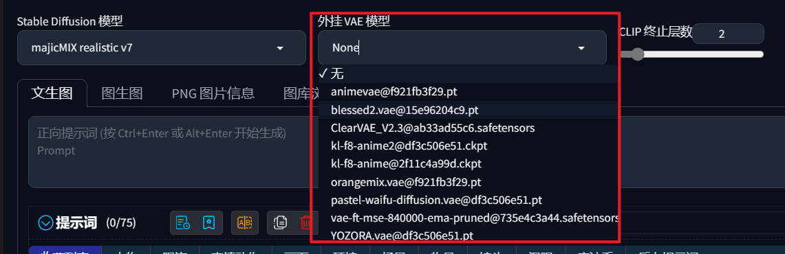

## 模型是什么

1、大模型

AI绘画中的“大模型”，一般指Checkpoint。

定义：AI训练的“数据集”，用来支持AI出图作画。

Checkpoint概念的来源：大部分模型会进行不断的训练、微调、迭代，过程中的“储存点”就是一个大模型。

基本属性：大小（1-7G）；常见格式（.ckpt/.safetensor）

2、除了“大模型”以外，还有“小模型”，例如：LoRA、Embeddings、Hypernetwork等。

3、VAE：变分自编码器

简单理解为“色彩滤镜”。

如果模型没有自带的VAE，需要正确配置VAE（最好根据模型作者的推荐），否则画面发灰发白，生成质量堪忧。几个目前比较主流的VAE（kl-f8-anime、vae-ft-mse-840000等）。

## 模型下载渠道

### 官方模型和私炉模型的区别

官方模型：花费了非常大的力气训练出来的基础模型，支持AI作画的根源，但出图效果一般

私炉模型：在官方模型的基础上“微调”出来的具有风格化特点的模型，由个人创作者训练

训练模型，也被称为“炼丹”

### 下载各类模型的渠道

Hugging Face（抱脸）：https://huggingface.co/models

深度学习和人工智能的专业网站，大佬多，但找东西不是很直观

Civitai（C站）：https://civitai.com

全世界最受欢迎的AI绘画模型分享网站，除了模型还有跟多优秀作品展示

### 模型的筛选方式

训练模型：从基础模型训练得来。

融合模型：多个训练模型混合得到的新模型。

模型标签：模型“擅长”的领域，如真人照片、动漫、插画、建筑、卡通、3D等。

### 学会使用模型

查看版本：有些模型可能存在不同的迭代版本，一般选用最新的。

查看ModelCard与模型说明：作者一般会提供使用说明，推荐采样器、VAE等。

查看例图提示词：在模型网站上，一般都可以直接复制作者或其他创作者上传图片的提示词并加以应用。

## 模型风格分类与推荐

### 二次元模型

偏漫画/插画风，具有较鲜明的绘画笔触质感

推荐模型：AbyssOrangeMix、Counterfeit、Anything、Dreamlike Diffusion

### 真实系模型

偏真实系的，拟真化程度高，对现实世界还原强

推荐模型：Deliberate、Realistic Vision、LOFI

### 2.5D模型

介于前两者之间，接近目前观众对一些游戏和3D动画的想象

推荐模型：NeverEndingDream（NED）、Protogen、国风3

### 其他特化风格模型

如：建筑设计、平面设计等

## 参考资料

[AI绘画模型新手包！“画风”自由切换，有哪些你不知道的模型使用技巧？ | 零基础入门Stable Diffusion的保姆级新手教程 | SD模型下载方式与推荐_哔哩哔哩_bilibili](https://www.bilibili.com/video/BV1Us4y117Rg/)

