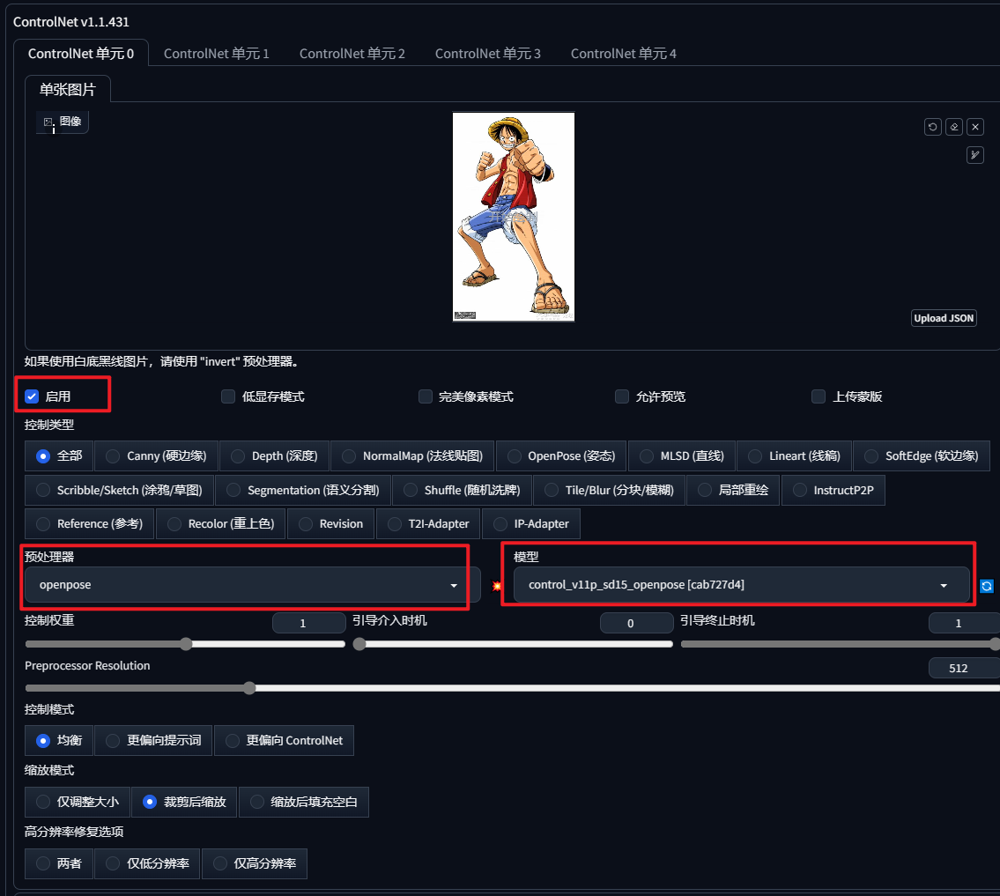
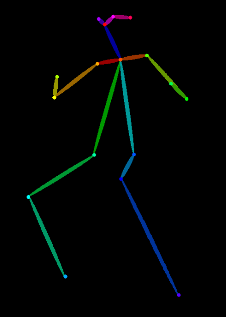
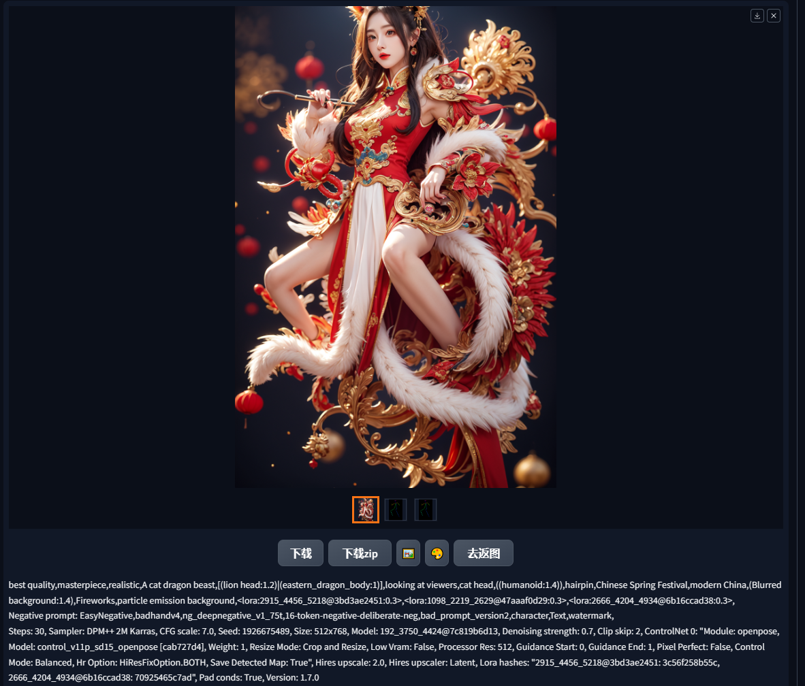
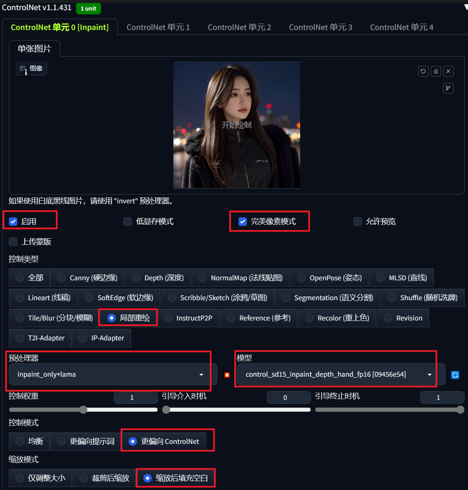

> ControlNet扩展地址：[https://github.com/Mikubill/sd-webui-controlnet](https://github.com/Mikubill/sd-webui-controlnet)

## ControlNet原理解析

以特定信息进行引导，实现一些我们通过文生图、图生图不好精确控制的特征。

精确控制的意义？

- 如果只能靠“抽卡”产出需要的内容，生成是高度不可控的。

- 面对具体需求，只有“可控”才能成为“生产力”。

基本结构：预处理器 -> 模型

- 预处理器可以从图片里提取特征信息。

- 训练过的ControlNet模型读取这些信息，并引导Stable Diffusion 生成过程。

## ControlNet基本应用

### 安装方式

**1.1版本模型地址：**

（下载地址）[https://huggingface.co/lllyasviel/ControlNet-v1-1/tree/main](https://huggingface.co/lllyasviel/ControlNet-v1-1/tree/main)

（模型介绍）[https://github.com/lllyasviel/ControlNet-v1-1-nightly](https://github.com/lllyasviel/ControlNet-v1-1-nightly)

**1.14版本后更新的新模型（包括社区模型）与XL模型的地址：**

（下载地址）[https://huggingface.co/lllyasviel/sd_control_collection/tree/main](https://huggingface.co/lllyasviel/sd_control_collection/tree/main)

模型下载后，一般放置于

stable-diffusion-webui（根目录）\extensions\sd-webui-controlnet\models

or

stable-diffusion-webui（根目录）\models\ControlNet

**预处理器下载地址（缺东西在里面找）：**

（下载地址）[https://huggingface.co/lllyasviel/Annotators/tree/main](https://huggingface.co/lllyasviel/Annotators/tree/main)

预处理器下载后，一般放置于

 stable-diffusion-webui（根目录）\\extensions\\sd-webui-controlnet\\annotator\\downloads

### 基本使用方式

拖入信息图，选择对应的预处理器和模型组合，一定要点击启用。

对图像进行预处理：点击预处理器旁边的"爆炸"按钮，可以预览预处理结果；预处理的信息图可以保存下来复用，上传信息图时，将预处理设置为“无”（有些情况可能无法准确理解原图，不如使用原图完美）。

参数详解：

- 控制权重（Control Weight）：主要影响控制“力度”。
- 引导时机（Starting Control Step）：生成过程中ControlNet“生效”的时间（从0~1）。
- 控制模式（Control Mode）：更倾向于提示词还是ControlNet。
- 改变控制力度的方式
  - 加大力度：提高权重，降低开始引导步数并提高结束引导步数，选用“ControlNet更重要”模式。
  - 降低力度：减小权重，提高开始引导步数并降低结束引导步数，选用“提示词更重要”模式。

图生图中，不需要另外上传图片，会自动加载图生图原图作为信息图。

对比

| 原图                                                         | 提取的骨骼图                                                 | 改变姿态后                                                   |
| ------------------------------------------------------------ | ------------------------------------------------------------ | ------------------------------------------------------------ |
|  |  |  |

## ControlNet模型

ControlNet总模型数量有14个，预处理器有23个。（截止2024-03-02）

五大ControlNet模型

1. Openpose：控制姿势、手部、面部细节。
2. Depth：控制空间组成（深度）。
3. Canny：控制线条轮廓。
4. SoftEdge：控制线条轮廓，但更加柔和、放松。
5. Scribble：涂鸦引导画面生成。

### Openpose：控制姿势、手部、面部细节

几种不同的Openpose预处理

1. Hand：手部骨骼
2. Face （Only）：面部特征点
3. Full：全部加在一起

### Depth：控制空间组成（深度）

深度图：黑色远，白色近。

几种不同的Depth预处理

1. Leres精度高。
2. midas软为泛用。
3. 精度越高的预处理，花费时间一般越久。

推荐使用leress++处理器。

### Canny：控制线条轮廓

预处理时，阔值控制线条的多少，不宜太过密集。
应用：线稿上色。
Tips：白底黑线线稿应使用Invert，反色成黑底白线才可正确识别。

### SoftEdge（原HED）：控制线条轮廓，但更加柔和、放松

几种不同的SoftEdge预处理，没有太大差别。

与Canny对比，SoftEdge对轮廓线条的还原更加"生动"，不会太过于刻板。

Tips：适当“放松”ControlNet的控制力度，有助于AI发挥更多自己的创造力。

### Scribble：涂鸦引导画面生成

可以从图片提取，也可以自己绘制。

应用：灵魂画手。

### 其他

实现创新性局部重绘inPaint模型

放大工作流中用于增加细节的Tile模型

用于固定特征的Reference Only

## 多重ControlNet应用

在设置中，开启多个ControlNet Unit即可使用多重ControlNet。

示例：用Depth+Openpose，让人物手部准确呈现在脸前。

组合逻辑关键：要互补！

1. 正确示范：Canny+Depth，利用线条补足深度里的细节。

2. 错误示范：Canny+SoftEdge,同样是控制边缘，开两个和开一个差不了多少。

## 应用场景

### 运用场景：语义分割

[stable diffusion 大场景构图教程｜语义分割 controlnet seg 快速场景构建｜segment anything 局部修改｜快速提取蒙版_哔哩哔哩_bilibili](https://www.bilibili.com/video/BV1xM4y1E7kM/?spm_id_from=333.337.search-card.all.click&vd_source=cf23a319db3eaab5d4d6aa80ad236bd8)

### 运用场景：线稿上色

[使用SD给线稿上色_哔哩哔哩_bilibili](https://www.bilibili.com/video/BV1DN411u7m2/?spm_id_from=333.788.recommend_more_video.1&vd_source=cf23a319db3eaab5d4d6aa80ad236bd8)

### 运用场景：高清修复

[【Stable Diffusion】图片终极超清化脚本：Stable SR 碾压4xUltraSharp！_哔哩哔哩_bilibili](https://www.bilibili.com/video/BV1cs4y1173P/?spm_id_from=333.337.search-card.all.click)

[Multi Diffusion + Tiled VAE + ControlNet Tile模型，低显存打造AI绘画超高清6K分辨率体验！SD扩展插件教程_哔哩哔哩_bilibili](https://www.bilibili.com/video/BV1Su4y1d7Dp/?spm_id_from=333.788&vd_source=cf23a319db3eaab5d4d6aa80ad236bd8)

### 运用场景：AI扩图

[【AI绘画】Stable Diffusion无限扩图，丝滑流畅！无限循环！(附工具）保姆级教程！包教包会！_哔哩哔哩_bilibili](https://www.bilibili.com/video/BV12e411n7RC/?spm_id_from=333.337.search-card.all.click&vd_source=cf23a319db3eaab5d4d6aa80ad236bd8)

[【保姆级教程】如何用ComfyUI进行拓图、扩图_哔哩哔哩_bilibili](https://www.bilibili.com/video/BV1V64y15722/?spm_id_from=333.337.search-card.all.click&vd_source=cf23a319db3eaab5d4d6aa80ad236bd8)

### 运用场景：照片上色

[我用AI修复了50年前的亚运会老照片！Stable Diffusion智能上色+高清修复教程！StableSR + ControlNetTile&Recolor_哔哩哔哩_bilibili](https://www.bilibili.com/video/BV1mm4y1575y/?spm_id_from=333.999.0.0&vd_source=cf23a319db3eaab5d4d6aa80ad236bd8)

### 运用场景：电商换装、换背景

[comfyui 实战 : 真正模特换装_哔哩哔哩_bilibili](https://www.bilibili.com/video/BV1rA4m1V7M3/?spm_id_from=333.337.search-card.all.click&vd_source=cf23a319db3eaab5d4d6aa80ad236bd8)

[AI商用第二弹！首发全网最简单的AI模特换装方案丨人人都能学会 Stable Diffusion 电商AI模特换装_哔哩哔哩_bilibili](https://www.bilibili.com/video/BV1Eu4y1h7kY/?spm_id_from=333.337.search-card.all.click&vd_source=cf23a319db3eaab5d4d6aa80ad236bd8)

### 运用场景：AI换脸

[【Stable Diffusion】Reactor AI换脸详细教程，简单好用，秒杀Roop_哔哩哔哩_bilibili](https://www.bilibili.com/video/BV1DQ4y1F7vo/?spm_id_from=333.999.0.0&vd_source=cf23a319db3eaab5d4d6aa80ad236bd8)

[AI打开新世界大门！立绘一键“真人化”，还能换皮肤！ControlNet LineArt 线稿上色+换装换背景，Stable Diffusion系统教程_哔哩哔哩_bilibili](https://www.bilibili.com/video/BV1oB4y1R7Ms/?spm_id_from=333.788&vd_source=cf23a319db3eaab5d4d6aa80ad236bd8)

### 运用场景：二维码、光影、艺术字

[“牛逼”的教程来了！一次学会AI二维码+艺术字+光影光效+创意Logo生成，绝对是B站最详细的Stable Diffusion特效设计流程教学！AI绘画进阶应用_哔哩哔哩_bilibili](https://www.bilibili.com/video/BV1gX4y1J7ei/?spm_id_from=333.788&vd_source=cf23a319db3eaab5d4d6aa80ad236bd8)

[【Stable Diffusion】AI艺术二维码超详细教程 巧妙运用controlnet解决无法识别问题！_哔哩哔哩_bilibili](https://www.bilibili.com/video/BV1kk4y1G7Kd/?spm_id_from=333.999.0.0)

### 运用场景：提炼深度图，转3D模型

[SDXL-DPO-告别lora-线稿生成深度图_stable diffusion_SD_sd_文生图_图生图_AIGC教程_人工智能_哔哩哔哩_bilibili](https://www.bilibili.com/video/BV1Te411U7QD/?spm_id_from=333.337.search-card.all.click&vd_source=cf23a319db3eaab5d4d6aa80ad236bd8)

运用场景：ai视频（瞬息宇宙）

[【AI视频】 SD Deforum插件详细教学 带你瞬息全宇宙！_哔哩哔哩_bilibili](https://www.bilibili.com/video/BV1Y94y1C7Wz/?spm_id_from=333.999.0.0)

### 运用场景：实时渲染

[stablediffusion加速模型！3秒一张图 SD也能实时渲染！LCM加速模型完整教程！附全套安装下载_哔哩哔哩_bilibili](https://www.bilibili.com/video/BV1HC4y1y7cL/?spm_id_from=333.999.0.0&vd_source=cf23a319db3eaab5d4d6aa80ad236bd8)

[(免费) 让任何软件AI实时渲染！打通AI最后500米（一键包2.0版）_哔哩哔哩_bilibili](https://www.bilibili.com/video/BV1LH4y1k7js/?spm_id_from=333.788.recommend_more_video.-1&vd_source=cf23a319db3eaab5d4d6aa80ad236bd8)

https://www.bilibili.com/video/BV17b4y1L7WY/?spm_id_from=333.999.0.0

### 运用场景：ps外挂

[一秒打通PS+SD！AI功能免费“平替”，还支持ControlNet？Auto Stable Diffusion Photoshop插件教程，释放轻薄本AI潜力_哔哩哔哩_bilibili](https://www.bilibili.com/video/BV1Zj411h7od/?spm_id_from=333.999.0.0)

## 参考资料

[30分钟零基础掌握ControlNet！绝对是你看过最好懂的控制网原理分析 | 基本操作、插件安装与5大模型应用 · Stable Diffusion教程_哔哩哔哩_bilibili](https://www.bilibili.com/video/BV1Ds4y1e7ZB/)