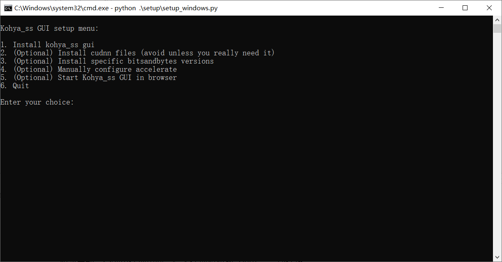

## Kohya训练器简介

Kohya GUI的核心是由开源社区开发者@Kohya.S 基于Simo Ryu（@cloneofsimo）的发现编写的LoRA训练脚本sd-scripts 。这是SD社区里出现最早的LoRA训练脚本，后续的大多数训练器与训练脚本均是在这个脚本的基础上衍生开发的。

我们使用的Kohya训练器，来源于另一位开发者@bmaltais 在Kohya脚本的基础上使用Gradio制作的图形界面（GUI），内置了可视化的界面帮助我们合理地输入、调整各项参数，并整合了参数预设、数据整理打标等在内的一系列配套功能（虽然我不常用kk）。

### 下载训练器

新建一个空文件夹目录。清空路径栏并输入“cmd”，回车调出命令行；或右键使用git bash命令行。

输入项目克隆命令

~~~
git clone https://github.com/bmaltais/kohya_ss.git
~~~

等待下载完成。

### 运行初始化

初次启动训练器，运行根目录下的“setup.bat”文件。

初次启动，会弹出选项界面。输入选项对应数字回车，完成选择。

选择1，安装必须依赖。

## 参考资料

[60分钟速通LORA训练！绝对是你看过最好懂的AI绘画模型训练教程！StableDiffusion超详细训练原理讲解+实操教学，LORA参数详解与训练集处理技巧_哔哩哔哩_bilibili](https://www.bilibili.com/video/BV16e411e7Zx/)