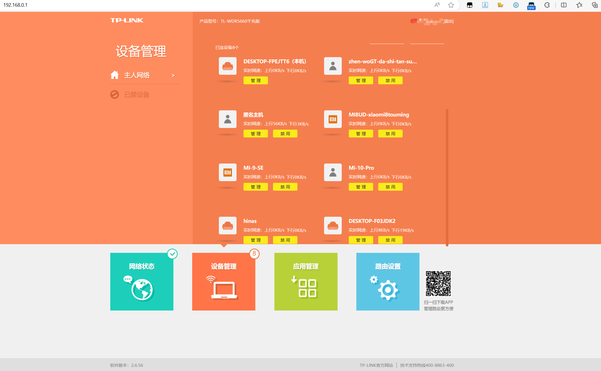
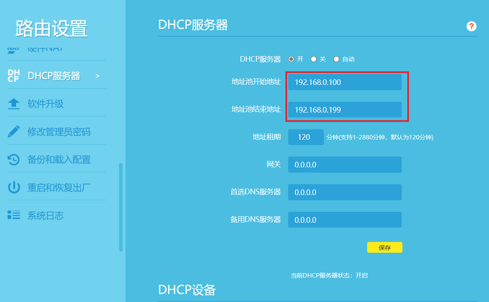

## 一、准备工作（海纳思）

### 1、刷机

玩客云刷机海纳斯系统官方教程：

[https://doc.ecoo.top/docs/tutorial-basics/s805](https://doc.ecoo.top/docs/tutorial-basics/s805)

遇到问题

1. 1、烧录软件无法连接：可能先通电后短接就无效，要先连接双公头USB，再短接住不松手，最后通电，通电后玩客云指示灯不会亮。也可能是短接镊子或者电线氧化，无法通电，换个短接线尝试。
2. 2、点击开始之后，提示romcode/初始化ddr/设备识别/usb控制命令出错：可能是usb不是2.0，换个USB接口重新连接上再开始烧录。
3. 3、提示设备限流相关，是因为插入了U盘或者SD卡等，先拔出，再重新开始烧录。

### 2、查看IP为远程登录做准备

登录路由器后台查看

点击管理按钮，查看其IP地址

确定本机在路由器中分配的IP地址。

### 3、远程登录

使用ssh远程工具登录到后台。

系统提供了两个账户，一个是具有全部权限的 root 用户，一个是普通权限的 ubuntu 用户，

默认账号 `root`，默认密码 `ecoo1234`

默认账号 `ubuntu`，默认密码 `ecoo1234`

### 4、修改root密码

`passwd root`

~~~sh
root@hinas:~# passwd root
New password:
Retype new password:
passwd: password updated successfully
~~~

### 5、设置固定IP

默认情况下，设备的IP是被路由系统DHCP自动分配的，每次关机或重启后，路由器会重新给设备分配地址，这会造成我们每次重启后的IP不一样。会给我们的管理工作带来不便。为此我们需要固定设备的IP地址。

首先需要查看路由器的DHCPIP分配段，我们设备的IP需要设置到这个分配段之外，防止这个IP被DHCP自动分配给给它设备。

打开路由器的管理界面，点击路由设置，选择DHCP服务。

可以看到，路由器DHCP的地址池是在192.168.14.100-192.168.199之间进行分配。对设备设置的地址要在这个地址段之外，如我设置为192.168.14.99。

在ssh终端输入`ifconfig`，可以看到设备的MAC地址为：00:11:22:33:44:66。记住这个MAC地址，后面需要用上。

在ssh终端中，输入`vi /etc/network/interfaces.d/eth0`，对网卡的配置文件进行编辑。

~~~sh
auto eth0
iface eth0 inet dhcp
pre-up ifconfig eth0 hw ether 00:11:22:33:44:66
~~~

修改后

~~~sh
auto eth0
iface eth0 inet static #设置网卡地址为静态
address 192.168.0.99 #设置网卡的IP地址，需要在路由分配地址之外
network 192.168.0.0
netmask 255.255.255.0 #子网掩码
broadcast 192.168.0.255 #广播地址
gateway 192.168.0.1 #网关地址
dns-nameservers 192.168.0.1 #DNS地址
pre-up ifconfig eth0 hw ether 00:11:22:33:44:66 #MAC地址：前面在ifconfig中查询的结果
~~~

编辑完成后输入ESC和:wq保存退出。

~~~sh
sudo ifdown eth0 && sudo ifup eth0
~~~

[用海纳思做web服务器并进行内网透传的实例-CSDN博客](https://blog.csdn.net/hnkkfan/article/details/138360833)

## 二、CasaOS

https://blog.csdn.net/xianyun_0355/article/details/137931849

https://blog.csdn.net/qyj19920704/article/details/139326876

## 三、使用

### 1、青龙面板

#### 1、安装青龙面板

https://www.bilibili.com/video/BV1saskeEEF4

docker安装青龙面板

https://blog.csdn.net/u012374381/article/details/128955553

https://www.voidking.com/dev-docker-qinglong

拉库命令

https://blog.csdn.net/weixin_42565036/article/details/138579435

docker下载镜像慢

https://www.cnblogs.com/xietingfeng321/p/18451170

#### 2、京东定时任务

浏览器获取京东cookie教程

https://www.xujiahua.com/8405.html

[青龙面板快手极速版教程_青龙 快手-CSDN博客](https://blog.csdn.net/xuekaitt/article/details/123037703)

#### 3、DDNSTO内网穿透

[Step1: 登录官网 控制台拿到“令牌” | 易有云产品中心 (linkease.com)](https://doc.linkease.com/zh/guide/ddnsto/start.html)

[UNRAID一篇就够！DDNSTO最简单的内网穿透_NAS存储_什么值得买 (smzdm.com)](https://post.smzdm.com/p/a3dd9qwn/)

#### 4、青龙面板设置飞书机器人

https://blog.csdn.net/weixin_45207619/article/details/138449360
https://blog.csdn.net/A1682234/article/details/135520783

#### 5、青龙面板怎么更新依赖

https://blog.csdn.net/xiaojing_yu/article/details/124141113