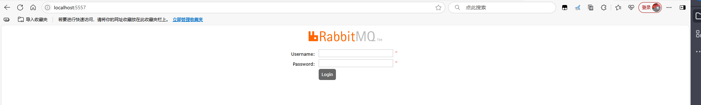
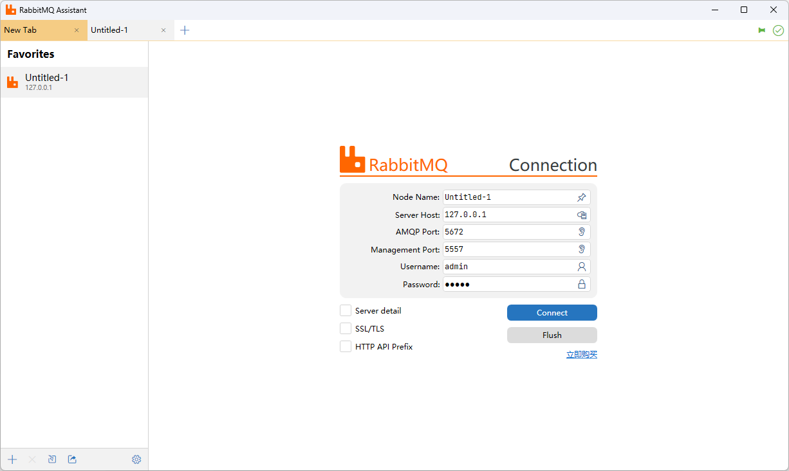
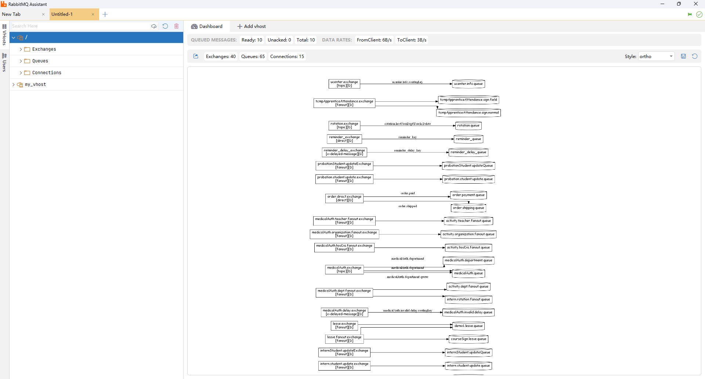

RabbitMQ Assistant是RabbitMQ可视化管理与监控工具

> 官网：[https://www.redisant.cn/rta](https://www.redisant.cn/rta)

## 主要功能

主要功能包括：

- GPU渲染：RabbitMQ Assistant 在渲染界面时充分利用您的 GPU。这带来流畅的的用户体验，同时使用比以前更少的功率。
-  生成拓扑图：为指定的vhost一键生成拓扑图，支持导出png、svg、pdf、tk等多种格式，让您的消息流动一目了然。
- 测试生产者和消费者：您可以测试解决方案的各个部分，模拟进出的第三方消息。您可以创建和编辑测试消息，一个接一个或批量发送。 
- 数据格式化：RabbitMQ Assistant 会自动识别并格式化不同的消息格式，包括Text、JSON、XML、HEX、MessagePack，以及各种整数、浮点类型。 
- 查看系统状态：您可以一目了然地查看系统状态，检查某些队列是否变得太大，死信队列中是否有消息等。通过自动刷新功能，可以近乎实时地查看整个系统的工作方式。 
- 创建消息：创建消息时，可以指定消息头、属性和载荷；或者一次发送数千条消息进行性能测试，以了解系统如何处理负载。

## 连接远程MQ

由于 RabbitMQ Assistant 仅在连接本地时提供免费服务，而连接远程地址则需收费，因此使用 Nginx 将本地端口反向代理到远程地址。

### 1、下载 Nginx

访问 [Nginx 官方网站](http://nginx.org/en/download.html) 或 Nginx 中文网，选择适合的版本并下载。将下载的压缩包解压到目标目录（如 `D:\Tools\Nginx`）。 **注意：** 路径中不要包含中文字符或空格。

### 2、启动 Nginx

打开命令提示符，进入 Nginx 解压目录：

~~~sh
cd D:\Tools\Nginx
start nginx
~~~

如果防火墙弹出提示，请允许访问网络。

在浏览器中访问 `http://localhost`，若显示欢迎页面，则启动成功。

### 3、修改配置文件

配置文件位于 `conf/nginx.conf`。打开该文件，找到 *server* 节点，根据需要修改或添加配置。例如：

**反向代理示例：**

~~~conf
server {
    listen 80;
    server_name example.com;
    location / {
        proxy_pass http://127.0.0.1:8080;
    }
}
~~~

**负载均衡示例：**

~~~conf
upstream backend {
    server 127.0.0.1:8080;
    server 127.0.0.1:8081;
}

server {
    listen 80;
    server_name example.com;
    location / {
        proxy_pass http://backend;
    }
}
~~~

我们的需求只需要反向代理，因此增加server代理本地端口5557到远程http://192.168.100.105:15672

`nginx.conf`如下

~~~conf
#user  nobody;
worker_processes  1;

#error_log  logs/error.log;
#error_log  logs/error.log  notice;
#error_log  logs/error.log  info;

#pid        logs/nginx.pid;

events {
    worker_connections  1024;
}

http {
    include       mime.types;
    default_type  application/octet-stream;

    #log_format  main  '$remote_addr - $remote_user [$time_local] "$request" '
    #                  '$status $body_bytes_sent "$http_referer" '
    #                  '"$http_user_agent" "$http_x_forwarded_for"';

    #access_log  logs/access.log  main;

    sendfile        on;
    #tcp_nopush     on;

    #keepalive_timeout  0;
    keepalive_timeout  65;

    #gzip  on;

    #server {
    #    listen       80;
    #    server_name  localhost;
	#
    #    #charset koi8-r;
	#
    #    #access_log  logs/host.access.log  main;
	#
    #    location / {
    #        root   html;
    #        index  index.html index.htm;
    #    }
	#
    #    #error_page  404              /404.html;
	#
    #    # redirect server error pages to the static page /50x.html
    #    #
    #    error_page   500 502 503 504  /50x.html;
    #    location = /50x.html {
    #        root   html;
    #    }
	#
    #    # proxy the PHP scripts to Apache listening on 127.0.0.1:80
    #    #
    #    #location ~ \.php$ {
    #    #    proxy_pass   http://127.0.0.1;
    #    #}
	#
    #    # pass the PHP scripts to FastCGI server listening on 127.0.0.1:9000
    #    #
    #    #location ~ \.php$ {
    #    #    root           html;
    #    #    fastcgi_pass   127.0.0.1:9000;
    #    #    fastcgi_index  index.php;
    #    #    fastcgi_param  SCRIPT_FILENAME  /scripts$fastcgi_script_name;
    #    #    include        fastcgi_params;
    #    #}
	#
    #    # deny access to .htaccess files, if Apache's document root
    #    # concurs with nginx's one
    #    #
    #    #location ~ /\.ht {
    #    #    deny  all;
    #    #}
    #}

    # another virtual host using mix of IP-, name-, and port-based configuration
    #
    #server {
    #    listen       8000;
    #    listen       somename:8080;
    #    server_name  somename  alias  another.alias;

    #    location / {
    #        root   html;
    #        index  index.html index.htm;
    #    }
    #}

    # HTTPS server
    #
    #server {
    #    listen       443 ssl;
    #    server_name  localhost;

    #    ssl_certificate      cert.pem;
    #    ssl_certificate_key  cert.key;

    #    ssl_session_cache    shared:SSL:1m;
    #    ssl_session_timeout  5m;

    #    ssl_ciphers  HIGH:!aNULL:!MD5;
    #    ssl_prefer_server_ciphers  on;

    #    location / {
    #        root   html;
    #        index  index.html index.htm;
    #    }
    #}
	
	server {
		listen 5557;
		server_name localhost;

		location / {
			proxy_pass http://192.168.100.105:15672;
			proxy_set_header Host $host;
			proxy_set_header X-Real-IP $remote_addr;
			proxy_set_header X-Forwarded-For $proxy_add_x_forwarded_for;
			proxy_set_header X-Forwarded-Proto $scheme;
			proxy_redirect off;
			proxy_buffering off;
			proxy_request_buffering off;
			proxy_http_version 1.1;
			proxy_set_header Connection "";
		}
	}

}
~~~

### 4、重载配置

修改完成后，运行以下命令重载配置：

~~~
nginx -s reload
~~~

常用命令

- 查看版本：nginx -v
- 停止服务：nginx -s stop
- 优雅停止：nginx -s quit
- 重启服务：nginx -s reload

### 5、查看效果

浏览器访问地址localhost:5557会直接访问到远程mq地址

使用RabbitMQ Assistant连接

