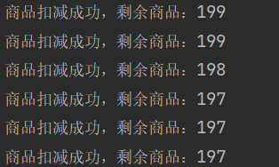
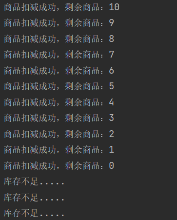

# Redis 解决超卖问题


结合Redis对高并发环境下，商品超卖问题的解决思路

### **基础代码**

> 两个接口，创建一个`stock` 商品设置200个库存
> 另一个接口，获取 redis 的库存数，判断是否有库存，如果有，就取出来-1再放回去。

~~~java
import org.springframework.beans.factory.annotation.Autowired;
import org.springframework.data.redis.core.StringRedisTemplate;
import org.springframework.web.bind.annotation.RequestMapping;
import org.springframework.web.bind.annotation.RestController;

import java.util.Objects;

/**
 * 超卖问题模拟
 *
 * @author xxl
 * @date 2023/10/09
 */
@RestController
public class OversoldController {

    /**
     * 引入String类型redis操作模板
     */
    @Autowired
    private StringRedisTemplate stringRedisTemplate;

    /**
     * 测试数据设置接口
     *
     * @return
     */
    @RequestMapping("/setStock")
    public String setStock() {
        stringRedisTemplate.opsForValue().set("stock", 200 + "");
        return "ok";
    }

    /**
     * 模拟商品超卖代码
     *
     * @return
     */
    @RequestMapping("/deductStock")
    public String deductStock() {
        // 获取Redis数据库中的商品数量
        int stock = Integer.parseInt(stringRedisTemplate.opsForValue().get("stock"));
        // 减库存
        if (stock > 0) {
            int realStock = stock - 1;
            stringRedisTemplate.opsForValue().set("stock", String.valueOf(realStock));
            System.out.println("商品扣减成功，剩余商品：" + realStock);
        } else {
            System.out.println("库存不足.....");
        }
        return "end";
    }

}
~~~

启动服务。

先执行第一个接口，创建一个stock 商品，

~~~http
### 测试数据设置接口
GET http://localhost:8080/setStock
~~~

然后创建 jmeter 测试案例


线程数：设置200，每次200请求

Ramp-Up时间：设置0，指定时间内发完，0表示一次性

循环次数：设置4，轮询4次，每次200请求


测试结果：



每个请求相当于一个线程，当几个线程同时拿到数据时，做了变更，但最先处理的数据，由于某些原因(延迟等)，造成数据最后的更新，覆盖了之前的卖出数据。导致超卖。

### 方案一：设置synchronized

既然因为并发太高导致的问题，那肯定和线程有关，尝试加个锁呗

先调用第一个接口，重置库存数


修改代码，增加synchronized：

```java
    /**
     * 模拟商品超卖代码 设置synchronized
     *
     * @return
     */
    @RequestMapping("/deductStock2")
    public String deductStock2() {
        synchronized (this) {
            // 获取Redis数据库中的商品数量
            int stock = Integer.parseInt(stringRedisTemplate.opsForValue().get("stock"));
            // 减库存
            if (stock > 0) {
                int realStock = stock - 1;
                stringRedisTemplate.opsForValue().set("stock", String.valueOf(realStock));
                System.out.println("商品扣减成功，剩余商品：" + realStock);
            } else {
                System.out.println("库存不足.....");
            }
        }
        return "end";
    }
```
重新压测




在单机模式下，添加synchronized关键字，的确能够避免商品的超卖现象！

但是在分布式微服务中，针对该服务，如果设置了集群，synchronized依旧还能保证数据的正确性吗？

假设多个请求，被注册中心负载均衡，每个微服务中的该处理接口，都添加有synchronized，依然会出现类似的`超卖`

问题：

> `synchronized`只是针对`单一服务器`的`JVM`进行`加锁`，但是分布式是很多个不同的服务器，导致两个线程或多个在不同服务器上共同对商品数量信息做了操作！

### 方案二：Redis实现分布式锁

在Redis中存在一条命令`setnx (set if not exists)`

~~~shell
setnx key value
~~~

如果不存在key，则可以设置成功；否则设置失败。

~~~shell
setnx 这个命令是一个上锁的命令

127.0.0.1:6379[10]> exists lock
(integer) 0
127.0.0.1:6379[10]> setnx lock "hi"
(integer) 1
127.0.0.1:6379[10]> setnx lock "good"
(integer) 0
127.0.0.1:6379[10]> get lock
"hi"
~~~

修改处理接口，增加key

```java
/**
 * 模拟商品超卖代码 设置setnx
 * 
 * @return
 */
@RequestMapping("/deductStock3")
public String deductStock3() {
	// 创建一个key，保存至redis
	String key = "lock";
	// setnx
	// 由于redis是一个单线程，执行命令采取“队列”形式排队！
	// 优先进入队列的命令先执行，由于是setnx，第一个执行后，其他操作执行失败。
	boolean result = stringRedisTemplate.opsForValue().setIfAbsent(key, "this is lock");
	// 当不存在key时，可以设置成功，回执true；如果存在key，则无法设置，返回false
	if (!result) {
		// 前端监测，redis中存在，则不能让这个抢购操作执行，予以提示！
		return "err";
	}
	// 获取Redis数据库中的商品数量
	Integer stock = Integer.parseInt(stringRedisTemplate.opsForValue().get("stock"));
	// 减库存
	if (stock > 0) {
		int realStock = stock - 1;
		stringRedisTemplate.opsForValue().set("stock", String.valueOf(realStock));
		System.out.println("商品扣减成功，剩余商品：" + realStock);
	} else {
		System.out.println("库存不足.....");
	}
	
	// 程序执行完成，则删除这个key
	stringRedisTemplate.delete(key);

	return "end";
}
```
1、请求进入接口中，如果redis中不存在key，则会新建一个setnx；如果存在，则不会新建，同时返回错误编码，不会继续执行抢购逻辑。

2、当创建成功后，执行抢购逻辑。

3、抢购逻辑执行完成后，删除数据库中对应的setnx的key。让其他请求能够设置并操作。


这种逻辑来说比之前单一使用syn合理的多，但是如果执行抢购操作中出现了异常，导致这个key无法被删除。以至于其他处理请求，一直无法拿到key，程序逻辑死锁！


#### **try…finally解决Redis分布式锁问题**

如何解决上述的死锁问题？

可以采取try … finally进行操作

修改业务代码逻辑，如下所示：

```java
/**
 * 模拟商品超卖代码 设置setnx
 * try…finally解决Redis分布式锁问题
 * 
 * @return
 */
@RequestMapping("/deductStock4")
public String deductStock4() {
	// 创建一个key，保存至redis
	String key = "lock";
	// setnx
	// 由于redis是一个单线程，执行命令采取队列形式排队！优先进入队列的命令先执行，由于是setnx，第一个执行后，其他操作执行失败
	boolean result = stringRedisTemplate.opsForValue().setIfAbsent(key, "this is lock");
	// 当不存在key时，可以设置成功，回执true；如果存在key，则无法设置，返回false
	if (!result) {
		// 前端监测，redis中存在，则不能让这个抢购操作执行，予以提示！
		return "err";
	}
	
	try {
		// 获取Redis数据库中的商品数量
		Integer stock = Integer.parseInt(stringRedisTemplate.opsForValue().get("stock"));
		// 减库存
		if (stock > 0) {
			int realStock = stock - 1;
			stringRedisTemplate.opsForValue().set("stock", String.valueOf(realStock));
			System.out.println("商品扣减成功，剩余商品：" + realStock);
		} else {
			System.out.println("库存不足.....");
		}
	} finally {
		// 程序执行完成，则删除这个key
		// 放置于finally中，保证即使上述逻辑出问题，也能del掉
		stringRedisTemplate.delete(key);
	}

	return "end";
}
```
这个逻辑相比上面其他的逻辑来说，显得更加的严谨。

但是，如果一套服务器，因为断电、系统崩溃等原因出现宕机，导致本该执行finally中的语句未成功执行完成！！同样出现key一直存在，导致死锁！

#### **通过超时间解决上述问题**

在设置成功setnx后，以及抢购代码逻辑执行前，增加key的限时。

```java
/**
 * 模拟商品超卖代码
 * 设置setnx保证分布式环境下，数据处理安全行问题；<br>
 * 但如果某个代码段执行异常，导致key无法清理，出现死锁，添加try...finally;<br>
 * 如果某个服务因某些问题导致释放key不能执行，导致死锁，此时解决思路为：增加key的有效时间
 * 
 * @return
 */
@RequestMapping("/deductStock5")
public String deductStock5() {
	// 创建一个key，保存至redis
	String key = "lock";
	// setnx
	// 由于redis是一个单线程，执行命令采取队列形式排队！优先进入队列的命令先执行，由于是setnx，第一个执行后，其他操作执行失败
	boolean result = stringRedisTemplate.opsForValue().setIfAbsent(key, "this is lock");
	// 当不存在key时，可以设置成功，回执true；如果存在key，则无法设置，返回false
	if (!result) {
		// 前端监测，redis中存在，则不能让这个抢购操作执行，予以提示！
		return "err";
	}
	// 设置key有效时间
	stringRedisTemplate.expire(key, 10, TimeUnit.SECONDS);
	
	try {
		// 获取Redis数据库中的商品数量
		Integer stock = Integer.parseInt(stringRedisTemplate.opsForValue().get("stock"));
		// 减库存
		if (stock > 0) {
			int realStock = stock - 1;
			stringRedisTemplate.opsForValue().set("stock", String.valueOf(realStock));
			System.out.println("商品扣减成功，剩余商品：" + realStock);
		} else {
			System.out.println("库存不足.....");
		}
	} finally {
		// 程序执行完成，则删除这个key
		// 放置于finally中，保证即使上述逻辑出问题，也能del掉
		stringRedisTemplate.delete(key);
	}

	return "end";
}
```

但是在上面的代码中，依旧会出现问题：

假设执行stringRedisTemplate.opsForValue().setIfAbsent(key, "this is lock");代码逻辑后，因为服务器原因，服务器宕机。

导致下列设置的key有效时间代码逻辑未执行。依旧会出现之前说的死锁问题。

能否保证设置key和设置时间代码能同时执行？

在Redis中，开发者考虑到这种情况，新增了一项方法可以使用，如下所示：

```java
/**
 * 模拟商品超卖代码
 * 设置setnx保证分布式环境下，数据处理安全行问题；<br>
 * 但如果某个代码段执行异常，导致key无法清理，出现死锁，添加try...finally;<br>
 * 如果某个服务因某些问题导致释放key不能执行，导致死锁，此时解决思路为：增加key的有效时间;<br>
 * 为了保证设置key的值和设置key的有效时间，两条命令构成同一条原子命令，将下列逻辑换成其他代码。
 * 
 * @return
 */
@RequestMapping("/deductStock6")
public String deductStock6() {
    // 创建一个key，保存至redis
    String key = "lock";
    // setnx
    // 由于redis是一个单线程，执行命令采取队列形式排队！优先进入队列的命令先执行，由于是setnx，第一个执行后，其他操作执行失败
    //boolean result = stringRedisTemplate.opsForValue().setIfAbsent(key, "this is lock");
    //让设置key和设置key的有效时间都可以同时执行
	boolean result = stringRedisTemplate.opsForValue().setIfAbsent(key, "this is lock", 10, TimeUnit.SECONDS);
	
	// 当不存在key时，可以设置成功，回执true；如果存在key，则无法设置，返回false
	if (!result) {
		// 前端监测，redis中存在，则不能让这个抢购操作执行，予以提示！
		return "err";
	}
	// 设置key有效时间
	//stringRedisTemplate.expire(key, 10, TimeUnit.SECONDS);
	
	try {
		// 获取Redis数据库中的商品数量
		Integer stock = Integer.parseInt(stringRedisTemplate.opsForValue().get("stock"));
		// 减库存
		if (stock > 0) {
			int realStock = stock - 1;
			stringRedisTemplate.opsForValue().set("stock", String.valueOf(realStock));
			System.out.println("商品扣减成功，剩余商品：" + realStock);
		} else {
			System.out.println("库存不足.....");
		}
	} finally {
		// 程序执行完成，则删除这个key
		// 放置于finally中，保证即使上述逻辑出问题，也能del掉
		stringRedisTemplate.delete(key);
	}

	return "end";
}
```
>
> // 让设置key和设置key的有效时间都可以同时执行
>
> boolean result = stringRedisTemplate.opsForValue().setIfAbsent(key, “this is lock”, 10, TimeUnit.SECONDS);

将setIfAbsent和expire两条命令合并成一条原子命令。

但是上述代码的逻辑中依旧会有问题：

> 如果处理逻辑中，出现超时问题。
>
> 当逻辑执行时，时间超过设定key有效时间，此时会出现什么问题？
>
> 如果一个请求执行时间超过了key的有效时间。
>
> 新的请求执行过来时，必然可以拿到key并设置时间；
>
> 此时的redis中保存的key并不是请求1的key，而是别的请求设置的。
>
> 当请求1执行完成后，此处删除key，删除的是别的请求设置的key！

依然出现了key形同虚设的问题！如果失效一直存在，超卖问题依旧不会解决。

#### **通过key设置值匹配的方式解决形同虚设问题**

既然出现key形同虚设的现象，是否可以增加条件，当finally中需要执行删除操作时，获取数据判断值是否是该请求中对应的，如果是则删除，不是则不管！

修改上述代码如下所示：


```java
/**
 * 模拟商品超卖代码 <br>
 * 解决`deductStock6`中，key形同虚设的问题。
 * 
 * @return
 */
@RequestMapping("/deductStock7")
public String deductStock7() {
    // 创建一个key，保存至redis
    String key = "lock";
    String lock_value = UUID.randomUUID().toString();
    // setnx
    //让设置key和设置key的有效时间都可以同时执行
    boolean result = stringRedisTemplate.opsForValue().setIfAbsent(key, lock_value, 10, TimeUnit.SECONDS);
    // 当不存在key时，可以设置成功，回执true；如果存在key，则无法设置，返回false
    if (!result) {
        // 前端监测，redis中存在，则不能让这个抢购操作执行，予以提示！
        return "err";
    }
    try {
        // 获取Redis数据库中的商品数量
        Integer stock = Integer.parseInt(stringRedisTemplate.opsForValue().get("stock"));
        // 减库存
        if (stock > 0) {
            int realStock = stock - 1;
            stringRedisTemplate.opsForValue().set("stock", String.valueOf(realStock));
            System.out.println("商品扣减成功，剩余商品：" + realStock);
        } else {
            System.out.println("库存不足.....");
        }
    } finally {
        // 程序执行完成，则删除这个key
        // 放置于finally中，保证即使上述逻辑出问题，也能del掉
        // 判断redis中该数据是否是这个接口处理时的设置的，如果是则删除
		if(lock_value.equalsIgnoreCase(stringRedisTemplate.opsForValue().get(key))) {
			stringRedisTemplate.delete(key);
		}
	}
	return "end";
}
```
但是此处也有一个很极限的问题：

1、在finally流程中，由于是先判断在处理。

2、如果判断条件结束后，获取到的结果为true。

3、但是在执行del操作前，此时jvm在执行GC操作(为了保证GC操作获取GC roots根完全，会暂停java程序)，导致程序暂停。

4、GC操作执行完成后(暂停恢复后)，执行del操作，但是此时的key还在当前加锁的key么？

必须保证del操作的判断和执行能够同时执行，此处代码才合理。

### **方案三：Redisson API**

setnx 的方式会出现无法准确判断业务操作时长，而无法保证安全，设置时间太长，性能不好，设置时间短，容易出现卖超问题。

难道就没有其他办法了吗？

Redisson 和 jedis 都是 Java 实现 Redis 的客户端，但是 Redisson 比 jedis 具有更多功能

引入新的 pom 文件

```xml
        <dependency>
            <groupId>org.redisson</groupId>
            <artifactId>redisson</artifactId>
            <version>3.17.6</version>
        </dependency>
```

创建 bean 配置类

```java
import org.redisson.Redisson;
import org.redisson.config.Config;
import org.springframework.beans.factory.annotation.Value;
import org.springframework.context.annotation.Bean;
import org.springframework.context.annotation.Configuration;

/**
 * 配置类
 *
 * @author xxl
 * @date 2023/10/09
 */
@Configuration
public class RedissonConfig {

    @Value("${spring.redis.host}")
    private String redisHost;
    
    @Value("${spring.redis.port}")
    private String redisPort;
    
    @Value("${spring.redis.password}")
    private String password;
    
    @Value("${spring.redis.database}")
    private Integer dataBase;


    @Bean
    public Redisson createRedisson(){
        Config config = new Config();
        config.useSingleServer().setAddress("redis://" + redisHost + ":" + redisPort).setDatabase(dataBase).setPassword(null);
        return (Redisson) Redisson.create(config);
    }
}
```

这里要注意一下，如果 redis 没有密码，在 setPassword(null) 这里给了空。否则会报 ==Unable to connect to Redis server: 127.0.0.1/127.0.0.1:6379== 错误

消费的接口方法

```java
@GetMapping("/redissonLockStock")
public String redissonLockStock() throws InterruptedException {
    String key = "lock";
    RLock lock = redisson.getLock(key);
    try {
        lock.lock();
        int stock = Integer.parseInt(stringRedisTemplate.opsForValue().get("stock"));
        if (stock % 100 == 0){
            System.out.println("A服务 延迟10秒");
            Thread.sleep(10000);
            System.out.println("A服务 延迟10秒结束 继续后续操作");
        }
        if (stock>0){
            int resultStock = stock - 1;
            stringRedisTemplate.opsForValue().set("stock",String.valueOf(resultStock));
            System.out.println("A服务 商品扣除成功，剩余商品:"+resultStock);
        }else {
            System.out.println("A服务 库存不足...");
        }
    }finally {
        lock.unlock();
    }
    return "end";
}
```

这里我还特地添加了 10秒延迟，可以在这个时间段看到 lock 的值

我们看到他也是通过 TTL 延时过期来实现的。那到底是咋做的呢？

我们来看一下 Redisson 源码

```java
String key = "lock";
RLock lock = redisson.getLock(key);
```

在`org.redisson.RedissonLock.RedissonLock(CommandAsyncExecutor, String)`中，我们看到 redisson 给 key 设置的属性中有超时时间

```java
public RedissonLock(CommandAsyncExecutor commandExecutor, String name) {
  super(commandExecutor, name);
  this.commandExecutor = commandExecutor;
  this.internalLockLeaseTime = commandExecutor.getConnectionManager().getCfg().getLockWatchdogTimeout();
  this.pubSub = commandExecutor.getConnectionManager().getSubscribeService().getLockPubSub();
}
```

超时间数为(`org.redisson.config.Config.lockWatchdogTimeout`)：默认30s

```text
private long lockWatchdogTimeout = 30 * 1000;
```

其中加锁、续命锁在以下代码中实现

```text
lock.lock();
```

查看源码(`org.redisson.RedissonLock.lock()`)，逐个判断分析得到核心逻辑代码如下所示：

```java
<T> RFuture<T> tryLockInnerAsync(long leaseTime, TimeUnit unit, long threadId, RedisStrictCommand<T> command) {
    internalLockLeaseTime = unit.toMillis(leaseTime);

    return commandExecutor.evalWriteAsync(getName(), LongCodec.INSTANCE, command,
                                          // 如果存在 KEYS[1]，这个KEYS[1]就是最初设置的redisson.getLock(key)
                                          "if (redis.call('exists', KEYS[1]) == 0) then " +
                                          //上述代码执行逻辑为0，表示不存在
                                          // 不存在则将 锁key+线程id设置为hash类型数据保存redis(ARGV[2]为当前执行线程id)
                                          "redis.call('hset', KEYS[1], ARGV[2], 1); " +
                                          // 设置这个 hash数据类型 的有效时间
                                          "redis.call('pexpire', KEYS[1], ARGV[1]); " +
                                          "return nil; " +
                                          "end; " +
                                          "if (redis.call('hexists', KEYS[1], ARGV[2]) == 1) then " +
                                          // 如果这个 锁key 在redis中存在，返回1表示数据存在
                                          //hincrby 自增1 
                                          "redis.call('hincrby', KEYS[1], ARGV[2], 1); " +
                                          // 重新设定有效时间
                                          "redis.call('pexpire', KEYS[1], ARGV[1]); " +
                                          "return nil; " +
                                          "end; " +
                                          "return redis.call('pttl', KEYS[1]);",
                                          Collections.<Object>singletonList(getName()), internalLockLeaseTime, getLockName(threadId));
}
```

> “我们可以看到一打开 redis.call 命令，其实这是 lua 语言，其中的指令有
> exists 存在、pexpire 设置有效时间
> ”

根据上述源码中，存在设置超时时间默认为30秒，但是我们知道，真正的业务执行过程不见得就是30秒，拿着一块 redisson 怎么处理呢？

在源码`org.redisson.RedissonLock.tryAcquireAsync(long, TimeUnit, long)`中，针对时间处理参数做了如下操作：

```java
private <T> RFuture<Long> tryAcquireAsync(long leaseTime, TimeUnit unit, final long threadId) {
    if (leaseTime != -1) {
        return tryLockInnerAsync(leaseTime, unit, threadId, RedisCommands.EVAL_LONG);
    }
    RFuture<Long> ttlRemainingFuture = tryLockInnerAsync(commandExecutor.getConnectionManager().getCfg().getLockWatchdogTimeout(), TimeUnit.MILLISECONDS, threadId, RedisCommands.EVAL_LONG);
    // 设置监听线程，当异步方法tryLockInnerAsync执行完触发
    ttlRemainingFuture.addListener(new FutureListener<Long>() {
        // 重写 operationComplete 方法
        @Override
        public void operationComplete(Future<Long> future) throws Exception {
            if (!future.isSuccess()) {
                return;
            }

            Long ttlRemaining = future.getNow();
            // lock acquired
            if (ttlRemaining == null) {
                // 开启定时任务
                scheduleExpirationRenewal(threadId);
            }
        }
    });
    return ttlRemainingFuture;
}
```

查看定时任务源码(`org.redisson.RedissonLock.scheduleExpirationRenewal(long)`)：

```java
private void scheduleExpirationRenewal(final long threadId) {
    if (expirationRenewalMap.containsKey(getEntryName())) {
        return;
    }
    // 定时任务的创建
    Timeout task = commandExecutor.getConnectionManager().newTimeout(new TimerTask() {
        @Override
        public void run(Timeout timeout) throws Exception {
            //又是一个lua脚本，重新设置锁
            RFuture<Boolean> future = commandExecutor.evalWriteAsync(getName(), LongCodec.INSTANCE, RedisCommands.EVAL_BOOLEAN,
                                                                     "if (redis.call('hexists', KEYS[1], ARGV[2]) == 1) then " +
                                                                     // 获取redis的hash数据类型中，指定的key-线程id 信息。
                                                                     // 如果 == 1 表示存在这个锁
                                                                     // 重新设置key的失效时间
                                                                     "redis.call('pexpire', KEYS[1], ARGV[1]); " +
                                                                     "return 1; " +
                                                                     "end; " +
                                                                     "return 0;",
                                                                     Collections.<Object>singletonList(getName()), internalLockLeaseTime, getLockName(threadId));

            // 设置失效时间后(evalWriteAsync执行后)，开启监听
            future.addListener(new FutureListener<Boolean>() {
                @Override
                public void operationComplete(Future<Boolean> future) throws Exception {
                    expirationRenewalMap.remove(getEntryName());
                    // 如果future 未执行成功
                    if (!future.isSuccess()) {
                        log.error("Can't update lock " + getName() + " expiration", future.cause());
                        return;
                    }
                    // future 执行完成
                    if (future.getNow()) {
                        // 调取自身，此时并不会造成死循环
                        // 调用自身，继续执行 TimerTask中的逻辑，包括定时操作
                        // reschedule itself
                        scheduleExpirationRenewal(threadId);
                    }
                }
            });
        }
        // 每 30/3 也就是10秒
    }, internalLockLeaseTime / 3, TimeUnit.MILLISECONDS);

    if (expirationRenewalMap.putIfAbsent(getEntryName(), task) != null) {
        task.cancel();
    }
}
```

通过这个定时和设置延迟时间，我们就可以清楚的知道， redisson 是如何做延时处理的

redisson 并不是等30秒都执行完了，再去续命，而是每过10秒就续10秒

我每隔一秒执行 ttl lock 发现

```shell
127.0.0.1:6379[10]> ttl lock
(integer) 23
127.0.0.1:6379[10]> ttl lock
(integer) 22
127.0.0.1:6379[10]> ttl lock
(integer) 21
127.0.0.1:6379[10]> ttl lock
(integer) 20
127.0.0.1:6379[10]> ttl lock
(integer) 29
127.0.0.1:6379[10]> ttl lock
(integer) 28
```

那我们知道了 redisson 通过上锁加续命的方式解决分布式锁。还有其他的办法吗？

### 方案四：RedLock 高可用并发锁

用之前，我先说一下大致原理，RedLock 思想为了保证高可用性，在设置key 的时候，会创建多个节点，单个节点设置成功不会告诉程序获得了锁，只有超过半数的节点设置成功，才会告诉程序锁上了

所以我们要创建多个 key

```java
@GetMapping("/redLockStock")
public String redLockStock(){
    // 创建多个key，
    String key1 = "lock:1";
    String key2 = "lock:2";
    String key3 = "lock:3";
    RLock lock1 = redisson.getLock(key1);
    RLock lock2 = redisson.getLock(key2);
    RLock lock3 = redisson.getLock(key3);

    RedissonRedLock redLock = new RedissonRedLock(lock1, lock2, lock3);
    try {
        boolean tryLock = redLock.tryLock(10, 30, TimeUnit.SECONDS);
        if (tryLock){
            int stock = Integer.parseInt(stringRedisTemplate.opsForValue().get("stock"));
            if (stock>0){
                int resultStock = stock - 1;
                stringRedisTemplate.opsForValue().set("stock",String.valueOf(resultStock));
                System.out.println("A服务 商品扣除成功，剩余商品:"+resultStock);
            }else {
                System.out.println("A服务 库存不足...");
            }
        }
    }catch (InterruptedException e){
        e.printStackTrace();
    }finally {
        redLock.unlock();
    }
    return "end";
}
```

多节点的Redis实现的分布式锁 RedLock 可以有效防止单点故障。

我们再来细说他为什么可以实现这样的功能

1. 获取当前时间戳
2. client 尝试按顺序使用相同的 key、value 获取所有 redis 服务的锁，在获取锁的过程中，获取时间比锁过期时间短的多，这是为了不要过长时间等待已经关闭的 Redis 服务，并且试着获取下一个 Redis 实例
   比如 TTL为5秒，设置获取锁的时间最多用1秒，如果1秒都没有获取到锁，那就放弃这个锁，立刻获取下一个锁
3. client通过获取所有能获取的时间减去第一步的时间，这个时间差小于TTL时间并且少于有3个redis实例成功获取锁，才算正在的获取锁成功
4. 如果成功拿到锁，锁的真正有效时间是 TTL 减去第三步的时间差，假如TTL是5秒，获取锁用了2秒，真正有效的就是3秒。
5. 如果客户端由于某些情况获取锁失败，便会开始解锁所有redis，因为可能也就获取了小于3个锁，必须释放，否则影响其他client获取锁

开始时间是T1是 0:00 ，获取锁时所有 key-value 都是一样的，TTL 是5min，假设漂移时间 1min，最后结束时间是 T2是 0:02 ，所以此锁最小有效时间为：TTL-(T2-T1)-漂移时间 = 5min - (0:02 - 0:00) -1min = 2min

- RedLock 算法是否是异步算法？

可以看成是同步算法，因为即使进程间（多个电脑间）没有同步时间，但是每个进程时间流速大致相同，并且时钟漂移相对于 TTL 较小，可以忽略，所以可以看成同步算法。

- RedLock 失败重试

当client 不能获取锁时，应该在随机时间后重试获取锁，并且最好在同一时刻并发把set命令发给所有redis实例，而且对于已经获取锁的client在完成任务后及时释放锁

- RedLock 释放锁

由于释放锁会判断这个锁value是不是自己设置的，如果是才删除，所以释放的时候很简单，只要向所有实例发出释放锁的命令，不用考虑是否成功释放


参考资料：

https://zhuanlan.zhihu.com/p/565811400

https://blog.csdn.net/qq_38322527/article/details/112603213