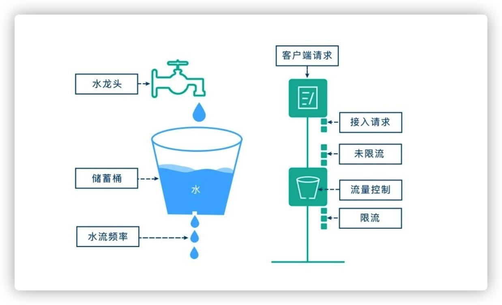
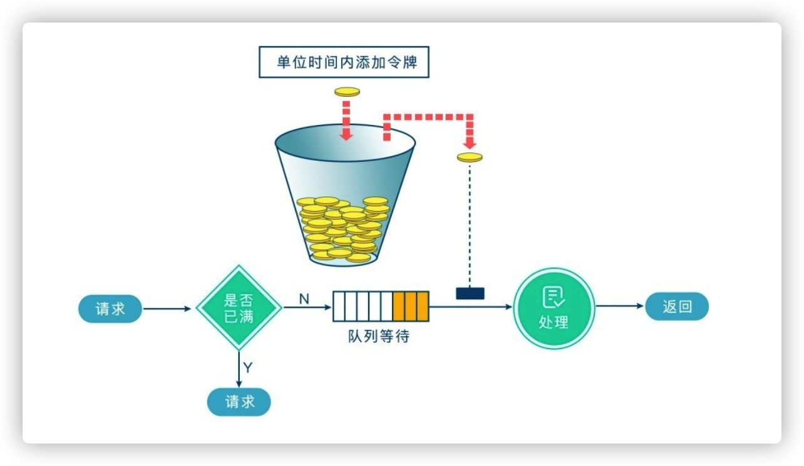
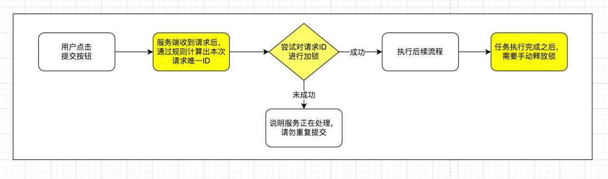

## 1、概述

在突发情况下（最常见的场景就是秒杀、抢购），瞬时大流量会直接将系统打垮，无法对外提供服务。为了防止出现这种情况最常见的解决方案之一就是限流，当请求达到一定的并发数或速率，就进行等待、排队、降级、拒绝服务等。

限流是对某一时间窗口内的请求数进行限制，保持系统的可用性和稳定性，防止因流量暴增而导致的系统运行缓慢或宕机。

常见的限流算法有三种：

1） 计数器限流

计数器限流算法是最为简单粗暴的解决方案，主要用来限制总并发数，比如数据库连接池大小、线程池大小、接口访问并发数等都是使用计数器算法。

如：使用 AomicInteger 来进行统计当前正在并发执行的次数，如果超过域值就直接拒绝请求，提示系统繁忙。

2） 漏桶算法



漏桶算法思路很简单，我们把水比作是`请求`，漏桶比作是`系统处理能力极限`，水先进入到漏桶里，漏桶里的水按一定速率流出，当流出的速率小于流入的速率时，由于漏桶容量有限，后续进入的水直接溢出（拒绝请求），以此实现限流。

3）令牌桶算法



令牌桶算法的原理也比较简单，我们可以理解成医院的挂号看病，只有拿到号以后才可以进行诊病。

系统会维护一个令牌（`token`）桶，以一个恒定的速度往桶里放入令牌（`token`），这时如果有请求进来想要被处理，则需要先从桶里获取一个令牌（`token`），当桶里没有令牌（`token`）可取时，则该请求将被拒绝服务。令牌桶算法通过控制桶的容量、发放令牌的速率，来达到对请求的限制。

## 2、具体实现

对于单机版，直接使用Guava即可。

Google开源工具包Guava提供了限流工具类RateLimiter，该类基于令牌桶算法实现流量限制，使用十分方便，而且十分高效。

对于分布式版

可以 **通过`请求唯一ID`+`redis分布式锁`来防止接口重复提交**

本次方案的核心流程图



实现的逻辑，流程如下：

- 1.用户点击提交按钮，服务端接受到请求后，通过规则计算出本次请求唯一ID值
- 2.使用`redis`的分布式锁服务，对请求 ID 在限定的时间内尝试进行加锁，如果加锁成功，继续后续流程；如果加锁失败，说明服务正在处理，请勿重复提交
- 3.最后一步，如果加锁成功后，需要将锁手动释放掉，以免再次请求时，提示同样的信息

引入缓存服务后，防止重复提交的大体思路如上，实践代码如下！

#### 2.1、引入 redis 组件

本次 demo 项目是基于`SpringBoot`版本进行构建，添加相关的`redis`依赖环境如下：

```xml
<!-- 引入springboot -->
<parent>
    <groupId>org.springframework.boot</groupId>
    <artifactId>spring-boot-starter-parent</artifactId>
    <version>2.1.0.RELEASE</version>
</parent>

......

<!-- Redis相关依赖包，采用jedis作为客户端 -->
<dependency>
    <groupId>org.springframework.boot</groupId>
    <artifactId>spring-boot-starter-data-redis</artifactId>
    <exclusions>
        <exclusion>
            <groupId>redis.clients</groupId>
            <artifactId>jedis</artifactId>
        </exclusion>
        <exclusion>
            <artifactId>lettuce-core</artifactId>
            <groupId>io.lettuce</groupId>
        </exclusion>
    </exclusions>
</dependency>
<dependency>
    <groupId>redis.clients</groupId>
    <artifactId>jedis</artifactId>
</dependency>
<dependency>
    <groupId>org.apache.commons</groupId>
    <artifactId>commons-pool2</artifactId>
</dependency>
```

#### 2.2、添加 redis 环境配置

在全局配置`application.properties`文件中，添加`redis`相关服务配置如下

```properties
# 项目名
spring.application.name=springboot-example-submit

# Redis数据库索引（默认为0）
spring.redis.database=1
# Redis服务器地址
spring.redis.host=127.0.0.1
# Redis服务器连接端口
spring.redis.port=6379
# Redis服务器连接密码（默认为空）
spring.redis.password=
# Redis服务器连接超时配置
spring.redis.timeout=1000

# 连接池配置
spring.redis.jedis.pool.max-active=8
spring.redis.jedis.pool.max-wait=1000
spring.redis.jedis.pool.max-idle=8
spring.redis.jedis.pool.min-idle=0
spring.redis.jedis.pool.time-between-eviction-runs=100
```

#### 2.3、编写服务验证逻辑，通过 aop 代理方式实现

首先创建一个`@SubmitLimit`注解，通过这个注解来进行方法代理拦截！

```java
@Retention(RetentionPolicy.RUNTIME)
@Target({ElementType.METHOD})
@Documented
public @interface SubmitLimit {

    /**
     * 指定时间内不可重复提交（仅相对上一次发起请求时间差）,单位毫秒
     * @return
     */
    int waitTime() default 1000;

    /**
     * 指定请求头部key，可以组合生成签名
     * @return
     */
    String[] customerHeaders() default {};


    /**
     * 自定义重复提交提示语
     * @return
     */
    String customerTipMsg() default "";
}
```

编写方法代理服务，增加防止重复提交的验证，实现了逻辑如下！

```java
@Order(1)
@Aspect
@Component
public class SubmitLimitAspect {

    private static final Logger LOGGER = LoggerFactory.getLogger(SubmitLimitAspect.class);

    /**
     * redis分割符
     */
    private static final String REDIS_SEPARATOR = ":";

    /**
     * 默认锁对应的值
     */
    private static final String DEFAULT_LOCK_VALUE = "DEFAULT_SUBMIT_LOCK_VALUE";

    /**
     * 默认重复提交提示语
     */
    private static final String DEFAULT_TIP_MSG = "服务正在处理，请勿重复提交！";


    @Value("${spring.application.name}")
    private String applicationName;

    @Autowired
    private RedisLockService redisLockService;


    /**
     * 方法调用环绕拦截
     */
    @Around(value = "@annotation(com.example.submittoken.config.annotation.SubmitLimit)")
    public Object doAround(ProceedingJoinPoint joinPoint){
        HttpServletRequest request = getHttpServletRequest();
        if(Objects.isNull(request)){
            return ResResult.getSysError("请求参数不能为空！");
        }
        //获取注解配置的参数
        SubmitLimit submitLimit = getSubmitLimit(joinPoint);
        //组合生成key，通过key实现加锁和解锁
        String lockKey = buildSubmitLimitKey(joinPoint, request, submitLimit.customerHeaders());
        //尝试在指定的时间内加锁
        boolean lock = redisLockService.tryLock(lockKey, DEFAULT_LOCK_VALUE, Duration.ofMillis(submitLimit.waitTime()));
        if(!lock){
            String tipMsg = StringUtils.isEmpty(submitLimit.customerTipMsg()) ? DEFAULT_TIP_MSG : submitLimit.customerTipMsg();
            return ResResult.getSysError(tipMsg);
        }
        try {
            //继续执行后续流程
            return execute(joinPoint);
        } finally {
            //执行完毕之后，手动将锁释放
            redisLockService.releaseLock(lockKey, DEFAULT_LOCK_VALUE);
        }
    }

    /**
     * 执行任务
     * @param joinPoint
     * @return
     */
    private Object execute(ProceedingJoinPoint joinPoint){
        try {
            return joinPoint.proceed();
        } catch (CommonException e) {
            return ResResult.getSysError(e.getMessage());
        } catch (Throwable e) {
            LOGGER.error("业务处理发生异常，错误信息：",e);
            return ResResult.getSysError(ResResultEnum.DEFAULT_ERROR_MESSAGE);
        }
    }


    /**
     * 获取请求对象
     * @return
     */
    private HttpServletRequest getHttpServletRequest(){
        RequestAttributes ra = RequestContextHolder.getRequestAttributes();
        ServletRequestAttributes sra = (ServletRequestAttributes)ra;
        HttpServletRequest request = sra.getRequest();
        return request;
    }

    /**
     * 获取注解值
     * @param joinPoint
     * @return
     */
    private SubmitLimit getSubmitLimit(JoinPoint joinPoint){
        MethodSignature methodSignature = (MethodSignature) joinPoint.getSignature();
        Method method = methodSignature.getMethod();
        SubmitLimit submitLimit = method.getAnnotation(SubmitLimit.class);
        return submitLimit;
    }

    /**
     * 组合生成lockKey
     * 生成规则：项目名+接口名+方法名+请求参数签名（对请求头部参数+请求body参数，取SHA1值）
     * @param joinPoint
     * @param request
     * @param customerHeaders
     * @return
     */
    private String buildSubmitLimitKey(JoinPoint joinPoint, HttpServletRequest request, String[] customerHeaders){
        //请求参数=请求头部+请求body
        String requestHeader = getRequestHeader(request, customerHeaders);
        String requestBody = getRequestBody(joinPoint.getArgs());
        String requestParamSign = DigestUtils.sha1Hex(requestHeader + requestBody);
        String submitLimitKey = new StringBuilder()
                .append(applicationName)
                .append(REDIS_SEPARATOR)
                .append(joinPoint.getSignature().getDeclaringType().getSimpleName())
                .append(REDIS_SEPARATOR)
                .append(joinPoint.getSignature().getName())
                .append(REDIS_SEPARATOR)
                .append(requestParamSign)
                .toString();
        return submitLimitKey;
    }


    /**
     * 获取指定请求头部参数
     * @param request
     * @param customerHeaders
     * @return
     */
    private String getRequestHeader(HttpServletRequest request, String[] customerHeaders){
        if (Objects.isNull(customerHeaders)) {
            return "";
        }
        StringBuilder sb = new StringBuilder();
        for (String headerKey : customerHeaders) {
            sb.append(request.getHeader(headerKey));
        }
        return sb.toString();
    }


    /**
     * 获取请求body参数
     * @param args
     * @return
     */
    private String getRequestBody(Object[] args){
        if (Objects.isNull(args)) {
            return "";
        }
        StringBuilder sb = new StringBuilder();
        for (Object arg : args) {
            if (arg instanceof HttpServletRequest
                    || arg instanceof HttpServletResponse
                    || arg instanceof MultipartFile
                    || arg instanceof BindResult
                    || arg instanceof MultipartFile[]
                    || arg instanceof ModelMap
                    || arg instanceof Model
                    || arg instanceof ExtendedServletRequestDataBinder
                    || arg instanceof byte[]) {
                continue;
            }
            sb.append(JacksonUtils.toJson(arg));
        }
        return sb.toString();
    }
}
```

部分校验逻辑用到了`redis`分布式锁，具体实现逻辑如下：

```java
/**
 * redis分布式锁服务类
 * 采用LUA脚本实现，保证加锁、解锁操作原子性
 *
 */
@Component
public class RedisLockService {

    /**
     * 分布式锁过期时间，单位秒
     */
    private static final Long DEFAULT_LOCK_EXPIRE_TIME = 60L;

    @Autowired
    private StringRedisTemplate stringRedisTemplate;

    /**
     * 尝试在指定时间内加锁
     * @param key
     * @param value
     * @param timeout 锁等待时间
     * @return
     */
    public boolean tryLock(String key,String value, Duration timeout){
        long waitMills = timeout.toMillis();
        long currentTimeMillis = System.currentTimeMillis();
        do {
            boolean lock = lock(key, value, DEFAULT_LOCK_EXPIRE_TIME);
            if (lock) {
                return true;
            }
            try {
                Thread.sleep(1L);
            } catch (InterruptedException e) {
                Thread.interrupted();
            }
        } while (System.currentTimeMillis() < currentTimeMillis + waitMills);
        return false;
    }

    /**
     * 直接加锁
     * @param key
     * @param value
     * @param expire
     * @return
     */
    public boolean lock(String key,String value, Long expire){
        String luaScript = "if redis.call('setnx', KEYS[1], ARGV[1]) == 1 then return redis.call('expire', KEYS[1], ARGV[2]) else return 0 end";
        RedisScript<Long> redisScript = new DefaultRedisScript<>(luaScript, Long.class);
        Long result = stringRedisTemplate.execute(redisScript, Collections.singletonList(key), value, String.valueOf(expire));
        return result.equals(Long.valueOf(1));
    }


    /**
     * 释放锁
     * @param key
     * @param value
     * @return
     */
    public boolean releaseLock(String key,String value){
        String luaScript = "if redis.call('get', KEYS[1]) == ARGV[1] then return redis.call('del', KEYS[1]) else return 0 end";
        RedisScript<Long> redisScript = new DefaultRedisScript<>(luaScript, Long.class);
        Long result = stringRedisTemplate.execute(redisScript, Collections.singletonList(key),value);
        return result.equals(Long.valueOf(1));
    }
}
```

部分代码使用到了序列化相关类`JacksonUtils`，源码如下：

```java
public class JacksonUtils {

    private static final Logger LOGGER = LoggerFactory.getLogger(JacksonUtils.class);


    private static final ObjectMapper objectMapper = new ObjectMapper();

    static {
        // 对象的所有字段全部列入
        objectMapper.setSerializationInclusion(JsonInclude.Include.ALWAYS);
        // 忽略未知的字段
        objectMapper.configure(DeserializationFeature.FAIL_ON_UNKNOWN_PROPERTIES, false);
        // 读取不认识的枚举时，当null值处理
        objectMapper.configure(DeserializationFeature.READ_UNKNOWN_ENUM_VALUES_AS_NULL, true);
//        序列化忽略未知属性
        objectMapper.configure(SerializationFeature.FAIL_ON_EMPTY_BEANS, false);
        //忽略字段大小写
        objectMapper.configure(MapperFeature.ACCEPT_CASE_INSENSITIVE_PROPERTIES, true);

        objectMapper.configure(JsonParser.Feature.AUTO_CLOSE_SOURCE, true);
        SimpleModule module = new SimpleModule();
        module.addSerializer(Long.class, ToStringSerializer.instance);
        module.addSerializer(Long.TYPE, ToStringSerializer.instance);
        objectMapper.registerModule(module);
    }

    public static String toJson(Object object) {
        if (object == null) {
            return null;
        }
        try {
            return objectMapper.writeValueAsString(object);
        } catch (Exception e) {
            LOGGER.error("序列化失败",e);
        }
        return null;
    }

    public static <T> T fromJson(String json, Class<T> classOfT) {
        if (json == null) {
            return null;
        }
        try {
            return objectMapper.readValue(json, classOfT);
        } catch (Exception e) {
            LOGGER.error("反序列化失败",e);
        }
        return null;
    }

    public static <T> T fromJson(String json, Type typeOfT) {
        if (json == null) {
            return null;
        }
        try {
            return objectMapper.readValue(json, objectMapper.constructType(typeOfT));
        } catch (Exception e) {
            LOGGER.error("反序列化失败",e);
        }
        return null;
    }
}
```

#### 2.4、在相关的业务接口上，增加SubmitLimit注解即可

```java
@RestController
@RequestMapping("order")
public class OrderController {

    @Autowired
    private OrderService orderService;

    /**
     * 下单，指定请求头部参与请求唯一值计算
     * @param request
     * @return
     */
    @SubmitLimit(customerHeaders = {"appId", "token"}, customerTipMsg = "正在加紧为您处理，请勿重复下单！")
    @PostMapping(value = "confirm")
    public ResResult confirmOrder(@RequestBody OrderConfirmRequest request){
        //调用订单下单相关逻辑
        orderService.confirm(request);
        return ResResult.getSuccess();
    }
}
```

**其中最关键的一个步就是将唯一请求 ID  的生成，放在服务端通过组合来实现，在保证防止接口重复提交的效果同时，也可以显著的降低接口测试复杂度**！


源码地址：

https://github.com/Daneliya/springboot_chowder/tree/main/springboot_redis_repeat_submit


参考资料：

https://www.cnblogs.com/zys2019/p/17385568.html

https://blog.csdn.net/Jason009/article/details/127896906

[redis分布式锁的实现（setNx命令和Lua脚本）](https://blog.csdn.net/qq_26222859/article/details/51516011)

[Redis分布式锁的一点小理解](https://www.cnblogs.com/zhangweicheng/p/11495971.html)

