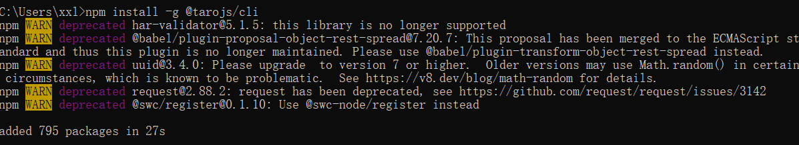
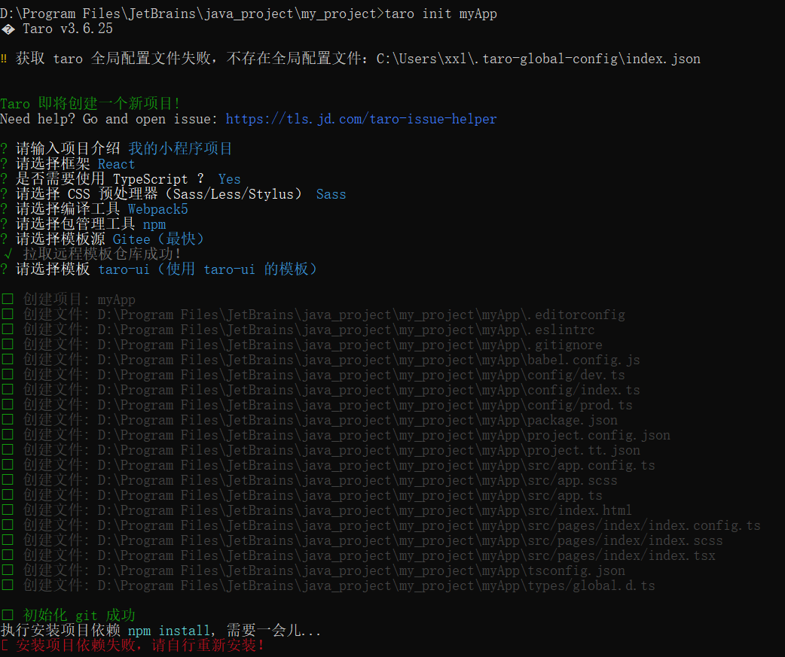

> 微信官方文档：https://developers.weixin.qq.com/miniprogram/dev/framework/
>
> 开发工具：https://developers.weixin.qq.com/miniprogram/dev/devtools/download.html


## 项目搭建

> Taro官网：https://taro.zone/
>
> Taro官方文档：https://taro-docs.jd.com/docs/

建议使用 3.X 版本，node.js >= 16，npm>=18

### 安装Taro



### 项目初始化

~~~
taro init 项目名称
~~~



模板选择

- 没什么需求：就用默认。

- 如果要用官方推荐的组件库 taro-ui：就用taro-ui模板（推荐）。

- 不想自己搭后端，云开发：就用wxcloud 云开发模板。


最后提示安装依赖失败

使用开发工具打开项目，`npm install`自己手动安装。

~~~json
// package.json
  "scripts": {
    "build:weapp": "taro build --type weapp",
    "build:swan": "taro build --type swan",
    "build:alipay": "taro build --type alipay",
    "build:tt": "taro build --type tt",
    "build:h5": "taro build --type h5",
    "build:rn": "taro build --type rn",
    "build:qq": "taro build --type qq",
    "build:jd": "taro build --type jd",
    "build:quickapp": "taro build --type quickapp",
    "dev:weapp": "npm run build:weapp -- --watch",
    "dev:swan": "npm run build:swan -- --watch",
    "dev:alipay": "npm run build:alipay -- --watch",
    "dev:tt": "npm run build:tt -- --watch",
    "dev:h5": "npm run build:h5 -- --watch",
    "dev:rn": "npm run build:rn -- --watch",
    "dev:qq": "npm run build:qq -- --watch",
    "dev:jd": "npm run build:jd -- --watch",
    "dev:quickapp": "npm run build:quickapp -- --watch"
  }
~~~

项目初始化完成后，先不要急着改代码，而是要先快速安装完依赖、运行、验证能否正常运行

build:weapp：打包上线前再使用，体积通常更小

dev:weapp：开发测试时使用，可以即时编译，自动更新小程序的效果

--watch：监听参数


### UI组件库

推荐和 Taro 官方框架兼容的组件库，否则会出现跨端后样式丢失的问题:
- taro-ui：https://taro-ui.taro.zone/#/docs/introduction（最淮荐，兼容性最好）

- nut-ui


### 怎么向后端发送请求

axios?

适配器库：https://github.com/bigmeow/taro-platform/tree/master/packages/axios-taro-adapter

传统开发方式：每一个请求写一个发送请求的代码

更高效的开发方式: 根据后端接口文档自动生成请求：https://www.npmjs.com/package/@umijs/openapi


### 开启多端同步调试

/config/index.js

```js
outputRoot: `dist/${process.env.TARO_ENV}`
```


### 部署

1. 需要正式的appld (到微信小程序官方申请

2. 执行build 命令打包代码

3. 在微信小程序开发工具上传代码

   如果有报错，可以多去微信开发者社区交流


### 小程序中接入广告

https://developers.weixin.qq.com/community/develop/doc/000aecc6584fd81887969ded456c04


### 接入美团联盟

> 美团联盟官网：https://union.meituan.com/

2022年8月16日不支持个人推广

美团联盟专门针对个人开发了一个公众号叫“外卖美天赚”

https://www.bilibili.com/read/cv21971143/

https://jiubaoyou.cn/mulu/52590.html

https://www.bilibili.com/video/BV1RU4y1G75Y

https://dtmbw.com/


### 文件存储

又拍云：https://console.upyun.com/


参考资料

https://www.cnblogs.com/redFeather/p/13517999.html

https://zhuanlan.zhihu.com/p/360563720

https://tool.oschina.net/commons?type=3

https://www.bilibili.com/video/BV1Up4y1S7qq

https://www.bilibili.com/video/BV1Mu411p7cV