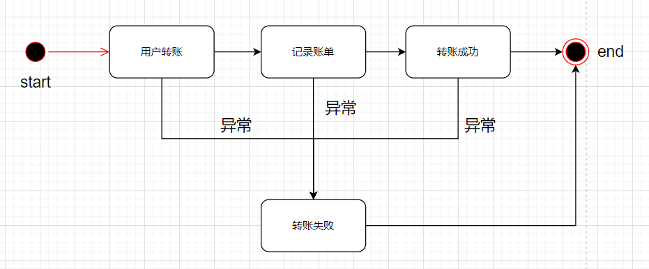

## 一、LiteFlow简介

> https://gitee.com/dromara/liteFlow
>
> https://liteflow.cc/

搭建系统要先搭建框架，而搭建框架最重要的事情之一就是要设计好流程引擎。流程引擎可以带来诸如**【避免冗余】【最小修改】【方便追踪】【利于分工】【可读性好】【灵活多变】**等好处，这些好处是伴随着整个系统生命周期的。

市面上这样的引擎其实还挺多的，知名的包括**Activiti、Flowable、camunda** 等。这些流程引擎功能强大，还提供了可视化的能力，很多大厂也在使用。**LiteFlow** 是相比他们来说更轻量级一些的流程引擎，很容易上手，取之即用。

官方对LiteFlow的介绍：

> *LiteFlow是一个轻量且强大的国产规则引擎框架，可用于复杂的组件化业务的编排领域，独有的DSL规则驱动整个复杂业务，并可实现平滑刷新热部署，支持多种脚本语言规则的嵌入。帮助系统变得更加丝滑且灵活。*
>
> *LiteFlow于2020年正式开源，2021年获得开源中国年度最受欢迎开源软件殊荣。于2022年获得Gitee最有价值开源项目(GVP)荣誉。是一个正处在高速发展中的开源项目。*
>
> *LiteFlow是一个由社区驱动的项目，拥有一个2500多人的使用者社区*

虽然相比Acitiviti、Flowable来说，LiteFlow的知名度要低得多，功能也没有这些知名成熟引擎那么强大，但LiteFlow还是有诸多优点，能够满足你绝大部分的场景。这些优点包括：

**【使用便捷】**：引几个jar包、实现几个接口、写一个流程编排文件，就能run。

**【编排丰富】**：支持串行、并行、选择、循环、异常处理、嵌套等各种编排方式。

**【支持脚本】**：支持各种主流脚本语言。

**【配置源丰富】**：支持将流程定义放到ZK、DB、Etcd、Nacos等。相当于可以实现动态配置更改。

## 二、快速开始

### :palm_tree:依赖

增加liteflow-spring-boot-starter依赖包，提供自动装配功能

~~~xml
<dependency>
    <groupId>com.yomahub</groupId>
    <artifactId>liteflow-spring-boot-starter</artifactId>
    <version>2.12.0</version>
</dependency>
~~~

### :palm_tree:配置

SpringBoot配置文件

```yaml
liteflow:
  rule-source: config/flow.el.xml
```

在resources下的`config/flow.el.xml`中定义规则：

```xml
<?xml version="1.0" encoding="UTF-8"?>
<flow>
    <chain name="chain1">
        THEN(a, b, c);
    </chain>
</flow>
```

### :palm_tree:组件

定义并实现一些组件，确保SpringBoot会扫描到这些组件并注册进上下文。

```java
@Component("a")
public class ACmp extends NodeComponent {

	@Override
	public void process() {
		//do your business
	}
}
```

以此类推再分别定义b,c组件：

```java
@Component("b")
public class BCmp extends NodeComponent {

	@Override
	public void process() {
		//do your business
	}
}
@Component("c")
public class CCmp extends NodeComponent {

	@Override
	public void process() {
		//do your business
	}
}
```

### :palm_tree:执行

声明启动类：

```java
/**
 * 启动类
 *
 * @author xxl
 * @date 2024/5/6 22:48
 */
@ComponentScan({"com.xxl.liteflow"}) //把定义的组件扫入Spring上下文中
@SpringBootApplication
public class SpringbootLiteFlowApplication {
    public static void main(String[] args) {
        SpringApplication.run(SpringbootLiteFlowApplication.class, args);
    }
}
```

然后就可以在Springboot任意被Spring托管的类中拿到flowExecutor，进行执行链路：

```java
@Component
public class YourClass{
    
    @Resource
    private FlowExecutor flowExecutor;
    
    public void testConfig(){
        LiteflowResponse response = flowExecutor.execute2Resp("chain1", "arg");
    }
}
```

## 三、实战

### :palm_tree:简单的串行流程

以一个简单的用户转账接口为例：

提供一个用户转账接口，用户可以给收款方转账，转账成功后生成一个转账账单。

#### :seedling:【step1】确定流程

一个转账行为的步骤如下：


#### :seedling:【step2】实现组件

根据上面这个流程，实现如下组件：

【UserTransferComponent】：用户转账组件，负责执行转账操作。

【UserTransferBillComponent】：用户转账账单组件，记录转账账单。

【UserTransferSuccessComponent】：转账成功组件，设置转账成功标志。

这三个组件的关键是要继承LiteFlow的NodeComponent类，并实现process()方法，如下所示：

UserTransferComponent

```java
@Component("userTransfer")
public class UserTransferComponent extends NodeComponent {

    @Autowired
    private TransferService transferService;

    @Override
    public void process() throws Exception {
        MyRequestContext requestContext = this.getContextBean(MyRequestContext.class);
        //执行转账
        String orderId = transferService.pay(requestContext.getPayerId(), requestContext.getPayeeId(), requestContext.getMoney());
        this.getContextBean(MyResponseContext.class).setOrderId(orderId);
    }
}
```

UserTransferBillComponent

```java
@Component("userTransferBill")
public class UserTransferBillComponent extends NodeComponent {

    @Autowired
    private TransferBillService transferBillService;

    @Override
    public void process() throws Exception {
        MyRequestContext requestContext = this.getContextBean(MyRequestContext.class);
        MyResponseContext responseContext = this.getContextBean(MyResponseContext.class);
        //记录账单
        transferBillService.recordBill(responseContext.getOrderId(), requestContext.getPayerId(), requestContext.getPayeeId());
    }
}
```

UserTransferSuccessComponent

```java
@Component("userTransferSuccess")
public class UserTransferSuccessComponent extends NodeComponent {

    @Override
    public void process() throws Exception {
        //设置转账成功标志
        this.getContextBean(MyResponseContext.class).setSuccess(true);
    }

}
```

#### :seedling:【step3】编排组件

接着，我们要新建一个流程配置文件，并在里面描述我们想要的流程。

我们先新建一个flow.el.xml文件，并在application.yml中配置

application.yml

```yaml
liteflow:
  rule-source: config/flow.el.xml
```

接着，就是最重要的一步，在flow.el.xml中编写流程，如下：

```xml
<?xml version="1.0" encoding="UTF-8"?>
<flow>
    <chain name="userTransferChainSimple">
        THEN(userTransfer, userTransferBill, userTransferSuccess);
    </chain>
</flow>
```

文件中包含这些内容：

【1】需要对这个chain取一个name，这个name在后面调用流程时需要用到。

【2】THEN中可以看到，编排了上面编写的三个组件，并且有顺序关系。

#### :seedling:【step4】实现一个controller调用接口

~~~java
/**
 * 转账流程调用接口
 *
 * @author xxl
 * @date 2024/5/11 22:14
 */
@RestController
public class UserTransferController {

    //LiteFlow核心bean，用来触发流程
    @Resource
    private FlowExecutor flowExecutor;

    @GetMapping(path = "/userTransferChainSimple")
    public String userTransferChainSimple(@RequestParam String payerId, @RequestParam String payeeId, @RequestParam int money) {
        //1. 构建请求上下文对象，用来传递参数进流程组件
        RequestContext requestContext = new RequestContext();
        requestContext.setPayerId(payerId);
        requestContext.setPayeeId(payeeId);
        requestContext.setMoney(money);

        //2. 调用流程引擎，传入请求上下文和结果上下文，结果上下文用于组件在其中设置各种结果
        ResponseContext responseContext = new ResponseContext();
        flowExecutor.execute2Resp("userTransferChainSimple", null, requestContext, responseContext);

        //3. 构造返回对象
        return buildResult(responseContext);
    }
}
~~~

其中需要注意的是：启动流程时需要构建上下文对象并传入流程引擎。这个上下文对象完全可以自己定义，上图示例仅是我的习惯（分开了请求上下文和结果上下文）。

#### :seedling:【step5】run！

执行运行一下看下结果：


下面是控制台的输出：

~~~sh
2024-05-11 23:57:17.975  INFO 20216 --- [nio-8082-exec-6] com.yomahub.liteflow.slot.Slot           : [3fb498306f40485894840641e017f128]:CHAIN_NAME[userTransferChainSimple]
userTransfer<0>==>userTransferBill<0>==>userTransferSuccess<0>
2024-05-11 23:57:17.975  INFO 20216 --- [nio-8082-exec-6] com.yomahub.liteflow.slot.DataBus        : [3fb498306f40485894840641e017f128]:slot[2] released
~~~

从上面控制台输出图中可以看到组件执行的过程。

看下整个代码的目录结构：


使用了流程引擎liteflow后，整个代码的目录也很清爽清楚。


### :palm_tree:涉及到条件选择(if)的流程

#### :seedling:【step1】流程

延展上面的转账流程，加入选择的逻辑。整个流程变成如下这样：


新增入参校验和转账失败节点。

#### :seedling:【step2】新增组件

【入参校验】需要用LiteFlow的“条件组件”来实现，而【转账失败】组件则和转账成功组件一样实现，如下所示：

用户入参检查组件：UserCheckComponent

需要注意的是v2.12之前使用NodeIfComponent，之后版本后使用NodeBooleanComponent。

~~~java
// 历史版本
@Component("userCheck")
public class UserCheckComponent extends NodeIfComponent {

    @Override
    public boolean processIf() throws Exception {
        RequestContext requestContext = this.getContextBean(RequestContext.class);
        int money = requestContext.getMoney();
        if (money <= 0) {
            return false;
        }
        return true;
    }
}
// v2.12
@Component("userCheck")
public class UserCheckComponent extends NodeBooleanComponent {

    @Override
    public boolean processBoolean() throws Exception {
        MyRequestContext requestContext = this.getContextBean(MyRequestContext.class);
        int money = requestContext.getMoney();
        if (money <= 0) {
            return false;
        }
        return true;
    }
}
~~~

转账失败组件：UserTransferFailComponent

~~~java
@Component("userTransferFail")
public class UserTransferFailComponent extends NodeComponent {

    @Override
    public void process() throws Exception {
        this.getContextBean(ResponseContext.class).setSuccess(false);
    }

}
~~~

#### :seedling:【step3】新增配置

在流程定义文件中的定义：

~~~xml
<flow>
    <chain name="userTransferChainIfElse">
        THEN(
            IF(userCheck, THEN(userTransfer, userTransferBill, userTransferSuccess)).ELSE(userTransferFail)
        );
    </chain>
</flow>
~~~

#### :seedling:【step4】运行测试

两种执行结果

~~~sh
userCheck<0>==>userTransfer<0>==>userTransferBill<12>==>userTransferSuccess<0>

userCheck<0>==>userTransferFail<0>
~~~


### :palm_tree:涉及到异常处理的流程

#### :seedling:【step1】流程

涉及到异常的流程。流程如下：



#### :seedling:【step2】新增配置

在流程定义文件中的定义如下：

~~~xml
<flow>
    <chain name="userTransferChainCatchException">
        CATCH(
            THEN(userTransfer, userTransferBill, userTransferSuccess)
        ).DO(userTransferFail);
    </chain>
</flow>
~~~

通过CATCH关键字包裹需要捕获异常的流程，然后使用DO来指定异常处理流程即可。

#### :seedling:【step3】运行测试

代码中添加一段异常，直接运行看一下异常情况下控制台的输出：

~~~
userTransfer<3>==>userTransferFail<0>
~~~

从控制台可以看出，捕获了预埋的异常，然后走进了userTransferFail节点。


### :palm_tree:将流程配置放到DB，并实现热刷新

**LiteFlow 还支持把流程定义放在数据库里维护，并实现热刷新（修改流程后不需要重新启动服务）**。

#### :seedling:【step1】添加依赖

需要添加以下额外插件依赖：

```xml
<dependency>
    <groupId>com.yomahub</groupId>
    <artifactId>liteflow-rule-sql</artifactId>
    <version>2.12.0</version>
</dependency>
```

#### :seedling:【step2】增加配置

依赖了插件包之后，无需再配置`liteflow.ruleSource`路径。

只需要配置插件的额外参数即可，在`application.yml`中，添加如下配置：

```yaml
liteflow:
#  rule-source: config/flow.el.xml
  rule-source-ext-data-map:
    #数据源基础配置，项目中配置过spring.datasource无需再次配置
#    url: jdbc:mysql://127.0.0.1:3306/x_file_storage
#    driverClassName: com.mysql.cj.jdbc.Driver
#    username: root
#    password: xxl666
    applicationName: liteflowdemo
    #配置流程的表名
    chainTableName: LITE_FLOW_CHAIN
    #注意，下面xxxField结尾的，都是表中的列名
    #应用名
    chainApplicationNameField: application_name
    #流程名
    chainNameField: chain_name
    #流程表达式
    elDataField: el_data
```

LiteFlow支持了使用项目中已存在的Datasource来进行数据库连接。如果项目中已有链接配置，无需再次配置。

#### :seedling:【step3】建立数据库表

下面插入一个原本写在流程定义文件中的流程配置：

~~~sql
create table LITE_FLOW_CHAIN (
  `id` int(11) NOT NULL auto_increment,
  `application_name` varchar(64) NOT NULL,
  `chain_name` varchar(64) NOT NULL,
  `el_data` varchar(2046) NOT NULL,
  PRIMARY KEY (`id`)
);

insert into LITE_FLOW_CHAIN values (1, "liteflowdemo", "userTransferChainFromDB", "THEN(userTransfer, userTransferBill, userTransferSuccess)");
~~~

#### :seedling:【step4】自动刷新

测试执行的“流程链条”。

~~~sh
userTransfer<4>==>userTransferBill<11>==>userTransferSuccess<0>
~~~

然后我们在数据库修改这个流程，中间加入一个UserTransferNotifyComponent

 ~~~sql
UPDATE LITE_FLOW_CHAIN SET el_data = "THEN(userTransfer, userTransferBill, userTransferNotify, userTransferSuccess)" WHERE id = 1;
 ~~~

这个时候再去访问链接，还是原来的流程链。

这是因为**LiteFlow不支持（v2.11.1之前版本不支持，之后的版本是默认关闭的）DB作为数据源的热加载**（如果使用ZK，etcd等作为数据源，自动实现热加载，详情可以去官网看看）。

**v2.11.1之前主动刷新缓存**

所以在DB修改完以后，要手动刷新一下LiteFlow的本地缓存。

我实现了一个简单的接口让我们可以主动刷新缓存，如下：

~~~java
    /**
     * 主动刷新缓存
     */
    @GetMapping(path = "/reloadLiteFlowConfigure")
    public void reloadLiteFlowConfigure() {
        flowExecutor.reloadRule();
    }
~~~

调用完这个接口以后，我们再访问一下链接，就是如下效果了：

~~~sh
userTransfer<0>==>userTransferBill<0>==>userTransferNotify<0>==>userTransferSuccess<0>
~~~

**v2.11.1+轮询自动刷新**

LiteFlow支持SQL数据源轮询模式的自动刷新机制。可以在配置项中通过`pollingEnabled: true`来开启自动刷新： 

~~~yaml
liteflow:
  rule-source-ext-data-map:
    ...
    pollingEnabled: true
    ##以下非必须，默认1分钟
    pollingIntervalSeconds: 60
    pollingStartSeconds: 60
    ...
~~~

轮询模式的自动刷新根据预设的时间间隔定时拉取SQL中的数据，与本地保存的数据SHA值进行对比来判断是否需要更新数据。

~~~sh
2024-05-13 00:40:09.153  INFO 22552 --- [  SQL-Polling-1] c.y.l.parser.sql.read.AbstractSqlRead    : query sql: SELECT * FROM LITE_FLOW_CHAIN WHERE application_name='liteflowdemo'
2024-05-13 00:40:09.155  INFO 22552 --- [  SQL-Polling-1] c.y.l.parser.sql.util.LiteFlowJdbcUtil   : use dataSourceName[dataSource],has found liteflow config
2024-05-13 00:41:09.154  INFO 22552 --- [  SQL-Polling-1] c.y.l.parser.sql.read.AbstractSqlRead    : query sql: SELECT * FROM LITE_FLOW_CHAIN WHERE application_name='liteflowdemo'
2024-05-13 00:41:09.155  INFO 22552 --- [  SQL-Polling-1] c.y.l.parser.sql.util.LiteFlowJdbcUtil   : use dataSourceName[dataSource],has found liteflow config
~~~

定时轮询存在些微的性能消耗；受轮询间隔限制，数据更新有一定延迟性。

## 参考资料

苏三说技术-聊聊LiteFlow

