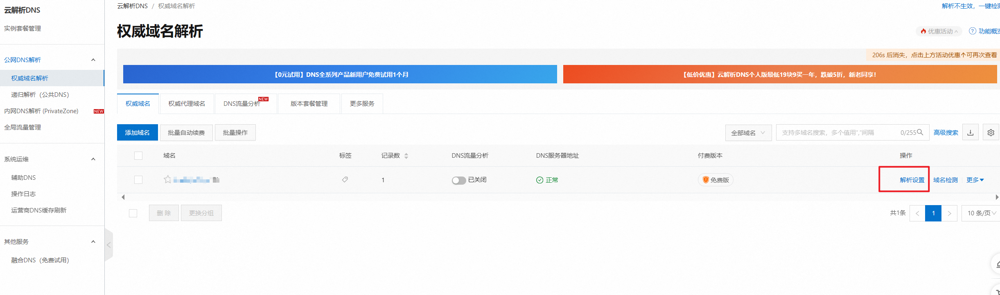
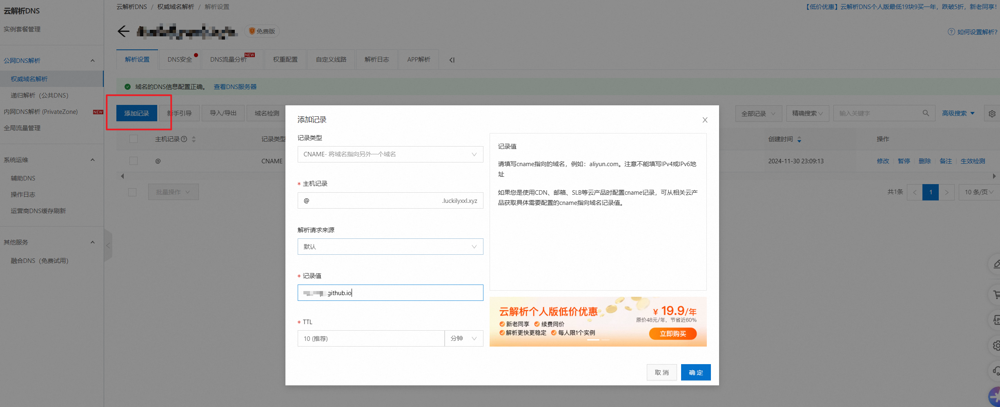
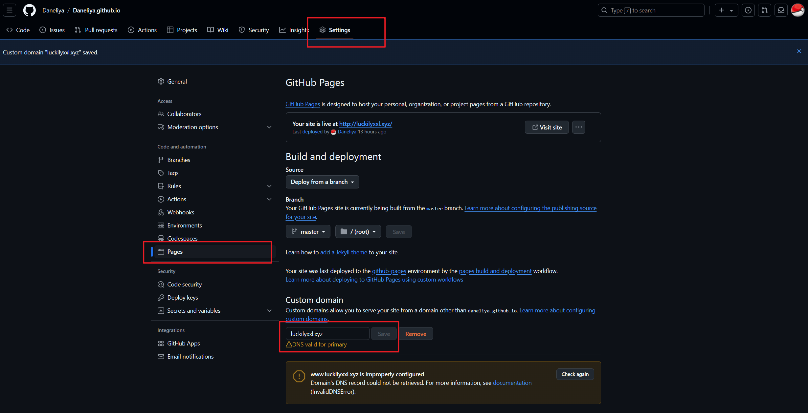
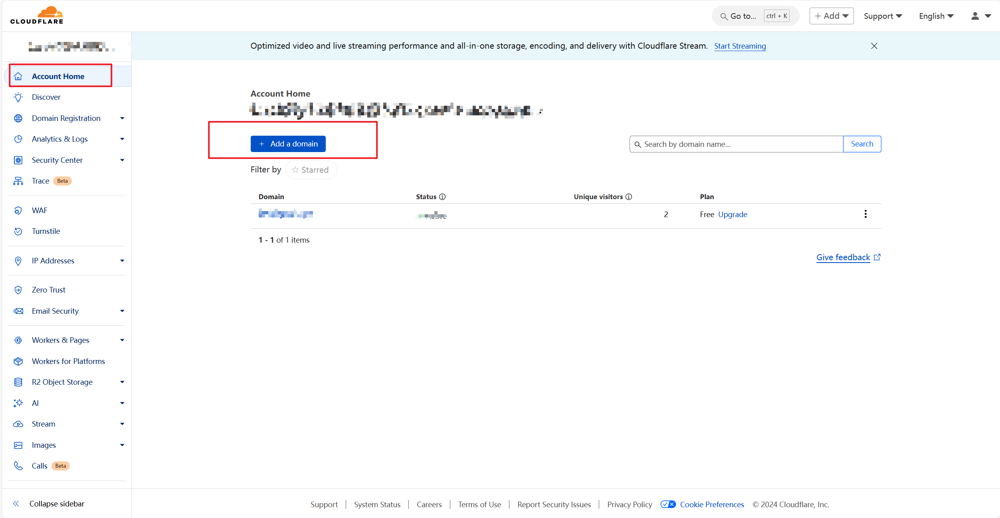
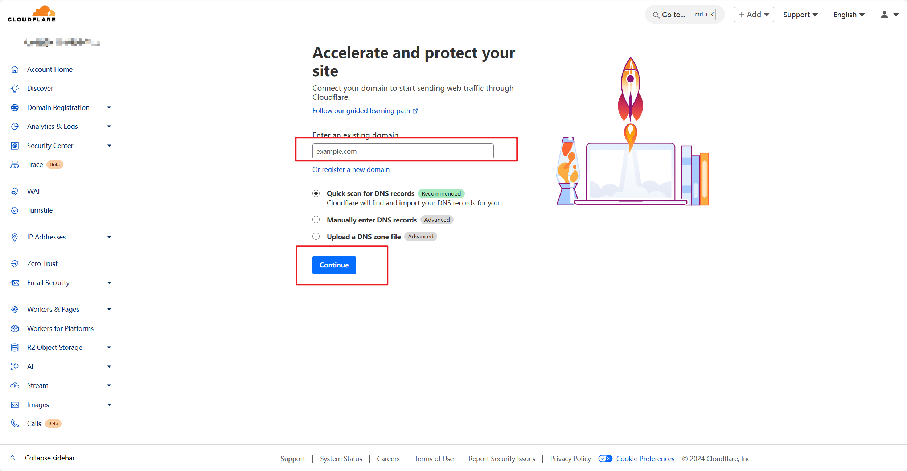
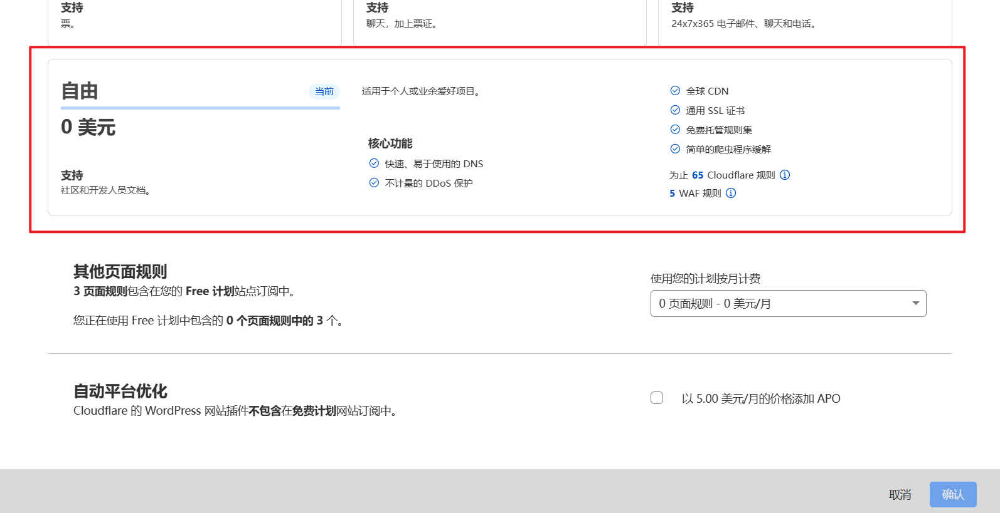
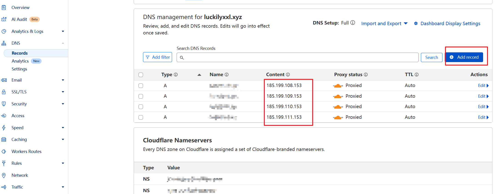
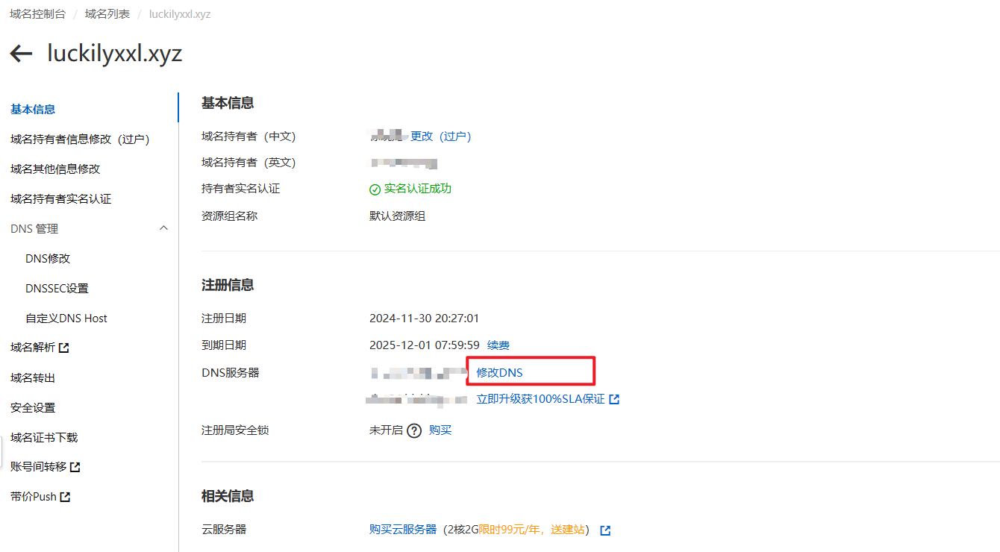

## 一、前言

在很多时候，我发现我在访问我的博客时，非常缓慢。这将很影响我的浏览体验，GitHub pages是GitHub提供的一项静态站点托管网页，由于国内问题，访问延迟200-300ms，当然这还是在网络较好的时候，在网络差的情况下会很难加载完全网页，异常烦躁。于是，我开始搜索相关教程，决定解决这个问题。

## 二、自定义域名

### 1、注册域名

以阿里云为例，注册地址：https://wanwang.aliyun.com

### 2、域名解析

购买域名后，需要进行域名解析映射到Github Pages的域名上。

添加记录，确定保存。

### 3、GitHub Pages绑定自定义域名

到GitHub去绑定自己的域名

保存之后 github 会自动的在仓库根目录里生成一个`CNAME`文件，里面存储着域名配置信息。

完成以上的步骤后，就**已经可以通过自己的域名去访问**的Github静态网站了，像现在就可以通过[http://luckilyxxl.xyz/](http://luckilyxxl.xyz/)去访问我的个人博客了，不过此时**还只能使用http进行访问，还不能够通过https进行访问**，不过不急，在完成Cloudflare的CDN加速的步骤中就可以完成https的设置。

## 三、Cloudflare进行CDN加速

大部分针对国内加速的cdn服务都需要网站备案才能使用，但是由于我的Github Pages是托管在Github上的，在国外，所以无法备案，并且我暂时也没有将博客移植到国内的云服务器主机上的想法，因此最终选择了Cloudflare平台的cdn服务，没有选择国内其它的主流平台。最后，需要说明的一点是，由于使用cdn服务需要实名认证，因此考虑到个人信息安全，建议尽量选择主流的平台，防止个人信息泄露。

Cloudflare地址：[https://dash.cloudflare.com/](https://dash.cloudflare.com/)

###  1、注册账号

通过[https://dash.cloudflare.com/sign-up](https://dash.cloudflare.com/sign-up)链接进行注册，注册过程非常简单，这里不再说明。

### 2、添加网站

账号注册好后，进入控制台，点击“添加站点”加入需要使用cdn加速的站点。

注意填入的站点域名不需要加入`www.`前缀，如下图。

完成以上步骤后，下一步选择计划，个人完全免费版本即可。

### 3、添加DNS记录

提交之后会自动扫描域名对应的解析记录，如果没有可以自己添加

Github Pages的IP为以下四个

~~~
185.199.108.153
185.199.109.153
185.199.110.153
185.199.111.153
~~~

### 4、更改DNS服务器至Cloudflare

通过域名的运营商修改对应的 DNS 记录

设置完毕了，等一段时间再用命令行验证一下。

## 参考资料

方案确定：https://blog.csdn.net/craig_cc/article/details/105560504

主流CDN平台：https://xiaoshen.blog.csdn.net/article/details/129872749

⭐⭐⭐使用cloudflare免费加速github page：https://monkeywie.cn/2020/08/20/fast-github-page-with-cloudflare

Github Pages自定义域名：https://developer.aliyun.com/article/1335710

GitHub Pages自定义域名：https://www.cnblogs.com/yuelblog/p/15829774.html

Github Pages 绑定个人域名：https://segmentfault.com/a/1190000011203711