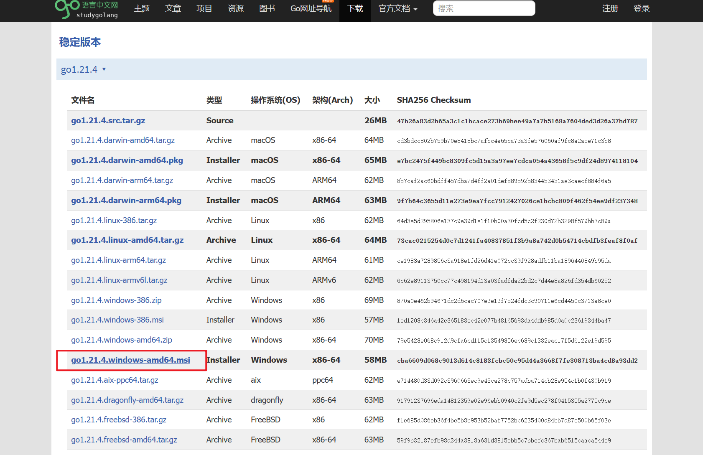

> 学习资料
>
> https://www.bilibili.com/video/BV1ae41157o9
>
> https://www.kuangstudy.com/bbs/1579340844195336194
>
> https://blog.csdn.net/qq_56517253/article/details/131988859

### Go语言环境安装

下载地址：https://studygolang.com/dl

安装完成后，命令行输入 `go version` 是否安装成功查看，使用 `go env` 查看环境

~~~powershell
PS C:\Windows\system32> go version
go version go1.21.4 windows/amd64
~~~

新版本不再需要配置GOROOT、GOPATH环境变量，有需要可自己更改GOPATH（存放下载的资源和代码路径）。GOPATH目录下建三个文件夹：**src、pkg、bin**。