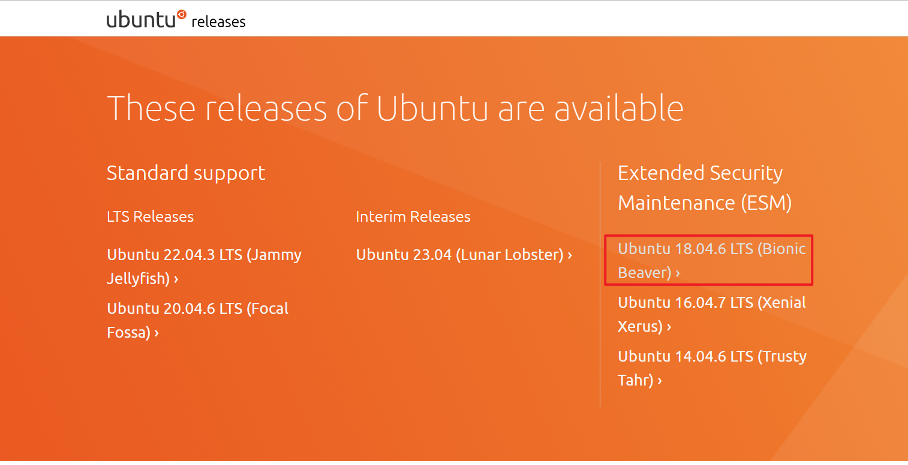
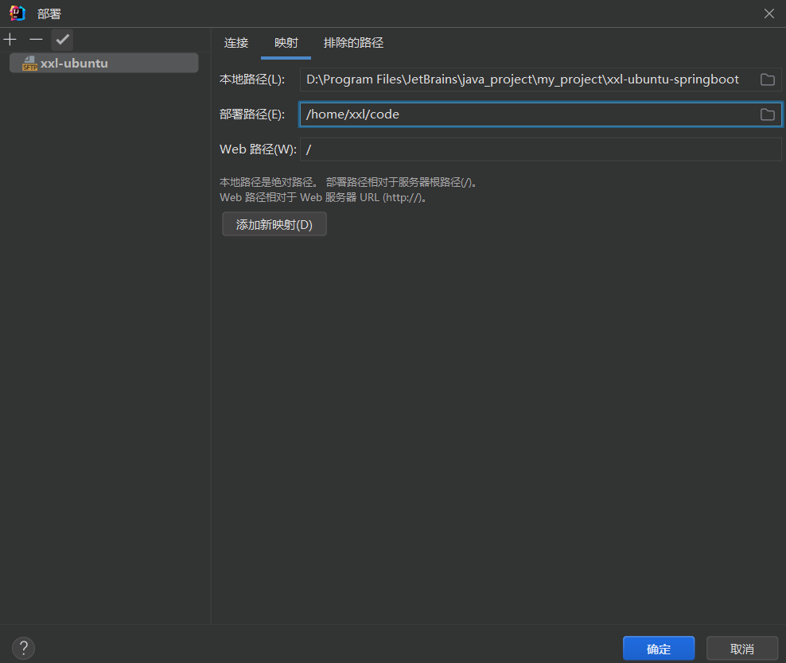
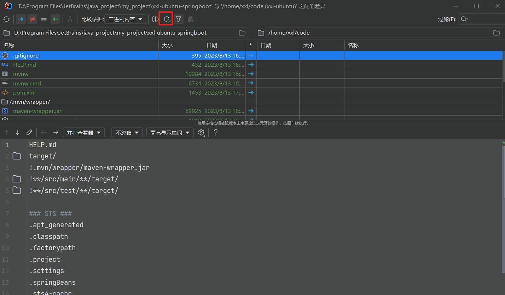
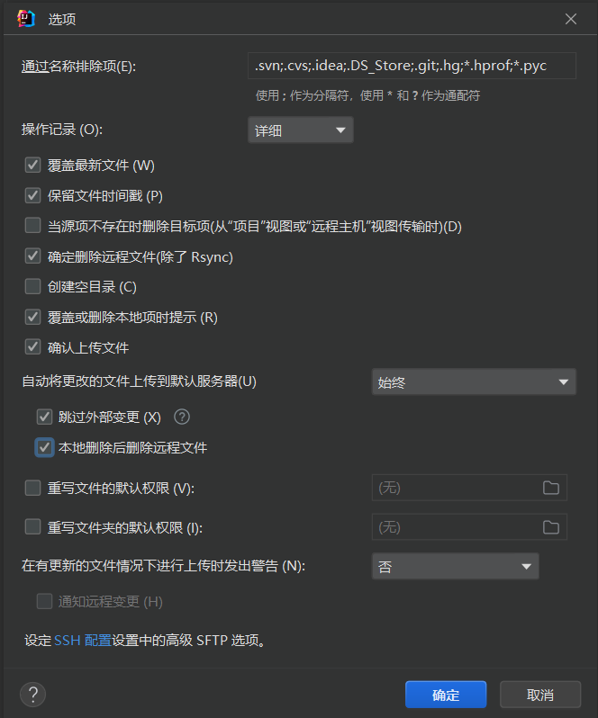
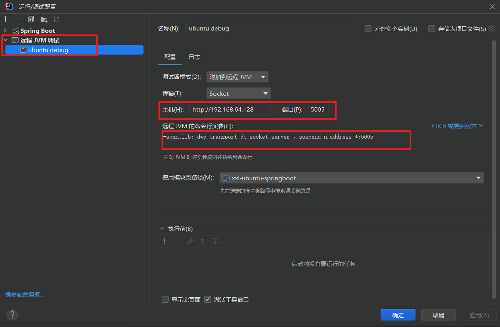
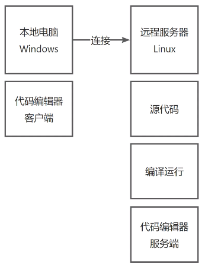
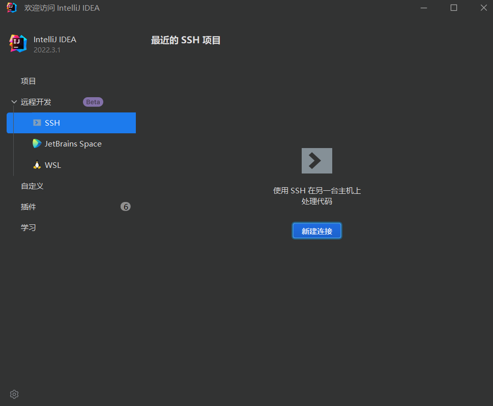
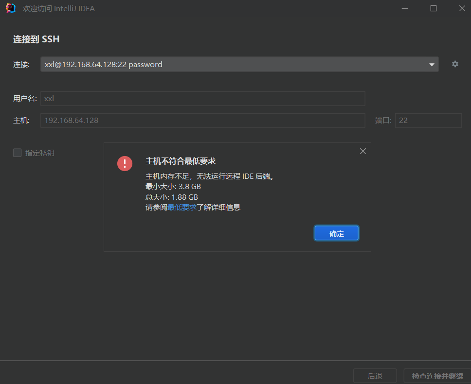
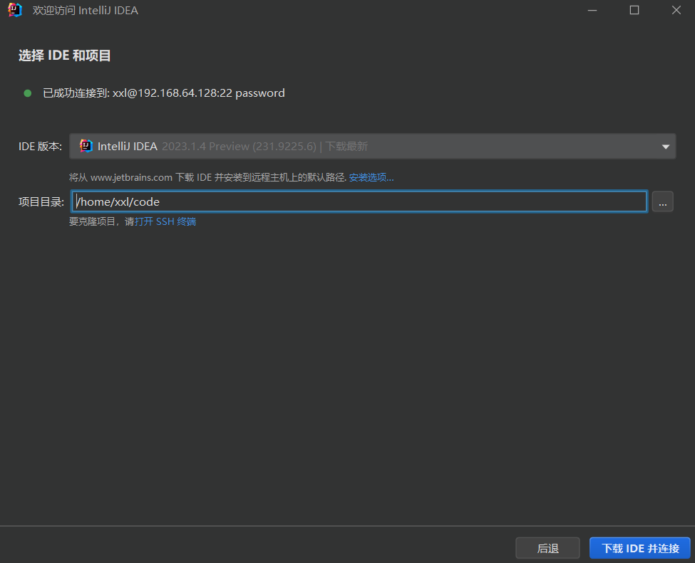
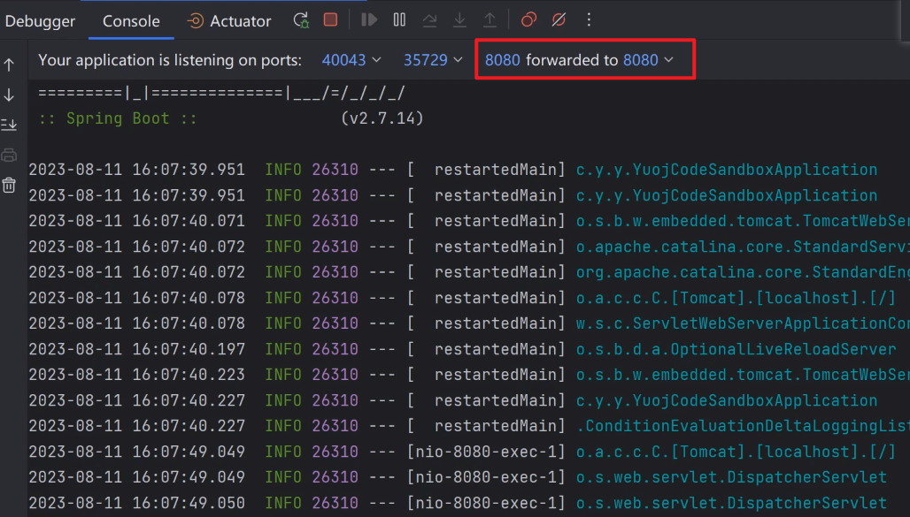

远程环境：Ubuntu（Docker+JDK+maven）
本地：IDEA

## 安装虚拟机

### VMware下载安装

VMware下载：[https://www.vmware.com/cn/products/workstation-player.html](https://www.vmware.com/cn/products/workstation-player.html)
下载，更改安装位置进行安装。
启动，选择免费试用，免费版足够满足大部分开发需求。


### 镜像下载

centos（已停止维护）：[https://www.centos.org/download/](https://www.centos.org/download/)
或
ubuntu：[https://releases.ubuntu.com/](https://releases.ubuntu.com/)


### 安装镜像

打开VMware，新建虚拟机，选择镜像文件。

指定虚拟机目录，建议直接在vmware安装目录下新建个目录安装。

设置给虚拟机分配的硬盘空间大小。

根据实际自定义硬件，点击完成。

等待安装完成。☕

更改分辨率：按下win键，输入 **resolution** ，设置为 200%。
更改系统语言：按下win键，输入 **language**，安装语言支持，安装字体，在字体列表拖到第一位，**apply system wide **全局应用，重启生效。
中文输入法：按下win键，输入 **language**，区域和语言，添加输入源，选择汉语，删掉英语，安装后shift切换中英文。
更改时区：按下win键，输入 **time**，选择上海。

软件安装
1、ubuntu应用商店。
2、终端命令行（快捷键 Ctrl+Alt+T，ubuntu默认安装有apt软件包管理器）。

docker安装

```shell
// docker安装 可以加-y不再询问
sudo apt install docker.io
// ctrl+R 清屏
// 查看docker版本
docker -v
// 执行远程镜像
sudo docker run hello-world
```

## 远程开发准备

远程开发，在本地Win上操作Linux服务器开发
方式一：远程部署
方式二：纯远程开发

### 保证网络连通

```shell
// 查看ip，第一次使用根据提示进行安装
ifconfig
// 安装网络查看工具
sudo apt install net-tools
```

查看ip

win上测试是否连通


### 安装ssh支持

```shell
// 安装ssh支持
sudo apt-get install openssh-server
// 查看ssh服务是否开启
ps -ef | grep ssh
```

### 安装java环境

```shell
// 更新软件包信息
sudo apt update
// 安装jdk
sudo apt install openjdk-11-jdk
// 查看java版本是否安装成功
java -version

// 安装依赖管理工具maven
sudo apt install maven
// 查看maven版本是否安装成功
mvn -v

```

## 远程部署

在本地电脑写代码开发，通过文件同步等方式把代码同步到远程Linux服务器。
启动项目时，用本地电脑连接远程Linux服务器，通过远程执行命令的方式来编译代码，运行代码。
远程开发6个阶段：编写代码、文件同步、代码运行、编译构建、部署调试。


### IDEA配置

建立一个简单地springboot测试项目

配置文件同步

添加sftp配置，配置ssh地址

配置文件映射

项目上右键部署


在Linux上进入映射目录查看是否同步成功。
如果嫌每次手动同步麻烦，可以开启自动同步

选项options中可以配置不弹框提示删除


### 远程运行

进入IDEA终端，连接远程服务器


```shell
// 进入代码目录
cd code
// 使用maven运行
mvn spring-boot:run
```

等待依赖下载启动☕，访问接口地址测试 [http://192.168.64.128:8080/helloUbuntu](http://192.168.64.128:8080/helloUbuntu)

### 远程部署

```shell
// 打包
mvn package
// 运行
java -jar /home/xxl/code/target/xxl-ubuntu-springboot-0.0.1-SNAPSHOT.jar --spring.profiles.active=prod

```

### 远程调试

IDEA增加远程JVM调试配置

项目启动时增加命令行参数

```shell
java -agentlib:jdwp=transport=dt_socket,server=y,suspend=n,address=*:5005 -jar /home/xxl/code/target/xxl-ubuntu-springboot-0.0.1-SNAPSHOT.jar --spring.profiles.active=prod
```

IDEA启动debug，断点即可调试。

## 纯远程开发

本地只提供开发界面，代码等都在服务器上。

IDEA进入入口页面，新建ssh连接

此方式对服务器内存有一定要求。


打开项目后启动。
启动时可能会报执行错误，需要在setting-compiler-vm option中增加参数
-Djdk.lang.Process.launchMechanism=vfork

设置转发端口，即可直接访问本地地址。


