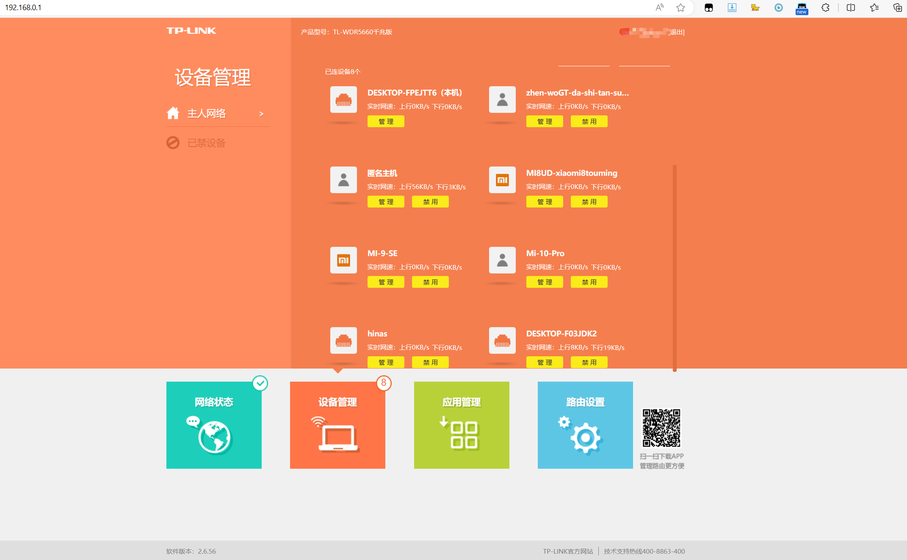
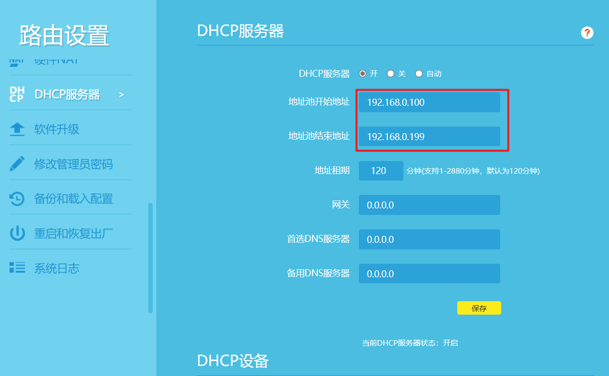
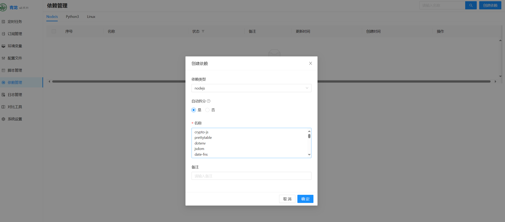

## 一、准备工作（海纳思）

### 1、刷机

玩客云刷机海纳斯系统官方教程：

[https://doc.ecoo.top/docs/tutorial-basics/s805](https://doc.ecoo.top/docs/tutorial-basics/s805)

遇到问题

1. 1、烧录软件无法连接：可能先通电后短接就无效，要先连接双公头USB，再短接住不松手，最后通电，通电后玩客云指示灯不会亮。也可能是短接镊子或者电线氧化，无法通电，换个短接线尝试。
2. 2、点击开始之后，提示romcode/初始化ddr/设备识别/usb控制命令出错：可能是usb不是2.0，换个USB接口重新连接上再开始烧录。
3. 3、提示设备限流相关，是因为插入了U盘或者SD卡等，先拔出，再重新开始烧录。

进入终端页面提示

~~~ssh
欢迎使用 海纳思 32-bit 系统

原创作者: 神雕Teasiu
贡献成员: Xjm MinaDee
教程地址: http://192.168.0.106
官网地址: https://www.ecoo.top
社区地址: https://bbs.histb.com | 欢迎访问我们的社区, 你的肯定是对我们最大的支持!

版权声明:
        1. 作者唯一闲鱼账号: 神雕teasiu
        2. 本系统仅在官网发布, 任何人均可免费下载安装和使用
        3. 如果你是在不良奸商手上购买本系统, 请尝试协商退款或予以差评
        3. 本系统开通的服务仅仅用于学习研究, 不得用于任何非法用途
        4. 未经作者授权, 不得将系统用于盈利售卖, 不得用于衍生的任何软件变相收费, 否则视为侵权行为

提示: 本内容仅显示一次, 烦请仔细阅读, 后续执行 'copyright' 指令即可再次阅读本页面!

提示: 本内容仅显示一次, 请首次进入终端后更改root和ubuntu用户密码为强密码!
~~~

### 2、查看IP为远程登录做准备

登录路由器后台查看

点击管理按钮，查看其IP地址

确定本机在路由器中分配的IP地址。

### 3、远程登录

使用ssh远程工具登录到后台。

系统提供了两个账户，一个是具有全部权限的 root 用户，一个是普通权限的 ubuntu 用户，

默认账号 `root`，默认密码 `ecoo1234`

默认账号 `ubuntu`，默认密码 `ecoo1234`

### 4、修改root密码

`passwd root`

~~~sh
root@hinas:~# passwd root
New password:
Retype new password:
passwd: password updated successfully
~~~

### 5、设置固定IP

默认情况下，设备的IP是被路由系统DHCP自动分配的，每次关机或重启后，路由器会重新给设备分配地址，这会造成我们每次重启后的IP不一样。会给我们的管理工作带来不便。为此我们需要固定设备的IP地址。

首先需要查看路由器的DHCPIP分配段，我们设备的IP需要设置到这个分配段之外，防止这个IP被DHCP自动分配给给它设备。

打开路由器的管理界面，点击路由设置，选择DHCP服务。

可以看到，路由器DHCP的地址池是在192.168.14.100-192.168.199之间进行分配。对设备设置的地址要在这个地址段之外，如我设置为192.168.14.99。

在ssh终端输入`ifconfig`，可以看到设备的MAC地址为：00:11:22:33:44:66。记住这个MAC地址，后面需要用上。

在ssh终端中，输入`vi /etc/network/interfaces.d/eth0`，对网卡的配置文件进行编辑。

~~~sh
auto eth0
iface eth0 inet dhcp
pre-up ifconfig eth0 hw ether 00:11:22:33:44:66
~~~

修改后

~~~sh
auto eth0
iface eth0 inet static #设置网卡地址为静态
address 192.168.0.99 #设置网卡的IP地址，需要在路由分配地址之外
network 192.168.0.0
netmask 255.255.255.0 #子网掩码
broadcast 192.168.0.255 #广播地址
gateway 192.168.0.1 #网关地址
dns-nameservers 192.168.0.1 #DNS地址
pre-up ifconfig eth0 hw ether 00:11:22:33:44:66 #MAC地址：前面在ifconfig中查询的结果
~~~

编辑完成后输入ESC和:wq保存退出。

~~~sh
sudo ifdown eth0 && sudo ifup eth0
~~~

[用海纳思做web服务器并进行内网透传的实例-CSDN博客](https://blog.csdn.net/hnkkfan/article/details/138360833)

## 二、CasaOS

armbian casaos

https://blog.csdn.net/xianyun_0355/article/details/137931849

https://blog.csdn.net/qyj19920704/article/details/139326876

https://post.smzdm.com/p/a96odq3p

## 三、使用

### 1、青龙面板

#### 1、安装青龙面板

玩客云提供安装脚本

~~~sh
# 直接执行 install-qinglong.sh
root@hinas:~#  install-qinglong.sh
~~~

但是脚本中拉取的版本不是最新的，老版本系统设置中缺少依赖设置

如果需要最新版，修改 `/usr/share/bak/gitweb/docker-compose-ql.yaml`

~~~yaml
version: '3.0'
services:
   ql:
    # image: registry.cn-hangzhou.aliyuncs.com/histb/qinglong:latest
    image: whyour/qinglong:latest # 最新版本
    container_name: ql
    restart: always
    volumes:
       - /qinglong/ql/config:/ql/config
       - /qinglong/ql/scripts:/ql/scripts
       - /qinglong/ql/repo:/ql/repo
       - /qinglong/ql/log:/ql/log
       - /qinglong/ql/db:/ql/db
       - /qinglong/ql/jbot:/ql/jbot
       - /qinglong/ql/raw:/ql/raw
    ports:
       - 5700:5700
~~~

再次执行`install-qinglong.sh`

https://www.bilibili.com/video/BV1saskeEEF4

docker安装青龙面板

https://blog.csdn.net/u012374381/article/details/128955553

https://www.voidking.com/dev-docker-qinglong

拉库命令

https://blog.csdn.net/weixin_42565036/article/details/138579435
https://blog.csdn.net/liu52365/article/details/121233533
https://blog.csdn.net/u011027547/article/details/130703685
docker下载镜像慢

https://www.cnblogs.com/xietingfeng321/p/18451170

https://www.cnblogs.com/shenhuanjie/p/18428209

#### 2、京东定时任务

浏览器获取京东cookie教程

https://www.xujiahua.com/8405.html

[青龙面板快手极速版教程_青龙 快手-CSDN博客](https://blog.csdn.net/xuekaitt/article/details/123037703)

#### 3、DDNSTO内网穿透

[Step1: 登录官网 控制台拿到“令牌” | 易有云产品中心 (linkease.com)](https://doc.linkease.com/zh/guide/ddnsto/start.html)

[UNRAID一篇就够！DDNSTO最简单的内网穿透_NAS存储_什么值得买 (smzdm.com)](https://post.smzdm.com/p/a3dd9qwn/)

#### 4、青龙面板设置飞书机器人

https://blog.csdn.net/weixin_45207619/article/details/138449360
https://blog.csdn.net/A1682234/article/details/135520783

#### 5、青龙面板怎么更新依赖

https://blog.csdn.net/xiaojing_yu/article/details/124141113

~~~
crypto-js
prettytable
dotenv
jsdom
date-fns
tough-cookie
tslib
ws@7.4.3
ts-md5
jsdom -g
jieba
fs
form-data
json5
global-agent
png-js
@types/node
require
typescript
js-base64
axios
moment
qs
~~~

依赖下载慢，更换镜像源

https://blog.csdn.net/Xue1633851708/article/details/139997567

Node 软件包镜像源：https://npm.aliyun.com、https://registry.npmmirror.com（推荐）

Python 软件包镜像源：https://pypi.tuna.tsinghua.edu.cn/simple、https://mirrors.aliyun.com/pypi/simple/

Linux 软件包镜像源：http://mirrors.cloud.aliyuncs.com

https://help.yunjiutian.com/project-1/doc-75/

更新
https://blog.csdn.net/cfm_gavin/article/details/142140699

https://github.com/trytrytogo/jinyinshouzhi?tab=readme-ov-file
https://github.com/dandanainiyo/SignBox/blob/master/config.py
https://github.com/Sitoi/dailycheckin?tab=readme-ov-file