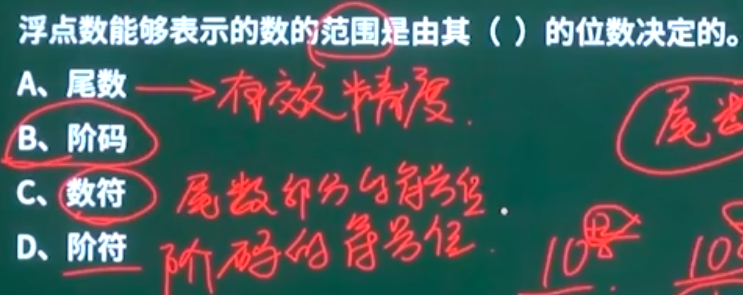
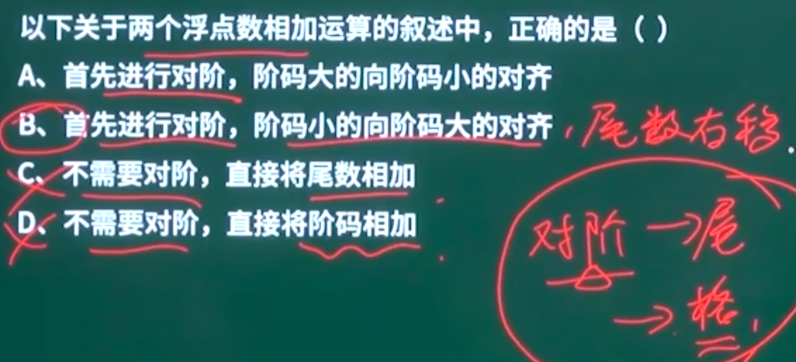
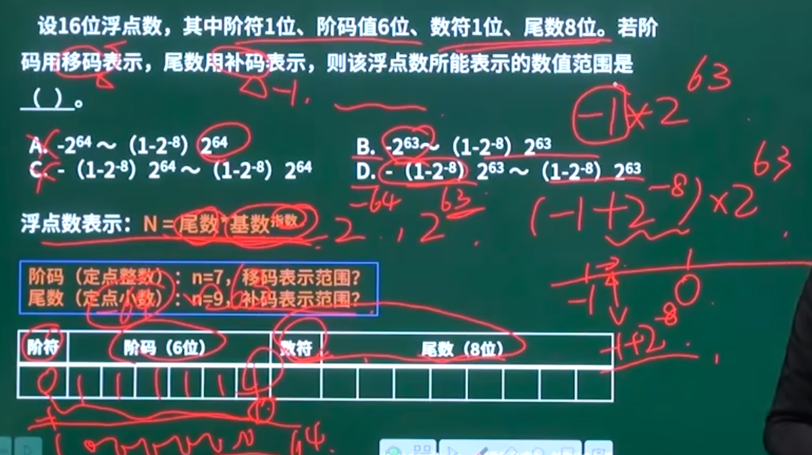
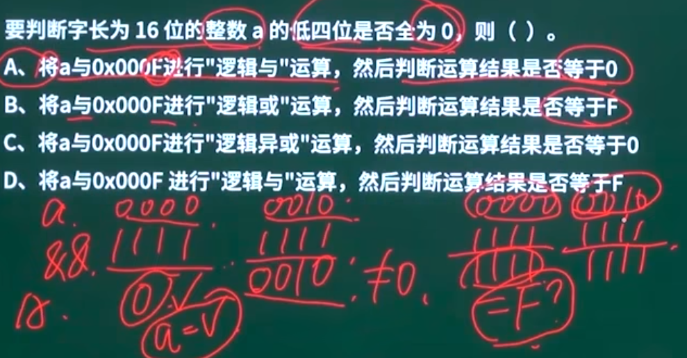
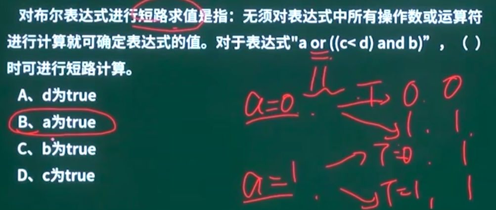

## 一、数据的表示

考点1：进制转换

考点2：码制（原码/反码/补码/移码）

考点3：浮点数的表示

考点4：逻辑运算

### 数据的表示考点1-进制转换

#### 按权展开法

**R进制转十进制**使用按权展开法，其具体操作方式为: 将R进制数的每一位数值用R^k形式表示，即幂的底数是R，指数为k，k与该位和小数点之间的距离有关。当该位位于小数点左边，k值是该位和小数点之间数码的个数，而当该位位于小数点右边，k值是负值，其绝对值是该位和小数点之间数码的个数加1。

数码*位权

示例一：二进制转十进制
$$
10100.01
\\=10000+0+100+0+0+0.01
\\=1*10^4+0+1*10^2+0+0+1*10^-2
\\=1*2^4+1*2^2+1*2^{-2}
$$

示例二：七进制转十进制
$$
604.01
=6*7^2+4*7^0+1*7^{-2}
$$

#### 短除法

**十进制转R进制**使用短除法（除基取余法）。

商为0截止

余数从下往上记录

#### 减法

**十进制转二进制**使用减法。

例如将94转换为二进制数。
$$
2^{0}=1,
\\2^{1}=2,
\\2^{2}=4,
\\2^{3}=8,
\\2^{4}=16,
\\2^{5}=32,
\\2^{6}=64,
\\2^{7}=128,
\\2^{8}=256,
\\2^{9}=512,
\\2^{10}=1024
$$

$$
小于且离94最近的乘幂为64：94-64=30 (2^6=64)\\
小于且离30最近的乘幂为16：30-16=14 (2^4=16)\\
小于且离14最近的乘幂为8：14-8=6 (2^3=8)\\
小于且离6最近的乘幂为4：6-4=2 (2^2=4)\\
小手且离2最近的乘幂为2：2-2=0 (2^1=2)\\
结束
$$

| 位号 | 6    | 5    | 4    | 3    | 2    | 1    | 0    |
| ---- | ---- | ---- | ---- | ---- | ---- | ---- | ---- |
| 取值 | 1    | 0    | 1    | 1    | 1    | 1    | 0    |

#### 二进制转八进制与十六进制

二进制转八进制

~~~
010 001 110
2  1   6
~~~

二进制转十六进制

~~~
1000 1110
8    E
~~~

### 数据的表示考点2-码制（原码/反码/补码/移码）

原码：最高位是符号位，其余低位表示数值的绝对值。

反码：正数的反码与原码相同，负数的反码是其绝对值按位取反（符号位不变）。

补码：正数的补码与原码相同，负数的补码是其反码末位加1（符号位不变）。

移码：补码的符号位按位取反。

|      | 数值1     | 数值-1    | 1-1       |                            |
| ---- | --------- | --------- | --------- | -------------------------- |
| 原码 | 0000 0001 | 1000 0001 | 1000 0010 | 后面变成10，即-2，偏差较大 |
| 反码 | 0000 0001 | 1111 1110 | 1111 1111 | -0，实际中没有负数，也不对 |
| 补码 | 0000 0001 | 1111 1111 | 0000 0000 | +0，结果正确               |
| 移码 | 1000 0001 | 0111 1111 | 1000 0000 |                            |

定点整数、定点小数、数码个数

什么是定点？小数点在数的前面还是后面，小数点在数的后面是纯整数，小数点在数的前面是纯小数。

为什么需要定点？计算机不认识小数，只有纯整数、纯小数。

| 码制 | 定点整数                        | 定点小数                        | 数码个数  |
| ---- | ------------------------------- | ------------------------------- | --------- |
| 原码 | $-（2^{n-1}-1）~+（2^{n-1}-1）$ | $-（2^{n-1}-1）~+（2^{n-1}-1）$ | $2^{n-1}$ |
| 反码 | $-（2^{n-1}-1）~+（2^{n-1}-1）$ | $-（2^{n-1}-1）~+（2^{n-1}-1）$ | $2^{n-1}$ |
| 补码 | $-2^{n-1}~+（2^{n-1}-1）$       | $-1~+（1-2^{-(n-1)}）$          | $2^{n}$   |
| 移码 | $-2^{n-1}~+（2^{n-1}-1）$       | $-1~+（1-2^{-(n-1)}）$          | $2^{n}$   |

定点整数示例

n=3时，位数是3位，每位由0/1组成：0/1、0/1、0/1

编码形式，第一位是符号位：000、001、010、011、100、101、110、111

最高位是符号位，4位正数、4位负数，

范围为+0—+3，-0—-3

11补一位变成100，2^2-1，即公式中的
$$
2^{n-1}-1
$$
定点小数示例

第一位依然是符号位，最小0.00，最大0.11，-0.00，-0.11

0.11补整变成2的k次方形式：0.11+0.01=1.00，即为公式中的
$$
1-2^{-(n-1)}
$$

### 数据的表示考点3：浮点数的表示

#### 浮点的运算

:sunny:浮点数表示
$$
N=尾数*基数^{指数}
$$

解释：

- 浮点：指的是小数点不固定
- 尾数：定点小数
- 基数：可以叫阶码，一般是定点整数
- 以科学计数法为例，1.25*10^6

:sunny:运算过程

对阶>尾数计算>结果格式

:sunny:特点

1、一般尾数用**补码**，阶码用移码

2、**阶码的位数**决定数的**表示范围**，位数越多范围越大

3、**尾数的位数**决定数的**有效精度**，位数越多精度越高

4、对阶时，**小数向大数看齐**

5、对阶是通过**较小数的尾数右移**实现的

#### 例题

### 数据的表示考点4：逻辑运算

#### 关系运算符

:nail_care:关系运算符及其优先次序

优先级相同（高）

- <（小于）
- <=（小于等于）
- \>（大于）
- \>=（大于等于）

优先级相同（低）

- ==（等于）
- !=（不等于）

说明：

:nail_care:关系运算符的优先级低于算术运算符

:nail_care:关系运算符的优先级高于赋值运算符

#### 逻辑运算

逻辑变量之间的运算称为逻辑运算。二进制数1和0在逻辑上可以代表“真”与“假”。

逻辑运算

- 逻辑或（||、+、U、V、OR）：连接的两个逻辑值全0时才取0
- 逻辑与（&&、*、·、∩、∧、AND）：连接的两个逻辑值全1时才取1
- 逻辑异或（⊕、XOR）：连接的两个逻辑值不相同时才取1，相同则取0
- 逻辑非（！、¬、~、NOT、-）：将原逻辑值取反即可

真值表：描述一个逻辑表达式与其变量之间的关系

| A    | B    | ！A  | A+B（A\|\|B） | A*B（A&&B） | A⊕B  |
| ---- | ---- | ---- | ------------- | ----------- | ---- |
| 0    | 0    | 1    | 0             | 0           | 0    |
| 0    | 1    | 1    | 1             | 0           | 1    |
| 1    | 0    | 0    | 1             | 0           | 1    |
| 1    | 1    | 0    | 1             | 1           | 0    |

#### 逻辑运算符

:smile_cat:逻辑运算符

&&（逻辑与）相当于其他语言中的AND

||（逻辑或）相当于其他语言中的OR

！（逻辑非）相当于其他语言中的NOT

例：a&&b 若a，b为真，则a&&b为真。

a||b 若a，b之一为真，则a||b为真。

!a 若a为真，则!a为假。

:smile_cat:优先次序：

！（非）->&&（与）->||（或）

逻辑运算符中的"&&"和"||"低于关系运算符，“！”高于算术运算符

因此运算符的优先顺序为: ！>算术运算符>关系运算符>&8>||>赋值运算符

:smile_cat:短路原则
在逻辑表达式的求解中，并不是所有的逻辑运算符都要被执行。

（1）a&&b&&c 只有a为真时，才需要判断b的值，只有a和b都为真时，才需
要判断c的值。
（2）a||b||c 只要a为真，就不必判断b和c的值，只有a为假，才判断b。a和b
都为假才判断c。

例：（m=a>b）&&（n=c>d）

当a=1,b=2,c=3,d=4,m和n的原值为1时，由于"a>b"的值为0，因此m=0，而
"n=c>d"不被执行，因此n的值不是0而仍保持原值1。

#### 例题

## 校验码

考点1：奇偶校验码

考点2：CRC循环冗余校验码

考点3：海明校验码:star:

## 二、数据库的基本概念

考点1：数据库体系结构

考点2：三级模式结构

考点3：数据仓库

### 数据库系统的体系结构

### 三级模式和两级映像

概念设计阶段

考点1：概念设计过程

考点2：E-R图

## 学习资料

https://www.bilibili.com/video/BV13U4y1E7oA