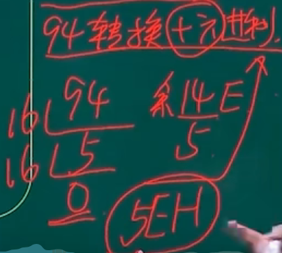

## 数据的表示

考点1：进制转换

考点2：码制（原码/反码/补码/移码）

考点3：浮点数的表示

考点4：逻辑运算

### 数据的表示-进制转换

#### 按权展开法

**R进制转十进制**使用按权展开法，其具体操作方式为: 将R进制数的每一位数值用R^k形式表示，即幂的底数是R，指数为k，k与该位和小数点之间的距离有关。当该位位于小数点左边，k值是该位和小数点之间数码的个数，而当该位位于小数点右边，k值是负值，其绝对值是该位和小数点之间数码的个数加1。

数码*位权

示例一：二进制转十进制
$$
10100.01
\\=10000+0+100+0+0+0.01
\\=1*10^4+0+1*10^2+0+0+1*10^-2
\\=1*2^4+1*2^2+1*2^{-2}
$$

示例二：七进制转十进制
$$
604.01
=6*7^2+4*7^0+1*7^{-2}
$$

#### 短除法

**十进制转R进制**使用短除法（除基取余法）。

商为0截止

余数从下往上记录

#### 减法

**十进制转二进制**使用减法。

例如将94转换为二进制数。
$$
2^{0}=1,
\\2^{1}=2,
\\2^{2}=4,
\\2^{3}=8,
\\2^{4}=16,
\\2^{5}=32,
\\2^{6}=64,
\\2^{7}=128,
\\2^{8}=256,
\\2^{9}=512,
\\2^{10}=1024
$$

$$
小于且离94最近的乘幂为64：94-64=30 (2^6=64)\\
小于且离30最近的乘幂为16：30-16=14 (2^4=16)\\
小于且离14最近的乘幂为8：14-8=6 (2^3=8)\\
小于且离6最近的乘幂为4：6-4=2 (2^2=4)\\
小手且离2最近的乘幂为2：2-2=0 (2^1=2)\\
结束
$$

