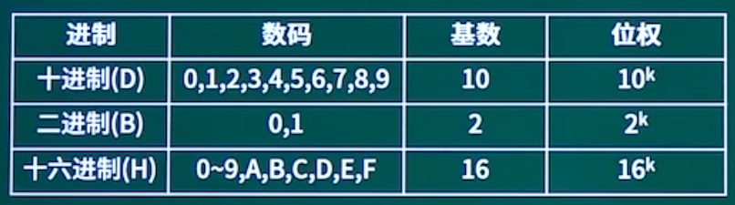

## 计算机组成与体系结构

大纲

考情分析

## 一、数据的表示

考点1：进制转换

考点2：码制（原码/反码/补码/移码）

考点3：浮点数的表示

考点4：逻辑运算

### 数据的表示考点1-进制转换

#### :cat:按权展开法

**R进制转十进制**使用按权展开法，其具体操作方式为: 将R进制数的每一位数值用R^k形式表示，即幂的底数是R，指数为k，k与该位和小数点之间的距离有关。当该位位于小数点左边，k值是该位和小数点之间数码的个数，而当该位位于小数点右边，k值是负值，其绝对值是该位和小数点之间数码的个数加1。

数码*位权

示例一：二进制转十进制
$$
10100.01
\\=10000+0+100+0+0+0.01
\\=1*10^4+0+1*10^2+0+0+1*10^-2
\\=1*2^4+1*2^2+1*2^{-2}
$$

示例二：七进制转十进制
$$
604.01
=6*7^2+4*7^0+1*7^{-2}
$$

#### :cat:短除法

**十进制转R进制**使用短除法（除基取余法）。

商为0截止

余数从下往上记录

#### :cat:减法

**十进制转二进制**使用减法。

例如将94转换为二进制数。
$$
2^{0}=1,
\\2^{1}=2,
\\2^{2}=4,
\\2^{3}=8,
\\2^{4}=16,
\\2^{5}=32,
\\2^{6}=64,
\\2^{7}=128,
\\2^{8}=256,
\\2^{9}=512,
\\2^{10}=1024
$$

$$
小于且离94最近的乘幂为64：94-64=30 (2^6=64)\\
小于且离30最近的乘幂为16：30-16=14 (2^4=16)\\
小于且离14最近的乘幂为8：14-8=6 (2^3=8)\\
小于且离6最近的乘幂为4：6-4=2 (2^2=4)\\
小手且离2最近的乘幂为2：2-2=0 (2^1=2)\\
结束
$$

| 位号 | 6    | 5    | 4    | 3    | 2    | 1    | 0    |
| ---- | ---- | ---- | ---- | ---- | ---- | ---- | ---- |
| 取值 | 1    | 0    | 1    | 1    | 1    | 1    | 0    |

#### :cat:二进制转八进制与十六进制

二进制转八进制

~~~
010 001 110
2  1   6
~~~

二进制转十六进制

~~~
1000 1110
8    E
~~~

### 数据的表示考点2-码制（原码/反码/补码/移码）

原码：最高位是符号位，其余低位表示数值的绝对值。

反码：正数的反码与原码相同，负数的反码是其绝对值按位取反（符号位不变）。

补码：正数的补码与原码相同，负数的补码是其反码末位加1（符号位不变）。

移码：补码的符号位按位取反。

|      | 数值1     | 数值-1    | 1-1       |                            |
| ---- | --------- | --------- | --------- | -------------------------- |
| 原码 | 0000 0001 | 1000 0001 | 1000 0010 | 后面变成10，即-2，偏差较大 |
| 反码 | 0000 0001 | 1111 1110 | 1111 1111 | -0，实际中没有负数，也不对 |
| 补码 | 0000 0001 | 1111 1111 | 0000 0000 | +0，结果正确               |
| 移码 | 1000 0001 | 0111 1111 | 1000 0000 |                            |

定点整数、定点小数、数码个数

什么是定点？小数点在数的前面还是后面，小数点在数的后面是纯整数，小数点在数的前面是纯小数。

为什么需要定点？计算机不认识小数，只有纯整数、纯小数。

| 码制 | 定点整数                        | 定点小数                        | 数码个数  |
| ---- | ------------------------------- | ------------------------------- | --------- |
| 原码 | $-（2^{n-1}-1）~+（2^{n-1}-1）$ | $-（2^{n-1}-1）~+（2^{n-1}-1）$ | $2^{n-1}$ |
| 反码 | $-（2^{n-1}-1）~+（2^{n-1}-1）$ | $-（2^{n-1}-1）~+（2^{n-1}-1）$ | $2^{n-1}$ |
| 补码 | $-2^{n-1}~+（2^{n-1}-1）$       | $-1~+（1-2^{-(n-1)}）$          | $2^{n}$   |
| 移码 | $-2^{n-1}~+（2^{n-1}-1）$       | $-1~+（1-2^{-(n-1)}）$          | $2^{n}$   |

定点整数示例

n=3时，位数是3位，每位由0/1组成：0/1、0/1、0/1

编码形式，第一位是符号位：000、001、010、011、100、101、110、111

最高位是符号位，4位正数、4位负数，

范围为+0—+3，-0—-3

11补一位变成100，2^2-1，即公式中的
$$
2^{n-1}-1
$$
定点小数示例

第一位依然是符号位，最小0.00，最大0.11，-0.00，-0.11

0.11补整变成2的k次方形式：0.11+0.01=1.00，即为公式中的
$$
1-2^{-(n-1)}
$$

### 数据的表示考点3：浮点数的表示

#### :rabbit:浮点的运算

:sunny:浮点数表示
$$
N=尾数*基数^{指数}
$$

解释：

- 浮点：指的是小数点不固定
- 尾数：定点小数
- 基数：可以叫阶码，一般是定点整数
- 以科学计数法为例，1.25*10^6

:sunny:运算过程

对阶>尾数计算>结果格式

:sunny:特点

1、一般尾数用**补码**，阶码用移码

2、**阶码的位数**决定数的**表示范围**，位数越多范围越大

3、**尾数的位数**决定数的**有效精度**，位数越多精度越高

4、对阶时，**小数向大数看齐**

5、对阶是通过**较小数的尾数右移**实现的

#### :rabbit:例题

### 数据的表示考点4：逻辑运算

#### :wolf:关系运算符

:nail_care:关系运算符及其优先次序

优先级相同（高）

- <（小于）
- <=（小于等于）
- \>（大于）
- \>=（大于等于）

优先级相同（低）

- ==（等于）
- !=（不等于）

说明：

:nail_care:关系运算符的优先级低于算术运算符

:nail_care:关系运算符的优先级高于赋值运算符

#### :wolf:逻辑运算

逻辑变量之间的运算称为逻辑运算。二进制数1和0在逻辑上可以代表“真”与“假”。

逻辑运算

- 逻辑或（||、+、U、V、OR）：连接的两个逻辑值全0时才取0
- 逻辑与（&&、*、·、∩、∧、AND）：连接的两个逻辑值全1时才取1
- 逻辑异或（⊕、XOR）：连接的两个逻辑值不相同时才取1，相同则取0
- 逻辑非（！、¬、~、NOT、-）：将原逻辑值取反即可

真值表：描述一个逻辑表达式与其变量之间的关系

| A    | B    | ！A  | A+B（A\|\|B） | A*B（A&&B） | A⊕B  |
| ---- | ---- | ---- | ------------- | ----------- | ---- |
| 0    | 0    | 1    | 0             | 0           | 0    |
| 0    | 1    | 1    | 1             | 0           | 1    |
| 1    | 0    | 0    | 1             | 0           | 1    |
| 1    | 1    | 0    | 1             | 1           | 0    |

#### :wolf:逻辑运算符

**逻辑运算符**

- &&（逻辑与）相当于其他语言中的AND
- ||（逻辑或）相当于其他语言中的OR
- ！（逻辑非）相当于其他语言中的NOT

例：a&&b 若a，b为真，则a&&b为真。

a||b 若a，b之一为真，则a||b为真。

!a 若a为真，则!a为假。

**优先次序：**

！（非）->&&（与）->||（或）

逻辑运算符中的"&&"和"||"低于关系运算符，“！”高于算术运算符

因此运算符的优先顺序为: ！>算术运算符>关系运算符>&8>||>赋值运算符

**短路原则**
在逻辑表达式的求解中，并不是所有的逻辑运算符都要被执行。

- （1）a&&b&&c 只有a为真时，才需要判断b的值，只有a和b都为真时，才需
  要判断c的值。
- （2）a||b||c 只要a为真，就不必判断b和c的值，只有a为假，才判断b。a和b
  都为假才判断c。

例：（m=a>b）&&（n=c>d）

当a=1,b=2,c=3,d=4,m和n的原值为1时，由于"a>b"的值为0，因此m=0，而
"n=c>d"不被执行，因此n的值不是0而仍保持原值1。

#### :wolf:例题

## 二、校验码

考点1：奇偶校验码

考点2：CRC循环冗余校验码

考点3：海明校验码:star:

### 考点1：奇偶校验码

#### :dog:基础知识

码距：任何一种编码都由许多码字构成，任意两个码字之间最少变化的二进制位数就称为数据校验码的码距。

例如，用4位二进制表示16种状态，则有16个不同的码宇，此时码距为1。如0000与0001。

#### :dog:奇偶校验

奇偶校验码的编码方法是：由若干位有效信息（如一个字节），再加上一个二进制位(校验位)组成校验码。

奇校验：整个校验码 (有效信息位和校验位)中"1”的个数为奇数。（奇数校验码：在发送端增加一位校验位且根据数据中已有的1的个数改变校验位的状态使整段二进制码中1的个数为奇数。接收端根据对应规则判断二进制中数据是否为奇来确定是否出错）

偶校验：整个校验码 (有效信息位和校验位)中 “1”的个数为偶数。

**奇偶校验，可检查1位（奇数位）的错误，不可纠错。**

#### :dog:例题

~~~
以下关于采用一位奇校验方法的叙述中，正确的是 (C)。
A、若所有奇数位出错，则可以检测出该错误但无法纠正错误
B、若所有偶数位出错，则可以检测出该错误并加以纠正
C、若有奇数个数据位出错，则可以检测出该错误但无法纠正错误
D、若有偶数个数据位出错，则可以检测出该错误并加以纠正
~~~

### 考点2：CRC循环冗余校验码

#### :mouse:CRC循环冗余校验码

**CRC校验，可检错，不可纠错。**

- CRC的编码方法是：**在k位信息码之后拼接r位校验码**（信息位+校验位=生成多项式）。应用CRC码的关键是如何从k 位信息位简便地得到r位校验位（编码），以及如何从k+r位信息码判断是否出错。
- 把接收到的CRC码用约定的生成多项式G(X)去除（**模二除法**），如果正确，则余数为0；如果某一位出错，则余数不为0。不同的位数出错其余数不同，余数和出错位序号之间有惟一的对应关系。

#### :mouse:例题

~~~
在（D）校验方法中，采用模2运算来构造校验位。
A、水平奇偶
B、垂直奇偶
C、海明码
D、循环冗余
~~~

### 考点3：海明校验码

#### :hamster:海明校验码

**海明校验，可检错，也可纠错。**

海明校验码的原理是：在有效信息位中加入几个校验位形成海明码，使码距比较均匀地拉大，并把海明码的

每个二进制位分配到几个奇偶校验组中。当某一位出错后，就会引起有关的几个校验位的值发生变化，这不

但可以发现错误，还能指出错误的位置，为自动纠错提供了依据。
$$
2^r>=m+r+1（m是信息位）
\\2^r-1>=m+r
$$

#### :hamster:三种校验码对比​

|                 | 校验码位数             | 校验码位置       | 检错         | 纠错     | 校验方式                                                     |
| --------------- | ---------------------- | ---------------- | ------------ | -------- | ------------------------------------------------------------ |
| 奇偶校验        | 1                      | 一般拼接在头部   | 可检奇数位错 | 不可检错 | 奇校验：最终1的个数是奇数个； 偶校验：最终1的个数是偶数个； |
| CRC循环冗余校验 | 生成多项式最高次幂决定 | 拼接在信息位尾部 | 可检错       | 不可检错 | 模二除法求余数，拼接作为校验位                               |
| 海明校验        | 2^r>=m+r+1             | 插入在信息位中间 | 可检错       | 可检错   | 分组奇偶校验                                                 |

:hamster:例题

## 三、CPU组成（运算器与控制器）

### :frog:指令的基本概念

一条指令就是机器语言的一个语句，它是一组有意义的二进制代码，指令的基本格式如下：

操作码字段+地址码字段

OP+A1+A2

### :frog:寻址方式

1. 立即寻址方式
   - 特点：**操作数**直接在指令中，度快，灵活性差。
   - 
2. 直接寻址方式
   - 特点：指令中存放的是操作数的**地址**。
   - 
3. 间接寻址方式
   - 特点：指令中存放了一个地址，这个地址对应的内容是操作数的地址。
   - 
4. 寄存器寻址方式
   - 特点：寄存器存放操作数。
   - 
5. 寄存器间接寻址方式
   - 特点：寄存器内存放的是操作数的地址。
   - 

### :frog:例题

~~~markdown
在机器指令的地址字段中，直接指出操作数本身的寻址方式称为 (C)。
A、隐含寻址
B、寄存器寻址
C、立即寻址
D、直接寻址
~~~

参考讲解：

[计算机组成原理——9种常用寻址方式_隐含寻址-CSDN博客](https://blog.csdn.net/qq_44997784/article/details/106519374)

[关于寻址方式一篇就够了 - 知乎 (zhihu.com)](https://zhuanlan.zhihu.com/p/370204019)

## 四、CISC与RISC

### :koala:CISC与RISC对比

| 指令系统类型 | 指令                                                         | 寻址方式   | 实现方式                                             | 其它                       |
| ------------ | ------------------------------------------------------------ | ---------- | ---------------------------------------------------- | -------------------------- |
| CISC（复杂） | 数量多，使用频率差别大，可变长格式                           | 支持多种   | 微程序控制技术（微码）                               | 研制周期长                 |
| RISC（精简） | 数量少，使用频率接近，定长格式，大部分为单周期指令，操作寄存器，只有Load/Store操作内存 | 支持方式少 | 增加了通用寄存器；硬布线逻辑控制为主；适合采用流水线 | 优化编译，有效支持高级语言 |

### :koala:CISC与RISC比较，分哪些维度？

指令数量、指令使用频率，寻址方式，寄存器，流水线支持，高级语言支持

- CISC：复杂，指令数量多，频率差别大，多寻址
- RISC：精筒，指令数量少，操作寄存器，单周期，少寻址，多配用奇存器，流水线

### :koala:例题

~~~
以下关于RISC(精简指令系统计算机)技术的叙述中，错误的是(B)
A、指令长度固定、指令种类尽量少
B、指令功能强大、寻址方式复杂多样
C、增加寄存器数目以减少访存次数
D、用硬布线电路实现指令解码，快速完成指令译码
~~~

## 五、流水线技术

### :tiger:概念​

- 相关参数计算：**流水线执行时间计算、流水线吞吐率**、流水线加速比、流水线效率
- 流水线是指在程序执行时**多条指令重叠进行操作**的一种准并行处理实现技术。各种部件同时处理是针对不同指令而言的，它们可同时为多条指令的不同部分进行工作，以提高各部件的利用率和指令的平均执行速度。

理论公式与实践公式结果会不一样，默认优先理论公式

一条指令的执行过程可以分解为取指、分析和执行三步，在取指时间 t取值=3△t、分析时间 t分析=2△t、执行时间 t执行=4△t的情况下，若按串行方式执行，则10条指令全部执行完需要（90）△t；若按流水线的方式执行，流水线周期为（4）△t，则10条指令全部执行完需要（45）△t。

~~~
k=3，t=4
串行就是顺序执行，（3+2+4）*10=90
按流水线的方式，流水线周期就是执行时间最长的一段4
按流水线的方式，全部执行完 理论：9+（10-1）*4=45   实践：3*4+（10-1）*4=48
~~~

### :tiger:流水线计算

理论公式：
$$
（t_1+t_2+...+t_k）+（n-1）*t
$$

实践公式：
$$
k^t+（n-1）*t
$$

### :tiger:流水线吞吐率计算

流水线的吞吐率（Though Put rate，TP）是指在**单位时间内流水线所完成的任务数量或输出的结果数量**。计算流水线吞吐率的最基本的公式如下（流水线执行时间使用理论公式）：
$$
TP=\frac{指令条数}{流水线执行时间}
$$
流水线最大吞吐率（流水线执行时间使用实践公式）：
$$
TP_{max}=\displaystyle \lim_{n \to \infty}{\frac{n}{(k+n-1)}}=\frac{1}{t}
$$
一条指令的执行过程可以分解为取指、分析和执行三步，取指时间 t取值=3△t、分析时间 t分析=2△t、执行时间 t执行=4△t。10条指令的吞吐率？最大吞吐率？

~~~
吞吐率=10/45△t
最大吞吐率=1/4△t
~~~

### :tiger:例题

~~~markdown
下列关于流水线方式执行指令的叙述中，不正确的是(A)。
A、流水线方式可提高单条指令的执行速度
B、流水线方式下可同时执行多条指令（不是并行，只是准并行）
C、流水线方式提高了各部件的利用率
D、流水线方式提高了系统的吞吐率

将一条指令的执行过程分解为取指、分析和执行三步，按照流水方式执行，若取指时间t取指=4△t、分析时间t分析=2△t、执行时间t执行=3△t，则执行完100条指令，需要的时间为 (D) △t
A、200
B、300
C、400
D、405

例题：若指令流水线一条指令分为取指、分析、执行三个阶段，并且这三个阶段的时间分别为取指1ns，分析2ns，执行1ns，则流水线的周期为多少？100条指令全部执行完毕需要执行的时间是多少？
分析：流水线的周期为花费时间最长的阶段所花费的时间，所以流水线的周期就是2ns。
    根据理论公式，T=（1+2+1）+（100-1）*2=4+99*2=202ns
    根据实践公式，T=（3+100-1）*2=204ns
在这里，需要注意的是，因为流水线的理论公式和实践公式的结果不一样，但是在考试过程中可能都会考到，所以，在应用时，先考虑理论公式，后考虑实践公式。
~~~

## 六、存储系统

考点1：层次化存储体系

考点2：Cache

考点3：主存编址计算

### 考点1：层次化存储体系

#### :bear:层次化存储结构

CPU：最快，但容量小，成本高

Cache：按内容存取

内存（主存）：分两类：随机存储器（RAM）和只读存储器（ROM）

外存（辅存）：硬盘、光盘、U盘等

三级存储体系：Cache——主存——辅存

**局部性原理**是层次化存储结构的支撑

时间局部性：刚被访问的内容，立即又被访问。（重复使用，循环体）

空间局部性：刚被访问的内容，临近的空间很快又被访问。（顺序结构）

[计算机组成原理与体系结构——层次化存储结构_层次化片上存储架构-CSDN博客](https://blog.csdn.net/qq_36362721/article/details/117295930)

#### :bear:层次化存储结构-分类

1、存储器位置：内存&外存

2、存取方式

（1）按内容存取：相联存储器（如Cache）

（2）按地址存取：

- 随机存取存储器（如内存）
- 顺序存取存储器（如磁带）
- 直接存取存储器（如磁盘）

3、工作方式

（1）随机存取存储器RAM（如内存DRAM）（掉电丢失）

（2）只读存储器ROM（如BIOS）（掉电保留）

- DRAM：动态随机存取存储器
- SRAM：静态随机存取存储器
- Cache：高速缓存
- EEPROM：电可擦可编程只读存储器

#### :bear:例题

~~~
CPU访问存储器时，被访问数据一般聚集在一个较小的连续存储区域中。若一个存储单元已被访问，则其邻近的存储单元有可能还要被访问，该特性被称为 (C)
A、数据局部性
B、指令局部性
C、空间局部性
D、时间局部性

虚拟存储体系由 (A) 两级存储器构成。
A、主存-辅存
B、寄存器-Cache
C、寄存器-主存
D、Cache-主存

在微机系统中，BIOS(基本输入输出系统) 保存在 (A) 中。
A、主板上的ROM
B、CPU的寄存器
C、主板上的RAM
D、虚拟存储器
~~~

### 考点2：Cache

#### :pig:Cache-概念

1、在计算机的存储系统体系中，Cache是访问速度**最快**的层次（**若有寄存器，则寄存器最快**）。

2、使用Cache改善系统性能的依据是程序的局部性原理。

- **时间局部性**
- **空间局部性**

3、如果以h代表对Cache的访问命中率，t1表示Cache的周期时间，t2表示主存储器周期时间，以读操作为例，使用“Cache+主存储器”的系统的平均周期为t3，则：
$$
t_3=h*t+（1-h）*t_2
$$
其中， （1-h）又称为失效率（未命中率）

4、直接相联映像：**硬件电路**较简单，但**冲突率很高**。

5、全相联映像：电路难于设计和实现，只适用于小容量的cache，但**冲突率较低**。

- 组相联映像：直接相联与全相联的折中。
- **注：主存与Cache之间的地址映射的硬件直接完成。**

6、地址映像是将主存与Cache的存储空间划分为若干大小相同的页（或称为块）。

例如，某机的主存容量为1GB，划分为2048页，每页512KB；Cache容量为8MB，划分为16页，每页512KB。

#### :pig:Cache-直接相联映像

#### :pig:Cache-全相联映像

#### :pig:Cache-组相联映像

#### :pig:Cache-映像

中级考试只需要掌握特点就可以。

|              | 冲突率（高、中、低） | 电路复杂度（复杂、简单、折中） |
| ------------ | -------------------- | ------------------------------ |
| 直接相联映像 | 高                   | 简单                           |
| 全相联映像   | 低                   | 复杂                           |
| 组相联映像   | 中                   | 折中                           |

#### :pig:Cache-例题

~~~
以下关于Cache (高速缓冲存储器)的叙述中，不正确的是 (A)
A、Cache的设置扩大了主存的容量
B、Cache的内容是主存部分内容的拷贝
C、Cache的命中率并不随其容量增大线性地提高
D、Cache 位于主存与CPU 之间

在程序执行过程中，高速缓存(Cache) 与主存间的地址映射由 (D)
A、操作系统进行管理
B、存储管理软件进行管理
C、程序员自行安排
D、硬件自动完成

主存与Cache的地址映射方式中， (A) 方式可以实现主存任意一块装入Cache中任意位置，只有装满才需要替换。
A、全相联
B、直接映射
C、组相联
D、串并联
~~~

### 考点3：主存编址计算

#### :pig_nose:主存-编址

#### :pig_nose:主存-编址与计算

字节、字、字长等多个概念

~~~markdown
字节：
	1个字节等于8位，即1Byte=8bit
字：
	在计算机中，一串数码作为一个整体来处理或运算的，称为一个字。字的位数称为字长；字通常分若干个字节。
理解：若计算机字长64位，则一次可以处理的字位64/8=8B，进而计算按字寻址的范围。
地址线：存储单元的个数=存储容量=2 地 址 线 的 条 数 2^{地址线的条数}2 
地址线的条数，一个存储单元占一个字节(1B,也就是8位)。字节用来计量存储容量。一个cpu的N根地址总线，则可以说这个CPU的地址总线宽度为N。这样cpu最多可以寻址2^N个内存单元
字长：
	表示机器CPU的处理能力，即CPU在单位时间内能处理的最大二进制数的位数称为字长，即寄存器一次能处理的位数。
解释：若字长位32位，则1字(word) = 4字节(Byte)=32比特(bit)，表示存储器一次能存取4个存储单元，指令的长度位4个存储单元。

按字节寻址：
	一组地址线的每个不同状态对应一个字节的地址，存储空间的最小编址单位是字节。
	例如，对24位地址线的主存而言（也就是有24根地址线），按字节寻址，每根线有两个状态，那么24根地址线组成的地址信号就有2^24个不同的状态，每个状态对应一个字节的地址空间的话，那么24根地址线的可寻址空间为2^24B，即16MB。

按字寻址：
	一组地址线的每个不同状态对应一个字的地址，存储空间的最小编址单位是字。
	一个字由若干个字节构成，所以计算机在寻址过程中会区分字里面的字节，即会给字里面的字节编址，这样就会占用部分地址线，例如有24根地址线，机器字长为16位，若按字寻址的话，16位=2个字节，需要占用一根地址线用来字内寻址，这样就剩下23根地址线，故按字寻址范围是2^23W（W是字长的意思），也就是8MW。【真正用于按字寻址的地址线只有24-1=23根】
~~~

- 存储单元
  - **存储单元个数=最大地址-最小地址+1**
- 编址内容
  - 按字编址：存储体的存储单元是字存储单元，即最小寻址单位是一个字
  - 按字节编地：存储体的存储单元是字节存储单元，即最小寻址单位是一个字节。
- **总容量=存储单元个数*编址内容**
- 根据存储器所要求的容量和选定的存储芯片的容量，就可以计算出所需芯片的总数，即：**总片数=总容量/每片的容量**

#### :pig_nose:主存-例题

~~~
内存按字节编址，地址从A0000H到CFFFFH的内存，共有 (D) 字节，
若用存储容量为64K×8bit的存储器芯片构成该内存空间，至少需要 (B)片。
A、80KB  B、96KB  C、160KB  D、192KB
A、2   B、3   C、5   D、8

设机器字长为64位，存储器的容量为512MB,若按字编址，它可寻址的单位个数是（）。
~~~

## 七、输入输出技术

### :cow:数据传输控制方式

1. 程序控制（查询）方式：分为无条件传送和程序查询方式两种。
   - 方法简单，硬件开销小，但I/O能力不高，严重影响CPU的利用率。
2. 程序中断方式
   - 与程序控制方式相比，中断方式因为CPU无需等待而提高了传输请求的响应速度。（CPU与数据传输并行）
3. DMA方式（直接内存存取）
   - DMA方式是为了在主存与外设之间实现高速、批量数据交换而设置的。DMA方式比程序控制方式与中断方式都高效。
   - （DMAC向总线裁决逻辑提出总线请求；**CPU执行完当前总线周期即可释放总线控制权**。此时DMA响应，通过DMAC通知！I/O接口开始DMA传输。）
4. 通道方式
5. I/O处理机

1-5效率越来越高

中断处理过程：

1. CPU无需等待也不必查询I/O状态；
2. 当I/O系统准备好以后，发出**中断请求信号**通知CPU；
3. CPU接到中断请求后，保存正在执行程序的现场（**保存现场**），打断的程序当前位置即为**断点**；
4. （通过中**断向量表**）转入I/O中的服务程序的执行，完成I/O系统的数据交换；
5. 返回被打断的程序继续执行（恢复现场）。

### :cow:例题

~~~
计算机系统中常用的输入/输出控制方式有无条件传送、中断、程序查询和DMA方式等。当采用(D)方式时，不需要CPU执行程序指令来传送数据。
A.中断
B.程序查询
C.无条件传送
D.DMA

计算机运行过程中，遇到突发事件，要求CPU暂时停止正在运行的程序转去为突发事件服务，服务完毕，再自动返回原程序继续执行，这个过程称为 (B)，其处理过程中保存现场的目的是(C)。
B中断
A阻塞
C动态绑定
D静态绑定
A防止丢失数据
B防止对其他部件造成影响
C返回去继续执行原程序
D为中断处理程序提供数据

CPU是在 (D) 结束时响应DMA请求的。
A一条指令执行
B一段程序
C一个时钟周期
D一个总线周期
~~~

## 八、总线

### :boar:总线概念

一条总线同一时刻仅允许一个设备发送，但允许多个设备接收。（分时双工）

总线的分类

1. 数据总线 (DataBus): 在CPU与RAM之间来回传送需要处理或是需要储存的数据。
2. 地址总线 (Address Bus) : 用来指定在RAM (Random AccessMemory) 之中储存的数据的地址。
3. 控制总线 (Control Bus) : 将微处理器控制单元 (Control Unit)的信号，传送到周边设备。

### :boar:例题

~~~
以下关于总线的叙述中，不正确的是 (C)
A、并行总线适合近距离高速数据传输
B、串行总线适合长距离数据传输
C、单总线结构在一个总线上适应不同种类的设备，设计简单且性能很高
D、专用总线在设计上可以与连接设备实现最佳匹配
~~~

## 九、可靠性

1-2分

### :monkey_face:系统可靠性分析—可靠性指标

平均无故障时间—>（MTTF）MTTF=1/λ，λ为失效率

平均故障修复时间—>（MTTR）MTTR=1/μ，μ为修复率

平均故障间隔时间—>（MTBF）MTBF=MTTR+MTTF

系统可用性—>MTTF/（MTTR+MTTF）*100%

在实际应用中，一般MTTR很小，所以通常认为MTBF≈MTTF。

可靠性可以用**MTTF/（1+MTTF）**来度量。

### :monkey_face:串联系统与并联系统

#### 串联模型

串联模型：N个子系统串在一起形成一个系统。所有的子系统都必须正常运行，整个系统才正常，只要有一个环节出问题了，整个系统就会出问题。

**串联模型可靠度计算**：R = R1 X R2 X R3 X … X Rn

比如R1,R2,R3都是0.9，则R=0.9^3 = 72.9%

**串联模型失效率计算**：失效率有可能是会大于1的，它只是一个简化公式，当失效率极低的时候可以快速计算结果。

#### 并联系统

并联系统：是由多个系统并联在一起。多个子系统只要有一个能正常运行，系统就能正常运行。换句话说，只有全部子系统都出问题，则系统出问题。

**并联系统可靠度计算**

思路是计算全部子系统出问题的概率，得出不出问题的概率。

设R1是子系统1的可靠度，则失效是 1 - R1

R = 1 - （1-R1）x （1-R2） x （1-R3）… x （1-Rn）

比如R1,R2,R3均为0.1 则 R = 1-0.1^3 = 99.9%

[2.18 串联系统与并联系统可靠度计算_并联系统的可靠性计算-CSDN博客](https://blog.csdn.net/qq_30353463/article/details/117842059)

### :monkey_face:N模冗余系统

提高系统可靠性可以用冗余的方式进行。

如上图，R1，R2。。。Rn都做同样的计算，系统最终通过表决决定采纳哪个结果。

假设R1得到结果是1，R2也是1，R3得到0，通过表决器，输出应该是1，1占多数。此处的R3相当于出故障了，但是不会影响整个系统的运行。

几乎不会考。

### :monkey_face:N模混合系统

重点

如上图，先判断他大体是串联还是并联。可以看出这个系统可以看分成3份独立系统的串联，大结构是串联，小结构是并联的系统。

1. 算出第二个系统的可靠度 1-（1-R）3
2. 算出第三个系统的可靠度 1-（1-R）2
3. 用串联公式计算整体可靠度 R X (1-（1-R）^3) x (1-（1-R）^2)

### :monkey_face:例题

~~~
软件可靠性是指系统在给定的时间间隔内、在给定条件下无失效运行的概率。若MTTF和MTTR分别表示平均无故障时间和平均修复时间，则公式(A)可用于计算软件可靠性。
A、MTTF/(1+MTTF)
B、1/(1+MTTF)
C、MTTR/(1+MTTR)
D、1/(1+MTTR)

某系统由3个部件构成，每个部件的千小时可靠度都为R，该系统的千小时可靠度为 (1- (1-R)^2) R,则该系统的构成方式是(C)
A、3个部件串联 R*R*R=R^3
B、3个部件并联 1-(1-R)(1-R)(1-R)=1-(1-R)^3
C、前两个部件并联后与第三个部件串联   (1-(1-R)^2)R
D、第一个部件与后两个部件并联构成的子系统串联  (1-(1-R)^2)R
~~~

## 十、性能指标

### :monkey:系统性能设计-性能指标

- 字长和数据通路宽度
  - 字长32bit：数据通路宽度=2^32=4G
- 主存容量和存取速度
- 主频与CPU时钟周期
  - 主频2.4GHZ：时钟周期=1/主频=1s/2.4GHZ
- 运算速度
- CPI与IPC
  - 平均每条指令的平均时钟周期个数 (CPl，clock perinstruction)
  - 每 (时钟)周期运行指令条数 (IPC，instruction per clocy)
- 吞吐量与吞吐率
- MIPS与MFLOPS
  - 百万条指令每秒 (MIPS，MillionInstructions Per Second)
  - 每秒百万个浮点操作 (MFLOPS，Milion Floating-pointOperations per Second)
  - MIPS=指令条数/（执行时间×10^6）=主频/CPI=主频×IPC
  - MFLOPS=浮点操作次数/（执行时间×10^6）
- 响应时间 (RT) 与完成时间 (TAT)
  - 响应时间 (RT，Response Time)
- 兼容性

### :monkey:例题

~~~
软件质量属性中， (B)是指软件每分钟可以处理多少个请求。
A、响应时间
B、吞吐量
C、负载
D、容量

某计算机系统的CPU主频为2.8GHz。某应用程序包括3类指令，各类指令的CPI(执行每条指令所需要的时钟周期数)及指令比例如下表所示。执行该应用程序时的平均CPI为 (C); 运算速度用MIPS表示，约为（B）
     指令A  指令B  指令C
比例  35%   45%    20%
CPI   4     2      6
A.25
B.3
C.3.5 加权平均数=4*0.35+2*0.45+6*0.20=0.35
D.4
A.700
B.800
C.930
D.1100

1G=10^3M=10^6K=10^9
1/(3.5*(1/2.8G))=1/(3.5*(1/2.8*10^3M))=1/(1/0.8*10^3M)
~~~

## 学习资料

希赛网视频：https://www.bilibili.com/video/BV13U4y1E7oA

https://blog.csdn.net/chengsw1993/article/details/125040967

https://bbs.huaweicloud.com/community/usersnew/id_1628242069124339

https://cloud.tencent.com/developer/column/101804

历年真题

[https://ebook.qicoder.com/软件设计师](https://ebook.qicoder.com/软件设计师)