## 一、程序设计语言概述

### 1.1 程序设计语言的基本概念

程序设计语言是为了书写计算机程序而人为设计的符号语言，用于对计算过程进行描述、组织和推导。

低级语言：机器语言（计算机硬件只能识别0和1的指令序列）、汇编语言。
高级语言：功能更强，抽象级别更高，与人们使用的自然语言比较接近。

各程序设计语言特点：

- Fortran语言（科学计算，执行效率高）
- Pascal语言（为教学而开发的，表达能力强，Delphi)
- C语言（指针操作能力强，高效）
- Lisp语言（函数式程序语言，符号处理，人工智能）
- C++语言（面向对象，高效）
- Java语言（面向对象，中间代码，跨平台）
- C#语言（面向对象，中间代码，.Net)
- Prolog语言（逻辑推理，简洁性，表达能力，数据库和专家系统）
- Python（可用于编写独立程序和快速脚本）

解释和编译都是将高级语言翻译成计算机硬件认可的机器语言加以执行。不同之处于编译程序生成独立的可执行文件，直接运行，运行时无法控制源程序，效率高。而解释程序不生成可执行文件，可以逐条解释执行，用于调试模式，可以控制源程序，因为还需要控制程序，因此执行速度慢，效率低。
程序设计语言组成：语法（一组规则）、语义（语法成分的含义）、语用（构成语言的各个记号和使用者的关系）。

~~~
例（2012年上半年）：51、编译和解释是实现高级程序设计语言翻译的两种基本形式。以下关于编译与解释的叙述中，正确的是。
A.在解释方式下，对源程序不进行词法分析和语法分析，直接进行语义分析
B.在解释方式下，无需进行语法、语法和语义分析，而是直接产生源程序的目标代码
C.在编译方式下，必须进行词法、语法和语义分析，然后再产生源程序的目标代码
D.在编译方式下，必须先形成源程序的中间代码，然后再产生与机器对应的目标代码
答案：C
解析：在编译方式下，先将源程序翻译为等价的目标程序，源程序的翻译和目标程序的运行是完全独立的两个阶段；而解释方式下，对源程序的翻译和运行是结合在一起进行的，并不生成目标代码。
编译过程基本上可以划分为词法分析、语法分析、语义分析、中间代码生成、代码优化和目标代码生成等几个阶段，其中，中间代码生成和代码优化不是必须的。在词法、语法、语义分析方面，编译方式和解释方式没有区别。
~~~

### 1.2 程序设计语言的基本成分

数据成分：数据和数据类型

数据：常量、变量、全局量（存储空间在静态数据区分配）、局部量（存储空间在堆栈区分配）
数据类型：整型、字符型、双精度浮点型、单精度浮点型、布尔型等
运算成分：算数运算、逻辑运算、关系运算、位运算等
控制成分：顺序结构、条件结构、循环结构
传输成分：指明语言允许的数据传输方式，如赋值处理、数据的输入输出等
函数：main函数只有一个，是程序运行的起点。
传值调用：将实参的值传递给形参，形参的改变不会导致调用点所传的实参的值改变。实参可以是合法的变量、常量和表达式。
传址调用：即引用调用，将实参的地址传递给形参，即相当于实参存储单元的地址引用，因此其值改变的同时就改变了实参的值。实参不能为常量，只能是合法的变量和表达式。
因此，在编程时，要改变参数值，就传址，不改变参数值，就传值。

## 二、语言处理程序基础

### 2.1 编译程序基本原理

#### 编译过程概念

编译程序的功能是把某高级语言书写的源程序翻译成与之等价的目标程序（汇编语言或机器语言）。

编译程序的执行过程可以分为以下几个步骤：

1. 词法分析（Lexical Analysis）：将输入的源代码分解成词法单元（tokens），例如标识符、关键字和常量等。
2. 语法分析（Parsing）：根据编程语言的语法规则，将词法单元组成的序列转化为抽象语法树（Abstract Syntax Tree，AST），并进行语法验证。
3. 语义分析（Semantic Analysis）：对抽象语法树进行语义检查，包括类型检查、作用域分析和语义错误检查等。
4. 中间代码生成（Intermediate Code Generation）：根据抽象语法树生成中间代码，如三地址码、字节码或虚拟机指令等。
5. 优化（Optimization）：对生成的中间代码进行优化，以提高程序的性能和效率，包括常量折叠、无用代码消除和循环优化等。
6. 目标代码生成（Code Generation）：将优化后的中间代码翻译成目标机器代码，可以是特定硬件平台的汇编语言或机器语言。
7. 目标代码优化（Code Optimization）：对生成的目标机器代码进行优化，以进一步提高程序的性能和效率。
8. 目标代码链接（Code Linking）：将生成的目标机器代码与库文件进行链接，生成可执行文件。
9. 可执行代码加载与执行（Code Loading and Execution）：将可执行文件加载到内存中，并执行程序。

编译程序工作过程分为6个阶段，如下图所示：

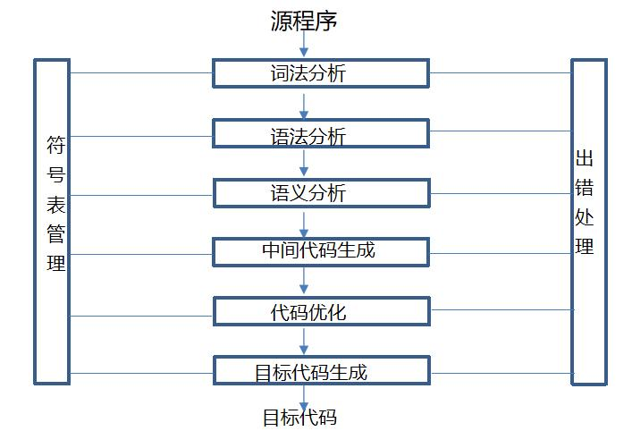

中间代码和目标代码生成：中间代码是根据语义分析产生的，需要经过优化链接，最终生成可执行的目标代码。引入中间代码的目的是进行与机器无关的代码优化处理。常用的中间代码有后缀式（逆波兰式）、三元式（三地址码）、四元式、树、图等形式。需要考虑三个问题（一是如何生成较短的目标代码；二是如何充分利用计算机中的寄存器，减少目标代码访问存储单元的次数；三是如何充分利用计算机指令系统的特点，以提高目标代码的质量）。

#### 表达式

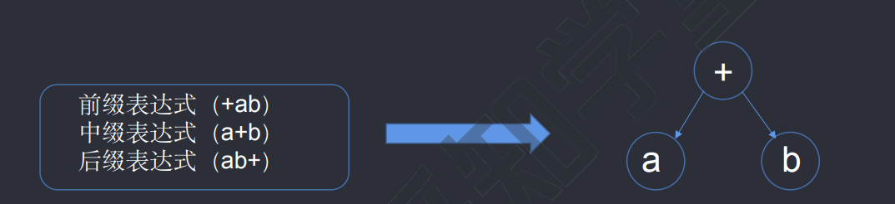

前缀表达式：操作符位于操作数之前的表达式。例如，将中缀表达式 "2 + 3" 转换为前缀表达式可以得到 "+ 2 3"。

中缀表达式：操作符位于操作数之间的表达式。例如，"2 + 3" 就是一个中缀表达式。

后缀表达式：操作符位于操作数之后的表达式。例如，将中缀表达式 "2 + 3" 转换为后缀表达式可以得到 "2 3 +"。

在计算机中，通常使用后缀表达式进行数学计算，因为后缀表达式具有优先级，可以直接按照顺序进行计算，而无需考虑括号和优先级的问题。而前缀和中缀表达式则需要使用括号和优先级规则来确定计算顺序。

~~~
例（2013年下半年）：算术表达式a+(b-c) *d的后缀式是(22)（-、+、*表示算术的减、加、乘运算，字符的优先级和结合性遵循惯例）
(22)  A.c-d*a    B.abc-d*+    C.ab+c-d*    D.abcd-*+
解析：a+(b-c)*d → (a+((b-c)*d)) → (a+((bc)-*d)) → (a+((bc)-d)*) → (a((bc)-d)*)+ → abc-d*+ ，答案B。
~~~

### 2.2 文法和语言的形式描述

#### 文法定义

计算机文法是用于描述计算机语言的一种形式化语法。计算机语言可以分为自然语言和形式语言两种类型，其中形式语言又可以分为上下文无关文法和上下文有关文法两种类型。

1. 自然语言：自然语言是人类日常交流所使用的语言，如英语、中文等。自然语言的语法结构较为复杂且灵活，不易用形式化的方式进行准确的描述和处理。
2. 形式语言：形式语言是为了满足计算机处理需要而设计的语言，一般使用符号、规则和语法来描述语言的结构和语义。形式语言分为上下文无关文法和上下文有关文法两种类型。
   - 上下文无关文法（CFG）：上下文无关文法是一种简单且常用的形式化语法，用于描述大多数编程语言的语法结构。它由终结符号、非终结符号、产生式和起始符号组成，可以描述语言中的句子结构和语义。
   - 上下文有关文法（CFL）：上下文有关文法是一种更复杂的形式化语法，可以描述具有上下文依赖关系的语言结构。上下文有关文法中的产生式的替换规则依赖于上下文环境，可以描述更复杂的语言特性。

计算机文法的定义和使用对于编译器设计、语言理解和程序分析等领域具有重要意义，它为计算机语言的编译、解析和语义分析提供了基础框架。

形式文法是一个有序四元组G= (V，T，S，P)  其中：

- V是非终结符集合，表示可以用来构造语言中各种句子的符号。
- T是终结符集合，表示语言中的基本符号或词汇。
- S是起始符号，是一个特殊的非终结符，表示语言中句子的起始位置。
- P是产生式规则集合，由形如A -> α的规则组成，其中A∈V，α∈(V∪T)*，表示A可以被替换为α。

形式文法描述了一个语言的语法结构，它定义了哪些符号可以出现在句子中、符号的组合方式以及句子的结构。通过应用产生式规则，可以从起始符号开始生成语言中的句子。形式文法在自然语言处理、编译原理和人工智能等领域中被广泛应用。

#### 闭包

在编译程序中，正则闭包可以用于实现匹配和替换操作。编译器可以使用正则闭包来解析输入的源代码，将其转换为抽象语法树或其他中间表示形式。正则闭包还可以用于实现词法分析中的词法规则，如识别标识符、常量等。

正则闭包的原理是通过使用特殊的符号和操作来表示字符重复出现的模式。通常，正则表达式中的闭包操作符表示将一个或多个字符重复任意次数。例如，正则表达式a-z+表示匹配一个或多个小写字母。

编译程序可以使用正则闭包来构建有限自动机或正则表达式匹配器，用于识别和处理源代码中的模式。这些模式可以用于语法分析、语义分析和代码生成等编译过程中的不同阶段。

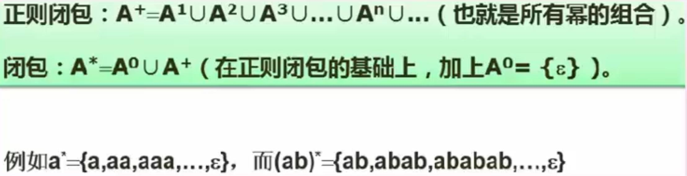

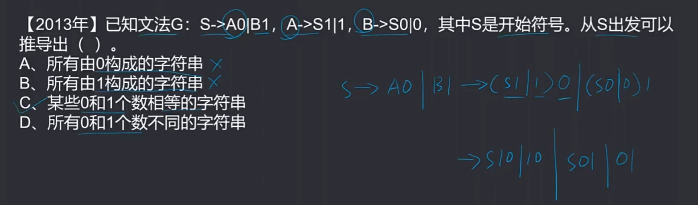

#### 文法类型

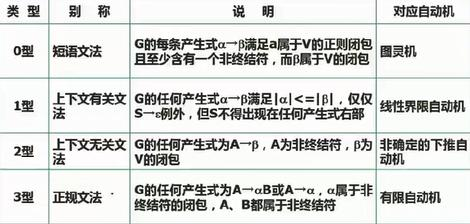

**程序设计语言中语法是上下文无关的，语义上下文有关**

### 2.3 语法分析

#### 正规式

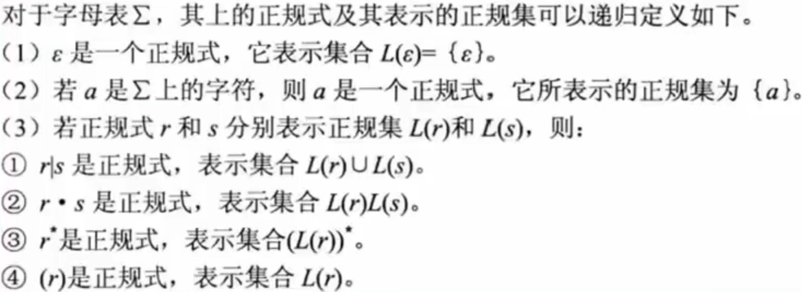

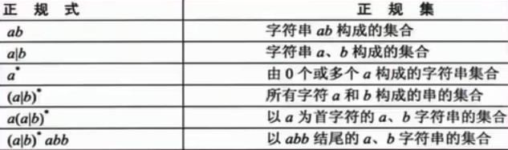

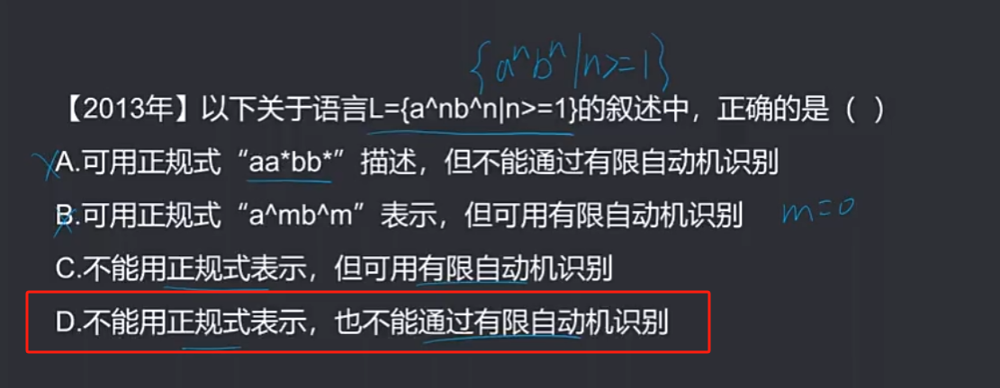

#### 有限自动机

有限自动机是一种计算模型，它可以接受一些输入，并根据预定的规则转移到不同的状态。

有限自动机可以分为确定性有限自动机（DFA）和非确定性有限自动机（NFA）两种。

- DFA是一种有限自动机，其在给定一个输入字符后，可以唯一确定其下一个状态。
- NFA是一种有限自动机，其在给定一个输入字符后，可能有多个下一个状态。

有限自动机可以根据输入字符的情况来判断其是确定的还是不确定的。若根据输入字符能得出唯一的后继状态，则是确定的；若根据输入字符能得出多个后继状态，则是不确定的。

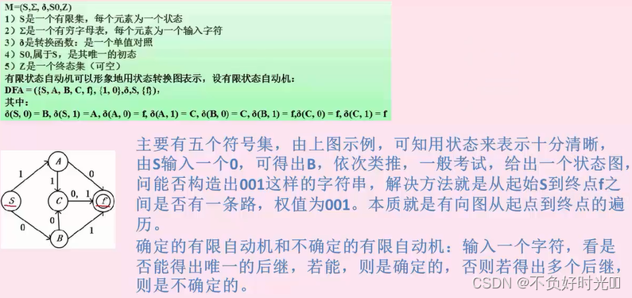

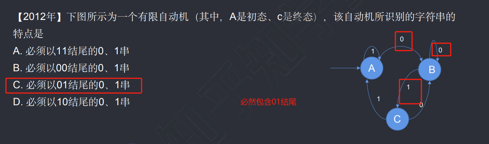

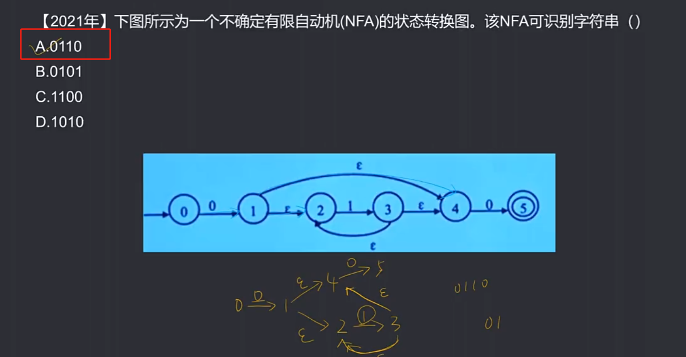

#### 语法分析方法（考的少）

自上而下语法分析：最左推导，从左至右。给定文法G和源程序串r。从G的开始符号S出发，通过反复使用产生式对句型中的非终结符进行替换（推导），逐步推导出r。

- 递归下降思想：原理是利用函数之间的递归调用模拟语法树自上而下的构造过程，是一种自上而下的语法分析方法。

自下而上语法分析：最右推导，从右至左。从给定的输入串r开始，不断寻找子串与文法G中某个产生式P的候选式进行匹配，并用P的左部代替（归约）之，逐步归约到开始符号s。

- 移进-规约思想：设置一个栈，将输入符号逐个移进栈中，栈顶形成某产生式的右部时，就用左部去代替，称为归约。很明显，这个思想是通过右部来推导出左部，因此是自下而上语法分析的核心思想。

~~~
例（2016年上半年）：●移进-归约分析法是编译程序（或解释程序）对高级语言源程序进行语法分析的一种方法，属于（48）的语法分析方法。
A.自顶向下（或自上而下） B.自底向上（或自下而上） C.自左向右 D.自右向左
答案：B
~~~

参考资料

https://blog.csdn.net/chengsw1993/article/details/125043157

https://cloud.tencent.com/developer/article/2383590