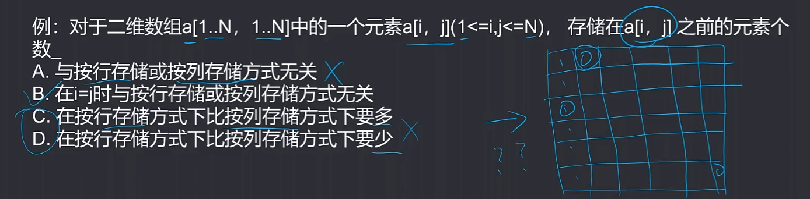
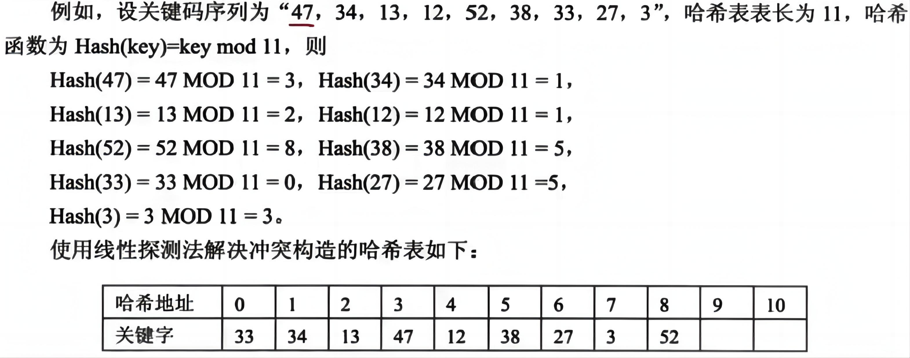
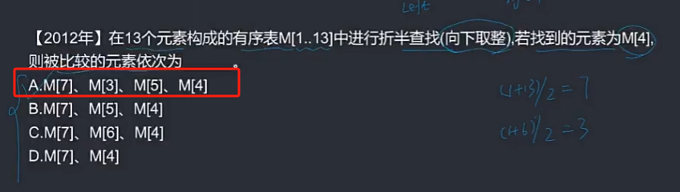
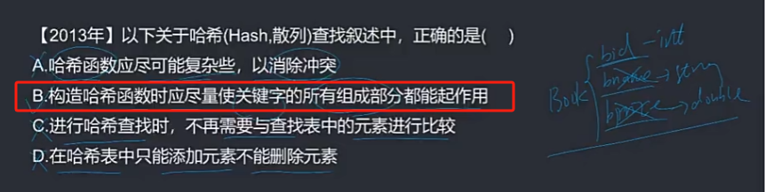
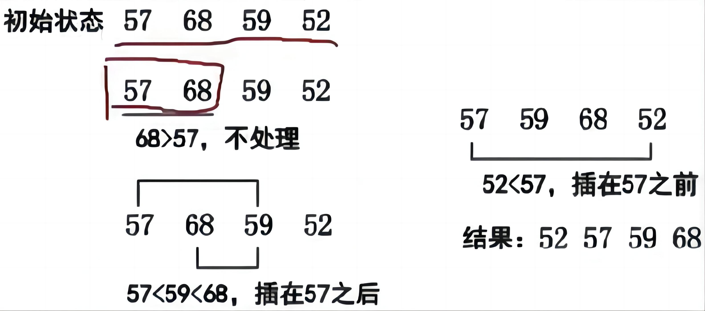
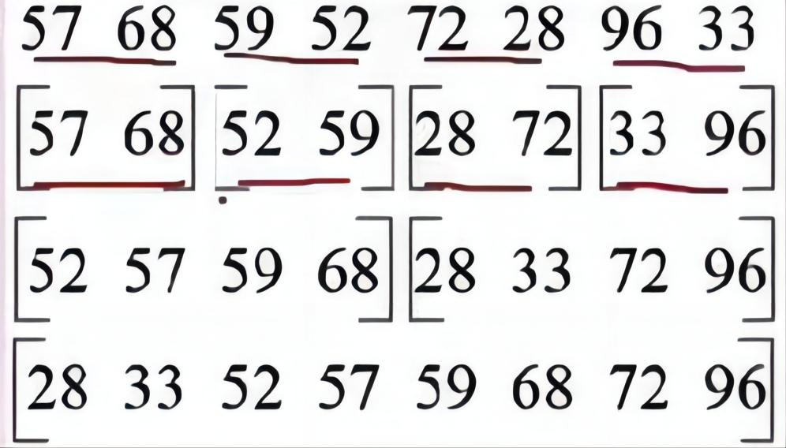
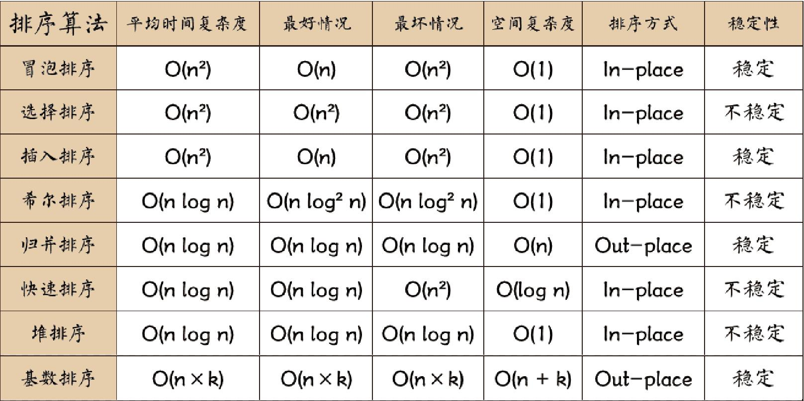
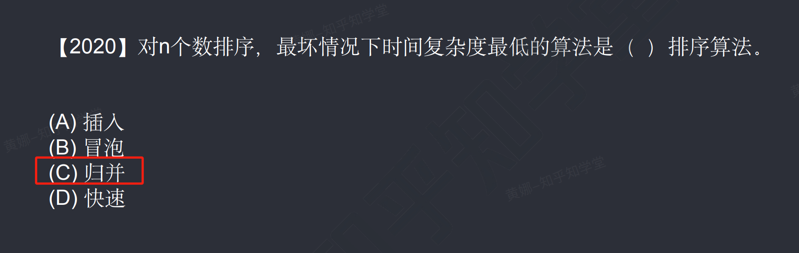
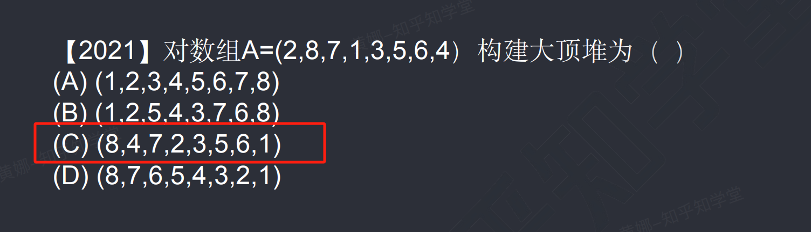
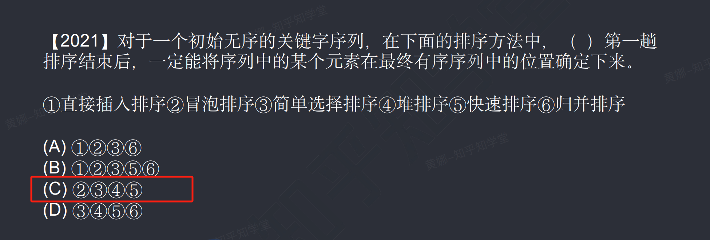

## 一、完整数据结构

### 🔎1.线性结构

- 线性表
- 栈和队列
- 串

### 🔎2.数组、矩阵和广义表

### 🔎3.树

- 树和二叉树的定义
- 二叉树的性质与存储结构
- 二叉树的遍历
- 线索二叉树
- 最优二叉树(哈夫曼树)
- 树和森林

### 🔎4.图

- 图的定义和存储
- 图的遍历
- 深度优先搜索
- 广度优先搜索
- 生成树和最小生成树
- 拓扑结构和关键路径

### 🔎5.查找

- 查找基本概念
- 静态查找表的查找方法
- 顺序查找
- 折半查找
- 分块查找
- 动态查找表
- 二叉排序树
- 平衡二叉树
- 哈希表

### 🔎6.排序

- 排序基本概念
- 简单排序
- 希尔排序

  改进的插入排序

- 快速排序
- 堆排序
- 归并排序
- 基数排序
- 外部排序


## 二、线性结构

```
:evergreen_tree:
```

### :evergreen_tree:线性表

#### :blossom:概念

线性结构是指每个元素最多只有一个出度和一个入度，表现为一条线状。线性表是一种特殊的线性结构分为顺序表和链表。

- 顺序表：顺序表是使用一段连续的存储空间来存储线性表的元素，可以通过下标直接访问元素。顺序表的特点是插入和删除操作较慢，但是随机访问元素的效率较高。
- 链表：链表是通过一系列的节点来存储线性表的元素，每个节点包含数据域和指向下一个节点的指针。链表的特点是插入和删除操作较快，但是随机访问元素的效率较低。

在线性结构中，除了顺序表和链表，还有一些其他的线性结构，如栈和队列。栈是一种特殊的线性表，只能在表的一端进行插入和删除操作，遵循先进后出（LIFO）的原则。队列也是一种特殊的线性表，只能在表的一端进行插入操作（队尾），在表的另一端进行删除操作（队头），遵循先进先出（FIFO）的原则。

线性结构中元素在计算机内存中的存储方式，主要有顺序存储和链式存储两种方式。

- 顺序存储：顺序存储是将线性表中的元素依次存储在一组地址连续的存储单元中，使得逻辑上相邻的元素在物理上也相邻。顺序存储的特点是通过元素的下标可以直接访问元素，因此查找效率高。插入和删除元素时需要移动其他元素，效率较低。
- 链式存储：链式存储是通过存储各数据元素的结点的地址来实现元素的存储，每个结点包含数据域和指向下一个结点的指针。链式存储的特点是插入和删除元素时只需要修改指针，不需要移动其他元素，因此效率较高。但是链式存储无法直接访问中间的元素，需要从头节点开始顺序遍历。


### :evergreen_tree:顺序存储和链式存储区别

在空间方面，链表需要额外存储指针，导致空间浪费。

在时间方面：

- 链表在插入和删除元素时效率更高，因为只需要修改指针指向，而顺序表因为地址连续，插入或删除元素后需要移动其他节点。
- 在读取和查找元素时，顺序表效率更高，因为物理地址连续，可以通过索引快速定位，而链表需要从头节点开始逐个查找。


#### :blossom:单链表的插入和删除

单链表的插入


在上图中p所指向的节点后插入s所指向的节点，操作为：

```clike
s->next=p->next;
p->next=s;
```


单链表的删除


在单链表中删除p所指向节点的后继节点q时，操作为：

```clike
p->next=p->next->next;
free(q);
```


### :evergreen_tree:栈和队列

栈、队列和循环队列是常见的数据结构，用于存储和操作数据。

1. 栈（Stack）是一种后进先出（Last In First Out，LIFO）的数据结构。它只允许在栈的一端进行插入和删除操作，这一端称为栈顶。栈的常用操作有入栈（push）、出栈（pop）和获取栈顶元素（top）。栈可以用数组或链表实现。
2. 队列（Queue）是一种先进先出（First In First Out，FIFO）的数据结构。它允许在队列的一端（队尾）插入新元素，而在另一端（队头）删除元素。队列的常用操作有入队（enqueue）、出队（dequeue）和获取队头元素（front）。队列可以使用数组或链表实现。
3. 循环队列（Circular Queue）是一种具有固定大小的队列，它可以像队列一样先进先出，但是它的队尾和队头是相连的。当队尾到达数组的末尾时，它可以循环回到数组的开头。循环队列的常用操作有入队（enqueue）、出队（dequeue）和获取队头元素（front）。循环队列可以使用数组实现，通过维护两个指针（队头和队尾的索引）来实现循环。


在循环队列中，头指针指向第一个元素，尾指针指向最后一个元素的下一个位置。当队列为空时，头尾指针相等；当队列满时，头尾指针也相等，无法区分。因此，一般会将队列空出一个元素位置，这样队列满的条件就是尾指针的下一个位置等于头指针。考虑到循环队列特性，需要使用最大元素数取余运算来实现循环，即`(tail + 1) % size = head`。循环队列的长度可以通过`(Q.tail - Q.head) % size`公式得到。另外，优先队列是一种特殊的队列，其中的元素被赋予了优先级。在访问元素时，具有最高优先级的元素最先被删除。优先队列常使用堆来存储元素，因为堆的顺序不是按照元素在队列中的顺序来决定的。


### :evergreen_tree:串

#### :blossom:串的定义

| 术语   | 定义                                                         |
| :----- | :----------------------------------------------------------- |
| 空串   | 长度为0的字符串，没有任何字符。                              |
| 空格串 | 由一个或多个空格组成的串，空格是空白字符，占一个字符长度。   |
| 子串   | 串中任意长度的连续字符构成的序列称为子串。含有子串的串称为主串，空串是任意串的子串。 |

#### :blossom:串的匹配

| 算法               | 定义                                                         |
| :----------------- | :----------------------------------------------------------- |
| 模式匹配算法       | 子串的定位操作，用于查找子串在主串中第一次出现的位置的算法。 |
| 基本的模式匹配算法 | 也称为布鲁特一福斯算法，其基本思想是从主串的第1个字符起与模式串的第1个字符比较，若相等，则继续逐个字符进行后续的比较；否则从主串中的第2个字符起与模式串的第1个字符重新比较，直至模式串中每个字符依次和主串中的一个连续的字符序列相等时为止，此时称为匹配成功，否则称为匹配失败。 |
| KMP算法            | 对基本模式匹配算法的改进，其改进之处在于：每当匹配过程中出现相比较的字符不相等时，不需要回溯主串的字符位置指针，而是利用已经得到的“部分匹配”结果将模式串向右“滑动”尽可能远的距离，再继续进行比较。 |

KMP算法相比于基本的模式匹配算法差别：

- 基本的模式匹配算法：匹配失败从第二位开始继续
- KMP算法：匹配失败从失败位置开始继续


## 三、数组、矩阵和广义表

### :evergreen_tree:数组结构

#### 🦋数组的表示

数组的特点使得它非常适合用于存储和操作大量数据。由于数组在内存中是连续存储的，所以可以通过下标直接访问数组中的元素，而不需要像链表那样遍历整个结构。这样可以提高访问元素的效率。

另外，由于数组的元素类型相同且结构一致，可以利用数组的特性进行高效的数据处理和计算。例如，可以通过循环遍历数组中的元素进行逐个计算或操作。

数组的下标关系具有上下界的约束，可以有效地控制数组的访问和操作。通过下标，可以直接定位数组中的元素，而不需要进行复杂的查找操作。

虽然数组的长度是固定的，不支持插入和删除运算，但是可以通过重新分配内存空间来实现对数组的扩展或缩小。这样可以灵活地管理数组的大小。

假设有一个3行2列的数组：

```clike
[[1, 2],  
 [3, 4],  
 [5, 6]]
```

复制

行向量形式表示时，将每一行都排列在一行中：

```clike
[1, 2, 3, 4, 5, 6]
```

复制

列向量形式表示时，将每一列都排列在一列中：

```clike
[1, 3, 5, 2, 4, 6]
```

复制

行向量形式将数组按照行的方式展开成一行，而列向量形式将数组按照列的方式展开成一列。这样的表示方式有时可以方便进行矩阵运算和数据处理。

#### 🦋数组存储地址

数组在内存中是连续存储的，因此数组名本身就可以看作是存储数组首元素地址的指针。当我们定义一个数组时，编译器会分配一段连续的内存空间来存储数组元素，并将数组名指向该内存空间的首地址。

例如，假设我们定义了一个int类型的数组arr：

```bash
int arr[5] = {1, 2, 3, 4, 5};
```

复制

在内存中，该数组的元素将被连续存储，如下所示：

```bash
地址        内容
1000        1
1004        2
1008        3
1012        4
1016        5
```

复制

数组名arr在这种情况下可以看作是存储地址1000的指针。我们可以通过使用指针来访问数组元素，例如，访问arr的第一个元素可以使用*arr或者arr0，访问第二个元素可以使用*(arr+1)或者arr1，以此类推。





### :evergreen_tree:矩阵结构

矩阵是一种常见的数据结构，它由行和列组成的二维数组。矩阵可以用于表示和处理多种类型的数据，如数值、图像、文本等。

在计算机科学中，矩阵通常用于表示图形图像和图像处理算法。例如，图像可以表示为一个矩阵，其中每个元素表示一个像素的颜色值。通过对矩阵进行操作，可以实现图像的旋转、缩放、滤波等处理。

矩阵结构在数值计算和科学计算中也非常重要。矩阵可以用于表示线性方程组、矩阵乘法、求特征值和特征向量等数学运算。通过矩阵运算，可以解决线性方程组、最小二乘拟合、最优化等问题。

在编程中，矩阵通常用二维数组来表示。可以使用索引访问矩阵中的元素，并且可以使用循环遍历矩阵中的所有元素。还可以定义各种操作来处理矩阵，如矩阵相加、相乘等。


以下是一些常见的矩阵结构分类：

1. 方阵和非方阵：方阵是行数和列数相等的矩阵，即n x n的矩阵。非方阵则是行数和列数不相等的矩阵。
2. 稀疏矩阵和稠密矩阵：稀疏矩阵是指其中绝大多数元素为0的矩阵。而稠密矩阵则是指其中绝大多数元素不为0的矩阵。
3. 对称矩阵和非对称矩阵：对称矩阵是指以主对角线为对称轴对称的矩阵，即Ai = Aj。非对称矩阵则是指不满足对称性质的矩阵。
4. 上三角矩阵和下三角矩阵：上三角矩阵是指主对角线以下的元素全为0的矩阵，即Ai = 0，当i > j。下三角矩阵则是指主对角线以上的元素全为0的矩阵，即Ai = 0，当i < j。
5. 对角矩阵和非对角矩阵：对角矩阵是指主对角线以外的元素全为0的矩阵。非对角矩阵则是指至少有一个主对角线以外的元素不为0的矩阵。

三元组结构是一种常用的存储矩阵的方式，它将矩阵中的每个非零元素存储为一个三元组，包括该元素的行索引、列索引和值。

通常情况下，三元组结构中的元素按矩阵的行优先的方式进行存储，即先按行遍历矩阵，再按列遍历。因此，三元组结构的存储方式会将矩阵中的非零元素按照行的顺序排列，并保持它们在矩阵中的相对位置不变。

以一个4x5的矩阵为例：

```clike
1 0 0 2 0
0 0 3 0 4
0 5 0 0 0
6 0 0 7 8
```

用三元组结构进行存储的结果为：

```clike
(0, 0, 1)
(0, 3, 2)
(1, 2, 3)
(1, 4, 4)
(2, 1, 5)
(3, 0, 6)
(3, 3, 7)
(3, 4, 8)
```

其中，每个三元组表示一个非零元素的行索引、列索引和值。


### :evergreen_tree:广义表

广义表是一种扩展的线性表，它可以存储不同数据类型的元素，包括原子元素和子表元素。

在广义表中，原子元素指的是不可再分的基本元素，例如整数、字符、布尔值等。子表元素则是指广义表中的另一个广义表，也就是说广义表可以嵌套存储。

广义表的存储结构通常可以使用链表或数组实现。如果使用链表实现，每个节点的数据域可以存储原子元素或指向子表的指针；如果使用数组实现，通常需要预先确定广义表的最大深度，并为每个元素分配固定大小的空间。

广义表的操作包括创建、插入、删除、修改、遍历等。递归是广义表操作的常用方法，可以通过递归遍历广义表的每个元素，从而实现各种操作。

广义表在实际应用中有广泛的用途，例如在编程语言解析中，可以使用广义表来表示语法树；在图形学中，可以使用广义表来表示复杂的图形结构；在人工智能中，可以使用广义表来表示知识库等。

广义表一般记为：
$$
LS=（α_1,α_2,···,α_n）
$$
LS代表广义表的表名，αi代表广义表的元素，可以是表（子表）或者数据元素（原子）。n代表广义表的长度，即最外层包含的元素个数，当n=0时，广义表为空表。递归定义的重数是广义表的深度，即定义中所包含括号的个数（单边括号的个数），原子的深度为0，空表的深度为1。

head()和tail()是广义表的两个基本操作。head()用于取得广义表的第一个元素，无论是子表还是原子；tail()用于取得广义表中除了第一个元素之外的所有元素构成的表。需要注意的是，如果广义表是空表或只包含一个元素，则tail()操作返回一个空表。


## 四、树

### :evergreen_tree:树的定义

在数据结构中，树是一种非线性的数据结构，它由一组节点和一组连接节点的边组成。树的定义如下：

1. 树由节点组成，每个节点包含一个值和指向零个或多个子节点的指针。
2. 有一个节点被指定为根节点，它没有父节点。根节点是树的起始点。
3. 除了根节点外，每个节点都有一个父节点。
4. 除了叶节点外，每个节点都可以有一个或多个子节点。
5. 每个节点之间的连接称为边。

树的形状类似于现实生活中的树，根节点对应树的顶部，叶节点对应树的底部。每个节点可以有任意数量的子节点，但每个节点只能有一个父节点。


树可以有不同的类型，如二叉树、二叉搜索树、红黑树等。这些类型的树有各自的特点和应用场景。树结构在计算机科学中有广泛的应用，例如文件系统的目录结构、数据库索引、编译器语法分析等。

| 概念             | 定义                                                         |
| :--------------- | :----------------------------------------------------------- |
| 双亲、孩子和兄弟 | 结点的子树的根称为该结点的孩子；相应地，该结点称为其子结点的双亲。具有相同双亲的结点互为兄弟。 |
| 结点的度         | 一个结点的子树的个数，记为该结点的度。                       |
| 叶子结点         | 叶子结点也称为终端结点。指度为0的结点。                      |
| 内部结点         | 度不为0的结点，也称为分支结点或非终端结点。除根结点以外，分支结点也称为内部结点。 |
| 结点的层次       | 根为第一层，根的孩子为第二层，以此类推，若某结点在第 i 层，则其孩子结点在第 i+1 层。 |
| 树的高度（深度） | 一棵树的最大层数，记为树的高度（或深度）。                   |
| 有序（无序）树   | 若将树中结点的各子树看成是从左到右具有次序的，即不能交换，则称该树为有序树，否则称为无序树。 |

### :evergreen_tree:二叉树的定义和性质

二叉树是一种常见的数据结构，它由节点组成，每个节点最多有两个子节点：左子节点和右子节点。每个节点都包含一个值或者数据，值可以是任何类型的数据。

二叉树的特点是每个节点最多有两个子节点，而且子节点的位置是有序的，即左子节点在父节点的左边，右子节点在父节点的右边。

对于二叉树，每一个节点都可以看作是一个子二叉树的根节点。如果一个节点没有子节点，我们称其为叶子节点。另外，如果某个节点不是叶子节点，则它至少有一个子节点。

二叉树可以有不同的特殊类型，比如满二叉树、完全二叉树等。在满二叉树中，除了叶子节点外的每个节点都有两个子节点，并且所有的叶子节点都在同一层上。在完全二叉树中，除了最后一层，其他层都是满的，并且最后一层的叶子节点都尽可能地靠左排列。

二叉树可以用来表示各种各样的数据，比如二叉查找树（Binary Search Tree，简称BST），用来实现快速的查找和插入操作。二叉树还可以用来表示表达式，构建语法树，以及图的遍历等。

二叉树的重要特性如下：


设一棵二叉树上叶结点数为n0，单分支结点数为n1，双分支结点数为n2，则`总结点数=n0+n1+n2`。在一棵二叉

树中，所有结点的分支数（即度数）应等于单分支结点数加上双分支结点数的2倍，即`总的分支数=n1+2n2`。由

于二叉树中除根结点以外，每个结点都有唯一的一个分支指向它，因此二叉树中：`总的分支数=总结点数-1`。


### :evergreen_tree:二叉树的存储结构

二叉树的存储结构有三种常见的形式：

1、顺序存储：就是用一组连续的存储单元存储二叉树中的节点，按照从上到下，从左到右的顺序依次存储每个节点。对于深度为k的完全二叉树，除第k层外，其余每层中节点数都是上一层的两倍，由此，从一个节点的编号可推知其双亲、左孩子、右孩子结点的编号。假设有编号为i的节点，则有：

```bash
（1）若i=1，该结点为根结点，无双亲
（2）若i＞1，该阶段的双亲为（i+1）/2（取整数）。
（3）若2i≤n，则该结点的左孩子编号为2i，否则无左孩子
（4）若2i+1≤n，则该结点的右孩子编号为2i+1，否则无右孩子。
（5）若i奇数且不为1，则该结点左兄弟的编号为i-1，否则无左兄弟。
（6）若i为偶数且小于n，则该结点右兄弟的编号为i+1，否则无右兄弟。
```

2、链式存储：一般用二叉链表来存储二叉树节点，二叉链表中除了该节点本身的数据外，还存储有左孩子结点的指针、右孩子结点的指针，即一个数据+两个指针。每个二叉链表节点存储一个二叉树节点，头指针则指向根节点。


### :evergreen_tree:二叉树的遍历

二叉树的遍历是指按照某种顺序访问二叉树的所有节点。常用的二叉树遍历方式有三种：前序遍历、中序遍历和后序遍历。

1. 前序遍历（preorder traversal）：**先访问根节点，再遍历左子树，最后遍历右子树**。具体步骤是：先访问当前节点，然后递归地前序遍历左子树，最后递归地前序遍历右子树。
2. 中序遍历（inorder traversal）：**先遍历左子树，再访问根节点，最后遍历右子树**。具体步骤是：先递归地中序遍历左子树，然后访问当前节点，最后递归地中序遍历右子树。
3. 后序遍历（postorder traversal）：**先遍历左子树，再遍历右子树，最后访问根节点**。具体步骤是：先递归地后序遍历左子树，然后递归地后序遍历右子树，最后访问当前节点。

此外，还有两种特殊的遍历方式：层序遍历和逆序遍历。

1. 层序遍历（level order traversal）：按层级从上到下、从左到右的顺序遍历二叉树。具体步骤是：使用队列，首先将根节点入队，然后循环执行以下操作：出队当前节点，访问当前节点，将当前节点的左子节点和右子节点分别入队。直到队列为空。
2. 逆序遍历：将前序、中序和后序遍历的访问顺序反转。例如，逆序前序遍历即为后序遍历。


示例：

前序：12457836

中序：42785136

后序：48752631


### :evergreen_tree:二叉树的分类

二叉树可以根据特定的属性进行分类，以下是常见的二叉树分类：

1. 满二叉树（Full Binary Tree）：除了叶子节点，每个节点都有两个子节点。
2. 完全二叉树（Complete Binary Tree）：除了最后一层外，其它层的节点都是满的，最后一层的节点都靠左对齐。
3. 二叉搜索树（Binary Search Tree，BST）：对于每个节点，左子树上的所有节点的值都小于等于该节点的值，右子树上的所有节点的值都大于等于该节点的值。
4. 平衡二叉树（Balanced Binary Tree）：对于任意节点，它的左子树和右子树的高度差不大于1。
5. 线索二叉树（Threaded Binary Tree）：在二叉树节点中设置了指向前驱节点和后继节点的线索，可以方便地进行遍历。
6. 哈夫曼树（Huffman Tree）：用于数据压缩，根据数据出现的频率构建的二叉树，频率越高的节点离根节点越近。
7. Trie树（前缀树）：用于字符串的存储和搜索，每个节点代表一个字符串的字符，从根节点到叶子节点的路径表示一个完整的字符串。
8. B树（B-Tree）：一种平衡多路查找树，用于大规模数据的存储和检索，每个节点可以有多个子节点。


#### :seedling:完全二叉树和满二叉树

完全二叉树是一种特殊的二叉树，除了最后一层外，每一层的节点都是从左到右连续排列的，最后一层的节点从左到右填充。

满二叉树是一种特殊的完全二叉树，除了叶子节点外，每个节点都有两个子节点。满二叉树通常是一棵深度为h，拥有**2^h-1**个节点的二叉树。


#### :seedling:线索二叉树

线索二叉树是对二叉树进行加工，使其能够快速遍历所有节点。

在线索二叉树中，除了左右孩子指针，还添加了两个额外的指针：**前驱指针和后继指针**。这两个指针分别指向当前节点的前驱节点和后继节点。

对于一个二叉树来说，存在多种线索化方式。以下是两种常见的线索化方式：

1. 前序线索二叉树：在前序遍历过程中进行线索化。对于每个节点，先处理其前驱指针，然后处理左子树，再处理右子树，最后处理后继指针。对于树中的第一个节点，其前驱指针为空，对于树中的最后一个节点，其后继指针为空。
2. 中序线索二叉树：在中序遍历过程中进行线索化。对于每个节点，先处理其左子树，然后处理前驱指针，然后处理右子树，最后处理后继指针。对于树中的第一个节点，其前驱指针为空，对于树中的最后一个节点，其后继指针为空。

在线索二叉树中，通过前驱和后继指针，可以快速地找到节点的前驱节点和后继节点，从而实现快速遍历。


案例：假设有以下二叉树：

```bash
      1
    /   \
   2     3
  / \   / \
 4   5 6   7
```

对这棵二叉树进行中序线索化，得到的线索二叉树如下所示：

```bash
   4 - 2 - 5 - 1 - 6 - 3 - 7
```

在线索二叉树中，每个节点的左右孩子指针被替换为前驱和后继指针。

在这个例子中，节点1的左前驱指针指向节点5，右后继指针指向节点6；节点2的左前驱指针指向节点4，右后继指针指向节点1；节点3的左前驱指针指向节点6，右后继指针指向节点7；节点4的左前驱指针指向节点2，右后继指针指向节点5；节点5的左前驱指针指向节点4，右后继指针指向节点1；节点6的左前驱指针指向节点1，右后继指针指向节点3；节点7的左前驱指针指向节点3，右后继指针为空。

通过线索化后的二叉树，可以快速地找到每个节点的前驱和后继节点，从而实现快速的中序遍历。


#### :seedling:最优二叉树（哈夫曼树）

最优二叉树，也称为哈夫曼树，是一种特殊的二叉树结构，常用于编码和解码的应用中。

最优二叉树的特点是，频率高的节点离根节点较近，频率低的节点离根节点较远。通过这种方式，可以实现最小化编码的平均长度，从而达到最优的压缩效果。

构建最优二叉树的基本思路是，首先根据每个节点的权重（即出现频率）进行排序，然后选择权重最小的两个节点作为左右子节点，生成一个新的父节点，并将父节点的权重设置为左右子节点的权重之和。重复这个过程，直到所有节点构建成一棵树。

最优二叉树可以应用在哈夫曼编码中，通过树的路径来表示字符的编码，使得频率高的字符编码较短，频率低的字符编码较长，从而实现压缩数据的效果。

相关概念如下：

- 路径：树中一个结点到另一个结点之间的通路。
- 结点的路径长度：路径上的分支数目。
- 树的路径长度：根节点到达每一个叶子节点之间的路径长度之和。
- 权：节点代表的值。
- 结点的带权路径长度：该结点到根结点之间的路径长度乘以该节点的权值。
- 树的带权路径长度（树的代价）：树的所有叶子节点的带权路径长度之和。


哈夫曼树的求法：给出一组权值，将其中两个最小的权值作为叶子节点，其和作为父节点，组成二叉树，而后删除这两个叶子节点权值，并将父节点的值添加到该组权值中。重复进行上述步骤，直至所有权值都被使用完。

构造出的哈夫曼树中，所有初始给出的权值都作为了叶子节点，此时，求出每个叶子节点的带权路径长度，而后相加，就是树的带权路径长度，这个长度是最小的。


案例

假设有以下节点集合：

节点A，出现的频率为5

节点B，出现的频率为3

节点C，出现的频率为2

节点D，出现的频率为1

为了构建最优二叉树，我们可以按照以下步骤进行：

1. 将节点集合按照频率从小到大进行排序，得到排序后的节点集合：D，C，B，A。
2. 从集合中选择频率最小的两个节点作为叶子节点，并创建一个新的节点作为它们的父节点，父节点的频率为子节点的频率之和。在我们的例子中，D和C被选择为叶子节点，它们的频率之和为3。
3. 将新的父节点加入到集合中，并将集合重新排序。新的节点集合为：B，A，新的父节点。
4. 重复步骤2和步骤3，直到集合中只剩下一个节点。
5. 最后剩下的节点就是构建的最优二叉树的根节点。

根据上述步骤，我们可以得到如下的最优二叉树：

```bash
    B
   / \
  C   A
 /
D
```


#### :seedling:查找二叉树

查找二叉树，也称为二叉搜索树（Binary Search Tree，BST），是一种特殊的二叉树结构，它具有以下性质：

1. 左子树上所有节点的值都小于根节点的值。
2. 右子树上所有节点的值都大于根节点的值。
3. 每个子树也必须满足上述两个性质。

由于这种特殊的性质，查找二叉树的结构非常便于查找和插入操作。当我们需要查找一个特定的元素时，可以通过比较当前节点的值与目标值的大小关系，根据二叉树的有序性质，可以在左子树或右子树中继续查找，直到找到目标元素或者遍历到叶子节点。

插入操作也非常简单，只需要在合适的位置创建一个新的节点，并调整树的结构以保持其有序性。

对于查找二叉树的时间复杂度，最好的情况下是O(logn)，最坏的情况下是O(n)，其中n是树中节点的个数。这取决于树的形状，如果树是高度平衡的，则查找的时间复杂度会相对较低，否则会退化为链表，导致查找时间复杂度上升。

需要注意的是，查找二叉树并不保证是平衡的，因此在某些情况下可能会导致树的不平衡，从而影响查找的效率。为了解决这个问题，可以使用平衡二叉树的变种，如红黑树或AVL树，来保持树的平衡性。


#### :seedling:平衡二叉树

平衡二叉树（Balanced Binary Tree），也称为AVL树，是一种特殊的二叉搜索树（Binary Search Tree），它的左子树和右子树的高度差不超过1，并且左子树和右子树都是平衡二叉树。

平衡二叉树的一个重要性质是它的高度是O(log n)，其中n是二叉树中节点的数量。

平衡二叉树的结构使得在插入、删除、查找等操作时，可以保持树的平衡性，从而保证了操作的时间复杂度为O(log n)。

平衡二叉树的结构可以通过多种方式实现，比如AVL树、红黑树等。

在平衡二叉树中，**每个节点都保存了左子树和右子树的高度差，当插入或删除节点导致不平衡时，需要进行相应的旋转操作来恢复平衡**。

平衡二叉树的常见操作包括插入节点、删除节点、查找节点等。

平衡二叉树的应用非常广泛，常用于需要高效的插入、删除和查找操作的场景，比如字典、数据库索引等。


### :evergreen_tree:树和森林

#### :seedling:树的结构

树的存储结构主要有三种：双亲表示法、孩子表示法和孩子兄弟表示法。

- 在双亲表示法中，树的节点连续存储在一组地址单元中，并在每个节点中附带一个指示器，指示其双亲节点所在数组元素的下标。
- 孩子表示法中，节点的每个孩子使用指针表示，并为每个节点的孩子建立一个链表。
- 孩子兄弟表示法又称为二叉链表表示法，为每个存储节点设置两个指针域，分别指向该节点的第一个孩子和下一个兄弟节点。

树和森林的遍历方法有两种：先根遍历和后根遍历。

- 在树的先根遍历中，先访问根节点，然后依次遍历根的各颗子树。
- 在后根遍历中，先遍历根的各颗子树，然后访问根节点。同样，在森林的遍历中，对于森林中的每棵树，都可以进行先根遍历或后根遍历的操作。

#### :seedling:树和二叉树的转换

树和二叉树是两种不同的数据结构，它们之间可以进行相互转换。

将树转换为二叉树的过程可以通过以下步骤进行：

1. 选择一个树节点作为根节点，并创建一个新的二叉树，将该节点作为根节点。
2. 将树的子节点按照从左到右的顺序，依次添加为二叉树该节点的左子树的右孩子（如果左子树的右孩子为空）或右子树的左孩子（如果右子树的左孩子为空）。
3. 对于每个添加的节点，再按照同样的方式处理它的子节点。

将二叉树转换为树的过程可以通过以下步骤进行：

1. 选择二叉树的根节点作为树的根节点。
2. 对于二叉树的每个节点，如果它有左子树，则将左子树作为该节点的一个子节点。
3. 对于二叉树的每个节点，如果它有右子树，则将右子树作为该节点的一个子节点。

需要注意的是，二叉树转换为树时，可能会有多个子节点指向同一个节点，而树转换为二叉树时，每个节点只有一个左孩子和一个右孩子。

示例如下图：采用连线法，将最左边节点和其兄弟节点都连接起来，而原来的父节点和兄弟节点的连线则断开，这种方法最简单，要求掌握。


## 五、图

### :evergreen_tree:图的概念

图是一种非线性数据结构，它由节点（也称为顶点）和连接这些节点的边组成。图可以用来表示各种关系和连接，比如网络拓扑、社交网络、地图等等。图的节点可以包含任意类型的数据，而边则表示节点之间的关系。

| 概念                 | 定义                                                         |
| :------------------- | :----------------------------------------------------------- |
| 无向图               | 图的节点之间连接线是没有箭头的，不分方向。                   |
| 有向图               | 图的节点之间连接线是箭头，区分A到B，和B到A是两条线。         |
| 完全图               | 无向完全图中，节点两两之间都有连线，n个结点的连线数为(n-1)+(n-2)+...+1=n*(n-1)/2；有向完全图中，节点两两之间都有互通的两个箭头，n个节点的连线数为n*(n-1)。 |
| 度、出度和入度       | 顶点的度是关联与该顶点的边的数目。在有向图中，顶点的度为出度和入度之和。出度是以该顶点为起点的有向边的数目。入度是以该顶点为终点的有向边的数目。 |
| 路径                 | 存在一条通路，可以从一个顶点到达另一个顶点，有向图的路径也是有方向的。 |
| 连通图和连通分量     | 针对无向图。若从顶点v到顶点u之间是有路径的，则说明v和u之间是连通的，若无向图中任意两个顶点之间都是连通的，则称为连通图。 |
| 强连通图的强连通分量 | 针对有向图。若有向图任意两个顶点间都相互存在路径，则称为强连通图。有向图中的极大联通子图称为其强联通分量。 |
| 网                   | 边带权值的图称为网。                                         |

### :evergreen_tree:图的存储

#### :seedling:邻接矩阵

图的存储邻接矩阵是一种常见的图表示方式，适用于稠密图（边数接近于顶点数的平方）的存储。

邻接矩阵是一个二维数组，其中行和列表示图中的顶点，数组元素表示顶点之间的边或者权重。

具体的做法如下：

1. 创建一个大小为VxV的二维数组，其中V是图中顶点的个数。
2. 初始化数组的所有元素为0，表示顶点之间没有边。
3. 对于有边连接的两个顶点u和v，设定数组中的元素au和av为1，表示顶点u和v之间有边。
4. 如果图是带权重的，可以将数组中的元素au和av设为边的权重值。

邻接矩阵的存储优点是可以快速判断两个顶点之间是否有边，时间复杂度为O(1)。但是对于稀疏图（边数远小于顶点数的平方）来说，邻接矩阵会浪费大量的空间。

在使用邻接矩阵存储图时，需要考虑到数组的大小限制和边的存储方式。通常可以使用二维数组、动态数组或稀疏矩阵等数据结构来实现邻接矩阵的存储。


#### :seedling:邻接表

图的邻接表是一种常用的图的存储方式，它使用一个数组来存储图中的每个顶点，数组中的每个元素是一个链表，链表中存储了与该顶点相邻的顶点。

例如，考虑以下无向图：

```bash
A -- B -- C
|         |
D -- E -- F
```

复制

可以使用邻接表来表示这个图：

```bash
顶点 A: B, D
顶点 B: A, C
顶点 C: B, F
顶点 D: A, E
顶点 E: D, F
顶点 F: C, E
```

复制

在邻接表中，每个顶点对应一个链表，链表中的每个节点表示与该顶点相邻的另一个顶点。例如，顶点 A 对应的链表中有节点 B 和 D，表示 A 与 B 和 D 相邻。同样地，顶点 B 对应的链表中有节点 A 和 C，表示 B 与 A 和 C 相邻。

邻接表的优点是可以有效地表示稀疏图，节省了存储空间。同时，邻接表也可以方便地找到一个顶点的所有邻接顶点，因为它们都存储在同一个链表中。但是，对于密集图，邻接表的查询效率可能较低，因为需要遍历链表来寻找相邻顶点。


### :evergreen_tree:图的遍历

图的遍历是指按照某种规则访问图中的所有节点。图的遍历分为深度优先搜索（DFS）和广度优先搜索（BFS）两种常见的方法。

**1、深度优先搜索（DFS）：**

DFS是一种递归的搜索方法。它从图中的某个节点开始，然后递归地访问该节点的所有邻接节点，直到所有可达的节点都被访问一次。然后，返回到上一个节点，尝试访问它的其他邻接节点，直到遍历完整个图。

DFS的过程可以使用栈来实现，首先将起始节点入栈，然后弹出栈顶节点，并将其标记为已访问，接着将该节点的所有未访问的邻接节点入栈。重复这个过程，直到栈为空。

**2、广度优先搜索（BFS）：**

BFS使用队列来实现。它从图的某个节点开始，首先将该节点入队列，然后访问该节点的所有邻接节点，并将其入队列。接下来，从队列中取出一个节点并访问它的所有邻接节点，将它们入队列。重复这个过程，直到队列为空。

DFS和BFS都可以用来遍历无向图和有向图。它们之间的主要区别在于访问节点的顺序不同，DFS优先访问深度较大的节点，而BFS优先访问离起始节点近的节点。


### :evergreen_tree:图的最小生成树

最小生成树是一个连通无向图的生成树中，边的权值和最小的生成树。图的最小生成树算法有普里姆(Prim)算法和克鲁斯卡尔(Kruskal)算法。

普里姆算法：

1. 选择一个起始顶点，将起始顶点标记为已访问；
2. 在已访问的顶点集合中，选择一条与未访问顶点相连的最小权值边，并将该边的另外一个顶点标记为已访问；
3. 重复步骤2，直到所有顶点都标记为已访问，最小生成树构建完成。

克鲁斯卡尔算法：

1. 将图中的所有边按照权值从小到大排序；
2. 依次选择权值最小的边，并判断该边的两个顶点是否属于不同的连通分量。如果属于不同的连通分量，则将该边加入最小生成树，否则舍弃该边；
3. 重复步骤2，直到最小生成树的边数等于图的顶点数减一。

这两种算法都是局部最优原则，所以都是贪心法算法，并且没有谁的效率高谁的效率差，因为克鲁斯卡尔算法是数边的，所以边越多，它算起来越麻烦。


### :evergreen_tree:图的拓扑序列

图的拓扑序列是指一个有向无环图（DAG）的顶点的一种线性排序，使得对于任意的有向边(u, v)，u在拓扑序列中都出现在v之前。

拓扑排序可以用来解决一些实际问题，比如任务调度、编译顺序等。在一个任务调度的问题中，每个顶点表示一个任务，有向边(u, v)表示任务u必须在任务v之前执行。拓扑序列可以用来确定任务的执行顺序，保证所有的依赖关系都得到满足。

拓扑序列可能不是唯一的，一个图可以有多个拓扑序列。可以使用深度优先搜索（DFS）或广度优先搜索（BFS）等算法来生成拓扑序列。

拓扑序列的生成过程如下：

1. 选择一个没有前驱（即入度为0）的顶点，将其加入拓扑序列中。
2. 移除该顶点及其相邻的边。
3. 重复步骤1和2，直到所有的顶点都加入了拓扑序列。

如果图中存在环路，则无法生成拓扑序列，因为环路表示存在循环依赖关系，无法确定任务的执行顺序。

将有向图的有向边作为活动开始的顺序，若图中一个节点入度为0，则应该最先执行此活动，而后删除掉此节点和其关联的有向边，再去找图中其他没有入度的结点，执行活动，依次进行，示例如下：


## 六、查找算法

- 查找基本概念
- 静态查找表的查找方法
- 顺序查找
- 折半查找
- 分块查找
- 动态查找表
- 二叉排序树
- 平衡二叉树
- 哈希表

### :evergreen_tree:算法基础

#### :seedling:算法概念

算法是一组有序的操作指令，用于解决特定问题或完成特定任务。算法描述了问题的输入和输出，以及在给定输入时如何通过一系列步骤来产生所需的输出。算法可以用来解决各种问题，包括数学问题、计算问题、优化问题等。在计算机科学中，算法是计算机程序的基础，它指导计算机执行特定的计算和操作。一个好的算法应该具有正确性（能够产生正确的输出）、效率（能够在合理的时间内完成计算）和易读性（易于理解和实现）。简单的说就是某个问题的解题思路。

#### :seedling:算法的复杂度

算法的复杂度是衡量算法执行效率的一个指标，通常用时间复杂度和空间复杂度来描述。

1. 时间复杂度：描述随着问题规模的增大，算法执行时间的增长趋势。常见的时间复杂度包括：
   - 常数时间复杂度 O(1)：无论问题规模多大，算法的执行时间都不会随之增长。
   - 线性时间复杂度 O(n)：算法的执行时间与问题规模呈线性关系。
   - 对数时间复杂度 O(log n)：算法的执行时间与问题规模的对数呈线性关系。
   - 平方时间复杂度 O(n^2)：算法的执行时间与问题规模的平方呈线性关系。
   - 指数时间复杂度 O(2^n)：算法的执行时间与问题规模的指数呈线性关系。
2. 空间复杂度：描述算法执行中所需的额外空间随问题规模增大的趋势。常见的空间复杂度包括：
   - 常数空间复杂度 O(1)：算法的额外空间不随问题规模的增大而变化。
   - 线性空间复杂度 O(n)：算法的额外空间与问题规模呈线性关系。
   - 对数空间复杂度 O(log n)：算法的额外空间与问题规模的对数呈线性关系。
   - 平方空间复杂度 O(n^2)：算法的额外空间与问题规模的平方呈线性关系。
   - 指数空间复杂度 O(2^n)：算法的额外空间与问题规模的指数呈线性关系。

算法的复杂度分析可以帮助我们评估算法的执行效率，并选择合适的算法来解决问题。通常情况下，我们希望选择时间复杂度低且空间复杂度较小的算法。

常见的对算法执行所需时间的度量：
$$
O(1)<O(log_2n)<O(n)<O(nlog_2n)<O(n²)<O(n³)<O(2ⁿ)<O(n!)
$$
上述的时间复杂度，经常考到，需要注意的是，时间复杂度是一个大概的规模表示，一般以循环次数表示，O(n)说明执行时间是n的正比，另外，log对数的时间复杂度一般在查找二叉树的算法中出现。渐进符号O表示一个渐进变化程度，实际变化必须小于等于O括号内的渐进变化程度。


### :evergreen_tree:查找算法

#### :seedling:线性查找

线性查找是一种简单直接的查找算法，也称为顺序查找。它通过遍历待查找的数据集，逐个比较数据元素与目标值，直到找到目标值或遍历完整个数据集为止。

线性查找的基本思路如下：

1. 从第一个数据元素开始，逐个遍历数据集中的元素。
2. 每次比较当前元素与目标值是否相等，如果相等则返回当前位置，表示找到目标值。
3. 如果遍历完整个数据集仍未找到目标值，则返回-1，表示未找到目标值。

~~~java
public class LinearSearch {
    public static int linearSearch(int[] arr, int target) {
        for (int i = 0; i < arr.length; i++) {
            if (arr[i] == target) {
                return i;
            }
        }
        return -1;
    }

    public static void main(String[] args) {
        int[] arr = {3, 5, 2, 8, 9, 4, 1};
        int target = 9;
        int result = linearSearch(arr, target);
        if (result != -1) {
            System.out.println("目标值在位置：" + result);
        } else {
            System.out.println("未找到目标值");
        }
    }
}
~~~

在最坏情况下，线性查找的时间复杂度为O(n)，其中n为数据集的大小。因为需要逐个遍历数据元素，所以当数据集较大时，线性查找的效率相对较低。因此在实际应用中，当数据集较大时，可以考虑使用更高效的查找算法，如二分查找、哈希查找等。


#### :seedling:折半（二分）查找

折半查找（也称为二分查找）是一种高效的查找算法，常用于有序数组中查找某个特定元素的位置。

折半查找的基本思想是首先确定待查找区间的中间位置，然后将待查找元素与中间位置的元素进行比较。如果待查找元素等于中间位置的元素，则查找成功，返回中间位置；如果待查找元素小于中间位置的元素，则在中间位置的左侧区间继续查找；如果待查找元素大于中间位置的元素，则在中间位置的右侧区间继续查找。重复以上步骤直至找到目标元素或待查找区间为空。

折半(二分)查找是一种基于有序数组的查找算法，其时间复杂度为O(logn)。其基本思路如下：

1. 初始化左边界和右边界，将左边界设为0，将右边界设为数组长度减1。
2. 取中间位置的元素，与目标元素进行比较。
3. 如果中间元素等于目标元素，则返回中间元素的索引。
4. 如果中间元素大于目标元素，则在左半部分继续查找，将右边界更新为中间元素的前一个索引。
5. 如果中间元素小于目标元素，则在右半部分继续查找，将左边界更新为中间元素的后一个索引。
6. 重复步骤2至5，直到左边界大于右边界，表示查找失败。

~~~java
public int binarySearch(int[] arr, int target) {
    int left = 0;
    int right = arr.length - 1;

    while (left <= right) {
        int mid = (left + right) / 2;
        if (arr[mid] == target) {
            return mid;
        } else if (arr[mid] < target) {
            left = mid + 1;
        } else {
            right = mid - 1;
        }
    }
    return -1; // 目标元素不存在
}

// 测试案例
int[] arr = {1, 3, 5, 7, 9, 11, 13};
int target = 7;
int result = binarySearch(arr, target);
if (result != -1) {
    System.out.println("目标元素在数组中的索引为：" + result);
} else {
    System.out.println("目标元素不存在数组中");
}
~~~

我们首先定义了一个二分查找函数`binary_search`，它接受一个有序数组`arr`和目标元素`target`作为输入。然后我们在数组中查找目标元素并返回其索引，如果目标元素不存在，则返回-1。

时间复杂度分析：

折半查找每次将当前查找范围缩小一半，因此查找的次数取决于查找范围的大小，即查找次数为 logn (以2为底)。因此，折半查找的时间复杂度为O(logn)。


#### :seedling:散列（哈希）表

哈希查找（Hash Search）也被称为散列查找，是一种根据关键字直接进行访问的查找技术，具有快速查找的特点。哈希查找的基本思路是通过哈希函数将关键字映射到一个固定的位置，称为哈希地址。利用哈希地址来直接访问目标数据。

~~~java
class HashTable {
    private int size;
    private Entry[] table;

    public HashTable(int size) {
        this.size = size;
        table = new Entry[size];
        for (int i = 0; i < size; i++) {
            table[i] = new Entry();
        }
    }

    private int hash(int key) {
        return key % size;
    }

    public void insert(int key, String value) {
        int hashValue = hash(key);
        table[hashValue].add(key, value);
    }

    public String search(int key) {
        int hashValue = hash(key);
        for (Entry entry : table[hashValue]) {
            if (entry.key == key) {
                return entry.value;
            }
        }
        return null;
    }
    private class Entry {
        int key;
        String value;
        Entry next;

        public void add(int key, String value) {
            Entry newEntry = new Entry();
            newEntry.key = key;
            newEntry.value = value;
            newEntry.next = this.next;
            this.next = newEntry;
        }
    }
}

// 示例代码
HashTable hashTable = new HashTable(10);

hashTable.insert(1, "apple");
hashTable.insert(2, "banana");
hashTable.insert(11, "cherry");

System.out.println(hashTable.search(1)); // 输出：apple
System.out.println(hashTable.search(2)); // 输出：banana
System.out.println(hashTable.search(11)); // 输出：cherry
System.out.println(hashTable.search(3)); // 输出：None
~~~

上述代码中，我们创建了一个哈希表（HashTable）类，其中包含以下几个方法：

- `__init__(self, size)`：初始化哈希表，指定哈希表的大小。
- `hash_function(self, key)`：哈希函数，用于将关键字映射到哈希地址。
- `insert(self, key, value)`：插入方法，将关键字和值插入到哈希表中。
- `search(self, key)`：查找方法，根据关键字查找对应的值。

时间复杂度：

- 插入和查找的时间复杂度都为O(1)，即常数时间复杂度。这是因为哈希函数的设计使得每个关键字都能映射到唯一的哈希地址，因此可以直接在哈希地址对应的列表中进行操作。在没有冲突的情况下，插入和查找操作都只需要一次哈希映射和一次遍历操作即可完成。

##### **🌈**冲突解决



在上图中，很明显，哈希函数产生了冲突，使用的是线性探测法解决冲突，还有其他方法如下：

- 线性探测法：按物理地址顺序取下一个空闲的存储空间。
- 伪随机数法：将冲突的数据随机存入任意空闲的地址中。
- 再散列法：原有的散列函数冲突后，继续用此数据计算另外一个哈希函数，用以解决冲突。

##### **🌈**线性探测法

哈希查找中的线性探测法是一种解决哈希冲突的方法。当在哈希表中插入一个元素时，如果发生冲突，即要插入的位置已经被占用，线性探测法会顺序地往后查找，直到找到一个空槽或者遍历完整个哈希表。

具体的插入过程如下：

1. 使用哈希函数计算要插入元素的哈希值，得到在哈希表中的初始位置。
2. 如果初始位置为空槽，则直接将元素插入到该位置。
3. 如果初始位置已经被占用，即发生冲突，就顺序地往后查找，直到找到一个空槽或者遍历完整个哈希表。
4. 如果找到了空槽，则将元素插入到该空槽中。
5. 如果遍历完整个哈希表，仍然没有找到空槽，表示哈希表已满，插入失败。

在查找元素时，也使用相同的过程：

1. 使用哈希函数计算要查找元素的哈希值，得到在哈希表中的初始位置。
2. 如果初始位置为空槽，则表示要查找的元素不存在。
3. 如果初始位置不为空槽，需要顺序地往后查找，直到找到目标元素或者遍历完整个哈希表。
4. 如果找到了目标元素，则返回其位置。
5. 如果遍历完整个哈希表，仍然没有找到目标元素，则表示要查找的元素不存在。

线性探测法的优点是实现简单，插入和查找的平均时间复杂度都是O(1)。然而，它也有一些缺点。当哈希表中的装载因子（已占用槽数目与总槽数目的比值）较大时，会导致冲突的概率增加，从而使得线性探测法的性能下降。另外，线性探测法会产生聚集效应，即冲突的元素会集中在一起，导致哈希表中的空槽较少，进而影响插入和查找的效率。

**知识点额外补充：一致性哈希**

一致性哈希是一种解决分布式系统中数据分散和负载均衡的方法。在分布式系统中，数据通常按照某种规则被分散存储在不同的节点上，为了快速定位到存储数据的节点，需要使用哈希函数来将数据的键映射到一个节点的位置。然而，当系统中的节点发生变化（如节点的加入、删除或故障）时，传统的哈希方法需要重新计算所有的映射，导致大量数据的迁移工作，增加系统的开销和复杂性。

一致性哈希通过引入虚拟节点的概念，解决了传统哈希方法的这个问题。具体来说，一致性哈希将哈希空间（通常是一个固定的范围，如0-2^32）划分成一个圆环，并将节点和数据键使用哈希函数映射到圆环上的位置。每个节点在圆环上有多个虚拟节点，通过增加虚拟节点，可以使节点在哈希环上分布更加均匀。

当需要存储数据时，通过哈希函数将数据的键映射到圆环上的一个位置，然后沿着圆环顺时针查找，找到离该位置最近的节点，即为[数据存储](https://cloud.tencent.com/product/cdcs?from_column=20065&from=20065)的节点。当节点发生变化时，只需要迁移受影响的数据部分，对于其他数据则不需要变动。

一致性哈希的优点包括：

- 节点的动态变化对数据的迁移影响较小，减少了系统的开销和复杂性。
- 数据在节点上的分布更加均匀，提高了系统的负载均衡性。
- 在节点变化时，只需要迁移少量数据，减少了数据迁移的开销。

一致性哈希在[分布式存储](https://cloud.tencent.com/product/cos?from_column=20065&from=20065)、负载均衡、缓存系统等领域得到广泛应用。

##### **🌈**伪随机数法

伪随机数法是当哈希函数将多个键映射到同一个索引位置时，伪随机数法可以通过生成一系列伪随机数来确定下一个可用的位置。

伪随机数法的基本思想是，在冲突的位置上，通过计算一个伪随机数来确定下一个可用的位置。这个伪随机数可以是基于当前冲突位置和键的某种计算方式得出的结果。一旦找到了下一个可用的位置，就可以将键值对插入到该位置上。

伪随机数法的一个优点是，可以较好地解决哈希冲突问题，减少冲突的次数，提高查找效率。然而，伪随机数法也有一些限制和注意事项。首先，生成伪随机数的计算方式需要被设计得足够复杂，以保证生成的位置能够更加均匀地分布在哈希表中，避免过多的冲突。其次，伪随机数生成的效率可能较低，特别是在哈希表规模较大的情况下。因此，在实际应用中，需要根据具体的需求和场景选择适合的哈希冲突解决方法。

##### **🌈**再散列法

再散列法（Rehashing）它是在原有的哈希表中再次进行哈希运算，以找到一个新的位置存储冲突的元素。

具体来说，当发生冲突时，再散列法会使用不同的哈希函数或使用原有哈希函数的不同参数，将冲突元素重新计算哈希值，然后找到一个新的位置存储。

再散列法可以多次进行再散列，直到找到一个不冲突的位置为止。常见的再散列方法包括线性探测再散列、平方探测再散列、双散列等。

再散列法的优点是简单、易于实现，并且在处理小规模数据集时表现良好。然而，当数据量大或者哈希函数选择不当时，再散列法可能导致严重的哈希冲突问题，使查询效率下降。因此，在设计哈希表时，需要选择合适的哈希函数和再散列方法，以避免冲突。






## 七、排序算法

- 排序基本概念

- 简单排序

- 希尔排序

  改进的插入排序

- 快速排序

- 堆排序

- 归并排序

- 基数排序

- 外部排序

### :evergreen_tree:排序算法分类

稳定与不稳定排序：依据是两个相同的值在一个待排序序列中的顺序和排序后的顺序应该是相对不变的，即开始时21在21前，那排序结束后，若该21还在21前，则为稳定排序，不改变相同值的相对顺序。
内排序和外排序：依据排序是在内存中进行的还是在外部进行的。


排序的算法有很多，大致可以分类如下：

- 插入类排序：直接插入排序、希尔排序。
- 交换类排序：冒泡排序、快速排序。
- 选择类排序：简单选择排序、堆排序。
- 归并排序。
- 基数排序。


常见的排序算法有以下几种：

1. 冒泡排序（Bubble Sort）：依次比较相邻的两个元素，将较大的元素交换到后面，每一轮比较都将最大的元素放到最后。时间复杂度为O(n^2)。
2. 选择排序（Selection Sort）：每次从待排序的元素中选取最小的元素，放置在已排序的末尾。时间复杂度为O(n^2)。
3. 插入排序（Insertion Sort）：将待排序的元素插入到已排序的序列中的适当位置，使得插入后仍然有序。时间复杂度平均为O(n^2)，最好情况下为O(n)，最坏情况下为O(n^2)。
4. 希尔排序（Shell Sort）：是插入排序的一种改进，通过将序列分组，每次对分组进行插入排序，然后逐步缩小分组的规模，最终完成排序。时间复杂度为O(nlogn)。
5. 归并排序（Merge Sort）：将序列不断地分割成两半，对每一半进行排序，然后合并两个已排序的子序列，最终完成排序。时间复杂度为O(nlogn)。
6. 快速排序（Quick Sort）：通过一趟排序将序列分成独立的两部分，其中一部分所有元素都比另一部分小，然后再对这两部分递归地进行快速排序。时间复杂度平均为O(nlogn)，最坏情况下为O(n^2)。
7. 堆排序（Heap Sort）：将待排序的序列构建成一个大顶堆，然后将堆顶元素与最后一个元素交换，再对剩余的n-1个元素进行调整，循环执行以上步骤，最终完成排序。时间复杂度为O(nlogn)。
8. 计数排序（Counting Sort）：统计待排序序列中每个元素的出现次数，然后根据元素的值从小到大依次输出。时间复杂度为O(n+k)，其中k表示序列中元素的范围。
9. 桶排序（Bucket Sort）：将待排序的元素映射到一个有限数量的桶中，每个桶再分别进行排序，最后将所有桶中的元素按次序合并成有序序列。时间复杂度为O(n+k)，其中k表示桶的数量。
10. 基数排序（Radix Sort）：将待排序的元素从低位到高位依次进行排序，每一位都使用一种稳定的排序算法（如计数排序或桶排序）。时间复杂度为O(d(n+k))，其中d表示元素的最大位数，k表示每一位的可能取值范围。


术语说明

| 术语       | 说明                                                         |
| :--------- | :----------------------------------------------------------- |
| 数据元素   | 要排序的数据的基本单位，可以是数字、字符、对象等             |
| 关键字     | 数据元素中用于排序的属性或值，可以是元素本身或元素的某个特定属性 |
| 升序       | 按照关键字的大小从小到大进行排序                             |
| 降序       | 按照关键字的大小从大到小进行排序                             |
| 稳定性     | 如果两个关键字相等的元素在排序后的序列中的相对位置保持不变，排序算法是稳定的；否则，排序算法是不稳定的 |
| 内部排序   | 排序过程中所有数据都能够全部加载到内存中进行排序             |
| 外部排序   | 排序过程中数据量太大，无法一次性加载到内存中，需要借助外部存储设备进行排序 |
| 比较排序   | 排序算法通过比较关键字的大小进行排序                         |
| 非比较排序 | 排序算法不直接通过比较关键字的大小进行排序，而是利用元素的其他特性进行排序，如计数排序、桶排序和基数排序 |
| 原地排序   | 排序过程中只使用了常数级别的额外空间                         |
| 时间复杂度 | 描述算法的耗时程度，即算法执行所需的时间                     |
| 空间复杂度 | 描述算法所需的额外空间                                       |


### :evergreen_tree:直接插入排序（插入类）

直接插入排序是一种简单直观的排序算法，它的思想是将一个序列分为有序和无序两部分，每次从无序部分中取出一个元素，插入到有序部分的正确位置上，直到整个序列有序为止。

具体步骤如下：

1. 将序列分为有序和无序两部分，初始时有序部分只有一个元素（即序列的第一个元素），无序部分包括剩余的元素。
2. 从无序部分中取出一个元素，记为待插入元素。
3. 将待插入元素与有序部分的元素进行比较，找到待插入元素在有序部分的正确位置。
4. 将有序部分中大于待插入元素的元素后移一位，腾出位置给待插入元素。
5. 将待插入元素放入正确位置。
6. 重复步骤2到步骤5，直到无序部分为空。

时间复杂度：

- 最好情况下，当序列已经有序时，直接插入排序的时间复杂度为O(n)，因为只需遍历一次序列。
- 最坏情况下，当序列逆序时，直接插入排序的时间复杂度为O(n^2)，因为要进行n次插入操作，每次插入操作的时间复杂度为O(n)。
- 平均情况下，直接插入排序的时间复杂度也为O(n^2)。


| 直接插入排序—示例         |  |
| --------------------------------------------------------- | :----------------------------------------------------------- |
| **直接插入排序—动态示例** |  |


### :evergreen_tree:希尔排序（插入类）

希尔排序是一种基于插入排序的排序算法，也称为缩小增量排序。它通过逐步减小增量的方式分组并对元素进行比较和交换，最终实现整体的有序。

希尔排序的算法步骤如下：

1. 选择一个增量序列，常用的是希尔增量序列，即初始增量gap为数组长度的一半，然后每次将gap缩小一半，直到gap为1。
2. 对每个增量间隔进行插入排序。从第gap个元素开始，将其与之前的元素进行比较，如果前面的元素更大，则将其向后移动gap个位置。重复这个过程直到无法向前移动为止。
3. 缩小增量，重新进行插入排序，直到最后一次增量为1，即进行最后一次插入排序，此时整个数组已经是有序的了。

时间复杂度：

- 希尔排序的时间复杂度取决于选取的增量序列，最好的情况下可以达到O(nlogn)，
- 最坏的情况下为O(n^2)。

| 希尔排序—示例         |  |
| ----------------------------------------------------- | ------------------------------------------------------------ |
| **希尔排序—动态示例** |  |


### :evergreen_tree:简单选择排序（选择类）

简单选择排序是一种简单直观的排序算法，它的基本思想是每次从待排序的数据中选择最小（或最大）的元素，然后放到已排序序列的末尾，直至所有元素排序完毕。

具体的排序过程如下：

1. 从待排序序列中，找到关键字最小的元素。
2. 如果最小元素不是待排序序列的第一个元素，将其和第一个元素互换位置。
3. 从剩余的待排序序列中，继续找到关键字最小的元素，重复步骤2。
4. 重复步骤2和步骤3，直到待排序序列中只剩下一个元素。

时间复杂度为：

简单选择排序的时间复杂度为O(n^2)，其中n为待排序序列的长度。虽然简单选择排序的时间复杂度较高，但对于小规模的数据排序还是比较高效的。

| 简单选择排序—示例         |  |
| --------------------------------------------------------- | ------------------------------------------------------------ |
| **简单选择排序—动态示例** |  |

### :evergreen_tree:堆排序（选择类）

堆排序是一种基于二叉堆数据结构的排序算法。它的时间复杂度为O(nlogn)，空间复杂度为O(1)。

堆排序的具体步骤如下：

1. 将待排序序列构建成一个大顶堆（或小顶堆），从最后一个非叶子节点开始，自下而上地进行堆调整。
2. 交换堆顶元素（最大值或最小值）和堆中最后一个元素。
3. 从根节点开始，自上而下地进行堆调整，保持堆的性质。
4. 重复步骤2和步骤3，直到堆中只剩下一个元素。

堆排序适用于在多个元素中找出前几名的方案设计，因为堆排序是选择排序，而且选择出前几名的效率很高。

| 堆排序—示例         |  |
| --------------------------------------------------- | ------------------------------------------------------------ |
| **堆排序—动态示例** |  |


### :evergreen_tree:冒泡排序（交换类）

冒泡排序是一种简单直观的排序算法。它重复地遍历要排序的列表，通过比较相邻元素并交换它们，将列表中的最大元素逐渐“冒泡”到列表的末尾。在每一次遍历中，比较相邻的两个元素，如果它们的顺序不正确，则交换它们的位置。重复这个过程，直到整个列表排序完成。

具体算法步骤如下：

1. 比较相邻的两个元素，如果它们的顺序不正确，则交换它们的位置。
2. 对每一对相邻的元素重复步骤1，直到最后一对元素。
3. 重复步骤1和步骤2，直到没有需要交换的元素，即列表已经有序。

冒泡排序的时间复杂度为O(n\^2)，其中n是列表的长度。由于每次遍历都会将当前未排序部分的最大元素“冒泡”到末尾，因此需要遍历n次。每次遍历中需要比较相邻的元素并可能交换它们的位置，最坏情况下需要比较和交换(n-1)次，因此总的比较和交换次数为n*(n-1)/2，即O(n^2)。

冒泡排序是一种稳定的排序算法，即相等元素的相对位置在排序后不会改变。

| 冒泡排序—示例         |  |
| ----------------------------------------------------- | ------------------------------------------------------------ |
| **冒泡排序—动态示例** |  |


### :evergreen_tree:快速排序（交换类）

快速排序是一种高效的排序算法，它基于分治的思想。

快速排序的基本思想是选择一个基准元素（通常选择数组的第一个元素），将数组分成两个子数组，使得左子数组的所有元素均小于基准元素，右子数组的所有元素均大于基准元素，然后对这两个子数组分别进行快速排序，最后将左子数组、基准元素和右子数组合并起来。

具体的实现步骤如下：

1. 选择一个基准元素，通常选择数组的第一个元素。
2. 定义两个指针，一个指向数组的第一个元素，一个指向数组的最后一个元素。
3. 将指针进行移动，直到找到左边大于等于基准元素的元素和右边小于等于基准元素的元素。
4. 如果左指针小于等于右指针，则交换这两个元素的位置。
5. 继续移动指针，直到左指针大于右指针。
6. 交换基准元素和左指针的元素的位置，使得左指针左边的元素都小于基准元素，右指针右边的元素都大于基准元素。
7. 对左子数组和右子数组分别进行快速排序，递归地进行上述步骤。
8. 当子数组的长度小于等于1时，停止递归。

快速排序的时间复杂度为O(nlogn)，其中n为数组的长度。

| 快速排序—示例         |                                                              |
| ----------------------------------------------------- | ------------------------------------------------------------ |
| **快速排序—动态示例** |  |


### :evergreen_tree:归并排序

归并排序是一种分治算法，它将一个数组分成两个子数组，对每个子数组进行递归排序，然后将两个子数组合并为一个有序的数组。

具体步骤如下：

1. 将待排序数组分成两个子数组，分别递归地对两个子数组进行排序。
2. 合并两个有序的子数组，得到一个有序的数组。

合并两个有序的子数组的步骤如下：

1. 创建一个临时数组，用来存储合并后的有序数组。
2. 比较两个子数组的首元素，将较小的元素放入临时数组，并将对应子数组的指针向后移动一位。
3. 重复上述步骤，直到其中一个子数组的元素全部放入临时数组。
4. 将另一个子数组的剩余元素放入临时数组。
5. 将临时数组的元素复制回原数组的对应位置。

归并排序的时间复杂度为O(nlogn)，空间复杂度为O(n)。它是一种稳定的排序算法，适用于处理大规模数据和外部排序。

| 归并排序—示例         |  |
| ----------------------------------------------------- | ------------------------------------------------------------ |
| **归并排序—动态示例** |  |


### :evergreen_tree:基数排序

基数排序是一种非比较型的排序算法，它按照元素的各个位的值来进行排序。基数排序可以用于整数或者字符串的排序。

基数排序的基本思想是：将待排序的元素分配到有限数量的桶中，然后按照桶的顺序依次取出元素构成有序序列。桶的数量一般和基数的范围有关。

具体的算法步骤如下：

1. 找出待排序元素中的最大值，确定最大值的位数，这个位数决定了需要进行多少次排序操作；
2. 准备桶，桶的数量一般和基数的范围有关；
3. 对待排序的元素按照从低位到高位的顺序依次进行排序：
   - 将待排序的元素按照当前位的值分配到对应的桶中；
   - 按照桶的顺序依次取出元素构成有序序列；
   - 循环上述步骤，直到所有位都排序完成。

基数排序的时间复杂度取决于数据的位数和数据范围，一般情况下为O(d*(n+r))，其中d是最大值的位数，n是元素个数，r是基数的范围。基数排序是一种稳定的排序算法。

| 基数排序—示例         |  |
| ----------------------------------------------------- | ------------------------------------------------------------ |
| **基数排序—动态示例** |  |


### :evergreen_tree:排序算法比较








