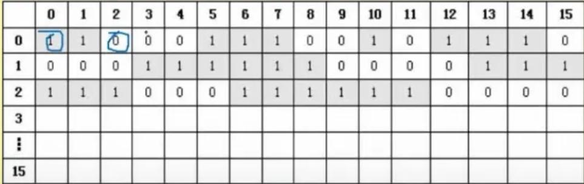

## 一、操作系统概述

操作系统（Operating System，简称OS）是一种软件，用于管理计算机硬件和软件资源，提供给用户和应用程序一个简单、统一的接口，以方便用户和应用程序的操作和管理。

操作系统的背景和由来可以追溯到计算机发展的早期阶段。在 1950 年代，当时的计算机是非常庞大和昂贵的设备，主要用于科学计算和军事应用。为了充分利用这些计算机资源，需要解决如下问题：

1. 资源管理：计算机设备包括处理器、内存、磁盘、输入输出设备等，如何合理地分配、调度和管理这些资源，以提高计算机系统的利用率和效率。
2. 多道程序设计：为了充分利用计算机资源，需要让多个程序同时运行。但是，由于计算机资源有限，如何使多个程序同时运行且互不干扰成为了一个挑战。

为了解决上述问题，研究人员开始开发操作系统。20 世纪 50 年代末至 60 年代初，出现了一系列的操作系统，如GM-NAA I/O、FORTRAN Monitor System、IBM OS/360等。这些操作系统主要用于管理计算机硬件资源，提供了一些基本功能如进程管理、存储管理、文件管理等。

随着计算机技术的发展，操作系统变得越来越复杂，功能也越来越强大。现代操作系统不仅提供了更多的功能，如图形用户界面、网络通信、安全管理等，还支持多种硬件平台和应用程序。目前常见的操作系统有Windows、Mac OS、Linux等。

### :deciduous_tree:操作系统的作用

| 主要作用           | 描述                                                       |
| :----------------- | :--------------------------------------------------------- |
| 资源管理           | 管理和分配计算机硬件资源，如处理器、内存、存储器和设备。   |
| 用户界面           | 提供与计算机系统交互的方式，如命令行界面和图形用户界面。   |
| 文件管理           | 管理计算机系统中的文件，包括创建、读写、复制和删除等操作。 |
| 进程管理           | 管理和调度计算机系统中的进程，实现多任务处理。             |
| 设备驱动程序       | 管理和控制计算机系统中的硬件设备，如打印机和键盘。         |
| 安全和保护         | 提供安全性和保护机制，保护计算机系统和用户的数据。         |
| 网络通信和连接     | 提供网络通信和连接功能，实现与外部网络的交互。             |
| 性能优化和调优     | 优化系统性能，提高计算机系统的响应速度和效率。             |
| 错误处理和故障恢复 | 处理错误和故障情况，保证系统的可靠性和稳定性。             |

### :deciduous_tree:操作系统的特征

| 特征     | 描述                                                         |
| :------- | :----------------------------------------------------------- |
| 并发性   | 操作系统可以同时处理多个任务，使多个程序能够交替执行，提高计算机的效率和响应性 |
| 共享性   | 操作系统可以管理和控制计算机资源的共享，包括内存、处理器、硬盘等，使多个程序能够同时访问和使用这些资源 |
| 虚拟性   | 操作系统通过虚拟化技术，将物理资源抽象成虚拟资源，使多个程序能够共享和利用这些虚拟资源，提高资源的利用率 |
| 不确定性 | 操作系统需要处理各种不确定因素，如不可预测的用户输入、硬件故障、网络中断等，通过错误检测和恢复机制来应对这些不确定性的情况 |

### :deciduous_tree:操作系统的功能

| 功能     | 描述                                                         |
| :------- | :----------------------------------------------------------- |
| 进程管理 | 控制和协调计算机系统中运行的进程，包括进程的创建、调度、同步和通信等。 |
| 存储管理 | 管理计算机系统中的存储器资源，包括内存分配、地址转换和内存保护等。 |
| 文件管理 | 对计算机系统中的文件进行组织、存储和访问，包括文件的创建、读写、删除和控制等。 |
| 设备管理 | 管理计算机系统中的输入/输出设备，包括设备的分配、控制和驱动等。 |
| 作业管理 | 控制和协调计算机系统中的作业，包括作业的调度、提交、分配和监控等。 |

### :deciduous_tree:操作系统的分类

| 分类           | 描述                                                         |
| :------------- | :----------------------------------------------------------- |
| 批处理操作系统 | 处理批量作业，按照预定的顺序自动执行作业，并进行作业调度和资源管理。 |
| 分时操作系统   | 多个用户通过共享的终端或网络同时访问计算机系统，系统轮流分配给每个用户一小段时间来使用CPU。 |
| 实时操作系统   | 对要求即时响应的任务有较高的时间要求，能够快速响应外部事件，提供可预测的响应时间。 |
| 网络操作系统   | 提供网络资源共享和管理的操作系统，支持多台计算机互相通信和协作。 |
| 分布式操作系统 | 将多台物理分散的计算机组成一个互相关联的系统，在不同计算机之间进行任务分配、通信和资源共享。 |
| 微机操作系统   | 运行在个人计算机或工作站上的操作系统，例如Windows、macOS、Linux等。 |
| 嵌入式操作系统 | 运行在嵌入式系统中的操作系统，嵌入在各种设备中，如智能手机、汽车电子设备、家庭电器等。 |

### :deciduous_tree:计算机启动的基本流程

计算机启动的基本流程为：

1. BIOS自检：开机后，计算机首先进行BIOS自检，检查硬件设备是否正常工作。BIOS（Basic Input/Output System）是一段固化在主板ROM芯片上的程序，用于初始化和检测计算机的硬件设备。
2. 启动引导：BIOS完成自检后，会从预设的启动设备（通常是硬盘）中读取引导扇区（Master Boot Record，MBR）中的引导程序。引导程序会加载操作系统的启动程序。
3. 操作系统加载：操作系统的启动程序会被引导程序加载到计算机的内存中。启动程序会进一步初始化硬件设备、建立内存空间映射以及其他必要的准备工作。
4. 用户登录：操作系统加载完成后，会显示用户登录界面。用户输入正确的用户名和密码后，操作系统会验证身份，并加载用户的配置文件和个人设置。
5. 桌面加载：登录成功后，操作系统会加载桌面环境或图形用户界面（GUI），提供用户操作和程序运行的接口。
6. 启动应用程序：在桌面加载后，用户可以通过启动菜单、快捷方式或命令行来启动需要的应用程序。操作系统会加载应用程序的相关文件和库文件，并分配系统资源给应用程序运行。

## 二、进程管理

### :deciduous_tree:进程的组成和状态

操作系统中的进程是指正在运行的程序的实例。每个进程都有自己的地址空间、数据和代码。进程是操作系统进行资源分配和调度的基本单位。

每个进程都由操作系统维护，并被分配一个唯一的进程标识符（PID）。操作系统利用进程控制块（PCB）来记录和管理各个进程的状态信息，包括进程的优先级、执行状态、寄存器值、分配给进程的资源等。

操作系统通过调度算法来决定进程的运行顺序。调度算法可以根据进程的优先级、时间片轮转、最短作业优先等策略来进行选择。

进程可以通过进程间通信（IPC）来进行相互之间的数据交换和协作。常见的进程间通信机制包括管道、消息队列、共享内存和信号量等。

进程可以存在多个状态，包括运行态、就绪态、阻塞态等。进程可以通过系统调用来进行状态的转换和操作，比如创建新的进程、终止进程、挂起和恢复进程等。

操作系统中的进程管理功能包括进程的创建、终止、调度、同步和通信等。进程的管理和调度是操作系统的重要任务，它能够提高系统的资源利用率和系统的响应速度。

#### :ear_of_rice:概念

进程是计算机中正在运行的程序的实例。它是操作系统进行资源分配和管理的基本单位，包括代码、数据和执行状态等信息。

#### :ear_of_rice:组成

进程是计算机系统中执行中的一个独立单位，它是由程序、数据和程序控制块组成的。

1. 程序：进程包含了一个要执行的程序或指令集合，它以二进制形式存储在计算机的存储器中。程序定义了进程要执行的操作和计算步骤。
2. 数据：进程在执行过程中需要使用的数据存储在进程的数据区中。数据可以是输入数据、输出数据、中间计算结果等。
3. 程序控制块（PCB）：PCB是进程的管理数据结构，它包含了进程的各种属性和状态信息，如进程标识符、进程状态、程序计数器、寄存器值、优先级、资源分配情况等。PCB的作用是管理和控制进程的执行，系统通过操作PCB来切换和调度进程。

不同的操作系统和编程语言可能会有一些差异。此外，进程还可能包含其他组件，如堆栈区、文件描述符等，用于支持进程的执行和交互。

#### :ear_of_rice:状态

进程的三态图和五态图是用来描述进程状态的图形化表示方式。

进程的三态图是指包含三个状态的图，分别是**就绪态、运行态和阻塞态**。就绪态表示进程已经准备好运行，等待CPU分配时间片；运行态表示进程正在执行；阻塞态表示进程由于某些原因无法继续执行，需要等待某些事件的发生。

进程的五态图是在三态图的基础上增加了两个状态，分别是**创建态和终止态**。创建态表示进程正在被创建，尚未开始执行；终止态表示进程已经执行完毕，即将被销毁。创建态和终止态是进程的生命周期的两个重要阶段。

### :deciduous_tree:前趋图

进程的前趋图（Precedence Graph）是用于**表示和描述进程之间的依赖关系**的图形化工具。它描述了进程之间的先后顺序和执行的依赖关系。前趋图用于解决并发系统中进程调度和同步问题。

在前趋图中，每个进程表示为一个节点，节点之间的有向边表示进程之间的依赖关系。如果进程 A 必须在进程 B 之前执行，那么就会在 A 的节点到 B 的节点之间画一条有向边。这样，前趋图就能清楚地显示出进程之间的执行顺序和依赖关系。

通过观察前趋图，可以确定出一些关键路径和并发路径，从而做出合理的进程调度和同步策略。前趋图也可以用于识别潜在的死锁和资源竞争问题，帮助进行系统调优和性能优化。

进程的前趋图是一个有向图，用于表示和描述进程之间的依赖关系和执行顺序。它是并发系统中的重要工具，用于解决进程调度和同步问题。

ABC可以并行执行，但是必须ABC都执行完后，才能执行D，这就确定了两点：任务间的并行、任务间的先后顺序。

### :deciduous_tree:进程资源图

进程资源图是一种**描述进程所需资源和资源分配情况**的图形表示方法。它通常以矩形框表示进程，矩形框内部显示进程的标识符或名称，外部显示进程所需的各种资源。资源以箭头表示，箭头的方向表示资源的请求方向，箭头的粗细表示资源的数量或权重。进程资源图可以帮助我们直观地了解进程之间的资源需求和资源分配情况，有助于进行资源管理和优化，防止资源竞争和死锁等问题的发生。

P代表进程，R代表资源，R方框中有几个圆球就表示有几个这种资源，在图中，R1指向P1，表示R1有一个资源已经分配给了P1，P1指向R2，表示P1还需要请求一个R2资源才能执行。

- 阻塞节点：某进程所请求的资源已经全部分配完毕，无法获取所需资源，该进程被阻塞了无法继续。如上图中P2。
- 非阻塞节点：某进程所请求的资源还有剩余，可以分配给该进程继续运行。如上图中P1、P3。当一个进程资源图中所有进程都是阻塞节点时，即陷入死锁状态。

### :deciduous_tree:同步与互斥

| 术语       | 描述                                                         |
| :--------- | :----------------------------------------------------------- |
| 互斥       | 某资源（即临界资源）在同一时间内只能由一个任务单独使用，使用时需要加锁，使用完后解锁才能被其他任务使用；如打印机。 |
| 同步       | 多个任务可以并发执行，只不过有速度上的差异，在一定情况下停下等待，不存在资源是否单独或共享的问题；如自行车和汽车。 |
| 临界资源   | 各进程间需要以互斥方式对其进行访问的资源。                   |
| 临界区     | 指进程中对临界资源实施操作的那段程序。本质是一段程序代码。   |
| 互斥信号量 | 对临界资源采用互斥访问，使用互斥信号量后其他进程无法访问，初值为1。 |
| 同步信号量 | 对共享资源的访问控制，初值一般是共享资源的数量。             |

### :deciduous_tree:信号量

进程中的信号量是一种用于同步和互斥访问共享资源的机制。它是一个计数器，可以被多个进程共享，并且可以通过两个基本操作来操作它：P（等待）和V（释放）。

信号量的PV操作是信号量的两个基本操作，用于实现进程之间的同步和互斥。

P操作（等待操作）：

1. 如果信号量的值大于0，表示资源可用，进程可以继续执行，将信号量的值减1。
2. 如果信号量的值等于0，表示资源不可用，进程将被阻塞，直到资源可用。

V操作（释放操作）：

1. 将信号量的值加1。
2. 如果有其他进程因为等待资源而被阻塞，将其中一个被阻塞的进程唤醒。

利用P操作和V操作，可以实现对共享资源的互斥访问。例如，在进入临界区之前先执行P操作，退出临界区后执行V操作，这样可以确保在同一时间内仅有一个进程可以进入临界区。

此外，P操作和V操作还可用于实现进程之间的同步，例如在生产者消费者问题中，生产者在放置数据之前执行P操作，消费者在获取数据之前执行P操作，这样可以确保生产者和消费者之间的顺序执行。

### :deciduous_tree:生产者和消费者

生产者消费者问题是一个经典的进程同步问题，描述了多个生产者和消费者共享一个有限缓冲区的情况。

在生产者消费者问题中，生产者负责将数据放入缓冲区，而消费者负责从缓冲区中取出数据。缓冲区有一定的容量，当缓冲区已满时，生产者必须等待，当缓冲区为空时，消费者必须等待。

为了实现生产者和消费者的同步，可以使用信号量或互斥锁来解决问题。以下是一种常见的实现方式：

1. 定义一个缓冲区，以及缓冲区的容量。
2. 定义一个互斥锁（mutex）来保护对缓冲区的访问。
3. 定义两个信号量：一个表示缓冲区的空槽数量，一个表示缓冲区的满槽数量。
4. 生产者进程执行以下步骤：
   - 等待空槽信号量，如果缓冲区已满则等待。
   - 获取互斥锁，保护对缓冲区的访问。
   - 将数据放入缓冲区。
   - 释放互斥锁。
   - 增加满槽信号量。
5. 消费者进程执行以下步骤：
   - 等待满槽信号量，如果缓冲区为空则等待。
   - 获取互斥锁，保护对缓冲区的访问。
   - 从缓冲区取出数据。
   - 释放互斥锁。
   - 增加空槽信号量。

通过使用互斥锁和信号量来控制生产者和消费者的访问，可以确保数据的正确性和同步。但需要注意的是，在实现过程中需要处理好各种边界条件，以避免死锁或竞争条件的发生。

### :deciduous_tree:死锁和线程

#### :ear_of_rice:死锁

死锁指的是在多进程/线程系统中，当两个或多个进程无法继续执行，因为它们所需要的资源被其他进程占用并且无法释放时产生的一种状态。换句话说，死锁是指两个或多个进程在互相等待对方所占有的资源而无法继续向前推进的情况。

死锁的发生是由于四个必要条件同时满足所导致的，即互斥条件、不可抢占条件、占有并等待条件和循环等待条件。当这四个条件同时满足时，系统进入死锁状态。

死锁的解决方法包括资源预分配策略、死锁检测与恢复、死锁预防和死锁避免等。这些方法旨在避免或解决死锁情况，使系统能够正常运行。

死锁产生的四个必要条件：

| 必要条件                       | 描述                                                         |
| :----------------------------- | :----------------------------------------------------------- |
| 互斥条件 (Mutual Exclusion)    | 资源只能被一个进程占用，其他进程必须等待该资源的释放         |
| 不可抢占条件 (Hold and Wait)   | 进程在持有至少一个资源的同时，又请求获取其他进程占有的资源   |
| 占有并等待条件 (Hold and Wait) | 进程在申请新的资源时，保持对已占有资源的占有，并等待获取新的资源 |
| 循环等待条件 (Circular Wait)   | 一组进程形成循环等待资源关系，每个进程都需要下一个进程所占有的资源才能继续执行，而这种资源关系存在循环的依赖关系 |

当上述四个条件同时满足时，系统就会进入死锁状态。

为了避免死锁的发生，我们需要采取适当的算法和策略来破坏这些条件之一，有下列方法：

| 解决措施 | 描述                                                         |
| :------- | :----------------------------------------------------------- |
| 死锁预防 | 通过限制并发进程对资源的请求，破坏死锁产生的四个条件之一，使系统在任何时刻都不满足死锁的条件。 |
| 死锁避免 | 使用银行家算法来避免死锁。预先计算出一条不会导致死锁的资源分配方法，只分配资源给能够保证系统安全性的进程，否则不分配资源，从而避免死锁的发生。 |
| 死锁检测 | 允许死锁的产生，但系统定时运行一个检测死锁的程序。如果检测到系统中发生死锁，则设法加以解除，可以通过资源剥夺或进程撤销来解除死锁。 |
| 死锁解除 | 在死锁发生后采取解除方法，例如强制剥夺资源，撤销进程等。这些方法会破坏死锁中的某个条件，以解除死锁。 |

死锁计算问题：系统内有n个进程，每个进程都需要R个资源，那么其发生死锁的最大资源数为**n***

**（R-1）**。其不发生死锁的最小资源数为**n*（R-1）+1**。

#### :ear_of_rice:线程

线程（Thread）是计算机中最小的执行单元，是进程内的一个独立执行流程。一个进程可以包含多个线程，而线程共享进程的资源，如内存空间、文件句柄等。每个线程有自己的程序计数器、栈和一些状态信息，但在同一个进程中的多个线程可以共享同一块内存空间。

相比于进程，线程更加轻量级，线程的切换和创建所需的开销较小，可以更高效地利用处理器的时间片。多线程可以同时进行多个任务，可以充分利用多核处理器的并行计算能力。

在多线程编程中，线程可以并发地执行，可以同时处理多个任务，提高了程序的并发性和效率。线程之间的通信可以通过共享内存或消息传递等机制进行。但线程之间的共享资源也可能引发同步问题，需要合理地使用锁、信号量等同步机制来保证数据的一致性和避免竞态条件。

线程是操作系统中的执行单位，可以将一个进程的任务划分为多个并发执行的线程，提高程序的并发性和效率。

### :deciduous_tree:银行家算法

银行家算法是一种资源分配算法，主要用于避免死锁的发生。它最初由艾兹格·迪科斯彻发表，并被称为银行家算法。

该算法基于以下原则：

1. 每个进程在启动时，必须声明其最大需求的资源数量。
2. 在运行时，进程可以请求分配一定数量的资源。
3. 如果系统可以满足进程的资源请求，并且分配后不会导致死锁，则分配资源。
4. 如果系统不能立即满足进程的资源请求，进程进入等待状态，直到资源可用。
5. 当进程完成时，系统回收分配给该进程的资源。

银行家算法的核心是资源分配的安全性检查。在安全状态下，即使所有进程同时请求资源，也不会进入死锁状态。否则，系统会拒绝分配资源，以避免死锁的发生。

银行家算法的实现涉及到资源分配的数据结构和算法，可以通过银行家算法来进行资源的合理分配，从而提高系统的性能和可靠性。

## 三、存储管理

### :deciduous_tree:页式存储

#### :ear_of_rice:概念

我们的程序往往大于内存的容量，因此在执行时，并不会一次性将所有内容都装入内存。相反，程序会被分为若干个固定大小的页，通常为4K。然后将这些页离散存储到内存中，而内存则按块划分。为了将程序中的页映射到内存中的块进行存储，我们使用页表。

在进程中，我们使用逻辑地址（虚地址）来表示地址，而在内存中，我们使用物理地址（实地址）来表示地址。

每个页被分为页号和页内地址。页号用于与块号相对应，表示存储的位置，页的大小可以表示页的数量。而页内地址表示存储的数据内容，它的大小可以表示数据的大小。通过页号和页内地址的组合，我们可以确定在内存中的具体地址。

当一个进程需要访问某个内存地址时，操作系统会首先查找进程的页表，确定该地址所对应的页。如果该页已经在内存中，操作系统直接将该页的内存地址返回给进程，进程可以直接访问。如果该页不在内存中，则发生缺页中断，操作系统会从磁盘中选择一个空闲的页面框，并将所需的页从磁盘读入到该页面框中，然后更新进程的页表，最后将页的内存地址返回给进程。

#### :ear_of_rice:优缺点

以下是页式存储的优缺点表格展示：

| 优点                                                         | 缺点                                                     |
| :----------------------------------------------------------- | :------------------------------------------------------- |
| 能够实现程序的非连续存储                                     | 页表管理和地址转换开销较大                               |
| 提高了内存利用率                                             | 需要频繁进行页面调度和页表更新                           |
| 方便进行进程间的共享和保护                                   | 存储管理的复杂性增加                                     |
| 允许在不同的进程之间动态分配和释放内存                       | 可能导致内存碎片的产生                                   |
| 页面大小的选择可以灵活调整，以满足不同程序的需求             | 可能引起内存访问的局部性问题                             |
| 实现了虚拟内存的机制，使得程序能够运行于比实际内存大小更大的地址空间 | 对于小规模程序和低配置机器，页式存储可能过于复杂和开销大 |

#### :ear_of_rice:页面置换算法

页面置换算法（Page Replacement Algorithm）是操作系统中用于解决内存管理中页面置换问题的一种方法。当内存不足时，操作系统需要选择一个页面将其从内存中置换出来，为新的页面腾出空间。

有时候，进程空间分为100个页面，而系统内存只有10个物理块，无法全部满足分配，就需要将马上要执行的页面先分配进去，而后根据算法进行淘汰，使100个页面能够按执行顺序调入物理块中执行完。

缺页表示需要执行的页不在内存物理块中，需要从外部调入内存，会增加执行时间，因此，缺页数越多，系统效率越低。

常见的页面置换算法有以下几种：

| 页面置换算法           | 优点                                               | 缺点                                     |
| :--------------------- | :------------------------------------------------- | :--------------------------------------- |
| 最优算法 (OPT)         | 理论上的最佳效率，保证未来执行的页面都是即将访问的 | 无法实现，只用于比较其他算法的差距       |
| 先进先出算法 (FIFO)    | 算法简单，易于实现                                 | 可能产生抖动现象，即页数越多，缺页率越高 |
| 最近最少使用算法 (LRU) | 基于局部性原理，效率高，不会产生抖动现象           | 需要维护额外的数据结构，计算量较大       |

不同的页面置换算法有各自的优缺点，适用于不同的场景。操作系统需要根据具体的应用需求和性能要求选择合适的页面置换算法。

#### :ear_of_rice:快表

快表（Translation Lookaside Buffer，简称TLB）是存储管理中的一种高速缓存，用于加速虚拟地址到物理地址的转换过程。

在计算机系统中，使用虚拟内存来实现对内存的管理。虚拟内存将一个程序的地址空间划分为多个页（page），每个页的大小通常为4KB或者8KB。当程序访问某个虚拟地址时，需要将该虚拟地址转换为物理地址才能进行实际的内存访问。这个转换过程由操作系统中的页表（Page Table）来完成。

由于页表的大小可能很大，每次转换都需要访问内存，这样会导致比较高的延迟。为了加快地址转换的速度，引入了TLB。

TLB是一个高速缓存，存储了最近使用的一部分虚拟地址到物理地址的映射。当程序访问虚拟地址时，首先检查TLB是否已经缓存了对应的映射关系，如果缓存中存在，则直接使用缓存中的物理地址，从而避免了访问页表的开销。

如果TLB中不存在对应的映射关系，则需要访问页表来获取物理地址，并且将这个映射关系缓存到TLB中，以便将来的访问可以直接从TLB中获取物理地址。

TLB的大小有限，通常只能存储一部分的页表映射关系。当TLB已满并且需要存储新的映射关系时，需要进行替换。常用的替换算法包括最近最少使用（Least Recently Used，LRU）算法和随机替换算法。

TLB的存在可以大大加快地址转换的速度，提高程序的执行效率。然而，由于TLB是硬件资源，因此它的大小是有限的。如果程序的地址空间很大，TLB可能无法完全缓存所有的映射关系，这样会导致TLB的命中率降低，从而降低地址转换的速度。为了提高TLB的命中率，可以使用更高效的缓存替换算法，并且根据程序的访存模式进行优化。

快表是一块小容量的相联存储器，由快速存储器组成，按内容访问，速度快，并且可以从硬件上保证按内容并行查找，一般用来存放当前访问最频繁的少数活动页面的页号(可以看成是页表的频繁访问数据的副本)。

快表是将页表存于Cache中；慢表是将页表存于内存上。因此慢表需要访问两次内存才能取出数据，而快表是访问一次Cache和一次内存，因此更快。

### :deciduous_tree:段式存储和段页式存储

#### :ear_of_rice:段式存储

段式存储是操作系统中的一种存储管理技术，它将程序的逻辑地址空间划分为多个不同大小的段，每个段包含了一组相关的逻辑地址。段式存储的主要目的是提供更灵活的内存分配和管理方式，以满足不同程序的需求。

在段式存储中，每个段都有自己的基址和长度信息。逻辑地址由两部分组成：段号和段内偏移量。段号用于标识所在的段，而段内偏移量用于表示在该段内的偏移位置。

段式存储的优点是：

1. 灵活性：可以根据程序的需要划分不同大小的段，从而更好地适应各种程序的内存需求。
2. 安全性：通过段的保护机制，可以限制程序对其他段的访问，从而提高系统的安全性。
3. 共享性：可以实现段的共享，多个程序可以共享同一个段，减少内存占用。

然而，段式存储也存在一些问题：

1. 内碎片：由于段的大小不一致，可能会导致某些段内部存在未被充分利用的空间，从而产生内碎片。
2. 外碎片：由于段的分配和释放是离散进行的，可能会导致内存中存在大量不连续的空闲空间，从而产生外碎片。

#### :ear_of_rice:段页式存储

段页式存储是一种结合了段式存储和页式存储的存储管理方式，主要用于操作系统的存储管理。

在段页式存储中，内存被划分为若干个大小不等的段（Segment），每个段是一个逻辑上相关的程序或数据单元。而每个段又被划分为若干个大小相等的页（Page），每个页的大小是固定的。段和页都有一个唯一的标识符（Segment ID和Page ID），用于访问和管理。

段页式存储通过段表（Segment Table）和页表（Page Table）来实现地址映射。段表中存储了每个段的基地址（Base Address）和段限长（Segment Length），而页表中存储了每个页的物理地址（Physical Address）。在进行地址转换时，首先根据段表找到对应的段的基地址，然后再根据页表找到对应的页的物理地址。

段页式存储的优点是可以更好地管理和保护程序和数据，同时也更灵活地分配和共享内存。它可以将整个程序或数据分为多个段，每个段都可以有不同的访问权限和保护级别。同时，页式存储可以将每个段分为多个页，实现了分页和虚拟内存的管理，可以更高效地利用内存空间。

## 四、设备管理

设备管理是操作系统的一项重要功能，它负责管理计算机系统中的各种硬件设备，包括输入设备、输出设备和存储设备等。设备管理的主要任务包括设备的分配、控制和调度。

设备的分配是指将可用的设备资源分配给需要使用的进程或用户。在操作系统中，每个设备都有一个设备控制块（Device Control Block，DCB）来描述设备的状态和属性，包括设备类型、设备编号、设备状态等。当一个进程或用户需要使用某个设备时，系统会查找可用的设备并分配给它。

设备的控制是指对设备进行操作和控制。操作系统通过向设备发送控制命令来控制设备的操作。这些控制命令包括打开设备、关闭设备、读取数据、写入数据等。操作系统还会处理设备发生的中断和异常，以及设备的错误处理和恢复等。

设备的调度是指对设备的访问进行调度和管理。由于计算机系统中的设备资源是有限的，不同的进程或用户可能需要同时访问同一个设备。设备调度算法决定了进程或用户按照何种顺序访问设备，以保证设备的效率和公平性。一般来说，设备调度算法可以是先来先服务、最短作业优先、轮转调度等。

设备管理还包括设备驱动程序的开发和维护。设备驱动程序是操作系统中的一段代码，用于与硬件设备进行通信和交互。驱动程序将操作系统的请求转换为设备所能理解的命令，并将设备的响应传递给操作系统。

### :deciduous_tree:设备分类

| 设备分类方式 | 描述                                           | 示例设备                         |
| :----------- | :--------------------------------------------- | :------------------------------- |
| 数据组织分类 | 块设备：以固定大小的块为单位进行数据传输的设备 | 硬盘，固态硬盘                   |
|              | 字符设备：以字符为单位进行数据传输的设备       | 键盘，鼠标，打印机               |
| 资源分配分类 | 独占设备：一次只能被一个程序使用的设备         | 硬盘，串口                       |
|              | 共享设备：可以被多个程序同时使用的设备         | 打印机                           |
|              | 虚拟设备：通过软件模拟出来的设备               | 虚拟机的虚拟硬盘，虚拟网络适配器 |
| 传输速率分类 | 低速设备：传输速率较慢的设备                   | 鼠标，键盘                       |
|              | 中速设备：传输速率适中的设备                   | 打印机                           |
|              | 高速设备：传输速率较快的设备                   | 硬盘，固态硬盘                   |

按数据组织分类将设备分为块设备和字符设备两类，块设备是以固定大小的数据块为单位进行数据传输，如硬盘驱动器；字符设备则以字符流为单位进行数据传输，如键盘和打印机。

从资源分配角度来分类设备，可以将设备分为独占设备、共享设备和虚拟设备。独占设备是一次只能被一个进程或用户占用的设备，如独占式打印机；共享设备可以被多个进程或用户同时使用，如网络打印机；虚拟设备是通过软件模拟而实现的设备，如虚拟磁盘。

数据传输速率分类将设备根据其数据传输速率的不同分为低速设备、中速设备和高速设备。低速设备的数据传输速率较慢，如串口设备；中速设备的数据传输速率适中，如打印机；高速设备的数据传输速率较快，如固态硬盘。

I/O软件层次结构：

### :deciduous_tree:输入输出

| 设备管理输入输出方式    | 特点                                                   | 适用场景                                 |
| :---------------------- | :----------------------------------------------------- | :--------------------------------------- |
| 程序控制（查询）方式    | CPU主动查询外设是否完成数据传输，效率低                | 低速设备、非实时性要求高的场景           |
| 程序中断方式            | 外设完成数据传输后，向CPU发送中断，效率相对较高        | 键盘等实时性较高的场景                   |
| DMA方式（直接主存存取） | 数据传输由DMA控制器完成，CPU仅需完成初始化操作，效率高 | 硬盘等高速设备                           |
| 通道                    | 通过专用通道控制设备输入输出，效率高，但复杂度高       | 大规模、高速设备                         |
| IO处理机                | 专用设备处理输入输出请求，减轻CPU负担，效率高          | 处理大量且需要复杂逻辑的设备输入输出请求 |

在一个总线周期结束后，CPU会响应DMA请求开始读取数据；CPU响应程序中断方式请求是在一条指令执行结束时；区分指令执行结束和总线周期结束。

注意：还有两种方式分别是通道和IO处理机，基本不考，了解即可；

### :deciduous_tree:虚设备和SPOOLING技术

虚设备是指在计算机系统中，通过软件模拟或虚拟出来的设备，这些设备并不存在于硬件中，但在软件层面上可以通过编程等方式进行模拟使用。虚设备可以提供与实际设备相同的功能，比如虚拟磁盘、虚拟打印机等。

SPOOLING（Simultaneous Peripheral Operations On-line）技术是一种计算机输入/输出（I/O）管理技术，它的主要目的是提高计算机的效能和性能。具体来说，SPOOLING技术通过将多个I/O请求缓存到磁盘或内存中的输入/输出队列（spool）中，然后按照一定的顺序依次处理这些请求。这样可以避免了进程等待I/O操作完成而导致CPU空闲的情况，提高了系统的并发性和效率。

虚设备和SPOOLING技术通常是结合使用的。虚设备可以被用来模拟实际设备，将I/O请求写入到虚设备中的缓冲区，然后通过SPOOLING技术将这些请求按序处理。这样可以提高计算机系统的整体性能和吞吐量，同时也能增加系统的灵活性和可扩展性。

### :deciduous_tree:磁盘结构

磁盘有正反两个盘面，每个盘面有多个同心圆，每个同心圆是一个磁道，每个同心圆又被划分为多个扇区。数据存放在扇区中。读取数据时，磁头首先要寻找到对应的磁道，然后等待磁盘进行周期旋转，旋转到指定的扇区，才能读取到对应的数据。这会产生寻道时间和等待时间，即磁头移动到磁道所需的时间和等待读写的扇区转到磁头的下方所用的时间。

目前常用的磁盘调度算法有以下几种：

| 调度算法                 | 描述                                                         |
| :----------------------- | :----------------------------------------------------------- |
| 先来先服务 (FCFS)        | 根据进程请求访问磁盘的先后顺序进行调度                       |
| 最短寻道时间优先 (SSTF)  | 选取与当前磁头位置最近的磁道进行调度，使得每次的寻道时间最短。可能导致远处进程无法访问（饥饿现象） |
| 扫描算法 (SCAN)          | 又称“电梯算法”，磁头双向移动，选择离磁头当前位置最近的请求访问磁道，并且与磁头移动方向一致。磁头从里向外或从外向里一直移动完才掉头，类似电梯 |
| 单向扫描调度算法 (CSCAN) | 与SCAN不同的是，只做单向移动，即只能从里向外或从外向里       |

## 五、文件管理

操作系统中的文件管理是指操作系统对文件的创建、存储、删除和访问等操作的管理。文件是操作系统中的基本单位，用于存储和组织数据。

文件管理的主要任务包括以下几个方面：

1. 文件的创建和删除：操作系统提供了创建和删除文件的功能。创建文件时，需要指定文件的名称、大小和权限等信息。删除文件时，操作系统会释放文件所占用的存储空间。
2. 文件的存储和组织：文件在存储设备上占据一定的空间。操作系统负责将文件存储在适当的位置，并且维护文件的结构和组织。
3. 文件的访问和读写：操作系统提供了对文件的读取和写入操作。读取文件时，操作系统会将文件的内容从存储设备读取到内存中，供应用程序使用。写入文件时，操作系统会将应用程序的数据写入到文件中。
4. 文件的共享和保护：操作系统可以控制文件的共享和保护。共享可以使多个进程或用户同时访问同一个文件。保护可以限制对文件的访问权限，防止未经授权的访问。
5. 文件的备份和恢复：操作系统可以提供文件的备份和恢复功能，以保护文件数据的安全性。备份可以将文件的副本保存在其他存储设备上，以防止文件丢失。恢复可以将备份文件还原到原始位置，以恢复文件的完整性。

### :deciduous_tree:索引文件

文件管理中的索引文件是一种特殊的文件，它记录着其他文件的位置和相关信息。索引文件的作用是加快文件的定位和访问速度。

在操作系统中，索引文件用于建立文件与存储设备上实际存储位置之间的映射关系。它记录每个文件在存储设备上的起始位置和长度等信息。通过索引文件，操作系统可以快速定位和访问文件，而不需要遍历整个存储设备。

索引文件有多种实现方式，包括：

1. 直接索引：每个文件都有一个索引项，其中记录了文件在存储设备上的起始位置和长度等信息。这种方式适用于小型文件系统。
2. 多级索引：使用多级索引可以解决索引项数量有限的问题。每个文件都有一个索引块，其中记录了多个索引项的位置。每个索引项又可以指向其他索引块，从而构成一个多级索引结构。
3. 哈希索引：通过计算文件的哈希值来确定索引项的位置。哈希索引可以快速定位文件，但是在文件删除和更新时需要重新计算哈希值，会带来一定的开销。

比如：系统中有13个索引节点，0-9为直接索引，即每个索引节点存放的是内容，假设每个物理盘大小为4KB，共可存4KB*10=40KB数据；

10号索引节点为一级间接索引节点，大小为4KB，存放的并非直接数据，而是链接到直接物理盘

块的地址，假设每个地址占4B，则共有1024个地址，对应1024个物理盘，可1024*4KB=4098KB数据。

二级索引节点类似，直接盘存放一级地址，一级地址再存放物理盘快地址，而后链接到存放数据的物理盘块，容量又扩大了一个数量级，为1024*1024*4KB数据。

计算机系统中采用的索引文件结构如下图所示：

### :deciduous_tree:树形文件

树形文件是一种常见的文件组织结构，它类似于文件系统中的目录树形结构。在操作系统中，树形文件由一系列文件和文件夹组成，形成一个层次结构。每个文件夹可以包含其他文件夹和文件，从而形成树状结构。

树形文件的示例如下所示：

- 根文件夹（Root Folder）
  - 文件夹1（Folder 1）
    - 子文件夹1.1（Subfolder 1.1）
      - 文件A（File A）
      - 文件B（File B）
    - 子文件夹1.2（Subfolder 1.2）
      - 文件C（File C）
  - 文件夹2（Folder 2）
    - 子文件夹2.1（Subfolder 2.1）
      - 文件D（File D）
    - 文件E（File E）

在这个示例中，根文件夹是整个树形文件的起始点，它下面包含了两个文件夹（文件夹1和文件夹2）。文件夹1下面又包含了两个子文件夹（子文件夹1.1和子文件夹1.2），以及一些文件（文件A和文件B）。类似地，文件夹2下面也包含了一个子文件夹（子文件夹2.1）和一个文件（文件E）。

在这个树形结构中，每个文件或目录都有一个唯一的路径来标识它们的位置。

1. 相对路径：相对路径是相对于当前工作目录的路径。它们不需要给出完整的路径，而是通过指定路径中的目录和文件名的相对位置来定位文件。例如，假设当前工作目录是`/home/user`，而我们要访问`/home/user/documents/file.txt`文件，我们可以使用相对路径`documents/file.txt`。
2. 绝对路径：绝对路径是从根目录开始的完整路径，用于准确定位文件或目录的位置。它们包含了文件或目录的完整路径，从根目录开始一直到目标文件或目录。例如，`/home/user/documents/file.txt`是一个绝对路径，它可以直接指向文件。
3. 全文件名：全文件名是文件的完整名称，包括文件名和扩展名。它不包括路径信息，只是文件的唯一标识。例如，`file.txt`就是一个全文件名。

需要注意的是，不同的操作系统在表示路径和文件名时可能有所不同。例如，在Windows系统中，路径使用反斜杠（\）而不是斜杠（/）来分隔目录和文件名。而在Linux和Mac OS X系统中使用斜杠来分隔。因此，对于相对路径、绝对路径和全文件名的表示也会有所差异。

### :deciduous_tree:空间存储

| 管理方法   | 描述                                                         |
| :--------- | :----------------------------------------------------------- |
| 空闲区表法 | 将所有空闲空间整合成一张表，即空闲文件目录。                 |
| 空闲链表法 | 将所有空闲空间链接成一个链表，根据需要分配。                 |
| 成组链接法 | 既分组，每组内又链接成链表，是上述两种方法的综合。           |
| 位示图法   | 对每个物理空间用一位标识，为1则使用，为0则空闲，形成一张位示图。 |

这些方法用于管理磁盘上的空闲空间，以便在文件创建、写入和删除等操作时能够有效地分配和回收磁盘空间。具体使用哪种方法取决于文件系统的设计和需求。

## 六、作业管理

操作系统的作业管理是指操作系统对于作业的调度、分配、控制和管理等一系列操作。作业是指用户提交给操作系统的一些任务或程序，作业管理是操作系统的一个核心功能。

作业管理的主要任务包括：

1. 作业调度：操作系统根据各种调度算法，决定哪个作业优先执行、如何分配计算资源等。调度算法可以按照优先级、先来先服务、时间片轮转等方式进行。
2. 作业分配：操作系统根据系统资源的使用情况和作业的需求，将作业分配给合适的处理器或计算机节点进行执行。作业分配可以按照负载均衡的原则进行，以确保系统资源的充分利用。
3. 作业控制：操作系统对作业的执行进行监控和控制，确保作业按照预期方式执行。包括对作业的启动、暂停、恢复、中止等操作。
4. 作业管理：操作系统对作业的状态、进度、资源占用等进行管理和记录，以便用户和系统管理员了解作业的情况。可以通过作业管理系统提供的接口进行作业信息的查询和操作。

### :deciduous_tree:作业状态

作业：系统为完成一个用户的计算任务（或一次事务处理）所做的工作总和。

例如，对用户编写的源程序，需要经过编译、连接、装入以及执行等步骤得到结果，这其中的每一个步骤称为作业步。在操作系统中用来控制作业进入、执行和撤销的一组程序称为作业管理程序。

作业状态分为4种：提交、后备、执行和完成：

| 作业状态 | 描述                                                         |
| :------- | :----------------------------------------------------------- |
| 提交     | 作业被提交给计算机中心，通过输入设备送入计算机系统的过程状态。 |
| 后备     | 作业通过Spooling系统输入到计算机系统的后备存储器（磁盘）中，等待作业调度程序调度的状态。 |
| 执行     | 作业被作业调度程序选中，为其分配必要的资源并建立相应的进程后，进入执行状态。 |
| 完成     | 作业正常结束或异常终止时进入的状态。作业调度程序对该作业进行善后处理。 |

### :deciduous_tree:作业调度算法

| 调度算法     | 描述                                                         |
| :----------- | :----------------------------------------------------------- |
| 先来先服务   | 按作业到达的先后进行调度，启动等待时间最长的作业。           |
| 短作业优先   | 以要求运行时间的长短进行调度，启动要求运行时间最短的作业。   |
| 响应比高优先 | 响应比高的作业优先启动。                                     |
| 优先级度算法 | 用户可以指定作业优先级，优先级高的作业先启动；也可以根据作业紧迫程度、IO 繁忙情况等由系统指定优先级。 |
| 均调度算法   | 根据系统的运行情况和作业的特性对作业进行分类，调度程序轮流选取不同类别的作业执行，力求均衡利用系统资源。 |

### :deciduous_tree:用户界面

| 用户界面阶段       | 描述                                                         |
| :----------------- | :----------------------------------------------------------- |
| 控制面板式用户界面 | 在计算机发展早期，用户通过控制台开关、板键或穿孔纸带向计算机送入命令或数据，计算机通过指示灯和打印机输出运行情况或结果。 |
| 字符用户界面       | 基于字符的用户界面，用户通过键盘或其他输入设备输入字符，显示器或打印机输出字符。字符用户界面具有功能强大、灵活性好、屏幕开销少等优点，但操作步骤繁琐。 |
| 图形用户界面       | 随着多媒体技术发展，图形用户界面应运而生。用户可以使用字符、图形、图像和声音等进行交互，操作更加自然和方便。 |
| 新一代用户界面     | 新一代用户界面以用户为中心，通过自然、高效、高带宽、非精确、无地点限制等特征，以语音、自然语言、手势、头部跟踪、表情和视线跟踪等新的交互技术为用户提供更方便的输入方式。计算机通过多种感知通道理解用户意图，并以真实感的计算机仿真环境提供真实体验。 |