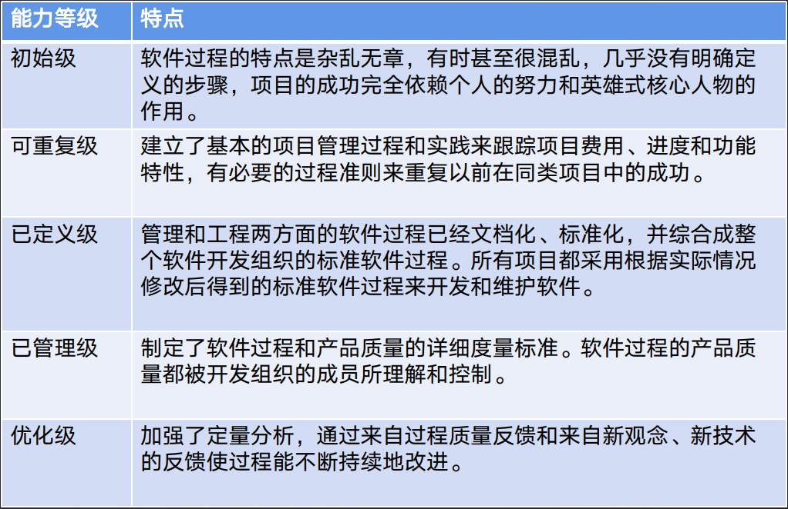
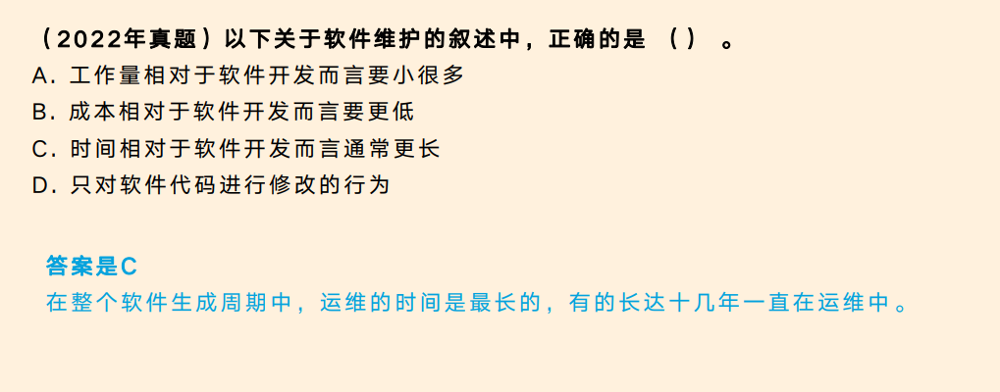
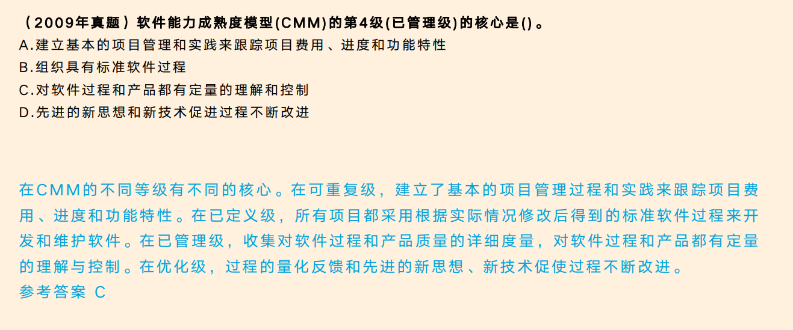

软件工程是一门研究和应用如何以系统化、规范化、可量化的方法开发和维护软件的学科。它涉及到软件开发的全过程，包括需求分析、设计、编码、测试、部署和维护等阶段。

软件工程的目标是以最大限度地提高软件的质量、可靠性、可维护性和可重用性，同时控制软件开发的成本、进度和风险。

软件工程包括许多技术和工具的应用，如需求工程、面向对象的分析和设计、软件测试、软件项目管理等。同时，它还涉及到与用户和其他相关人员的沟通和协作，以确保软件能够满足用户的需求。

随着计算机技术的发展和软件在各个领域的广泛应用，软件工程的重要性日益增强。良好的软件工程实践可以提高软件的质量和可靠性，降低软件开发和维护的成本，并促进软件的创新和协同开发。因此，软件工程已成为计算机科学和软件工程专业的重要组成部分，并受到越来越多的关注和重视。


## 一、软件工程概述

### :cactus:软件工程诞生原因

早期的软件主要是通过个别开发者采用个体工作方式来实现的程序。随着软件项目规模和复杂性的不断增加，单纯依靠个人的能力已经无法满足需求。因此，人们开始探索一种更为系统化和规范化的方法来开发和管理软件，以应对软件危机和提高开发效率。这就是软件工程诞生的原因之一。软件工程作为一门综合性学科，整合了计算机科学、工程学和管理学的知识，为软件开发提供了更加科学和有效的方法。

第一次软件危机是发生在20世纪60年代中期的一段时间，表现为许多软件项目在质量、进度和预算等方面出现了严重问题。软件质量低下、项目无法按时完成、项目严重超支等情况屡见不鲜。更为严重的是，由于软件错误而导致的重大事故也时有发生。

这次危机的主要原因是，软件开发过程缺乏规范和组织性，很多项目仅依赖个别开发者的个人能力和经验，缺乏系统化的方法和控制。软件规模和复杂性也在不断增加，但开发工具和技术的支持有限。这导致了软件项目的风险和不确定性增加，使得项目管理变得困难，并且软件质量的控制变得迫切与困难。

为了解决这一危机，软件工程作为一门学科逐渐兴起。软件工程的诞生：1968年在NATO会议上提出对软件危机的解决方法。

软件工程的目标是提供一套科学化和规范化的方法，以有效地管理软件开发过程，确保软件质量和项目成功。软件工程引入了一系列的原则、方法和技术，如需求分析、软件设计、编码和测试等，逐步建立了一套完整的软件开发生命周期。此外，软件工程还重视软件项目管理，包括进度控制、资源分配、风险管理等。通过软件工程的实践，软件行业逐渐走上了一条更为科学和可靠的发展道路。

软件工程的基本要素：方法、工具、过程：

| 软件工程基本要素 | 定义和说明                                                   |
| :--------------- | :----------------------------------------------------------- |
| 方法（Method）   | 软件工程方法指的是经过验证和证明能够规范和指导软件开发过程的一系列步骤、技术和技巧。不同的软件工程方法适用于不同的开发场景和需求，例如瀑布模型、敏捷开发、迭代开发等。软件工程方法的目标是提高开发效率、质量和可维护性。 |
| 工具（Tools）    | 软件工程工具是指用于支持软件开发、测试和管理的各种软件和系统。这些工具可以帮助开发团队进行代码编写、测试自动化、版本控制、项目管理等任务。常见的软件工程工具包括集成开发环境（IDE）、测试工具、版本控制系统、项目管理工具等。工具的使用可以提高开发团队的效率、协作和质量。 |
| 过程（Process）  | 软件工程过程是指规划、组织、控制和评估软件开发活动的一系列步骤和方法。软件工程过程通常包括需求分析、设计、编码、测试、部署和维护等阶段。每个过程阶段都有特定的输入、输出和活动，以确保软件开发按照计划进行并产生高质量的结果。软件工程过程的管理可以帮助团队实现项目目标，并不断改进开发过程。 |

### :cactus:软件工程基本原理

为了应对第一次软件危机，软件工程引入了一系列的原则、方法和技术，以提高软件开发过程的效率和质量。

#### :shell:用分阶段的生命周期计划严格管理

软件工程通过将软件开发过程划分为不同的阶段，并为每个阶段制定详细的计划和目标，以确保项目按照规定的时间表和预算进行。每个阶段的完成情况都需要进行评估和记录，以便及时调整和纠正。

#### :shell:坚持进行阶段评审

在每个阶段结束时，对已完成的工作进行评审是非常重要的。评审的目的是检查每个阶段的成果是否符合预期，并发现和解决潜在的问题和风险。通过定期的阶段评审，开发团队可以及时调整和改进，避免问题的蔓延和扩大。

#### :shell:实现严格的产品控制

软件工程强调对软件产品进行严格的控制和管理。这包括对需求的管理、配置管理、版本控制、变更管理等。通过建立适当的控制措施，可以确保软件产品的稳定性和一致性，避免不必要的错误和问题。

#### :shell:采用现代程序设计技术

软件工程鼓励开发团队采用现代的程序设计技术和工具，以提高开发效率和软件质量。这包括使用结构化编程、面向对象编程、设计模式等技术，以及使用自动化测试和集成工具等。通过利用现代技术，开发团队可以更好地组织和管理代码，降低出错概率，并提高可维护性。

#### :shell:结果应能清楚地审查

软件工程强调结果的可审查性。这意味着软件开发过程中的每个阶段和成果都应该能够被审查和评估。开发团队应该建立清晰的文档和记录，以便他人能够理解和审查工作的内容和质量。

#### :shell:开发小组的人员应少而精

在软件工程中，开发小组的人员数量应该适度控制，以保证团队的高效工作和良好的沟通。小团队成员之间可以更好地协作和合作，并更容易管理和调整。此外，人员的选择应该考虑到其专业技能和经验，以确保团队成员能够胜任和完成工作。

#### :shell:承认不断改进软件工程实践的必要性

软件工程是一个不断发展和改进的领域。新的技术和方法不断涌现，需要不断地学习和应用。软件工程的实践需要持续地反思和改进，以适应不断变化的需求和环境。开发团队应该保持对新想法和最佳实践的开放态度，并根据实际情况不断调整和优化自己的工作方式。

### :cactus:软件生存周期

#### :shell:可行性分析与项目开发计划

在软件生命周期中，进行可行性分析和制定项目开发计划非常重要。

可行性分析是对项目的可行性进行评估，包括技术可行性、经济可行性、市场可行性等方面的考虑。通过可行性分析，可以评估项目是否有足够的资源支持、是否满足用户需求、是否能够实现预期的经济效益等，从而确定项目是否值得投入开发。

项目开发计划是根据可行性分析的结果来制定的，它包括项目的时间安排、资源分配、里程碑设定等。一个合理的项目开发计划可以确保项目按时交付、高质量完成。在制定项目开发计划时，需要考虑项目的复杂性、开发人员的技术能力、项目的风险等因素。

在软件生命周期中，可行性分析和项目开发计划是紧密相关的。只有通过可行性分析，确定项目的可行性后，才能制定出合理的项目开发计划。同时，在项目开发过程中，还需要不断进行可行性分析的更新和调整，以保证项目的顺利进行。

```csharp
 - 目标：确定软件开发目标及其可行性
 - 输出：可行性分析报告、项目开发计划
```


#### :shell:需求分析

软件生存周期中的需求分析是指在软件开发过程中，开发团队与客户共同合作，通过对客户需求的收集、整理和分析，确定软件系统的功能、性能、界面、安全等方面的需求。需求分析是软件开发过程中的关键环节，它直接影响着软件系统的质量和成功与否。

需求分析的主要目标是确定软件系统的功能需求和非功能需求。功能需求指的是软件系统需要具备的功能，包括输入、处理和输出等功能。非功能需求则是软件系统的性能、界面、安全等方面的需求，如系统的响应时间、用户界面的友好性、数据的安全性等。

需求分析的过程包括需求收集、需求分析和需求确认三个阶段。需求收集是指通过与客户沟通、参观现场、观察现有系统等方式，获取客户的需求信息。需求分析是在收集到需求信息后，对需求进行整理、分类和分析，确定软件系统的功能和非功能需求。需求确认是指与客户共同确认需求的正确性和完整性，以确保需求与客户的期望一致。

需求分析的方法包括面谈法、[问卷调查](https://cloud.tencent.com/product/survey?from_column=20065&from=20065)法、原型法等。面谈法是通过与客户进行面对面的交流，了解客户的需求和期望。问卷调查法是通过编制问卷，向客户发放，收集客户的需求信息。原型法是通过制作软件原型，向客户展示软件的功能和界面，以获取客户的反馈和需求信息。

需求分析的结果是需求规格说明书，它包括了系统需求的详细描述、用例图、功能需求、非功能需求等内容。需求规格说明书是开发团队与客户之间的合同，对于软件开发过程的后续阶段起到了重要的指导作用。

```csharp
 - 目标：确定软件系统要做什么，以及它的功能、性能、数据和界面等要求，从而确定系统的逻辑模型。
 - 输出：软件需求说明书
```


#### :shell:概要设计

软件工程中的概要设计是在需求分析阶段之后进行的一项重要工作。概要设计是将需求分析的结果转化为软件系统的高层结构和模块化设计的过程。

概要设计的主要目标是定义软件系统的整体结构和模块之间的关系，以及模块的功能和接口。概要设计的结果通常以图形化的方式展现，如UML类图、流程图等。

在概要设计阶段，软件工程师需要考虑以下几个方面：

1. 确定软件系统的整体结构：根据需求分析的结果，确定软件系统的模块和子系统，以及它们之间的层次结构和关系。
2. 定义模块的功能和接口：对每个模块进行细化设计，明确模块的功能和它们之间的接口。这包括定义模块的输入和输出，以及模块的内部逻辑和数据结构。
3. 根据软件开发的原则进行设计：概要设计需要遵循软件工程的原则和最佳实践，如高内聚低耦合、模块化设计、可扩展性、可维护性等。
4. 考虑软件系统的性能和可靠性：在概要设计阶段，软件工程师需要考虑软件系统的性能和可靠性要求，并相应地进行设计。
5. 进行评审和修改：概要设计完成后，需要进行评审和修改，确保设计符合需求，并满足软件工程的要求。

```csharp
 - 目标：明确软件中的模块、模块的层次结构、模块的调用关系和功能。明确数据库结构
 - 输出：概要设计说明书
```


#### :shell:详细设计

软件工程中的详细设计是软件开发过程中的一个重要阶段，它是在需求分析和系统设计之后进行的。

在详细设计阶段，软件工程师将系统设计的高级抽象转化为实际的软件结构和算法。详细设计的主要目标是定义系统的内部组件和模块，确定它们之间的接口和交互方式，以及定义实现这些组件和模块所需的算法和数据结构。

在详细设计阶段，工程师通常会使用一些工具和技术来辅助设计，例如UML（统一建模语言），流程图，数据流图等。这些工具可以帮助工程师更好地理解系统的结构和功能，并以可视化的方式进行设计和沟通。

详细设计的输出通常包括以下内容：

1. 系统的模块和组件：详细设计阶段将系统拆分为多个模块和组件，并定义它们的职责和功能。
2. 接口定义：详细设计阶段确定每个模块和组件之间的接口，并定义它们之间的通信方式和数据格式。
3. 数据结构和算法：详细设计阶段定义实现系统功能所需的数据结构和算法，包括数据的存储和处理方式。
4. 错误处理和异常处理：详细设计阶段考虑系统可能出现的错误和异常情况，并定义相应的处理策略和机制。
5. 性能优化：在详细设计阶段，工程师可以对系统进行性能分析和优化，以确保系统能够满足性能要求。

```csharp
 - 目标：明确模块的控制结构
 - 输出：详细设计说明书
```


#### :shell:编码

在软件工程中，编码是指将设计好的软件系统规划转化为计算机程序代码的过程。编码是软件开发的核心部分之一，它是将设计好的逻辑和功能转化成机器可执行的指令集的过程。

在编码过程中，开发人员会根据设计文档和业务需求，使用特定的编程语言和技术，按照一定的编码规范和最佳实践，将逻辑和功能逐步转换为计算机程序的代码。编码涉及到语法、语义、算法、数据结构等方面的知识。

编码的目标是实现软件的功能需求，并保证代码的可读性、可维护性、可扩展性和性能等方面的优化。良好的编码实践可以提高代码的质量，减少错误和缺陷，并提高开发效率和团队协作。

在编码过程中，开发人员通常会使用集成开发环境（IDE）或文本编辑器来编写代码，并经过编译、运行和调试等步骤来验证代码的正确性和效果。编码后的代码会进行版本控制，并通过软件测试和代码评审等方式来确保代码的质量和正确性。

```csharp
 - 目标：将过程描述转变为程序代码
 - 输出：某种特定语言的源代码
```


#### :shell:测试

软件工程中的测试是指在软件开发过程中对软件进行验证和验证的活动。测试的目的是发现错误和缺陷，以确保软件的质量和功能的正确性。以下是软件工程中的几种常见的测试方法：

1. 单元测试：对软件中的最小功能单元进行测试，如函数、方法或模块。它通常由开发人员自行进行，并使用测试框架来编写和执行测试用例。
2. 集成测试：测试不同模块或组件之间的集成和交互。它旨在确保不同部分之间的集成正常工作，并验证系统的整体功能和性能。
3. 系统测试：对整个软件系统进行全面的测试，以验证其是否符合需求规格和用户期望。这种测试通常由专门的测试团队进行，并使用各种测试技术和方法。
4. 验收测试：由最终用户或客户进行的测试，以确认软件是否满足其需求和期望。它通常在软件开发的最后阶段进行，以确保软件已经达到可交付和可用的状态。

除了这些基本的测试方法外，还有一些其他的测试技术，如性能测试、[安全测试](https://cloud.tencent.com/product/sr?from_column=20065&from=20065)、可靠性测试和兼容性测试等，用于验证软件在不同方面的质量和性能。

```csharp
 - 目标：保证软件质量
 - 输出：软件测试计划、测试用例、软件测试报告
```


#### :shell:维护

软件工程中的维护是指对已经开发完成的软件系统进行修改、优化和修复工作。维护是软件开发过程中非常重要的一环，因为维护工作的质量直接影响到软件系统的稳定性、可靠性和可用性。

维护包括以下几个方面：

1. 纠正性维护：指修复软件系统中的错误和缺陷，确保软件系统的正常运行。
2. 适应性维护：指根据外部环境和需求的变化，对软件系统进行修改和扩展。
3. 完善性维护：指对软件系统的性能、可用性和用户体验进行改进和优化。
4. 预防性维护：指对软件系统进行预防性的检查和调整，以保证系统的稳定性和可靠性。

维护工作通常包括以下几个阶段：

1. 问题诊断和分析：对软件系统中出现的问题进行诊断和分析，确定问题的原因和解决方案。
2. 问题修复和验证：根据问题的解决方案对软件系统进行修复，并进行验证和测试，确保修复后的系统正常运行。
3. 修改和扩展：根据需求变更，对软件系统进行修改和扩展，以满足新的需求和功能。
4. 性能优化：对软件系统的性能进行分析和优化，提升系统的响应速度和效率。
5. 文档更新：对软件系统的文档进行更新和维护，确保文档与实际系统保持一致和最新。

维护工作需要软件工程师具备扎实的编程和调试能力，以及对软件系统的深入理解和熟悉。同时，维护工作也需要与用户和需求方进行有效的沟通和协作，以确保维护工作的准确性和及时性。

### :cactus:能力成熟度模型-CMM

能力成熟度模型（Capability Maturity Model，简称CMM）是一种软件工程评估模型，用于评估和提高组织的软件开发和维护过程的成熟度。

CMM最初由美国软件工程研究所（SEI）于1987年开发，后来发展成为CMMI（Capability Maturity Model Integration）。

CMM是一个五阶段模型，每个阶段描述了组织的软件工程能力水平和过程成熟度。



### :cactus:能力成熟度模型集成-CMMI

是若干过程模型的综合和改进，不仅仅是软件，而是支持多个工程学科和领域的、系统的、一致的过程改进框架，能适应现代工程的特点和需要，能提高过程的质量和工作效率。

CMMI两种表示方法：

1. 阶段式模型：类似于CMM，它关注组织的成熟度。
2. 连续式模型：关注每个过程域的能力，一个组织对不同的过程域可以达到不同的过程域能力等级。

阶段式模型成熟度等级描述如下：






## 二、软件过程模型

## 三、需求分析

## 四、系统设计

## 五、系统测试

## 六、运行与维护知识

## 七、软件项目管理

## 八、软件质量

## 九、软件度量

## 十、软件工具与软件开发环境