软件工程是一门研究和应用如何以系统化、规范化、可量化的方法开发和维护软件的学科。它涉及到软件开发的全过程，包括需求分析、设计、编码、测试、部署和维护等阶段。

软件工程的目标是以最大限度地提高软件的质量、可靠性、可维护性和可重用性，同时控制软件开发的成本、进度和风险。

软件工程包括许多技术和工具的应用，如需求工程、面向对象的分析和设计、软件测试、软件项目管理等。同时，它还涉及到与用户和其他相关人员的沟通和协作，以确保软件能够满足用户的需求。

随着计算机技术的发展和软件在各个领域的广泛应用，软件工程的重要性日益增强。良好的软件工程实践可以提高软件的质量和可靠性，降低软件开发和维护的成本，并促进软件的创新和协同开发。因此，软件工程已成为计算机科学和软件工程专业的重要组成部分，并受到越来越多的关注和重视。


## 一、软件工程概述

### :cactus:软件工程诞生原因

早期的软件主要是通过个别开发者采用个体工作方式来实现的程序。随着软件项目规模和复杂性的不断增加，单纯依靠个人的能力已经无法满足需求。因此，人们开始探索一种更为系统化和规范化的方法来开发和管理软件，以应对软件危机和提高开发效率。这就是软件工程诞生的原因之一。软件工程作为一门综合性学科，整合了计算机科学、工程学和管理学的知识，为软件开发提供了更加科学和有效的方法。

第一次软件危机是发生在20世纪60年代中期的一段时间，表现为许多软件项目在质量、进度和预算等方面出现了严重问题。软件质量低下、项目无法按时完成、项目严重超支等情况屡见不鲜。更为严重的是，由于软件错误而导致的重大事故也时有发生。

这次危机的主要原因是，软件开发过程缺乏规范和组织性，很多项目仅依赖个别开发者的个人能力和经验，缺乏系统化的方法和控制。软件规模和复杂性也在不断增加，但开发工具和技术的支持有限。这导致了软件项目的风险和不确定性增加，使得项目管理变得困难，并且软件质量的控制变得迫切与困难。

为了解决这一危机，软件工程作为一门学科逐渐兴起。软件工程的诞生：1968年在NATO会议上提出对软件危机的解决方法。

软件工程的目标是提供一套科学化和规范化的方法，以有效地管理软件开发过程，确保软件质量和项目成功。软件工程引入了一系列的原则、方法和技术，如需求分析、软件设计、编码和测试等，逐步建立了一套完整的软件开发生命周期。此外，软件工程还重视软件项目管理，包括进度控制、资源分配、风险管理等。通过软件工程的实践，软件行业逐渐走上了一条更为科学和可靠的发展道路。

软件工程的基本要素：方法、工具、过程：

| 软件工程基本要素 | 定义和说明                                                   |
| :--------------- | :----------------------------------------------------------- |
| 方法（Method）   | 软件工程方法指的是经过验证和证明能够规范和指导软件开发过程的一系列步骤、技术和技巧。不同的软件工程方法适用于不同的开发场景和需求，例如瀑布模型、敏捷开发、迭代开发等。软件工程方法的目标是提高开发效率、质量和可维护性。 |
| 工具（Tools）    | 软件工程工具是指用于支持软件开发、测试和管理的各种软件和系统。这些工具可以帮助开发团队进行代码编写、测试自动化、版本控制、项目管理等任务。常见的软件工程工具包括集成开发环境（IDE）、测试工具、版本控制系统、项目管理工具等。工具的使用可以提高开发团队的效率、协作和质量。 |
| 过程（Process）  | 软件工程过程是指规划、组织、控制和评估软件开发活动的一系列步骤和方法。软件工程过程通常包括需求分析、设计、编码、测试、部署和维护等阶段。每个过程阶段都有特定的输入、输出和活动，以确保软件开发按照计划进行并产生高质量的结果。软件工程过程的管理可以帮助团队实现项目目标，并不断改进开发过程。 |

### :cactus:软件工程基本原理

为了应对第一次软件危机，软件工程引入了一系列的原则、方法和技术，以提高软件开发过程的效率和质量。

#### :shell:用分阶段的生命周期计划严格管理

软件工程通过将软件开发过程划分为不同的阶段，并为每个阶段制定详细的计划和目标，以确保项目按照规定的时间表和预算进行。每个阶段的完成情况都需要进行评估和记录，以便及时调整和纠正。

#### :shell:坚持进行阶段评审

在每个阶段结束时，对已完成的工作进行评审是非常重要的。评审的目的是检查每个阶段的成果是否符合预期，并发现和解决潜在的问题和风险。通过定期的阶段评审，开发团队可以及时调整和改进，避免问题的蔓延和扩大。

#### :shell:实现严格的产品控制

软件工程强调对软件产品进行严格的控制和管理。这包括对需求的管理、配置管理、版本控制、变更管理等。通过建立适当的控制措施，可以确保软件产品的稳定性和一致性，避免不必要的错误和问题。

#### :shell:采用现代程序设计技术

软件工程鼓励开发团队采用现代的程序设计技术和工具，以提高开发效率和软件质量。这包括使用结构化编程、面向对象编程、设计模式等技术，以及使用自动化测试和集成工具等。通过利用现代技术，开发团队可以更好地组织和管理代码，降低出错概率，并提高可维护性。

#### :shell:结果应能清楚地审查

软件工程强调结果的可审查性。这意味着软件开发过程中的每个阶段和成果都应该能够被审查和评估。开发团队应该建立清晰的文档和记录，以便他人能够理解和审查工作的内容和质量。

#### :shell:开发小组的人员应少而精

在软件工程中，开发小组的人员数量应该适度控制，以保证团队的高效工作和良好的沟通。小团队成员之间可以更好地协作和合作，并更容易管理和调整。此外，人员的选择应该考虑到其专业技能和经验，以确保团队成员能够胜任和完成工作。

#### :shell:承认不断改进软件工程实践的必要性

软件工程是一个不断发展和改进的领域。新的技术和方法不断涌现，需要不断地学习和应用。软件工程的实践需要持续地反思和改进，以适应不断变化的需求和环境。开发团队应该保持对新想法和最佳实践的开放态度，并根据实际情况不断调整和优化自己的工作方式。

### :cactus:软件生存周期

#### :shell:可行性分析与项目开发计划

在软件生命周期中，进行可行性分析和制定项目开发计划非常重要。

可行性分析是对项目的可行性进行评估，包括技术可行性、经济可行性、市场可行性等方面的考虑。通过可行性分析，可以评估项目是否有足够的资源支持、是否满足用户需求、是否能够实现预期的经济效益等，从而确定项目是否值得投入开发。

项目开发计划是根据可行性分析的结果来制定的，它包括项目的时间安排、资源分配、里程碑设定等。一个合理的项目开发计划可以确保项目按时交付、高质量完成。在制定项目开发计划时，需要考虑项目的复杂性、开发人员的技术能力、项目的风险等因素。

在软件生命周期中，可行性分析和项目开发计划是紧密相关的。只有通过可行性分析，确定项目的可行性后，才能制定出合理的项目开发计划。同时，在项目开发过程中，还需要不断进行可行性分析的更新和调整，以保证项目的顺利进行。

```csharp
 - 目标：确定软件开发目标及其可行性
 - 输出：可行性分析报告、项目开发计划
```


#### :shell:需求分析

软件生存周期中的需求分析是指在软件开发过程中，开发团队与客户共同合作，通过对客户需求的收集、整理和分析，确定软件系统的功能、性能、界面、安全等方面的需求。需求分析是软件开发过程中的关键环节，它直接影响着软件系统的质量和成功与否。

需求分析的主要目标是确定软件系统的功能需求和非功能需求。功能需求指的是软件系统需要具备的功能，包括输入、处理和输出等功能。非功能需求则是软件系统的性能、界面、安全等方面的需求，如系统的响应时间、用户界面的友好性、数据的安全性等。

需求分析的过程包括需求收集、需求分析和需求确认三个阶段。需求收集是指通过与客户沟通、参观现场、观察现有系统等方式，获取客户的需求信息。需求分析是在收集到需求信息后，对需求进行整理、分类和分析，确定软件系统的功能和非功能需求。需求确认是指与客户共同确认需求的正确性和完整性，以确保需求与客户的期望一致。

需求分析的方法包括面谈法、[问卷调查](https://cloud.tencent.com/product/survey?from_column=20065&from=20065)法、原型法等。面谈法是通过与客户进行面对面的交流，了解客户的需求和期望。问卷调查法是通过编制问卷，向客户发放，收集客户的需求信息。原型法是通过制作软件原型，向客户展示软件的功能和界面，以获取客户的反馈和需求信息。

需求分析的结果是需求规格说明书，它包括了系统需求的详细描述、用例图、功能需求、非功能需求等内容。需求规格说明书是开发团队与客户之间的合同，对于软件开发过程的后续阶段起到了重要的指导作用。

```csharp
 - 目标：确定软件系统要做什么，以及它的功能、性能、数据和界面等要求，从而确定系统的逻辑模型。
 - 输出：软件需求说明书
```


#### :shell:概要设计

软件工程中的概要设计是在需求分析阶段之后进行的一项重要工作。概要设计是将需求分析的结果转化为软件系统的高层结构和模块化设计的过程。

概要设计的主要目标是定义软件系统的整体结构和模块之间的关系，以及模块的功能和接口。概要设计的结果通常以图形化的方式展现，如UML类图、流程图等。

在概要设计阶段，软件工程师需要考虑以下几个方面：

1. 确定软件系统的整体结构：根据需求分析的结果，确定软件系统的模块和子系统，以及它们之间的层次结构和关系。
2. 定义模块的功能和接口：对每个模块进行细化设计，明确模块的功能和它们之间的接口。这包括定义模块的输入和输出，以及模块的内部逻辑和数据结构。
3. 根据软件开发的原则进行设计：概要设计需要遵循软件工程的原则和最佳实践，如高内聚低耦合、模块化设计、可扩展性、可维护性等。
4. 考虑软件系统的性能和可靠性：在概要设计阶段，软件工程师需要考虑软件系统的性能和可靠性要求，并相应地进行设计。
5. 进行评审和修改：概要设计完成后，需要进行评审和修改，确保设计符合需求，并满足软件工程的要求。

```csharp
 - 目标：明确软件中的模块、模块的层次结构、模块的调用关系和功能。明确数据库结构
 - 输出：概要设计说明书
```


#### :shell:详细设计

软件工程中的详细设计是软件开发过程中的一个重要阶段，它是在需求分析和系统设计之后进行的。

在详细设计阶段，软件工程师将系统设计的高级抽象转化为实际的软件结构和算法。详细设计的主要目标是定义系统的内部组件和模块，确定它们之间的接口和交互方式，以及定义实现这些组件和模块所需的算法和数据结构。

在详细设计阶段，工程师通常会使用一些工具和技术来辅助设计，例如UML（统一建模语言），流程图，数据流图等。这些工具可以帮助工程师更好地理解系统的结构和功能，并以可视化的方式进行设计和沟通。

详细设计的输出通常包括以下内容：

1. 系统的模块和组件：详细设计阶段将系统拆分为多个模块和组件，并定义它们的职责和功能。
2. 接口定义：详细设计阶段确定每个模块和组件之间的接口，并定义它们之间的通信方式和数据格式。
3. 数据结构和算法：详细设计阶段定义实现系统功能所需的数据结构和算法，包括数据的存储和处理方式。
4. 错误处理和异常处理：详细设计阶段考虑系统可能出现的错误和异常情况，并定义相应的处理策略和机制。
5. 性能优化：在详细设计阶段，工程师可以对系统进行性能分析和优化，以确保系统能够满足性能要求。

```csharp
 - 目标：明确模块的控制结构
 - 输出：详细设计说明书
```


#### :shell:编码

在软件工程中，编码是指将设计好的软件系统规划转化为计算机程序代码的过程。编码是软件开发的核心部分之一，它是将设计好的逻辑和功能转化成机器可执行的指令集的过程。

在编码过程中，开发人员会根据设计文档和业务需求，使用特定的编程语言和技术，按照一定的编码规范和最佳实践，将逻辑和功能逐步转换为计算机程序的代码。编码涉及到语法、语义、算法、数据结构等方面的知识。

编码的目标是实现软件的功能需求，并保证代码的可读性、可维护性、可扩展性和性能等方面的优化。良好的编码实践可以提高代码的质量，减少错误和缺陷，并提高开发效率和团队协作。

在编码过程中，开发人员通常会使用集成开发环境（IDE）或文本编辑器来编写代码，并经过编译、运行和调试等步骤来验证代码的正确性和效果。编码后的代码会进行版本控制，并通过软件测试和代码评审等方式来确保代码的质量和正确性。

```csharp
 - 目标：将过程描述转变为程序代码
 - 输出：某种特定语言的源代码
```


#### :shell:测试

软件工程中的测试是指在软件开发过程中对软件进行验证和验证的活动。测试的目的是发现错误和缺陷，以确保软件的质量和功能的正确性。以下是软件工程中的几种常见的测试方法：

1. 单元测试：对软件中的最小功能单元进行测试，如函数、方法或模块。它通常由开发人员自行进行，并使用测试框架来编写和执行测试用例。
2. 集成测试：测试不同模块或组件之间的集成和交互。它旨在确保不同部分之间的集成正常工作，并验证系统的整体功能和性能。
3. 系统测试：对整个软件系统进行全面的测试，以验证其是否符合需求规格和用户期望。这种测试通常由专门的测试团队进行，并使用各种测试技术和方法。
4. 验收测试：由最终用户或客户进行的测试，以确认软件是否满足其需求和期望。它通常在软件开发的最后阶段进行，以确保软件已经达到可交付和可用的状态。

除了这些基本的测试方法外，还有一些其他的测试技术，如性能测试、[安全测试](https://cloud.tencent.com/product/sr?from_column=20065&from=20065)、可靠性测试和兼容性测试等，用于验证软件在不同方面的质量和性能。

```csharp
 - 目标：保证软件质量
 - 输出：软件测试计划、测试用例、软件测试报告
```


#### :shell:维护

软件工程中的维护是指对已经开发完成的软件系统进行修改、优化和修复工作。维护是软件开发过程中非常重要的一环，因为维护工作的质量直接影响到软件系统的稳定性、可靠性和可用性。

维护包括以下几个方面：

1. 纠正性维护：指修复软件系统中的错误和缺陷，确保软件系统的正常运行。
2. 适应性维护：指根据外部环境和需求的变化，对软件系统进行修改和扩展。
3. 完善性维护：指对软件系统的性能、可用性和用户体验进行改进和优化。
4. 预防性维护：指对软件系统进行预防性的检查和调整，以保证系统的稳定性和可靠性。

维护工作通常包括以下几个阶段：

1. 问题诊断和分析：对软件系统中出现的问题进行诊断和分析，确定问题的原因和解决方案。
2. 问题修复和验证：根据问题的解决方案对软件系统进行修复，并进行验证和测试，确保修复后的系统正常运行。
3. 修改和扩展：根据需求变更，对软件系统进行修改和扩展，以满足新的需求和功能。
4. 性能优化：对软件系统的性能进行分析和优化，提升系统的响应速度和效率。
5. 文档更新：对软件系统的文档进行更新和维护，确保文档与实际系统保持一致和最新。

维护工作需要软件工程师具备扎实的编程和调试能力，以及对软件系统的深入理解和熟悉。同时，维护工作也需要与用户和需求方进行有效的沟通和协作，以确保维护工作的准确性和及时性。

### :cactus:能力成熟度模型-CMM

能力成熟度模型（Capability Maturity Model，简称CMM）是一种软件工程评估模型，用于评估和提高组织的软件开发和维护过程的成熟度。

CMM最初由美国软件工程研究所（SEI）于1987年开发，后来发展成为CMMI（Capability Maturity Model Integration）。

CMM是一个五阶段模型，每个阶段描述了组织的软件工程能力水平和过程成熟度。

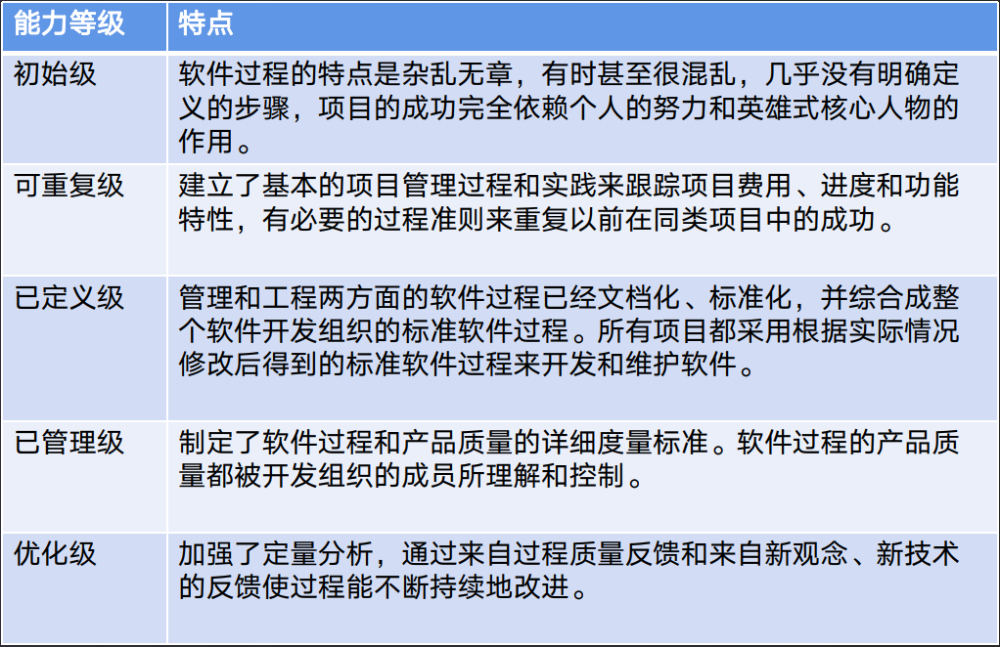

### :cactus:能力成熟度模型集成-CMMI

是若干过程模型的综合和改进，不仅仅是软件，而是支持多个工程学科和领域的、系统的、一致的过程改进框架，能适应现代工程的特点和需要，能提高过程的质量和工作效率。

CMMI两种表示方法：

1. 阶段式模型：类似于CMM，它关注组织的成熟度。
2. 连续式模型：关注每个过程域的能力，一个组织对不同的过程域可以达到不同的过程域能力等级。

阶段式模型成熟度等级描述如下：


## 二、软件过程模型

软件工程的过程模型是指开发软件的过程中所采用的一种规范化方法或框架。常见的软件工程过程模型包括瀑布模型、迭代开发模型、喷泉模型、敏捷开发模型等。

1. 瀑布模型：软件开发按照线性顺序依次进行，包括需求分析、设计、编码、测试和部署等阶段，每个阶段的完成都依赖于上一个阶段的输入。适用于需求稳定、项目较小的情况。
2. 迭代开发模型：将软件开发划分为多个迭代周期，每个周期都包括需求分析、设计、编码、测试和部署等阶段。每个迭代周期产生一个可交付的软件部分，迭代的次数和周期可以根据实际情况调整。适用于需求变化较快、项目较大的情况。
3. 喷泉模型：将软件开发看作是一个持续的过程，包括需求分析、设计、编码、测试等阶段。不同于瀑布模型的是，各个阶段可以交叉进行，灵活调整开发的优先级和顺序。适用于需求变化频繁、项目较复杂的情况。
4. 敏捷开发模型：以迭代的方式进行软件开发，强调团队合作和灵活性。将需求分解为小的用户故事，通过短暂的迭代周期快速交付部分功能，并根据实际反馈进行迭代和调整。适用于需求变化频繁、项目较灵活的情况。

软件工程的过程模型是一种规范和指导软件开发过程的框架或方法。它将软件开发过程分解为一系列阶段和活动，并定义了每个阶段的输入、输出和相应的工作内容。

### :cactus:瀑布模型

#### :shell:瀑布模型（S D L C）

瀑布模型（Waterfall Model）是软件开发生命周期（SDLC）中的一种经典开发模型。它是一种顺序性的开发模型，由上往下依次进行，各个阶段依赖于前一阶段的结果。

瀑布模型是一个经典的生命周期模型，一般将软件开发分为：可行性分析（计划）、需求分析、软件设计（概要设计、详细设计）、编码、测试、运行维护几个阶段。在每个阶段完成后，才能进行下一个阶段。这种顺序性的开发模型适用于需求变化较少且具体明确的项目。

瀑布模型是以文档作为驱动、适合于软件需求很明确的软件项目的模型。

#### :shell:瀑布模型特点

① 从上一项开发活动接收该项活动的工作对象作为输入。

② 接收输入后，实施该项活动应完成的工作内容。

③ 给出该项活动的工作成果，作为输出传给下一项开发活动。

④ 对该项活动的实施工作成果进行评审 。 若评审通过 ， 则进入下一项开发活动；否则返回前一项甚至更前项的活动。

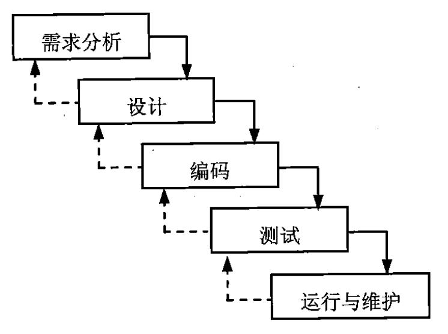

#### :shell:瀑布模型的优缺点

瀑布模型的优点：明确的项目计划和清晰的开发流程；适用于较小规模的项目；开发过程中轻松追踪和控制进度。

瀑布模型的缺点：由于各个阶段的依赖关系，需求变更较大时，会导致整个项目的延迟；测试阶段在开发结束后才进行，可能导致问题的发现和修复较晚；客户参与程度较低，可能导致最终产品与客户需求有较大差距。

### :cactus:瀑布模型变种-V模型

#### :shell:V模型

V模型是瀑布模型的一种变种，它将瀑布模型的开发过程与质量保证过程相互关联，以确保产品的质量和符合用户需求。

在V模型中，开发过程和测试过程是相互平行的，如同字母“V”一样。下面是V模型的几个阶段：

1. 需求分析阶段：在这个阶段，需求分析师与客户共同定义和理解项目需求，并将其转化为需求规格说明书。
2. 系统设计阶段：在这个阶段，系统设计师根据需求规格说明书，设计系统架构和功能描述，以确保满足特定需求。
3. 模块设计阶段：在这个阶段，软件设计师将系统设计拆解为模块，并定义每个模块的详细设计规范。
4. 编码阶段：在这个阶段，开发人员根据模块设计规范，编写源代码。
5. 单元测试阶段：在这个阶段，开发人员对每个编写的模块进行测试，以确保其功能正常。
6. 集成测试阶段：在这个阶段，将已经测试通过的模块进行集成，并对整个系统进行测试，以确保模块之间的互操作性和功能一致性。
7. 系统测试阶段：在这个阶段，将整个系统进行全面测试，以验证系统是否满足用户需求和规格。
8. 验收测试阶段：在这个阶段，将系统交付给用户或客户，由用户执行测试，以确认系统是否符合需求。

V模型强调测试在整个开发过程中的重要性，通过将测试过程纳入开发过程中，可以及早发现和解决问题，提高产品质量。同时，V模型也能够提供一个明确的开发和测试过程的框架，提高开发团队的工作效率。

#### :shell:V模型特点

① 单元测试主要针对编码过程中可能存在的各种错误进行验证。

② 集成测试主要针对详细设计中可能存在的各种错误进行验证。

③ 系统测试主要针对概要设计，检查系统作为一个整体是否可以有效地运行。

④ 验收测试主要是针对需求建模、需求分析，通常由业务专家或者用户进行，以确认产品能真正符合用户业务上的需要。

⑤ V模型用于需求明确和需求变更不频繁的情形。

⑥ V模型中的突出的是测试和开发生命周期各阶段的结合。

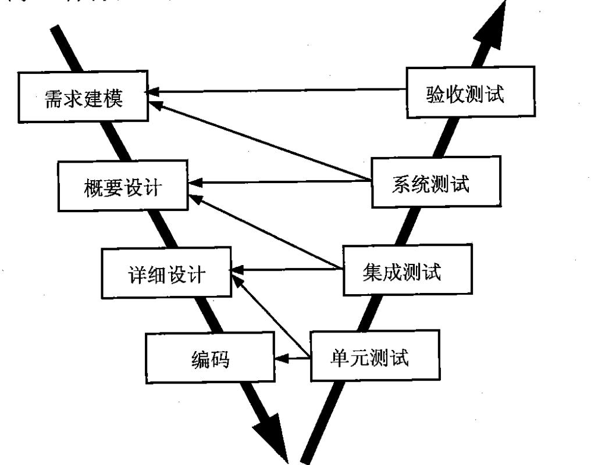

### :cactus:演化模型-原型模型

#### :shell:原型模型

在项目开始阶段，进行与项目干系人的有效交流，确保对需求的准确理解。然后，创建一个快速原型，以便项目干系人与未来用户之间可以通过原型进行交互，从而更好地了解需求和反馈。随后，通过与相关干系人进行充分的讨论和分析，以深入了解当前系统的需求。最后，在基于原型的基础上，进行开发过程，以确保最终交付的产品能够满足用户的期望和需求。

#### :shell:原型模型的特点

① 实际可行。

② 具有最终系统的基本特征。

③ 构造方便、快速，造价低。

④ 它对用户需求是动态的、逐步纳入的。

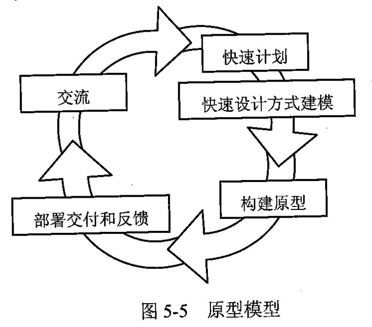

### :cactus:增量模型

#### :shell:增量模型

增量模型是软件开发中的一种开发方法，也称为增量开发。它是一种迭代式的开发方法，将软件系统划分成多个增量，每个增量分别开发、测试和部署，然后按顺序进行整合。每个增量都是一个完整的软件系统的一部分，具有一定的功能和价值。

#### :shell:增量模型的特点

1. 增量划分：将软件系统分为多个增量，每个增量都有独立的功能和价值。
2. 迭代开发：各个增量按照顺序进行开发、测试和部署，每个增量都是前一个增量的基础。
3. 重复循环：每个增量都经历开发、测试和部署的循环，直到整个软件系统完成。
4. 增量交付：每个增量都能够交付给用户使用，用户可以在每个增量的基础上进行反馈和指导。

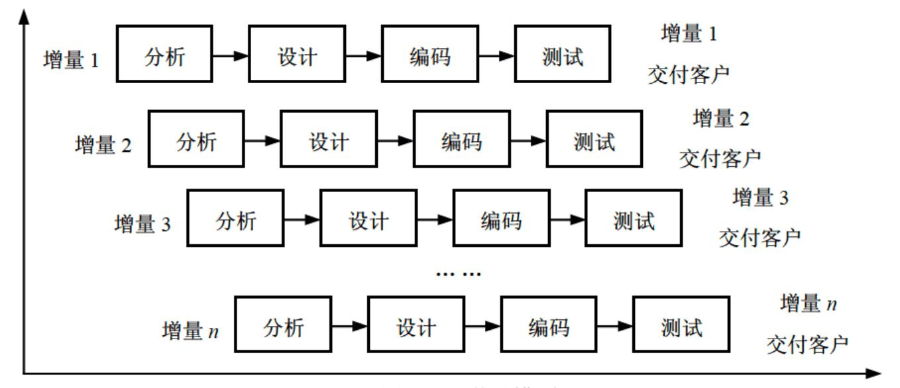

#### :shell:增量模型的优缺点

增量模型的优点包括：

1. 提高反馈效率：每个增量都可以及时交付给用户使用，用户可以提供实际的反馈和指导，有助于及时纠正和改进。
2. 降低风险：由于每个增量都是独立的，因此在开发过程中发现的问题不会对整个系统造成重大影响。
3. 提高可维护性：每个增量都有独立的设计和文档，方便后续的维护和升级操作。

增量模型的缺点包括：

1. 需要额外的成本和时间：由于需要迭代开发和多次测试，增量模型需要额外的成本和时间来进行。
2. 需要用户的积极参与：增量模型需要用户的积极参与，包括对每个增量的评估和反馈，对某些项目来说，可能用户的参与程度较低。

### :cactus:演化模型-螺旋模型

#### :shell:螺旋模型

在螺旋模型中，软件开发过程被表示为一个螺旋形状的曲线，其沿着时间和成本两个维度进行演化。螺旋模型的基本思想是通过不断进行风险分析和迭代来逐步开发和改进软件系统。

螺旋模型的核心是不断循环的风险分析和迭代过程。在每个迭代中，开发团队会分析和评估当前系统的风险，然后制定相应的开发计划和策略。接下来，团队会根据计划进行开发和测试，并将结果反馈给用户。通过不断的迭代，系统逐渐完善和改进。

螺旋模型将瀑布模型和演化模型结合起来，强调了风险分析，特别适用于大型、复杂度高、风险高的系统。

#### :shell:螺旋模型的特点

螺旋模型将开发过程分为几个螺旋周期，具有周期性重复的螺旋线状，每个螺旋周期大致和瀑布模型相符合 。 每个螺旋周期分为如下4个工作步骤：制定计划、风险分析、实施工程和客户评估。

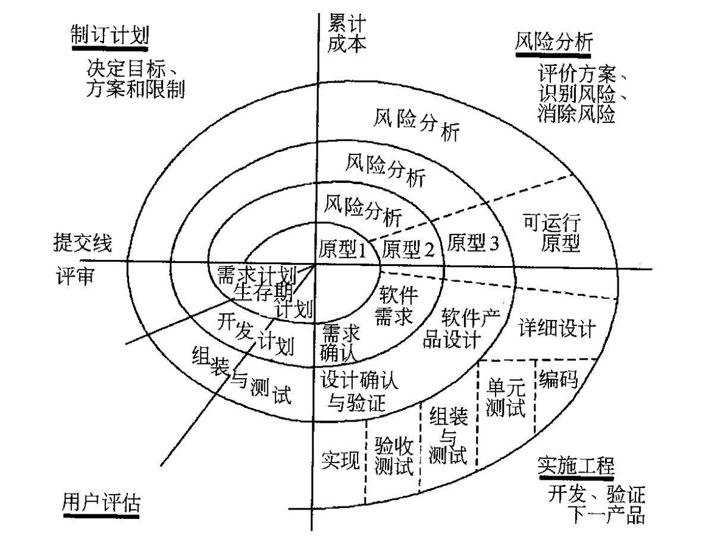

#### :shell:螺旋模型的优缺点

螺旋模型的优点：是可以根据项目的实际情况进行灵活调整，并且有助于及早发现和解决问题。它可以帮助开发团队在开发过程中不断学习和改进，从而提高整体的开发效率和质量。

螺旋模型的确定：首先，它需要较高的技术和管理能力，因为风险分析和迭代过程需要对项目进行全面的评估和规划。此外，螺旋模型通常用于大型和复杂的项目，对于小型项目可能过于繁琐。

### :cactus:喷泉模型

#### :shell:喷泉模型

喷泉模型是一种软件开发模型，它将用户需求作为主要动力，并以对象为驱动。它适用于面向对象的开发方法，并且具有迭代性和无间隙性。

在喷泉模型中，整个开发过程被视为一个喷泉，代表了用户需求的源泉。开发团队通过不断迭代和改进，将用户需求转化为最终的软件产品。

喷泉模型的开发过程是连续的，没有明确的阶段划分。开发团队不断进行需求分析、设计、编码和测试等活动，以不断改进软件的功能和质量。

#### :shell:喷泉模型的特点

- 喷泉模型的各个阶段没有明显的界线，开发人员可以同步进行。
- 其优点是可以提高软件项目的开发效率，节省开发时间。
- 由于喷泉模型在各个开发阶段是重叠的，在开发过程中需要大量的开发人员， 不利于项目的管理。此外，这种模型要求严格管理文档，使得审核的难度加大。

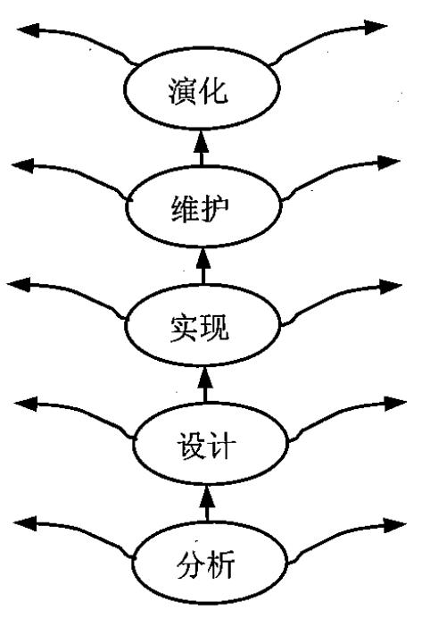

#### :shell:喷泉模型的优缺点

喷泉模型的优点：是能够及时响应用户需求的变化，保持开发过程的灵活性和敏捷性。与传统的瀑布模型相比，喷泉模型更加适合快速迭代和开发周期短的项目。

喷泉模型的缺点：由于没有明确的阶段划分，开发团队可能会在需求分析和设计阶段出现混乱，导致项目进展缓慢。此外，喷泉模型对开发团队的能力和协作要求较高，需要具备良好的沟通和协调能力。

### :cactus:基于构件的开发模型

#### :shell:基于构件的开发模型

基于构件的开发模型（Component-based Development Model）是一种软件开发方法，它将软件系统划分为独立的、可重用的构件，并通过构件之间的链接和组合来构建软件系统。

#### :shell:基于构件的开发模型的特点

基于构件的开发模型的主要特点包括：

1. 构件的独立性：构件是可以独立开发、测试和维护的，每个构件都具有明确定义的功能和接口。
2. 构件的可重用性：构件可以被多个软件系统所共享和重用，从而提高软件开发的效率和质量。
3. 构件的组合和链接：通过构件之间的链接和组合，可以灵活地构建符合需求的软件系统。
4. 构件的管理和维护：通过构件的管理和维护，可以实现对软件系统的快速更新和扩展。

特点是增强了复用性，在系统开发过程中，会构建一个构件库，供其他系统复用，因此可以提高可靠性，节省时间和成本。

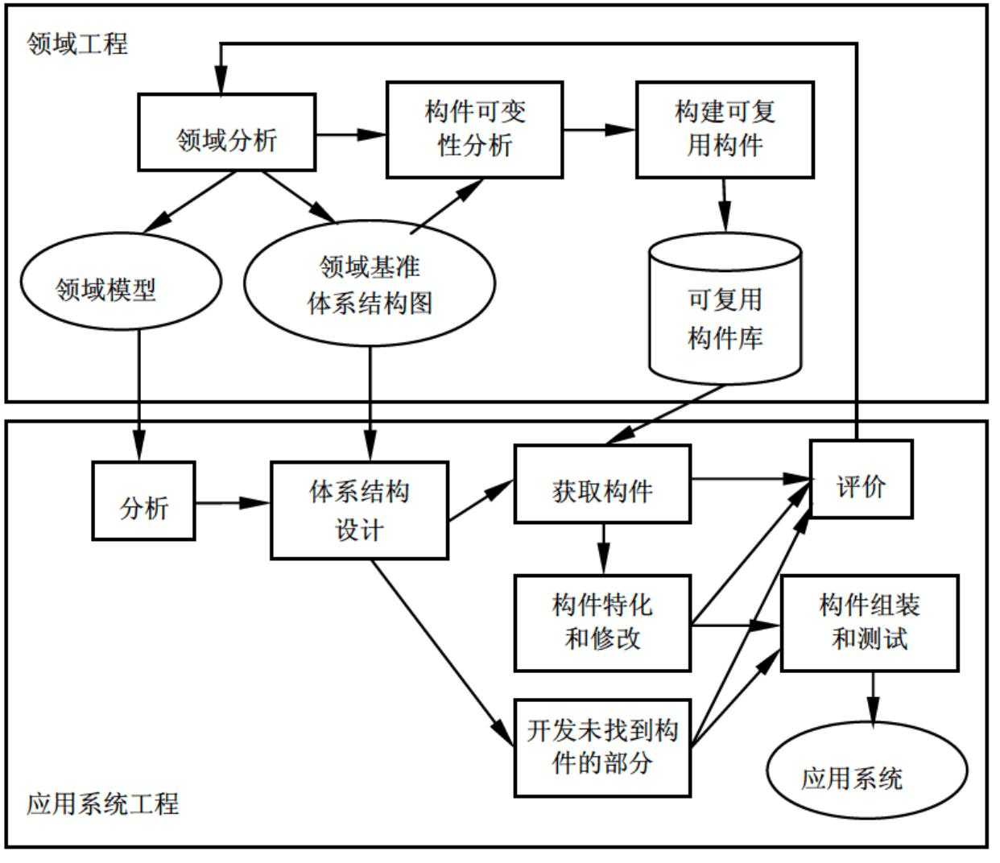

### :cactus:形式化方法模型

#### :shell:形式化方法模型

形式化方法模型的核心思想是使用形式化语言来描述系统的规范和要求。形式化语言通常是符号逻辑或数学语言，如集合论、谓词逻辑、时序逻辑等。通过将系统规范和要求转化为形式化语言的形式规范，开发人员可以使用形式化方法来进行系统分析、模型检查、定理证明等。

形式化方法模型可以有不同的形式，如有限状态自动机、Petri网、时序逻辑模型等。这些模型可以用于描述系统的结构、行为和性质。开发人员可以使用形式化方法模型进行系统建模、属性验证、错误检测等，以提高系统的可靠性和正确性。

#### :shell:形式化方法模型的优缺点

形式化方法模型具有形式化和精确性的优点，可以帮助开发人员在设计和开发过程中发现和解决潜在的问题。它还可以提供系统的形式证明，以确保系统的正确性和安全性。但是，形式化方法模型通常需要较高的技术水平和时间成本，因此在实际应用中可能有一定的限制。

### :cactus:统一过程模型

#### :shell:统一过程模型

统一过程（UP）模型是一种软件开发过程，**以用例和风险为驱动，以架构为中心，采用迭代和增量的方法**。UP模型通过将整个软件开发项目划分为多个小型项目，每个项目都包含计划、分析和设计、构造、集成和测试、内部和外部发布等阶段。

UP模型使用UML（统一建模语言）方法和工具来支持开发过程。UML是一种用于描述、构造、可视化和文档化软件系统的标准语言。它提供了一种统一的可视化表示方法，用于描述系统的需求、结构、行为和交互。

UP模型的核心理念是迭代和增量开发。迭代意味着将整个开发过程划分为多个迭代周期，每个周期都包含完整的开发阶段。每个迭代周期都会产生一个可执行的软件部分，可以进行测试和评审。增量指的是每个迭代周期都会向软件系统中添加新的功能，逐步增加系统的功能和性能。

UP模型的另一个重要特点是以用例和风险为驱动。用例是对系统功能和用户需求的描述，它们被用作需求分析和设计的基础。风险是可能对项目成功产生负面影响的因素，UP模型将风险识别和风险管理作为开发过程的重要组成部分。

#### :shell:统一过程模型的特点

统一过程模型包括4个阶段：初始阶段、精化阶段、构建阶段、移交阶段。

① 初始阶段：生命周期目标。

② 精化阶段：生命周期架构。

③ 构建阶段：初始运作功能。

④ 移交阶段：产品发布。

每次迭代产生包括最终系统的部分完成的版本和任何相关的项目文档的基线，通过逐步迭代基线之间相互构建，直到完成最终系统。在每个迭代中有5个核心工作流：捕获系统应该做什么的需求工作流，精化和结构化需求的分析工作流，在系统构架内实现需求的设计工作流， 构造软件的实现工作流，验证实现是否如期望那样工作的测试工作流。

#### :shell:RUP

RUP（Rational Unified Process）是一种软件开发过程框架，被认为是统一过程（UP）的商业扩展。它在UP的基础上进行了完善和详细化，为软件开发团队提供了一套全面的方法论和工具，以管理和实施软件项目的全生命周期。

RUP的特点包括：

1. 迭代开发：RUP将软件开发过程划分为多个迭代周期，每个周期包含一系列可交付成果，增量地构建系统。
2. 体系结构驱动：RUP强调对软件系统的体系结构进行设计和评审，确保系统的稳定性、可扩展性和可维护性。
3. 风险管理：RUP强调风险管理的重要性，通过早期风险评估和风险驱动的开发来最大限度地降低项目失败的风险。
4. 适应性：RUP可以根据不同的项目需求和特点进行定制，灵活适应各种规模和复杂度的软件开发项目。

RUP通过提供一系列指导文档、模板、工具和最佳实践，帮助开发团队规范和管理软件开发过程。它强调团队合作、迭代开发和[持续集成](https://cloud.tencent.com/product/coding-ci?from_column=20065&from=20065)，旨在提高开发效率、降低风险并交付高质量的软件产品。

### :cactus:敏捷方法

#### :shell:敏捷方法

敏捷方法（Agile methods）是一种项目管理和开发方法论，旨在通过迭代、协作和快速响应变化来提高团队的效率和灵活性。敏捷方法的核心原则包括：

1. 个体和互动胜过流程和工具：强调团队成员之间的沟通和合作，以及快速解决问题。
2. 可工作的软件胜过详尽的文档：重视开发出可用的软件，而不是花费过多时间编写详细的文档。
3. 客户合作胜过合同谈判：鼓励与客户保持密切合作和沟通，以便快速了解需求变化，并提供满足客户需求的解决方案。
4. 响应变化胜过遵循计划：接受需求变化，并灵活地调整开发计划和优先级，以应对市场变化和客户需求的变化。

敏捷方法通常采用迭代开发的方式，将项目划分为一系列短期的开发周期，每个周期称为一个迭代（Iteration），通常持续2-4周。每个迭代结束时，团队会交付一部分可用的软件功能，然后根据客户反馈和需求变化进行调整和优化。

敏捷过程的典型方法有很多，每一种方法基于一套原则，这些原则实现了敏捷方法所宣称的理念(敏捷宣言)：极限编程（XP）、水晶法（C r y s t a l）、并列争求法（Sc rum）、自适应软件开发（AS D）、敏捷统一过程（AUP）

#### :shell:敏捷方法的特点

敏捷开发是一种以人为核心、迭代、循序渐进的开发方法，相对于传统软件开发方法的“非敏捷”，更强调程序员团队与业务专家之间的紧密协作、面对面的沟通（认为比书面文档更有效）、频繁交付新的软件版本、紧凑而自我组织型的团队、能够很好地适应需求变化的代码编写和团队组织方法，也更注重软件开发中人的作用。

敏捷软件开发宣言：

- 个体和交互胜过过程和工具
- 可以工作的软件胜过面面俱到的文档
- 客户合作胜过合同谈判
- 响应变化胜过遵循计划

### :cactus:敏捷方法-极限编程

XP是一种轻量级（敏捷）、高效、低风险、柔性、可预测的、科学的软件开发方式。它由价值观、原则、实践和行为四个部分组成，彼此相互依赖、关联，并通过行为贯穿于整个生命周期。

4大价值观：沟通、简单性、反馈和勇气。

5个原则：快速反馈、简单性假设、逐步修改、提倡更改和优质工作。

12个最佳实践：

1. 计划游戏：快速制定计划、随着细节的不断变化而完善。
2. 小型发布：系统的设计要能够尽可能早地交付。
3. 隐喻：找到合适的比喻传达信息。
4. 简单设计：只处理当前的需求，使设计保持简单。
5. 测试先行：先写测试代码，然后再编写程序。
6. 重构：重新审视需求和设计，重新明确地描述它们以符合新的和现有的需求。
7. 结对编程。
8. 集体代码所有制。
9. 持续集成：可以按日甚至按小时为客户提供可运行的版本。
10. 每周工作40个小时。
11. 现场客户。
12. 编码标准。

### :cactus:敏捷方法-其他方法

| 实践       | 描述                                                         |
| :--------- | :----------------------------------------------------------- |
| 结对编程   | 一个程序员开发，另一个程序员在一旁观察审查代码，提高代码质量 |
| 自适应开发 | 强调开发方法的适应性，为软件的重要性提供基础，适应组织和管理层次 |
| 水晶方法   | 不同项目需要不同的策略、约定和方法论                         |
| SCRUM      | 迭代的增量化工程方法，按需求的优先级别实现产品               |

### :cactus:总结

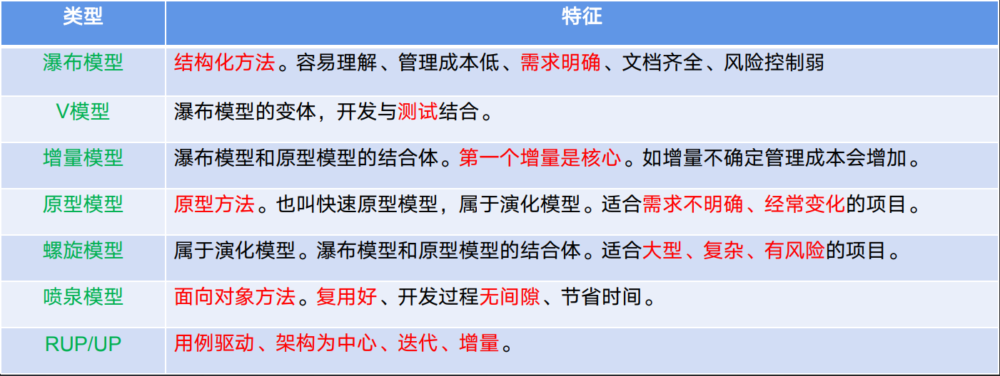

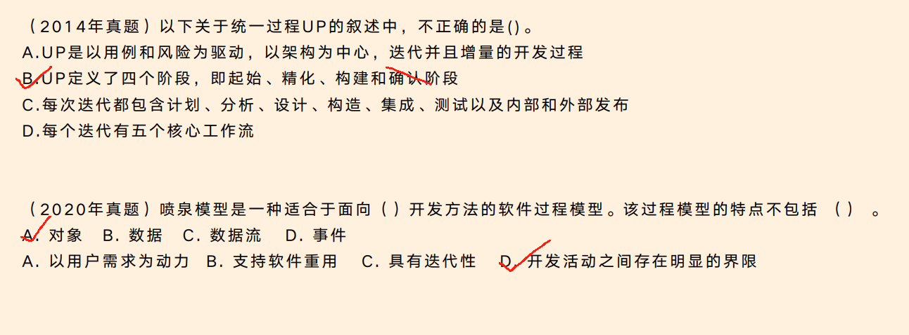

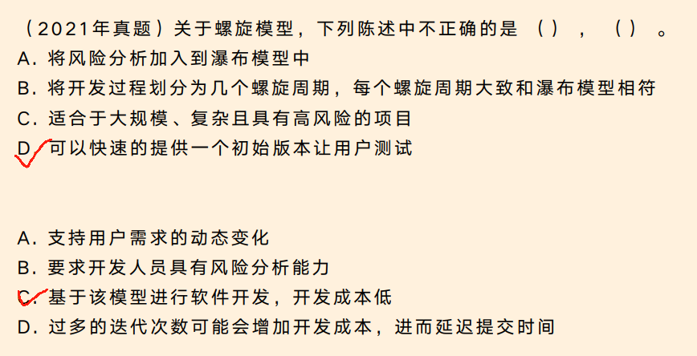

## 三、需求分析

软件工程需求分析是软件开发过程中的重要环节之一，它主要是通过收集、分析和规范用户的需求，为软件开发团队提供明确的需求指导，确保软件开发的目标和方向与用户需求一致。

在软件工程需求分析过程中，一般包括以下几个主要步骤：

1. 需求收集：通过与用户沟通、访谈、调查等方式，收集用户对软件的需求和期望。收集的需求可以包括功能需求、性能需求、安全需求等。
2. 需求分析：对收集到的需求进行分析和整理，将其转化为可操作的需求规范。需求分析一般包括需求描述、需求分类、需求优先级确定等步骤。
3. 需求验证：验证需求是否符合用户的实际需求，通常包括需求审查、原型验证、用户测试等方式。通过需求验证，可以发现和纠正需求规格中的问题，确保需求的准确性和完整性。
4. 需求管理：管理和维护需求规格，包括需求变更管理、需求跟踪管理、需求优先级调整等。在软件开发过程中，需求可能会随着时间和用户需求变化而发生变更，需求管理可以帮助开发团队及时响应和处理需求变更。

需求分析是软件开发过程中的关键环节，它对于软件开发的成功与否起着至关重要的作用。只有通过需求分析，开发团队才能了解用户的真实需求，设计出符合用户期望的软件系统。

### :cactus:软件需求

#### :shell:定义

软件需求是指用户或相关利益相关方对软件系统所提出的期望或要求。它涵盖了系统的`功能、行为、性能、设计约束`等方面。

- `功能需求`描述了系统应该具有的功能和特性。这些功能需求可以是用户期望的基本功能，也可以是系统必须具有的关键功能。
- `行为需求`描述了系统在不同情况下的行为和响应。这些行为需求可以包括用户界面的交互过程、数据处理过程、错误处理过程等。
- `性能需求`描述了系统在处理各种输入情况下的性能要求。这些性能需求可以包括系统的响应时间、吞吐量、可靠性等。
- `设计约束`描述了系统设计和实现时需要遵循的约束条件。这些约束条件可以包括操作系统和硬件平台的要求、技术限制、安全需求等。

IEEE中的定义是：软件需求指用户解决问题或达到目标所需要的条件或能力，是系统或系统部件要满足合同、标准、规范或其他正式规定文档所需具有的条件或能力，以及反映这些条件或能力的文档说明。

#### :shell:需求来源

- 可以来自于用户（实际的潜在的）、用户的规约、应用领域的专家、相关的技术标准和法规。
- 可以来自于原有的系统、原有系统的用户、新系统的潜在用户。
- 甚至还可以来自于竞争对手的产品。🦋1.3 需求分类

软件需求的分类：软件需求就是软件必须完成的事以及必须具备的品质。需求是多层次的，包括业务需求、用户需求和系统需求，这三者是从目标到具体，从整体到局部，从概念到细节。

| 需求分类      | 描述                                                         |
| :------------ | :----------------------------------------------------------- |
| 业务需求      | 反映企业或客户对系统高层级的目标要求（高层级需求）           |
| 用户需求      | 描述用户的具体目标，用户想要什么，以及要这些做什么（用户需求） |
| 系统需求      | 从系统的角度说明软件的需求，包括功能需求、非功能需求、设计约束等 |
| -- 功能需求   | 系统必须完成的那些事，即为了向其用户提供有用的功能，产品必须执行的动作 |
| -- 非功能需求 | 产品必须具备的性能或品质，例如，可靠性、容错性等             |
| -- 设计约束   | 也称为限制条件、补充规约，通常是对解决方案的一些约束说明，例如，某系统必须采用国有自主知识版权的数据库，必须运行在UNIX系统之下，等等 |

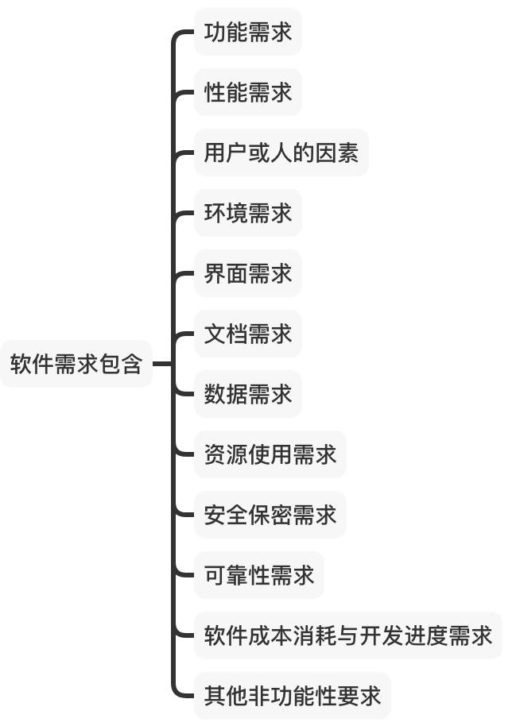

质量功能部署（QFD）是一种技术，旨在将用户要求转化为软件需求，以最大限度提高用户满意度。它通过多层次的演绎分析，将用户对产品的需求转化为产品设计需求、工程部件特征、工艺要求和生产要求，以指导产品设计和保证产品质量。由于QFD使用的图形类似于房屋，因此也被称为"质量屋"。

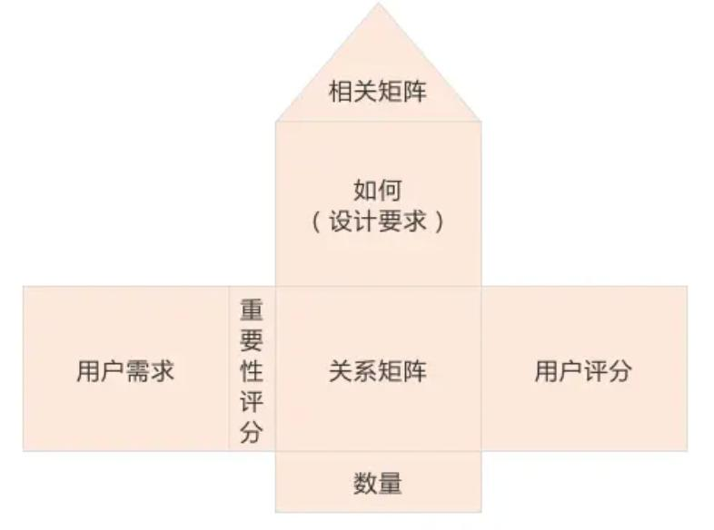

QDF将软件需求分为三类：

| 软件需求分类 | 描述                                                         |
| :----------- | :----------------------------------------------------------- |
| 常规需求     | 系统应该做到的功能或性能，实现的越多，用户越满意             |
| 期望需求     | 用户想当然认为系统应该做到，但是不能正确表达的功能，没有实现会让用户不满意 |
| 意外需求     | 用户要求范围外的功能或性能，开发人员控制，实现会高兴，不实现也没关系 |

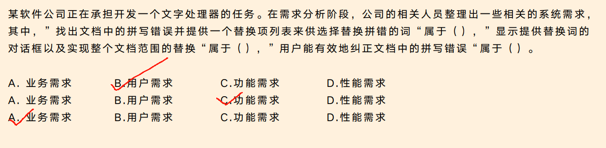

### :cactus:需求工程

需求工程：是一个不断反复的需求定义、文档记录、需求演进的过程，并最终在验证的基础上冻结需求。需求工程可以细分为需求获取、需求分析（包括系统建模）、需求规约、需求验证以及需求管理5个阶段。

- 需求开发：包括需求获取、需求分析、编写规约（系统规格说明书）和需求验证4个阶段。
- 需求管理：通常包括定义需求基线、处理需求变更及需求跟踪等方面的工作。

需求开发的4个阶段：

在需求开发阶段需要确定产品所期望的用户类型、获取每种用户类型的需求、了解实际的用户任务和目标，以及这些任务所支持的业务需求。

同时还包括分析源于用户的信息、对需求进行优先级分类、将所收集的需求编写成为软件规格说明书和需求分析模型，以及对需求进行评审等工作。

#### :shell:需求获取

需求获取是一个确定和理解不同项目干系人的需求和约束的过程。在需求获取的过程中，主要解决需求调查的问题。为了做好需求调查，必须清楚地了解以下三个问题：

1. What：应该搜集什么信息。 需要明确搜集的信息内容，包括功能需求、性能需求、用户体验需求、安全需求等。
2. Where：从什么地方搜集这些信息。 需要确定搜集信息的来源，可以通过用户访谈、[问卷调查](https://cloud.tencent.com/product/survey?from_column=20065&from=20065)、采样、情节串联板、联合需求计划等方式来获取需求信息。
3. How：用什么机制或技术来搜集这些信息。 需要选择合适的机制或技术来进行需求获取，例如使用结构化和非结构化的用户访谈，设计用户调查问卷，采用统计分析技术进行采样，使用情节串联板来讲述故事，以及通过联合讨论会来组织会议等。需求记录技术，如任务卡片、场景说明、用户故事等，也可以用来搜集需求信息。

常见的需求获取方式有：

| 需求获取方式 | 描述                                                         |
| :----------- | :----------------------------------------------------------- |
| 用户访谈     | 一对一进行访谈，适合于针对有代表性的用户。形式分为结构化和非结构化两种。 |
| 问卷调查     | 设计问题、制作成用户调查问卷、下发填写、整理分析。适合用户面广、用户需要灵活时间进行回馈。 |
| 采样         | 采用统计分析技术，从目标总体中选择出样本集的过程。可以是随机抽样，也可以是非随机抽样。适合用于大量用户信息或者数据信息采集分析，最终得出需求的场景。 |
| 情节串联板   | 一系列图片，通过这些图片来讲述故事，从而帮助理解用户需求和场景。 |
| 联合讨论会   | 通过联合关键用户代表、系统分析师、开发团队代表等进行组织的会议，讨论需求，以促进有效的交流和共识形成。 |
| 需求记录技术 | 使用任务卡片、场景说明、用户故事等方式来记录和描述用户需求，以便后续分析和编写需求规格书。 |

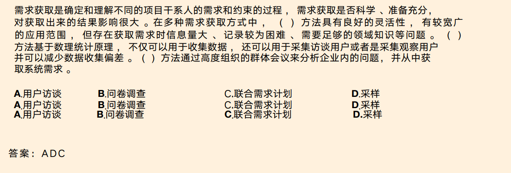

#### :shell:需求分析

##### ☀️2.2.1 需求分析定义

需求分析是将用户的杂乱无章的要求和期望转化为清晰、准确、可测试、可跟踪的系统需求，并形成最终的需求规约。一个好的需求应具有无二义性、完整性、一致性、可测试性、确定性、可跟踪性、正确性和必要性等特性。

在需求分析过程中，需求分析人员逐步细化软件功能，找出系统各元素之间的联系、接口特性和设计上的限制，并分析它们是否满足需求。不合理的部分被剔除，需要的部分被增加。最终，综合成系统的解决方案，并给出详细的逻辑模型，描述系统的功能和实现方式。

##### ☀️2.2.2 需求分析任务

需求分析的任务包括：

- 绘制系统上下文范围关系图，以帮助理解系统的范围和边界。
- 创建用户界面原型，用于展示系统的外观和交互方式，以便用户和开发团队进行讨论和确认。
- 分析需求的可行性，评估各项需求在技术、资源和时间等方面的可行性和可实现性。
- 确定需求的优先级，将各个需求进行排序，以确保关键需求得到优先满足。
- 为需求建立模型，使用各种符号和图形来描述需求，以便更好地理解和传达需求信息。
- 创建数据字典，对系统中使用的数据进行定义和描述，确保数据的一致性和准确性。
- 使用QFD（质量功能部署），将用户需求与系统设计和开发过程相连接，以确保系统能够满足用户的期望和需求。

##### ☀️2.2.3 需求分析方法

目前，已存在的多种需求分析方法引用了不同的分析策略，常用的分析方法有以下两种：

- 面向数据流的结构化分析方法 (SA)。
- 面向对象的分析方法 (OOA)。

###### 🌈2.2.3.1 面向数据流的结构化分析方法

结构化分析方法的特点是：自顶向下、逐步分解、分析的核心是数据字典。

结构化分析应该建立三种模型：数据模型、功能模型、行为模型：

| 模型类型 | 描述                                                   | 常用图示        |
| :------- | :----------------------------------------------------- | :-------------- |
| 数据模型 | 描述实体、属性和实体间的关系                           | 实体关系(E-R)图 |
| 功能模型 | 描述数据在系统间的传递情况                             | 数据流图(DFD)   |
| 行为模型 | 描述系统状态和状态转换的事件，指出系统行为和执行的动作 | 状态转换图(STD) |

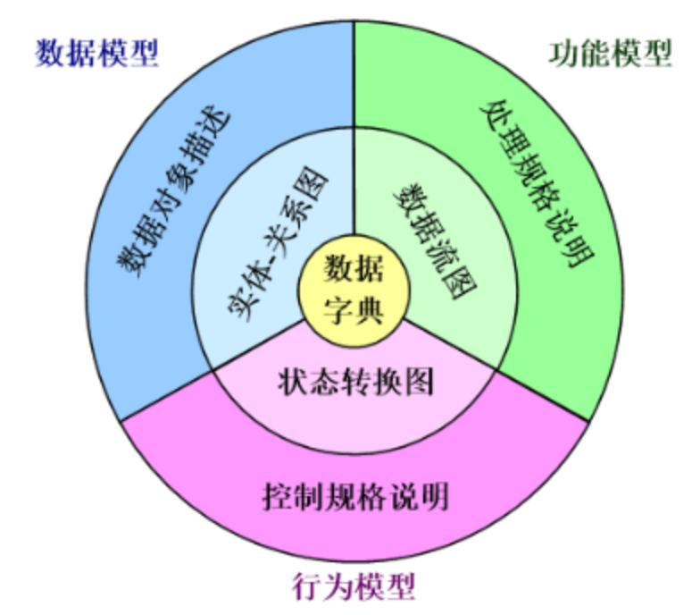

###### 🍬2.2.3.1.1 状态转换图(STD)

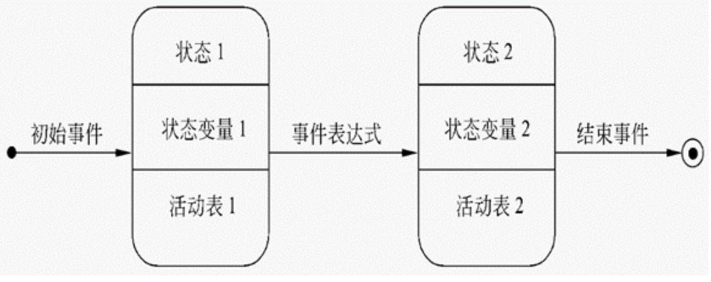

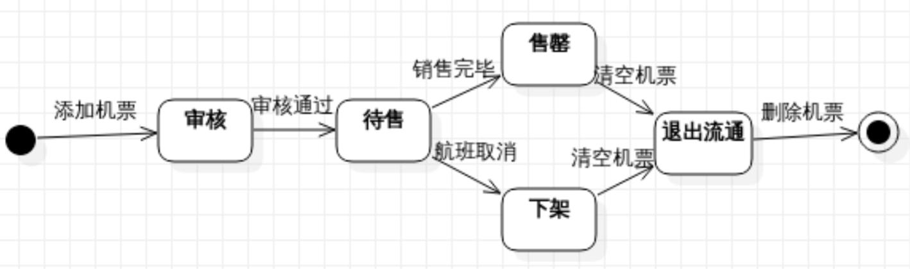

###### 🍬2.2.3.1.2 数据流图(DFD)

描述数据在系统中如何被传送或变换，以及如何对数据流进行变换的功能或子功能，用于对功能建模，数据流图相关概念示例如下：

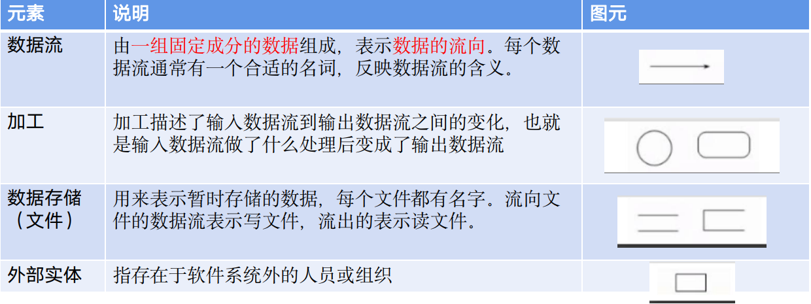

数据图是一种可以分层的图表，根据层级可以分为顶层数据流图、中层数据流图和底层数据流图。顶层数据流图是最高层的图表，其他数据流图从零开始编号。

| 数据流图级别 | 描述                                                         |
| :----------- | :----------------------------------------------------------- |
| 顶层数据流图 | 只有一个加工，代表整个系统。包括输入数据流和输出数据流，表示系统的范围和与外部环境的数据交换关系。 |
| 中层数据流图 | 对顶层数据流图中的某个加工进行细化，可以再次细化形成子图。中间层次的多少取决于系统的复杂程度。 |
| 底层数据流图 | 不能再分解的数据流图，其加工称为"原子加工"。                 |

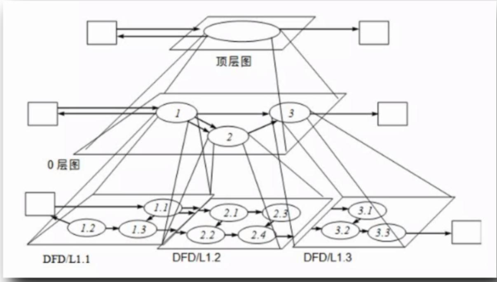

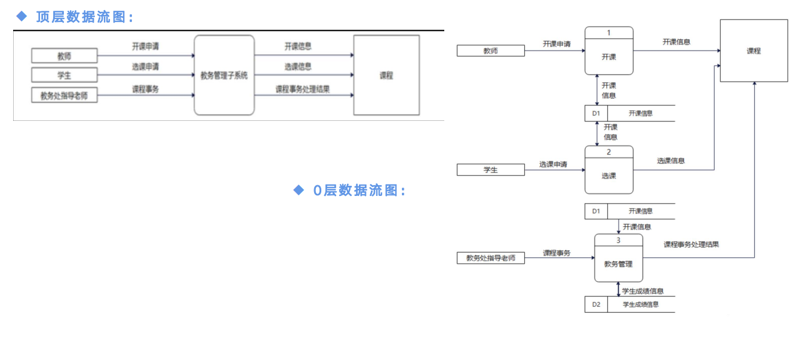

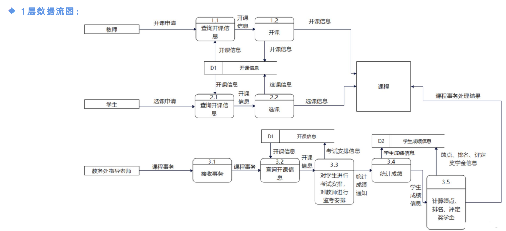

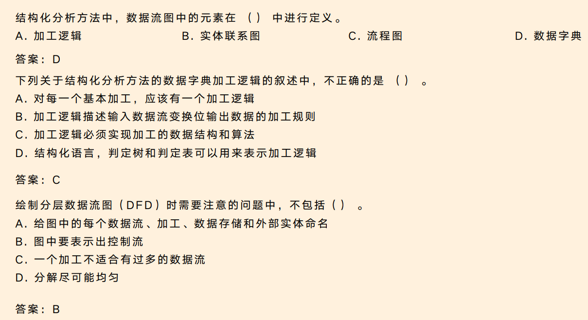

#### :shell:需求规约

##### ☀️2.3.1 需求规约定义

软件需求规约（SRS）是需求分析任务的最终产物，也被称为需求定义或软件需求规格说明书。它通过建立完整的信息描述、详细的功能和行为描述、性能需求和设计约束的说明，以及合适的验收标准，来提供对目标软件的各种需求。作为用户和开发者之间的一个协议，需求规约在软件工程的各个阶段发挥重要作用。

##### ☀️2.3.2 需求规约内容

| 内容     | 描述                                                         |
| :------- | :----------------------------------------------------------- |
| 引言     | 描述软件目标，以计算机系统为背景进行阐述                     |
| 信息描述 | 描述问题的详细说明、信息内容、信息流和信息结构               |
| 功能描述 | 为每个功能提供处理过程说明，描述设计约束和性能特征，使用图形表示软件的整体结构和与其他系统元素的相互影响 |
| 行为描述 | 描述软件操作的外部事件和内部控制特征                         |
| 校验标准 | 描述系统成功的测试标准，即哪些测试和结果表示系统已成功实现   |
| 参考书目 | 引用与软件相关的文档，包括其他软件工程文档、技术参考文献、厂商文献和标准 |
| 附录     | 包含补充信息、表格数据、算法描述、图表和其他资料等           |

##### ☀️2.3.3 需求规约方法

1. 严格定义（又称预先定义）是需求建立在以下基础假设之上：所有需求都能被预先定义；开发人员与用户能准确交流；采用图形（或文字）充分体现最终系统。
2. 原型方法是一种迭代循环的开发方式，但需注意并非所有需求都能在系统开发前准确说明。原型提供了克服交流困难的手段，需要实际可供用户参与的系统模型和合适的系统开发环境。反复是完全需要和值得提倡的，一旦需求确定，就应遵从严格的方法。🦋2.4 需求验证☀️2.4.1 需求验证定义

需求验证，也称为需求确认，旨在与用户一起确认需求的准确性。这个过程包括两个步骤：需求评审和需求测试。需求评审是对需求规约进行正式或非正式的评审。需求测试则是设计概念测试用例来验证需求。

需求验证作为需求开发阶段的一项工作，旨在复查需求的正确性、完整性和清晰性，以确保它能够准确反映用户的意愿。由于需求的变化可能会导致系统设计和实现的变更，因此，由需求引起的系统变更成本往往比修改设计或代码错误的成本要高得多。为了确保软件需求定义的质量，评审应由专门的人员负责，并按照规程严格进行。除了分析人员外，还应有用户、开发部门的管理者以及软件设计、实现和测试人员参加评审。

需求验证通过后，需要请用户签字确认，作为验收标准之一。此时，需求规格说明书作为需求基线，不可再随意更新。如果需要更改，必须按需求变更流程进行。需要注意的是，需求验证无法发现所有的需求问题。因此，在需求验证之后，无法避免地会对遗漏的需求进行补充，对错误理解进行更正，需求管理是必要的。

##### ☀️2.4.2 需求验证内容

1. 确保系统定义的目标与用户的要求一致。
2. 检查系统需求分析阶段提供的文档资料是否齐全，以及文档中的描述是否完整、清晰、准确地反映了用户要求。
3. 确认被开发项目的数据流与数据结构是否确定且充足。
4. 检查主要功能是否已包括在规定的软件范围之内，并且是否都已充分说明。
5. 确认设计的约束条件或限制条件是否符合实际。
6. 评估开发的技术风险。
7. 确保详细制定了检验标准，并且这些标准能够对系统定义进行确认。

#### :shell:需求管理

##### ☀️2.5.1 需求管理定义

软件需求管理是指在软件项目进行过程中，通过一系列的活动来识别、控制和跟踪需求。它涉及需求工程的规划和控制，以获取、组织和记录系统需求，并使用户和项目团队在不断变更的需求上达成一致。需求管理是确保软件开发过程中需求的正确性、一致性和有效性的关键过程。它帮助项目团队确定和理解用户需求，并在开发过程中追踪和管理这些需求的变化。

在需求管理中，每个需求被赋予唯一的标识符，这种需求的唯一标识符通常被称为需求ID，它可以是一个数字、字母或组合的代码。通过为需求建立跟踪表，可以清楚地记录需求与其他相关文档或代码的关系，方便跟踪和管理需求的变更和演化过程。

特征跟踪表：

| 需求ID | 特征1 | 特征2 | 特征3 | ...  |
| :----- | :---- | :---- | :---- | :--- |
| REQ001 | 是    | 否    | 是    | ...  |
| REQ002 | 否    | 是    | 否    | ...  |
| REQ003 | 是    | 是    | 是    | ...  |
| ...    | ...   | ...   | ...   | ...  |

来源跟踪表：

| 需求ID | 来源1    | 来源2    | 来源3    | ...  |
| :----- | :------- | :------- | :------- | :--- |
| REQ001 | 用户反馈 | 业务需求 | ...      | ...  |
| REQ002 | 业务需求 | ...      | ...      | ...  |
| REQ003 | 用户反馈 | 业务需求 | 用户调研 | ...  |
| ...    | ...      | ...      | ...      | ...  |

依赖跟踪表：

| 需求ID | 依赖需求1 | 依赖需求2 | 依赖需求3 | ...  |
| :----- | :-------- | :-------- | :-------- | :--- |
| REQ001 | REQ002    | REQ003    | ...       | ...  |
| REQ002 | REQ004    | ...       | ...       | ...  |
| REQ003 | REQ002    | REQ005    | ...       | ...  |
| ...    | ...       | ...       | ...       | ...  |

跟踪表可以包含以下信息：

1. 需求ID：每个需求的唯一标识符。
2. 需求描述：对需求的详细描述。
3. 需求状态：需求的当前状态，如提出、评审中、已实现等。
4. 需求优先级：需求的优先级，用于确定开发和测试的顺序。
5. 需求来源：需求的来源，如业务需求、用户反馈等。
6. 需求关系：需求与其他需求或文档的关系，可以是包含关系、依赖关系等。
7. 需求变更历史：需求的变更记录，包括变更原因、变更内容和变更日期等。

这些跟踪表可以用于需求跟踪。在整个开发过程中，进行需求跟踪的目的是为了建立和维护从用户需求开始到测试之间的一致性与完整性，确保所有的实现是以用户需求为基础，所有的输出符合用户需求，并且全面覆盖了用户需求。

##### ☀️2.5.2 版本控制

是的，版本控制在需求管理中起到非常重要的作用。通过版本控制，可以确保团队和用户之间对需求的共识，并定义需求的基线。一旦需求规约经过评审并形成了需求基线，下次如果有需求变更，则需要按照一定的流程进行处理。

版本控制可以通过以下步骤来进行：

1. 需求规约评审：一旦完成了需求规约的编写，团队需要进行评审，确保需求规约的准确性和完整性。只有通过了评审的需求规约才能被视为需求基线。
2. 变更请求：如果有任何需求变更的请求，用户或团队可以提交变更请求。变更请求应该包含详细的变更描述和原因。
3. 变更评估：变更请求被接收后，团队需要对变更进行评估。评估包括分析变更的影响范围、资源需求、时间计划等。
4. 变更批准：根据变更评估结果，团队确定是否批准变更请求。如果批准，团队将进行相应的变更实施。
5. 变更实施：团队根据批准的变更请求进行相应的变更实施，更新需求规约或其他相关文档。

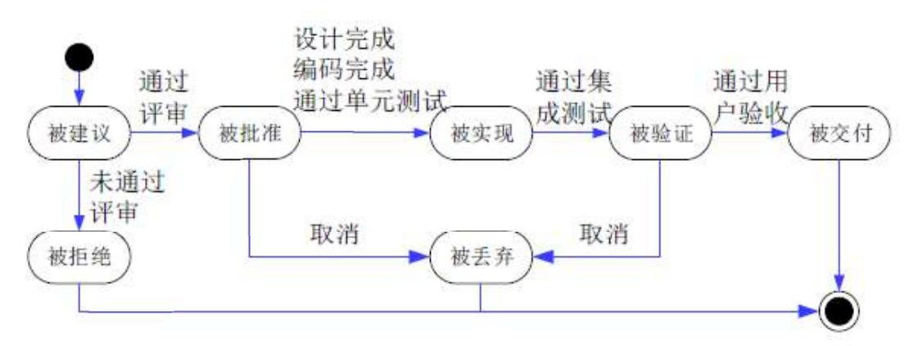

##### ☀️2.5.3 需求跟踪

1、 需求跟踪

需求跟踪是确保软件开发过程中满足用户需求的一种方法。正向跟踪和逆向跟踪是两种常用的需求跟踪方式。

正向跟踪是从用户需求出发，通过检查需求规约中的每个需求是否在后继工作产品中找到对应点来进行跟踪。简单来说，就是核对用户原始需求是否都已实现。

逆向跟踪则是从工作产品出发，检查设计文档、代码、测试用例等产品是否能在需求规约中找到对应的来源。简单来说，就是检查软件实现是否符合用户需求。

2、状态跟踪

整个项目过程中，要始终跟踪需求状态即变更情况

##### ☀️2.5.4 变更控制

###### 🌈2.5.4.1 变更控制的风险

变更控制是[项目管理](https://cloud.tencent.com/product/coding-pm?from_column=20065&from=20065)中关键的一环，其主要目标是管理需求的变更，确保变更的合理性和有效性。在需求变更过程中，存在一些潜在的风险，需要进行风险管理。

以下是一些带有风险的做法：

| 风险因素           | 描述                                                         |
| :----------------- | :----------------------------------------------------------- |
| 无足够用户参与     | 如果项目团队缺乏与最终用户的充分沟通和合作，可能导致对用户需求的误解和遗漏，最终影响项目的成功。 |
| 忽略用户分类       | 不同用户群体有不同的需求和优先级，忽略了用户分类可能导致无法满足某些重要用户群体的需求，降低项目价值。 |
| 用户需求的不断增加 | 如果在项目进行过程中，不断有新的需求被提出并接受，可能导致项目进度延迟和成本增加。 |
| 模棱两可的需求     | 如果需求描述模糊不清或存在歧义，可能导致开发过程中产生错误理解，最终交付的产品不符合预期。 |
| 不必要的特性       | 如果项目团队在需求变更过程中不加以筛选和评估，可能导致添加不必要的特性，增加开发成本和复杂性。 |
| 过于精简的SRS      | 如果需求文档(SRS)过于简单和不完整，可能导致对需求的理解不准确或遗漏，影响项目的规划和实施。 |
| 不准确的估算       | 如果在需求变更过程中对成本、时间和资源的估算不准确，可能导致项目延期、超支和资源不足。 |

###### 🌈2.5.4.2 变更控制的原因

| 变更原因           | 描述                                                         |
| :----------------- | :----------------------------------------------------------- |
| 外部环境的变化     | 市场需求的变化、竞争对手的新产品推出、法规政策的调整等，都可能导致业务流程和需求发生变化，从而需要进行变更。 |
| 需求和设计不够完整 | 在项目开始阶段，需求和设计可能未能考虑到所有情况，或者在实施过程中发现了一些问题，需要进行相应的调整和变更。 |
| 新技术的出现       | 随着科技的不断发展，新的技术可能提供了更好的解决方案，或者能够提高效率和质量，因此需要对原有系统进行升级或变更。 |
| 公司机构重组       | 公司的组织结构发生调整，业务流程可能会有所变化，需要调整相应的系统和流程来适应新的组织架构。 |

###### 🌈2.5.4.3 变更控制委员会

变更控制委员会（Change Control Board, CCB）是一个负责评价、审批和监督变更的组织机构。它也被称为配置控制委员会。CCB通常由项目经理、技术专家、利益相关者和其他相关人员组成。它的任务包括：

| CCB职责          | 描述                                                         |
| :--------------- | :----------------------------------------------------------- |
| 评价变更建议     | CCB会对提出的配置项变更建议进行评估，包括对其目的、范围、影响和风险等方面进行分析和评估。 |
| 审批变更请求     | CCB对变更请求进行审批，决定是否将其纳入项目的变更控制流程中。审批过程可能包括讨论、投票和达成共识。 |
| 监督已批准的变更 | 一旦变更请求得到批准，CCB负责监督变更的实施过程，确保按照批准的计划和要求进行变更。 |
| 跟踪和报告变更   | CCB跟踪所有已批准的变更，并定期向相关人员报告变更的状态和结果。 |
| 风险管理         | CCB也需要评估变更可能带来的风险，并提出相应的控制措施，以最大程度地减少对项目的负面影响。 |

###### 🌈2.5.4.4 变更控制的内容

- 需求变更需要经过正式评估来决定是否批准：变更控制的核心是确保对需求变更进行评估和决策，以避免不必要的变更带来的影响和风险。在变更控制过程中，需求变更将经过严格的评估，包括对变更的必要性、影响和可行性进行分析和讨论，以决定是否批准变更。
- 保持项目计划与需求的同步：变更控制的一个重要目标是确保项目计划与需求的一致性和同步。当需求发生变更时，需要及时修改项目计划，并确保所有相关方了解和同意这些变更。这有助于确保项目在变更发生时能够及时做出相应的调整，以保证项目的进度和质量。
- 以可控制的方式将需求变更融入项目中：变更控制的另一个重要目标是确保需求变更能够被有效地管理和融入项目中。这包括定义变更的优先级和紧迫性，制定变更实施计划，确保变更的可控性和可追踪性，以及对变更进行适当的测试和验证。
- 估计变更需求产生的影响，并协商新的约定：在变更控制过程中，需要对变更需求产生的影响进行估计，并与相关方进行协商，制定新的约定和规划。这包括对项目进度、成本、资源和风险等方面的影响进行评估，以及与相关方就变更的实施和后续工作进行协商和达成一致。这有助于确保变更的顺利实施，并最大程度地减少变更造成的不利影响。

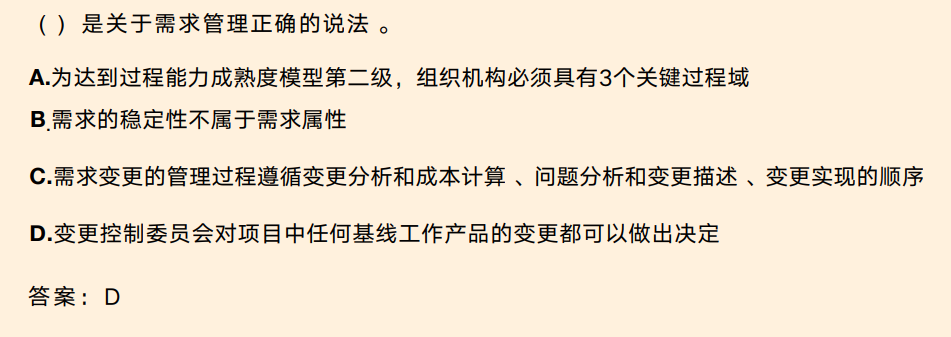


## 四、系统设计

软件工程中的系统设计是指在需求分析的基础上，对软件系统进行整体架构和各个模块的设计。系统设计的目标是将需求转化为具体的实现方案，明确软件的结构和功能，并考虑系统的可维护性、可扩展性、可重用性等方面的要求。

系统设计包括以下几个主要阶段：

| 阶段         | 描述                                                         | 常用方法               |
| :----------- | :----------------------------------------------------------- | :--------------------- |
| 系统结构设计 | 确定软件系统的整体结构，包括模块之间的关系、数据的流动等。   | 层次结构设计、模块划分 |
| 模块设计     | 对每个模块进行详细设计，包括模块的功能、接口、数据结构等。   | 模块图、数据流图       |
| 数据设计     | 对系统中涉及到的数据进行设计，包括数据的存储结构、数据库设计等。 | 数据流图、实体关系图   |
| 接口设计     | 设计模块之间的接口，明确各模块之间的通信方式和数据传递方式。 |                        |
| 安全性设计   | 考虑系统的安全性需求，包括用户认证、数据加密等。             |                        |
| 可维护性设计 | 考虑系统的可维护性需求，包括代码的可读性、可测试性等。       |                        |
| 性能设计     | 考虑系统的性能要求，包括响应时间、吞吐量等。                 |                        |

系统设计需要综合考虑多个因素，包括功能需求、可行性、技术可行性、资源约束等。在设计过程中，需要与需求分析、系统测试、实施等其他阶段进行紧密的沟通和协作，确保设计的准确性和可行性。


### :cactus:概述

#### :shell:主要目的

系统设计的主要目的就是为系统制定蓝图，在各种技术和实施方法中权衡利弊，精心设计，合理地使用各种资源，最终勾画出新系统的详细设计方案。

#### :shell:主要内容

系统设计的主要内容包括新系统总体结构设计、代码设计、输出设计、输入设计、处理过程设计、数据存储设计、用户界面设计和安全控制设计等。

| 设计内容           | 描述                                                         |
| :----------------- | :----------------------------------------------------------- |
| 新系统总体结构设计 | 确定系统的整体结构，包括模块之间的关系、数据流程、功能划分等，以确保系统的合理性和可扩展性。 |
| 代码设计           | 设计系统的具体实现方式，包括选择适当的编程语言和技术框架，定义类、函数、方法等的结构和功能，以实现系统的各项功能和业务需求。 |
| 输出设计           | 设计系统生成的各种输出，如报表、文件、图像等，以满足用户的需求和展示信息的可读性和易用性。 |
| 输入设计           | 设计系统接受的各种输入方式，如用户界面输入、文件导入等，以确保用户能够方便地输入所需的数据和信息。 |
| 处理过程设计       | 设计系统的处理逻辑和流程，包括数据处理、计算、判断、决策等，以实现系统的各项功能和业务逻辑。 |
| 数据存储设计       | 设计系统的数据存储方式和结构，包括数据库设计、文件存储等，以确保数据的安全性、完整性和可访问性。 |
| 用户界面设计       | 设计系统的用户界面，包括界面的布局、颜色、字体、图标等，以提供良好的用户体验和易用性。 |
| 安全控制设计       | 设计系统的安全机制和控制策略，包括用户认证、权限管理、数据加密等，以保护系统和用户的数据安全。 |

#### :shell:设计方法

| 系统设计方法                    | 描述                                                         |
| :------------------------------ | :----------------------------------------------------------- |
| 面向数据流的结构化设计方法 (SD) | 该方法侧重于系统的数据流动和转换过程，通过分析系统的输入、处理和输出，将系统划分为不同的模块，以实现功能的分解和模块的协作。这种方法注重系统的逻辑结构和数据流程，以达到系统可维护、可测试和可扩展的设计目标。 |
| 面向对象的设计方法 (OOD)        | 该方法以对象为中心，将系统的功能和数据封装成对象，并定义对象之间的关系和交互方式。通过面向对象的思维方式，可以更好地实现系统的模块化和重用性，提高系统的灵活性和可维护性。这种方法注重系统的结构和行为，以达到系统的可重用、可扩展和易于理解的设计目标。 |

#### :shell:基本原理

系统设计基本原理是指在设计系统时应该遵循的一些基本原则和准则，以确保系统具有良好的可扩展性、可维护性和可重用性。

| 基本原理                   | 内容                                                         |
| :------------------------- | :----------------------------------------------------------- |
| 抽象化                     | 将系统分解为多个层次或模块，每个层次或模块负责不同的功能。通过抽象化，可以降低系统的复杂度，提高系统的可理解性和可重用性。 |
| 自顶而下，逐步求精         | 系统设计应该从整体上考虑，从高层次抽象开始，逐步细化系统的设计。这样可以确保系统的各个部分符合整体设计思路，便于系统的管理和维护。 |
| 信息隐蔽                   | 模块间应该通过接口进行通信，而不直接访问对方的内部实现细节。这样可以隐藏模块的内部实现，提高模块的独立性和可重用性。 |
| 模块独立（高内聚、低耦合） | 每个模块应该负责一个明确的功能，模块的功能应该尽可能独立。模块之间应该松散耦合，即模块之间的依赖关系应该尽量减少，使得系统的修改和扩展更加灵活和容易。 |

#### :shell:原则

| 系统设计原则               | 内容                                                         |
| :------------------------- | :----------------------------------------------------------- |
| 保持模块的大小适中         | 模块的大小应该适中，既不过于庞大也不过于微小。庞大的模块难以理解和维护，微小的模块难以复用和管理。 |
| 尽可能减少调用的深度       | 模块之间的调用应该尽可能减少深度，即减少调用链的层次。这样可以提高系统的执行效率和代码的可维护性。 |
| 多扇入、少扇出             | 模块应该有多个调用者，即多扇入。但是模块本身调用其他模块的数量应该尽量减少，即少扇出。这样可以降低模块之间的耦合度，提高模块的独立性和复用性。 |
| 单入口、单出口             | 模块应该只有一个入口和一个出口。这样可以提高模块的可读性和可维护性，减少模块之间的依赖关系。 |
| 模块的作用域应该在模块之内 | 模块的作用域应该尽量限制在模块之内，不影响其他模块的状态和数据。这样可以降低模块之间的耦合度，提高模块的独立性和可维护性。 |
| 功能应该是可预测的         | 模块的功能应该是可预测的，即根据输入产生确定的输出。这样可以提高系统的可靠性和可测试性，减少错误和异常情况的发生。 |

### :cactus:概要设计

#### :shell:设计软件系统总体结构

① 概要设计的基本任务就是软件系统总体结构，是将系统的功能需求分配给软件模块，确定每个模块的功能和调用关系，形成软件的模块结构图，即系统结构图。

② 其基本任务是采用某种设计方法，将一个复杂的系统按功能划分成模块；确定每个模块的功能；确定模块之间的调用关系；确定模块之间的接口，即模块之间传递的信息；评价模块结构的质量。

③ 软件系统总体结构的设计是概要设计关键的一步，直接影响到下一个阶段详细设计与编码的工作。软件系统的质量及一些整体特性都在软件系统总体结构的设计中决定。

#### :shell:数据结构及数据库设计

1、数据结构的设计

逐步细化的方法也适用于数据结构的设计。在需求分析阶段，已经通过数据字典对数据的组成、操作约束和数据之间的关系等方面进行了描述，确定了数据的结构特性，在概要设计阶段要加以细化，详细设计阶段则规定具体的实现细节。在概要设计阶段，宜使用抽象的数据类型。

2、数据库的设计

数据库的设计是指数据存储文件的设计，主要进行以下几方面设计。

- 概念设计。在数据分析的基础上，采用自底向上的方法从用户角度进行视图设计， 一般用E-R 模型来表述数据模型。 E-R 模型既是设计数据库的基础，也是设计数据结构的基础。
- 逻辑设计。E-R 模型是独立于[数据库管理](https://cloud.tencent.com/product/dbbrain?from_column=20065&from=20065)系统 ( D BMS) 的，要结合具体的 D BMS 特征来建立数据库的逻辑结构。
- 物理设计。对于不同的 D BMS, 物理环境不同，提供的存储结构与存取方法各不相同。物理设计就是设计数据模式的一些物理细节，如数据项存储要求、存取方法和索引的建立等。

#### :shell:编写概要设计文档

文档主要有概要设计说明书、数据库设计说明书、用户手册以及修订测试计划。

`概要设计说明书：`概要设计说明书是在需求分析阶段的基础上，对系统的整体架构和模块进行设计的文档。其中会包括系统的结构、模块的功能和相互关系、所使用的技术和工具等。

`数据库设计说明书：`数据库设计说明书是对系统中所使用的数据库进行设计的文档。其中会包括数据库的结构、表的设计、字段的定义、索引的创建等。

`用户手册：`用户手册是面向系统的最终用户，用于指导用户如何正确使用系统的文档。其中会包括系统的安装步骤、系统的功能介绍、操作指南等。

`修订测试计划：`修订测试计划是在系统开发过程中，对已经实施的测试计划进行修订和更新的文档。其中会包括修订的原因、修订的内容、修订后的测试方法和测试步骤等。

#### :shell:评审

对设计部分是否完整地实现了需求中规定的功能、性能等要求，设计方法的可行性，关键的处理及内外部接口定义的正确性、有效性、各部分之间的一致性等都一一进行评审。

详细设计的基本任务：

1. 对每个模块进行详细的算法设计，使用图形、表格和语言等工具描述每个模块处理过程的详细算法。
2. 设计模块内的数据结构。
3. 进行数据库的物理设计，确定数据库的物理结构。
4. 进行其他设计，根据软件系统的类型，可能还需要进行以下设计： a) 代码设计：优化数据的输入、分类、存储和检索等操作，节约内存空间，对数据库中某些数据项的值进行代码设计。 b) 输入/输出格式设计。 c) 用户界面设计。
5. 编写详细设计说明书。
6. 进行评审，对处理过程的算法和数据库的物理结构进行评审。

系统设计的结果是一系列的系统设计文件，这些文件是实现一个信息系统（包括硬件设备和编制软件程序）的重要基础。

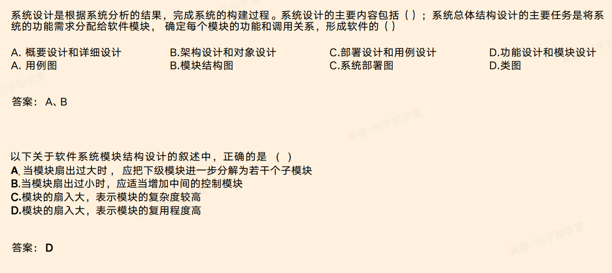

## 五、系统测试

系统测试是一种测试方法，用于确定计算机系统或软件是否满足所需的功能和需求。在系统测试中，测试人员会执行一系列测试用例和场景，以验证系统的各个部分和功能是否正常工作。系统测试通常包括功能测试、性能测试、[安全测试](https://cloud.tencent.com/product/sr?from_column=20065&from=20065)、兼容性测试等。这种测试方法旨在发现系统错误和问题，并为解决这些问题提供反馈和改进建议。系统测试是软件开发生命周期中的一个重要步骤，可以确保系统在投入使用之前是可靠和高质量的。


### :cactus:意义和目的

#### :shell:意义

系统测试的意义在于验证系统是否符合预期的功能需求和性能要求，以及发现系统中的缺陷和风险。系统测试通过模拟真实的使用环境和场景，对系统进行全面的测试和评估，以确保系统能够稳定运行并满足用户的期望。

#### :shell:目的

系统测试的目的：就是希望能以最少的人力和时间发现潜在的各种错误和缺陷。

信息系统测试应包括软件测试、硬件测试和网络测试。硬件测试、网络测试可以根据具体的性能指标进行，此处所说的测试更多的是指软件测试。

软件测试是对软件系统进行验证和验证的过程。它旨在确保软件满足预先确定的需求和规范，并且能够按照预期的方式运行。软件测试的主要目的是发现软件中的错误、缺陷和问题，并提供修复和改进的机会。

软件测试的过程通常包括以下步骤：

1. 需求分析和测试计划：确定软件的需求和测试目标，并制定详细的测试计划。
2. 测试设计：根据测试计划，设计测试用例和测试脚本，用于执行不同的测试场景和情况。
3. 测试执行：根据测试设计，执行测试用例和脚本，记录测试结果和问题。
4. 问题追踪和修复：对发现的问题进行跟踪和管理，通知开发人员进行修复。
5. 测试报告和总结：生成测试报告，记录测试的结果和发现，总结整个测试过程。

在软件测试中，可以使用不同的测试方法和技术，如黑盒测试、白盒测试、灰盒测试、功能测试、性能测试、安全测试等。每种方法都有其特定的目的和适用范围，旨在发现不同类型的错误和问题。

#### :shell:原则

系统测试是保证系统质量和可靠性的关键步骤，是对系统开发过程中的系统分析、系统设计和实施的最后复查。根据测试的概念和目的，在进行信息系统测试时应遵循以下基本原则：

| 原则                                     | 描述                                                         |
| :--------------------------------------- | :----------------------------------------------------------- |
| 尽早进行测试                             | 测试应贯穿在开发的各个阶段，应尽早纠正错误，消除隐患。       |
| 委托专门人员进行测试                     | 测试工作应由专门人员来进行，避免由原开发软件的人或小组承担。 |
| 设计测试方案时要确定预期输出结果         | 在设计测试方案时，不仅要确定输入数据，还要根据系统功能确定预期输出结果。 |
| 设计包含不合理、失效的输入条件的测试用例 | 在设计测试用例时，不仅要设计有效、合理的输入条件，也要包含不合理、失效的输入条件。 |
| 检验程序做了该做的事和不该做的事         | 在测试程序时，不仅要检验程序是否做了该做的事，还要检验程序是否做了不该做的事。 |
| 严格按照测试计划进行测试                 | 严格按照测试计划来进行测试，避免测试的随意性。               |
| 妥善保存测试计划和测试用例               | 妥善保存测试计划、测试用例，作为软件文档的组成部分，为维护提供方便。 |
| 设计可重复使用的测试例子                 | 测试例子都是精心设计出来的，可以为重新测试或追加测试提供方便。 |

### :cactus:测试过程

| 步骤               | 描述                                                         |
| :----------------- | :----------------------------------------------------------- |
| 制订测试计划       | 考虑项目开发时间、进度和人为因素，确定测试内容、进度安排、测试环境和条件、测试培训安排等 |
| 编制测试大纲       | 规定针对系统每项功能或特性必须完成的基本测试项目和测试完成标准 |
| 设计和生成测试用例 | 根据测试大纲，确定被测项目、输入数据、测试过程和预期输出结果 |
| 实施测试           | 将预先编制的测试大纲和测试用例应用于被测软件或设备，进行完整的测试 |
| 生成测试报告       | 对测试进行概要说明，列出测试结论，指出缺陷和错误，并提出修改建议，包括修改方法、工作量和责任人 |

### :cactus:测试策略

#### :shell:单元测试

单元测试（unit testing）是软件开发过程中的一项测试活动，用于验证一个软件系统的最小可测试单元（即单元）是否按照预期功能进行工作。单元测试的目的是对系统的各个独立部分进行测试，以确保其功能正确性。

在软件开发中，一个单元可以是一个函数、一个方法、一个类或一个模块。单元测试通常由开发人员编写，并在代码编写过程中进行。它们是自动化的测试，以确保代码的功能正常运行，并且可以方便地进行重复测试。

单元测试的主要特点是独立性、封闭性和重复性。单元测试应该独立于系统的其他部分，只关注被测试单元的功能。它们应该是封闭的，即不依赖于外部资源或其他单元的状态。而且，单元测试应该可以重复执行，确保测试结果的一致性。

通过编写单元测试，开发人员可以更早地发现和纠正代码中的错误和缺陷。单元测试可以帮助提高代码质量、可维护性和可重复性。它们还能够提供文档化的测试用例，以便将来维护和优化代码时使用。

常用的单元测试框架和工具有JUnit、PyTest、NUnit等。这些工具提供了方便的断言库和测试运行环境，使开发人员可以更容易地编写、运行和管理单元测试。

单元测试依据是软件详细设计说明书。

#### :shell:集成测试

集成测试（Integration testing）是软件测试的一种方法，旨在测试软件系统中各个模块之间的交互和集成。集成测试的目标是**确保不同模块之间的接口正常工作**，并且整个系统在集成后能够正常运行。

集成测试通常在单元测试之后进行，它可以对多个模块的功能进行整体测试，以确保系统在不同模块集成后能够协调工作。集成测试可以模拟实际环境中的各种情况和交互，包括输入和输出数据的正确性、各模块之间的调用关系、数据传递和处理等。

集成测试可以帮助发现模块之间的接口问题、数据传输错误、模块之间的依赖关系问题等，从而提高软件系统的质量和稳定性。它可以帮助发现由于模块集成引起的错误，减少在系统上线后出现的问题。

集成测试可以使用自动化测试工具和手动测试的方法进行。在进行集成测试时，需要先确定测试的范围和测试策略，然后编写测试用例并执行测试，最后对测试结果进行评估和分析。

集成测试目的是检查模块之间，以及模块和已集成的软件之间的接口关系，并验证已集成的软件是否符合设计要求

```csharp
1、自顶向下集成测试。自顶向下集成测试是一种构造软件体系结构的增量方法。
2、自底向上集成测试。自底向上集成测试就是从原子模块(程序结构的最底层构件)开始进行构造和测试。
3、回归测试。回归测试有助于保证变更不引入无意识行为或额外的错误。回归测试可以手工进行，方法 是重新执行所有测试用例的子集，或者利用捕捉/回放工具自动执行。
4、冒烟测试。冒烟测试是一种常用的集成测试方法，是时间关键项目的决定性机制，它让软件团队频繁地对项目进行评估。
```

集成测试依据是软件概要设计文档。

#### :shell:确认测试

确认测试（Confirmation testing）是软件测试中的一种测试技术，用于**确认先前发现的缺陷是否已经修复或解决**。确认测试通常在开发团队修复了一个或多个缺陷后进行，以确保这些缺陷已经被成功修复，且不会引入新的问题。确认测试的目的是验证修复操作的正确性和有效性，以确保软件在修复后能够正常工作。

确认测试主要用于**验证软件的功能、性能和其他特性是否与用户需求一致**。根据用户的参与程度，通常包括以下类型：

1. 内部确认测试：由软件开发组织内部按照SRS进行测试。
2. α测试：由有代表性的最终用户在开发者的场所进行测试，在受控的环境下进行。用户在开发环境下测试软件。
3. β测试：用户在实际使用环境下进行测试，这是软件在不被开发者控制的环境下的真实应用。接收到β测试问题报告后，开发人员会对软件进行修复，并准备向最终用户发布软件产品。
4. 客户验收测试：针对需求规约，在交付前以用户为主进行测试，测试对象为完整的、集成的计算机系统。验收测试的目的是在真实的用户工作环境下，检验软件系统是否满足开发技术合同或SRS。验收测试的结论是用户确定是否接收该软件的主要依据。在进行验收测试之前，需要确认被测软件系统已通过系统测试，并满足一般测试的准入条件。

#### :shell:系统测试

系统测试是**验证完成的软件配置项是否与系统正确连接**，并满足系统/子系统设计文档和软件开发合同规定的要求的一种测试。测试依据是用户需求或开发合同，并包括以下主要内容：

a) 恢复测试：通过各种方式强制系统发生故障，并验证系统能否按要求从故障中恢复，并在约定的时间内开始事务处理，不对系统造成任何伤害。

b) 安全性测试：验证系统内建立的保护机制是否能够实际保护系统免受非法入侵。

c) 压力测试：以非正常的数量、频率或容量等方式对系统进行测试。

d) 性能测试：测试软件在集成环境中的运行性能，可以在测试过程中的任何步骤进行性能测试。

e) 部署测试（也称为配置项测试）：测试对象是软件配置项，测试目的是检验软件配置项与系统需求规范的一致性。在进行该测试之前，应确认被测软件配置项已通过单元测试和集成测试。

### :cactus:测试方法

软件测试方法分为静态测试和动态测试。

#### :shell:静态测试

静态测试是指对程序进行检测的一种方法，不需要在机器上运行被测试程序，而是通过人工检测和计算机辅助静态分析来发现逻辑设计和编码错误。静态测试包括对文档和代码的测试。对文档的静态测试主要以检查单的形式进行，通过人工审查程序或评审软件来检查文档的准确性和完整性。

对代码的静态测试包括以下方式：

1. 人工检测：不依靠计算机，而是通过人工审查程序或评审软件进行检查。这包括代码检查、静态结构分析和代码质量度量等方法。
2. 计算机辅助静态分析：利用静态分析工具对被测试程序进行特性分析，从程序中提取信息，以便检查程序逻辑的各种缺陷和可疑的程序构造。

使用静态测试能够有效地发现程序的逻辑设计和编码错误，估计可以发现30%-70%的错误。通过结合人工检测和计算机辅助静态分析，可以提高测试的效率和准确性。

#### :shell:动态测试

动态测试是指通过运行程序，发现并纠正错误。在对软件产品进行动态测试时，可以使用黑盒测试法和白盒测试法。

黑盒测试也被称为功能测试，是在不考虑软件的内部结构和特性的情况下，测试软件的外部特性。常用的黑盒测试技术包括等价类划分、边界值分析、错误推测和因果图等。

白盒测试也被称为结构测试，根据程序的内部结构和逻辑来设计测试用例，对程序的路径和过程进行测试，以检查是否满足设计需求。白盒测试常用的技术有逻辑覆盖、循环覆盖和基本路径测试。

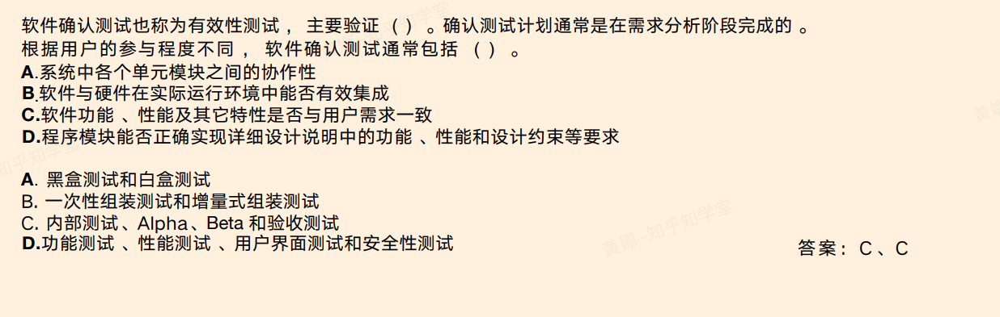

### :cactus:黑盒测试

黑盒测试是一种软件测试的方法，其中测试人员只关注测试对象的输入和输出，而不考虑内部的代码和结构。在黑盒测试中，测试人员不了解被测试的软件系统的内部实现细节，而只是根据软件的规格说明书和功能需求来设计测试用例。测试人员通过输入特定的测试数据，观察系统的输出结果，并分析其是否符合预期。黑盒测试主要关注软件的功能、性能和安全等方面的验证，以确保软件在各种情况下都能正确运行。

黑盒测试可以帮助发现软件系统中的错误、缺陷和漏洞等问题，以及确认软件是否按照客户需求和设计规范进行开发。它可以增加软件的可靠性和稳定性，并提高软件的质量和用户体验。

与白盒测试相比，黑盒测试更加注重用户的角度，通过模拟用户的使用场景和操作行为，验证软件系统是否能够正常运行。同时，黑盒测试也可以提供一些优化建议和改进方案，以提升软件系统的性能和安全性。

常用的黑盒测试技术有等价类划分、边界值分析、错误推测和因果图

#### :shell:等价类划分

##### ☀️5.1.1 等价类划分规则

等价类划分是一种测试设计技术，主要用于确定测试用例。

下面是等价类划分的步骤：

1. 识别输入域：首先，确定程序的输入域，也就是程序接受的所有可能输入的范围。
2. 划分等价类：将输入域划分为若干个等价类，每个等价类包含具有相同特征和行为的输入。等价类应该被选取以揭示潜在的错误或异常条件。
3. 选择代表性数据：从每个等价类中选择一个代表性数据作为测试用例。这些代表性数据应该能够有效地检测每个等价类的特征和行为。

举个例子，假设有一个程序接受一个数字作为输入，并根据数字的大小返回不同的结果。输入域可以是所有可能的数字。

等价类划分可以将输入域划分为三个等价类：负数、零和正数。这是因为程序对这三类输入数字的处理方式可能不同。

然后，从每个等价类中选择一个代表性数据作为测试用例。例如，选择-5作为负数的代表性数据，选择0作为零的代表性数据，选择5作为正数的代表性数据。

通过这种方式，我们可以有效地覆盖输入域，同时最大限度地减少重复测试的数量。

##### ☀️5.1.2 等价类划分情况

等价类划分有两种不同的情况：有效等价类和无效等价类。

有效等价类是指具有相同的功能需求和期望输出的测试用例组成的等价类，即这些测试用例应该产生相同的结果。无效等价类是指具有相同的功能需求但期望输出不同的测试用例组成的等价类，即这些测试用例应该产生不同的结果。

在等价类划分中，将输入域划分为若干互不相交的等价类，然后从每个等价类中选择一个测试用例进行测试。这样可以大大减少测试用例的数量，同时保证了测试用例的覆盖率。

在进行等价类划分时，需要考虑以下因素：

1. 有效等价类的划分：将输入域划分为可以产生相同结果的等价类，通常选择一些常见的典型输入，覆盖主要的功能需求。
2. 无效等价类的划分：将输入域划分为可以产生不同结果的等价类，通常选择一些边界值或异常情况的输入，覆盖非法的输入或错误的输入。

例如，对于一个用户登录系统，可以将用户名和密码作为输入，有效等价类可以是正确的用户名和密码组合，无效等价类可以是错误的用户名和密码组合。然后从每个等价类中选择一个测试用例进行测试，例如正确的用户名和密码、错误的用户名和密码等。

##### ☀️5.1.3 等价类划分设计原则

等价类测试用例的设计原则： 

- 设计一个新的测试用例，使其尽可能多地覆盖尚未被覆盖的有效等价类， 重复这一步，直到所有的有效等价类都被覆盖为止；
- 设计一个新的测试用例，使其仅覆盖一个尚未被覆盖的无效等价类，重复这一步，直到所有的无效等价类都被覆盖为止 。🦋5.2 边界值分析

边界值分析是一种测试技术，用于选取测试用例的方法。它基于以下观点：在一些情况下，边界上的值和接近边界的值更有可能导致错误。因此，边界值分析旨在选择这些边界和接近边界的值作为测试用例。

具体而言，边界值分析的步骤如下：

1. 确定输入范围：首先，要明确待测程序的输入范围。例如，如果我们需要测试一个接收整数输入的函数，那么输入范围可能是-99到99之间的整数。
2. 确定边界：在输入范围内，边界是指范围的起始点和结束点。在上述的例子中，边界为-99和99。
3. 选择上点：选择边界上的点作为测试用例。在本例中，我们可以选择-99和99作为测试用例。
4. 选择离点：选择接近边界的值作为测试用例。在这种情况下，我们可以选择-100、100、-98、98作为测试用例。
5. 选择内点：选择范围内的值作为测试用例。在本例中，我们可以选择50作为测试用例。

判断输入的数据是否小于-99或者大于99，如果小于-99或大于99给出错误提示

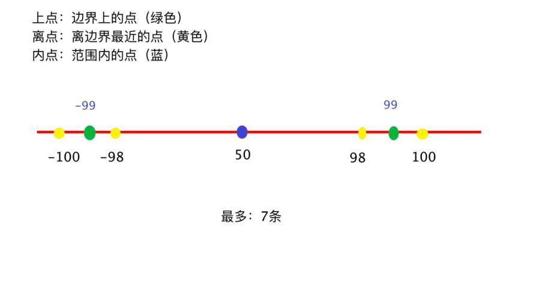

#### :shell:错误推测

错误推测：没有固定的方法，凭经验而言，来推测有可能产生问题的地方，作为测试用例进行测试。错误推测法的思想是根据经验列举出可能出现问题的清单，根据清单分享问题可能原因，推测发现缺陷。

适合的场景：

- 时间紧任务量大时，根据之前项目类似经验找出易出错的模块重点测试。

- 时间宽裕通过该方法列出之前出现问题较多的模块再次复测。


#### :shell:因果图

黑盒测试的因果图，是指通过一个结果来反推出导致该结果的原因。这种方法可以帮助测试人员分析系统的功能和逻辑，以确定可能导致问题的潜在原因。

在构建因果图时，可以考虑以下步骤：

1. 确定系统的输出结果：首先需要明确要测试的系统或功能的输出结果是什么。
2. 收集可能的因素：根据系统的特性和功能，收集可能对输出结果产生影响的因素。这些因素可以是输入值、系统配置、环境条件等。
3. 分析因果关系：根据收集到的可能因素，分析它们与输出结果之间的因果关系。考虑每个因素是否可能导致特定的输出结果，或者是否与其他因素存在依赖关系。
4. 构建因果图：根据分析的因果关系，将因素和结果绘制在因果图中。可以使用箭头表示因果关系，指向导致特定结果的因素。
5. 分析结果：通过观察因果图，可以根据输出结果来推测可能导致该结果的原因。这样可以帮助测试人员更有针对性地设计测试用例，以验证系统中可能存在的问题。

因果图的构建过程是根据具体的系统和功能来进行分析和推测的，并没有固定的方法或模板。

### :cactus:白盒测试

白盒测试是一种软件测试方法，其中测试人员具有对被测试软件的内部结构和代码的详细了解。与黑盒测试相比，白盒测试更加关注测试对象的内部逻辑和结构。

白盒测试的目的是验证软件的内部逻辑是否正确，并且最大限度地覆盖测试对象的代码路径。测试人员通常会使用静态分析和动态调试等技术来检查代码的正确性和执行路径的覆盖率。他们还可以在代码级别进行单元测试、集成测试和系统测试。

白盒测试的优点是可以发现代码层面的问题，如逻辑错误、边界条件错误和无效输入等。它还可以提供对程序性能的深入了解，并帮助改善代码质量和可维护性。

白盒测试也有一些限制。首先，测试人员需要具备深入的编程和代码理解能力。其次，白盒测试无法完全模拟真实环境中的所有情况，因此可能无法发现与外部系统和硬件交互相关的问题。

白盒测试常用的技术是逻辑覆盖、循环覆盖和基本路径测试

#### :shell:逻辑覆盖

逻辑覆盖是通过测试数据来检查被测程序对程序逻辑的覆盖程度的方法。主要有六种逻辑覆盖标准：语句覆盖、判定覆盖、条件覆盖、判定/条件覆盖、条件组合覆盖和路径覆盖。

| 覆盖标准      | 描述                                                         |
| :------------ | :----------------------------------------------------------- |
| 语句覆盖      | 选择足够的测试数据，使每条语句至少执行一次。语句覆盖对程序逻辑的覆盖程度较低，被视为较弱的逻辑覆盖。 |
| 判定覆盖      | 设计足够的测试用例，使得每个判定表达式条件的真假分支都要执行一次。判定覆盖也被称为分支覆盖，比语句覆盖更强。 |
| 条件覆盖      | 构造一组测试用例，使每个判定语句中每个逻辑条件的各种可能的值至少满足一次。 |
| 判定/条件覆盖 | 设计足够的测试用例，使得每个判定中每个条件的所有可能取值至少出现一次，并使每个判定本身的结果也至少出现一次。 |
| 条件组合覆盖  | 设计足够的测试用例，使得每个判定中条件的各种可能值的组合都至少出现一次。满足此覆盖的测试用例一定满足判定覆盖、条件覆盖和判定/条件覆盖。 |
| 路径覆盖      | 覆盖被测试程序中的所有可能路径。路径覆盖是最强大和全面的逻辑覆盖标准，能发现更多的错误和潜在问题，但测试用例数量较多，测试工作量较大。 |

#### :shell:循环覆盖

循环覆盖是白盒测试中的一种技术，用于确保被测试的软件中的循环结构被充分执行和覆盖。循环覆盖的目标是测试循环中的所有可能情况，包括循环条件为真、为假以及循环体被执行的不同次数等。

循环覆盖的基本原则是通过设计测试用例来驱动循环执行，以便覆盖循环的各个可能路径。具体的循环覆盖策略可以分为以下几种：

| 测试策略     | 目标                                     | 测试用例示例                                                 |
| :----------- | :--------------------------------------- | :----------------------------------------------------------- |
| 简单循环覆盖 | 保证循环至少被执行一次和至少不被执行一次 | 循环条件为真的情况下执行一次 2. 循环条件为假的情况下不执行   |
| 边界循环覆盖 | 关注循环的边界情况                       | 循环次数为最小值的情况下执行 2. 循环次数为最大值的情况下执行 3. 循环次数为中间值的情况下执行 |
| 全循环覆盖   | 覆盖循环的所有可能路径                   | 循环条件为真的情况下执行一次 2. 循环条件为假的情况下不执行 3. 循环体被执行0次 4. 循环体被执行1次 5. 循环体被执行多次 |

在进行循环覆盖时，需要结合其他白盒测试技术，如路径覆盖、条件覆盖和分支覆盖，来确保循环中的各个分支和条件也得到充分测试。循环覆盖的目的是找出可能存在的循环错误和效率问题。

#### :shell:基本路径测试

基本路径测试是白盒测试中的一种测试技术，旨在检查程序中所有可能的路径。它基于控制流图，通过选择测试用例来覆盖控制流图中的所有基本路径。

控制流图是一个图形化表示程序控制流程的图，其中节点表示程序的基本块（即一组连续的语句），边表示控制流转的可能路径。

基本路径是控制流图中的一条路径，从一个节点到另一个节点，期间经过的所有边都只经过一次。

基本路径测试的目标是选择测试用例来覆盖控制流图中的所有基本路径，以确保程序的所有路径都被测试到，并尽可能地发现潜在的错误。

基本路径测试的步骤如下：

| 步骤         | 目标                                         | 示例                                                         |
| :----------- | :------------------------------------------- | :----------------------------------------------------------- |
| 绘制控制流图 | 根据源代码绘制控制流图                       | 控制流图包含多个基本块，每个基本块标记为一个节点，用边连接各个基本块 |
| 确定基本路径 | 从控制流图中确定所有可能的基本路径           | 从起始节点到结束节点的路径 2. 经过特定条件节点的路径         |
| 选择测试用例 | 选择一组测试用例，以覆盖所有基本路径         | 选择测试用例来覆盖从起始节点到结束节点的路径 2. 选择测试用例来覆盖经过特定条件节点的路径 |
| 执行测试用例 | 根据选择的测试用例，执行测试，并记录测试结果 | 执行测试用例来验证从起始节点到结束节点的路径 2. 执行测试用例来验证经过特定条件节点的路径 |
| 分析结果     | 分析测试结果，检查程序的行为和潜在错误       | 检查程序是否按照预期路径执行 2. 检查是否存在潜在的错误       |

基本路径测试是一种比较全面的测试技术，可以有效地发现程序中的错误。它也有一些限制，比如在复杂的程序中，基本路径的数量可能很大，难以覆盖所有的基本路径。基本路径测试仅关注程序的控制流程，对于数据流和其他方面的问题可能无法完全覆盖。

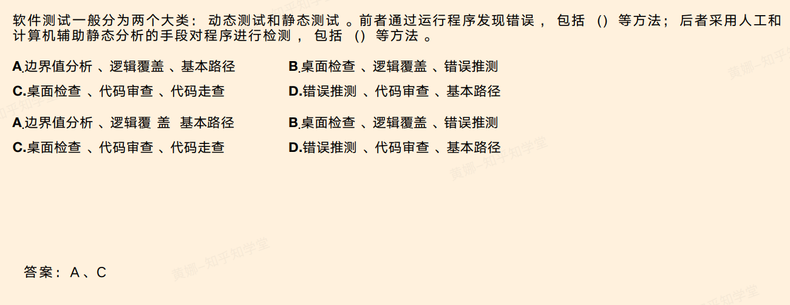

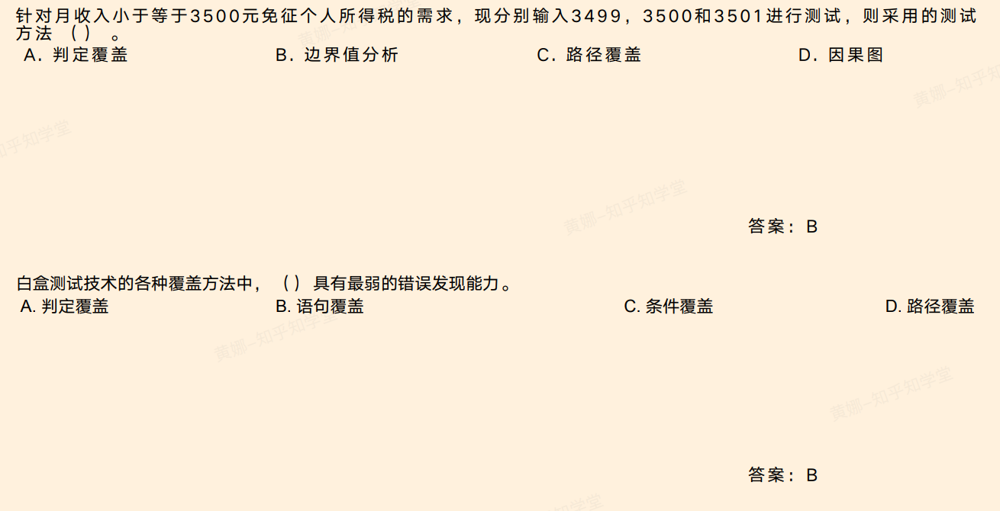

### :cactus:调试

测试是发现错误，调试是根据测试时所发现的错误找出原因和具体的位置，进行改正。

调试需要确定错误的准确位置，确定问题的原因并设法改正；改正后要进行回归测试。

调试的方法有：试探法、回溯法、原因排除法（对分查找法、归纳法、演绎法）。

| 方法       | 描述                                                         | 适用情况                               |
| :--------- | :----------------------------------------------------------- | :------------------------------------- |
| 试探法     | 分析错误症状，猜测问题位置，通过设置输出语句、分析寄存器和存储器等手段逐步试探和分析错误所在 | 结构比较简单的程序                     |
| 回溯法     | 从错误症状的位置开始，沿着程序的控制流程往回跟踪代码，直到找到错误根源 | 小型程序，大规模程序的路径较多时不适用 |
| 对分查找法 | 缩小错误的范围，通过逐步的二分查找来定位问题的位置           |                                        |
| 归纳法     | 从测试所暴露的问题出发，收集正确和不正确的数据，分析它们之间的关系，提出错误原因的假设，用数据证实或反驳来查出错误所在 |                                        |
| 演绎法     | 根据测试结果列出所有可能的错误原因，分析已有的数据排除不可能和矛盾的原因，选择可能性最大的假设来解释测试结果 |                                        |

### :cactus:软件度量

软件的两种属性：外部属性指面向管理者和用户的属性，可直接测量，一般为性能指标。内部属性指软件产品本身的属性，如可靠性，只能间接测量。

McCabe度量法：又称为环路复杂度，假设有向图中有向边数为m，节点数为n，则此有向图的环路复杂度为m-n+2p

注意m和n点的含义不能混淆，可以用一个最简单的环路来做特殊值记忆此公式，另外，针对一个程序流程图，每一个分支变（连线）就有一条有向边，每一条语句（语句框）就是一个顶点。

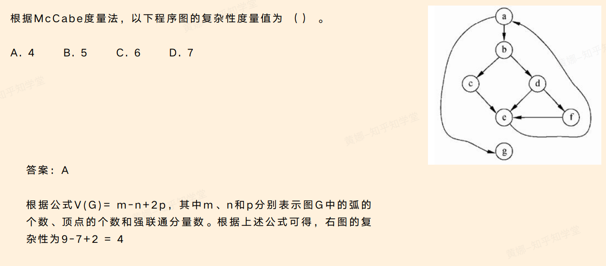

## 六、运行与维护知识

运行软件的过程涉及将软件安装在用户的计算机、服务器或移动设备上，并确保其正常运行。这可能涉及到设置和配置软件，以适应特定的硬件和操作系统环境。运行软件还包括监控软件运行的性能和稳定性，以确保它能够满足用户需求。

维护软件的过程涉及对软件进行修复和改进，以纠正已经发现的错误或缺陷，并进行功能扩展或性能优化。维护工作可能包括错误修复、安全补丁、性能优化、软件更新等。这些维护工作可以通过与用户的反馈和需求进行交流来确定和优先处理。

运行和维护是一个持续的过程。软件开发人员需要密切关注用户的反馈和需求，以及技术的变化和创新。通过持续的运行和维护工作，软件可以持续地满足用户的需求，并保持与技术环境的兼容性。

### :cactus:系统转换

系统转换是指：新系统开发完毕，投入运行，取代现有系统的过程，需要考虑多方面的问题，以实现与老系统的交接，有一下三种转换计划：

| 转换计划       | 描述                                                         |
| :------------- | :----------------------------------------------------------- |
| 直接转换       | 在确定新系统运行无误时立刻启用新系统，终止旧系统运行。风险较大，但节省人员和设备费用。适用于处理过程不复杂、数据不重要的场合。 |
| 并行转换       | 新旧系统并行工作一段时间，经过考验后正式替代旧系统。风险较小，安全可靠，但费用和工作量较大。适用于复杂的大型系统，提供了与旧系统比较的机会，公正评价新旧系统的时间要求、出错次数和工作效率。消除了对新系统不安的感觉。 |
| 分段转换       | 分期分批逐步转换，结合了直接和并行转换的特点。将大型系统分为多个子系统，逐个试运行并成熟后转换。适用于大型项目，耗时较长，需要协调好接口等问题。现有系统和新系统间混合使用。 |
| 数据转换与迁移 | 将数据从旧数据库迁移到新数据库中。有三种方法：1. 系统切换前通过工具迁移；2. 系统切换前采用手工录入；3. 系统切换后通过新系统生成。 |

### :cactus:系统维护

#### :shell:系统的可维护性

系统的可维护性可以定义为维护人员理解、改正、改动和改进这个软件的难易程度，可维护性是所有软件都应具有的基本特点，必须在开发阶段和其他软件工程阶段保证软件具有可维护的特点。其评价指标如下：

| 评价指标 | 描述                                                         |
| :------- | :----------------------------------------------------------- |
| 可理解性 | 系统的结构、界面、功能和内部过程的难易程度，模块化、详细设计文档、结构化设计和良好的高级程序设计语言等有助于提高可理解性。 |
| 可测试性 | 诊断和测试的容易程度，取决于易理解的程度。开发人员应尽力将程序设计成易诊断和测试的，充分利用系统测试阶段保存的测试用例。 |
| 可修改性 | 诊断和测试的容易程度与系统设计的设计原则有关。模块的耦合、内聚、作用范围与控制范围的关系对可修改性会产生影响。 |

#### :shell:软件的可维护性

系统维护主要包括硬件维护、软件维护和数据维护。

| 维护类型   | 描述                                                         |
| :--------- | :----------------------------------------------------------- |
| 正确性维护 | 指改正在系统开发阶段已发生但在系统测试阶段尚未发现的错误。   |
| 适应性维护 | 指使应用软件适应信息技术变化和管理需求变化的修改。           |
| 完善性维护 | 对已有的软件系统增加一些在系统分析和设计阶段中没有规定的功能与性能特征。 |
| 预防性维护 | 为了改进应用软件的可靠性和可维护性，主动增加预防性的新功能，使应用系统适应各类变化而不被淘汰。 |

### :cactus:系统评价

#### :shell:系统评价分类

按评价的时间与信息系统所处的阶段的关系又可从总体上把广义的信息系统评价分成立项评价、中期评价和结项评价。

| 阶段                           | 评价类型 | 描述                                                         |
| :----------------------------- | :------- | :----------------------------------------------------------- |
| 立项评价                       | 预评价   | 在信息系统开发之前进行的评价，用于系统规划阶段中的可行性研究。 |
| 中期评价                       | 阶段评审 | 在项目开发的中期阶段进行的阶段评审，或在项目开发中遇到重大变故时评估是否继续开发。 |
| 结项评价                       | 综合评价 | 在系统投入正式运行后，对系统进行综合评价，判断系统是否达到预期目的和要求。 |
| 时间与信息系统所处的阶段的关系 | 参考     | 评价类型是根据信息系统所处的阶段和时间确定的，可以从总体上将广义的信息系统评价分为立项评价、中期评价和结项评价。 |

#### :shell:系统评价指标

1、从信息系统的组成部分出发，信息系统是一个由人机共同组成的系统，所以可以按照运行效果和用户需求(人)、系统质量和技术条件(机)这两条线索构造指标。

2、从信息系统的评价对象出发，对于开发方来说，他们所关心的是系统质量和技术水平； 对于用户方而言，关心的是用户需求和运行质量；系统外部环境则主要通过社会效益指标来反映。

3、从经济学角度出发，分别按系统成本、系统效益和财务指标3条线索建立指标。

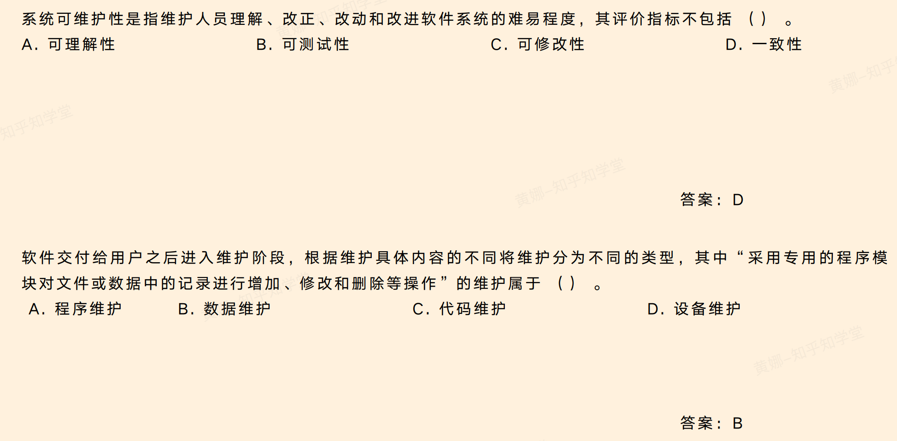


## 七、软件项目管理


## 八、软件质量

软件质量是指软件在满足用户需求的同时，具备一定的可靠性、可维护性、可测试性等特性。而软件度量是指通过对软件产物进行度量，来评估和衡量软件质量的一种方法。下面将分别介绍软件质量和软件度量的一些重要概念和方法。

1. 软件质量属性 软件质量属性是衡量软件质量的依据，包括以下几个方面：
2. 功能性：软件能否满足用户需求；
3. 可靠性：软件在给定环境下的稳定性和可靠性；
4. 易维护性：软件是否容易进行修改和扩展；
5. 可测试性：软件是否易于进行测试；
6. 可移植性：软件是否可以在不同环境中运行。
7. 软件度量方法

### :cactus:概念

软件质量是指软件系统或软件产品满足规定或隐含需求能力的特征和特性的总体表现。它反映了软件的可靠性、可用性、安全性、性能、可维护性和可扩展性等方面的表现。

软件质量管理是对软件开发过程进行独立的检查活动，旨在确保软件达到预期的质量标准。它涵盖了质量保证、质量规划和质量控制三个主要活动。质量保证包括制定质量策略、制定质量标准与规范、制定质量计划以及进行质量评审和审核等。质量规划包括确定质量目标、计划质量活动和资源以及建立质量保证体系等。质量控制包括执行质量活动、监控软件开发过程和产品质量、进行质量评估和改进等。

软件质量保证是为了确保软件系统或软件产品充分满足用户要求的质量而进行的有计划、有组织的活动。它包括识别和管理风险、执行质量活动、实施质量评估、建立质量测量和指标、持续改进等。其目的是生产高质量、稳定可靠的软件，提供优质的用户体验和满足用户需求的软件产品。

### :cactus:特性

讨论软件质量首先要了解软件的质量特性，目前已经有多种软件质量模型来描述软件质量特性，例如ISO/EC9126 软件质量模型和 McCall软件质量模型

#### :shell:ISO/EC9126 软件质量模型

ISO/IEC 9126是一个软件质量模型，旨在帮助组织评估和改进软件产品的质量。该模型定义了六个主要的软件质量特性，每个特性又包含一些子特性。

ISO/IEC 9126软件质量模型提供了一种综合和结构化的方法来评估软件质量，并可用于指导软件开发组织改进其软件产品的质量。该模型的使用可以帮助组织识别和解决软件质量问题，从而提高软件产品的可靠性、性能和用户满意度。

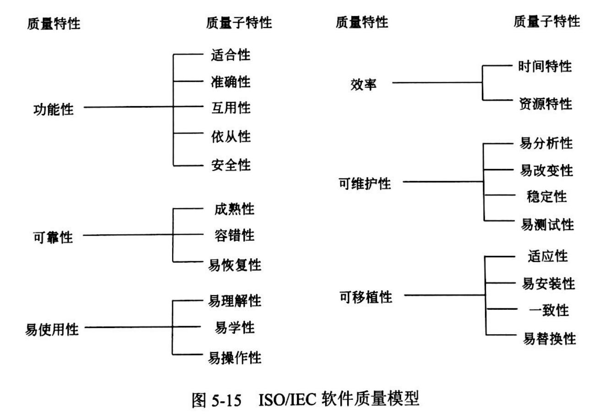

##### ☀️2.1.1 功能性(Functionality)

与一组功能及其指定的性质的存在有关的一组属性，功能是指满足规定或隐含需求的那些功能

| 软件属性 | 定义                                           |
| :------- | :--------------------------------------------- |
| 适应性   | 能否提供一组功能以及这组功能是否适合特定任务   |
| 准确性   | 能够得到正确或相符的结果或效果                 |
| 互用性   | 能够与其他指定系统进行交互操作                 |
| 依从性   | 能够使软件服从有关的标准、约定、法规及类似规定 |
| 安全性   | 能够避免对程序及数据的非授权故意或意外访问     |

##### ☀️2.1.2 可靠性(Reliability)

与在规定的一段时间内和规定的条件下软件维持在其性能水平有关的能力

| 软件属性 | 描述                                                         |
| :------- | :----------------------------------------------------------- |
| 成熟性   | 与由软件故障引起失效的频度有关的软件属性                     |
| 容错性   | 与在软件错误或违反指定接口的情况下维持指定的性能水平的能力有关的软件属性 |
| 易恢复性 | 与在故障发生后，重新建立其性能水平并恢复直接受影响数据的能力，以及为达到此目的所需的时间和努力有关的软件属性 |

##### ☀️2.1.3 易使用性(Usability)

与为使用所需的努力和由一组规定或隐含的用户对这样使用所做的个别评价有关的一组属性

| 属性     | 描述                                                         |
| :------- | :----------------------------------------------------------- |
| 易理解性 | 与用户为理解逻辑概念及其应用所付出的劳动有关的软件属性       |
| 易学性   | 与用户为学习其应用（例如操作控制、输入、输出）所付出的努力相关的软件属性 |
| 易操作性 | 与用户为进行操作和操作控制所付出的努力有关的软件属性         |

##### ☀️2.1.4 效率(Efficiency)

在规定条件下，与软件的性能水平与所用资源量之间的关系有关的软件属性

| 属性类型          | 时间特性                                                   | 资源特性                                                     |
| :---------------- | :--------------------------------------------------------- | :----------------------------------------------------------- |
| 相关说明          | 与响应和处理时间以及软件执行功能时的吞吐量有关的软件属性。 | 与软件执行功能时所使用的资源量和使用资源的持续时间有关的软件属性。 |
| 相关软件属性      | 响应时间、处理时间、吞吐量                                 | 资源使用量、资源持续时间                                     |
| 相关软件特征      | 软件的快速性和反应能力                                     | 软件的资源效率和资源管理能力                                 |
| 相关影响/问题     | 较长的响应时间和处理时间可能导致用户不满意                 | 资源消耗过大可能导致系统崩溃或性能下降                       |
| 相关解决方案/优化 | 优化算法和数据结构、增加硬件资源                           | 资源管理策略和优化、调整系统配置                             |

##### ☀️2.1.5 可维护性(Maintainability)

与进行规定的修改所需要的努力有关的一组属性

| 属性     | 描述                                                         |
| :------- | :----------------------------------------------------------- |
| 易分析性 | 与诊断缺陷或失效原因，或为判定待修改的部分所需努力有关的软件属性 |
| 易改变性 | 与进行修改、排错或适应环境变换所需努力有关的软件属性         |
| 稳定性   | 与修改造成未预料效果的风险有关的软件属性                     |
| 易测试性 | 为确认经修改软件所需努力有关的软件属性                       |

##### ☀️2.1.6 可移植性(Portability)

与软件可从某一环境转移到另一环境的能力有关的一组属性

| 软件属性 | 定义                                                         |
| :------- | :----------------------------------------------------------- |
| 适应性   | 与软件转移到不同环境时的处理或手段有关的软件属性             |
| 易安装性 | 与在指定环境下安装软件所需努力有关的软件属性                 |
| 一致性   | 使软件服从与可移植性有关的标准或约定的软件属性               |
| 易替换性 | 与一软件在该软件环境中用来替代指定的其他软件的可能和努力有关的软件属性 |

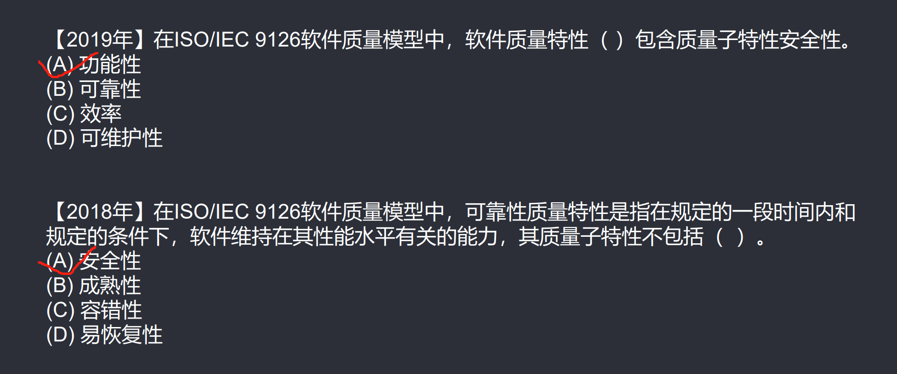

#### :shell:Mc Call质量模型

McCall质量模型是一种用于评估软件质量的模型，于1977年由McCall等人提出。该模型将从软件产品的运行、修正和转移3个方面确定了11个质量特性，并为每个因素定义了指标，通过对这些指标进行评估，可以对软件的质量进行综合评价。

这11个因素包括：

| 质量因素   | 描述                                                   |
| :--------- | :----------------------------------------------------- |
| 基本操作性 | 测试软件的基本功能是否正常运行                         |
| 准确性     | 软件输出的准确性，是否符合用户的预期                   |
| 可靠性     | 软件在给定条件下的可靠性，是否能够持续稳定运行         |
| 效率       | 软件在给定条件下的执行效率，包括响应时间、资源利用率等 |
| 可维护性   | 软件的易维护性，包括易理解、易修改、易测试等           |
| 灵活性     | 软件的适应性，是否能够满足用户的不同需求               |
| 可测试性   | 软件的易测试性，是否容易进行测试和验证                 |
| 可理解性   | 软件的易理解性，包括文档、注释、命名等                 |
| 可用性     | 软件的易用性，是否容易上手和操作                       |
| 可移植性   | 软件的可移植性，是否能够在不同的环境和平台上运行       |
| 可互操作性 | 软件的互操作性，是否能够与其他软件和系统进行交互       |

通过对这些因素进行评估，可以得出软件的质量评分，从而指导软件开发和维护的工作。McCall质量模型提供了一个系统化的评估方法，可以帮助开发团队和项目经理在软件开发过程中关注和优化不同的质量因素。

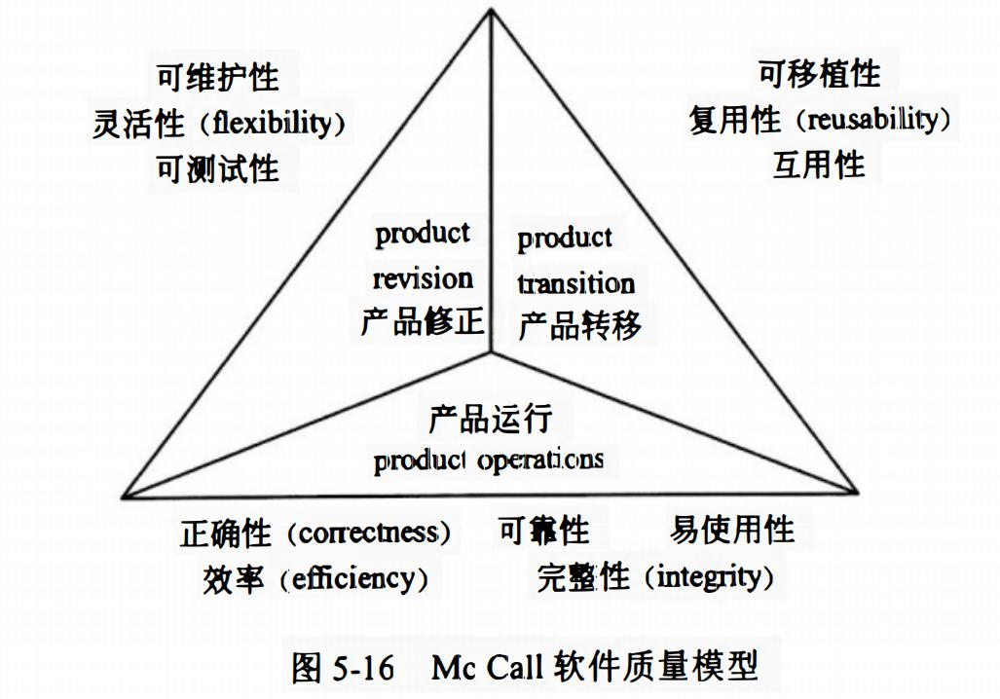

### :cactus:软件质量保证

软件质量保证是指为保证软件系统或软件产品充分满足用户要求的质量而进行的有计划、有组织的活动，其目的是生产高质量的软件。主要包含3个要点和7个任务。

3个要点：

| 要点         | 描述                                                         |
| :----------- | :----------------------------------------------------------- |
| 用户需求满足 | 软件必须满足用户需求，与用户需求不一致的软件无质量可言。     |
| 开发标准遵循 | 软件应遵循规定的一系列开发标准，不遵循这些准则的软件，其质量难以得到保证。 |
| 隐含需求满足 | 软件还应满足某些隐含的需求（如可理解性、可维护性等），未明确写在用户需求中。 |

7个任务：

| 任务           | 描述                                 |
| :------------- | :----------------------------------- |
| 应用技术方法   | 把软件质量设计到产品中而非事后保证。 |
| 正式的技术评审 | 进行正式的技术评审。                 |
| 测试软件       | 进行软件测试。                       |
| 标准的实施     | 遵循标准进行软件开发。               |
| 控制变更       | 控制软件变更。                       |
| 度量           | 收集软件度量。                       |
| 记录保存和报告 | 记录保存和报告软件质量相关信息。     |

### :cactus:软件评审

软件评审：是指对软件开发过程中的文档、设计、代码、测试用例等进行系统性的检查和审查的过程。评审的目的是发现潜在的问题、错误和改进的机会，以提高软件质量和有效性。 

通常，把“质量”理解为“用户满意程度”。为了使得用户满意，有以下两个必要条件。

(1)设计的规格说明书符合用户的要求，这称为设计质量。

(2)程序按照设计规格说明所规定的情况正确执行，这称为程序质量。

软件的评审主要包含以下两种评审：

- 设计质量的评审：设计质量评审的对象是在需求分析阶段产生的软件需求规格说明、数据需求规格说明，以及在软件概要设计阶段产生的软件概要设计说明书等
- 程序质量的评审：程序质量评审通常是从开发者的角度进行评审，与开发技术直接相关。它是着眼于软件本身的结构、与运行环境的接口以及变更带来的影响而进行的评审活动

### :cactus:软件容错技术

提高软件质量和可靠性的技术大致可分为两类，一类是避开错误，即在开发的过程中不让差错潜入软件的技术；另一类是容错技术，即对某些无法避开的差错，使其影响减至最小的技术。

软件容错技术：容错就是软件遇到错误的处理能力，实现容错的手段主要是冗余，冗余是指对于实现系统规定功能是多余的那部分资源，包括硬件、软件、信息和时间。由于加入了这些资源，有可能使系统的可靠性得到较大的提高，包括四种冗余技术：结构冗余、信息冗余、时间冗余、冗余附加技术

#### :shell:结构冗余

结构冗余是通过在系统中添加额外的硬件或软件组件来提高系统的可靠性和容错能力，这种冗余可以分为静态、动态和混合冗余三种类型：

| 冗余类型 | 定义                                                         | 示例                       |
| :------- | :----------------------------------------------------------- | :------------------------- |
| 静态冗余 | 在系统中添加多个相同的组件，通过表决和比较来选择正确的输出   | 航空航天领域的多发动机系统 |
| 动态冗余 | 在系统中添加多个相同的组件，但只有一个组件在工作，其他处于待机状态 | 服务器领域的 RAID 技术     |
| 混合冗余 | 将静态和动态冗余技术结合起来使用，提高系统的可靠性和容错能力 | 核电站中的反应堆控制系统   |

#### :shell:信息冗余

信息冗余是通过在数据中添加额外的信息来提高数据的检错和纠错能力。这种冗余通常采用校验码原理，即通过对数据进行某种运算来生成校验码，并将校验码附加到数据中。当数据传输或存储时，如果校验码与数据不匹配，则说明数据可能发生了错误。

校验码原理：校验码原理是指通过对数据进行某种运算来生成校验码，并将校验码附加到数据中。常见的校验码包括循环冗余校验码（CRC）、汉明码等。例如，在 USB 接口中，数据传输时会使用 CRC 校验码来检测数据是否发生了错误。

#### :shell:时间冗余

时间冗余是通过在系统中添加额外的时间延迟来提高系统的容错能力。这种冗余通常采用重复执行的方式，即当系统出现错误时，会重复执行相同的操作，直到操作成功为止。如果重复执行多次仍然失败，则说明系统可能出现了严重的故障。

| 名词     | 定义                                                         | 示例                                                         |
| :------- | :----------------------------------------------------------- | :----------------------------------------------------------- |
| 重复执行 | 当系统出现错误时，重复执行相同的操作，直到操作成功为止。     | 在计算机系统中，当硬盘读取数据时出现错误时，操作系统会尝试多次读取数据，直到读取成功为止。 |
| 回滚     | 当系统出现错误时，将系统状态恢复到之前的某个时间点，以避免错误的影响。 | 在数据库系统中，如果某个事务执行失败，可以使用回滚操作将数据库状态恢复到事务开始之前的状态。 |

#### :shell:冗余附加技术

冗余附加技术是指为实现结构、信息和时间冗余技术所需的资源和技术，包括程序、指令、数据、存放和调动它们的空间和通道等。

## 九、软件度量

软件度量是通过对软件产物进行定量的测量和评估，来衡量软件质量的方法。常用的软件度量方法包括：

1. 功能点分析（Function Point Analysis，FPA）：通过对软件的功能进行统计，来评估软件规模和复杂度；
2. 代码行数度量：通过对软件代码行数进行统计，来评估软件大小和复杂度；
3. 缺陷密度度量：通过对软件缺陷的数量和严重程度进行统计，来评估软件的质量；
4. 可靠性度量：通过对软件的故障率和可用性进行统计，来评估软件的可靠性。

### :cactus:属性

软件度量是用于对软件产品及其开发过程进行度量的一种方法。软件可以具有两种属性，即外部属性和内部属性。

外部属性是指面向管理者和用户的属性，可以直接进行测量。一般来说，外部属性主要关注软件的性能指标，例如成本、效益、以及开发人员的生产率等。

内部属性是指软件产品本身的属性，只能通过间接的方式进行测量。内部属性主要关注软件的可靠性、可维护性等方面的特性。这些属性无法直接测量，但可以通过对软件的设计、开发和测试等过程进行分析和评估来间接获取相关信息。

### :cactus:分类方法

软件度量可以按两种分类方法进行划分：

1. 面向规模的度量、面向功能的度量和面向人的度量。
2. 生产率度量、质量度量和技术度量。🔎3.复杂度的度量方法

软件复杂度的度量方法：McCabe度量法：又称为环路复杂度，假设有向图中有向边数为m,节点数为n,则此有向图的环路复杂度为m-n+2

注意m和n代表的含义不能混淆，可以用一个最简单的环路来做特殊值记忆此公式，另外，针对一个程序流程图，每一个分支边（连线）就是一条有向边，每一条语句(语句框)就是一个顶点。

还有一种更加简单的算法：封闭空间数量+1

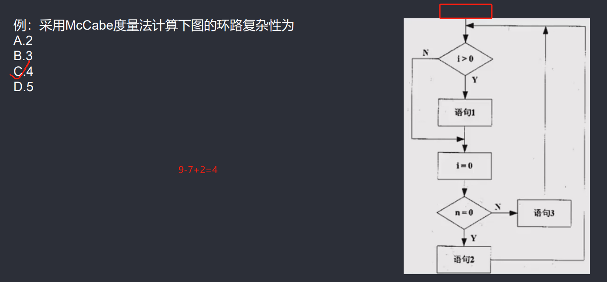

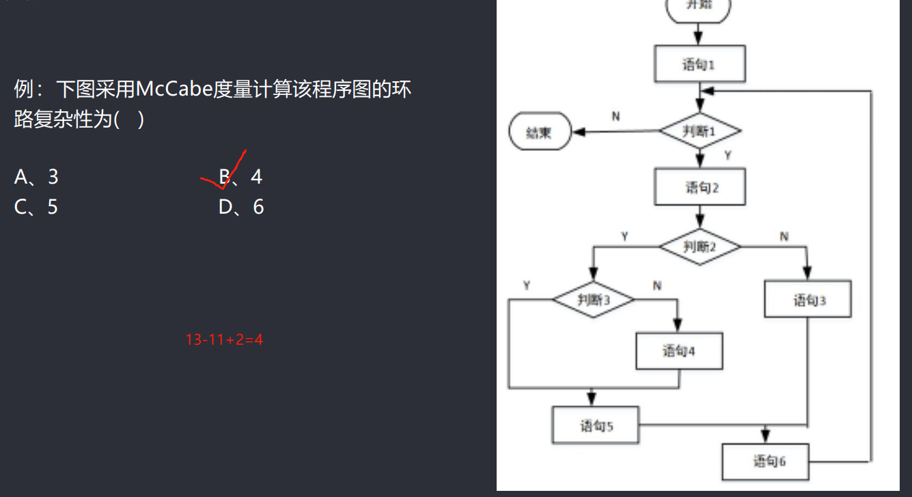

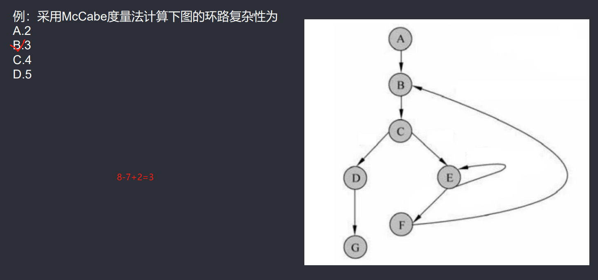

## 十、软件工具与软件开发环境