## 一、面向对象基础

面向对象的编程范式在上世纪六十年代末和七十年代初逐渐形成，并在八十年代得到了广泛应用。它的背景可以追溯到软件开发领域的一些问题和挑战。

在早期，软件开发主要采用的是过程式编程，这种编程方式将程序分解为一系列的过程或函数来完成特定的任务。然而，随着软件系统的不断增大和复杂化，过程式编程面临着一些挑战。

面向对象的编程范式的出现正是为了解决这些问题。它将程序中的数据和行为封装为对象，通过对象之间的交互来完成任务。

| 缺点                                                         | 解决方法                                                     |
| ------------------------------------------------------------ | ------------------------------------------------------------ |
| 缺乏模块化和可重用性：过程式编程往往将功能代码组织为一系列过程和函数，但随着系统的复杂性增加，这些过程和函数之间的关系变得难以管理。代码的重复编写也导致了效率低下和维护困难。 | 面向对象编程通过将功能封装在类中，使得代码更模块化，每个类负责特定的功能。通过类之间的关联和交互，实现代码的可重用性。同时，继承和多态的机制还进一步提供了代码重用的能力。 |
| 难以处理复杂关系和状态：传统的过程式编程很难处理对象之间的复杂关系和状态变化。对于一些复杂的业务问题，过程式编程往往需要大量的代码来维护对象之间的状态，导致代码的可读性和可维护性降低。 | 面向对象编程通过将对象的数据和行为封装在一起，保证了对象状态的一致性和完整性。通过类之间的关系和交互，可以更好地处理对象之间复杂的关系和状态变化。 |
| 缺乏抽象和封装：过程式编程往往缺乏对问题领域的抽象，代码的可读性差。同时，过程式编程也缺乏对数据和行为进行封装的机制，导致代码容易受到外部的影响。 | 面向对象编程通过类的定义和对象的创建，提供了对问题领域的抽象和建模。同时，封装机制将数据和行为封装在类中，隐藏了内部实现细节，提高了代码的可读性和可维护性。 |

### 1.相关概念

#### 🦋1.1 对象

对象是基本的运行实体，它是类的一个实例。一个对象封装了数据和行为的整体，代表了现实世界中的具体事物，例如学生、汽车等。对象具有明确的边界，定义了自己的行为，并且可以根据需要进行扩展。

举例来说，我们可以创建一个名为"Student"的类，然后通过该类来实例化不同的学生对象。每个学生对象都会有自己的属性（例如姓名、年龄、学号等）和行为（例如上课、考试、提交作业等）。这些属性和行为的封装在对象内部，外部的用户只能通过暴露的接口来访问和操作。这样，每个学生对象都具有清晰的边界和良好定义的行为。

另一个例子是汽车。我们可以创建一个名为"Car"的类，然后通过该类来实例化不同的汽车对象。每辆汽车对象都会有自己的属性（例如品牌、型号、颜色等）和行为（例如启动、加速、刹车等）。这些属性和行为的封装在对象内部，外部的用户只能通过暴露的接口来与汽车对象进行交互。每辆汽车对象都具有清晰的边界和良好定义的行为。

通过对象的封装和可扩展性，我们可以更好地管理和操作这些真实存在的实体，使程序代码更具可读性、可维护性和可扩展性。

#### 🦋1.2 消息

消息是对象之间进行通信的一种构造。类是对象的抽象，它定义了一组大体相似的对象结构，包括实体类、边界类和控制类。实体类用于对必须存储的信息和相关行为建模，它是需要长久保存且一直存在的类。边界类用于系统内部与系统外部的业务主角之间进行交互建模。控制类用于对一个或几个用例所特有的控制行为进行建模，它表示在用例执行过程中被动出现的特定行为。

举例说明：

假设我们要设计一个图书馆管理系统，可以有以下类别：

- 实体类：Book（书籍类，包括属性如书名、作者和出版日期等，以及行为如借阅和归还）、Library（图书馆类，包括属性如馆藏书籍和开放时间等，以及行为如添加书籍和借出书籍）；
- 边界类：User（用户类，包括属性如用户名和密码等，以及行为如登录和查看借阅历史）、UI（用户界面类，用于与用户进行交互，包括显示图书馆的书籍列表和接收用户的操作）；
- 控制类：Loan（借阅类，用于处理借阅过程中的控制行为，如检查是否有库存、记录借阅历史）、Authentication（认证类，用于处理用户登录的控制行为）。

这些类别之间可以通过消息进行通信。例如，当用户登录时，UI类会向Authentication类发送登录请求消息；当图书馆添加新书时，Library类会向Book类发送添加书籍消息。这样，不同类之间的通信构成了整个图书馆管理系统的功能。

#### 🦋1.3 继承

继承是一种机制，它允许父类和子类之间共享数据和方法。继承是类之间的一种关系，其中子类可以继承（获得）父类的属性和方法，同时可以添加自己独有的属性和方法。

举例说明：假设有一个父类Animal，它有属性name和方法sayHello()。现在有子类Cat和Dog，它们继承了Animal类。通过继承，Cat和Dog类可以拥有name属性和sayHello()方法，并且还可以在自己的类中添加额外的属性和方法。

#### 🦋1.4 多态

多态是指当不同的对象接收到同一个消息时，会产生完全不同的反应。它包括参数多态、包含多态、过载多态和强制多态这四种类型。多态的实现是通过继承机制来支持的。

具体来说，参数多态是指不同类型的参数可以有多种结构类型。例如，在一个图形绘制的程序中，可以有不同类型的图形对象（如圆形、矩形、三角形）作为参数传入一个绘制方法，每种类型的图形对象会通过自己的绘制方式进行绘制。

包含多态是指父类对象可以引用子类对象，通过父类的引用调用子类的方法。例如，有一个动物类作为父类，有猫类和狗类作为子类，可以通过动物类的引用调用子类特有的方法，如发出不同的叫声。

过载多态是指在同一个类中，可以有多个方法名相同但参数类型或个数不同的方法。例如，在一个计算器类中，可以有多个同名的加法方法，分别接收不同类型或个数的参数，实现不同类型的加法运算。

强制多态是指可以通过强制类型转换来实现多态。例如，将一个父类对象强制转换为子类对象，以调用子类特有的方法。

多态使得不同的对象能够根据自己的特性对同一个消息产生不同的反应，提高了代码的灵活性和可扩展性。

#### 🦋1.5 覆盖（重写）

子类通过重写父类的方法，可以在原有父类接口的基础上，用适合于自己要求的实现去替换父类中的相应实现。具体而言，在子类中可以重定义一个与父类同名同参数的方法，并在该方法中实现子类自己的逻辑。

举例来说，假设有一个父类Animal，其中有一个eat()方法用于描述动物的进食行为。现在有一个子类Dog，想要重写eat()方法并定义自己的进食行为。子类Dog可以通过重写父类的eat()方法，在自己的eat()方法中实现狗狗特有的进食行为。

#### 🦋1.6 重载

函数重载和函数覆盖是两个概念需要区分开来。函数重载是指在同一个类中，可以有多个同名函数，但它们的参数类型或个数必须不同。函数重载与子类和父类之间无关，只与函数本身的参数有关。例如，在一个计算器类中，可以有两个同名的add函数，一个接受两个整数参数，另一个接受两个浮点数参数。

函数覆盖（也称为函数重写或方法重写）则是指子类重写了父类中的同名函数。子类覆盖的函数必须与父类的函数具有相同的函数名、返回类型和参数列表。例如，有一个Animal类和它的子类Dog，Animal类中有一个makeSound函数，子类Dog可以重写该函数以发出不同的声音。

函数重载与函数签名有关，可以在同一个类中有多个同名函数，但参数类型或个数必须不同；而函数覆盖则是子类重写了父类中的同名函数，要求函数名、返回类型和参数列表都相同。

#### 🦋1.7 封装

封装是一种信息隐蔽技术，其目的是将对象的使用者和生产者分离。它允许其他开发人员无需了解所要使用的软件组件内部的工作机制，只需知道如何使用组件。封装的好处是可以隐藏实现细节，提高代码的可维护性、可重用性和安全性。

举个例子来说明封装的概念：假设有一个汽车类，内部包含了发动机、轮胎、方向盘等组件。使用封装的思想，我们可以将这些组件的内部工作机制隐藏起来，只提供一个公共接口，让其他开发人员只需要知道如何使用这些组件即可。比如，其他开发人员可以调用汽车类的加速、刹车、转向等方法来控制汽车的运行，而无需了解引擎是如何工作的、轮胎是如何转动的等细节。

通过封装，我们可以实现代码的模块化、屏蔽实现细节，从而提高了代码的可维护性。同时，封装还可以提高代码的可重用性，因为其他开发人员只需要关注如何使用组件，而无需重新编写相同的代码。另外，封装还可以提高代码的安全性，因为隐藏了内部实现细节，其他人无法直接访问和修改。

#### 🦋1.8 静态类型

静态类型是指一个对象的类型在编译时就确定的特性，而动态类型则是指对象类型在运行时才能确定。例如，对于静态类型，我们可以在编译时声明一个变量的类型，并且该变量的类型将在编译时就被确定，而无法在运行时改变。例如，使用静态类型的语言如Java中，我们可以声明一个整数变量int x = 5;，在编译时便确定了x的类型为整数。相比之下，动态类型允许类型在运行时才能确定，可以根据变量的赋值来推断其类型。例如，使用动态类型的语言如Python中，我们可以声明一个变量x = 5，类型会在运行时根据赋值自动确定为整数类型。这种灵活性使得动态类型语言更加适应于快速开发和灵活的编程需求。

#### 🦋1.9 静态绑定(静态分配)

静态绑定（静态分配）是基于静态类型的，这意味着在程序执行之前，方法已经被绑定。这意味着编译器可以根据变量的静态类型来确定调用的方法。例如，假设我们有一个基类Animal和两个子类Dog和Cat，它们都有一个名为"makeSound"的方法。我们创建一个Animal类型的变量a，并将其分别赋值为Dog和Cat的实例。当我们调用a.makeSound()时，由于静态类型是Animal，编译器将选择Animal类中的makeSound方法进行绑定，而不是具体子类的makeSound方法。这就是静态绑定的概念。

#### 🦋1.10 动态绑定

动态绑定是基于动态类型的，运行时根据变量实际引用的对象类型决定调用哪个方法。动态绑定支持多态，即同一个方法名可以有多个不同的实现，根据对象的类型来自动选择正确的方法。

举个例子，假设有一个父类Animal和两个子类Dog和Cat。它们都有一个名为"makeSound"的方法。我们定义一个Animal类型的变量animal，并将其引用指向Dog对象。当我们调用animal.makeSound()时，由于动态绑定的关系，实际上会调用Dog类中的makeSound方法。如果我们改变animal的引用，指向Cat对象，那么调用animal.makeSound()将会调用Cat类中的makeSound方法。这个例子展示了动态绑定的特性，方法的具体实现是在运行时根据对象的类型决定的。

### 2.面向对象分析

#### 🦋2.1 面向对象分析

面向对象分析是一种方法论，用于确定问题域并深入理解问题。它将问题领域分解为对象，通过审视对象之间的关系和行为，来分析问题的本质和要求。

举个例子，假设我们要设计一个图书管理系统。在面向对象分析过程中，我们会考虑系统中的各种对象，如图书、图书馆、读者等。我们会分析这些对象的属性和方法，了解它们之间的关系。比如，图书对象可能有属性包括书名、作者、出版日期等，方法包括借书、还书等操作。图书馆对象可能有属性包括馆名、地址等，方法包括添加图书、借书记录等操作。通过这样的分析，我们可以更好地理解问题域，从而更有效地设计系统。

#### 🦋2.2 五个活动

包含五个活动：认定对象(按自然存在的实体确定对象)、组织对象(分析对象关系，抽象成类)、对象间的相互作用(描述各对象在应用系统中的关系)、确定对象的操作(操作，如创建增加删除等)、定义对象的内部信息(属性)。

**认定对象**：通过观察自然存在的实体，确定需要在应用系统中考虑的对象。例如，在一个电商应用中，我们可以认定对象有商品、用户、订单等。

**组织对象**：分析对象之间的关系，将它们抽象成类。例如，根据商品和用户之间的交互关系，我们可以抽象出商品类和用户类。

**对象间的相互作用**：描述各对象在应用系统中的关系。例如，在电商应用中，商品和用户之间的相互作用可以是用户浏览商品、将商品添加到购物车等操作。

**确定对象的操作**：定义对象可以进行的操作，如创建、增加、删除等。例如，用户类可以有创建账号、登录、修改密码等操作。

**定义对象的内部信息**：定义对象的属性，即对象所具有的特征。例如，商品类可以有名称、价格、库存等属性。

综合例子：在一个社交媒体应用中，我们认定对象有用户、帖子、评论等。根据用户与帖子之间的关系，我们抽象出用户类和帖子类。用户可以浏览帖子、发表评论等，这些为对象间的相互作用。用户类可以有创建账号、修改个人信息等操作。帖子类可以有标题、内容、发布时间等属性。

#### 🦋2.3 面向对象设计

面向对象设计是一种方法论，旨在通过设计分析模型并实现相应的源代码，在目标代码环境中执行这些源代码，以解决特定的设计问题域。举个例子来说明，假设我们正在设计一个图书馆管理系统，我们可以使用面向对象设计来创建图书馆、图书、用户等对象，并定义它们之间的关系和行为。通过面向对象设计，我们可以设计出一个能够方便地管理图书、借还书籍、查询图书等功能的系统。在这个系统中，图书馆、图书、用户等就是面向对象设计中的类，它们的属性和方法就是相应的源代码，而系统的运行环境就是目标代码环境。通过面向对象设计，我们可以实现一个功能完善、易于维护和扩展的图书馆管理系统。

#### 🦋2.4 面向对象程序设计

面向对象程序设计是一种使用面向对象程序设计语言实现设计方案的方式。它的主要思想是将现实世界中的事物抽象为对象，通过定义对象的属性和方法来描述其特征和行为，并通过对象之间的交互来实现系统功能。

举例说明：假设我们要设计一个图书管理系统。面向对象程序设计的思想将图书抽象为一个对象，该对象具有属性（例如书名、作者、出版日期）和方法（例如借书、还书）。我们还可以定义一个用户对象，该对象具有属性（例如姓名、借阅记录）和方法（例如借书、归还书籍）。通过面向对象程序设计语言（如Java、C++）实现图书管理系统，我们可以方便地创建图书对象和用户对象，并通过对象之间的交互实现图书借阅、归还等功能。这样，我们可以在系统中使用面向对象的思想来组织和管理图书的相关操作，提高系统的可扩展性和可维护性。

#### 🦋2.5 面向对象测试

面向对象测试，与普通测试步骤并无不同，可分为四个层次。这四个层次分别是算法层、类层、模板层和系统层。

算法层是指在测试类中定义的每个方法，类似于单元测试。例如，对于一个图书管理系统的测试，可以对添加书籍、删除书籍等方法进行算法层的测试。

类层是指测试同一个类中所有方法与属性的相互作用，特有的模块测试。例如，在图书管理系统中，可以对图书类进行类层测试，测试其方法之间的相互调用以及属性的正确性。

模板层是指测试一组协同工作的类之间的相互作用，类似于集成测试。例如，在图书管理系统中，可以对图书类、图书馆类、读者类等多个类进行模板层测试，测试它们之间的交互是否正常。

系统层是指类似系统测试的测试层次。例如，在图书管理系统中，可以对整个系统进行系统层测试，测试其整体功能是否符合要求。

### 3.面向对象的设计原则

#### 🦋3.1 单一责任原则

这个原则就是让一个类只做一件事情，不要把太多的任务放在一个类里。这样做的好处是，当你需要修改某个功能时，只需要关注一个类，而不用担心影响其他功能。

举例：想象你正在开发一个学生管理系统。你有一个 Student 类，它负责存储学生的信息，比如姓名和年龄。你还有一个 StudentManager 类，它负责管理学生的添加、删除等操作。这样，每个类只负责一个特定的责任。

举例：想象你是一名学生。你每天要面对多门课程，每门课程都有不同的老师和作业。如果你把所有课程的笔记、作业和书都放在一个文件夹里，当你需要找到特定课程的资料时会变得非常混乱。相反，如果你为每门课程都准备一个专用的文件夹，你就能更轻松地管理和找到所需的信息。每个文件夹就代表了一个类，它们只负责一个特定的任务，即存储与该课程相关的资料。

#### 🦋3.2 开放封闭原则

这个原则意味着你可以扩展现有的代码，但不需要修改已有的代码。你应该允许新功能的添加，而不会影响到已经运行良好的功能。

举例：假设你正在编写一个图形绘制软件，你有一个 Shape 类，代表各种形状。现在，你想添加一个新的形状，比如三角形。你应该能够通过创建一个新的类（例如 Triangle 类），而不是修改已有的 Shape 类。

举例：想象你是一名家庭主妇，你正在准备一顿丰盛的晚餐。你已经在规划中有一些菜肴，但客人可能会有特殊的饮食要求。你可以轻松地加入一个新的菜肴或调整配方，而不会影响到你已经准备好的菜肴。这就是开放封闭原则，你的晚餐计划是“封闭”的，因为已经准备好了，但你可以“开放”地添加新的菜肴，以满足不同的需求。

#### 🦋3.3 里氏替换原则

这个原则强调子类应该能够替换父类而不会影响程序的正确性。换句话说，你应该能够使用子类的实例来替代父类的实例，而不引发错误。

举例：想象你有一个 Bird 类，代表鸟类，其中有一个 fly 方法。现在你派生了一个 企鹅类。根据里氏替换原则，你应该能够在不引发错误的情况下使用 企鹅对象来调用 fly 方法，即使实际上企鹅不会飞。

举例：想象你在一个家庭聚会上，有一个传统的糕点摊位。人们习惯了在那里购买各种类型的糕点。假设你去那里买了一个巧克力蛋糕，但是当你尝试吃它时，却发现它其实是一个水果蛋糕。这就违反了里氏替换原则，因为人们期望能够用巧克力蛋糕替代任何其他类型的蛋糕。但在这个例子中，水果蛋糕并不能真正替代巧克力蛋糕，因为它不是巧克力蛋糕的子类。

#### 🦋3.4 依赖倒置原则

这个原则强调抽象应该依赖于细节，而不是相反。高层模块不应该直接依赖于低层模块的细节，而应该通过抽象进行交互。

举例：假设你正在开发一个电子商务平台。你有一个 OrderProcessor 类负责处理订单。而这个类不应该直接依赖于具体的支付方式，而是依赖于一个抽象的 PaymentGateway 接口。这样，你可以轻松地更改支付方式，而不必修改 OrderProcessor。

举例：想象你是一名旅行者，你需要租一辆车去探索一个城市。你不需要亲自去了解车子的每个零件如何工作，你只需要知道如何使用它们。租车公司为你提供了一辆可用的车，而不是让你去修理引擎或更换轮胎。在这个例子中，你是高层模块，租车公司是低层模块，你依赖于租车公司提供的抽象服务，而不是直接与车辆细节打交道。

#### 🦋3.5 接口分离原则

这个原则强调客户端不应该被强制依赖它们不需要的方法。接口应该只包含客户端需要的方法，避免造成冗余和不必要的复杂性。

举例：想象你正在设计一个媒体播放器。你应该根据功能拆分成不同的接口，如 AudioPlayer 和 VideoPlayer。这样，如果你只需要一个音频播放器，你就不会被迫实现视频播放相关的方法，从而遵循了接口分离原则。

举例：假设你正在考虑加入一个运动俱乐部。你有多个选项可供选择，如游泳、篮球和瑜伽。不同的人有不同的兴趣，你可能只想参加其中一种活动。运动俱乐部应该将这些活动分开成不同的项目，以便每个人只关注他们感兴趣的部分。这样，你不需要强制自己参加所有的活动，而是可以选择与你有兴趣的活动接口。

#### 🦋类的设计原则总结

★ 1、开放-封闭原则：软件实体（类、模块、函数等）应该是可以扩展的，即开放的;但是不可修改的，即封闭的；
★ 2、里氏代换原则：要求子类型必须能够替换它们的基类型，所以在里氏代换原则中，任何可基类对象可以出现的地方，子类对象也一定可以出现，**子类可以替换父类**；
★ 3、依赖倒置原则：是指不应该强迫客户依赖于他们不用的方法，接口属于客户，不属于它所在的类层次结构。即**依赖于抽象，不依赖于具体**，同时，在抽象级别，不应该有对于细节的依赖；
★ 4、单一职责原则：实现类/方法要职责单一；
★ 5、接口隔离原则：在设计接口的时候要精简单一，不应该强迫客户依赖于它们不用的方法，即：依赖于抽象，不要依赖于具体；
★ 6、迪米特原则：一个对象应当对其他对象有尽可能少的了解；
★ 7、合成复用原则：要优先使用组合或者聚合关系复用，少用继承关系复用。

还有其他原则

- 共同封闭原则：包中的所有类对于同一类性质的变化应该是共同封闭的。一个变化若对一个包产生影响，则将对该包中的所有类产生影响，而对于其他的包不造成任何影响。
- 共同重用原则：一个包中的所有类应该是共同重用的。如果重用了包中的一个类，那么就要重用包中的所有类。

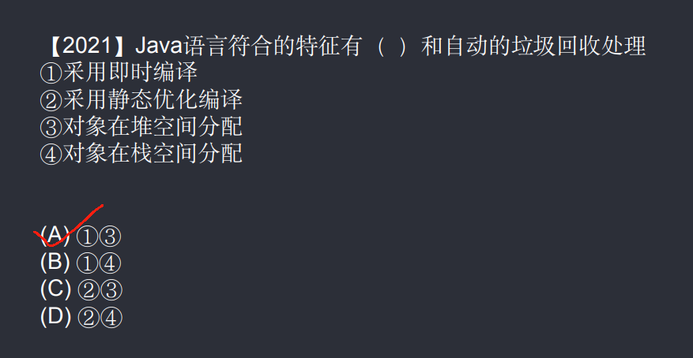

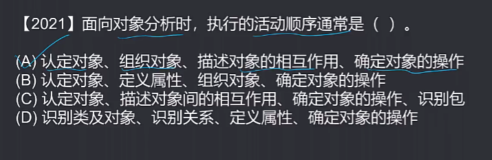

## 二、UML

UML（Unified Modeling Language）是一种用于软件系统设计的建模语言，它在面向对象技术中起着重要的作用。

UML提供了一套丰富的图形符号和标记，用于描述软件系统的结构、行为和交互。常用的UML图包括类图、对象图、序列图、活动图、状态图等。

在面向对象技术中，UML可以用来表示系统的静态结构，例如类的属性和方法、类之间的关系等。类图是最常用的UML图之一，用于表示类和类之间的关系，其中包括继承、关联、聚合、组合等。类图可以帮助开发人员理清系统中各个类的关系，从而更好地进行系统设计和开发。

UML还可以用来表示系统的行为和交互，例如序列图可以展示对象之间的交互流程，活动图可以展示一个系统中的业务流程等。这些图形化的表示方式使得开发人员更容易理解和沟通系统的设计和实现。

### UML的概念

UML（Unified Modeling Language）是一种统一建模语言，与程序设计语言并无直接关系。它是一种独立于编程语言的图形化表示技术，旨在帮助开发人员在软件开发过程中进行系统设计和建模。

与程序设计语言相比，UML更注重于系统的结构、行为和交互的可视化表示。它提供了一套丰富的建模图形，例如类图、对象图、序列图、活动图等，用于描述系统的各个方面。这些图形化的表示方式对于开发团队之间的沟通和理解非常重要，可以帮助开发人员更好地协同工作，并确保他们对系统的设计和实现有一个一致的理解。

与程序设计语言不同，在UML中并没有具体的语法规则和编译步骤。它更像是一种可视化的设计工具，用来辅助开发人员进行系统分析和设计。因此，UML可以与多种编程语言一起使用，例如Java、C++、C#等。开发人员可以根据UML图形表示的设计，使用合适的编程语言进行实现，并按照UML图中定义的结构和行为来开发系统。

UML的三个要素是：

| UML要素    | 描述                                                         |
| ---------- | ------------------------------------------------------------ |
| 基本构造块 | UML提供了一系列的基本构造块，用于描述系统中的各种元素和它们之间的关系。基本构造块包括类、对象、接口、关联、聚合、组合、继承、依赖、泛化等。 |
| 放置规则   | UML定义了一些规则，用于描述如何将基本构造块组合放置在一起，以形成更复杂的结构。例如，类和对象可以组合成包，包可以组合成子系统，子系统可以组合成系统等等。这些规则有助于组织和管理系统的各个部分。 |
| 公共机制   | UML提供了一些公共机制，用于增强语言的表达能力和扩展性。其中包括扩展机制，可以通过定义新的构造块、规则和关系来扩展UML语言。此外，UML还提供了一些标记、备注和注释等机制，用于解释和补充模型的信息。 |

### UML的基本构造

UML的基本构造块包括：事物(对模型中最具有代表性的成分的抽象)、关系(把事务结合在一起)、图(聚集了相关的事物)。

#### 事物

UML中有四种事物：结构事物、行为事物、分组事物、注释事物。

| 结构事物：模型的静态部分，如类、接口、用例、构件等； | 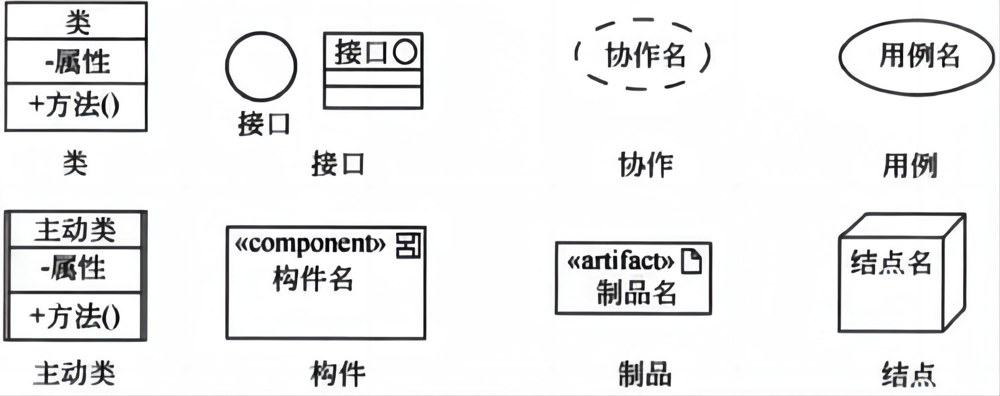 |
| ------------------------------------------------------------ | ------------------------------------------------------------ |
| 行为事物：模型的动态部分，如交互、活动、状态机               | 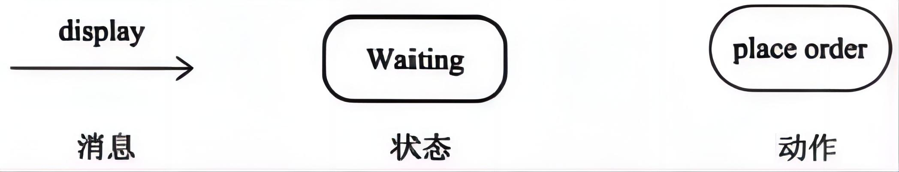 |
| 分组事物：模型的组织部分，如包；                             | 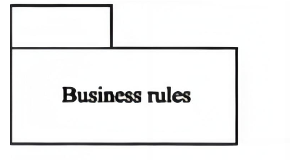 |
| 注释事物：模型的解释部分，依附于一个元素或一组元素之上对其进行约束或解释的简单符号。 | 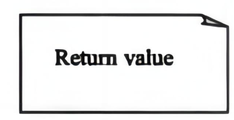 |

#### 关系

依赖：一个事物的语义依赖于另一个事物的语义的变化而变化

关联：是一种结构关系，描述了一组链，链是对象之间的连接。分为组合和聚合，都是部分和整体的关系，其中组合事物之间关系更强。两个类之间的关联，实际上是两个类所扮演角色的关联，因此，两个类之间可以有多个由不同角色标识的关联。

泛化：一般/特殊的关系，子类和父类之间的关系

实现：一个类元指定了另一个类元保证执行的契约。

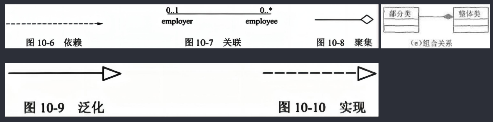

### 图

#### 类图

类图：静态图，为系统的静态设计视图，展现一组**对象、接口、协作和它们之间的关系**。

多重度：指的是不同类之间的联系，类似于数据库设计的表与表的关系。

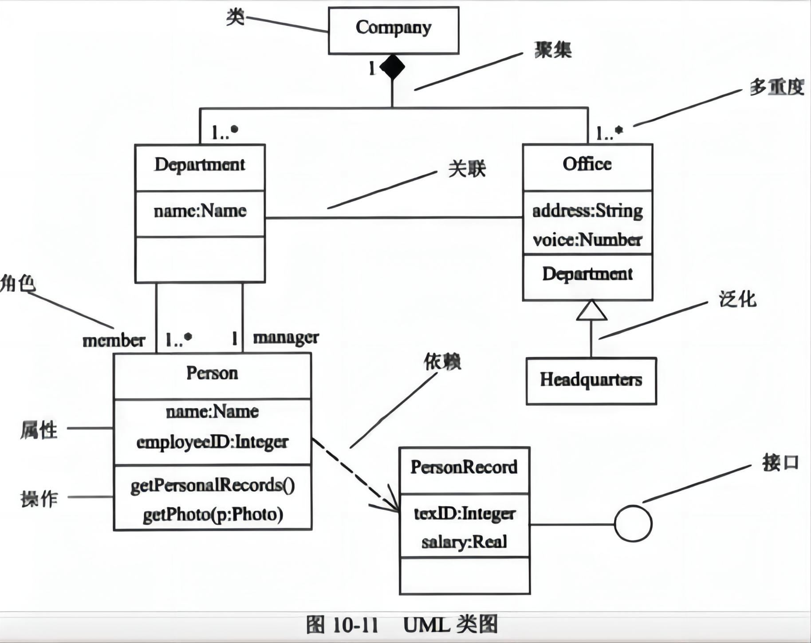

#### 对象图

对象图：静态图，展现**某一时刻一组对象及它们之间的关系**，为类图的某一快照。在没有类图的前提下，对象图就是静态设计视图。

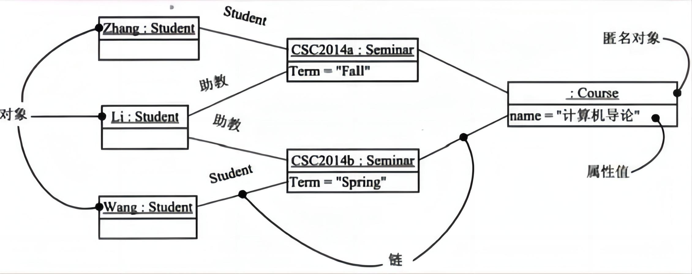

#### 用例图

用例图：静态图，展现了**一组用例、参与者以及它们之间的关系**。

用例图中的参与者是人、硬件或其他系统可以扮演的角色；用例是参与者完成的一系列操作。

用例之间的关系：包含（include）、扩展(extend)、泛化。

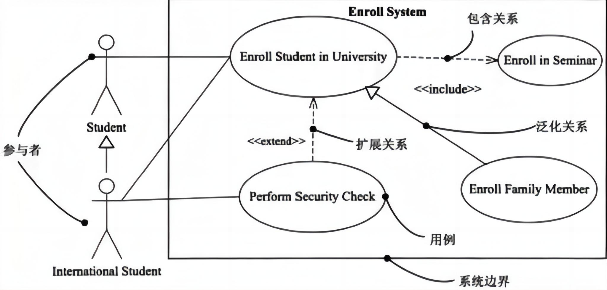

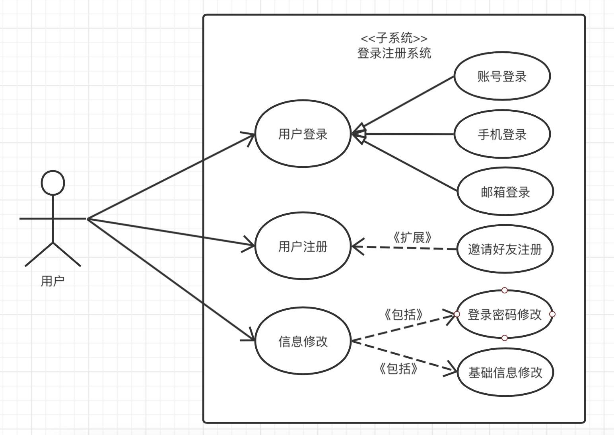

#### 序列图

序列图：即顺序图，动态图，是场景的图形化表示，描述了以**时间顺序组织的对象之间的交互活动**。

有同步消息(进行阻塞调用，调用者中止执行，等待控制权返回，需要等待返回消息，用实心三角箭头表示)、异步消息(发出消息后继续执行，不引起调用者阻塞，也不等待返回消息，由空心箭头表示)、返回消息(由从右到左的虚线箭头表示)三种。

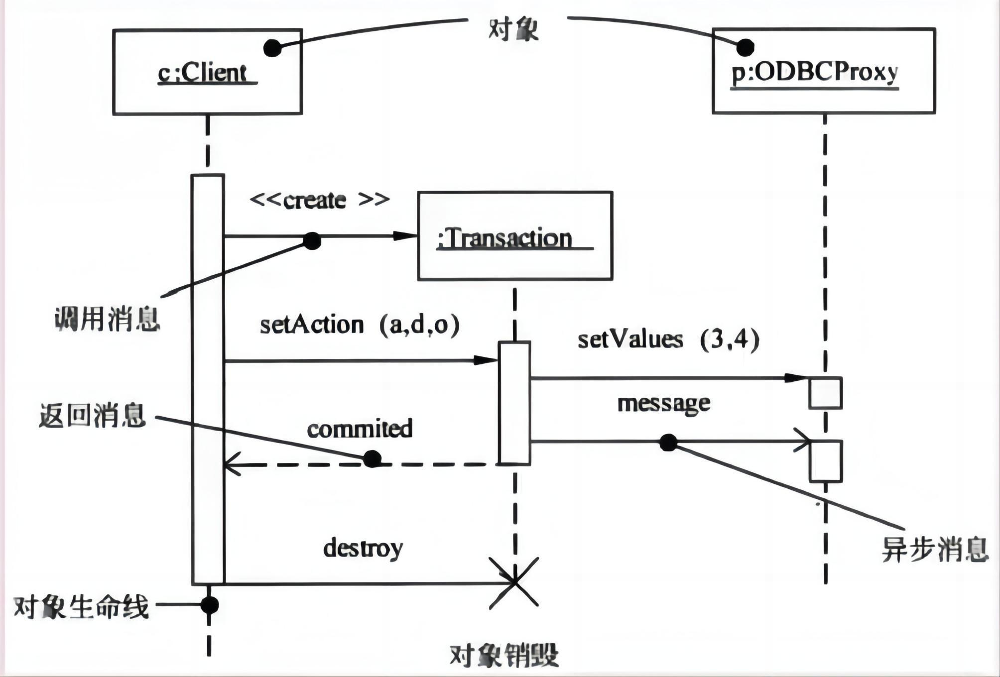

#### 通信图

通信图：动态图，即协作图，是顺序图的另一种表示方法，也是由对象和消息组成的图，只不过不强调时间顺序，**只强调事件之间的通信**，而且也没有固定的画法规则，和顺序图统称为交互图。如下：

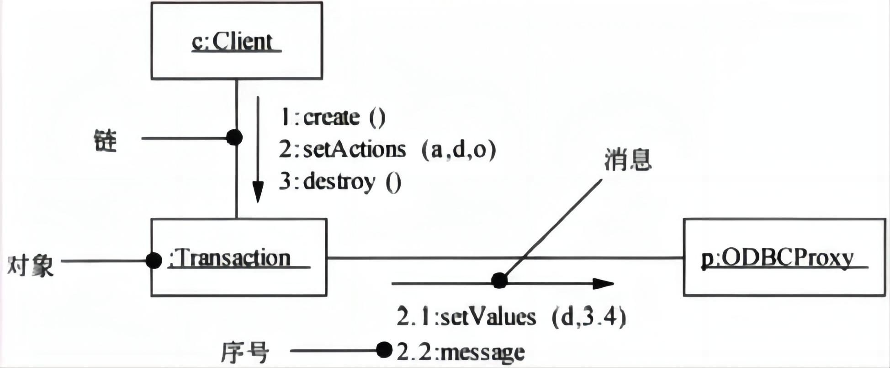

#### 状态图

状态图：动态图，展现了一个状态机，**描述单个对象在多个用例中的行为**，包括简单状态和组合状态。转换可以通过事件触发器触发，事件触发后相应的监护条件会进行检查。

状态图中转换和状态是两个独立的概念，如下：图中方框代表状态，箭头上的代表触发事件，实心圆点为起点和终点。下图描述的就是一个图书的状态变化

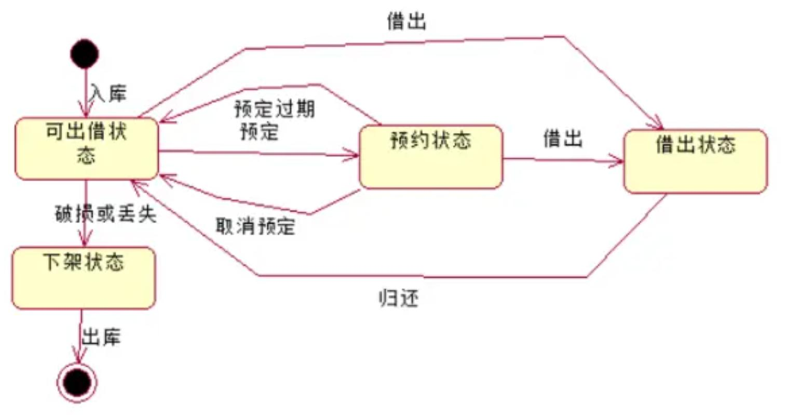

#### 活动图

活动图：动态图，是一种特殊的状态图，**展现了在系统内从一个活动到另二个活动的流程**。

活动的分岔和汇合线是一条水平粗线。

每个分岔的分支数代表了可同时运行的线程数。

活动图中能够并行执行的是在一个分岔粗线下的分支上的活动。

#### 构件图

构件图(组件图):静态图，为系统静态**实现**视图，**展现了一组构件之间的组织和依赖**。

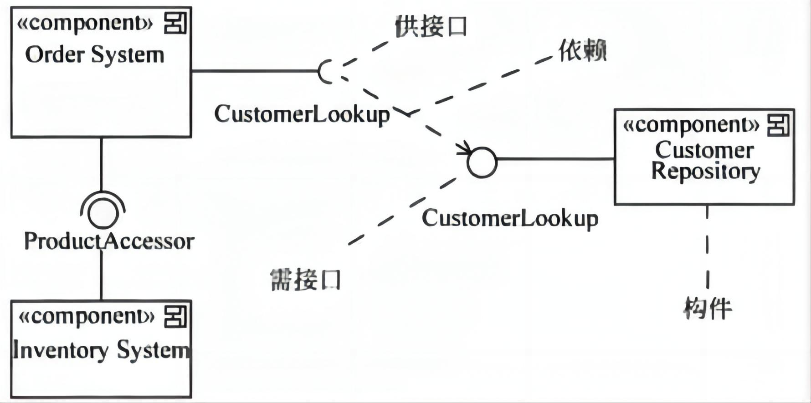

#### 部署图

部署图：静态图，为系统静态部署视图，部署图描述的事**物理模块的节点分布**。它与构件图相关，通常一个结点包含一个或多个构件。其依赖关系类似于包依赖，因此部署组件之间的依赖是单向的类似于包含关系。

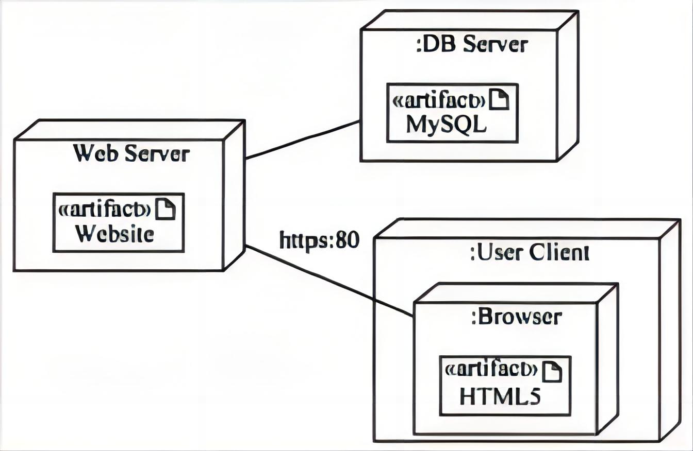

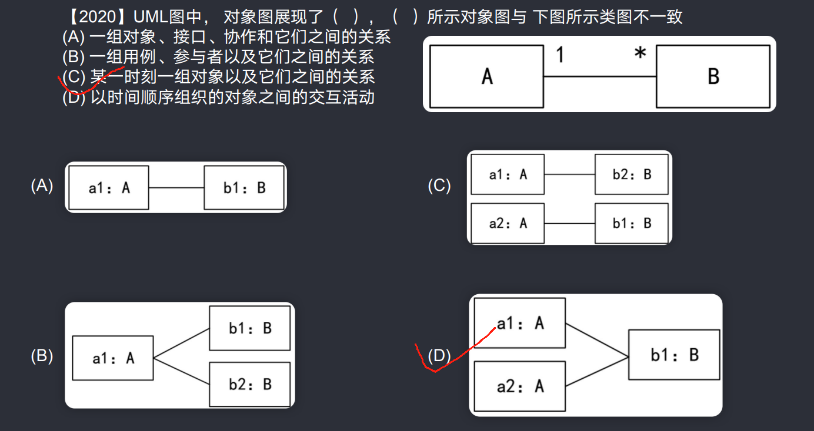

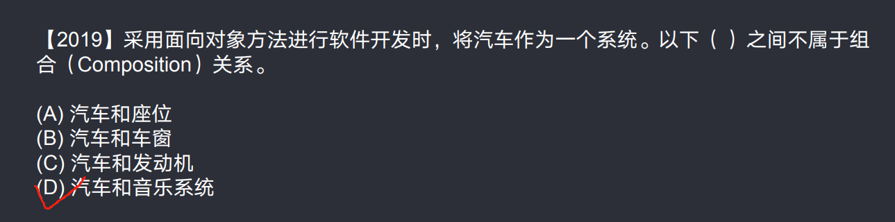

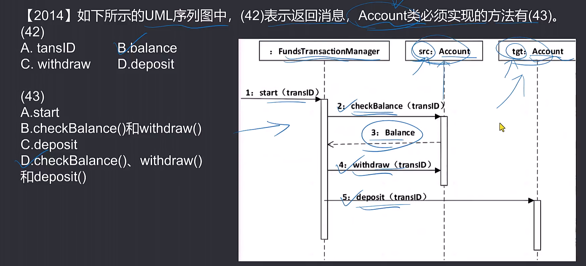

## 三、设计模式

### 设计模式概念

设计模式是在软件设计领域中，为解决常见问题而被反复使用、被广泛认可的一种设计思想。它是一种经过实践验证的，被认为是最佳解决方案的经验总结，可以帮助开发人员快速高效地解决软件设计中的一些固有问题。

每一个设计模式描述了一个在我们周围不断重复发生的问题，以及该问题的解决方案的核心。这样，你就能一次又一次地使用该方案而不必做重复劳动。设计模式的核心在于提供了相关问题的解决方案，使得人们可以更加简单方便的复用成功的设计和体系结构。

设计模式具有以下特点：

| 特点                   | 描述                                                         |
| ---------------------- | ------------------------------------------------------------ |
| 在特定情况下被使用     | 设计模式并不是适用于所有场景的通用解决方案，而是在特定问题领域中被广泛使用的解决方案。 |
| 涉及多种设计元素       | 设计模式涉及到多个设计元素，包括类，对象，接口，继承，组合等等。 |
| 以面向对象方式进行设计 | 设计模式主要是针对面向对象编程而提出的，尽管也可以用于其他编程范式。 |
| 遵循设计原则           | 设计模式往往遵循一些设计原则，如单一职责原则、开闭原则、里氏替换原则等，以提高设计的可维护 |

### 设计模式分类

设计模式的四个基本要素：模式名称、问题(应该在何时使用模式)、解决方案(设计的内容)、效果(模式应用的效果)。

分为三类，创建型模式主要是处理创建对象，结构型模式主要是处理类和对象的组合，行为型模式主要是描述类或者对象的交互行为，具体如下(红色粗体记忆关键字表示常考必须记住的)：

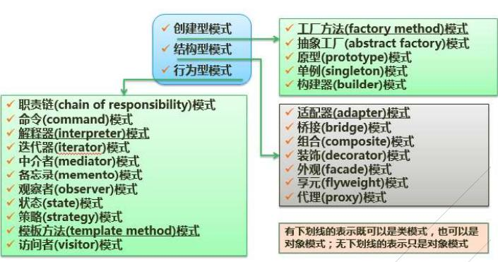

| 类型     | 描述                                                         |
| -------- | ------------------------------------------------------------ |
| 架构模式 | - 软件设计中的高层决策，如C/S结构 - 反映了开发软件系统过程中所作的基本设计决策 |
| 设计模式 | - 描述了一个在我们周围不断重复发生的问题和其解决方案的核心 - 提供了相关问题的解决方案，使得人们可以更加简单方便地复用成功的设计和体系结构 - 包含四个基本要素：模式名称、问题（应该在何时使用模式）、解决方案（设计的内容）、效果（模式应用的效果） |
| 惯用法   | - 最低层的模式，关注软件系统的设计与实现 - 通过特定的编程语言描述构件与构件之间的关系 - 每种编程语言都有自己的惯用法，即语言的特定模式（如C++中的引用计数） |

### 设计模式-创建型

#### 🔎1.工厂模式（Factory Pattern）

工厂模式就像是一家披萨店。你告诉披萨店你想要什么类型的披萨，它会根据你的需求为你制作披萨。在这里，披萨店就是一个工厂，披萨是工厂创建的产品。

举例说明：假设你想要定制一件特别款式的T恤，你可以去一家专门定制服装的工厂。你告诉工厂你需要一件红色的T恤，上面要印有你喜欢的图案。工厂根据你的需求，选择红色的布料，根据你提供的图案进行印花，然后制作出一件定制的T恤。在这个例子中，工厂根据你的需求创建了一件特定款式的产品（定制的T恤），实现了工厂模式。你作为客户只需要提供需求，而无需关心具体的制作过程和细节。

#### 🔎2.单例模式（Singleton Pattern）

单例模式确保一个类只有一个实例，就像一座城市只有一个市长。无论多少人住在这座城市，市长都是唯一的。在生活中，操作系统的任务管理器就是一个单例模式的应用。无论打开多少个任务管理器窗口，它们都指向同一个任务管理器实例。

例如，假设有一个名为"City"的类代表一座城市，其中有一个名为"Mayor"的静态变量用于保存唯一的市长实例。当创建第一个City实例时，该实例的Mayor变量将被设置为一个新的Mayor实例。当尝试创建更多的City实例时，它们将都引用到同一个Mayor实例。

在操作系统中，任务管理器是一个单例模式的应用。无论打开多少个任务管理器窗口，它们都指向同一个任务管理器实例。这意味着无论通过哪个窗口关闭一个进程或查看系统信息，都是在同一个任务管理器实例中进行操作。这种设计能够确保操作系统中的任务管理器始终是唯一和一致的。

#### 🔎3.建造者模式（Builder Pattern）

建造者模式类似于建造一座房子。你可以选择房子的类型、颜色、材料等，并由建筑工人按照你的选择来构建房子。

以工程师为例，假设有一个木制房子构建者和一个砖瓦房子构建者。工程师的任务是根据客户的要求建造不同类型的房子。

例如，客户A需要一座木制房子。工程师会选择木制房子构建者，并使用该构建者的方法来逐步构建木制房子。这包括设置木质墙壁、建造屋顶和安装窗户。

另一个例子是客户B需要一座砖瓦房子。工程师会选择砖瓦房子构建者，并使用该构建者的方法来逐步构建砖瓦房子。这包括砖瓦墙壁、瓦片屋顶和大窗户。

通过使用建造者模式，工程师可以根据客户的需求逐步构建不同类型的房子，而不必亲自处理所有细节。这使得构建过程灵活且可维护，同时允许创建不同风格和材质的房子。

#### 🔎4.原型模式（Prototype Pattern）

原型模式是通过复制现有对象来创建新对象的设计模式。这类似于使用3D打印机复制一件艺术品或零件，可以从一个原型创建出多个相同的物品。

生活中的一个例子是在电影制作中。制片人可以利用原型模式来复制特效道具，这样在不同的场景中就可以使用多个相同的道具。例如，如果电影中需要多个相同的怪物模型，制片人可以使用原型模式来复制并创建多个相同的怪物模型。这样可以节省时间和资源，同时确保每个怪物模型在外观和细节上都保持一致。

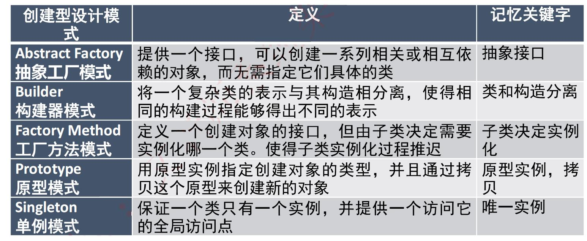

### 设计模式-结构型

结构型设计模式：关注如何将对象和类组合成更大的结构，以便更好地实现系统的整体结构。这些模式有助于解决对象之间的组合、接口和继承等关系，从而提高代码的可扩展性和可维护性。

#### 🔎1.适配器模式（Adapter Pattern）

适配器模式允许不兼容的接口协同工作，就像使用电源适配器将外国电器插头适配到国内插座一样。适配器模式可以使不同的类一起工作。

例如，假设你有一台笔记本电脑，只有一个USB-C接口，但你的打印机只支持USB-A接口。这两个接口是不兼容的，无法直接连接。但你可以使用USB-C到USB-A的适配器来使它们兼容，将适配器插入笔记本电脑的USB-C接口，然后将打印机连接到适配器的USB-A接口。这样，笔记本电脑和打印机就可以一起工作了。

同样地，适配器模式在软件开发中也非常有用。当需要使用一个类，但其接口与现有系统不兼容时，可以创建一个适配器类，将这个类的接口适配到系统所需的接口，从而实现两者的协同工作。

#### 🔎2.桥接模式（Bridge Pattern）

桥接模式分离了一个对象的抽象部分和具体部分，使它们可以独立地变化。这个模式就像一座桥，将两个独立的领域连接起来。

生活中的例子：

假设你想购买一辆汽车，汽车的品牌和颜色是两个独立的变化维度。桥接模式允许你将品牌和颜色抽象出来，使你可以轻松地组合不同品牌和颜色，例如创建一个红色的奥迪或蓝色的宝马。

举例说明：
当你购买一辆汽车时，你可以选择奥迪或宝马作为品牌，也可以选择红色或蓝色作为颜色。使用桥接模式，你可以将品牌和颜色分离出来，形成两个独立的维度。然后，你可以通过组合品牌和颜色选项，创建出不同的汽车组合，比如红色的奥迪或蓝色的宝马。这样，你可以根据自己的需求和喜好，创建出各种不同的汽车组合，而不需要为每个组合都定义一个具体的子类。

这个例子展示了桥接模式的优点，通过将变化的部分抽象出来，并通过桥接模式进行组合，使得对象的抽象和具体部分可以独立地进行变化。这样一来，你可以根据需要扩展品牌和颜色的选项，而不需要修改已有的代码。同时，这也避免了类的爆炸式增长，因为不同的品牌和颜色组合可以通过桥接模式进行动态创建，而不需要在类的继承体系中定义每个组合的具体子类。

#### 🔎3.组合模式（Composite Pattern）

组合模式允许将对象组织成树状结构，使单个对象和组合对象都可以一致地对待。生活中的一个例子是在操作系统中，文件夹可以包含文件和其他文件夹，从而创建了一个树状的组织结构。在这个树状结构中，你可以对文件夹和文件执行相似的操作，例如复制、删除等。

例如，在Windows操作系统中，你可以创建一个名为"根文件夹"的文件夹，然后在它下面创建两个文件夹，分别命名为"文件夹A"和"文件夹B"。在"文件夹A"下，你可以创建两个文件，分别是"文件1"和"文件2"。同样地，在"文件夹B"下，你也可以创建两个文件，分别是"文件3"和"文件4"。

这样，你就创建了一个树状的组织结构，其中"根文件夹"是顶层容器，"文件夹A"和"文件夹B"是其子文件夹，“文件1”、“文件2”、“文件3"和"文件4"是其文件。在这个组织结构中，你可以对"根文件夹”、“文件夹A”、“文件夹B”、“文件1”、“文件2”、“文件3”、"文件4"执行相似的操作，例如复制、删除等。

通过组合模式，我们可以将多个文件夹和文件组织成一个文件系统树，从而方便地管理和操作这些对象。每个对象都可以被视为一个节点，可以通过遍历树的方式来处理整个文件系统。这种设计模式使得单个对象和组合对象具有了一致的接口，提高了代码的复用性和可扩展性。

#### 🔎4.装饰器模式（Decorator Pattern）

装饰器模式允许动态地为对象添加新的功能，而无需修改其源代码。这种方式类似于家中不断添加新的家具或装饰来改善其外观和功能。

例如，假设你有一台智能音响，它可以播放音乐和接收语音指令。现在你想要扩展音响的功能，让它可以查询天气情况和进行音乐播放。使用装饰器模式，你可以添加新的语音助手技能来实现这些功能，而不需要修改音响的核心设计。换句话说，你可以在音响上添加一个天气查询装饰器，用于获取天气信息，并在音响上添加一个音乐播放装饰器，用于播放音乐。这样一来，你可以根据需要随时添加、删除或替换这些装饰器，而不会影响到音响的基本功能。

同样地，可以将这个概念应用到家居装饰中。你可以随时根据需要更换家具或添加新的装饰品来改善家居的外观和功能，而不需要对房屋结构进行修改。例如，你可以添加一个书架来增加存储空间，或者添加一幅画来增加艺术氛围。这些装饰品可以随时更换或移除，而不会对房屋的基本结构产生影响。

#### 🔎5.外观模式（Facade Pattern）

外观模式提供了一个简化的接口，用于访问复杂系统中的一组接口。类比于建筑物的外立面，外观模式隐藏了系统内部的复杂结构，使得用户可以轻松地访问并使用系统。

举个生活中的例子来说明，我们可以看看计算机操作系统中的图形用户界面（GUI）。GUI为用户提供了一个易于使用的外观，隐藏了底层操作系统的复杂性。通过点击图标、打开应用程序等操作，用户可以在不了解操作系统内部工作原理的情况下轻松地使用电脑。就像在一座建筑物中，我们只需要看到外立面上的窗户、门等部分，而不需要了解建筑物内部的复杂结构。

#### 🔎6.享元模式（Flyweight Pattern）

享元模式的目的是通过共享尽可能多的相似对象来最小化内存或计算开销。可以将其类比为在共享办公空间中租用一个工作区，多个人可以共享同一空间，从而减少资源浪费。

举个生活中的例子来说明：在图像编辑软件中，当多个图像元素共享相同的颜色或图案时，可以使用享元模式来减少内存占用。比如若多个图像元素需要使用相同的红色，那么可以创建一个红色的享元对象，并让这些图像元素引用同一个红色的享元对象。这样一来，就不需要为每个图像元素都存储一份相同的红色数据，从而减少了内存占用。

通过使用享元模式，可以有效地减少重复的数据存储，提高系统的性能和效率。

#### 🔎7.代理模式（Proxy Pattern）

代理模式允许一个对象代表另一个对象进行控制访问。类似于聘请一个房产经纪人代表你购买房产的情况，代理模式可以控制对另一个对象的访问。

生活中的例子：

计算机网络中的代理服务器充当客户端和目标服务器之间的中间层，用于缓存、过滤或加速请求，以提供更好的访问控制和性能。例如，你想访问某个网站，但是该网站在你所在地区的访问速度很慢。这时，你可以通过设置代理服务器，让代理服务器帮助你从外地访问该网站，并将请求结果缓存下来，以提高访问速度。这样，你就可以通过代理服务器实现对该网站的更快访问，而不必直接与目标服务器进行通信。

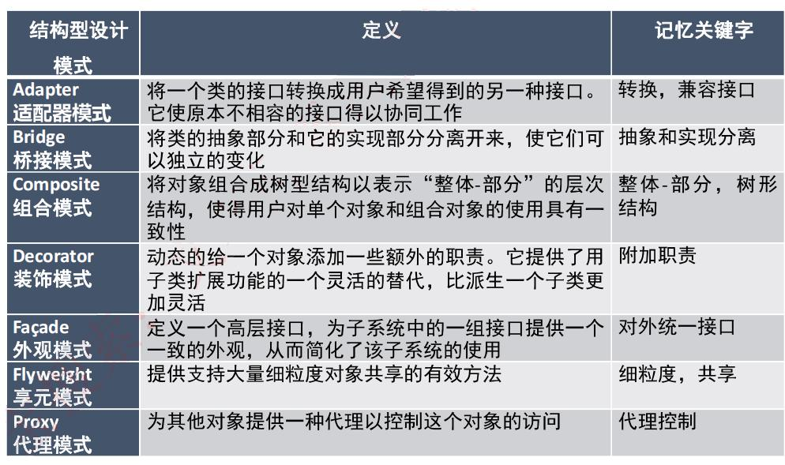

### 设计模式-行为型

行为型设计模式：关注对象之间的通信、职责分配和算法的交互方式。它们帮助我们更好地管理对象之间的关系，使系统更具灵活性和可维护性

#### 🔎1.责任链模式（Chain of Responsibility Pattern）

责任链模式就如同传递请求一样，多个对象按顺序尝试处理请求，直到有一个对象能够处理为止。

生活中的例子：在一个公司中，员工请假申请可能需要经过多个级别的审批，例如部门主管、部门经理和总经理。每个级别的主管都有权决定是否批准员工的请假申请。当员工提交请假申请后，首先会由部门主管进行审批，如果部门主管批准了请假申请，那么流程结束；如果部门主管拒绝了请假申请，那么请假申请会被传递给部门经理进行审批，同样如果部门经理批准了请假申请，流程结束；如果部门经理也拒绝了请假申请，那么请假申请会被传递给总经理进行审批。总经理是最后一个级别的审批者，他的决定是最终决定。这个过程中，如果任何一个级别的主管批准了请假申请，那么就会结束审批流程，否则，请求会一直被传递下去，直到有一个对象能够处理请求为止。

#### 🔎2.命令模式（Command Pattern）

命令模式就像使用遥控器来控制设备。你将命令封装在遥控器按钮中，然后可以随时执行命令。生活中的一个例子是电视遥控器。

通过电视遥控器，你可以执行各种命令，例如打开电视、切换频道或调整音量。当你按下遥控器上的按钮时，电视就会接收到对应的命令，并执行相应的操作。这样，你不需要亲自操作电视机上的按钮或控制面板，只需使用遥控器就可以方便地控制电视。

举个例子，当你想要打开电视时，你可以按下遥控器上的电源按钮。这个按钮上封装了“打开电视”的命令，当你按下按钮时，遥控器会发送这个命令给电视机，电视机就会打开。同样地，如果你想要切换频道，你可以按下对应的频道按钮，这个按钮上封装了相应的“切换频道”的命令，电视就会切换到你想要的频道。

通过命令模式，我们可以将具体的命令与执行命令的对象（比如电视）解耦合，从而实现更灵活的控制。我们可以将各种命令封装在遥控器的按钮中，并在需要时执行这些命令，而无需关心具体是如何执行的。

除了电视遥控器，命令模式还可以应用于其他场景，比如智能家居系统中的遥控器、电梯控制面板等。无论是哪种情况，命令模式都提供了一种方便的方式来控制设备，并将操作命令与具体操作解耦合，提高了系统的可扩展性和灵活性。

#### 🔎3.解释器模式（Interpreter Pattern）

解释器模式用于处理语言解释和编译器等领域。它定义了一种语言的语法表示，并提供了解释器来解释这种语法。在编程中，正则表达式是解释器模式的一个实例，用于匹配和解释字符串模式。

举例来说，假设我们要编写一个程序来验证一个邮箱地址是否合法。我们可以使用正则表达式作为解释器来解释邮箱地址的语法规则。我们可以定义邮箱地址的语法规则，例如：一个合法的邮箱地址应该包含一个@符号和一个域名，而域名又由一个或多个单词组成，每个单词之间用点号(.)分隔。通过编写一个解释器来解释这个语法规则，我们可以对任意的邮箱地址进行验证，判断其是否合法。

例如，我们使用正则表达式解释器来解释邮箱地址的规则：

- 规则1：一个合法的邮箱地址应该包含一个@符号
- 规则2：@符号之前可以有一个或多个字符
- 规则3：@符号之后应该是一个或多个单词，每个单词之间用点号(.)分隔

通过使用解释器模式和正则表达式，我们可以创建一个邮箱地址验证器，输入一个邮箱地址，程序会根据定义的规则进行解释和验证，返回是否合法的结果。

#### 🔎4.迭代器模式（Iterator Pattern）

迭代器模式是一种类似于遍历集合的设计模式。它提供了一种按顺序访问集合元素的方法，而无需直接暴露集合的内部结构。

举个生活中的例子来说明，假设你想要看电视节目表上的所有节目。你可以选择按照时间顺序一个一个地查看节目，这就是使用迭代器模式的一种示例。你无需知道节目表的内部结构，只需按照顺序逐一访问节目即可。

在编程中，迭代器模式同样适用。假设你有一个存储各种数据的集合，例如数组、列表或集合。使用迭代器模式，你可以通过创建一个迭代器对象来遍历集合中的元素，而无需了解底层数据结构。迭代器会按照一定的顺序返回集合中的每个元素，你可以根据需要对每个元素执行特定的操作。这样，你就可以方便地处理集合中的数据，而不用关心具体的数据结构。

#### 🔎5.中介者模式（Mediator Pattern）

中介者模式就像是一个中间人，在多个对象之间协调交互。通过使用中介者模式，可以减少对象之间的直接通信，从而降低耦合度。

一个生活中的例子是在一个团队中，项目经理可以充当中介者的角色。项目经理负责协调团队成员之间的合作和沟通，以确保项目的顺利进行。项目经理作为中介者，可以处理团队成员之间的冲突和协调不同的需求和意见。通过项目经理的介入，团队成员可以专注于自己的任务，而不必直接与其他成员沟通和协调。这样，中介者模式帮助提高了团队的效率和协作能力。

#### 🔎6.备忘录模式（Memento Pattern）

备忘录模式是一种保存和还原状态的设计模式。它允许你保存对象的状态，以便将来可以还原到先前的状态。

生活中的例子可以是在文本编辑器中使用撤销和重做功能。当我们在编辑文本时，可以通过撤销操作回到之前的状态，然后再次使用重做操作恢复到之前的修改。这就是备忘录模式的应用。

#### 🔎7.观察者模式（Observer Pattern）

观察者模式类似于订阅通知。多个观察者（订阅者）订阅主题（发布者），当主题有新信息时，观察者会自动接收通知。

这种模式在生活中有许多例子，比如社交媒体平台。当你关注某个用户或主题时，系统会将他们的更新信息发送给你。举个例子，假设你在Twitter上关注了某个名人，每当这个名人发布新推文时，你会在你的主页上看到他的推文。在这里，你就是观察者，名人是主题，Twitter系统负责将新推文通知给你。

#### 🔎8.状态模式（State Pattern）

状态模式类似于人的不同情绪状态。就像一个人可以处于高兴、生气或伤心等不同的状态一样，每种状态下的行为可能不同。

举个生活中的例子：在自动售货机中，售货机可能有不同的状态，如待机、售卖中、缺货等。每种状态下，售货机的行为都不同。例如，在待机状态下，售货机可能会显示一个欢迎界面，并等待用户选择商品；在售卖中状态下，售货机会接受用户的投币或刷卡，并出货商品；而在缺货状态下，售货机可能会显示一个提示信息，告诉用户该商品暂时缺货。

通过状态模式，售货机可以根据当前的状态灵活地执行不同的行为，使操作更加简便和智能。

#### 🔎9.策略模式（Strategy Pattern）

策略模式类似于根据不同情况选择不同解决方案来解决同一个问题。通过选择不同的策略，我们可以实现相同的目标。

生活中的例子是在旅行规划中。在旅行规划中，我们希望到达一个目的地。然而，我们可以选择使用不同的交通工具作为我们的策略来达到目的地。例如，我们可以选择开车、乘坐火车或乘坐飞机。这些交通工具都是解决相同问题的不同策略。根据不同的情况，我们可以选择适合我们需要的策略来实现我们的目标。

举个例子，假设我们想去一个离我们家很远的城市旅行。如果我们有自己的汽车，那么我们可以选择开车去这个城市。这个策略可以使我们自由地掌控旅行的时间和路线。另一方面，如果我们没有汽车，但是有高速铁路可以直接到达目的地，那么我们可以选择乘坐火车作为我们的策略。如果我们非常着急，希望快速到达目的地，可能会选择乘坐飞机，这样可以更快地到达。无论我们选择哪种交通工具作为策略，我们的目标都是到达目的地，只是选择了不同的策略来实现相同的目标。

这个例子展示了策略模式的思想，通过选择不同的策略来解决相同的问题，我们可以根据不同的情况选择最适合的策略来实现我们的目标。

#### 🔎10.模板方法模式（Template Method Pattern）

模板方法模式就像是定义了一个算法的框架，但允许子类实现其中的一些步骤。在生活中的例子中，烹饪可以是一个使用模板方法模式的场景。假设我们有一个烹饪系统，其中有一个抽象的Cook类，它定义了一个烹饪方法cooking()。这个烹饪方法包含了一些固定的步骤，如准备、烹饪和装盘。

具体的烹饪步骤和材料可能因每道菜而异。因此，我们可以创建具体的子类，如SteakCook和PastaCook，来实现这些具体的步骤。子类可以重写cooking()方法中的一些步骤，以符合它们具体的烹饪需求。

举个例子，假设我们有一个SteakCook子类。在它的cooking()方法中，它可以重写准备步骤，使用牛排所需的材料和方法。然后，它可以继续使用Cook类的烹饪和装盘步骤，因为这些步骤在制作任何菜肴时都是相同的。

另一方面，如果我们有一个PastaCook子类，它可以重写烹饪步骤，使用面条和调味料。然后，它可以继续使用Cook类的准备和装盘步骤。

通过使用模板方法模式，我们可以在一个抽象类中定义共享的算法框架，但允许子类根据自己的需要实现和定制其中的一些步骤。这样，我们可以避免重复的代码，并提供灵活性和可扩展性。

#### 🔎11.访问者模式（Visitor Pattern）

访问者模式类似于访问不同类型的元素。你可以定义不同的访问者来执行不同类型元素的操作。

举一个生活中的例子来说明：在一个图书馆里，可能有各种不同类型的书籍，比如小说、科普书和艺术书。不同类型的书籍可能需要不同类型的读者来浏览和理解。

在这个例子中，访问者可以是不同类型的读者，例如一个文学爱好者可以是访问者，他对小说感兴趣并懂得如何欣赏文学作品。另外，一个科学爱好者也可以是访问者，他对科普书感兴趣并能够理解科学知识。还有一个艺术爱好者，他可以是访问者，他喜欢欣赏艺术书中的绘画和设计。

通过定义不同类型的访问者，我们可以针对不同类型的书籍执行不同的操作。比如，文学爱好者可以读取小说中的故事情节和对话，并欣赏其中的文学技巧。科学爱好者可以阅读科普书中的科学原理和实验，并从中获取科学知识。艺术爱好者可以欣赏艺术书中的绘画作品，并了解艺术家的创作思想和技巧。

通过访问者模式，我们可以让不同类型的访问者来访问不同类型的书籍，从而实现对元素的不同操作。这样，每个访问者可以专注于自己擅长的领域，并且可以灵活地添加新的访问者和元素，以适应不断变化的需求。

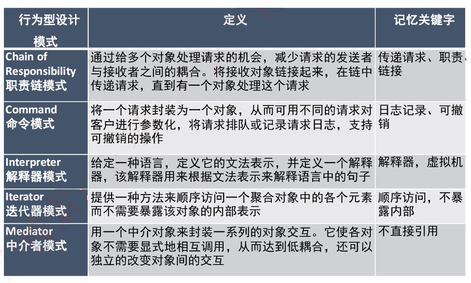
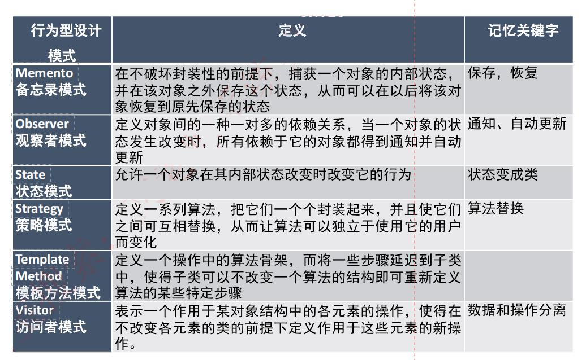

### 例题

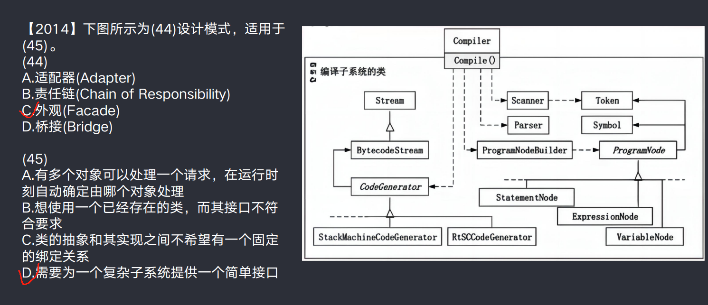
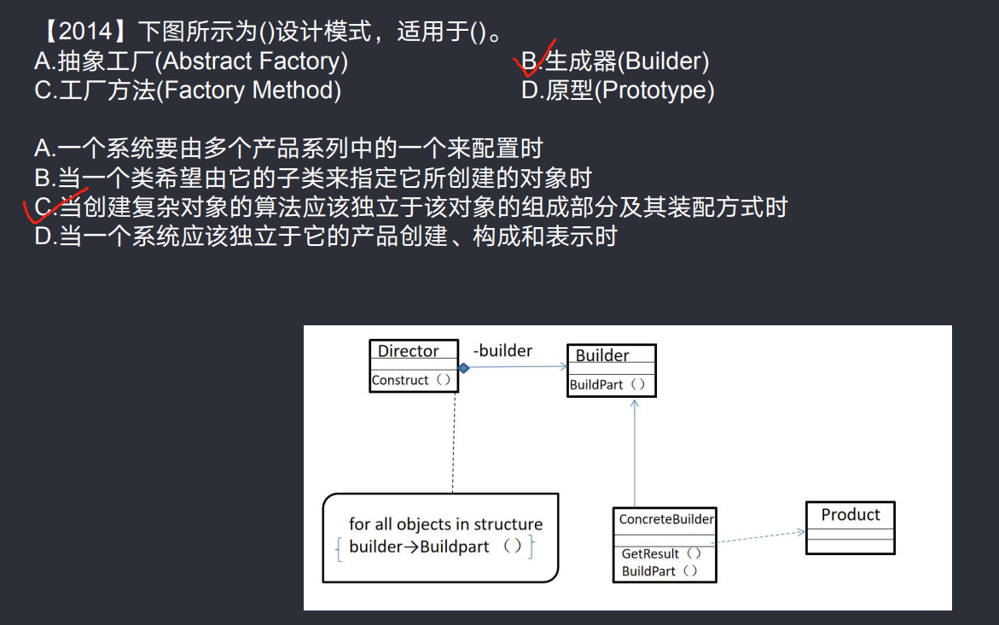
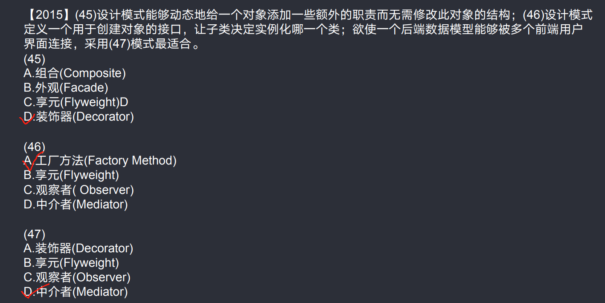
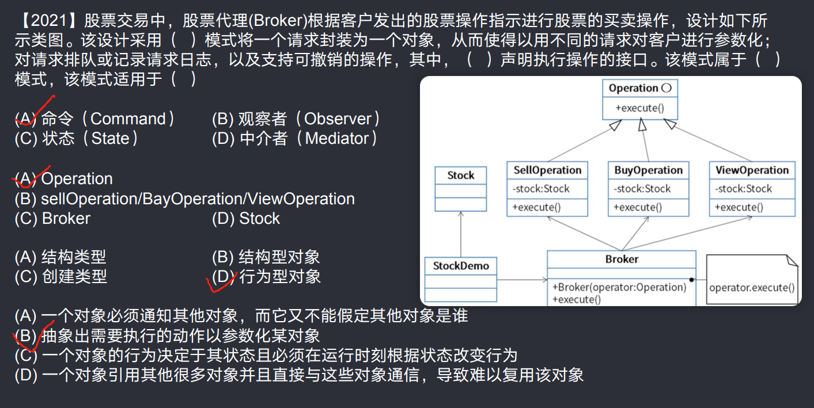