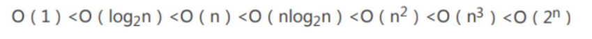
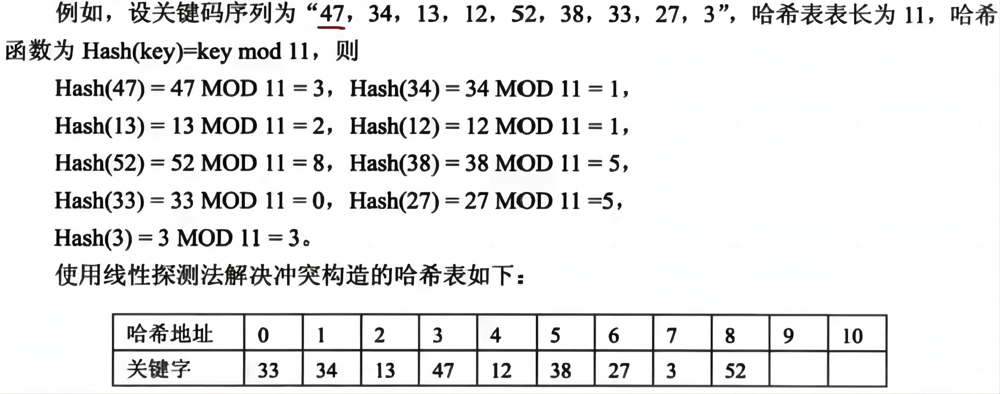
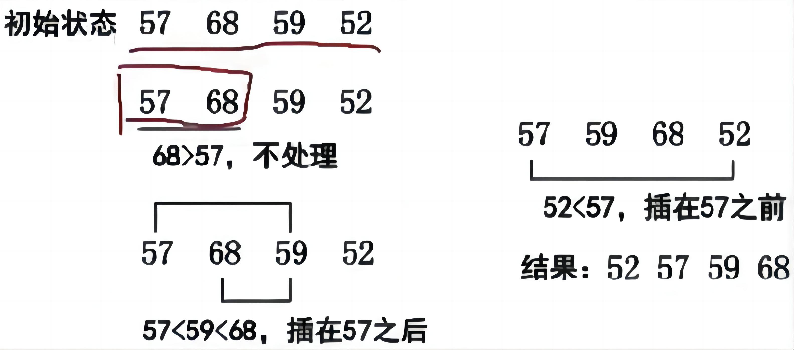
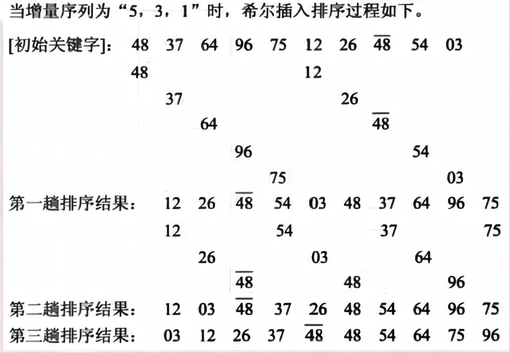

## 算法基础

### 算法基础知识

算法的五个重要特性：

- 有穷性
- 确定性
- 可行性
- 输入：0或多个
- 输出：一个或多个

### 算法分析基础

算法复杂性包括两个方面，一个是算法效率的度量（时间复杂度），一个是算法运行所需要的计算机资源量的度量（空间复杂度），这也是评价算法优劣的重要依据。

#### 时间复杂度

一个程序的时间复杂度是指程序运行从开始到结束所需要的时间。通常分析时间复杂度的方法是从算法中选取一种对于所研究的问题来说是基本运算的操作，以该操作重复执行的次数作为算法的时间度量。一般来说，算法中原操作重复执行的次数是规模n的某个函数T（n）。由于许多情况下要精确计算T（n）是困难的，因此引入了渐进时间复杂度在数量上估计一个算法的执行时间。

我们通常使用"O（）"来表示时间复杂度，其定义如下：如果存在两个正常数c和m，对于所有的n，当n≥m时有f（n）≤cg（n），则有f（n）=O（g（n））也就是说，随着n的增大，f（n）渐进地不大于g（n）。例如，一个程序的实际执行时间为3n^3+2n^2+n,则T（n）=O（n^3）。T（n）和n^3的值随n的增长渐近地靠拢。常见的渐进时间复杂度有：

#### 空间复杂度

一个程序的空间复杂度是指程序运行从开始到结束所需的存储量。它通常包括固定部分和可变部分两个部分。

在算法的分析与设计中，经常会发现时间复杂度和空间复杂度之间有着微妙的关系，经常可以相互转换，也就是可以利用空间来换时间，也可以用时间来换空间。

## 查找算法

### 顺序查找

将待查找的关键字为key的元素从头到尾与表中元素进行比较，如果中间存在关键字为key的元素，则返回成功；否则，则查找失败。
时间复杂度为O（n）。

### 折半（二分）查找

前提是数据要按照递增/递减排好序

设查找表的元素存储在一维数组r[1…n]中，在表中元素已经按照关键字递增方式排序的情况下，进行折半查找的方法是：
1、首先将待查元素的关键字（key）值与表r中间位置上（下标为mid)记录的关键字进行比较，若相等，则查找成功；
2、若key>r[mid].key，则说明待查记录只可能在后半个子表r[mid+1…n]中，下一步应在后半个子表中查找；
3、若key<r[mid].key，说明待查记录只可能在前半个子表r[1…mid-1]中，下一步应在r的前半个子表中查找；
4、重复上述步骤，逐步缩小范围，直到查找成功或子表为空失败时为止。
要注意两点：中间值位置求出若为小数，应该向下取整，即4.5=4，非四舍五入；中间值已经比较过不相等，在划分下一次比较区间时，无需将中间值位置再纳入下一次比较区间。当查找的数据越多时，二分查找的效率越高。

前面的查找方法，由于记录在存储结构中的相对位置是随机的，所以查找时都要通过一系列与关键字的比较才能确定被查记录在表中的位置。也就是说，这类查找都是以关键字的比较为基础的，而哈希表则通过一个以记录的关键字为自变量的函数（称为哈希函数）得到该记录的存储地址，所以在哈希表中进行查找操作时，需要用同一哈希函数计算得到待查记录的存储地址，然后到相应的存储单元去获得有关信息再判定查找是否成功。

### 散列（哈希）表

哈希查找（Hash Search）也被称为散列查找，是一种根据关键字直接进行访问的查找技术，具有快速查找的特点。哈希查找的基本思路是通过哈希函数将关键字映射到一个固定的位置，称为哈希地址。利用哈希地址来直接访问目标数据。

时间复杂度：

- 插入和查找的时间复杂度都为O(1)，即常数时间复杂度。这是因为哈希函数的设计使得每个关键字都能映射到唯一的哈希地址，因此可以直接在哈希地址对应的列表中进行操作。在没有冲突的情况下，插入和查找操作都只需要一次哈希映射和一次遍历操作即可完成。

在上图中，很明显，哈希函数产生了冲突，使用的是线性探测法解决冲突，还有其他方法如下：

- 线性探测法：按物理地址顺序取下一个空闲的存储空间。
- 伪随机数法：将冲突的数据随机存入任意空闲的地址中。
- 再散列法：原有的散列函数冲突后，继续用此数据计算另外一个哈希函数，用以解决冲突。

## 排序

### 分类

稳定与不稳定排序：依据是两个相同的值在一个待排序序列中的顺序和排序后的顺序应该是相对不变的，即开始时21在21前，那排序结束后，若该21还在21前，则为稳定排序，不改变相同值的相对顺序。
内排序和外排序：依据排序是在内存中进行的还是在外部进行的。

排序的算法有很多，大致可以分类如下：

- 插入类排序：直接插入排序、希尔排序。
- 交换类排序：冒泡排序、快速排序。
- 选择类排序：简单选择排序、堆排序。
- 归并排序。
- 基数排序。

排序算法简介

1. 冒泡排序（Bubble Sort）：依次比较相邻的两个元素，将较大的元素交换到后面，每一轮比较都将最大的元素放到最后。时间复杂度为O(n^2)。
2. 选择排序（Selection Sort）：每次从待排序的元素中选取最小的元素，放置在已排序的末尾。时间复杂度为O(n^2)。
3. 插入排序（Insertion Sort）：将待排序的元素插入到已排序的序列中的适当位置，使得插入后仍然有序。时间复杂度平均为O(n^2)，最好情况下为O(n)，最坏情况下为O(n^2)。
4. 希尔排序（Shell Sort）：是插入排序的一种改进，通过将序列分组，每次对分组进行插入排序，然后逐步缩小分组的规模，最终完成排序。时间复杂度为O(nlogn)。
5. 归并排序（Merge Sort）：将序列不断地分割成两半，对每一半进行排序，然后合并两个已排序的子序列，最终完成排序。时间复杂度为O(nlogn)。
6. 快速排序（Quick Sort）：通过一趟排序将序列分成独立的两部分，其中一部分所有元素都比另一部分小，然后再对这两部分递归地进行快速排序。时间复杂度平均为O(nlogn)，最坏情况下为O(n^2)。
7. 堆排序（Heap Sort）：将待排序的序列构建成一个大顶堆，然后将堆顶元素与最后一个元素交换，再对剩余的n-1个元素进行调整，循环执行以上步骤，最终完成排序。时间复杂度为O(nlogn)。
8. 计数排序（Counting Sort）：统计待排序序列中每个元素的出现次数，然后根据元素的值从小到大依次输出。时间复杂度为O(n+k)，其中k表示序列中元素的范围。
9. 桶排序（Bucket Sort）：将待排序的元素映射到一个有限数量的桶中，每个桶再分别进行排序，最后将所有桶中的元素按次序合并成有序序列。时间复杂度为O(n+k)，其中k表示桶的数量。
10. 基数排序（Radix Sort）：将待排序的元素从低位到高位依次进行排序，每一位都使用一种稳定的排序算法（如计数排序或桶排序）。时间复杂度为O(d(n+k))，其中d表示元素的最大位数，k表示每一位的可能取值范围。

### 直接插入排序

直接插入排序是一种简单直观的排序算法，它的思想是将一个序列分为有序和无序两部分，每次从无序部分中取出一个元素，插入到有序部分的正确位置上，直到整个序列有序为止。

具体步骤如下：

1. 将序列分为有序和无序两部分，初始时有序部分只有一个元素（即序列的第一个元素），无序部分包括剩余的元素。
2. 从无序部分中取出一个元素，记为待插入元素。
3. 将待插入元素与有序部分的元素进行比较，找到待插入元素在有序部分的正确位置。
4. 将有序部分中大于待插入元素的元素后移一位，腾出位置给待插入元素。
5. 将待插入元素放入正确位置。
6. 重复步骤2到步骤5，直到无序部分为空。

时间复杂度：

- 最好情况下，当序列已经有序时，直接插入排序的时间复杂度为O(n)，因为只需遍历一次序列。
- 最坏情况下，当序列逆序时，直接插入排序的时间复杂度为O(n^2)，因为要进行n次插入操作，每次插入操作的时间复杂度为O(n)。
- 平均情况下，直接插入排序的时间复杂度也为O(n^2)。

### 希尔排序

希尔排序是一种基于插入排序的排序算法，也称为缩小增量排序。它通过逐步减小增量的方式分组并对元素进行比较和交换，最终实现整体的有序。

希尔排序的算法步骤如下：

1. 选择一个增量序列，常用的是希尔增量序列，即初始增量gap为数组长度的一半，然后每次将gap缩小一半，直到gap为1。
2. 对每个增量间隔进行插入排序。从第gap个元素开始，将其与之前的元素进行比较，如果前面的元素更大，则将其向后移动gap个位置。重复这个过程直到无法向前移动为止。
3. 缩小增量，重新进行插入排序，直到最后一次增量为1，即进行最后一次插入排序，此时整个数组已经是有序的了。

时间复杂度：

- 希尔排序的时间复杂度取决于选取的增量序列，最好的情况下可以达到O(nlogn)，
- 最坏的情况下为O(n^2)。

## 参考资料

视频

希赛网

文字版

https://cloud.tencent.com/developer/article/2385825

https://cloud.tencent.com/developer/article/2387285

https://blog.csdn.net/chengsw1993/article/details/125714839