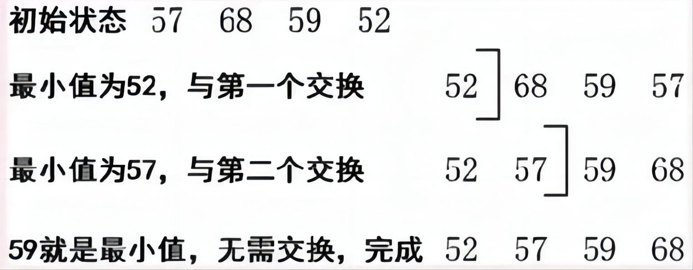
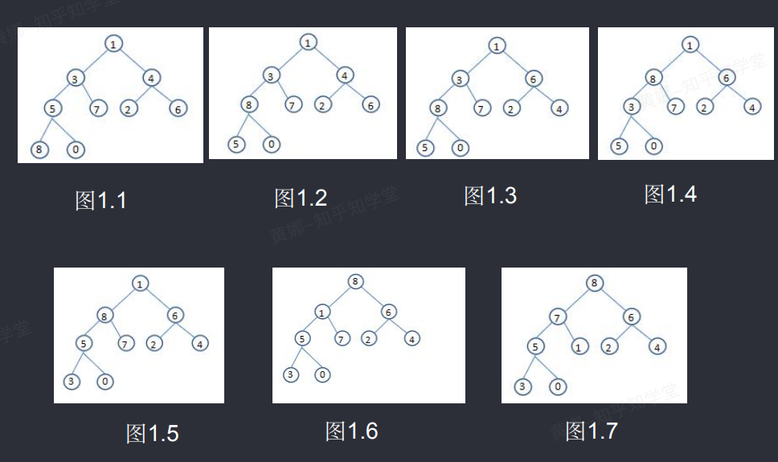
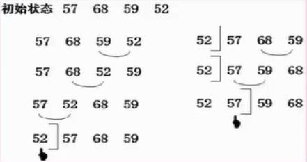
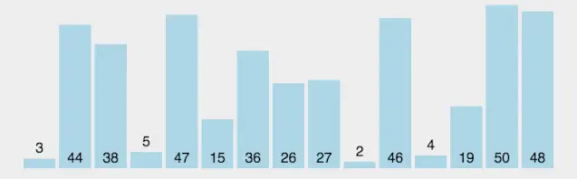
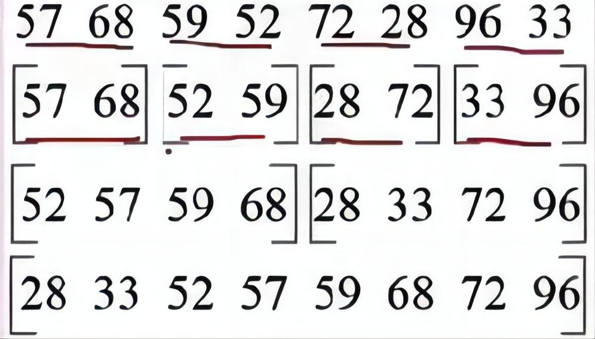
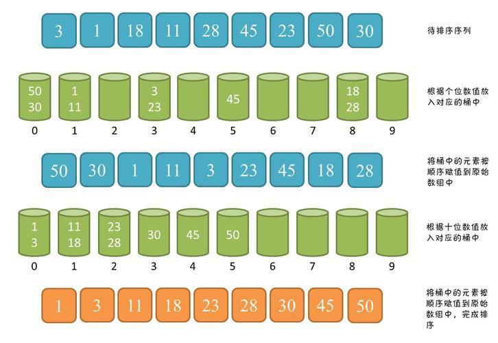
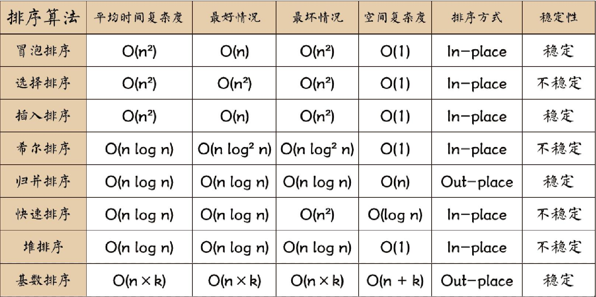

---

---

## 算法基础

### 算法基础知识

算法的五个重要特性：

- 有穷性
- 确定性
- 可行性
- 输入：0或多个
- 输出：一个或多个

### 算法分析基础

算法复杂性包括两个方面，一个是算法效率的度量（时间复杂度），一个是算法运行所需要的计算机资源量的度量（空间复杂度），这也是评价算法优劣的重要依据。

#### 时间复杂度

一个程序的时间复杂度是指程序运行从开始到结束所需要的时间。通常分析时间复杂度的方法是从算法中选取一种对于所研究的问题来说是基本运算的操作，以该操作重复执行的次数作为算法的时间度量。一般来说，算法中原操作重复执行的次数是规模n的某个函数T（n）。由于许多情况下要精确计算T（n）是困难的，因此引入了渐进时间复杂度在数量上估计一个算法的执行时间。

我们通常使用"O（）"来表示时间复杂度，其定义如下：如果存在两个正常数c和m，对于所有的n，当n≥m时有f（n）≤cg（n），则有f（n）=O（g（n））也就是说，随着n的增大，f（n）渐进地不大于g（n）。例如，一个程序的实际执行时间为3n^3+2n^2+n,则T（n）=O（n^3）。T（n）和n^3的值随n的增长渐近地靠拢。常见的渐进时间复杂度有：

#### 空间复杂度

一个程序的空间复杂度是指程序运行从开始到结束所需的存储量。它通常包括固定部分和可变部分两个部分。

在算法的分析与设计中，经常会发现时间复杂度和空间复杂度之间有着微妙的关系，经常可以相互转换，也就是可以利用空间来换时间，也可以用时间来换空间。

## 查找算法

### 顺序查找

将待查找的关键字为key的元素从头到尾与表中元素进行比较，如果中间存在关键字为key的元素，则返回成功；否则，则查找失败。
时间复杂度为O（n）。

### 折半（二分）查找

前提是数据要按照递增/递减排好序

设查找表的元素存储在一维数组r[1…n]中，在表中元素已经按照关键字递增方式排序的情况下，进行折半查找的方法是：
1、首先将待查元素的关键字（key）值与表r中间位置上（下标为mid)记录的关键字进行比较，若相等，则查找成功；
2、若key>r[mid].key，则说明待查记录只可能在后半个子表r[mid+1…n]中，下一步应在后半个子表中查找；
3、若key<r[mid].key，说明待查记录只可能在前半个子表r[1…mid-1]中，下一步应在r的前半个子表中查找；
4、重复上述步骤，逐步缩小范围，直到查找成功或子表为空失败时为止。
要注意两点：中间值位置求出若为小数，应该向下取整，即4.5=4，非四舍五入；中间值已经比较过不相等，在划分下一次比较区间时，无需将中间值位置再纳入下一次比较区间。当查找的数据越多时，二分查找的效率越高。

前面的查找方法，由于记录在存储结构中的相对位置是随机的，所以查找时都要通过一系列与关键字的比较才能确定被查记录在表中的位置。也就是说，这类查找都是以关键字的比较为基础的，而哈希表则通过一个以记录的关键字为自变量的函数（称为哈希函数）得到该记录的存储地址，所以在哈希表中进行查找操作时，需要用同一哈希函数计算得到待查记录的存储地址，然后到相应的存储单元去获得有关信息再判定查找是否成功。

### 散列（哈希）表

哈希查找（Hash Search）也被称为散列查找，是一种根据关键字直接进行访问的查找技术，具有快速查找的特点。哈希查找的基本思路是通过哈希函数将关键字映射到一个固定的位置，称为哈希地址。利用哈希地址来直接访问目标数据。

时间复杂度：

- 插入和查找的时间复杂度都为O(1)，即常数时间复杂度。这是因为哈希函数的设计使得每个关键字都能映射到唯一的哈希地址，因此可以直接在哈希地址对应的列表中进行操作。在没有冲突的情况下，插入和查找操作都只需要一次哈希映射和一次遍历操作即可完成。

在上图中，很明显，哈希函数产生了冲突，使用的是线性探测法解决冲突，还有其他方法如下：

- 线性探测法：按物理地址顺序取下一个空闲的存储空间。
- 伪随机数法：将冲突的数据随机存入任意空闲的地址中。
- 再散列法：原有的散列函数冲突后，继续用此数据计算另外一个哈希函数，用以解决冲突。

## 排序算法

### 排序算法分类

稳定与不稳定排序：依据是两个相同的值在一个待排序序列中的顺序和排序后的顺序应该是相对不变的，即开始时21在21前，那排序结束后，若该21还在21前，则为稳定排序，不改变相同值的相对顺序。
内排序和外排序：依据排序是在内存中进行的还是在外部进行的。

排序的算法有很多，大致可以分类如下：

- 插入类排序：直接插入排序、希尔排序。
- 交换类排序：冒泡排序、快速排序。
- 选择类排序：简单选择排序、堆排序。
- 归并排序。
- 基数排序。

排序算法简介

1. 冒泡排序（Bubble Sort）：依次比较相邻的两个元素，将较大的元素交换到后面，每一轮比较都将最大的元素放到最后。时间复杂度为O(n^2)。
2. 选择排序（Selection Sort）：每次从待排序的元素中选取最小的元素，放置在已排序的末尾。时间复杂度为O(n^2)。
3. 插入排序（Insertion Sort）：将待排序的元素插入到已排序的序列中的适当位置，使得插入后仍然有序。时间复杂度平均为O(n^2)，最好情况下为O(n)，最坏情况下为O(n^2)。
4. 希尔排序（Shell Sort）：是插入排序的一种改进，通过将序列分组，每次对分组进行插入排序，然后逐步缩小分组的规模，最终完成排序。时间复杂度为O(nlogn)。
5. 归并排序（Merge Sort）：将序列不断地分割成两半，对每一半进行排序，然后合并两个已排序的子序列，最终完成排序。时间复杂度为O(nlogn)。
6. 快速排序（Quick Sort）：通过一趟排序将序列分成独立的两部分，其中一部分所有元素都比另一部分小，然后再对这两部分递归地进行快速排序。时间复杂度平均为O(nlogn)，最坏情况下为O(n^2)。
7. 堆排序（Heap Sort）：将待排序的序列构建成一个大顶堆，然后将堆顶元素与最后一个元素交换，再对剩余的n-1个元素进行调整，循环执行以上步骤，最终完成排序。时间复杂度为O(nlogn)。
8. 计数排序（Counting Sort）：统计待排序序列中每个元素的出现次数，然后根据元素的值从小到大依次输出。时间复杂度为O(n+k)，其中k表示序列中元素的范围。
9. 桶排序（Bucket Sort）：将待排序的元素映射到一个有限数量的桶中，每个桶再分别进行排序，最后将所有桶中的元素按次序合并成有序序列。时间复杂度为O(n+k)，其中k表示桶的数量。
10. 基数排序（Radix Sort）：将待排序的元素从低位到高位依次进行排序，每一位都使用一种稳定的排序算法（如计数排序或桶排序）。时间复杂度为O(d(n+k))，其中d表示元素的最大位数，k表示每一位的可能取值范围。

### 直接插入排序（插入类）

直接插入排序是一种简单直观的排序算法，它的思想是将一个序列分为有序和无序两部分，每次从无序部分中取出一个元素，插入到有序部分的正确位置上，直到整个序列有序为止。

具体步骤如下：

1. 将序列分为有序和无序两部分，初始时有序部分只有一个元素（即序列的第一个元素），无序部分包括剩余的元素。
2. 从无序部分中取出一个元素，记为待插入元素。
3. 将待插入元素与有序部分的元素进行比较，找到待插入元素在有序部分的正确位置。
4. 将有序部分中大于待插入元素的元素后移一位，腾出位置给待插入元素。
5. 将待插入元素放入正确位置。
6. 重复步骤2到步骤5，直到无序部分为空。

时间复杂度：

- 最好情况下，当序列已经有序时，直接插入排序的时间复杂度为O(n)，因为只需遍历一次序列。
- 最坏情况下，当序列逆序时，直接插入排序的时间复杂度为O(n^2)，因为要进行n次插入操作，每次插入操作的时间复杂度为O(n)。
- 平均情况下，直接插入排序的时间复杂度也为O(n^2)。

| 直接插入排序—示例         |  |
| --------------------------------------------------------- | :----------------------------------------------------------- |
| **直接插入排序—动态示例** |  |

### 希尔排序（插入类）

希尔排序是一种基于插入排序的排序算法，也称为缩小增量排序。它通过逐步减小增量的方式分组并对元素进行比较和交换，最终实现整体的有序。

希尔排序的算法步骤如下：

1. 选择一个增量序列，常用的是希尔增量序列，即初始增量gap为数组长度的一半，然后每次将gap缩小一半，直到gap为1。
2. 对每个增量间隔进行插入排序。从第gap个元素开始，将其与之前的元素进行比较，如果前面的元素更大，则将其向后移动gap个位置。重复这个过程直到无法向前移动为止。
3. 缩小增量，重新进行插入排序，直到最后一次增量为1，即进行最后一次插入排序，此时整个数组已经是有序的了。

时间复杂度：

- 希尔排序的时间复杂度取决于选取的增量序列，最好的情况下可以达到O(nlogn)，
- 最坏的情况下为O(n^2)。

| 希尔排序—示例         |  |
| ----------------------------------------------------- | ------------------------------------------------------------ |
| **希尔排序—动态示例** |  |

### 简单选择排序（选择类）

简单选择排序是一种简单直观的排序算法，它的基本思想是每次从待排序的数据中选择最小（或最大）的元素，然后放到已排序序列的末尾，直至所有元素排序完毕。

具体的排序过程如下：

1. 从待排序序列中，找到关键字最小的元素。
2. 如果最小元素不是待排序序列的第一个元素，将其和第一个元素互换位置。
3. 从剩余的待排序序列中，继续找到关键字最小的元素，重复步骤2。
4. 重复步骤2和步骤3，直到待排序序列中只剩下一个元素。

时间复杂度为：

简单选择排序的时间复杂度为O(n^2)，其中n为待排序序列的长度。虽然简单选择排序的时间复杂度较高，但对于小规模的数据排序还是比较高效的。

| 简单选择排序—示例         |  |
| --------------------------------------------------------- | ------------------------------------------------------------ |
| **简单选择排序—动态示例** |  |

### 堆排序（选择类）

堆排序是一种基于二叉堆数据结构的排序算法。它的时间复杂度为O(nlogn)，空间复杂度为O(1)。

堆排序的具体步骤如下：

1. 将待排序序列构建成一个大顶堆（或小顶堆），从最后一个非叶子节点开始，自下而上地进行堆调整。
2. 交换堆顶元素（最大值或最小值）和堆中最后一个元素。
3. 从根节点开始，自上而下地进行堆调整，保持堆的性质。
4. 重复步骤2和步骤3，直到堆中只剩下一个元素。

堆排序适用于在多个元素中找出前几名的方案设计，因为堆排序是选择排序，而且选择出前几名的效率很高。

| 堆排序—示例         |  |
| --------------------------------------------------- | ------------------------------------------------------------ |
| **堆排序—动态示例** |  |

### 冒泡排序（交换类）

冒泡排序是一种简单直观的排序算法。它重复地遍历要排序的列表，通过比较相邻元素并交换它们，将列表中的最大元素逐渐“冒泡”到列表的末尾。在每一次遍历中，比较相邻的两个元素，如果它们的顺序不正确，则交换它们的位置。重复这个过程，直到整个列表排序完成。

具体算法步骤如下：

1. 比较相邻的两个元素，如果它们的顺序不正确，则交换它们的位置。
2. 对每一对相邻的元素重复步骤1，直到最后一对元素。
3. 重复步骤1和步骤2，直到没有需要交换的元素，即列表已经有序。

冒泡排序的时间复杂度为O(n\^2)，其中n是列表的长度。由于每次遍历都会将当前未排序部分的最大元素“冒泡”到末尾，因此需要遍历n次。每次遍历中需要比较相邻的元素并可能交换它们的位置，最坏情况下需要比较和交换(n-1)次，因此总的比较和交换次数为n*(n-1)/2，即O(n^2)。

冒泡排序是一种稳定的排序算法，即相等元素的相对位置在排序后不会改变。

| 冒泡排序—示例         |  |
| ----------------------------------------------------- | ------------------------------------------------------------ |
| **冒泡排序—动态示例** |  |

### 快速排序（交换类）

快速排序是一种高效的排序算法，它基于分治的思想。

快速排序的基本思想是选择一个基准元素（通常选择数组的第一个元素），将数组分成两个子数组，使得左子数组的所有元素均小于基准元素，右子数组的所有元素均大于基准元素，然后对这两个子数组分别进行快速排序，最后将左子数组、基准元素和右子数组合并起来。

具体的实现步骤如下：

1. 选择一个基准元素，通常选择数组的第一个元素。
2. 定义两个指针，一个指向数组的第一个元素，一个指向数组的最后一个元素。
3. 将指针进行移动，直到找到左边大于等于基准元素的元素和右边小于等于基准元素的元素。
4. 如果左指针小于等于右指针，则交换这两个元素的位置。
5. 继续移动指针，直到左指针大于右指针。
6. 交换基准元素和左指针的元素的位置，使得左指针左边的元素都小于基准元素，右指针右边的元素都大于基准元素。
7. 对左子数组和右子数组分别进行快速排序，递归地进行上述步骤。
8. 当子数组的长度小于等于1时，停止递归。

快速排序的时间复杂度为O(nlogn)，其中n为数组的长度。

| 快速排序—示例         |                                                              |
| ----------------------------------------------------- | ------------------------------------------------------------ |
| **快速排序—动态示例** |  |

### 归并排序

归并排序是一种分治算法，它将一个数组分成两个子数组，对每个子数组进行递归排序，然后将两个子数组合并为一个有序的数组。

具体步骤如下：

1. 将待排序数组分成两个子数组，分别递归地对两个子数组进行排序。
2. 合并两个有序的子数组，得到一个有序的数组。

合并两个有序的子数组的步骤如下：

1. 创建一个临时数组，用来存储合并后的有序数组。
2. 比较两个子数组的首元素，将较小的元素放入临时数组，并将对应子数组的指针向后移动一位。
3. 重复上述步骤，直到其中一个子数组的元素全部放入临时数组。
4. 将另一个子数组的剩余元素放入临时数组。
5. 将临时数组的元素复制回原数组的对应位置。

归并排序的时间复杂度为O(nlogn)，空间复杂度为O(n)。它是一种稳定的排序算法，适用于处理大规模数据和外部排序。

| 归并排序—示例         |  |
| ----------------------------------------------------- | ------------------------------------------------------------ |
| **归并排序—动态示例** |  |

### 基数排序

基数排序是一种非比较型的排序算法，它按照元素的各个位的值来进行排序。基数排序可以用于整数或者字符串的排序。

基数排序的基本思想是：将待排序的元素分配到有限数量的桶中，然后按照桶的顺序依次取出元素构成有序序列。桶的数量一般和基数的范围有关。

具体的算法步骤如下：

1. 找出待排序元素中的最大值，确定最大值的位数，这个位数决定了需要进行多少次排序操作；
2. 准备桶，桶的数量一般和基数的范围有关；
3. 对待排序的元素按照从低位到高位的顺序依次进行排序：
   - 将待排序的元素按照当前位的值分配到对应的桶中；
   - 按照桶的顺序依次取出元素构成有序序列；
   - 循环上述步骤，直到所有位都排序完成。

基数排序的时间复杂度取决于数据的位数和数据范围，一般情况下为O(d*(n+r))，其中d是最大值的位数，n是元素个数，r是基数的范围。基数排序是一种稳定的排序算法。

| 基数排序—示例         |  |
| ----------------------------------------------------- | ------------------------------------------------------------ |
| **基数排序—动态示例** |  |

### 排序算法比较

## 常用算法

## 参考资料

视频

希赛网

文字版

https://cloud.tencent.com/developer/article/2385825

https://cloud.tencent.com/developer/article/2387285

https://blog.csdn.net/chengsw1993/article/details/125714839