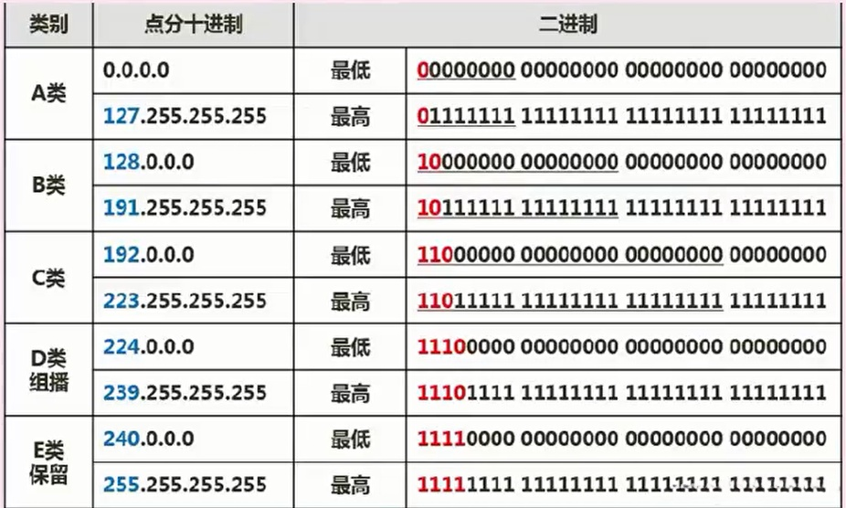

## 一、网络概述

### :evergreen_tree:计算机网络的概念

计算机网络是计算机技术与通信技术相结合的产物，它实现了远程通信、远程信息处理和资源共享。

计算机网络的功能：数据通信、资源共享、负载均衡、高可靠性。

### :evergreen_tree:计算机网络的分类

### :evergreen_tree:网络的拓扑结构

1. 总线型（利用率低、干扰大、价格低）
2. 星型（交换机形成的局域网、中央单元负荷大，类似于路由器）
3. 环型（流动方向固定、效率低扩充难）
4. 树型（总线型的扩充、分级结构）
5. 分布式（网状结构，任意节点连接、管理难成本高）

## 二、OSI/OSI网络体系结构【重点】

### :evergreen_tree:ISO/OSI参考模型

开放系统互连参考模型 (Open System Interconnect 简称OSI）

OSI/RM（ISO/OSI）

七层模型（从下到上）

当发送数据时，数据是自上而下传输；当接收数据时，数据是自下而上传输。

物理层：二进制数据传输，物理链路和物理特性相关。

数据链路层：将数据封装成帧进行传送，准确传送至局域网内的物理主机上。

网络层：数据分组传输和路由选择，能准确的将数据传送至互联网的网络主机上。

传输层：端到端的连接，传送数据至主机端口上

会话层：管理主机之间的会话，提供会话管理服务（建立、维护和结束会话）。

表示层：提供解释所交换信息含义的服务，包括数据之间的格式转换、压缩、加密等操作，对数据进行处理。

应用层：实现具体的应用功能。直接进程间的通信。

## 三、网络互联的硬件

物理层：中继器（只能连接两条物理线路，用于扩大信号）、集线器Hub(多路中继器，所有端口组成冲突域）。

数据链路层：网桥（分析帧地址）、交换机（多口网桥，MAC地址表，各个端口形成广播域）。

网络层：路由器（连接多个逻辑上分开的网络，路由选择）。

应用层：网关（连接不同类型且协议差别较大的网络，协议转换）。

### :evergreen_tree:网络的传输介质

有线介质：双绞线（最大长度100m，每端需要一个RJ45插件）、同轴电缆、光纤。

无线介质：微波、红外线和激光、卫星通信。

### :evergreen_tree:组建网络

组建网络：服务器、客户端、网络设备、通信介质、网络软件。

## 四、网络的协议与标准

### :evergreen_tree:局域网协议

- IEEE802.3：标准以太网（CSMA/CD），速度为10Mbps（bit速率，转为字节需要除以8），传输介质为同轴电缆；
- IEEE802.3u：快速以太网，速度为100Mbps，传输介质为双绞线；

- IEEE802.3z：千兆以太网，速度为1000Mbps，传输介质为光纤或双绞线。

- IEEE802.4：令牌总线网。

- IEEE802.5：令牌环网。

- 无线局域网CSMA/CA（载波侦听多路访问方法）。

### :evergreen_tree:广域网协议

- 点对点协议PPP（拨号上网）
- 数字用户线xDSL（ADSL上传网速和下载网速不对等，下载网速一般很快）

- 数字专线DDN（市内或长途的数据电路）

- 帧中继（以帧为传输单位）。

### :evergreen_tree:TCP/IP协议族【考点】

TCP/IP不是一个简单的协议，而是一组专业化协议。TCP/IP协议族可被大致分为**应用层、传输层、网际层和网络接口层**四层。如下图所示（注意：TCP/IP协议族的划分并不像七层模型那么严格，所以有些人将其划为四层，也有将其划为五层，在此主要掌握每个层次所对应的协议）。

#### 特性

逻辑编址（网卡-物理地址，Internet-逻辑地址）

路由选择（定义路由器如何选择网络路径）

域名解析（域名解析为IP地址）

错误检测和流量控制（可靠性、防止拥塞）

#### TCP/IP分层模型

应用层：具体应用功能。

传输层：提供应用程序间端到端的通信。

网际层：又称IP层，处理机器间的通信，数据以分组为单位。

网络接口层：又称为数据链路层，负责接收IP数据报，并把数据报通过选定的网络发送出去。

#### TCP/IP分层模型各层的网络协议

网际层协议：

- IP：最重要核心的协议，无连接、不可靠。

- ICMP：因特网控制信息协议，用来检测网络通信是否顺畅。

- ARP和RARP：地址解析协议，ARP（Address Resolution Protocol）是将IP地址转换为物理地址。

  RARP（反向地址转换协议（RARP：Reverse Address Resolution Protocol））是将物理地址转换为IP地址。

传输层协议：

- UDP协议【用户数据报协议（UDP，User Datagram Protocol）】：不可靠连接，无连接，因为数据传输只管发送，不用对方确认，因此可能会有丢包现象。一般用于视频、音频数据传输。
- TCP协议【传输控制协议（TCP，Transmission Control Protocol）】：可靠连接，因为有验证机制，每发送一个数据包，都要求对方回复确认；初始建立连接，有三次握手机制，即A发送连接信息给B（SEQ=X），B收到后回复确认帧（SEQ=Y,ACK=X+1)，A收到确认帧后再发送确认（SEQ=X+1,ACK=Y+1)，才能建立连接（上述SEQ表示本机发送的数据包序号，A和B之间的SEQ分别计数，而ACK为确认帧，ACK=X+1表示已经收到了A机发送的第X个数据包，期望下一个收到第X+1个数据包）。

TCP传输协议分类：

- 停止等待协议：TCP保证可靠传输的协议，”停止等待”就是指发送完一个分组就停止发送，等待对方的确认，只有对方确认过，才发送下一个分组。

- 连续ARQ协议：TCP保证可靠传输的协议，它是指发送方维护着一个窗口，这个窗口中不止一个分组，有好几个分组，窗口的大小是由接收方返回的win值决定的，所以窗口的大小是动态变化的，只要在窗口中的分组都可以被发送，这就使得TCP一次不是只发送一个分组了，从而大大提高了信道的利用率。并且它采用累积确认的方式，对于按序到达的最后一个分组发送确认。

- 可变大小的滑动窗口协议：TCP流量控制协议，可变的窗口是不断向前走的，该协议允许发送方在停止并等待确认前发送多个数据分组。由于发送方不必每发一个分组就停下来等待确认，因此该协议可以加速数据的传输，还可以控制流量的问题。

应用层协议：

- 基于TCP的FTP、HTTP等都是可靠传输。基于UDP的DHCP、DNS等都是不可靠传输。
- FTP：可靠的文件传输协议。

- HTTP：超文本传输协议，用于上网。使用SSL加密后的安全网页协议为HTTPS。

- SMTP和POP3：邮件传输协议，邮件报文采用ASClI格式表示。

- IMAP：邮件访问协议，是用于替代POP3协议的新协议，工作在143号端口上。

- Telnet：远程连接协议。

- TFTP：不可靠的小文件传输协议。

- SNMP：不可靠，简单网络管理协议，必须以管理员的身份登录才能完成配置。

- DHCP：不可靠，动态分配IP地址协议，客户机/服务器模型，租约默认为8天，当租约过半时，客户机需要向DHCP服务器申请续租，当租约超过87.5%时，如果仍然没有和当初提供IP地址的DHCP服务器联系上，则开始联系其他DHCP服务器。

- VoIP：Voice over Internet Protocol是一种以IP电话为主，并推出相应的增值业务的技术，不可靠。

- DNS：不可靠，域名解析协议，将域名解析为IP地址。

- DNS服务器：维持域名和IP地址对应的表格，层次结构为：本地域名服务器、权威域名服务器、顶级域名服务器、根域名服务器。

- 输入网址（即域名）后，首先会查询本地DNS缓存，无果后再查询本地DNS服务器，又分为递归查询和迭代查询两种方式。
  - 递归查询：主机提出一个查询请求，本地服务器会自动一层一层的查询下去，直到找到满足查询请求的IP地址，再返回给主机。即问一次，就得最终结果。
  - 迭代查询：服务器收到一次查询请求，就回答一次，但是回答的不一定是最终地址，也可能是其他层次服务器的地址，然后等待客户端再去提交查询请求。即问一次答一次，而后再去问其他服务器，直至问到结果。
- 主机向本地域名服务器额查询采用递归查询；本地域名服务器向根域名服务器的查询通常采用迭代查询。（依据是域名服务器是否空闲）。

#### 路由选择策略

- **静态路由选择**（不能根据网络流量和拓扑结构的变化来调整自身的路由表，也就不能找出最佳路由）：
  - **固定式路由选择**：每个网络节点存储一张表格，表格中每一项记录着对应某个目的节点的下一点或链路，当一个分组到达某节点时，该节点只要根据分组上的地址信息，便可从固定的路由表查出对应的目的节点及所应选择的下一节点。
  - **洪泛式路由选择**：又叫扩散法，一个分组由源站发送到与其相邻的所有节点，最先到达目的节点的一个或若干个分组肯定经过了最短的路径，其主要应用在诸如军事网络等强壮性要求很高的场合；
  - **随机路由选择**：一个分组只在与其相邻的节点中随机的选择一条转发；
- **动态路由选择**（节点的路由选择要依靠网络当前的状态信息来决定。这种策略能较好地适应网络流量、拓扑结构的变化，有利于改善网络的性能。但由于算法复杂，会增加网络的负担）：
  - **分布式路由选择**。基本算法有距离向量算法（各节点周期性地向所有相邻节点发送路由刷新报文）和链路状态算法（各节点独立计算最短通路、能够快速适应网络变化、交换的路由信息少，复杂难以实现）；
  - **集中式路由选择**。由网络控制中心（Network Control Center，NCC)负责全网状态信息的收集、路由计算及最佳路由的实现。最简单的方法是将最新路由定期发送到网络中各节点上去。
  - **混合式动态路由选择**。将分布路由选择与集中路由选择、以及其它路由选择方法混合使用。

## 五、Internet及应用

### :evergreen_tree:IP地址

分类地址格式：IP地址分四段，每段八位，共32位二进制数组成。通常使用点分4个十进制数表示，如127.0.0.1。

在逻辑上，这32位IP地址分为网络号和主机号，依据网络号位数的不同，可以将IP地址分为以下几类：

其中，A类地址网络号占8位，主机号则为32-8=24位，能分配的主机个数为2^24-2个（注意：主机号为全0和全1的不能分配，是特殊地址）；

同理，B类地址网络号为16位，主机号则为32-16=16位，能分配的主机个数为2^16-2个

C类地址网络号为24位，主机号则为32-24=8位，能分配的主机个数为2^8-2个。

上图中红色的位数表示该位固定为该值，是每类IP地址的标识。

#### 子网划分

按上述划分的ABC三类，一般是最常用的，但是却并不实用，因为主机数之间相差的太大了，不利于分配，因此，我们一般采用子网划分的方法来划分网络，即自定义网络号位数，就能自定义主机号位数，就能根据主机个数来划分出最适合的方案，不会造成资源的浪费。

因此就有子网的概念，一般的IP地址按标准划分为ABC类后，可以进行再一步的划分，将主机号拿出几位作为子网号，就可以划分出多个子网，此时lP地址组成为：**网络号+子网号+主机号。**

网络号和子网号都为1，主机号都为0，这样的地址为子网掩码。

要注意的是：子网号可以为全0和全1，主机号不能为全0或全1(特殊地址)，因此，主机数需要-2，而子网数不用。

还可以聚合网络为超网，就是划分子网的逆过程，将网络号取出几位作为主机号，此时，这个网络内的主机数量就变多了，成为一个更大的网络。

#### 无分类编址

除了上述的分类编址外，还有无分类编址，即不按照ABC类规则，自动规定网络号，无分类编址格式为：lP地址/网络号，示例：128.168.0.11/20表示的IP地址为128.168.0.11，其网络号占20位，因此主机号占32-20=12位，也可以划分子网。

特殊含义的IP地址：

### :evergreen_tree:IPv6

主要是为了解决IPv4地址数不够用的情况而提出的设计方案，IPv6具有以下特性：

- IPv6地址长度为128位，地址空间增大了2^96倍；

- 灵活的IP报文头部格式，使用一系列固定格式的扩展头部取代了IPv4中可变长度的选项字段。IPv6中选项部分的出现方式也有所变化，使路由器可以简单路过选项而不做任何处理，加快了报文处理速度；

- IPv6简化了报文头部格式，加快报文转发，提高了吞吐量；

- 提高安全性，身份认证和隐私权是IPv6的关键特性；

- 支持更多的服务类型；

- 允许协议继续演变，增加新的功能，使之适应未来技术的发展。

~~~
例（2013年下半年）：●在IPv4向IPv6过渡期间，如果要使得两个IPv6结点可以通过现有的IPv4网络进行通信则应该使用（67）；如果要使得纯IPv6结点可以与纯IPv4结点进行通信，则需要使用（68）。
（67）A.堆栈技术 B.双协议栈技术 C.隧道技术 D.翻译技术
（68）A.堆栈技术 B.双协议栈技术 C.隧道技术 D.翻译技术
答案：C D
解析：IPv4和IPv6的过渡期间，主要采用三种基本技术。
双协议栈：主机同时运行IPv4和IPv6两套协议栈，同时支持两套协议；
隧道技术：这种机制用来在IPv4网络上连接IPV6的站点，站点可以是一台主机，也可以是多个主机。
翻译技术：利用转换网关来在IPv4和IPv6网络之间转换IP报头的地址，同时根据协议不同对分组做相应的语义翻译，从而使纯IPv4和纯IPv6站点之间能够透明通信。
第1小题由于两个IPv6的结点通信需要在IPv4的网络上通信，使用隧道技术；

第2小题由于两个结点一个是纯lPv6，另一个是IPv4，由于IPv4和IPv6是两种不同地址长度和报头格式的协议，因此它们之间的通信需要使用翻译技术进行地址转换。
~~~

### :evergreen_tree:其他重要应用

层次化网络模型从下至上分为三层：

- 接入层：功能单一，向本地网段提供用户接入。

- 汇聚层：功能多样，可以有多层，包括网络访问策略、数据包的处理、过滤、寻址、路由选择等中间操作。

- 核心层：功能单一，只负责高速的数据交换。

**网络地址翻译NAT**：公司内有很多电脑，在公司局域网内可以互联通信，但是要访问外部因特网时，只提供固定的少量IP地址能够访问因特网，将公司所有电脑这个大的地址集合映射到能够访问因特网的少量IP地址集合的过程就称为NAT。
很明显，使用了NAT后，一个公司只有少量固定lP地址可以上网，大大减少了IP地址的使用量。

**默认网关**：一台主机可以有多个网关。默认网关的意思是一台主机如果找不到可用的网关，就把数据包发给默认指定的网关，由这个网关来处理数据包。现在主机使用的网关，一般指的是默认网关。
默认网关的IP地址必须与本机IP地址在同一个网段内，即同网络号。

冲突域和广播域：路由器可以阻断广播域和冲突域，交换机只能阻断冲突域，因此一个路由器下可以划分多个广播域和多个冲突域；一个交换机下整体是一个广播域，但可以划分多个冲突域；而物理层设备集线器下整体作为一个冲突域和一个广播域。

虚拟局域网VLAN：是一组逻辑上的设备和用户，这些设备和用户并不受物理位置的限制，可以根据功能、部门及应用等因素将它们组织起来，相互之间的通信就好像它们在同一个网段中一样。VLAN工作在OSl参考模型的第2层和第3层，一个VLAN就是一个广播域，VLAN之间的通信是通过第3层的路由器来完成的。与传统的局域网技术相比较，VLAN技术更加灵活，它具有以下优点：网络设备的移动、添加和修改的管理开销减少；可以控制广播活动；可提高网络的安全性。

虚拟专用网VPN：是在公用网络上建立专用网络的技术。其之所以称为虚拟网，主要是因为整个VPN网络的任意两个节点之间的连接并没有传统专网所需的端到端的物理链路，而是架构在公用网络服务商所提供的网络平台，如Internet、ATM(异步传输模式)、Frame Relay(帧中继)等之上的逻辑网络，用户数据在逻辑链路中传输。

## 六、网络安全

### :evergreen_tree:网络安全协议

网络安全

物理层主要使用物理手段，隔离、屏蔽物理设备等

其它层都是靠协议来保证传输的安全，具体如下图所示：

SSL协议用于网银交易。提供三方面的服务：用户和服务器的合法性验证、加密数据以隐藏被传输的数据、保护数据的完整性。

实现过程：接通阶段——密码交换阶段（客户端和服务器之间交换双方认可的密码）——会谈密码阶段（客户端和服务器之间产生彼此交谈的会谈密码）——检验阶段——客户认证阶段——结束阶段。

HTTPS即安全的超文本传输协议，处于应用层，应该采用应用层协议，SET为传输层协议。

SSL被设计为加强Web安全传输（HTTP/HTTPS/)的协议（还有SMTP/NNTP等）

SSH被设计为加强Telnet/FTP安全的传输协议。

### :evergreen_tree:防火墙技术

防火墙是在内部网络和外部因特网之间增加的一道安全防护措施，它认为内部网络是安全的，外部网络是不安全的。分为网络级防火墙和应用级防火墙，两级之间的安全手段如下所示：

网络级防火墙（包过滤防火墙）层次低，但是效率高，因为其使用包过滤和状态监测手段，一般只检验网络包外在（起始地址、状态）属性是否异常，若异常，则过滤掉，不与内网通信，因此对应用和用户是透明的。但是这样的问题是，如果遇到伪装的危险数据包就没办法过滤。

应用级防火墙（代理服务防火墙），层次高，效率低，因为应用级防火墙会将网络包拆开，具体检查里面的数据是否有问题，会消耗大量时间，造成效率低下，但是安全强度高。由防火墙自动完成，对用户透明。包括双宿主主机、屏蔽主机网关、被屏蔽子网等方法。

被屏蔽子网方法，是在内网和外网之间增加了一个屏蔽子网，相当于多了一层网络，称为DMZ（非军事区），这样，内网和外网通信必须多经过一道防火墙，屏蔽子网中一般存放的是邮件服务器、WEB服务器、论坛等这些内外网数据交互的服务器，可以屏蔽掉一些来自内部的攻击，但是完全来自系统内部服务器的攻击还是无法屏蔽掉。

### :evergreen_tree:计算机病毒

病毒：编制或者在计算机程序中插入的破坏计算机功能或者破坏数据，影响计算机使用并且能够自我复制的一组计算机指令或者程序代码。病毒具有：传染性、隐蔽性、潜伏性、破坏性、针对性、衍生性、寄生性、未知性。

木马：是一种后门程序，场被黑客用作控制远程计算机的工具，隐藏在被控制电脑上的一个小程序监控电脑一切操作并盗取信息。

病毒和木马种类：

- 系统引导型病毒；
- 文件外壳型病毒；
- 目录型病毒；
- **蠕虫病毒（感染EXE文件）**：熊猫烧香，罗密欧与朱丽叶，恶鹰，尼姆达，冲击波，红色代码，爱虫病毒。
- 宏病毒（感染word、excel等文件中的宏变量）：美丽沙，台湾1号。

- ClH病毒：史上唯一破坏硬件的病毒。

- 木马：QQ消息尾巴木马，特洛伊木马，冰河。木马的作用一般强调控制操作宏病毒破坏的是OFFICE文件相关
- 红色代码：蠕虫病毒+木马。

## 七、多媒体

媒体可分为下面五类：

1. 感觉媒体：直接作用于人的感觉器官，使人产生直接感觉的媒体。如：视觉、听觉、触觉等。

2. 表示媒体：指传输感觉媒体的中介媒体/载体，即用于数据交换的编码。如：图像编码、文字、图形、动画、音频和视频等。

3. 表现媒体：进行信息输入和信息输出的媒体。如：键盘、鼠标和麦克风；显示器、打印机和音响等。

4. 存储媒体：存储表示媒体的物理介质。如磁盘、光盘和内存等。

5. 传输媒体：传输表示媒体的物理介质。如电缆、光纤、双绞线等。

### :evergreen_tree:声音

以声音的带宽来衡量声音的大小，单位是HZ。声音是一种模拟信号，要对其进行处理，就必须将其转化为数字信号。模数转换过程有三个步骤：采样、量化、编码。

人耳能听到的音频信号的频率范围是20Hz~20KHz。

声音的采样频率一般为**最高频率的两倍**，才能保证不失真。

未经压缩的数字音频数据的传输率计算公式如下：

数据传输率（bps）= 采样频率（Hz）× 量化位数（bit）× 声道数
声音波形经过数字化后所需占用的存储空间计算公式如下：
声音信号数据量（Byte）= 数据传输率（bps）× 持续时间（s）/ 8

#### 数字音乐合成方法

数字调频合成法FM：使高频振荡波的频率按调制信号规律变化的一种调制方式。采用不同调制波频率和调制指数，就可以方便的合成具有不同频谱分布的波形，再现某些乐器的音色。可以采用这种方法得到具有独特效果的“电子模拟声“，创造出丰富多彩的声音，是真实乐器所不具备的音色。

波表合成法Wavetable：将各种真实乐器所能发出的所有声音（包括各个音域、声调）录制下来，存贮为一个波表文件。播放时，根据MIDI文件纪录的乐曲信息向波表发出指令，从”表格”中逐一找出对应的声音信息，经过合成、加工后回放出来。合成的音质更好。

#### 声音特性

音量：即响度，表示声音的强弱程度，主要取决于声波振幅的大小。

音高：表示各种声音的高低，主要取决于声波的振动频率，振动频率越高则音越高。

音调：表示声音的调子的高低，由声音本身的频率决定。

音色：又称为音品，由声音波形的谐波频谱和包络决定。

声音文件格式：.wav、.snd、.au、.aif、.voc、.mp3、.ra、.mid等。

### :evergreen_tree:图形和图像

#### 颜色三要素

亮度：彩色明暗深浅程度。

色调：颜色的类别（红、绿等）。

饱和度：某一颜色的深浅程度。

#### 彩色空间

即设备显示图片所使用的色彩空间，

普通的电脑显示器是RGB色彩空间，除了红、绿、蓝三原色外，其他颜色都是通过这三原色叠加形成的；

电视中使用YUV色彩空间，主要是为了兼容黑白电视，使用的是亮度原理，即调不同的亮度，显示不同的颜色；

CMY(CMYK)，印刷书籍时采用的色彩空间，这个采用的是和RGB相反的减法原理，浅蓝、粉红、黄三原色的印刷颜料实际上是吸收除了本身色彩之外的其他颜色的，因此，印刷出来才是这些颜色；

HSV(HSB)，艺术家彩色空间，是从艺术的角度划分的。

图像的属性：分辨率（每英寸像素点数dpi)、像素深度（存储每个像素所使用的二进制位数）。

图像文件格式：.bmp、gif、jpg、.png、tif、wmf等。

图像深度是图像文件中记录一个像素点所需要的位数。是示深度表示显示缓存中记录屏幕上一个点的位数（bit），也即显示器可以显示的颜色数，计算方法：2^n，n表示每个像素具有n位颜色深度。

水平分辨率：显示器在横向上具有的像素点数目。

垂直分辨率：显示器在纵向上具有的像素点数目。

矢量图的基本组成单位是图元，位图的基本组成单位是像素，视频和动画的基本组成单元是帧。

### :evergreen_tree:多媒体相关计算问题

上述计算中，图像中要理解色数的概念。要理解音频容量计算的原理，就是每个采样通道的采样次数×每次采样的位数×总的采用通道数。

视频就是一帧帧图像的组合，因此本质是求图像容量，当然要加上音频容量。注意单位B和b的区别和换算，注意K（大写，1024，存储时才用）和k(小写，1000)的区别，注意结果单位。

~~~
例（2016年上半年）：使用150DPl的扫描分辨率扫描一幅3×4英寸的彩色照片，得到原始的24位真彩色图像的数据量是（14）Byte。
A.1800 B.90000 C.270000 D.810000
答案：D
解析：DPl是每英寸像素点数，因此扫描后像素点数为3×150×4×150=270000个，24位彩色图像的含义是每个像素点占24bit=3Byte，因此数据量为270000×3=810000Byte。

例（2015年下半年）：颜色深度是表达图像中单个像素的颜色或灰度所占的位数(bit)。若每个像素具有8位的颜色深度，则可表示（13）种不同的颜色。
（13)A.8 B.64 C.256 D.512
答案：C
~~~

