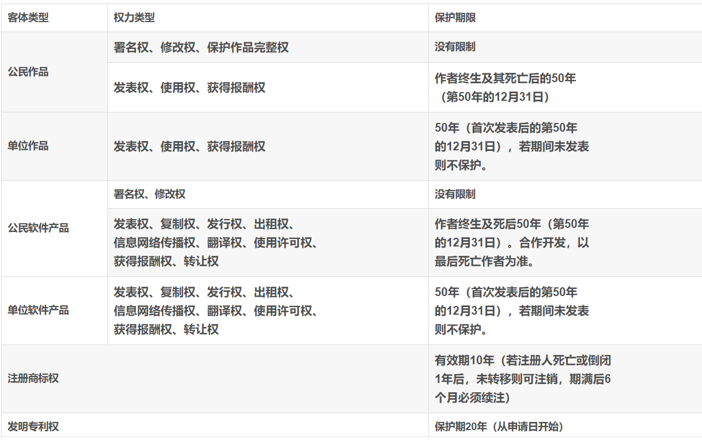
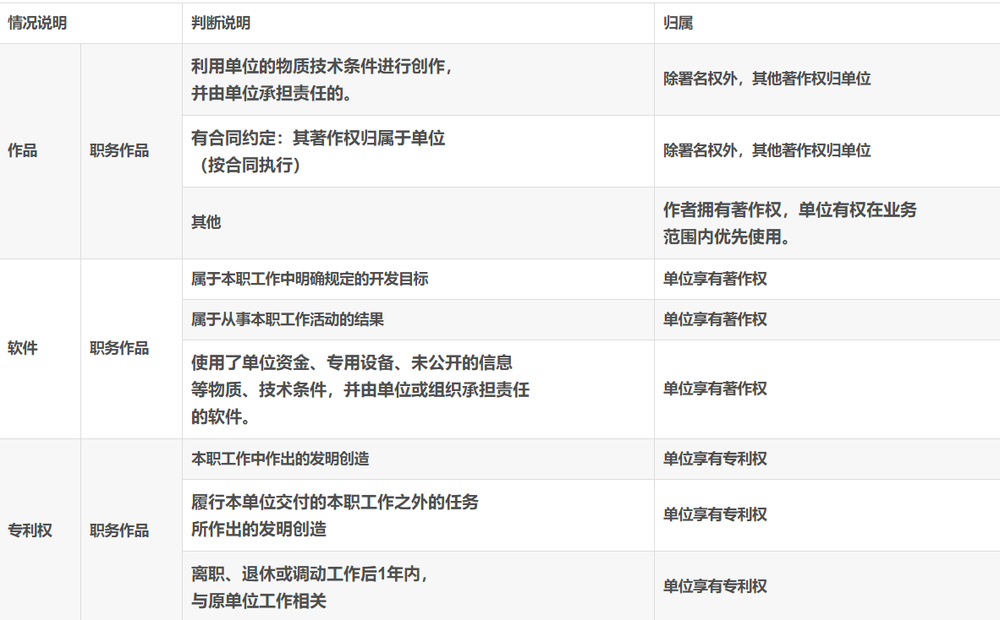
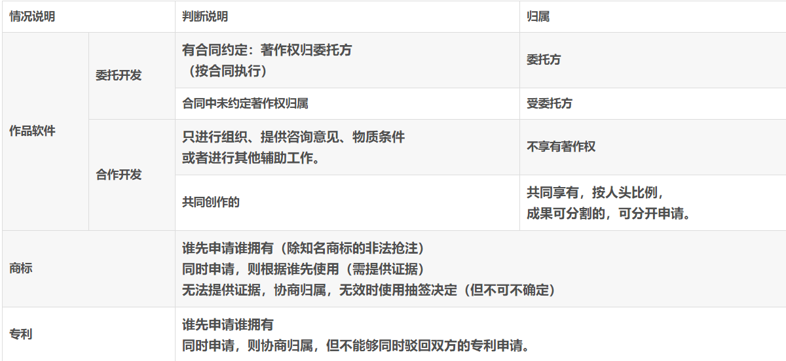
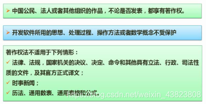
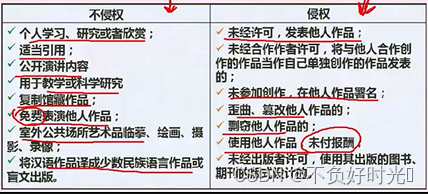

## 知识产权基础知识

### 保护期限

### 知识产权人的确定

单位和个人的**著作权**归属情况：

单位和委托的区别在于，**当合同中未规定著作权的归属时，著作权默认归于单位，而委托创作中，著作权默认归属于创作方个人**，具体如下：

### 侵权判定

## 标准化基础知识

### 标准的分类

- 国际标准：ISO、IEC等国际标准化组织
- 国家标准：GB-中国、ANSI-美国、BS-英国、JIS-日本

- 区域标准：又称为地区标准，如PASC-太平洋地区标准会议、CEN-欧洲标准委员会、ASAC-亚洲标准咨询委员会、ARSO—非洲地区标准化组织

- 行业标准：GJB-中国军用标准、MIT-S-美国军用标准、IEEE-美国电气电子工程师协会

- 地方标准：国家的地方一级行政机构制订的标准

- 企业标准

- 项目规范

### 标准的编号

- 国际：标准代号+专业类号+顺序号+年代号。
- 我国标准代号及编号：
  - **强制性国家标准代号为GB，**
  - **推荐性国家标准代号为GB/T，**
  - **指导性国家标准代号为GB/Z，**
  - **国家实物标准代号GSB**。
- 行业标准代号：一般由汉语拼音大写字母组成，如汽车QC等。

- 地方标准代号：由大写汉语拼音DB加上省级行政区划代码的前两位组成。

- 企业标准代号：由“Q/”加上企业代号组成。
  
