## 数据库的基本概念

考点1：数据库体系结构

考点2：三级模式结构

考点3：数据仓库

### 考点1：数据库体系结构

#### :bouquet:数据库系统的体系结构

1. 集中式数据库系统
   - 数据是集中的
   - 数据管理是集中的
   - 数据库系统的素有功能 (从形式的用户接口到DBMS核心)都集中在DBMS所在的计算机。
2. C/S结构
   - 客户端负责数据表示
   - 服务服务器主要负责数据库服务
   - 数据库系统分为前端和后端
   - ODBC、JDBC
3. 分布式数据库
   - 物理上分布、逻辑上集中
   - 物理上分布、逻辑上分布
   - 特点
   - 透明性
4. 并行数据库
   - 共享内存式
   - 无共享式

#### :bouquet:分布式数据库特点

1. **数据独立性**。除了数据的逻辑独立性与物理独立性外，还有数据分布独立性（分布透明性）。
2. **集中与自治共享结合的控制结构**。各局部的DBMS可以独立地管理局部数据库，具有自治的功能。同时，系统又设有集中控制机制，协调各局部DBMS的工作，执行全局应用。
3. **适当增加数据冗余度**。在不同的场地存储同一数据的多个副本，可以提高**系统的可靠性和可用性**，同时也能提高系统性能。（提高系统的可用性，即当系统中某个节点发生故障时，因为数据有其他副本在非故障场地上，对其他所有场地来说，数据仍然是可用的，从而保证数据的完备性）。
4. **全局的一致性、可串行性和可恢复性**。

#### :bouquet:分布式数据库透明性

1. **分片透明**：是指用户不必关心数据是如何分片的，它们对数据的操作在全局关系上进行，即如何分片对用户是透明的。
2. **复制透明**：用户不用关心数据库在网络中各个节点的复制情况，被复制的数据的更新都由系统自动完成。
3. **位置透明**：是指用户不必知道所操作的数据放在何处，即数据分配到哪个或哪些站点存储对用户是透明的。
4. **局部映像透明性（逻辑透明）**：是最低层次的透明性，该透明性提供数据到局部数据库的映像，即用户不必关心局部DBMS支持哪种数据模型、使用哪种数据操纵语言，数据模型和操纵语言的转换是由系统完成的，因此，局部映像透明性对异构型和同构异质的分布式数据库系统是非常重要的。

#### :bouquet:例题

~~~
在分布式数据库中有分片透明、复制透明、位置透明和逻辑透明等基本概念，其中: (D)是指局部数据模型透明，即用户或应用程序无需知道局部使用的是哪种数据模型; (A) 是指用户或应用程序不需要知道逻辑上访问的表具体是如何分块存储的。
A分片透明 B复制透明 C位置透明 D逻辑透明
A分片透明 B复制透明 C位置透明 D逻辑透明

当某一场地故障时，系统可以使用其他场地上的副本而不至于使整个系统瘫痪。这称为分布式数据库的 (C)。
A共享性
B自治性
C可用性
D分布性
~~~

### 考点2：三级模式结构

#### :cherry_blossom:三级模式和两级映像

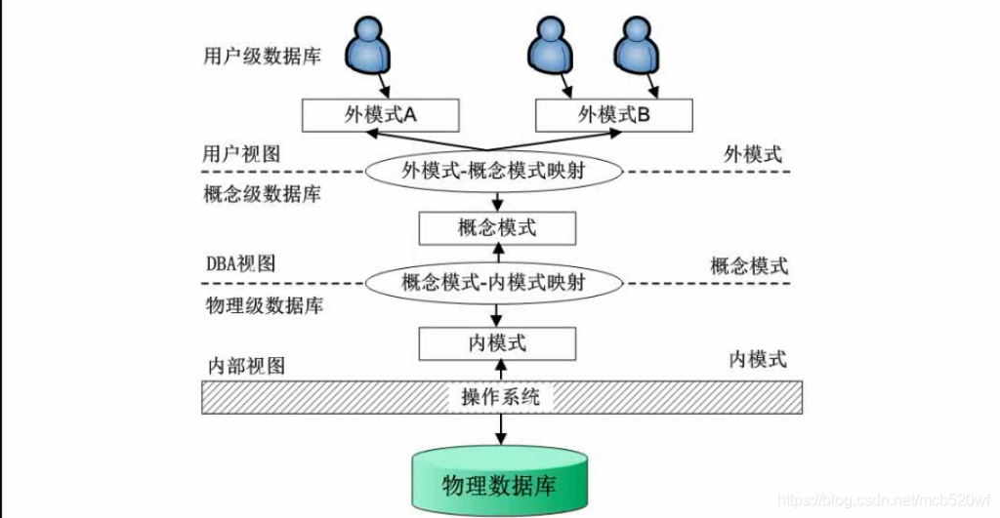

三级模式

1. 用户级--> 外模式(反映了数据库系统的用户观\)
   - 外模式又称子模式或用户模式，对应于用户级。它是某个或某几个用户所看到的数据库的数据视图，是与某一应用有关的数据的[逻辑表示](https://baike.baidu.com/item/逻辑表示)。外模式是从模式导出的一个子集，包含模式中允许特定用户使用的那部分数据。用户可以通过外模式描述语言来描述、定义对应于用户的[数据记录](https://baike.baidu.com/item/数据记录)(外模式)，也可以利用[数据操纵语言](https://baike.baidu.com/item/数据操纵语言)(Data Manipulation Language，DML)对这些数据记录进行操作。
2. 概念级--> 概念模式（反映了数据库系统的整体观）
   - 概念模式又称模式或逻辑模式，对应于概念级。它是由数据库设计者综合所有用户的数据，按照统一的观点构造的全局逻辑结构，是对数据库中全部数据的逻辑结构和特征的总体描述，是所有用户的公共数据视图(全局视图)。它是由数据库管理系统提供的数据模式描述语言(Data Description Language，DDL)来描述、定义的。
3. 物理级 --> 内模式（反映了数据库系统的存储观）
   - 内模式又称存储模式，对应于物理级。它是数据库中全体数据的内部表示或底层描述，是数据库最低一级的逻辑描述，它描述了数据在存储介质上的存储方式和物理结构，对应着实际存储在外存储介质上的数据库。内模式由内模式描述语言来描述、定义的。

两级映射

1. 外模式/模式的映像：实现外模式到概念模式之间的相互转换。
   - 逻辑独立性：数据的逻辑独立性是指用户的应用程序与数据库结构是相互独立的。数据的逻辑结构发生变化后，用户程序也可以不修改。但是，为了保证应用程序能够正确执行，需要修改外模式/概念模式之间的映像。
2. 模式/内模式的映像：实现概念模式到内模式之间的相互转换。
   - 物理独立性：数据的物理独立性是指当数据库的内模式发生改变时，数据的的逻辑结构不变。由于应用程序处理的只是数据的逻辑结构，这样物理独立性可以保证，当数据的物理结构改变了，应用程序不用改变。但是，为了保证应用程序能够正确执行，需要修改概念模式/内模式之间的映像。

[数据库模式（三级模式+两级映射）_数据库的物理连接属于什么模式-CSDN博客](https://blog.csdn.net/mcb520wf/article/details/91047683)

#### :cherry_blossom:例题

~~~
数据库系统通常采用三级模式结构:外模式、模式和内模式。这三级模式分别对应数据库的(B)
A基本表、存储文件和视图
B视图、基本表和存储文件
C基本表、视图和存储文件
D视图、存储文件和基本表

以下关于数据库两级映像的叙述中，正确的是(B)
A模式/内模式映像实现了外模式到内模式之间的相互转换
B模式/内模式映像实现了概念模式到内模式之间的相互转换
C外模式/模式的映像实现了概念模式到内模式之间的相互转换
D外模式/内模式的映像实现了外模式到内模式之间的相互转换

数据的物理独立性和逻辑独立性分别是通过修改 (D) 来完成的。
A外模式与内模式之间的映像、模式与内模式之间的映像
B外模式与内模式之间的映像、外模式与模式之间的映像
C外模式与模式之间的映像、模式与内模式之间的映像
D模式与内模式之间的映像、外模式与模式之间的映像
~~~

### 考点3：数据仓库

#### :tulip:数据仓库特点

1. 面向主题：数据按主题组织。
2. 集成的：消除了源数据中的不一致性，提供整个企业的一致性全局信息。
3. 相对稳定的（非易失的）：主要进行查询操作，只有少量的修改和删除操作（或是不删除）。
4. 反映历史变化（随着时间变化）：记录了企业从过去某一时刻到当前各个阶段的信息，可对发
   展历程和未来趋势做定量分析和预测。

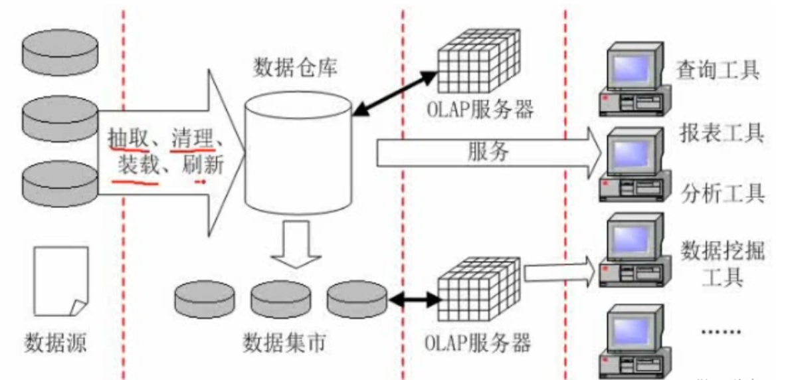

[什么是数据仓库？它和数据库的区别是什么？看这一篇就够了 - 知乎 (zhihu.com)](https://zhuanlan.zhihu.com/p/433495465)

[数据仓库--数据分层（ETL、ODS、DW、APP、DIM）_数仓分层dim-CSDN博客](https://blog.csdn.net/hello_java_lcl/article/details/107025192)

#### :tulip:例题

~~~
某集团公司下属有多个超市，每个超市的所有销售数据最终要存入公司的数据仓库中。假设该公司高管需要从时间、地区和商品种类三个维度来分析某家电商品的销售数据，那么最适合采用(B) 来完成。
A DataExtraction 数据清理
B OLAP 连接分析
C OLTP 事务
D ETL 抽取
~~~

## 数据库设计过程

### 数据库设计过程

#### 数据库设计过程图

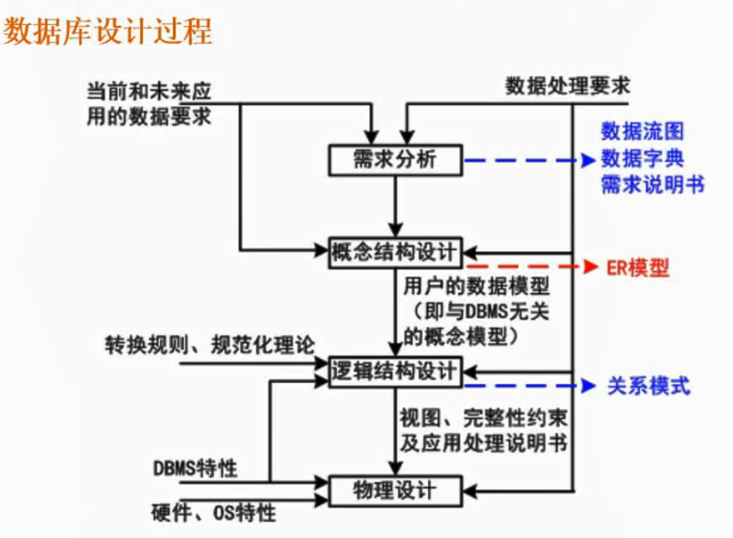

数据流图简称（OFD）

数据字典简称（DD）

聚簇索引在物理设计里

#### 例题

~~~
关系规范化在数据库设计的 (C) 阶段进行。
A需求分析
B概念设计
C逻辑设计
D物理设计
~~~

### 概念设计阶段

#### 考点1：概念设计过程

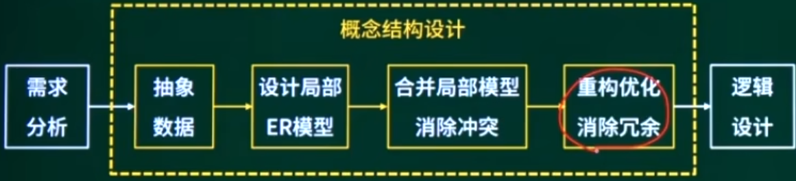

集成的方法：

1. 多个局部E-R图一次集成。
2. 逐步集成，用累加的方式一次集成两个局部E-R。

集成产生的冲突及解决办法：（针对同一对象）

1. 居性冲突：包括属性域冲突和属性取值冲突。
2. 命名冲突：包括同名异义和异名同义。
3. 结构冲突：包括同一对象在不同应用中具有不同的抽象，以及同一实体在不同局部E-R图中所包含的属性个数和属性排列次序不完全相同。

#### 考点2：E-R图

##### E-R模型

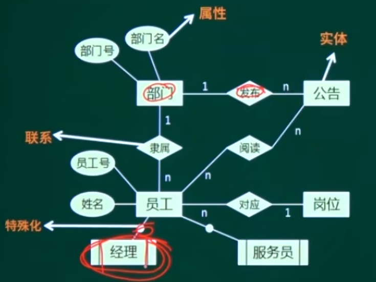

**实体型：**用矩形表示，矩形框内写明实体名。

**属性：**用椭圆形表示，并用无向边将其与相应的实体型连接起来。

**联系：**用菱形表示，菱形框内写明联系名，并用无向边分别与有关实体型连接起来，同时在无向边旁标上联系的类型（1∶1，1∶n或m∶n）。（联系可以具有属性）。

**特殊化**：用线条加圈或者矩形加平行线。

实体：实体是现实世界中可以区别于其他对象的事件或事物。(实体集一实体的集合)

属性：居性是实体某方面的特性。

联系：突体的联系分为实体内部的联系和实体与实体间的联系。实体间联系类型: 1:1，1:\*，\*:\*

##### 属性

1. 简单属性和复合属性
   - **简单属性**是原子的，不可再分的；
   - **复合属性**可以细分为更小的部分 (即划分为别的属性)
2. 单值属性和多值属性
   - 定义的属性对于一个特定的实体都只有单独的一个值，称为单值属性
   - 在某些特定情况下，一个属性可能对应一组值，称为多值属性。
3. NULL属性：表示无意义或不知道。
4. 派生属性：可以从其他属性得来。

##### 联系类型判断

两个不同实体集之间联系

- 一对一（1:1）

- 一对多（1:n）

- 多对多（m:n）

两个以上不同实体集之间的联系（三元联系）多重度的确定可根据语义直接转换

- 以三元关系中的一个实体作为中心，假设另两个实体都只有一个实例；
- 若中心实体只有一个实例能与另两个实体的一个实例进行关联，则中心实体的连通数为“一”；
- 若中心实体有多于一个实例能与另两个实体实例进行关联，则中心实体的连通数为“多”。

同一个实体集内的二元联系

##### 扩充的E-R模型

弱实体：在现实世界中有一种特殊的依赖联系;该联系是指某实体是否存在对于另些实体具有很强的依赖关系，即一个实体的存在必须以另一个实体为前提，而将这类实体称为弱实体，如家属与职工的联系，附件与邮件。
特殊化：在现实世界中，某些实体一方面具有一些共性，另一方面还只有各自的特性，一个实体集可以按照某些特征区分为几个子实体。

聚集：一个联系作为另一个联系的一端。

### 逻辑结构设计

#### 考点1：关系模式相关概念

##### 数据模型

层次模型

网状模型

关系模型

面向对象模型

注：数据模型三要素:数据结构、数据操作、数据的约束条件

##### 关系模型相关概念

- 目或度：关系模式中属性的个数
- 侯选码（候选键）
- 主码（主键）
- 主属性与非主属性：组成候选码的属性就是主属性，其它的就是非主属性。
- 外码（外键）
- 全码（ALL-Key）：关系模式的所有属性组是这个关系的候选码。

##### 关系的3种类型

1. 基本关系
2. 查询表
3. 视图表

##### 完整性约束

1. 实体完整性约束（主键：唯一、非空）
2. 参照完整性约束（外键：其他关系主键或为空）
3. 用户自定义完整性约束（check条件）

注：触发器完成复杂完整性约束条件设定

#### 考点2：E-R图转关系模式

##### 逻辑结构设计-E-R模型转关系模式

- 一个实体型必须转换为一个关系模式
- 联系转关系模式

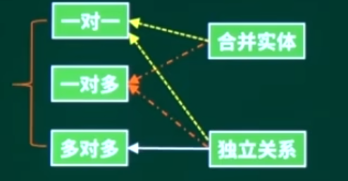

（1）一对一联系的转换有两种方式。

- 独立的关系模式：并入两端主键及联系自身属性。（主键：任一键主键）
- 归并（可以并入任意一端）：并入另一端主键及联系自身属性。（主键：保持不变）

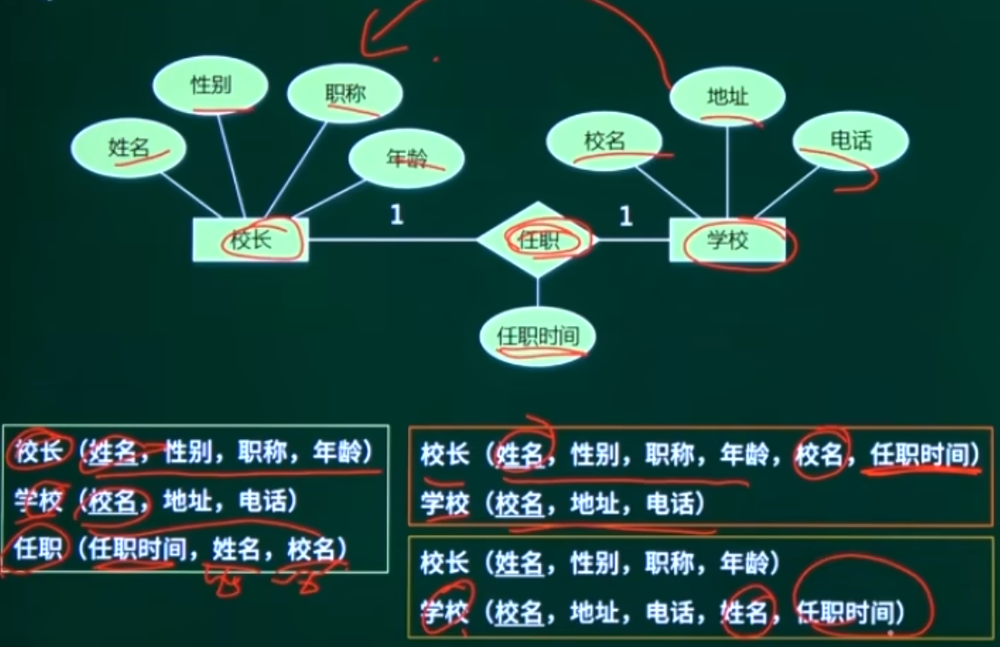

（2）一对多联系的转换有两种方式。

- 独立的关系模式：并入两端主键及联系自身属性。（主键：多端主键）
- 归并（只能并入多端）：并入另一端主键及联系自身属性。（主键：保持不变）

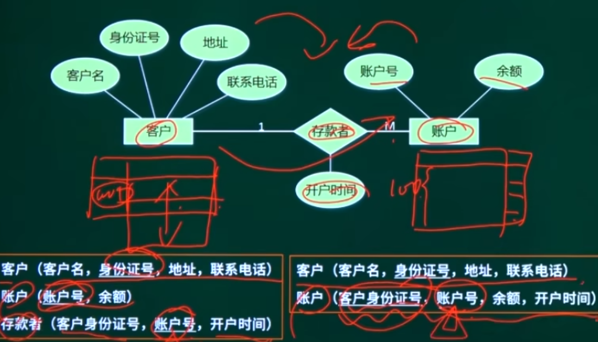

（3）多对多联系的转换只有一种方式

- 独立的关系模式：并入两端主键及联系自身属性。 （主键：两端主键的组合键）

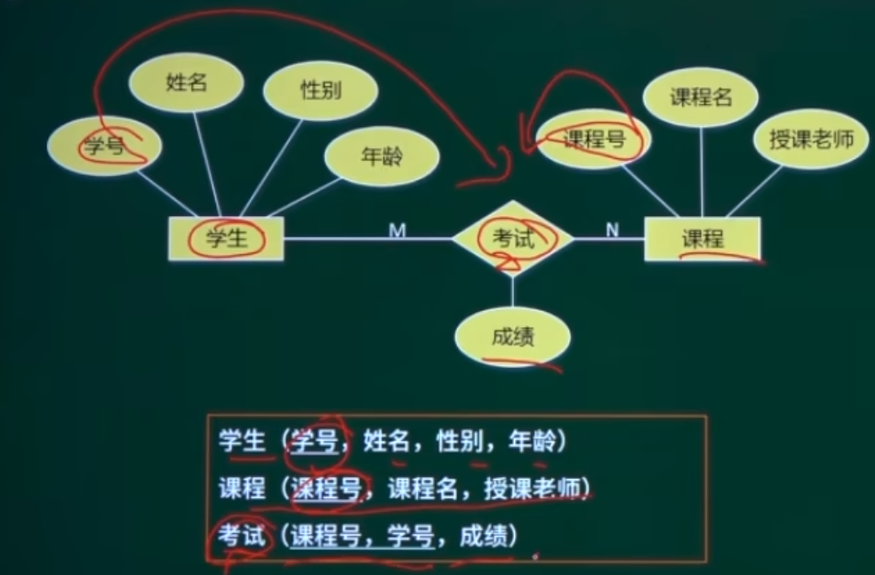

##### E-R图转关系模式

| 联系类型 | 实体（独立关系模式） | 联系（独立关系模式） | 联系（归并关系模式） | 备注       |
| -------- | -------------------- | -------------------- | -------------------- | ---------- |
| 1对1     | √                    | √                    | √                    | 并入任一端 |
| 1对多    | √                    | √                    | √                    | 并入多端   |
| 多对多   | √                    | √                    | ×                    |            |

## 关系代数

（2-4分）

### 关系代数–并、交、差

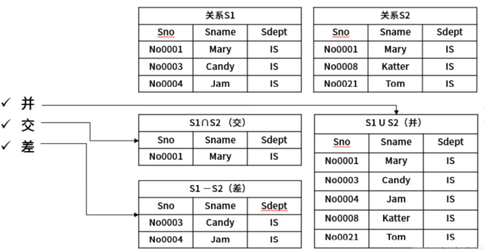

垂直：属性列，目，度

水平：元组行，记录，实例

并(结果为二者元组之和去除重复行)

交(结果为二者重复行)

差(前者去除二者重复行)

### 关系代数–笛卡尔积、投影、选择

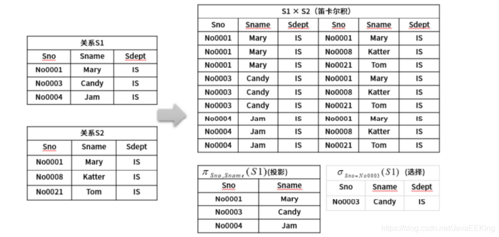

笛卡尔积：属性列数为二者属性列数之和，元组行数为二者乘积。

投影：对属性列的选择列出，就是把需要的字段显示出来即可。

选择：选择是根据某些条件对关系做水平切割，对元组行的选择列出如上述中Sn0-Sn0003(S1)，是指从S1中选择Sno字段为Snooo3的数据。

选择操作不会操作表格结构，笛卡尔积和投影可能会修改

### 关系代数–自然连接

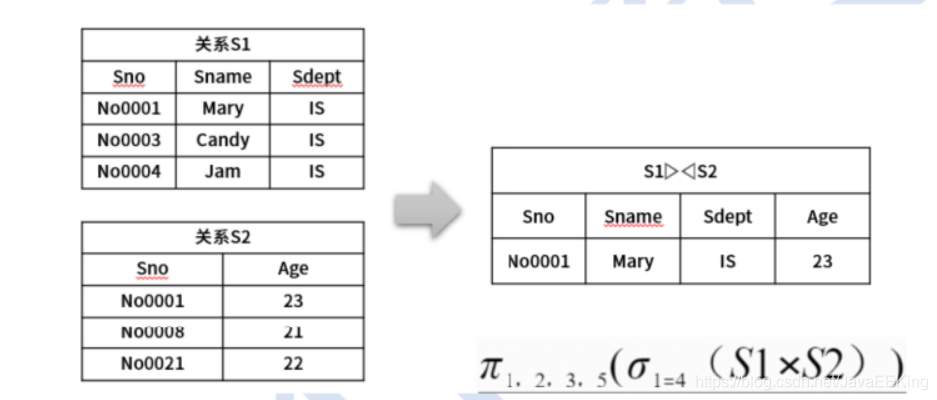

自然连接：属性列数是二者之和减去重复列数，元祖行与同名属性列取值相等

性能比较：

自然连接>笛卡尔

两侧数据应尽量先压缩、筛选

select 是投影的结果

from 多个表格是笛卡尔的结果

where 选择

### 例题

~~~
给定关系R (A，B，C，D)和关系S (A，C，E，F)，对其进行自然连接运R&S算后的属性列为 (C)个;
与oR.B>S.E(R&S)等价的关系代数表达式为(B)
A 4  B 5   C 6     D 8
A σ2>7(R×S)
B π1,2,3,4,7,8(σ1=5∧2>7∧3=6(R×S))
C σ2>'7'(R×S)
D π1,2,3,4,7,8(σ1=5∧2>'7'∧3=6(R×S))

下列查询B=“大数据”且F=“开发平台”，结果集属性列为A、B、C、F的关系代致表达式中，查询效率最高的是 (D) 。
A π1,2,3,8(σ2='大数据'∧1=5∧3=6∧8='开发平台'(R×S))
B π1,2,3,8(σ1=5∧3=6∧8='开发平台'(σ2='大数据'(R)×S)
C π1,2,3,8(σ2='大数据'∧1=5>3=6(R×σ4='开发平台'(S))
D π1,2,3,8(σ1=5∧3=6(σ2='大数据'(R)×σ4='开发平台'(S))
~~~

[数据库系统之：关系代数详解-超详细_数据库关系代数-CSDN博客](https://blog.csdn.net/JavaEEKing/article/details/109223552)

## 规范化理论

考点1：规范化理论基本概念

考点2：范式判断

考点3：模式分解

### 考点1：规范化理论基本概念

考的很频繁（上午2分，下午可能有）

#### 函数依赖

**定义**：设R(U)是属性U上的一个关系模式，X和Y是U的子集，r为R的任一关系，如果对于r中的任意两个元组u，v，只要有u[X]=v[X]，就有u[Y]=v[Y]，则称X函数决定Y，或称Y函数依赖于X，记为X→Y。（X决定因素，Y被决定因素）

函数依赖可扩展以下两种规则：

1. **部分函数依赖**：A可确定C，（A，B）也可确定C，（A，B）中的一部分（即A）可以确定C，称为部分函数依赖。
2. **传递函数依赖**：当A和B不等价时，A可确定B，B可确定C，则A可确定C，是传递函数依赖；若A和B等价，则不存在传递，直接就可确定C。

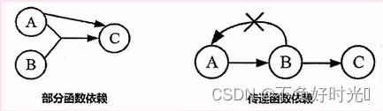

#### 规范化理论一Amstrong公理体系

关系模式R<U，F>来说有以下的推理规则:

A1.**自反律** (Reflexivity) ：若Y∈X∈U，则X→Y成立。

A2.**增广律** (Augmentation) ：若Z∈U且X→Y，则XZ→YZ成立。

A3.**传递律** (Transitivity) ：若X→Y且Y→Z，则X→Z成立。

根据A1，A2，A3这三条推理规则可以得到下面三条推理规则：

**合并规则**：由X→Y，X→Z，有X→YZ。(A2，A3)

**伪传递规则**：由X→Y，WY→Z，有XW→Z。(A2，A3)

**分解规则**：由X→Y及Z∈Y，有X→Z。(A1，A3)

#### 候选键

超键：能唯一标识此表的属性的组合。

候选键：超键中去掉冗余的属性，剩余的属性就是候选键。

主键：任选一个候选键，即可作为主键。

外键：其他表中的主键。

图示法求候选

1. 将关系的函数依赖关系，用“有向图”的方式表示。
2. 找出**入度为0**的属性，并以该属性集合为起点，尝试遍历有向图，若能正常遍历图中所有结点，则该属性集即为关系模式的候选键。
3. 若入度为0的属性集不能遍历图中所有结点，则需要尝试性的将一些**中间结点** (既有入度，也有出度的结点)并入入度为0的属性集中，直至该集合能遍历所有结点，集合为候选键。

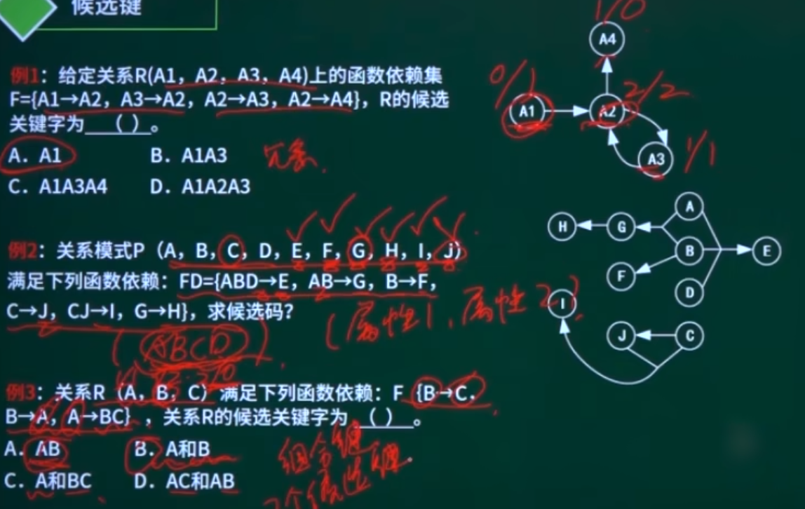

#### 主属性与非主属性

主属性：候选键内的属性为主属性，其他属性为非主属性。

~~~markdown
例1: 关系模式CSZ(CITV，ST，ZIP）, 其属性组上的函数依赖集为:F={（CITV，ST）→ZIP，ZIP→CITV},其中CITY表示城市，ST表示街道，ZIP表示邮政编码。
候选键有两个，都为组合键：（ST，CITV）（ST，ZIP）
主属性：CITV，ST，ZIP
非主属性：没有

例2: 若给定的关系模式为R，U={A,B,C}， F={AB→C,C→B}，则关系R(B)。
A有2个候选关键字AC和BC，并且有3个主属性
B有2个候选关键字AC和AB，并且有3个主属性
C只有一个候选关键字AC，并且有1个非主属性和2个主属性
D 只有一个候选关键字AB，并且有1个非主属性和2个主属性

例3: 给定关系模式R(U，F)，其中:U为关系模式R中的属性集，F是U上的一组函数依赖。假设U={A1，A2，A3，A4}，F={A1→A2，A1A2→A3，A1→A4，A2→A4}，那么关系R的主键应为 (A)。函数依赖集F中的(D)是冗余的。
A A1     B A1A2     C A1A3   D A1A2A3
A A1→A2  B A1A2→A3  C A1→A4  D A2→A4

例4: 给定关系模式RU，F>，其中U为属性集，F是U上的一组函数依赖，那么Armstrong公理系统的伪传递律是指 (B)。问题1选项
A 若X→Y，X→Z，则X→YZ为F所蕴涵   合并律
B 若X→Y，WY→Z，则XW→Z为F所蕴涵    伪传递律
C 若X→Y，Y→Z为F所蕴涵，则X→Z为F所蕴涵   传递率
D 若X→Y为F所蕴涵，且Z∈U，则XZ→YZ为F所蕴涵    增广律
~~~

实体完整性约束：即主键约束，主键值不能为空，也不能重复。

参照完整性约束：即外键约束，外键必须是其他表中已经存在的主键的值，或者为空。

用户自定义完整性约束：自定义表达式约束，如设定年龄属性的值必须在0到150之间。

### 考点2：范式判断

### 考点3：模式分解