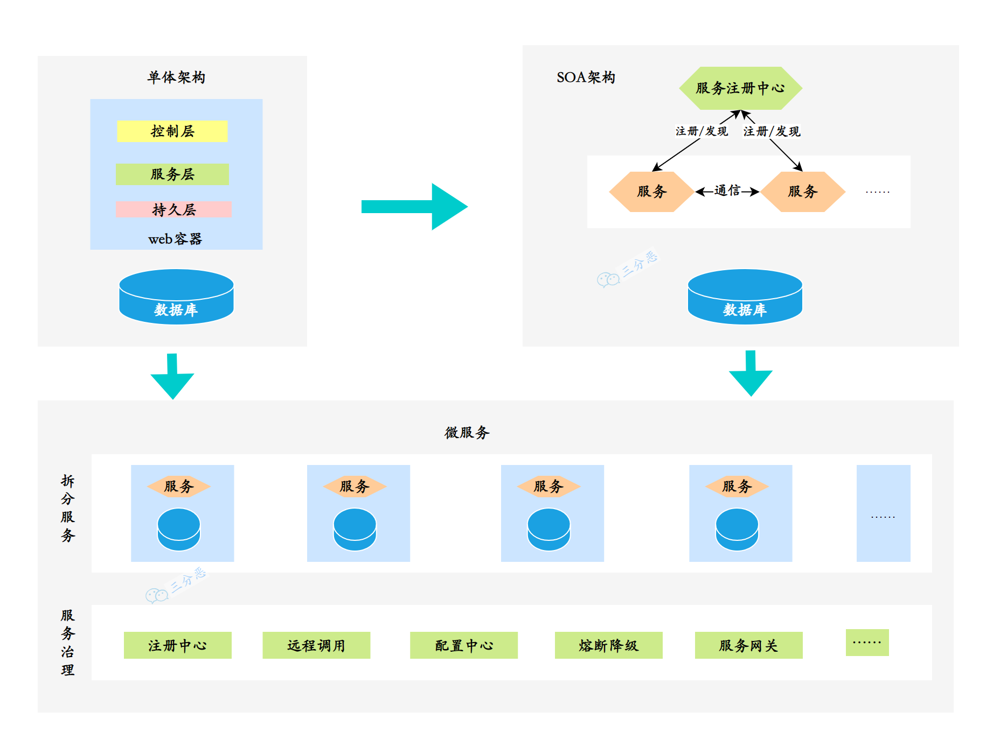
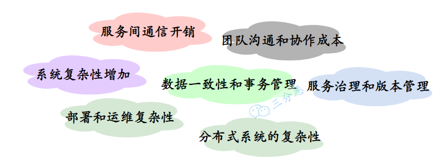
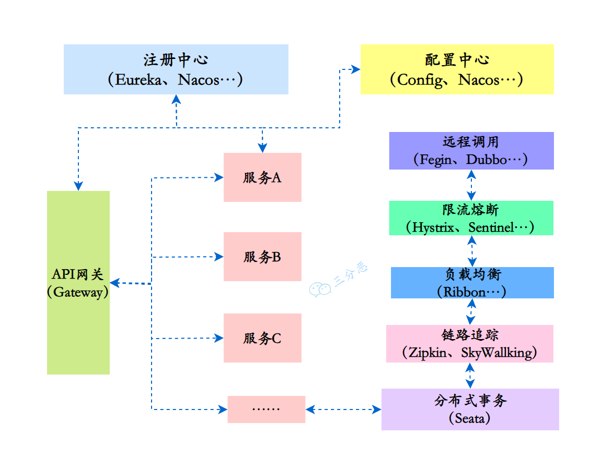

## 1.什么是微服务？

微服务（Microservices）是一种软件架构风格，将一个大型应用程序划分为一组小型、自治且松耦合的服务。每个微服务负责执行特定的业务功能，并通过轻量级通信机制（如HTTP）相互协作。每个微服务可以独立开发、部署和扩展，使得应用程序更加灵活、可伸缩和可维护。

在微服务的架构演进中，一般可能会存在这样的演进方向：单体式-->服务化-->微服务。

单体服务一般是所有项目最开始的样子：

- 单体服务（Monolithic Service）是一种传统的软件架构方式，将整个应用程序作为一个单一的、紧耦合的单元进行开发和部署。单体服务通常由多个模块组成，这些模块共享同一个数据库和代码库。然而，随着应用程序规模的增长，单体服务可能变得庞大且难以维护，且部署和扩展困难。

后来，单体服务过大，维护困难，渐渐演变到了分布式的SOA：

- SOA（Service-Oriented Architecture，面向服务的架构）是一种软件架构设计原则，强调将应用程序拆分为相互独立的服务，通过标准化的接口进行通信。SOA关注于服务的重用性和组合性，但并没有具体规定服务的大小。
- 微服务是在SOA的基础上进一步发展而来，是一种特定规模下的服务拆分和部署方式。微服务架构强调将应用程序拆分为小型、自治且松耦合的服务，每个服务都专注于特定的业务功能。这种架构使得应用程序更加灵活、可伸缩和可维护。

需要注意的是，微服务是一种特定的架构风格，而SOA是一种设计原则。微服务可以看作是对SOA思想的一种具体实践方式，但并不等同于SOA。

微服务与单体服务的区别在于规模和部署方式。微服务将应用程序拆分为更小的、自治的服务单元，每个服务都有自己的数据库和代码库，可以独立开发、测试、部署和扩展，带来了更大的灵活性、可维护性、可扩展性和容错性。

## 2.微服务带来了哪些挑战？

微服务架构不是万金油，尽它有很多优点，但是对于是否采用微服务架构，是否将原来的单体服务进行拆分，还是要考虑到服务拆分后可能带来的一些挑战和问题：

微服务带来的挑战

1. 系统复杂性增加：一个服务拆成了多个服务，整体系统的复杂性增加，需要处理服务之间的通信、部署、监控和维护等方面的复杂性。
2. 服务间通信开销：微服务之间通过网络进行通信，传递数据需要额外的网络开销和序列化开销，可能导致性能瓶颈和增加系统延迟。
3. 数据一致性和事务管理：每个微服务都有自己的数据存储，数据一致性和跨服务的事务管理变得更加复杂，需要额外解决分布式事务和数据同步的问题。
4. 部署和运维复杂性：微服务架构涉及多个独立部署的服务，对于部署、监控和容错机制的要求更高，需要建立适当的部署管道和自动化工具，以简化部署和运维过程。
5. 团队沟通和协作成本：每个微服务都由专门的团队负责，可能增加团队之间的沟通和协作成本。需要有效的沟通渠道和协作机制，确保服务之间的协调和一致性。
6. 服务治理和版本管理：随着微服务数量的增加，服务的治理和版本管理变得更加复杂。需要考虑服务的注册发现、负载均衡、监控和故障处理等方面，以确保整个系统的可靠性和稳定性。
7. 分布式系统的复杂性：微服务架构涉及构建和管理分布式系统，而分布式系统本身具有一些固有的挑战，如网络延迟、分布式一致性和容错性。

简单说，采用微服务需要权衡这些问题和挑战，根据实际的需求来选择对应的技术方案，很多时候单体能搞定的也可以用单体，不能为了微服务而微服务。

## 3.现在有哪些流行的微服务解决方案？

目前最主流的微服务开源解决方案有三种：

### Dubbo

- Dubbo 是一个高性能、轻量级的 Java 微服务框架，最初由阿里巴巴（Alibaba）开发并于2011年开源。它提供了服务注册与发现、负载均衡、容错、分布式调用等功能，后来一度停止维护，在近两年，又重新开始迭代，并推出了Dubbo3。
- Dubbo 使用基于 RPC（Remote Procedure Call）的通信模型，具有较高的性能和可扩展性。它支持多种传输协议（如TCP、HTTP、Redis）和序列化方式（如JSON、Hessian、Protobuf），可根据需求进行配置。
- Dubbo更多地被认为是一个高性能的RPC（远程过程调用）框架，一些服务治理功能依赖于第三方组件实现，比如使用ZooKeeper、Apollo等等。

### Spring Cloud Netflix

- Spring Cloud Netflix 是 Spring Cloud 的一个子项目，结合了 Netflix 开源的多个组件，但是Netflix自2018年停止维护和更新Netflix OSS项目，包括Eureka、Hystrix等组件，所以Spring Cloud Netflix也逐渐进入了维护模式。
- 该项目包含了许多流行的 Netflix 组件，如Eureka（服务注册与发现）、Ribbon（客户端负载均衡）、Hystrix（断路器）、Zuul（API 网关）等。它们都是高度可扩展的、经过大规模实践验证的微服务组件。

### Spring Cloud Alibaba

- Spring Cloud Alibaba 是 Spring Cloud 的另一个子项目，与阿里巴巴的分布式应用开发框架相关。它提供了一整套与 Alibaba 生态系统集成的解决方案。
- 该项目包括 Nacos（服务注册与发现、配置管理）、Sentinel（流量控制、熔断降级）、RocketMQ（消息队列）等组件，以及与 Alibaba Cloud（阿里云）的集成。它为构建基于 Spring Cloud 的微服务架构提供了丰富的选项。
- 据说SpringCloud Alibaba项目的发起人已经跑路去了腾讯，并发起了SpringCloud Tecent项目，社区发展存在隐忧。

### 这三种方案有什么区别吗？

三种方案的区别：

| 特点             | Dubbo                  | Spring Cloud Netflix         | Spring Cloud Alibaba             |
| ---------------- | ---------------------- | ---------------------------- | -------------------------------- |
| 开发语言         | Java                   | Java                         | Java                             |
| 服务治理         | 提供完整的服务治理功能 | 提供部分服务治理功能         | 提供完整的服务治理功能           |
| 服务注册与发现   | ZooKeeper/Nacos        | Eureka/Consul                | Nacos                            |
| 负载均衡         | 自带负载均衡策略       | Ribbon                       | Ribbon\Dubbo负载均衡策略         |
| 服务调用         | RPC方式                | RestTemplate/Feign           | Feign/RestTemplate/Dubbo         |
| 熔断器           | Sentinel               | Hystrix                      | Sentinel/Resilience4j            |
| 配置中心         | Apollo                 | Spring Cloud Config          | Nacos Config                     |
| API网关          | Higress/APISIX         | Zuul/Gateway                 | Spring Cloud Gateway             |
| 分布式事务       | Seata                  | 不支持分布式事务             | Seata                            |
| 限流和降级       | Sentinel               | Hystrix                      | Sentinel                         |
| 分布式追踪和监控 | Skywalking             | Spring Cloud Sleuth + Zipkin | SkyWalking或Sentinel Dashboard   |
| 微服务网格       | Dubbo Mesh             | 不支持微服务网格             | Service Mesh（Nacos+Dubbo Mesh） |
| 社区活跃度       | 相对较高               | 目前较低                     | 相对较高                         |
| 孵化和成熟度     | 孵化较早，成熟度较高   | 成熟度较高                   | 孵化较新，但迅速发展             |

> 在面试中，微服务一般主要讨论的是Spring Cloud Netflix，其次是Spring Cloud Alibaba，Dubbo更多的是作为一个RPC框架来问。

## 4.说下微服务有哪些组件？

微服务给系统开发带来了一些问题和挑战，如服务调用的复杂性、分布式事务的处理、服务的动态管理等。为了更好地解决这些问题和挑战，各种微服务治理的组件应运而生，充当微服务架构的基石和支撑。

微服务的各个组件和常见实现：

1. 注册中心：用于服务的注册与发现，管理微服务的地址信息。常见的实现包括：
   - Spring Cloud Netflix：Eureka、Consul
   - Spring Cloud Alibaba：Nacos
2. 配置中心：用于集中管理微服务的配置信息，可以动态修改配置而不需要重启服务。常见的实现包括：
   - Spring Cloud Netflix：Spring Cloud Config
   - Spring Cloud Alibaba：Nacos Config
3. 远程调用：用于在不同的微服务之间进行通信和协作。常见的实现保包括：
   - RESTful API：如RestTemplate、Feign
   - RPC（远程过程调用）：如Dubbo、gRPC
4. API网关：作为微服务架构的入口，统一暴露服务，并提供路由、负载均衡、安全认证等功能。常见的实现包括：
   - Spring Cloud Netflix：Zuul、Gateway
   - Spring Cloud Alibaba：Gateway、Apisix等
5. 分布式事务：保证跨多个微服务的一致性和原子性操作。常见的实现包括：
   - Spring Cloud Alibaba：Seata
6. 熔断器：用于防止微服务之间的故障扩散，提高系统的容错能力。常见的实现包括：
   - Spring Cloud Netflix：Hystrix
   - Spring Cloud Alibaba：Sentinel、Resilience4j
7. 限流和降级：用于防止微服务过载，对请求进行限制和降级处理。常见的实现包括：
   - Spring Cloud Netflix：Hystrix
   - Spring Cloud Alibaba：Sentinel
8. 分布式追踪和监控：用于跟踪和监控微服务的请求流程和性能指标。常见的实现包括：
   - Spring Cloud Netflix：Spring Cloud Sleuth + Zipkin
   - Spring Cloud Alibaba：SkyWalking、Sentinel Dashboard

