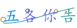
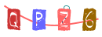
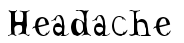
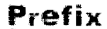
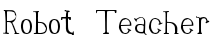

## EasyCaptcha效果

**算数类型：**

  


**英文字母：**

  


**中文类型：**

  


**GIF效果：**

  


**内置字体：**

  


## 基本使用

### 依赖引入

```xml
<dependency>
    <groupId>com.pig4cloud.plugin</groupId>
    <artifactId>captcha-spring-boot-starter</artifactId>
    <version>2.2.2</version>
</dependency>
```

### Controller层代码

在SpringBoot项目中一般生成图片后，转换成base64格式的字符串，前端直接在img标签的src设置返回的base64字符串即可展示图片，下面展示算数类型的验证码是如何生成的。

```java
@GetMapping("/getCode")
public String getCode() {
    SpecCaptcha specCaptcha = new SpecCaptcha(130, 48, 5);
    String verCode = specCaptcha.text().toLowerCase();
    log.info("生成的验证码结果为：{}，在项目中应该将结果保存到Redis中", verCode);

    // 将base64返回给前端
    return specCaptcha.toBase64();
}
```


base64在线转换工具：https://tool.chinaz.com/tools/imgtobase/


### 自定义验证码：类型、字体

CharType：验证码字符类型

| 类型               | 描述           |
| ------------------ | -------------- |
| TYPE_DEFAULT       | 数字和字母混合 |
| TYPE_ONLY_NUMBER   | 纯数字         |
| TYPE_ONLY_CHAR     | 纯字母         |
| TYPE_ONLY_UPPER    | 纯大写字母     |
| TYPE_ONLY_LOWER    | 纯小写字母     |
| TYPE_NUM_AND_UPPER | 数字和大写字母 |

Font：字体

| 字体            | 效果                                                  |
| --------------- | ----------------------------------------------------- |
| Captcha.FONT_1  |  |
| Captcha.FONT_2  |  |
| Captcha.FONT_3  |  |
| Captcha.FONT_4  |  |
| Captcha.FONT_5  |  |
| Captcha.FONT_6  |  |
| Captcha.FONT_7  |  |
| Captcha.FONT_8  |  |
| Captcha.FONT_9  |  |
| Captcha.FONT_10 |  |

代码

```java
@GetMapping
public String getCode() throws IOException, FontFormatException {
    SpecCaptcha specCaptcha = new SpecCaptcha(130, 48, 5);
    String verCode = specCaptcha.text().toLowerCase();
    log.info("生成的验证码结果为：{}，在项目中应该将结果保存到Redis中", verCode);
    // 设置字体
    specCaptcha.setFont(Captcha.FONT_1);  // 有默认字体，可以不用设置
    // 设置类型，纯数字、纯字母、字母数字混合
    specCaptcha.setCharType(Captcha.TYPE_ONLY_NUMBER);
    // 将base64返回给前端
    return specCaptcha.toBase64();
}
```

### 自定义验证码：数字计算验证码

```java
@GetMapping
public String getCode() {
    ArithmeticCaptcha captcha = new ArithmeticCaptcha(130, 48);
    captcha.setLen(3);  // 几位数运算，默认是两位
    captcha.getArithmeticString();  // 获取运算的公式：3+2=?
    String code = captcha.text();// 获取运算的结果：5
    log.info("生成的验证码结果为：{}，在项目中应该将结果保存到Redis中", code);
    // 将base64返回给前端
    return captcha.toBase64();
}
```