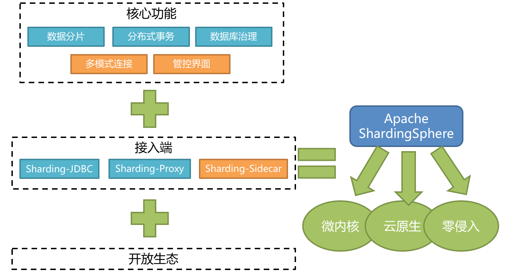
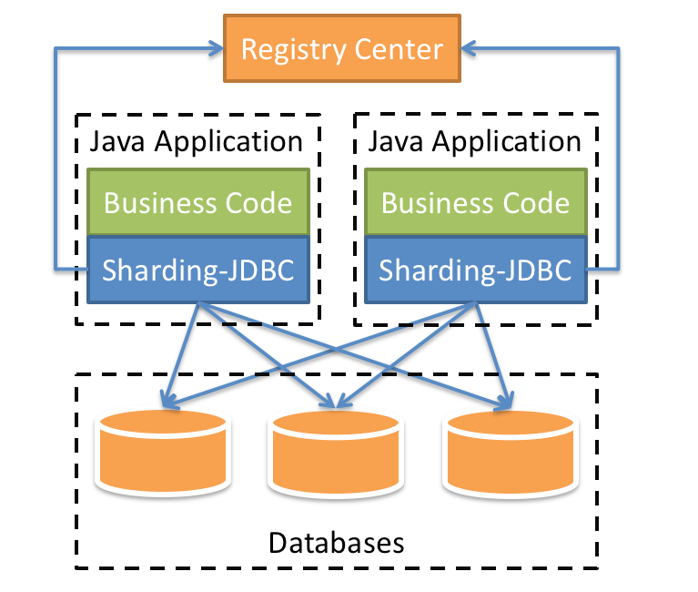
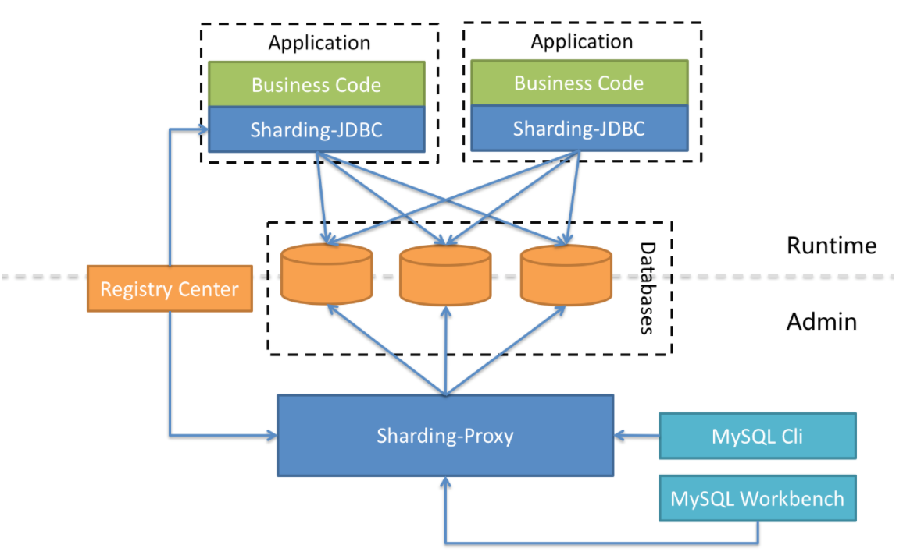
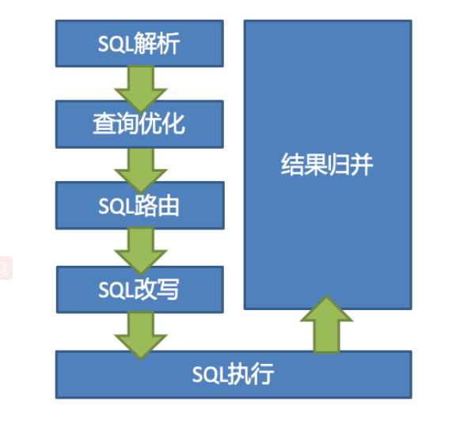

## 一、ShardingJdbc的概述

> 官网：http://shardingsphere.apache.org/index_zh.html
>
> 下载地址：https://shardingsphere.apache.org/document/current/cn/downloads/
>
> 快速入门：https://shardingsphere.apache.org/document/current/cn/quick-start/shardingsphere-jdbc-quick-start/

以下来自官网的原话：

Apache ShardingSphere 是一套开源的分布式数据库解决方案组成的生态圈，它由 JDBC、Proxy 和 Sidecar（规划中）这 3 款既能够独立部署，又支持混合部署配合使用的产品组成。 它们均提供标准化的数据水平扩展、分布式事务和分布式治理等功能，可适用于如 Java 同构、异构语言、云原生等各种多样化的应用场景。

Apache ShardingSphere 旨在充分合理地在分布式的场景下利用关系型数据库的计算和存储能力，而并非实现一个全新的关系型数据库。 关系型数据库当今依然占有巨大市场份额，是企业核心系统的基石，未来也难于撼动，我们更加注重在原有基础上提供增量，而非颠覆。

Apache ShardingSphere 5.x 版本开始致力于可插拔架构，项目的功能组件能够灵活的以可插拔的方式进行扩展。 目前，数据分片、读写分离、数据加密、影子库压测等功能，以及 MySQL、PostgreSQL、SQLServer、Oracle 等 SQL 与协议的支持，均通过插件的方式织入项目。 开发者能够像使用积木一样定制属于自己的独特系统。Apache ShardingSphere 目前已提供数十个 SPI 作为系统的扩展点，仍在不断增加中。

ShardingSphere 已于2020年4月16日成为 Apache 软件基金会的顶级项目。

## 二、关于改名问题

在3.0以后就更改成了ShardingSphere。

## 三、认识shardingjdbc

定位为轻量级 Java 框架，在 Java 的 JDBC 层提供的额外服务。 它使用客户端直连数据库，以 jar 包形式提供服务，无需额外部署和依赖，可理解为增强版的 JDBC 驱动，完全兼容 JDBC 和各种 ORM 框架。

适用于任何基于 JDBC 的 ORM 框架，如：JPA, Hibernate, Mybatis, Spring JDBC Template 或直接使用 JDBC。

支持任何第三方的数据库连接池，如：DBCP, C3P0, BoneCP, Druid, HikariCP 等。
支持任意实现 JDBC 规范的数据库，目前支持 MySQL，Oracle，SQLServer，PostgreSQL 以及任何遵循 SQL92 标准的数据库。

## 四、认识shardingjdbc功能架构图

## 五、认识Sharding-Proxy

- 向应用程序完全透明，可直接当做 MySQL/PostgreSQL 使用。
- 适用于任何兼容 MySQL/PostgreSQL 协议的的客户端。

## 六、三个组件的比较

|            | Sharding-Jdbc | Sharding-Proxy | Sharding-Sidecar |
| ---------- | ------------- | -------------- | ---------------- |
| 数据库     | 任意          | MYSQL          | MYSQL            |
| 连接消耗数 | 高            | 低             | 低               |
| 异构语言   | 仅Java        | 任意           | 任意             |
| 性能       | 损耗低        | 损耗高         | 损耗低           |
| 中心化     | 是            | 否             | 是               |
| 静态入口   | 无            | 有             | 无               |

## 七、ShardingJdbc混合架构

ShardingSphere-JDBC 采用无中心化架构，适用于 Java 开发的高性能的轻量级 OLTP（连接事务处理） 应用；ShardingSphere-Proxy 提供静态入口以及异构语言的支持，适用于 OLAP（连接数据分析） 应用以及对分片数据库进行管理和运维的场景。

Apache ShardingSphere 是多接入端共同组成的生态圈。 通过混合使用 ShardingSphere-JDBC 和 ShardingSphere-Proxy，并采用同一注册中心统一配置分片策略，能够灵活的搭建适用于各种场景的应用系统，使得架构师更加自由地调整适合与当前业务的最佳系统架构。

八、ShardingShpere的功能清单

- 功能列表
  - 数据分片
  - 分库 & 分表
  - 读写分离
  - 分片策略定制化
  - 无中心化分布式主键
- 分布式事务
  - 标准化事务接口
  - XA 强一致事务
  - 柔性事务
  - 数据库治理
- 分布式治理
  - 弹性伸缩
  - 可视化链路追踪
  - 数据加密

## 九、 ShardingSphere数据分片内核剖析

ShardingSphere 的 3 个产品的数据分片主要流程是完全一致的。 核心由 SQL 解析 => 执行器优化 => SQL 路由 => SQL 改写 => SQL 执行 => 结果归并的流程组成。

1. SQL 解析

   分为词法解析和语法解析。 先通过词法解析器将 SQL 拆分为一个个不可再分的单词。再使用语法解析器对 SQL 进行理解，并最终提炼出解析上下文。 解析上下文包括表、选择项、排序项、分组项、聚合函数、分页信息、查询条件以及可能需要修改的占位符的标记。

2. 执行器优化

   合并和优化分片条件，如 OR 等。

3. SQL 路由

   根据解析上下文匹配用户配置的分片策略，并生成路由路径。目前支持分片路由和广播路由。

4. SQL 改写

   将 SQL 改写为在真实数据库中可以正确执行的语句。SQL 改写分为正确性改写和优化改写。

5. SQL 执行

   通过多线程执行器异步执行。

6. 结果归并

   将多个执行结果集归并以便于通过统一的 JDBC 接口输出。结果归并包括流式归并、内存归并和使用装饰者模式的追加归并这几种方式。
   

### 配置

#### sharding3

分库分表（sharding3版本）：https://blog.csdn.net/zxp2624161989/article/details/107094560/

不分库只分表（sharding3版本）：https://www.bilibili.com/video/BV1id4y1z7St、https://blog.csdn.net/zxp2624161989/article/details/107094560/

水平分片：
创建测试数据局test_order。分别创建三张表t_address， t_user0，t_user1。
这里假设t_user这个预计随着系统的运行。
公司发展很好，以后数据量会暴增。所以提前进行水平分片存储。相对于垂直分片，它不再将数据根据业务逻辑分类，
而是通过某个字段（或某几个字段），根据某种规则将数据分散至多个库或表中，
每个分片仅包含数据的一部分。这样单表数据量降下来了，mysql的B+树的检索效率就提高了。

#### sharding4

不分库只分表（sharding4版本）yml配置：https://blog.csdn.net/weixin_40816738/article/details/126802777
分表配置后加载报错，ShardingParsingRuleRegistry：https://www.codenong.com/cs105364582/
方法一：将 jdk的运行版本降为 1.8。
方法二：将 JAXB 相关jar包重新引入，具体maven。

分库分表（sharding4版本）yml配置：https://blog.csdn.net/akenseren/article/details/127350807
https://www.jianshu.com/p/3b3f7c6fd288

### 参考资料

[1]. https://www.cnblogs.com/architectforest/p/13537436.html

[2]. 狂神视频：https://www.bilibili.com/video/BV1ei4y1K7dn
狂神笔记：https://blog.csdn.net/qq_44866424/article/details/120009099

[3]. win下配置主从复制（不推荐在win上配置）
https://blog.csdn.net/qq_27991253/article/details/128017412

### 面试问题

1、与mycat区别：

https://www.zhihu.com/question/64709787

### sharding使用中的一些问题：

1、sharding + MP 启动后无法执行查询：Error querying database？

解决方式：修改版本为4.1.1，使其支持子查询。

https://blog.csdn.net/u014106644/article/details/128335532

4.0.0-RC1版本是有限制支持子查询的 主查询和子查询必须保证相同的分片键;

4.1.1可以支持子查询  子查询判断条件恒为false;

5.0版本 Federation 执行引擎支持子查询；

2、警告：spring boot 集成 sharding jdbc 分库分表 数据库连接健康检查不通过

https://www.cnblogs.com/maohuidong/p/15006724.html

3、服务器配置主从复制报错：Fatal error:The slave I/O thread stops because master and slave have equal MySQL server UUIDs？

原因：使用了VMware克隆了两台虚拟机作为主机和从机导致UUID一样。

解决：找到主机和从机的auto.cnf文件修改uuid值或删除auto.cnf这个文件。

https://blog.csdn.net/cnds123321/article/details/117925881

4、Sharding-JDBC整合Mybatisplus分片键生成策略冲突问题及分析解决

https://blog.csdn.net/weixin_43584430/article/details/120367418

