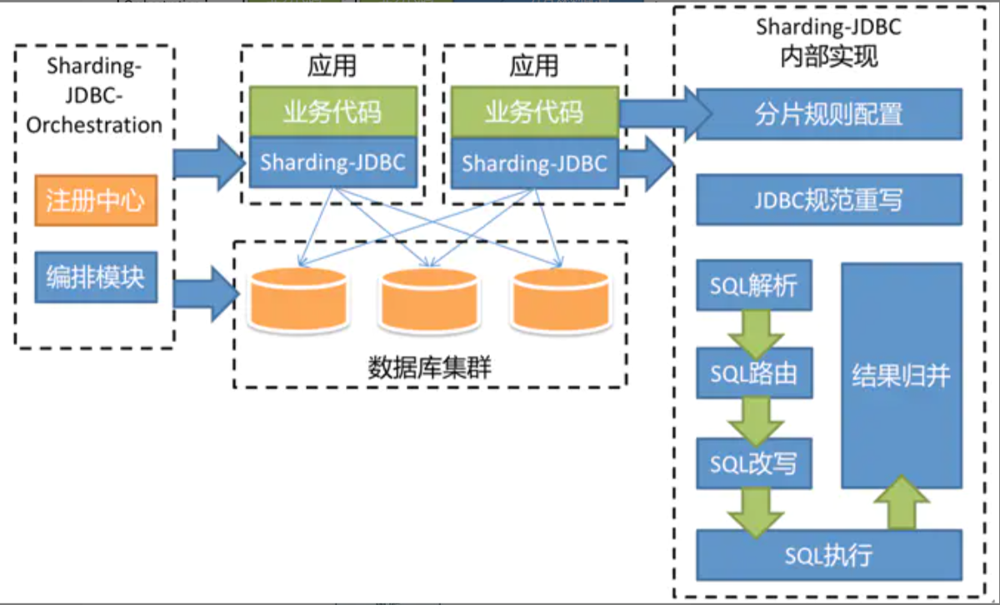
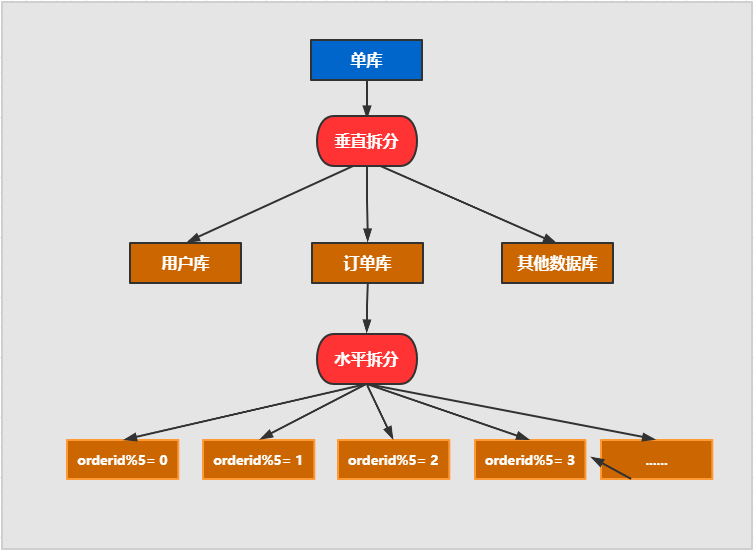
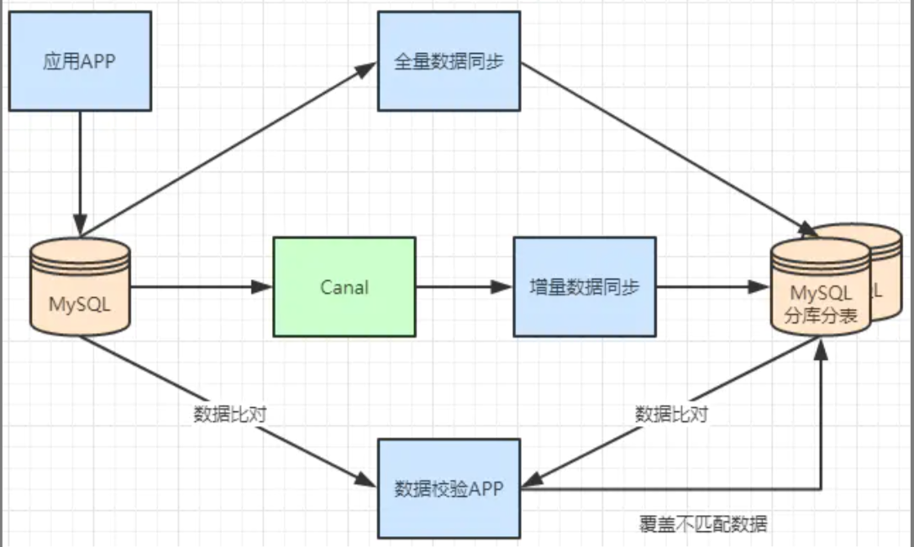

## MySQL分库分表原理

### 1、为什么要分库分表

一般的机器（4核16G），单库的MySQL并发（QPS+TPS）超过了2k，系统基本就完蛋了。最好是并发量控制在1k左右。这里就引出一个问题，为什么要分库分表？

分库分表目的：解决高并发，和数据量大的问题。

1、高并发情况下，会造成IO读写频繁，自然就会造成读写缓慢，甚至是宕机。一般单库不要超过2k并发，NB的机器除外。

2、数据量大的问题。主要由于底层索引实现导致，MySQL的索引实现为B+TREE，数据量其他，会导致索引树十分庞大，造成查询缓慢。第二，innodb的最大存储限制64TB。

要解决上述问题。最常见做法，就是分库分表。

分库分表的目的，是将一个表拆成N个表，就是让每个表的数据量控制在一定范围内，保证SQL的性能。 一个表数据建议不要超过500W。

### 2、分库分表

又分为垂直拆分和水平拆分。

**水平拆分：**统一个表的数据拆到不同的库不同的表中。可以根据时间、地区、或某个业务键维度，也可以通过hash进行拆分，最后通过路由访问到具体的数据。拆分后的每个表结构保持一致。

**垂直拆分：**就是把一个有很多字段的表给拆分成多个表，或者是多个库上去。每个库表的结构都不一样，每个库表都包含部分字段。一般来说，可以根据业务维度进行拆分，如订单表可以拆分为订单、订单支持、订单地址、订单商品、订单扩展等表；也可以，根据数据冷热程度拆分，20%的热点字段拆到一个表，80%的冷字段拆到另外一个表。

### 3、不停机分库分表数据迁移

一般数据库的拆分也是有一个过程的，一开始是单表，后面慢慢拆成多表。那么我们就看下如何平滑的从MySQL单表过度到MySQL的分库分表架构。

1、利用mysql+canal做增量数据同步，利用分库分表中间件，将数据路由到对应的新表中。

2、利用分库分表中间件，全量数据导入到对应的新表中。

3、通过单表数据和分库分表数据两两比较，更新不匹配的数据到新表中。

4、数据稳定后，将单表的配置切换到分库分表配置上。

### 4、小结

垂直拆分：业务模块拆分、商品库，用户库，订单库

水平拆分：对表进行水平拆分（也就是我们说的：分表）

表进行垂直拆分：表的字段过多，字段使用的频率不一。（可以拆分两个表建立1:1关系）