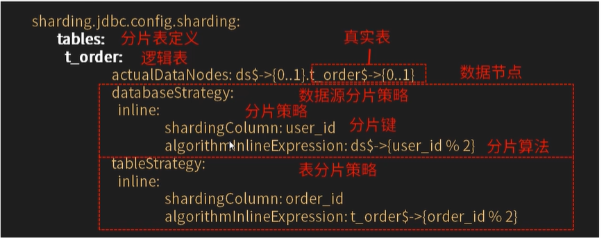
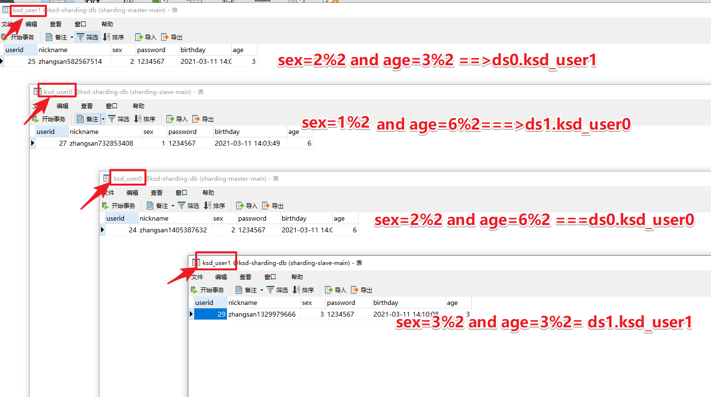

## 逻辑表

逻辑表是指：水平拆分的数据库或者数据表的相同路基和数据结构表的总称。

比如用户数据根据用户id%2拆分为2个表，分别是：ksd_user0和ksd_user1。他们的逻辑表名是：ksd_user

在shardingjdbc中的定义方式如下：

~~~yaml
spring:
  shardingsphere:
    sharding:
      tables:
        # ksd_user 逻辑表名
        ksd_user:
~~~

## 分库分表数据节点 - actual-data-nodes

~~~yaml
 tables:
        # ksd_user 逻辑表名
        ksd_user:
          # 数据节点：多数据源$->{0..N}.逻辑表名$->{0..N} 相同表
          actual-data-nodes: ds$->{0..2}.ksd_user$->{0..1}
           # 数据节点：多数据源$->{0..N}.逻辑表名$->{0..N} 不同表
          actual-data-nodes: ds0.ksd_user$->{0..1},ds1.ksd_user$->{2..4}
          # 指定单数据源的配置方式
          actual-data-nodes: ds0.ksd_user$->{0..4}
          # 全部手动指定
          actual-data-nodes: ds0.ksd_user0,ds1.ksd_user0,ds0.ksd_user1,ds1.ksd_user1,

~~~

数据分片是最小单元。由数据源名称和数据表组成，比如：ds0.ksd_user0。

寻找规则如下：

## 分库分表5种分片策略

数据源分片分为两种：

- 数据源分片
- 表分片

这两个是不同维度的分片规则，但是它们额能用的分片策略和规则是一样的。它们由两部分构成：

- 分片键
- 分片算法

### 第一种：none

对应NoneShardingStragey,不分片策略，SQL会被发给所有节点去执行，这个规则没有子项目可以配置。

### 第二种：inline 行表达时分片策略(核心，必须要掌握)

对应InlineShardingStragey。使用Groovy的表达时，提供对SQL语句种的=和in的分片操作支持，只支持单分片键。对于简单的分片算法，可以通过简单的配置使用，从而避免繁琐的Java代码开放，如：ksd_user${分片键（数据表字段）userid % 5} 表示ksd_user表根据某字段（userid）模 5.从而分为5张表，表名称为：ksd_user0到ksd_user4 。如果库也是如此。

~~~yaml
server:
  port: 8085
spring:
  main:
    allow-bean-definition-overriding: true
  shardingsphere:
    # 参数配置，显示sql
    props:
      sql:
        show: true
    sharding:
      # 默认数据源，主要用于写，注意一定要配置读写分离 ,注意：如果不配置，那么就会把三个节点都当做从slave节点，新增，修改和删除会出错。
      default-data-source-name: ds0
      # 配置分表的规则
      tables:
        # ksd_user 逻辑表名
        ksd_user:
          # 数据节点：数据源$->{0..N}.逻辑表名$->{0..N}
          actual-data-nodes: ds$->{0..1}.ksd_user$->{0..1}
          # 拆分库策略，也就是什么样子的数据放入放到哪个数据库中。
          database-strategy:
            inline:
              sharding-column: sex    # 分片字段（分片键）
              algorithm-expression: ds$->{sex % 2} # 分片算法表达式
          # 拆分表策略，也就是什么样子的数据放入放到哪个数据表中。
          table-strategy:
            inline:
              sharding-column: age    # 分片字段（分片键）
              algorithm-expression: ksd_user$->{age % 2} # 分片算法表达式

~~~

algorithm-expression行表达式：

- ${begin…end} 表示区间范围。
- ${[unit1,unit2,….,unitn]} 表示枚举值。
- 行表达式种如果出现连续多个e x p r e s s s i o n 或 {expresssion}或expresssion或->{expression}表达式，整个表达时最终的结果将会根据每个子表达式的结果进行笛卡尔组合。

1、完整案例和配置如下

准备两个数据库ksd_sharding-db。名字相同，两个数据源ds0和ds1

每个数据库下方ksd_user0和ksd_user1即可。

数据库规则，性别为偶数的放入ds0库，奇数的放入ds1库。

数据表规则：年龄为偶数的放入ksd_user0库，奇数的放入ksd_user1库。

~~~yaml
server:
  port: 8085
spring:
  main:
    allow-bean-definition-overriding: true
  shardingsphere:
    # 参数配置，显示sql
    props:
      sql:
        show: true
    # 配置数据源
    datasource:
      # 给每个数据源取别名，下面的ds1,ds1任意取名字
      names: ds0,ds1
      # 给master-ds1每个数据源配置数据库连接信息
      ds0:
        # 配置druid数据源
        type: com.alibaba.druid.pool.DruidDataSource
        driver-class-name: com.mysql.cj.jdbc.Driver
        url: jdbc:mysql://localhost:3306/xxl-sharding-db1?useUnicode=true&characterEncoding=utf8&tinyInt1isBit=false&useSSL=false&serverTimezone=GMT
        username: root
        password: xxl666
        maxPoolSize: 100
        minPoolSize: 5
      # 配置ds1-slave
      ds1:
        type: com.alibaba.druid.pool.DruidDataSource
        driver-class-name: com.mysql.cj.jdbc.Driver
        url: jdbc:mysql://localhost:3306/xxl-sharding-db2?useUnicode=true&characterEncoding=utf8&tinyInt1isBit=false&useSSL=false&serverTimezone=GMT
        username: root
        password: xxl666
        maxPoolSize: 100
        minPoolSize: 5
    # 配置默认数据源ds0
    sharding:
      # 默认数据源，主要用于写，注意一定要配置读写分离 ,注意：如果不配置，那么就会把三个节点都当做从slave节点，新增，修改和删除会出错。
      default-data-source-name: ds0
      # 配置分表的规则
      tables:
        # ksd_user 逻辑表名
        ksd_user:
          # 数据节点：数据源$->{0..N}.逻辑表名$->{0..N}
          actual-data-nodes: ds$->{0..1}.ksd_user$->{0..1}
          # 拆分库策略，也就是什么样子的数据放入放到哪个数据库中。
          database-strategy:
            inline:
              sharding-column: sex    # 分片字段（分片键）
              algorithm-expression: ds$->{sex % 2} # 分片算法表达式
          # 拆分表策略，也就是什么样子的数据放入放到哪个数据表中。
          table-strategy:
            inline:
              sharding-column: age    # 分片字段（分片键）
              algorithm-expression: ksd_user$->{age % 2} # 分片算法表达式
# 整合mybatis的配置XXXXX
mybatis:
  mapper-locations: classpath:mapper/*.xml
  type-aliases-package: com.xxl.shardingjdbc.entity

~~~

结果如下图：

### 第三种：根据实时间日期 - 按照标准规则分库分表

1、 标准分片 - Standard(了解)

对应StrandardShardingStrategy.提供对SQL语句中的=，in和恶between and 的分片操作支持。

StrandardShardingStrategy只支持但分片键。提供PreciseShardingAlgorithm和RangeShardingAlgorithm两个分片算法。

PreciseShardingAlgorithm是必选的呃，用于处理=和IN的分片和RangeShardingAlgorithm是可选的，是用于处理Betwwen and分片，如果不配置和RangeShardingAlgorithm,SQL的Between AND 将按照全库路由处理。

2、定义分片的日期规则配置

~~~yaml
server:
  port: 8085
spring:
  main:
    allow-bean-definition-overriding: true
  shardingsphere:
    # 参数配置，显示sql
    props:
      sql:
        show: true
    # 配置数据源
    datasource:
      # 给每个数据源取别名，下面的ds1,ds1任意取名字
      names: ds0,ds1
      # 给master-ds1每个数据源配置数据库连接信息
      ds0:
        # 配置druid数据源
        type: com.alibaba.druid.pool.DruidDataSource
        driver-class-name: com.mysql.cj.jdbc.Driver
        url: jdbc:mysql://localhost:3306/xxl-sharding-db1?useUnicode=true&characterEncoding=utf8&tinyInt1isBit=false&useSSL=false&serverTimezone=GMT
        username: root
        password: xxl666
        maxPoolSize: 100
        minPoolSize: 5
      # 配置ds1-slave
      ds1:
        type: com.alibaba.druid.pool.DruidDataSource
        driver-class-name: com.mysql.cj.jdbc.Driver
        url: jdbc:mysql://localhost:3306/xxl-sharding-db2?useUnicode=true&characterEncoding=utf8&tinyInt1isBit=false&useSSL=false&serverTimezone=GMT
        username: root
        password: xxl666
        maxPoolSize: 100
        minPoolSize: 5
    # 配置默认数据源ds0
    sharding:
      # 默认数据源，主要用于写，注意一定要配置读写分离 ,注意：如果不配置，那么就会把三个节点都当做从slave节点，新增，修改和删除会出错。
      default-data-source-name: ds0
      # 配置分表的规则
      tables:
        # ksd_user 逻辑表名
        ksd_user:
          # 数据节点：数据源$->{0..N}.逻辑表名$->{0..N}
          actual-data-nodes: ds$->{0..1}.ksd_user$->{0..1}
          # 拆分库策略，也就是什么样子的数据放入放到哪个数据库中。
          database-strategy:
            standard:
              shardingColumn: birthday
              preciseAlgorithmClassName: com.xuexiangban.shardingjdbc.algorithm.BirthdayAlgorithm
          table-strategy:
            inline:
              sharding-column: age    # 分片字段（分片键）
              algorithm-expression: ksd_user$->{age % 2} # 分片算法表达式
# 整合mybatis的配置XXXXX
mybatis:
  mapper-locations: classpath:mapper/*.xml
  type-aliases-package: com.xxl.shardingjdbc.entity

~~~

3、定义分片的日期规则

~~~java

public class BirthdayAlgorithm implements PreciseShardingAlgorithm<Date> {
    List<Date> dateList = new ArrayList<>();
    {
        Calendar calendar1 = Calendar.getInstance();
        calendar1.set(2020, 1, 1, 0, 0, 0);
        Calendar calendar2 = Calendar.getInstance();
        calendar2.set(2021, 1, 1, 0, 0, 0);
        Calendar calendar3 = Calendar.getInstance();
        calendar3.set(2022, 1, 1, 0, 0, 0);
        dateList.add(calendar1.getTime());
        dateList.add(calendar2.getTime());
        dateList.add(calendar3.getTime());
    }
    @Override
    public String doSharding(Collection<String> collection, PreciseShardingValue<Date> preciseShardingValue) {
        // 获取属性数据库的值
        Date date = preciseShardingValue.getValue();
        // 获取数据源的名称信息列表
        Iterator<String> iterator = collection.iterator();
        String target = null;
        for (Date s : dateList) {
            target = iterator.next();
            // 如果数据晚于指定的日期直接返回
            if (date.before(s)) {
                break;
            }
        }
        return target;
    }
}

~~~

4、测试查看结果

http://localhost:8085/user/save?sex=3&age=3&birthday=2020-03-09 —- ds1

http://localhost:8085/user/save?sex=3&age=3&birthday=2021-03-09 —- ds0

### 第四种：ShardingSphere - 符合分片策略（了解）

对应接口：HintShardingStrategy。通过Hint而非SQL解析的方式分片的策略。

对于分片字段非SQL决定，而是由其他外置条件决定的场景，克使用SQL hint灵活的注入分片字段。例如：按照用户登录的时间，主键等进行分库，而数据库中并无此字段。SQL hint支持通过Java API和SQL注解两种方式使用。让后分库分表更加灵活。

### 第五种：ShardingSphere - hint分片策略（了解）

对应ComplexShardingStrategy。符合分片策略提供对SQL语句中的，in和between and的分片操作支持。
ComplexShardingStrategy支持多分片键，由于多分片键之间的关系复杂，因此并未进行过多的封装，而是直接将分片键组合以及分片操作符透传至分片算法，完全由开发者自己实现，提供最大的灵活度。

