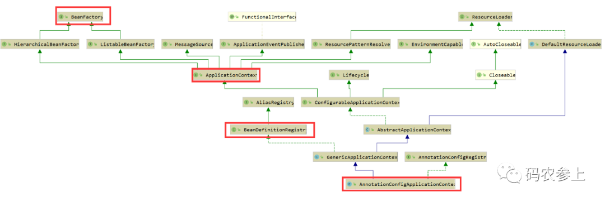
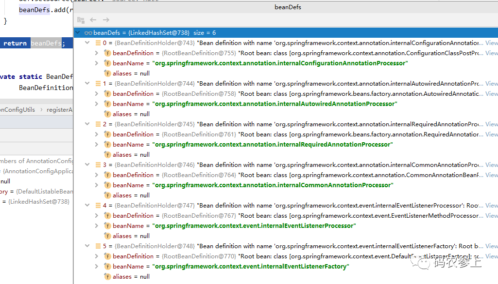

在开始进行源码学习前，首先再回顾一下三种Spring编程风格：

- 基于`Schema`，即通过`xml`标签的配置方式
- 基于`Annotation`的注解技术，使用`@Component`等注解配置bean
- 基于`Java Config`，简单来说就是使用`@Configuration`和`@Bean`进行配置

基于注解的方式需要通过xml或java config来开启。在使用xml时，需要手动开启对注解的支持：

```xml
<context: annotation-config/> 
```

当然，如果在xml中配置了扫描包，现在也可以光添加下面这一行，这行代码中已经包含了注解的开启功能。

```xml
<context: component-sacn base-package="com"/>
```

如果使用的是下面`AnnotationConfigApplicationContext`这种方式，那么就不需要添加任何操作了，其中已经包含了对注解的支持。

```java
AnnotationConfigApplicationContext ctx
	=new AnnotationConfigApplicationContext(SpringConfig.class);
```

在实际使用过程中，三种方式是可以混合使用的，不存在冲突。按照下面这种方式作为`AnnotationConfigApplicationContext`传入的配置文件，即可实现三种风格的统一使用：

```java
@Configuration
@ComponentScan("com")
@ImportResource("classpath:spring.xml") 
public class SpringConfig{
}
```

官方更推荐使用注解的方式。

Spring Boot更多的是基于注解，省略了很多配置的过程，对新手更加友好，降低了劝退率，所以本文将基于注解的方式进行源码解析，另外再说明一下本文基于`spring-framework-5.0.x`源码。

使用注解的方式初始化一个Spring环境，只需要下面一行代码：

```java
AnnotationConfigApplicationContext context
    = new AnnotationConfigApplicationContext(SpringConfig.class);
```

如果看一下它的构造方法，那么可以将它做的工作拆分为三步，为了便于理解可以写成下面的形式，并分为三大模块分别进行说明。

## 构造方法

首先看一下`AnnotationConfigApplicationContext`的继承关系：



`AnnotationConfigApplicationContext`继承了`GenericApplicationContext`，那么我们先看`GenericApplicationContext`的构造方法：


```java
public GenericApplicationContext() {
  this.beanFactory = new DefaultListableBeanFactory();
}
```

在这里初始化了一个`beanFactory`的实现类`DefaultListableBeanFactory`，这就是我们常提到的spring中重要的bean工厂，这里面存放了很多非常重要的数据结构。这里先列出比较重要的`beanDefinitionMap`，会在后面频繁使用：


```java
private final Map<String, BeanDefinition> beanDefinitionMap = new ConcurrentHashMap<>(256);
private volatile List<String> beanDefinitionNames = new ArrayList<>(256);
```

在上面的这个`beanDefinitionMap`中就维护了`beanName`及`BeanDefinition`的对应关系，`beanDefinitionNames`则是一个存放`beanName`的List。

从`AnnotationConfigApplicationContext`的构造方法开始分析：


```java
public AnnotationConfigApplicationContext() {
  this.reader = new AnnotatedBeanDefinitionReader(this);
  this.scanner = new ClassPathBeanDefinitionScanner(this);
}
```

首先实例化了一个`AnnotatedBeanDefinitionReader`对象，看一下`AnnotatedBeanDefinitionReader`的构造函数：


```java
public AnnotatedBeanDefinitionReader(BeanDefinitionRegistry registry) {
  this(registry, getOrCreateEnvironment(registry));
}
```

那么，为什么在这能够将`AnnotationConfigApplicationContext`对象作为`BeanDefinitionRegistry`传入呢？

回头看一下继承关系那张图，`AnnotationConfigApplicationContext`继承了`BeanDefinitionRegistry`，并且最终实现了接口`BeanFactory`，`BeanFactory`可以说是Spring中的顶层类，它是一个工厂，能够产生bean对象，提供了一个非常重要的方法getBean，会在后面讲到。

到这，我们可以得出一个结论：

> `BeanDefinitionRegistry`可以等同于`AnnotationConfigApplicationContext` ，看做spring的上下文环境。

`AnnotatedBeanDefinitionReader`在实例化时，会调用`registerAnnotationConfigProcessors`方法。先看前半段代码：


```java
public static Set<BeanDefinitionHolder> registerAnnotationConfigProcessors(
    BeanDefinitionRegistry registry, @Nullable Object source) {
    DefaultListableBeanFactory beanFactory = unwrapDefaultListableBeanFactory(registry);
    if (beanFactory != null) {
      if (!(beanFactory.getDependencyComparator() instanceof AnnotationAwareOrderComparator)) {
        beanFactory.setDependencyComparator(AnnotationAwareOrderComparator.INSTANCE);
      }
      if (!(beanFactory.getAutowireCandidateResolver() instanceof ContextAnnotationAutowireCandidateResolver)) {
        beanFactory.setAutowireCandidateResolver(new ContextAnnotationAutowireCandidateResolver());
      }
}
```

在这里先获取在父类构造函数中实例好的`beanFactory`，并为它填充一些属性：

- `AnnotationAwareOrderComparator`：主要用于排序，解析`@order`和`@Priority`注解
- `ContextAnnotationAutowireCandidateResolver`：提供处理延迟加载的功能

再看后半段代码，下面生成了6个重要类的`BeanDefinitionHolder`，并存放到一个Set中：


```java
 Set<BeanDefinitionHolder> beanDefs = new LinkedHashSet<>(8);
    if (!registry.containsBeanDefinition(CONFIGURATION_ANNOTATION_PROCESSOR_BEAN_NAME)) {
      RootBeanDefinition def = new RootBeanDefinition(ConfigurationClassPostProcessor.class);
      def.setSource(source);
      beanDefs.add(registerPostProcessor(registry, def, CONFIGURATION_ANNOTATION_PROCESSOR_BEAN_NAME));
    }

    if (!registry.containsBeanDefinition(AUTOWIRED_ANNOTATION_PROCESSOR_BEAN_NAME)) {
      RootBeanDefinition def = new RootBeanDefinition(AutowiredAnnotationBeanPostProcessor.class);
      def.setSource(source);
      beanDefs.add(registerPostProcessor(registry, def, AUTOWIRED_ANNOTATION_PROCESSOR_BEAN_NAME));
    }

    if (!registry.containsBeanDefinition(REQUIRED_ANNOTATION_PROCESSOR_BEAN_NAME)) {
      RootBeanDefinition def = new RootBeanDefinition(RequiredAnnotationBeanPostProcessor.class);
      def.setSource(source);
      beanDefs.add(registerPostProcessor(registry, def, REQUIRED_ANNOTATION_PROCESSOR_BEAN_NAME));
    }

    // Check for JSR-250 support, and if present add the CommonAnnotationBeanPostProcessor.
    if (jsr250Present && !registry.containsBeanDefinition(COMMON_ANNOTATION_PROCESSOR_BEAN_NAME)) {
      RootBeanDefinition def = new RootBeanDefinition(CommonAnnotationBeanPostProcessor.class);
      def.setSource(source);
      beanDefs.add(registerPostProcessor(registry, def, COMMON_ANNOTATION_PROCESSOR_BEAN_NAME));
    }

    // Check for JPA support, and if present add the PersistenceAnnotationBeanPostProcessor.
    if (jpaPresent && !registry.containsBeanDefinition(PERSISTENCE_ANNOTATION_PROCESSOR_BEAN_NAME)) {
      RootBeanDefinition def = new RootBeanDefinition();
      try {
        def.setBeanClass(ClassUtils.forName(PERSISTENCE_ANNOTATION_PROCESSOR_CLASS_NAME,
            AnnotationConfigUtils.class.getClassLoader()));
      }
      catch (ClassNotFoundException ex) {
        throw new IllegalStateException(
            "Cannot load optional framework class: " + PERSISTENCE_ANNOTATION_PROCESSOR_CLASS_NAME, ex);
      }
      def.setSource(source);
      beanDefs.add(registerPostProcessor(registry, def, PERSISTENCE_ANNOTATION_PROCESSOR_BEAN_NAME));
    }

    if (!registry.containsBeanDefinition(EVENT_LISTENER_PROCESSOR_BEAN_NAME)) {
      RootBeanDefinition def = new RootBeanDefinition(EventListenerMethodProcessor.class);
      def.setSource(source);
      beanDefs.add(registerPostProcessor(registry, def, EVENT_LISTENER_PROCESSOR_BEAN_NAME));
    }

    if (!registry.containsBeanDefinition(EVENT_LISTENER_FACTORY_BEAN_NAME)) {
      RootBeanDefinition def = new RootBeanDefinition(DefaultEventListenerFactory.class);
      def.setSource(source);
      beanDefs.add(registerPostProcessor(registry, def, EVENT_LISTENER_FACTORY_BEAN_NAME));
    }

    return beanDefs;
  }
```

这里是使用`RootBeanDefinition`来将普通类转换为`BeanDefinition`，并进一步封装成`BeanDefinitionHolder`。封装成`BeanDefinitionHolder`的操作在`registerPostProcessor`方法中：


```java
 private static BeanDefinitionHolder registerPostProcessor(
      BeanDefinitionRegistry registry, RootBeanDefinition definition, String beanName) {
    definition.setRole(BeanDefinition.ROLE_INFRASTRUCTURE);
    registry.registerBeanDefinition(beanName, definition);
    return new BeanDefinitionHolder(definition, beanName);
  }
```

通过`registerBeanDefinition`方法将`BeanDefinition`注册到spring环境中，这个操作其实就是执行了上面的`beanDefinitionMap`的`put`操作：


```java
this.beanDefinitionMap.put(beanName, beanDefinition);
```

在上面的操作全部完成后，在还没有实例化用户自定义的bean前，已经有了6个spring自己定义的`beanDefinition`，用于实现spring自身的初始化：



这里有必要对`BeanDefinition`进行一下说明，它是对具有属性值的`bean`实例的一个说明，或者说是定义。就像是在java类加载的过程，普通java文件要先生成字节码文件，再加载到jvm中生成`class`对象，spring初始化过程中首先要将普通类转化为`BeanDefinition`，然后再实例化为bean。

在实例化`AnnotatedBeanDefinitionReader`完成后，实例化了一个`ClassPathBeanDefinitionScanner`，可以用来扫描包或者类，并将扫描到的类转化为`BeanDefinition`。但是翻阅源码，我们可以看到实际上扫描包的工作不是这个`scanner`对象来完成的，而是在后面spring自己实例化了一个`ClassPathBeanDefinitionScanner`来负责的。

这里的`scanner`仅仅是对外提供一个扩展，可以让我们能够在外部调用`AnnotationConfigApplicationContext`对象的`scan`方法，实现包的扫描，例如：


```java
context.scan("com.hydra");
```

到这里，`AnnotationConfigApplicationContext`的构造函数就执行完了，下面，我们来详细说说接下来被调用的`register`方法。