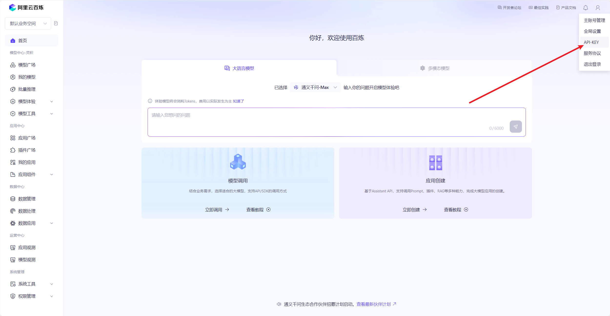
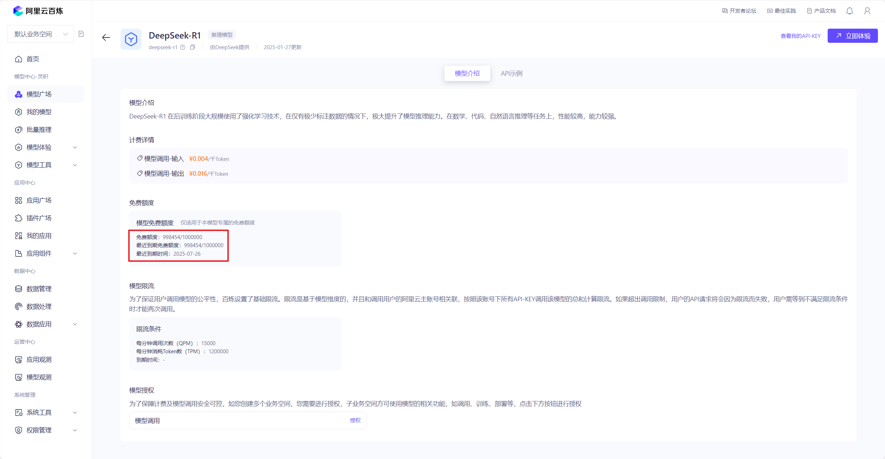
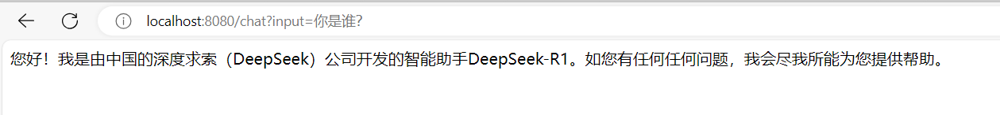

Spring 官方开源了Spring AI 框架，用来简化 Spring 开发者开发智能体应用的过程。随后阿里巴巴开源了 Spring AI Alibaba，它基于 Spring AI，同时与阿里云百炼大模型服务、通义系列大模型做了深度集成与最佳实践。基于 Spring AI Alibaba，Java 开发者可以非常方便地开发 AI 智能体应用。

开通阿里云百炼账号，获取API-KEY，[https://bailian.console.aliyun.com/](https://bailian.console.aliyun.com/)



其中deepseek-r1与deepseek-v3分别有 100万的免费 Token，部分蒸馏模型限时免费体验。



## SpringBoot接入deepseek实战

使用 Spring AI Alibaba 开发应用与使用普通 Spring Boot 没有什么区别，只需要增加 spring-ai-alibaba-starter 依赖，将 ChatClient Bean 注入就可以实现与模型聊天了。

注意：因为 Spring AI Alibaba 基于 Spring Boot 3.x 开发，因此本地 JDK 版本要求为 17 及以上。

### 1、添加依赖

首先，需要在项目中添加 spring-ai-alibaba-starter 依赖，它将通过 Spring Boot 自动装配机制初始化与阿里云通义大模型通信的 ChatClient、ChatModel 相关实例。

```xml
<dependency>
  <groupId>com.alibaba.cloud.ai</groupId>
  <artifactId>spring-ai-alibaba-starter</artifactId>
  <version>1.0.0-M5.1</version>
</dependency>
```

注意：由于 spring-ai 相关依赖包还没有发布到中央仓库，如出现 spring-ai-core 等相关依赖解析问题，请在您项目的 pom.xml 依赖中加入如下仓库配置。

```text
<repositories>
  <repository>
    <id>spring-milestones</id>
    <name>Spring Milestones</name>
    <url>https://repo.spring.io/milestone</url>
    <snapshots>
      <enabled>false</enabled>
    </snapshots>
  </repository>
</repositories>
```

完整的pom文件如下

```xml
<?xml version="1.0" encoding="UTF-8"?>
<project xmlns="http://maven.apache.org/POM/4.0.0" xmlns:xsi="http://www.w3.org/2001/XMLSchema-instance"
         xsi:schemaLocation="http://maven.apache.org/POM/4.0.0 https://maven.apache.org/xsd/maven-4.0.0.xsd">
    <modelVersion>4.0.0</modelVersion>
    <parent>
        <groupId>org.springframework.boot</groupId>
        <artifactId>spring-boot-starter-parent</artifactId>
        <version>3.4.3</version>
        <relativePath/> <!-- lookup parent from repository -->
    </parent>
    <groupId>com.fox</groupId>
    <artifactId>alibaba-ai-demo</artifactId>
    <version>0.0.1-SNAPSHOT</version>
    <name>alibaba-ai-demo</name>
    <description>alibaba-ai-demo</description>
    <url/>

    <properties>
        <java.version>17</java.version>
        <spring-ai.version>1.0.0-M5</spring-ai.version>
        <spring-ai-alibaba.version>1.0.0-M5.1</spring-ai-alibaba.version>
    </properties>

    <dependencies>

     <dependency>
            <groupId>com.alibaba.cloud.ai</groupId>
            <artifactId>spring-ai-alibaba-starter</artifactId>
            <version>${spring-ai-alibaba.version}</version>
        </dependency>

        <dependency>
            <groupId>org.springframework.boot</groupId>
            <artifactId>spring-boot-starter-web</artifactId>
        </dependency>

        <dependency>
            <groupId>org.springframework.boot</groupId>
            <artifactId>spring-boot-starter-test</artifactId>
            <scope>test</scope>
        </dependency>
    </dependencies>

    <dependencyManagement>
        <dependencies>
            <dependency>
                <groupId>org.springframework.ai</groupId>
                <artifactId>spring-ai-bom</artifactId>
                <version>${spring-ai.version}</version>
                <type>pom</type>
                <scope>import</scope>
            </dependency>
        </dependencies>
    </dependencyManagement>


    <repositories>
        <!-- spring-ai 相关依赖包还没有发布到中央仓库-->
        <repository>
            <id>spring-milestones</id>
            <name>Spring Milestones</name>
            <url>https://repo.spring.io/milestone</url>
            <snapshots>
                <enabled>false</enabled>
            </snapshots>
        </repository>
    </repositories>

    <build>
        <plugins>
            <plugin>
                <groupId>org.springframework.boot</groupId>
                <artifactId>spring-boot-maven-plugin</artifactId>
            </plugin>
        </plugins>
    </build>

</project>
```

### 2、配置 application.yml

指定 API-KEY（可通过访问阿里云百炼模型服务平台获取，有免费额度可用）

```yaml
spring:
  application:
    name: alibaba-ai-demo

  ai:
    dashscope:
      api-key: ${AI_DASHSCOPE_API_KEY}   # api key
      chat:
        options:
          model: deepseek-r1   # 模型名称
```

### 3、注入智能体代理 ChatClient

接下来，在普通 Controller Bean 中注入 ChatClient 实例，这样你的 Bean 就具备与 AI 大模型智能对话的能力了。

~~~java
/**
 * @Classname ChatController
 * @Description TODO
 * @Date 2025/4/4 23:38
 * @Created by xxl
 */
@RestController
public class ChatController {

    private final ChatClient chatClient;

    public ChatController(ChatClient.Builder builder) {
        this.chatClient = builder.build();
    }

    @GetMapping("/chat")
    public String chat(@RequestParam(value = "input") String input) {
        return this.chatClient.prompt()
                .user(input)
                .call()
                .content();
    }
}
~~~

以上示例中，ChatClient 使用默认参数调用大模型，Spring AI Alibaba 还支持通过 DashScopeChatOptions 调整与模型对话时的参数，DashScopeChatOptions 支持两种不同维度的配置方式：

a、全局默认值，即 ChatClient 实例初始化参数。可以在 application.yml 文件中指定

~~~yaml
spring.ai.dashscope.chat.options.*
~~~

或调用构造函数

~~~java
ChatClient.Builder.defaultOptions(options)
~~~

完成配置初始化。

b、每次 Prompt 调用前动态指定

```java
String result = dashScopeChatClient
  .prompt(query)
  .options(DashScopeChatOptions.builder().withTopP(0.8).build())
  .call()
  .content();
```

### 4、启动服务后测试




### 参考资料

Spring AI：[https://springdoc.cn/spring-ai-intro/](https://springdoc.cn/spring-ai-intro/)

Spring AI介绍：[https://segmentfault.com/a/1190000045505066#item-1](https://segmentfault.com/a/1190000045505066#item-1)

Spring AI MCP：[https://springdoc.cn/spring-ai-mcp-announcement/](https://springdoc.cn/spring-ai-mcp-announcement/)

spring ai mcp client代码示例：[https://zhuanlan.zhihu.com/p/29313544351](https://zhuanlan.zhihu.com/p/29313544351)


DeepSeek R1 本地部署：[https://henjihenji.feishu.cn/wiki/MN3Vwl2STigk2qk1r6lcGoY5nYg](https://henjihenji.feishu.cn/wiki/MN3Vwl2STigk2qk1r6lcGoY5nYg)

SpringBoot + Spring AI Alibaba 整合阿里云百炼DeepSeek大模型：[https://zhuanlan.zhihu.com/p/26299836051](https://zhuanlan.zhihu.com/p/26299836051)

