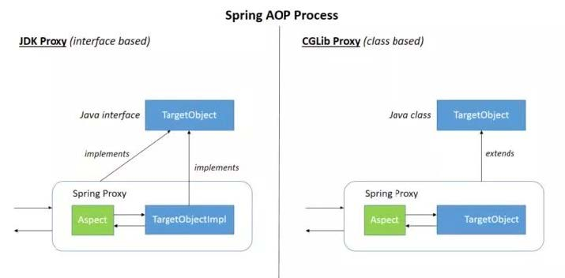

> 官方中文文档：
>
> https://springdoc.cn/spring/core.html#aop

### AOP介绍

AOP（Aspect-Oriented Programming，面向切面编程）能够将那些与业务无关，却为业务模块所共同调用的逻辑或责任（例如事务处理、日志管理、权限控制等）封装起来，便于减少系统的重复代码，降低模块间的耦合度，并有利于未来的可扩展性和可维护性。
Spring AOP是基于动态代理的，如果要代理的对象实现了某个接口，那么Spring AOP就会使用JDK动态代理去创建代理对象；而对于没有实现接口的对象，就无法使用JDK动态代理，转而使用CGlib动态代理生成一个被代理对象的子类来作为代理。

图中的implements和extend。即一个是接口，一个是实现类。

当然也可以使用AspectJ，Spring AOP中已经集成了AspectJ，AspectJ应该算得上是Java生态系统中最完整的AOP框架了。使用AOP之后我们可以把一些通用功能抽象出来，在需要用到的地方直接使用即可，这样可以大大简化代码量。我们需要增加新功能也方便，提高了系统的扩展性。日志功能、事务管理和权限管理等场景都用到了AOP。

### Spring AOP和AspectJ AOP的区别

Spring AOP是属于运行时增强，而AspectJ是编译时增强。

Spring AOP基于代理（Proxying），而AspectJ基于字节码操作（Bytecode Manipulation）。

Spring AOP已经集成了AspectJ，AspectJ应该算得上是Java生态系统中最完整的AOP框架了。

AspectJ相比于Spring AOP功能更加强大，但是Spring AOP相对来说更简单。

如果我们的切面比较少，那么两者性能差异不大。但是，当切面太多的话，最好选择AspectJ，它比SpringAOP快很多。

### 在Spring AOP 中，关注点和横切关注的区别

**关注点**是应用中一个模块的行为，一个关注点可能会被定义成一个我们想实现的一个功能。 横切关注点是一个关注点，此关注点是整个应用都会使用的功能，并影响整个应用，比如日志，安全和数据传输，几乎应用的每个模块都需要的功能。因此这些都属于横切关注点。

那什么是**连接点**呢？连接点代表一个应用程序的某个位置，在这个位置我们可以插入一个AOP切面，它实际上是个应用程序执行Spring AOP的位置。

**切入点**是什么？切入点是一个或一组连接点，通知将在这些位置执行。可以通过表达式或匹配的方式指明切入点。

### 通知及通知类型

通知是个在方法执行前或执行后要做的动作，实际上是程序执行时要通过SpringAOP框架触发的代码段。

Spring切面可以应用五种类型的通知：

1. **before**：前置通知，在一个方法执行前被调用。
2. **after**: 在方法执行之后调用的通知，无论方法执行是否成功。
3. **after-returning**: 仅当方法成功完成后执行的通知。
4. **after-throwing**: 在方法抛出异常退出时执行的通知。
5. **around**: 在方法执行之前和之后调用的通知。

### Spring AOP 切点表达式args与@args区别

[https://blog.csdn.net/qq_19922839/article/details/117412231](https://blog.csdn.net/qq_19922839/article/details/117412231)

### execution表达式

https://cloud.tencent.com/developer/article/1640230