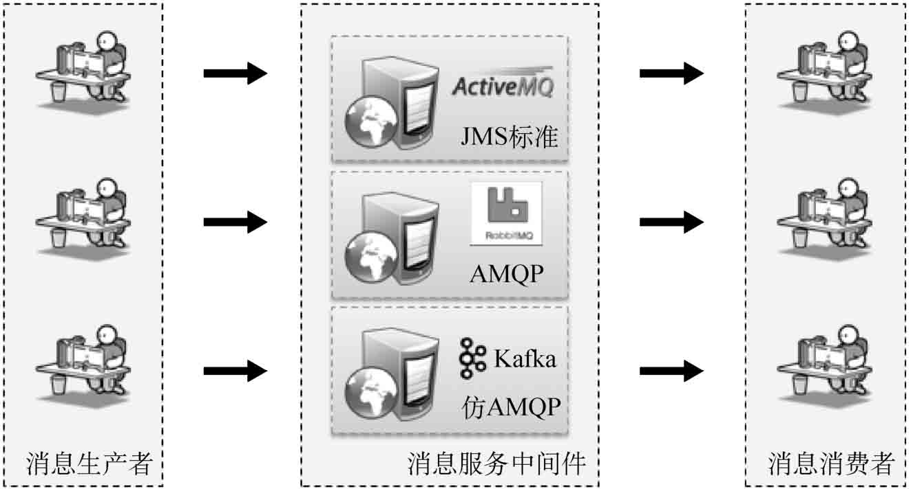

在进行分布式系统设计时，经常会使用消息服务组件进行系统整合与异步服务通信，其基本结构为生产者与消费者处理。常用的消息组件主要包括两类：JMS标准（ActiveMQ）和AMQP标准（RabbitMQ、Kafka）。

## SpringBoot整合ActiveMQ消息组件

ActiveMQ是Apache提供的开源组件，是基于JMS标准的实现组件。下面将利用SpringBoot整合ActiveMQ组件，实现队列消息的发送与接收。

### 1、引入依赖

修改pom.xml配置文件，追加spring-boot-starter-activemq依赖库。

~~~xml
<dependency>
    <groupId>org.springframework.boot</groupId>
    <artifactId>spring-boot-starter-activemq</artifactId>
</dependency>
~~~

### 2、修改配置文件

修改application.yml配置文件，进行ActiveMQ的配置。

~~~yaml
spring: 
  jms:
    pub-sub-domain: false   # 配置消息类型，如果是true则表示为topic消息，如果为false表示Queue消息
  activemq:
    user: admin             # 连接用户名
    password: admin         # 连接密码
    broker-url: tcp://activemq-server:61616   # 消息组件的连接主机信息
~~~

### 3、编写消息者代码

定义消息消费监听类。

~~~java
@Service
public class MessageConsumer {
	@JmsListener(destination="mldn.msg.queue")	// 定义消息监听队列
	public void receiveMessage(String text) {	// 进行消息接收处理
		System.err.println("【*** 接收消息 ***】" + text);
	}
}
~~~

### 4、编写生产者代码

定义消息生产者业务接口。

~~~java
public interface IMessageProducer {
	public void send(String msg) ;	// 消息发送
}
~~~

定义消息业务实现类。

~~~java
@Service
public class MessageProducerImpl implements IMessageProducer {
	@Autowired
	private JmsMessagingTemplate jmsMessagingTemplate;				// 消息发送模版
	@Autowired
	private Queue queue;											// 注入队列
	@Override
	public void send(String msg) {
		this.jmsMessagingTemplate.convertAndSend(this.queue, msg);	// 消息发送

	}
}
~~~

### 5、创建队列配置类

定义JMS消息发送配置类，该类主要用于配置队列信息。

~~~java

@Configuration
@EnableJms
public class ActiveMQConfig {
	@Bean
	public Queue queue() {
		return new ActiveMQQueue("mldn.msg.queue") ;	// 定义队列名称
	}
}
~~~

每当有消息接收到时，都会自动执行MessageConsumer类，进行消息消费。

## SpringBoot整合RabbitMQ消息组件

RabbitMQ是一个在AMQP基础上构建的新一代企业级消息系统，该组件由Pivotal公司提供，使用ErLang语言开发。

> **提示：RabbitMQ与SpringCloud整合之中意义重大。**
>
> SpringCloud是在SpringBoot基础上构建的微架构技术开发框架，其中的SpringCloudConfig自动刷新机制就基于消息组件完成，并且推荐使用RabbitMQ消息组件（同属于Pivotal公司产品）。在SpringCloudStream中也使用RabbitMQ作为服务组件。

### 1、引入依赖

修改pom.xml配置文件，追加`spring-boot-starter-amqp`依赖包。

~~~xml
<dependency>
    <groupId>org.springframework.boot</groupId>
    <artifactId>spring-boot-starter-amqp</artifactId>
</dependency>
~~~

### 2、修改配置文件

修改`application.yml`配置文件，进行RabbitMQ的相关配置。

~~~yaml
spring: 
  rabbitmq:
    addresses: rabbitmq-server      # rabbitmq服务主机名称
    username: admin                 # 用户名
    password: admin                 # 密码
    virtual-host: /                 # 虚拟主机
~~~

### 3、消息生产配置类

为了可以正常使用RabbitMQ进行消息处理，还需要做一个消息生产配置类。

~~~java
@Configuration
public class ProducerConfig {
	public static final String EXCHANGE = "xxl.microboot.exchange"; 	// 交换空间名称
	public static final String ROUTINGKEY = "xxl.microboot.routingkey"; // 设置路由key
	public static final String QUEUE_NAME = "xxl.microboot.queue"; 	// 队列名称
	@Bean
	public Binding bindingExchangeQueue(DirectExchange exchange,Queue queue) {
		return BindingBuilder.bind(queue).to(exchange).with(ROUTINGKEY) ;
	}
	@Bean
	public DirectExchange getDirectExchange() { 						// 使用直连的模式
		return new DirectExchange(EXCHANGE, true, true);
	}
	@Bean
	public Queue queue() { 											// 队列信息
		return new Queue(QUEUE_NAME);
	}
}
~~~

### 4、编写生产者代码

建立消息发送接口。

~~~java
public interface IMessageProducer {
	public void send(String msg) ;	// 消息发送
}
~~~

建立消息业务实现子类。

~~~java
@Service
public class MessageProducerImpl implements IMessageProducer {
	@Resource
	private RabbitTemplate rabbitTemplate; 
	@Override
	public void send(String msg) {
		this.rabbitTemplate.convertAndSend(ProducerConfig.EXCHANGE,
				ProducerConfig.ROUTINGKEY, msg);
	}
}
~~~

### 5、消息消费配置类

建立一个消息消费端的配置程序类。

~~~java
@Configuration
public class ConsumerConfig {
	public static final String EXCHANGE = "xxl.microboot.exchange"; 		// 交换空间名称
	public static final String ROUTINGKEY = "xxl.microboot.routingkey"; 	// 设置路由key
	public static final String QUEUE_NAME = "xxl.microboot.queue"; 		// 队列名称
	@Bean
	public Queue queue() { 													// 队列信息
		return new Queue(QUEUE_NAME);
	}
	@Bean
	public DirectExchange getDirectExchange() { 							// 使用直连的模式
		return new DirectExchange(EXCHANGE, true, true);
	}
	@Bean
	public Binding bindingExchangeQueue(DirectExchange exchange,Queue queue) {
		return BindingBuilder.bind(queue).to(exchange).with(ROUTINGKEY) ;
	}
}
~~~

### 6、编写消费者代码

定义监听处理类。

~~~java

@Service
public class MessageConsumer {
	@RabbitListener(queues="xxl.microboot.queue")
	public void receiveMessage(String text) {	// 进行消息接收处理
		System.err.println("【*** 接收消息 ***】" + text);
	}
}
~~~

此时程序实现了与RabbitMQ消息组件的整合，同时在整个程序中只需要调用IMessageProducer接口中的send()方法就可以正常发送，而后会找到设置同样ROUTINGKEY的消费者进行消息消费。

## SpringBoot整合Kafka消息组件

Kafka是新一代的消息系统，也是目前性能最好的消息组件，在数据采集业务中被广泛应用。本程序中配置的Kafka将基于Kerberos认证实现消息组件处理。

### 1、定义客户端文件

【操作系统-Windows】定义一个Kerberos客户端文件，路径为`d:\kafka_client_jaas.conf`。

~~~conf
KafkaClient {  
        org.apache.kafka.common.security.plain.PlainLoginModule required  
        username="bob"  
        password="bob-pwd";  
};  
~~~

### 2、引入kafka依赖

修改pom.xml配置文件，追加依赖库配置。

~~~xml
<dependency>
    <groupId>org.springframework.kafka</groupId>
    <artifactId>spring-kafka</artifactId>
</dependency>
~~~

### 3、修改配置文件

修改application.yml配置文件，进行Kafka配置项编写。

~~~yaml
spring: 
  kafka:
    bootstrap-servers:                  # 定义主机列表
    - kafka-single:9095
    template:
      default-topic: xxl-microboot     # 定义主题名称
    producer:                           # 定义生产者配置
      key-serializer: org.apache.kafka.common.serialization.StringSerializer
      value-serializer: org.apache.kafka.common.serialization.StringSerializer
    consumer:                           # 定义消费者配置
      key-deserializer: org.apache.kafka.common.serialization.StringDeserializer
      value-deserializer: org.apache.kafka.common.serialization.StringDeserializer
      group-id: group-1                 # 数据分组
    properties:
      sasl.mechanism: PLAIN              # 安全机制
      security.protocol: SASL_PLAINTEXT   # 安全协议
~~~

### 4、编写消息发送代码

定义消息业务发送接口。

~~~java
public interface IMessageProducer {
	public void send(String msg) ;	// 消息发送
}
~~~

使用Kafka消息机制实现消息发送接口。

~~~java
@Service 
public class MessageProducerImpl implements IMessageProducer {
	@Resource
	private KafkaTemplate<String, String> kafkaTemplate;	// Kafka消息模版
	@Override
	public void send(String msg) {
		this.kafkaTemplate.sendDefault("mldn-key", msg);	// 发送消息
	}
}
~~~

### 5、编写消息消费代码

建立一个Kafka消息的消费程序类。

~~~java
@Service
public class MessageConsumer {
	@KafkaListener(topics = {"mldn-microboot"})
	public void receiveMessage(ConsumerRecord<String, String> record) { 	// 进行消息接收处理
		System.err.println("【*** 接收消息 ***】key = " + record.key() + "、value = "
				+ record.value());
	}
}
~~~

### 6、修改启动类

由于此时Kafka采用Kerberos认证，因此需要修改程序启动主类。

~~~java
@SpringBootApplication	// 启动SpringBoot程序，而后自带子包扫描
public class SpringBootStartApplication { // 必须继承指定的父类
	static {
		System.setProperty("java.security.auth.login.config",
				"d:/kafka_client_jaas.conf"); // 表示系统环境属性
	}
	public static void main(String[] args) throws Exception {
		SpringApplication.run(SpringBootStartApplication.class, args);	// 启动SpringBoot程序
	}
} 
~~~

此时，可以通过测试程序调用IMessageProducer接口进行消息发送，由于Kafka已经配置了自动创建主题，所以即使现在主题不存在，也不影响程序执行。