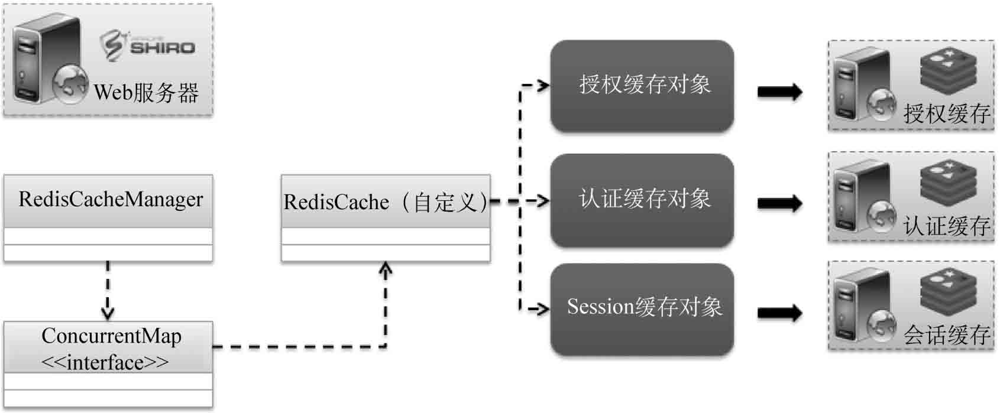
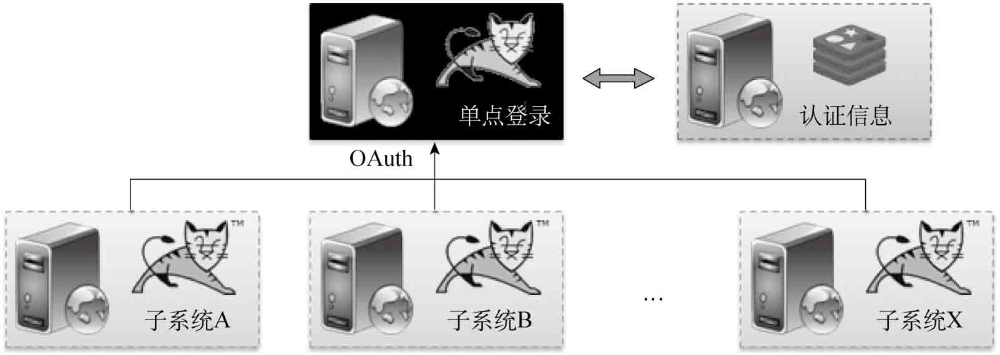

## SpringBoot整合安全框架

Shiro是Apache推出的新一代认证与授权管理开发框架，可以方便地与第三方的认证机构进行整合。下面将直接采用自定义缓存类来实现多个Redis数据库信息的保存。

### SpringBoot整合Shiro开发框架

SpringBoot与Shiro的整合处理，本质上和Spring与Shiro的整合区别不大，但开发者需要注意以下3点：

### SpringBoot基于Shiro整合OAuth统一认证

在实际项目开发过程中，随着项目功能不断推出，会出现越来越多的子系统。这样就需要使用统一的登录认证处理。在一个良好的系统设计中一般都会存在有一个单点登录，而OAuth正是现在最流行的单点登录协议。

