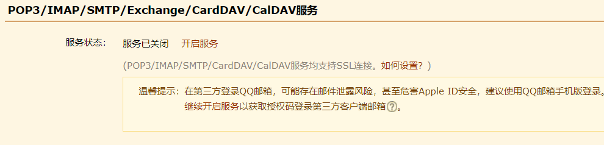
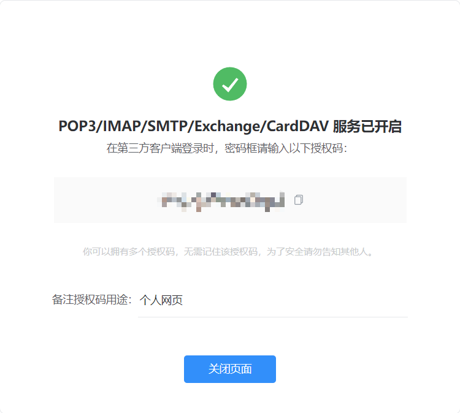
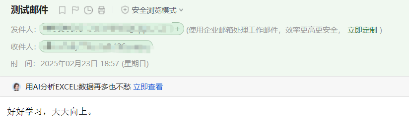

## SpringBoot整合邮件服务器

Java本身提供了JavaMail标准以实现邮件的处理，同时用户也可以搭建属于自己的邮件服务器或者直接使用各个邮箱系统实现邮件的发送处理。下面将利用SpringBoot整合邮件服务，同时使用QQ邮箱系统进行服务整合。

### 邮件服务配置

登录QQ邮箱，进入邮箱设置页面，找到邮件服务配置项。

开启邮箱的邮件服务后，将得到一个唯一的授权码。

### 引入依赖

修改pom.xml配置文件，引入依赖库。

~~~xml
<dependency>
    <groupId>org.springframework.boot</groupId>
    <artifactId>spring-boot-starter-mail</artifactId>
</dependency>
~~~

### 修改配置文件

修改application.yml配置文件，实现邮件配置。

~~~yaml
spring:
  mail:
    host: smtp.qq.com                       # 邮箱服务器
    username: xxx@qq.com                    # 用户名
    password: clxcgqofubazbgcj              # 授权码
    properties:
      mail.smtp.auth: true                  # stmp授权开启 
      mail.smtp.starttls.enable: true       # 启动tls服务
      mail.smtp.starttls.required: true     # 启动tls支持
~~~

###  测试

编写测试类，进行邮件发送测试。

~~~java
@SpringBootTest(classes = SpringBootIntegrationMailApplication.class)
@RunWith(SpringJUnit4ClassRunner.class)
@WebAppConfiguration
public class TestMail {
    @Resource
    private JavaMailSender javaMailSender;                    // 注入JavaMailSender对象

    @Test
    public void testSendMail() {
        SimpleMailMessage message = new SimpleMailMessage();    // 要发送的消息内容
        message.setFrom("xxx@qq.com");                // 发送者
        message.setTo("xxx@126.com");                // 接收者
        message.setSubject("测试邮件");             // 邮件主题
        message.setText("好好学习，天天向上。");     // 邮件内容
        this.javaMailSender.send(message);        // 发送邮件
    }
}
~~~

由于SpringBoot中已经进行了大量的简化配置，所以此时的程序只需要注入JavaMailSender对象，并设置好邮件内容，就可以实现邮件信息的发送。

结果

