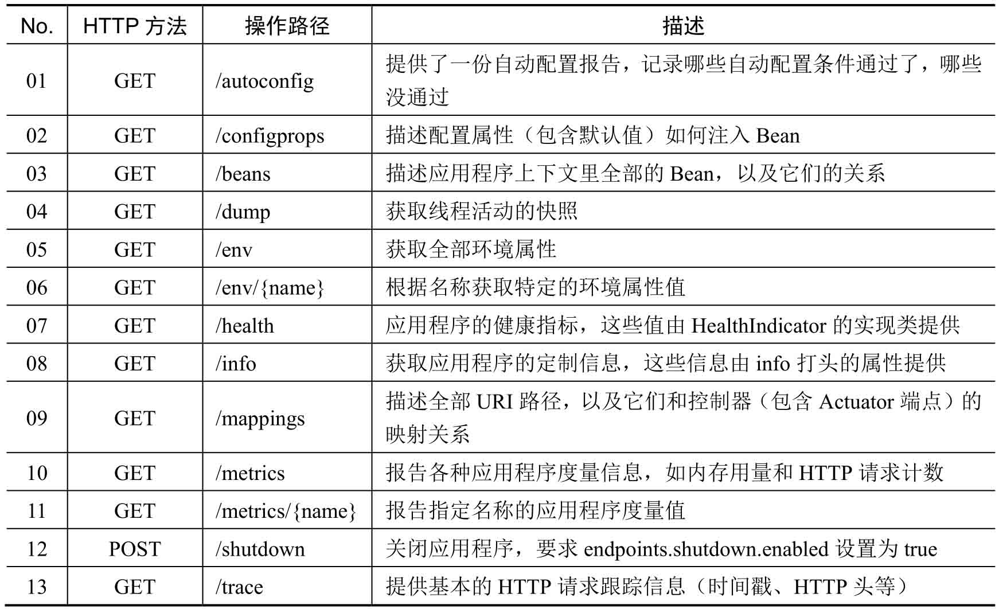

## Actuator监控

Actuator是SpringBoot中一个用来实现系统健康检测的模块，它提供一个Resetful的API接口，可以将系统运行过程中的磁盘空间、线程数以及程序连接的数据库情况通过JSON返回，然后再结合预警、监控模块进行实时系统监控。

Actuator访问路径

### 引入依赖

修改pom.xml配置文件，追加依赖库。

~~~xml
<dependency>
    <groupId>org.springframework.boot</groupId>
    <artifactId>spring-boot-starter-actuator</artifactId>
</dependency>
~~~

### 修改配置文件

修改application.yml配置文件，关闭系统的安全配置。

~~~yaml
management:
  security:
    enabled: false # 现在关闭系统的安全配置 
~~~

配置完成之后，就可以通过路径进行相应信息的查看。

- 查看环境信息：http://localhost/env。
- 查看配置Bean：http://localhost/beans。

### 自定义项目信息

虽然现在可以实现Actuator监控，但却需要关闭安全配置。很显然，这样的配置并不合理，最好的做法是由开发者自行定义相应项目信息。下面将为项目建立一个健康信息。

~~~java
@Component
public class MyHealthIndicator implements HealthIndicator {
    @Override
    public Health health() {
        int errorCode = 100;        // 这个错误的码是通过其它程序获得的
        if (errorCode != 0) {
            return Health.down().withDetail("Error Code", errorCode).build();
        }
        return Health.up().build();
    }
}
~~~

本程序模拟了一个健康状态的处理，开发者可以通过其他程序来生成一个errorCode错误状态码，用户可以通过http://localhost/health路径进行健康信息访问。

### 配置信息访问路径

SpringBoot构建的主要是微服务，由于微服务中需要为开发者或使用者提供大量的信息，为此在Actuator中提供了信息访问路径（/info），这些服务信息可以直接通过application.yml文件进行配置。

~~~yaml
info:
  app.name: xxl-microboot              # 应用名称
  company.name: https://luckilyxxl.xyz   # 开发公司
  pom.artifactId: $project.artifactId$   # 项目名称，通过pom获得
  pom.version: $project.version$        # 项目版本，通过pom获得
~~~

### 修改Maven插件支持

信息配置需要Maven插件支持，为了让所有子模块都支持这种配置，修改pom.xml配置文件。

添加maven-resources-plugin插件。

~~~xml
<plugin>
    <groupId>org.apache.maven.plugins</groupId>
    <artifactId>maven-resources-plugin</artifactId>
    <configuration>
        <delimiters>
            <delimiter>$</delimiter>			<!-- 定义描述分割符 -->
        </delimiters>
    </configuration>
</plugin>
~~~

修改资源操作，启用过滤。

~~~xml
<resource>
    <directory>src/main/resources</directory>
    <includes>
        <include>**/*.properties</include>
        <include>**/*.yml</include>
        <include>**/*.xml</include>
        <include>**/*.tld</include>
        <include>**/*.p12</include>
    </includes>
    <filtering>true</filtering>
</resource>
~~~

此时，程序启动之后，可以输入信息访问路径http://localhost/info。

### 创建信息配置类

在开发中这种提示信息会成为微服务的重要组成部分，如果重复进行配置文件的定义，那么会比较麻烦。最简单的做法是直接做一个配置程序类，进行信息的配置。

~~~java
@Component
public class MicroServiceInfoContributor implements InfoContributor {
    @Override
    public void contribute(Info.Builder builder) {
        builder.withDetail("company.name", "https://luckilyxxl.xyz") ;
        builder.withDetail("version", "V1.0") ;
        builder.withDetail("author", "xxl") ;
    }
}
~~~

此时可以直接通过配置类获取微服务信息。