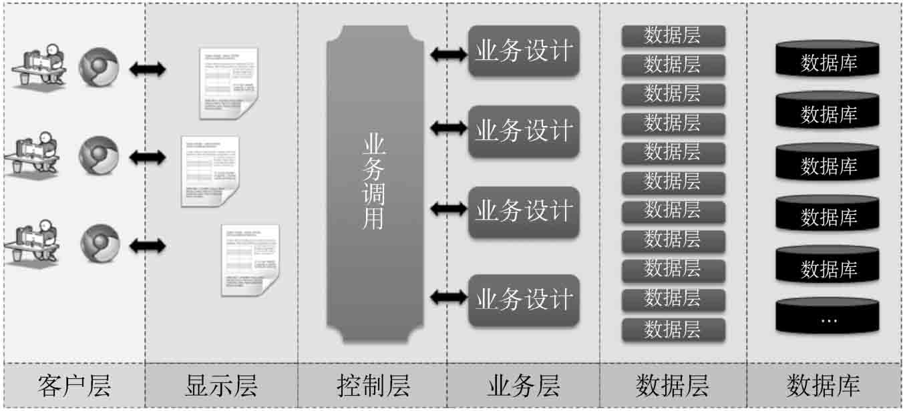

### 传统开发中痛的领悟

在Java项目开发中，MVC已经成为了一种深入人心的设计模式，几乎所有正规的项目之中都会使用到MVC设计模式。采用MVC设计模式可以有效地实现显示层、控制层、业务层、数据层的结构分离。

虽然MVC开发具有良好的可扩展性，但是在实际的开发过程中，许多开发者依然会感受到如下的问题。

- 采用原生Java程序实现MVC设计模式时，一旦整体项目设计不到位，就会存在大量的重复代码，并且项目维护困难。
- 为了简化MVC各个层的开发，可以引用大量的第三方开发框架，如Spring、Hibernate、MyBatis、Shiro、JPA、SpringSecurity等，但这些框架都需要在Spring中实现整合，其结果就是会存在大量的配置文件。
- 当使用一些第三方的服务组件（如RabbitMQ、Kafka、JavaMail等）时，需要编写大量重复的配置文件，而且还需要根据环境定义不同的profile（如dev、beta、product）。
- 使用Maven作为构建工具时，需要配置大量的依赖关系，且程序需要被打包为*.war文件并部署到应用服务器上才可以执行。
- Restful作为接口技术应用得越来越广泛，但如果使用Spring来搭建Restful服务，则需要引入大量的Maven依赖库，并且需要编写许多的配置文件。

基于以上种种因素，很多人开始寻求更加简便的开发方式，而遗憾的是，这种简便的开发没有被官方的JavaEE所支持。JavaEE官方支持的技术标准依然只提供最原始的技术支持。

### SpringBoot简介

SpringBoot是Spring开发框架提供的一种扩展支持，其主要目的是希望通过简单的配置实现开发框架的整合，使开发者的注意力可以完全放在程序业务功能的实现上，其核心在于通过“零配置”的方式来实现快速且简单的开发。

Spring Boot开发框架有如下核心功能。

- 独立运行的Spring项目：SpringBoot可以以jar包的形式直接运行在拥有JDK的主机上。
- 内嵌Web容器：SpringBoot内嵌了Tomcat容器与Jetty容器，这样可以不局限于war包的部署形式。
- 简化Maven配置：在实际开发中需要编写大量的Maven依赖，在SpringBoot中会提供一系列使用starter的依赖配置来简化Maven配置文件的定义。
- 自动配置Spring：采用合理的项目组织结构，使Spring的配置注解自动生效。
- 减少XML配置：在SpringBoot中依然支持XML配置，同时也可以利用Bean和自动配置机制减少XML配置文件的定义。

### SpringBoot编程起步

SpringBoot编程需要依赖于Maven或Gradle构建工具完成。