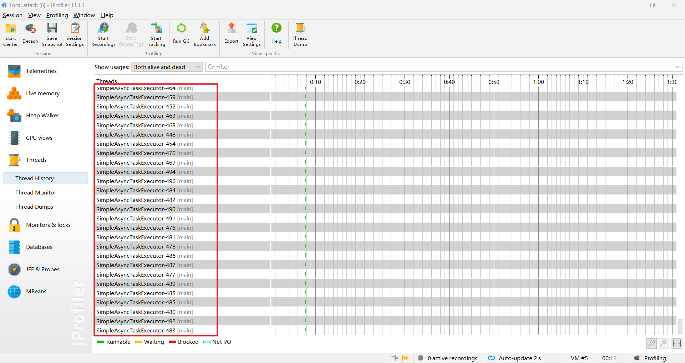
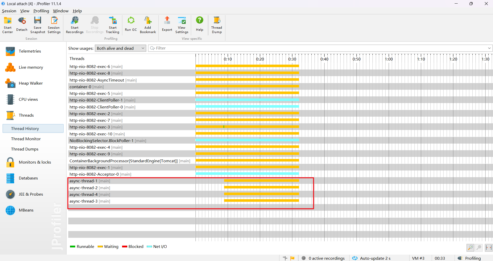

## Spring Boot中的异步方法调用

在Spring Boot中，异步方法调用是通过@Async注解实现的。这个注解可以将一个同步方法转换为异步执行，即在不同的线程中运行。这样做的好处是可以提高应用程序的性能，特别是在处理耗时任务时，可以避免阻塞主线程。

### 使用@Async注解

要在Spring Boot中使用 *@Async* 注解，首先需要在启动类上添加 *@EnableAsync* 注解来启用异步支持。然后，可以在需要异步执行的方法上添加 *@Async* 注解。例如：

~~~java
@Service
public class AsyncService {

    @Async
    public void asyncMethod() {
    	// 异步执行的代码
    }
}
~~~

这个方法现在会在单独的线程中异步执行。如果方法有返回值，可以使用*Future*接口来处理异步结果。例如：

~~~java
@Service
public class AsyncService {

    @Async
    public Future<String> asyncMethodWithReturn() {
        // 异步执行的代码
        return new AsyncResult<>("结果");
    }
}
~~~

### 自定义线程池

默认情况下，*@Async*注解会使用*SimpleAsyncTaskExecutor*作为线程池。但是，这个默认的线程池对于生产环境通常不是最佳选择，因为它会为每个任务创建一个新线程。因此，推荐自定义线程池来优化性能和资源使用。可以通过实现*AsyncConfigurer*接口并重写*getAsyncExecutor*方法来自定义线程池。例如：

~~~java
@Configuration
@EnableAsync
public class AsyncConfig implements AsyncConfigurer {

    @Override
    public Executor getAsyncExecutor() {
        ThreadPoolTaskExecutor executor = new ThreadPoolTaskExecutor();
        executor.setCorePoolSize(10);
        executor.setMaxPoolSize(50);
        executor.setQueueCapacity(100);
        executor.initialize();
        return executor;
    }
}
~~~

在这个配置中，定义了一个核心线程数为10，最大线程数为50，队列容量为100的线程池。这样配置后，*@Async*注解就会使用这个自定义的线程池来执行任务。

### 异步方法的限制

使用 *@Async* 注解时，有一些限制需要注意：

1. 异步方法不能是*static*方法。
2. 异步方法所在的类必须被Spring容器管理，即通过 *@Component* 或其他相关注解声明。
3. 异步方法不能和调用它的方法在同一个类中。
4. 类中的依赖必须通过 *@Autowired* 或 *@Resource* 等注解自动注入，不能手动创建对象。
5. 如果使用Spring Boot框架，必须在启动类中添加 *@EnableAsync* 注解。
6. 在异步方法上标注 *@Transactional* 是无效的，应该在调用异步方法的方法上标注。

### 默认线程与自定义线程池

`SimpleAsyncTaskExecutor` 的特点

- **非池化**：`SimpleAsyncTaskExecutor` 不是一个真正的线程池，它每次都会创建一个新的线程来执行任务。
- **无限创建线程**：如果没有限制，它会无限创建新线程，这可能导致资源耗尽。
- **不会自动关闭**：`SimpleAsyncTaskExecutor` 不会自动关闭其创建的线程，因为它是基于简单的线程创建机制，而不是线程池。

测试代码

AynscController

~~~java
/**
 * @Author: xxl
 * @Date: 2024/11/22 15:17
 */
@RestController
@RequestMapping("/api/aynsc")
public class AynscController {

    @Autowired
    private AynscService aynscService;

    @GetMapping("/testAynsc")
    public String testAynsc() {
        for (int i = 1; i <= 100; i++) {
            aynscService.sendAynscMessage(i);
        }
        return "执行成功";
    }
}
~~~

AynscService

~~~java
/**
 * @Author: xxl
 * @Date: 2024/11/22 15:17
 */
@Component
public class AynscService {

    @Async
    public void sendAynscMessage(Integer index) {
        System.out.println("发送异步消息，第" + index + "次！");
    }

}
~~~

SimpleAsyncTaskExecutor

添加自定义线程池

~~~java
/**
 * 自定义线程池
 *
 * @Author: xxl
 * @Date: 2024/11/22 15:38
 */
@Configuration
public class AsyncConfig {

    @Bean
    public ThreadPoolTaskExecutor taskExecutor() {
        ThreadPoolTaskExecutor executor = new ThreadPoolTaskExecutor();
        executor.setCorePoolSize(4); // 核心线程数
        executor.setMaxPoolSize(8); // 最大线程数
        executor.setQueueCapacity(100); // 队列容量
        executor.setThreadNamePrefix("async-thread-"); // 线程名称前缀
        executor.initialize();
        return executor;
    }
}
~~~

或

~~~java
/**
 * @Author: xxl
 * @Date: 2024/11/22 16:14
 */
@Configuration
@EnableAsync
public class AsyncConfig2 implements AsyncConfigurer {

    @Override
    public Executor getAsyncExecutor() {
        ThreadPoolTaskExecutor executor = new ThreadPoolTaskExecutor();
        executor.setCorePoolSize(5);
        executor.setMaxPoolSize(10);
        executor.setQueueCapacity(25);
        executor.setThreadNamePrefix("Async-");
        executor.initialize();
        return executor;
    }
}
~~~

自定义线程池

> 获取源码可访问
>
> [springboot_chowder/springboot_aynsc at main · Daneliya/springboot_chowder](https://github.com/Daneliya/springboot_chowder/tree/main/springboot_aynsc)

### 总结

*@Async*注解提供了一种简单而强大的方式来实现异步方法调用，可以显著提高应用程序的性能。通过自定义线程池，可以进一步优化资源使用和控制异步任务的执行。在使用时，需要注意一些限制条件，以确保异步调用能够正确执行。