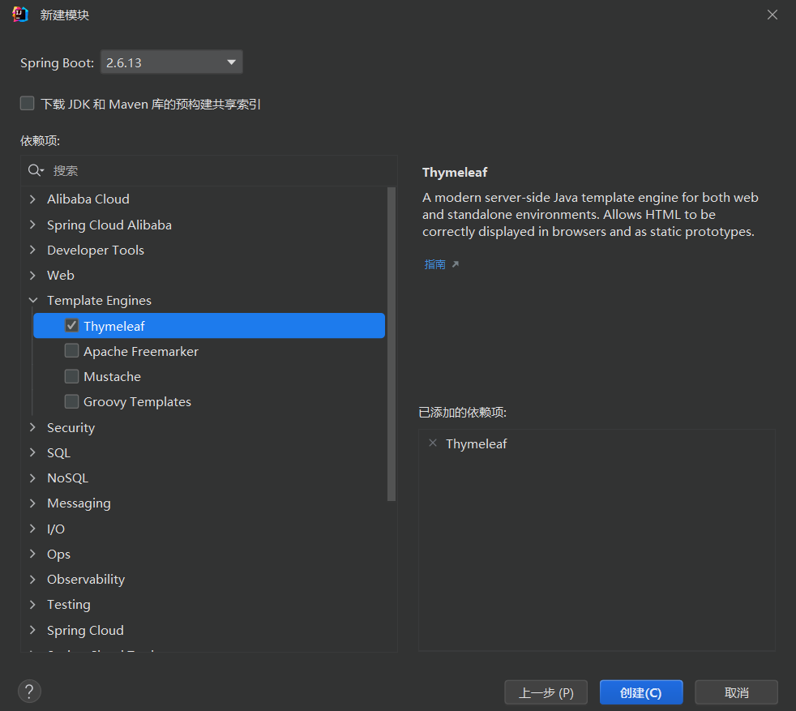
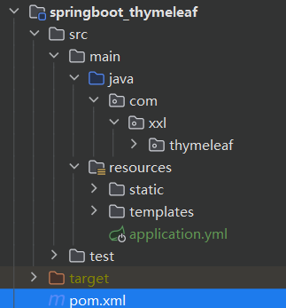

> **Thymeleaf**官方网站：https://www.thymeleaf.org/index.html

## 一、介绍

Thymeleaf是用来开发Web和独立环境项目的现代服务器端Java模板引擎，既适用于 web 环境，也适用于独立环境，比较适合当前的人员分工问题。其能够处理HTML、XML、JavaScript、CSS 甚至纯文本。提供了一种优雅且高度可维护的模板创建方法，可以直接在浏览器中正确显示，也可以作为静态原型方便开发团队协作。

补充：

Spring官方支持的服务的渲染模板中，并不包含jsp。但是支持一些模板引擎技术，目前官方比较流行的有：Thymeleaf，Freemarker，Mustache。

## 二、特点

1. 动静结合： Thymeleaf 在有网络和无网络的环境下皆可运行，即它可以让美工在浏览器查看页面的静态效果，也可以让程序员在服务器查看带数据的动态页面效果。
2. Thymeleaf支持 html 原型，然后在 html 标签里增加额外的属性来达到模板+数据的展示方式。浏览器解释 html 时会忽略未定义的标签属性，所以 thymeleaf 的模板可以静态地运行；当有数据返回到页面时，Thymeleaf 标签会动态地替换掉静态内容，使页面动态显示。
3. 开箱即用： Thymeleaf提供标准和spring标准两种方言，可以直接套用模板实现JSTL、 OGNL表达式效果，避免每天套模板、改jstl、改标签的困扰。同时开发人员也可以扩展和创建自定义的方言。
4. 多方言支持： Thymeleaf 提供spring标准方言和一个与 SpringMVC 完美集成的可选模块，可以快速的实现表单绑定、属性编辑器、国际化等功能。
5. 与SpringBoot完美整合，SpringBoot提供了Thymeleaf的默认配置，并且为Thymeleaf设置了视图解析器，我们可以像操作jsp一样来操作Thymeleaf。代码几乎没有任何区别，就是在模板语法上有区别。

## 三、SpringBoot集成Thymeleaf

### 1、引入依赖

~~~xml
<dependency>
    <groupId>org.springframework.boot</groupId>
    <artifactId>spring-boot-starter-thymeleaf</artifactId>
</dependency>
~~~

### 2、可选配置

虽然Springboot官方对Thymeleaf做了很多默认配置，但咱们引入Thymeleaf的jar包依赖后很可能根据自己特定需求进行更细化的配置，例如页面缓存、字体格式设置等等。

Springboot官方提供的配置内容有以下：

~~~yaml
# THYMELEAF (ThymeleafAutoConfiguration)
spring.thymeleaf.cache=true # Whether to enable template caching.
spring.thymeleaf.check-template=true # Whether to check that the template exists before rendering it.
spring.thymeleaf.check-template-location=true # Whether to check that the templates location exists.
spring.thymeleaf.enabled=true # Whether to enable Thymeleaf view resolution for Web frameworks.
spring.thymeleaf.enable-spring-el-compiler=false # Enable the SpringEL compiler in SpringEL expressions.
spring.thymeleaf.encoding=UTF-8 # Template files encoding.
spring.thymeleaf.excluded-view-names= # Comma-separated list of view names (patterns allowed) that should be excluded from resolution.
spring.thymeleaf.mode=HTML # Template mode to be applied to templates. See also Thymeleaf's TemplateMode enum.
spring.thymeleaf.prefix=classpath:/templates/ # Prefix that gets prepended to view names when building a URL.
spring.thymeleaf.reactive.chunked-mode-view-names= # Comma-separated list of view names (patterns allowed) that should be the only ones executed in CHUNKED mode when a max chunk size is set.
spring.thymeleaf.reactive.full-mode-view-names= # Comma-separated list of view names (patterns allowed) that should be executed in FULL mode even if a max chunk size is set.
spring.thymeleaf.reactive.max-chunk-size=0 # Maximum size of data buffers used for writing to the response, in bytes.
spring.thymeleaf.reactive.media-types= # Media types supported by the view technology.
spring.thymeleaf.servlet.content-type=text/html # Content-Type value written to HTTP responses.
spring.thymeleaf.suffix=.html # Suffix that gets appended to view names when building a URL.
spring.thymeleaf.template-resolver-order= # Order of the template resolver in the chain.
spring.thymeleaf.view-names= # Comma-separated list of view names (patterns allowed) that can be resolved.
~~~

上面的配置有些我们可能不常使用，因为Springboot官方做了默认配置大部分能够满足我们的使用需求，但如果你的项目有特殊需求也需要妥善使用这些配置。

比如`spring.thymeleaf.cache=false`是否允许页面缓存的配置，我们在开发时候要确保页面是最新的所以需要禁用缓存；而在上线运营时可能页面不常改动为了减少服务端压力以及提升客户端响应速度会允许页面缓存的使用。

再比如在开发虽然我们大部分使用UTF-8多一些，我们可以使用`spring.thymeleaf.encoding=UTF-8`来确定页面的编码，但如果你的项目是GBK编码就需要将它改成GBK。

另外Springboot默认模板引擎文件是放在templates目录下：`spring.thymeleaf.prefix=classpath:/templates/`,如果有需求将模板引擎也可修改配置，将templates改为自己需要的目录。同理其他的配置如果需要自定义化也可参照上面配置进行修改。

## 四、快速入门

### 1、第一个Thymeleaf程序

#### 使用IDEA创建项目

目录结构如下

如果创建项目时不勾选Thymeleaf，可以自己引入

~~~xml
<dependency>
    <groupId>org.springframework.boot</groupId>
    <artifactId>spring-boot-starter-web</artifactId>
</dependency>
<dependency>
    <groupId>org.springframework.boot</groupId>
    <artifactId>spring-boot-starter-thymeleaf</artifactId>
</dependency>
~~~

#### 修改配置

~~~yaml
# 关闭Thymeleaf的缓存
spring:
  thymeleaf:
    cache:
      false
~~~

#### 编写controller

~~~java
/**
 * @author xxl
 * @date 2024/11/28 21:57
 */
@Controller
public class StudyController {

    @GetMapping("/showHello")
    public String showHello(Model model) {
        model.addAttribute("msg", "Hello, Thymeleaf!");
        return "index";
    }

}
~~~

- 注意controller上使用 `@Controller` 不要使用`@RestController`。

- **model.addAttribute("msg", "Hello, Thymeleaf!")** 就是Model存入数据的书写方式，Model是一个特殊的类，相当于维护一个Map一样，而Model中的数据通过controller层的关联绑定在view层（即Thymeleaf中）可以直接使用。
- **return "index"**：这个index就是在templates目录下对应模板的名称，即应该对应hello.html这个Thymeleaf文件（与页面关联默认规则为：templates目录下`返回字符串.html`）。

#### 编写Thymeleaf页面

在项目的resources目录下的templates文件夹下面创建一个叫`index.html`的文件，在这个html文件中的标签修改为`<html xmlns:th="http://www.thymeleaf.org">`在Thymeleaf中就可以使用Thymeleaf的语法和规范啦。

~~~html
<!DOCTYPE html>
<!-- 把html 的名称空间，改成：xmlns:th="http://www.thymeleaf.org" 会有语法提示-->
<html lang="en" xmlns:th="http://www.thymeleaf.org">
<head>
    <meta charset="UTF-8">
    <title>hello</title>
</head>
<body>
<h1 th:text="${msg}">大家好</h1>
</body>
</html>

~~~

#### 启动程序

启动SpringBoot程序， 通过浏览器访问：[http://localhost:8080/index](http://localhost:8080/index)

### 2、常用标签

动静结合：

Thymeleaf崇尚自然模板，意思就是模板是纯正的html代码，脱离模板引擎，在纯静态环境也可以直接运行。现在如果我们直接在html中编写 ${}这样的表达式，显然在静态环境下就会出错，这不符合Thymeleaf的理念。

Thymeleaf中所有的表达式都需要写在指令中，指令是HTML5中的自定义属性，在Thymeleaf中所有指令都是以th:开头。因为表达式${user.name}是写在自定义属性中，因此在静态环境下，表达式的内容会被当做是普通字符串，浏览器会自动忽略这些指令，这样就不会报错了！

th常用标签

| 标签      | 作用               | 示例                                                         |
| --------- | ------------------ | ------------------------------------------------------------ |
| th:id     | 替换id             | \<input th:id="${user.id}"/>                                 |
| th:text   | 文本替换           | \
bigsai
                          |
| th:utext  | 支持html的文本替换 | \
content
                      |
| th:object | 替换对象           | \

                             |
| th:value  | 替换值             | \<input th:value="${user.name}" >                            |
| th:each   | 迭代               | \<tr th:each="student:${user}" >                             |
| th:href   | 替换超链接         | \<a th:href="@{index.html}">超链接</a>                       |
| th:src    | 替换资源           | \ |

## 报错

报错1

~~~
simsun.ttc' with 'Identity-H' is not recognized
~~~

解决：[https://blog.csdn.net/zhangtongpeng/article/details/100173633](https://blog.csdn.net/zhangtongpeng/article/details/100173633)

## 参考资料

模板引擎是什么：[https://blog.csdn.net/blanceage/article/details/125714796](https://blog.csdn.net/blanceage/article/details/125714796)

Themleaf语法：[https://developer.aliyun.com/article/769977](https://developer.aliyun.com/article/769977)

Themleaf语法：[https://blog.csdn.net/Lzy410992/article/details/115371017](https://blog.csdn.net/Lzy410992/article/details/115371017)

Html 语法：[https://www.runoob.com/html/html-tables.html](https://www.runoob.com/html/html-tables.html)

IText 语法：[https://www.cnblogs.com/antLaddie/p/18263471](https://www.cnblogs.com/antLaddie/p/18263471)

图片：[https://juejin.cn/post/7111712403082969096](https://juejin.cn/post/7111712403082969096)

图片：[https://blog.csdn.net/dzydzy7/article/details/105313967](https://blog.csdn.net/dzydzy7/article/details/105313967)

实战：[https://juejin.cn/post/7195779037033513017](https://juejin.cn/post/7195779037033513017)

实战：[https://blog.csdn.net/qq_36981760/article/details/107240792](https://blog.csdn.net/qq_36981760/article/details/107240792)

实战：[https://www.cnblogs.com/yunfeiyang-88/p/10984740.html](https://www.cnblogs.com/yunfeiyang-88/p/10984740.html)

实战：[https://blog.csdn.net/Zereao/article/details/90378802](https://blog.csdn.net/Zereao/article/details/90378802)

