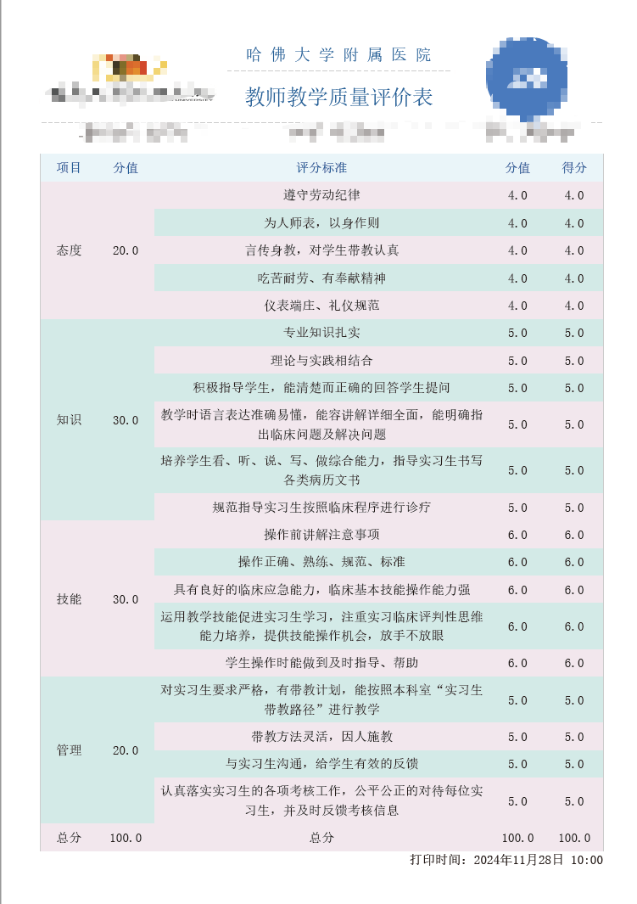

## 一、步骤

1. 准备HTML模板
2. 基于模板生成HTML
3. HTML转PDF

## 二、引入 Thymeleaf 相关依赖

~~~xml
<dependency>
   <groupId>org.springframework.boot</groupId>
   <artifactId>spring-boot-starter-thymeleaf</artifactId>
</dependency>

<dependency>
   <groupId>ognl</groupId>
   <artifactId>ognl</artifactId>
   <version>3.2</version>
</dependency>
~~~

## 三、准备 HTML 模板

`resources/templates`下新建页面**EvaluateTwoLevel.html**

~~~html
<!DOCTYPE html PUBLIC "-//W3C//DTD XHTML 1.0 Transitional//EN"
        "http://www.w3.org/TR/xhtml1/DTD/xhtml1-transitional.dtd">
<!--suppress HtmlUnknownTag -->
<html xmlns:th="http://www.thymeleaf.org" xmlns="http://www.w3.org/1999/html" lang="zh">
<head>
    <meta http-equiv="Content-Type" content="text/html; charset=utf-8"/>
    <title>二级评分表</title>
    
</head>
<body>

<!-- 表头信息 colspan="3" 横向合并  rowspan="2" 纵向合并-->
<!-- 边框线 border="0" 虚线 border="none" 不显示 -->
<table width="100%" border="none" cellspacing="0" cellpadding="0" align="center">
    <tr border="none">
        <td align="center" class="tenant" width="20%" height="60" rowspan="2"></td>
        <td align="center" class="tenant" width="40%" height="60" th:text="${evaluateTwoItem.tenantName}"></td>
        <td align="center" class="tenant" width="20%" height="60" rowspan="2"></td>
    </tr>
    <tr border="none">
        <td align="center" class="biaoti" height="60" th:text="${evaluateTwoItem.title}"></td>
    </tr>
    <tr border="none">
        <td align="center" width="33%" height="25" th:text="${evaluateTwoItem.evaluateUserName}"></td>
        <td align="center" width="33%" height="25" th:text="${evaluateTwoItem.jobTitleName}"></td>
        <td align="center" width="33%" height="25" th:text="${evaluateTwoItem.deptName}"></td>
    </tr>
</table>

<!-- 评分内容信息 -->
<table width="100%" border="0" cellspacing="1" cellpadding="4" bgcolor="#cccccc" class="tabtop13" align="center">
    <tr>
        <td width="10%" class="btbg font-center titfont">项目</td>
        <td width="10%" class="btbg font-center titfont">分值</td>
        <td width="60%" class="btbg font-center titfont">评分标准</td>
        <td width="10%" class="btbg font-center titfont">分值</td>
        <td width="10%" class="btbg font-center titfont">得分</td>
    </tr>

    

        <th:block th:each="evaluateContent, contentStats : ${evaluateTwoItem.evaluateContentList}">
            <tr>
                <td th:text="${evaluateContent.twoItem}" th:rowspan="${evaluateContent.children.size()}"
                    th:class="${contentStats.index % 2 == 0} ? 'btbg4':'btbg3'"></td>
                <td th:text="${evaluateContent.twoScore}" th:rowspan="${evaluateContent.children.size()}"
                    th:class="${contentStats.index % 2 == 0} ? 'btbg4':'btbg3'"></td>
                <td th:class="${contentStats.index % 2 == 0} ? 'btbg4':'btbg3'"
                    th:text="${evaluateContent.children.get(0).content}"></td>
                <td th:class="${contentStats.index % 2 == 0} ? 'btbg4':'btbg3'"
                    th:text="${evaluateContent.children.get(0).scorePoints}"></td>
                <td th:class="${contentStats.index % 2 == 0} ? 'btbg4':'btbg3'"
                    th:text="${evaluateContent.children.get(0).score}"></td>
            </tr>
            <tr th:each="child, childStats : ${evaluateContent.children}" th:if="${!childStats.first}">
                <td th:class="${(contentStats.index + childStats.index) % 2 == 0} ? 'btbg4':'btbg3'"
                    th:text="${child.content}"></td>
                <td th:class="${(contentStats.index + childStats.index) % 2 == 0} ? 'btbg4':'btbg3'"
                    th:text="${child.scorePoints}"></td>
                <td th:class="${(contentStats.index + childStats.index) % 2 == 0} ? 'btbg4':'btbg3'"
                    th:text="${child.score}"></td>
            </tr>
        </th:block>
    

</table>
<!-- 底部信息 -->
<table width="100%" border="0" cellspacing="0" cellpadding="0" align="center">
    <tr>
        <td align="right" height="25" th:text="${evaluateTwoItem.time}"></td>
    </tr>
</table>
</body>
</html>

~~~

## 四、基于模板生成HTML

**EvaluateTwoController.java**

~~~java
/**
 * @Author: xxl
 * @Date: 2024/11/27 18:14
 */
@RunWith(SpringRunner.class)
@SpringBootTest
public class EvaluateTwoController {

    @Resource
    private TemplateEngine templateEngine;

    @Test
    public void test() throws Exception {
        // 准备数据
        List<EvaluateTwoContent> evaluateTwoContents = initData();
        // 转换成html
        EvaluateTwoItem build = EvaluateTwoItem.builder()
                .tenantName("哈 佛 大 学 附 属 医 院")
                .logo("https://ek02.oss-cn-qingdao.aliyuncs.com/微信图片_20240125105054.png")
                .qrcode("https://oss.lcsxs.com/shandong/jinan/ykyxfstasrmyy/icon1732086712610.png")
                .title("教师教学质量评价表")
                .time("打印时间：2024年11月28日 10:00")
                .evaluateUserName("被评价人：张可欣")
                .jobTitleName("职称：主任医师")
                .deptName("科室：神经内科")
                .evaluateContentList(evaluateTwoContents)
                .build();
        String html = parseHtml(build);

        System.out.println(html);
        // HTML 转换成 PDF
        PdfUtils.convertToPdf(html);
    }

    /**
     * 将 EvaluateTwoItem 中的数据渲染到 EvaluateTwoLevel 这个模板上
     *
     * @param EvaluateTwoItem 包含信息的 EvaluateTwoItem
     * @return 数据渲染成功后的 HTML 字符串
     */
    public String parseHtml(EvaluateTwoItem EvaluateTwoItem) {
        Context context = new ContextBuilder().set("evaluateTwoItem", EvaluateTwoItem).build();
        return templateEngine.process("EvaluateTwoLevel.html", context);
    }

    /**
     * 准备数据
     *
     * @return
     */
    public List<EvaluateTwoContent> initData() {
        List<EvaluateTwoContent> appInfoList1 = new ArrayList<>();
        EvaluateTwoContent build1 = EvaluateTwoContent.builder().content("遵守劳动纪律").scorePoints(4.0).score(4.0).build();
        EvaluateTwoContent build2 = EvaluateTwoContent.builder().content("为人师表，以身作则").scorePoints(4.0).score(4.0).build();
        EvaluateTwoContent build3 = EvaluateTwoContent.builder().content("言传身教，对学生带教认真").scorePoints(4.0).score(4.0).build();
        EvaluateTwoContent build4 = EvaluateTwoContent.builder().content("吃苦耐劳、有奉献精神").scorePoints(4.0).score(4.0).build();
        EvaluateTwoContent build5 = EvaluateTwoContent.builder().content("仪表端庄、礼仪规范").scorePoints(4.0).score(4.0).build();
        appInfoList1.add(build1);
        appInfoList1.add(build2);
        appInfoList1.add(build3);
        appInfoList1.add(build4);
        appInfoList1.add(build5);
        List<EvaluateTwoContent> appInfoList2 = new ArrayList<>();
        EvaluateTwoContent build6 = EvaluateTwoContent.builder().content("专业知识扎实").scorePoints(5.0).score(5.0).build();
        EvaluateTwoContent build7 = EvaluateTwoContent.builder().content("理论与实践相结合").scorePoints(5.0).score(5.0).build();
        EvaluateTwoContent build8 = EvaluateTwoContent.builder().content("积极指导学生，能清楚而正确的回答学生提问").scorePoints(5.0).score(5.0).build();
        EvaluateTwoContent build9 = EvaluateTwoContent.builder().content("教学时语言表达准确易懂，能容讲解详细全面，能明确指出临床问题及解决问题").scorePoints(5.0).score(5.0).build();
        EvaluateTwoContent build10 = EvaluateTwoContent.builder().content("培养学生看、听、说、写、做综合能力，指导实习生书写各类病历文书").scorePoints(5.0).score(5.0).build();
        EvaluateTwoContent build11 = EvaluateTwoContent.builder().content("规范指导实习生按照临床程序进行诊疗").scorePoints(5.0).score(5.0).build();
        appInfoList2.add(build6);
        appInfoList2.add(build7);
        appInfoList2.add(build8);
        appInfoList2.add(build9);
        appInfoList2.add(build10);
        appInfoList2.add(build11);
        List<EvaluateTwoContent> appInfoList3 = new ArrayList<>();
        EvaluateTwoContent build12 = EvaluateTwoContent.builder().content("操作前讲解注意事项").scorePoints(6.0).score(6.0).build();
        EvaluateTwoContent build13 = EvaluateTwoContent.builder().content("操作正确、熟练、规范、标准").scorePoints(6.0).score(6.0).build();
        EvaluateTwoContent build14 = EvaluateTwoContent.builder().content("具有良好的临床应急能力，临床基本技能操作能力强").scorePoints(6.0).score(6.0).build();
        EvaluateTwoContent build15 = EvaluateTwoContent.builder().content("运用教学技能促进实习生学习，注重实习临床评判性思维能力培养，提供技能操作机会，放手不放眼").scorePoints(6.0).score(6.0).build();
        EvaluateTwoContent build16 = EvaluateTwoContent.builder().content("学生操作时能做到及时指导、帮助").scorePoints(6.0).score(6.0).build();
        appInfoList3.add(build12);
        appInfoList3.add(build13);
        appInfoList3.add(build14);
        appInfoList3.add(build15);
        appInfoList3.add(build16);
        List<EvaluateTwoContent> appInfoList4 = new ArrayList<>();
        EvaluateTwoContent build17 = EvaluateTwoContent.builder().content("对实习生要求严格，有带教计划，能按照本科室“实习生带教路径”进行教学").scorePoints(5.0).score(5.0).build();
        EvaluateTwoContent build18 = EvaluateTwoContent.builder().content("带教方法灵活，因人施教").scorePoints(5.0).score(5.0).build();
        EvaluateTwoContent build19 = EvaluateTwoContent.builder().content("与实习生沟通，给学生有效的反馈").scorePoints(5.0).score(5.0).build();
        EvaluateTwoContent build20 = EvaluateTwoContent.builder().content("认真落实实习生的各项考核工作，公平公正的对待每位实习生，并及时反馈考核信息").scorePoints(5.0).score(5.0).build();
        appInfoList4.add(build17);
        appInfoList4.add(build18);
        appInfoList4.add(build19);
        appInfoList4.add(build20);

        List<EvaluateTwoContent> appInfoList5 = new ArrayList<>();
        EvaluateTwoContent build25 = EvaluateTwoContent.builder().content("总分").scorePoints(100.0).score(100.0).children(appInfoList2).build();
        appInfoList5.add(build25);

        // 一级
        List<EvaluateTwoContent> evaluateContentList = new ArrayList<>();
        EvaluateTwoContent build21 = EvaluateTwoContent.builder().twoItem("态度").twoScore(getTotalScore(appInfoList1)).children(appInfoList1).build();
        EvaluateTwoContent build22 = EvaluateTwoContent.builder().twoItem("知识").twoScore(getTotalScore(appInfoList2)).children(appInfoList2).build();
        EvaluateTwoContent build23 = EvaluateTwoContent.builder().twoItem("技能").twoScore(getTotalScore(appInfoList3)).children(appInfoList3).build();
        EvaluateTwoContent build24 = EvaluateTwoContent.builder().twoItem("管理").twoScore(getTotalScore(appInfoList4)).children(appInfoList4).build();
        EvaluateTwoContent build26 = EvaluateTwoContent.builder().twoItem("总分").twoScore(100.0).children(appInfoList5).build();
        evaluateContentList.add(build21);
        evaluateContentList.add(build22);
        evaluateContentList.add(build23);
        evaluateContentList.add(build24);
        evaluateContentList.add(build26);

        return evaluateContentList;
    }

    /**
     * 标准得分相加总分
     *
     * @param appInfoList
     * @return
     */
    private Double getTotalScore(List<EvaluateTwoContent> appInfoList) {
        return appInfoList.stream().mapToDouble(EvaluateTwoContent::getScore).sum();
    }
}
~~~

**EvaluateTwoItem.java**

~~~java
@Data
@Builder
public class EvaluateTwoItem {

    /**
     * 标题
     */
    private String title;

    /**
     * 时间
     */
    private String time;

    /**
     * 租户
     */
    private String tenantName;

    /**
     * logo
     */
    private String logo;

    /**
     * 二维码
     */
    private String qrcode;

    /**
     * 被评价人
     */
    private String evaluateUserName;

    /**
     * 职称
     */
    private String jobTitleName;

    /**
     * 科室
     */
    private String deptName;

    /**
     * 内容
     */
    private List<EvaluateTwoContent> evaluateContentList;
}
~~~

**EvaluateTwoContent.java**

~~~java
@Data
@Builder
@NoArgsConstructor
@AllArgsConstructor
public class EvaluateTwoContent {

    /**
     * 一级项目
     */
    private String oneItem;

    /**
     * 二级项目
     */
    private String twoItem;

    /**
     * 二级分值
     */
    private Double twoScore;

    /**
     * 标准内容
     */
    private String content;

    /**
     * 占分
     */
    private Double scorePoints;

    /**
     * 得分
     */
    private Double score;

    /**
     * 子集
     */
    private List<EvaluateTwoContent> children;
}
~~~

## 五、使用itextpdf将HTML转换成PDF

引入 itextpdf 相关依赖

~~~xml
<dependency>
    <groupId>com.itextpdf</groupId>
    <artifactId>font-asian</artifactId>
    <version>7.1.13</version>
</dependency>
<dependency>
    <groupId>com.itextpdf</groupId>
    <artifactId>html2pdf</artifactId>
    <version>4.0.5</version>
</dependency>
~~~

Html 转 Pdf 工具类

~~~java
public class PdfUtils {

    /**
     * HTML 转换成 PDF
     *
     * @param html
     * @throws Exception
     */
    public static void convertToPdf(String html) throws Exception {
        // 将 HTML 内容字符串转换为 PDF
        String outPath = "D:\\activity.pdf";
        OutputStream outputStream = new FileOutputStream(outPath);
        PdfWriter pdfWriter = new PdfWriter(outputStream);
        PdfDocument pdfDocument = new PdfDocument(pdfWriter);
        pdfDocument.setDefaultPageSize(PageSize.A4);
        HtmlConverter.convertToPdf(html, pdfDocument, initProperties());
        // 关闭资源
        pdfDocument.close();
        outputStream.close();
    }

    /**
     * pdf 特殊处理
     *
     * @return
     * @throws Exception
     */
    private static ConverterProperties initProperties() throws Exception {
        // 添加中文字体支持
        ConverterProperties properties = new ConverterProperties();
        FontProvider fontProvider = new FontProvider();
        String fontPath = "C:/WINDOWS/Fonts/simsun.ttc,0";
        PdfFont microsoft = PdfFontFactory.createFont(fontPath, PdfEncodings.IDENTITY_H);
        fontProvider.addFont(microsoft.getFontProgram(), PdfEncodings.IDENTITY_H);
        properties.setFontProvider(fontProvider);
        return properties;
    }
}

~~~

## 六、导出效果

