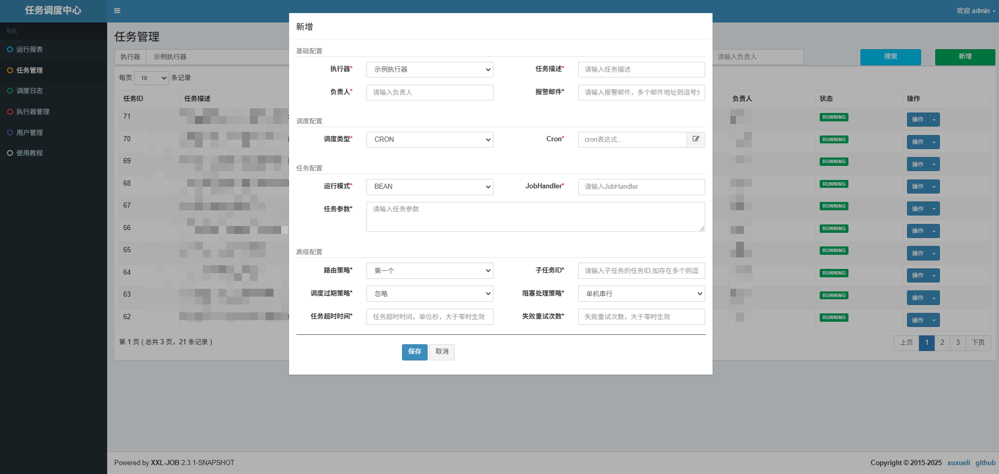
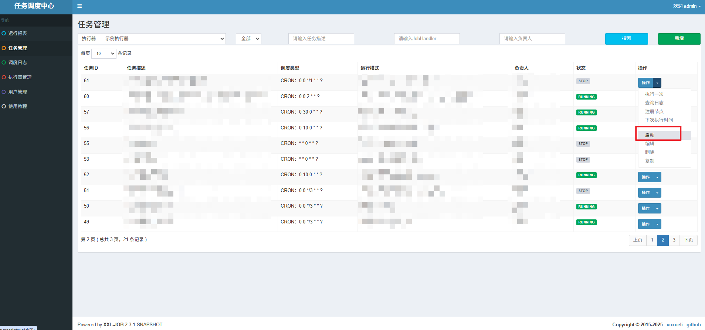
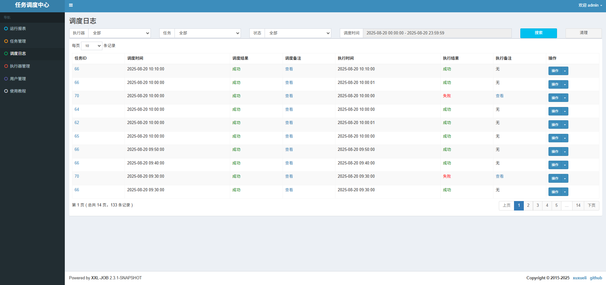

## 在任务管理中创建任务

## 在SpringBoot中创建定时任务

`myJobHandler`是刚才在可视化界面中，`JobHandler`我们自定义的名字

~~~java
import com.xxl.job.core.context.XxlJobHelper;
import com.xxl.job.core.handler.annotation.XxlJob;
import lombok.extern.slf4j.Slf4j;
import org.springframework.stereotype.Component;

@Slf4j
@Component
public class MyXxlJob {

    @XxlJob("myJobHandler")
    public void myJobHandler() throws Exception {
        XxlJobHelper.log("XXL-JOB, 这是我的第一个定时任务，开始执行了");
        log.info("XXL-JOB, 这是我的第一个定时任务，开始执行了");
    }

}
~~~

### 启动任务调度

### 调度日志

点击左侧“调度日志”菜单，查看调度日志，此时我们停止项目运行，会线上调度失败。

