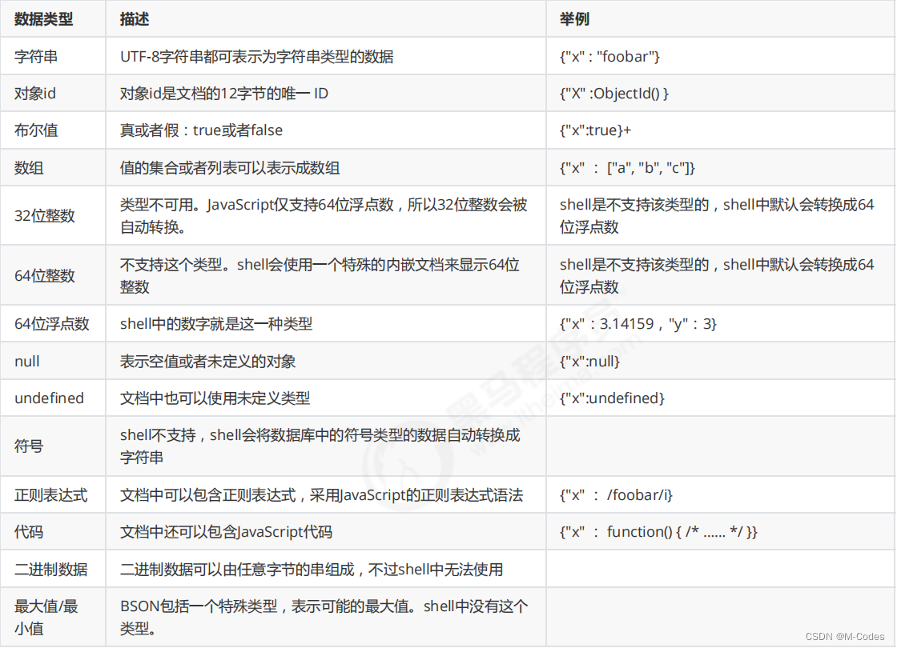

## MongoDB基本概念

### 介绍

- MongoDB是一个基于分布式文件存储的数据库。由C++语言编写。旨在为WEB应用提供可扩展的高性能数据存储解决方案。
- MongoDB是一个介于**关系数据库**和**非关系数据库**之间的产品，是非关系数据库当中功能最丰富，最像关系数据库的，它支持的数据结构非常松散，是类似json的bson格式，因此可以存储比较复杂的数据类型。

- MongoDB最大的特点是它支持的查询语言非常强大，其语法有点类似于面向对象的查询语言，几乎可以实现类似关系数据库**单表查询**的绝大部分功能，而且还支持对数据建立索引。

### 应用场景

传统的关系型数据库(如MySQL)，在数据操作的三高需求以及应对Web2.0的网站需求面前，显得力不从心，而 MongoDB可应对“三高”需求。

- High performance：对数据库**高并发读写**的需求。

- Huge Storage：对海量数据的**高效率存储和访问**的需求。

- High Scalability && High Availability：对数据库的**高可扩展性和高可用性**的需求。

具体应用场景：

- 社交场景，使用 MongoDB存储存储用户信息，以及用户发表的朋友圈信息，通过地理位置索引实现附近的人、地点等功能。
-  游戏场景，使用 MongoDB存储游戏用户信息，用户的装备、积分等直接以内嵌文档的形式存储，方便查询、高效率存储和访问。
-  物流场景，使用 MongoDB存储订单信息，订单状态在运送过程中会不断更新，以 MongoDB内嵌数组的形式来存储，一次查询就能将订单所有的变更读取出来。
- 物联网场景，使用 MongoDB存储所有接入的智能设备信息，以及设备汇报的日志信息，并对这些信息进行多维度的分析。
- 视频直播，使用 MongoDB存储用户信息、点赞互动信息等。

这些应用场景中，数据操作方面的共同特点是：

  （1）数据量大。

  （2）写入操作频繁（读写都很频繁）。

  （3）价值较低的数据，对事务性要求不高。

  对于这样的数据，我们更适合使用 MongoDB来实现数据的存储。

### 什么时候选择MongoDB

1. 应用不需要事务及复杂join支持。
2. 新应用，需求会变，数据模型无法确定，想快速迭代开发。

3. 应用需要2000-3000以上的读写QPS（更高也可以）。

4. 应用需要TB甚至PB级别数据存储。

5. 应用要求存储的数据不丢失。

6. 应用需要99.999%高可用。

7. 应用需要大量的地理位置查询、文本查。

8. 相对MySQL，在以上以用场景可以以更低的成本解决问题（包括学习、开发、运维等成本）。
   

### 体系结构

| SQL术语/概念 | MongoDB术语/概念 | 解释/说明                            |
| ------------ | ---------------- | ------------------------------------ |
| database     | database         | 数据库                               |
| table        | collection       | 数据库表/集合                        |
| row          | document         | 数据记录行/文档                      |
| column       | field            | 数据字段/域                          |
| index        | index            | 索引                                 |
| table joins  |                  | 表连接，MongoDB不支持                |
|              | 嵌入文档         | MongoDB通过嵌入式文档来代替多表连接  |
| primary key  | primary key      | 主键，MongoDB自动将_id字段设置为主键 |

### 数据类型

MongoDB的最小存储单位就是文档document对象。文档document对象对应于关系型数据库的行。数据在MongoDB中以BSON（Binary-JSON）文档的格式存储在磁盘上。

BSON（Binary Serialized Document Format）是一种类json的一种二进制形式的存储格式，简称 Binary JSON；BSON和JSON一样，支持内嵌的文档对象和数组对象，但是BSON有JSON没有的一些数据类型，如Date和Bin Data类型。

BSON采用了类似于C语言结构体的名称、对表示方法，支持内嵌的文档对象和数组对象，具有轻量性、可遍历性、高效性的三个特点，可以有效描述非结构化数据和结构化数据。这种格式的优点是灵活性高，但它的缺点是空间利用率不是很理想。

BSON中，除了基本JSON类型： string，integer，boolean，double，null，array和object，mongo还使用了特殊的数据类型。这些类型包括 date， object id， binary data， regular expression和code。

BSON数据类型参考列表：

**提示**：
shell默认使用64位浮点型数值。{“x”:3.14或{“x”:3}。对于整型值，可以使用NumberInt（4字节符号整数）或 NumberLong（8字节符号整数），{“x”:NumberInt(“3” ){“x”:NumberLong(“3”)}

### 特点

1. 高性能：MongoDB提供高性能的数据持久性。特别是，对嵌入式数据模型的支持减少了数据库系统上I/O活动。

   索引支持更快的查询，并且可以包含来自嵌入式文档和数组的键。（文本索引解决搜索的需求、TTL索引解决历史数据自动过期的需求、地理位置索引可用于构建各种O2O应用）。

   mmapv1、 wiredtiger、 mongorocks（ rocks）、 In-memory等多引擎支持满足各种场景需求。Gridfs解决文件存储的需求。

2. 高可用性：MongoDB的复制工具称为副本集（ replica set），它可提供自动故障转移和数据冗余。

3. 高扩展性：MongoDB提供了水平可扩展性作为其核心功能的一部分。

   分片将数据分布在一组集群的机器上。（海量数据存储，服务能力水平扩展）。

   从3.4开始，MoηgoDB支持基于片键创建数据区域。在一个平衡的集群中， MongoDB将一个区域所覆盖的读写只定向到该区域内的那些片。

4. 丰富的查询支持：MongoDB支持丰富的査询语言，支持读和写操作（CRUD），比如数据聚合、文本搜索和地理空间查询等。

5. 其他特点：如无模式（动态模式）、灵活的文档模型。
   

参考资料

https://blog.csdn.net/efew212efe/article/details/124524863