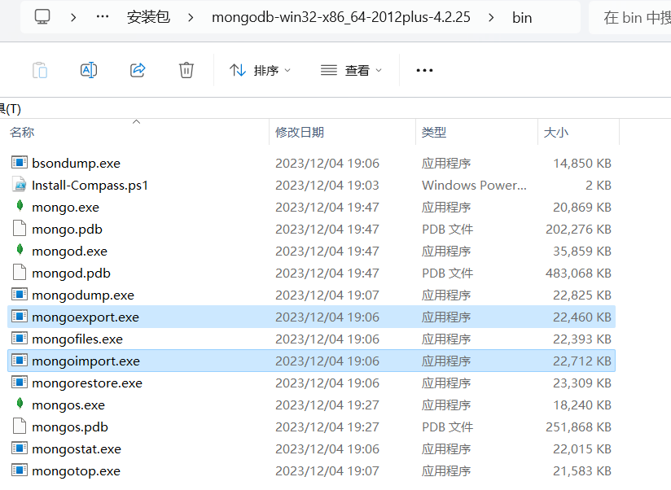
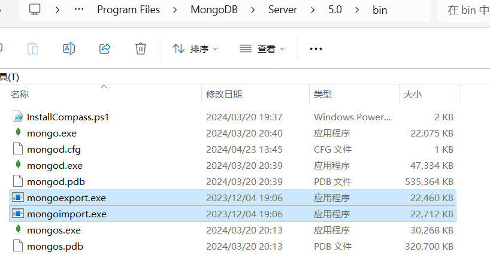
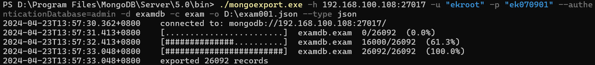
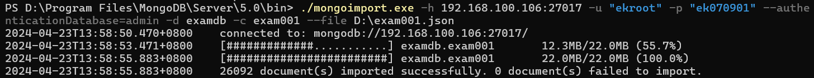

### Mongo工具包介绍

mongo工具包包括管理数据的一些工具 exe 文件，具体如下：

1. mongoexport.exe：导出数据命令工具
2. mongoimport.exe：导入数据命令工具
3. bsondump.exe： 用于将导出的BSON文件格式转换为JSON格式
4. mongodump.exe： 用于从mongodb数据库中导出BSON格式的文件，类似于mysql的dump工具mysqldump
5. mongofiles.exe： 用于和mongoDB的GridFS文件系统交互的命令，并可操作其中的文件，它提供了我们本地系统与GridFS文件系统之间的存储对象接口
6. mongorestore.exe： 用于恢复导出的BSON文件到 mongodb 数据库中
7. mongostat.exe： 当前 mongod 状态监控工具，像linux中监控linux的vmstat
8. mongotop.exe： 提供了一个跟踪mongod数据库花费在读写数据的时间，为每个collection都会记录，默认记录时间是按秒记录

### Mongo工具包下载

MongoDB安装参考之前的文章

安装后，部分版本会自带该工具包，比如下图的 4.x 版本，我用的 5.0 版本没有自带工具包，所以我需要先去官网下载4.x 的安装包文件，然后把 bin 目录下的工具复制到 5.0 版本的 bin 目录下，才能进行数据的导出、导入操作。

将下载的 4.x 里的工具文件复制到 5.0 的安装目录

### 导出导出实战

涉及命令工具：mongoexport、mongoimport

~~~markdown
参数释义：
-h ：指的是 host 主机地址
-u ：指的是用户账号
-p ：指的是账户密码
-d ：指的是数据库 database 简称
-c ：指的是表 collection 简称
-o ：指的是导出路径 output 简称
--file ：指的是需要导入的文件
--help : 查看帮助
~~~

实战示例：将108服务器中examdb库中的exam表复制到106服务器中。

将数据以JSON格式导出到本地

~~~sh
./mongoexport.exe -h 192.168.100.108:27017 -u "root" -p "password" --authenticationDatabase=admin -d examdb -c exam -o D:\exam001.json --type json
~~~

导入到另一条服务器中

~~~sh
./mongoimport.exe -h 192.168.100.106:27017 -u "root" -p "password" --authenticationDatabase=admin -d examdb -c exam001 --file D:\exam001.json
~~~

