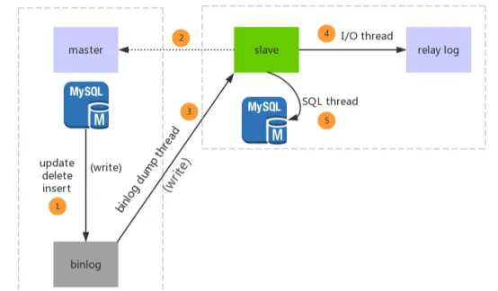

## 一、概述

主从复制是指将主数据库的DDL和DML操作通过二进制日志传到从库服务器中，然后在从库上对这些日志重新执行（也叫重做），从而使得从库和主库的数据保持同步。

MySQL支持一台主库同时向多台从库进行复制，从库同时也可以作为其他从服务器的主库，实现链状复制。

MySQL复制的有点主要包含以下三个方面：

1. 主库出现问题，可以快速切换到从库提供服务。
2. 实现读写分离，降低主库的访问压力。
3. 可以在从库中执行备份，以避免备份期间影响主库服务。

## 二、原理

MySQL的主从复制原理如下。
在多个源的复制中，每一个复制源都会打开一个复制通道，这是一个长链接。并且每个复制源都有自己的 IO线程、一个或者多个点 SQL 线程以及 realy log。复制源接收到事务时会将其添加到relay log 中，然后通过SQL thread执行。相关官方文档如下：

```plain
In MySQL multi-source replication, a replica opens multiple replication channels,
one for each replication source server. The replication channels represent the 
path of transactions flowing from a source to the replica. Each replication 
channel has its own receiver (I/O) thread, one or more applier (SQL) threads, and
relay log. When transactions from a source are received by a channel's receiver 
thread, they are added to the channel's relay log file and passed through to the 
channel's applier threads. This enables each channel to function independently.
```

复制分为三步：

1. Master主库在事务提交时，会把数据变更记录在二进制日志文件Binlog中。
2. 从库读取主库的二进制日志文件Binlog，写入到从库的中继日志Relay Log。
3. slave重做中继日志中的事件，将改变反映它自己的数据。

主从复制应该是分为**第一次建立连接**和**增量数据同步**过程。




### 第一次建立连接

备库 B 跟主库 A 之间维持了一个长连接。主库 A 内部有一个io_thread线程，专门用于服务备库 B 的这个长连接。一个事务日志同步的完整过程是这样的：

1. 在备库 B 上通过 change master 命令，设置主库 A 的 IP、端口、用户名、密码，以及要从哪个位置开始请求 binlog，这个位置包含文件名和日志偏移量。

```plain
CHANGE MASTER TO 
MASTER_HOST='192.168.56.104',
MASTER_USER='root',
MASTER_PASSWORD='qwer_123',
MASTER_LOG_FILE='mysql-bin.000001',MASTER_LOG_POS=154;
```

1. 备库 B 上执行start slave命令，这时候备库会启动两个线程，就是图中的 io_thread 和 sql_thread。其中 io_thread 负责与主库建立连接。
2. 主库 A 校验完用户名、密码后，开始按照备库 B 传过来的位置，从本地读取 binlog，发给备库 B。
3. 备库 B 拿到 binlog 后，写到relay log（中继日志）中。
4. 备库的 sql_thread 读取 relay log，解析出日志里的命令，并且回放执行。

### 增量同步详细流程

详细过程如下：

1. 客户端发起 update 请求，MySQL server 端收到请求。
2. 生成被修改数据行对应的 undolog。
3. 执行update成功写入内存。
4. InnboDB 生成 redo log ，此时处于 prepare阶段。
5. server 层生成binlog，事务提交时binlog做持久化，此时binlog便可以开始被同步到从库了。
6. redo log 做磁盘持久化，同时向客户端返回update的执行新结果（默认异步复制）。
7. 主库发送生成的 binlog 数据。
8. 从库的io_thread处理Maste传输过来的数据，保存为relay log。从库服务器会在一定时间间隔内对master二进制日志进行探测其是否发生改变，如果发生改变，则开始一个I/OThread请求master二进制事件。
9. SQL thread 读取relay log，解析并且在从库中重放执行，数据同步完成。最后I/OThread和SQLThread将进入睡眠状态，等待下一次被唤醒。

## 三、搭建

### 主库配置

1、修改配置文件 /etc/my.cnf

```shell
#mysql服务ID，保证整个集群环境中唯一，取值范围: 1-2^32-1，默认为1
server-id=1
#是否只读,1代表只读,0代表读写
read-only=0
#忽略的数据,指不需要同步的数据库
#binlog-ignore-db=mysql
#指定同步的数据库
#binlog-do-db=db01
```

2、重启MySQL服务器

```shell
systemctl restart mysqld
```

3、登录mysql，创建远程连接的账号，并授予主从复制权限

```shell
#创建用户，并设置密码，该用户可在任意主机连接该MSOL服条
CREATE USER 'write'@'%' IDENTIFIED WITH mysql_native_password BY 'Root@123456';
#为 'read'@'%' 用户分配主从复制权限
GRANT REPLICATION SLAVE ON *.* TO 'write'@'%';
```

4、通过指令，查看二讲制日志坐标

```shell
show master status;
```

字段含义说明：

file：从哪个日志文件开始推送日志文件

position：从哪个位置开始推送日志

binlog_do_db：指定需要同步的数据库

binlog_ignore_db：指定不需要同步的数据库


### 从库配置

1、修改配置文件 /etc/my.cnf

```shell
#mysql服务ID，保证整个集群环境中唯一，取值范围: 1-2^32-1，和主库不一样即可
server-id=2
#是否只读,1代表只读,0代表读写
read-only=1
#超级管理员只读
#super-read-only=1
```

2、重启MySQL服务器

```shell
systemctl restart mysqld
```

3、登录mysql，设置主库配置

```sql
CHANGE REPLICATION SOURCE TO SOURCE_HOST='xxx.xxx',SOURCE_USER='XXX',SOURCE_LOG_FILE='xxx',SOURCE_LOG_POS=xxx;
```

上述时8.0.23中的语法，如是时mysql8.0.23之前的版本，执行如下SQL：

```sql
CHANGE MASTER TO MASTER_HOST='xxx.xxx.xxx.xxx',MASTER_USER='xxx',MASTER_PASSWORD='xxx',MASTER_LOG_FILE='xxx',MASTER_LOG_POS=xxx;
```

4、开启同步操作

```shell
start replica; # 8.0.22之后
start slave; # 8.0.22之前
```

5、查看主从同步状态

```shell
show replica status; # 8.0.22之后  show replica status\G;  # 转换成行展示
show slave status; # 8.0.22之前
```

## 四、测试

1.在主库上创建数据库、表，并插入数据

2.在从库中查询数据，验证主从是否同步


## 参考资料

[1]. [黑马MySQL数据库进阶教程，轻松掌握mysql主从复制从原理到搭建全流程](https://www.bilibili.com/video/BV1jT411r77s)

[2]. [mysql运维——主从复制](https://www.dianjilingqu.com/710745.html)

[3]. [主从复制实现原理详解](https://www.cnblogs.com/shoshana-kong/p/17318124.html)

[4]. [binlog_ignore_db 参数的具体使用](https://www.jb51.net/article/201609.htm)

[5]. https://blog.csdn.net/qq_41772936/article/details/80380950

[6]. https://blog.csdn.net/m0_62473957/article/details/124140928